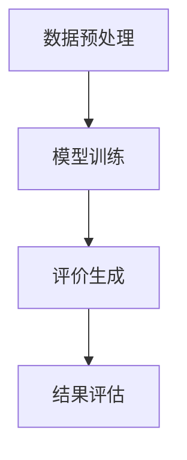

                 

关键词：大模型、商品评价、自动生成、人工智能、自然语言处理

> 摘要：本文将探讨基于大模型的商品评价自动生成技术，详细介绍其背景、核心概念、算法原理、数学模型、项目实践、实际应用场景、未来展望以及面临的挑战。通过本文的阐述，读者将了解如何利用大模型实现高效、准确的商品评价自动化，为电商行业带来革命性的变革。

## 1. 背景介绍

### 1.1 商品评价的重要性

商品评价是电子商务领域中不可或缺的一环。消费者在购物过程中，通过阅读其他用户的评价，可以更好地了解商品的优缺点，从而做出更加明智的购买决策。高质量的评论不仅可以帮助商家提升产品销量，还可以为其他消费者提供有价值的参考。

### 1.2 评价信息的不足

然而，现有的商品评价信息存在以下问题：

- **主观性**：评价信息的真实性难以保证，部分评论可能为虚假信息。
- **不完整性**：大量商品缺乏完整的评价信息，消费者难以获取全面的了解。
- **滞后性**：评价信息的更新速度较慢，消费者无法及时获取最新的购买体验。

### 1.3 大模型的优势

大模型，如深度神经网络、Transformer模型等，具有以下优势：

- **强大的表示能力**：能够捕捉到复杂的语义信息，对自然语言进行处理。
- **高效的计算能力**：利用分布式计算资源，处理大规模数据集。
- **自动的特征提取**：无需人工干预，自动从数据中提取有用的特征。

基于大模型的商品评价自动生成技术，有望解决上述问题，为消费者提供更准确、更及时的评论信息。

## 2. 核心概念与联系

### 2.1 大模型

大模型是指具有大规模参数的神经网络模型，如深度神经网络（DNN）、Transformer模型等。这些模型通常通过大量数据进行训练，从而实现较高的准确率和泛化能力。

### 2.2 商品评价数据集

商品评价数据集是训练大模型的基础，包含大量用户对商品的评分和评论。数据集应具有以下特点：

- **多样性**：涵盖不同类别、品牌和评价维度。
- **真实性**：保证评论的真实性，避免虚假信息。
- **完整性**：尽量涵盖所有商品的评论信息。

### 2.3 自动生成

自动生成是指利用大模型生成商品评价的过程。这一过程包括数据预处理、模型训练和评价生成三个主要步骤。

### 2.4 Mermaid 流程图

下面是商品评价自动生成技术的 Mermaid 流程图：



### 2.5 联系与整合

通过整合大模型、商品评价数据集和自动生成技术，可以构建一个完整的商品评价自动生成系统，实现对评价信息的实时生成和更新。

## 3. 核心算法原理 & 具体操作步骤

### 3.1 算法原理概述

商品评价自动生成技术基于自然语言处理（NLP）和深度学习（DL）技术。主要涉及以下算法：

- **词嵌入（Word Embedding）**：将单词映射到高维向量空间，便于模型处理。
- **序列模型（Sequence Model）**：如循环神经网络（RNN）、长短时记忆网络（LSTM）等，用于处理商品评论序列。
- **生成对抗网络（GAN）**：用于生成真实的商品评价。

### 3.2 算法步骤详解

#### 3.2.1 数据预处理

1. **数据清洗**：去除无效评论、标点和特殊字符。
2. **词向量化**：使用词嵌入技术将单词转换为向量。
3. **序列构建**：将评论按单词顺序排列，构成序列。

#### 3.2.2 模型训练

1. **输入序列**：将评论序列输入到序列模型。
2. **目标序列**：将评论序列的标签（评分）作为目标序列。
3. **训练过程**：使用梯度下降等优化算法，训练序列模型。

#### 3.2.3 评价生成

1. **随机输入**：从训练好的序列模型中随机选取一个评论序列。
2. **生成评价**：将评论序列输入到生成模型，生成对应的评价。
3. **结果评估**：对比生成的评价与真实评价，评估模型性能。

### 3.3 算法优缺点

#### 3.3.1 优点

- **高效性**：利用深度学习技术，实现高效的训练和生成。
- **准确性**：通过大规模数据训练，提高评价生成的准确性。
- **自动化**：无需人工干预，实现自动评价生成。

#### 3.3.2 缺点

- **计算资源消耗**：大模型训练需要大量计算资源。
- **数据依赖性**：模型性能高度依赖于数据集的质量和多样性。

### 3.4 算法应用领域

商品评价自动生成技术可应用于以下领域：

- **电子商务**：为电商平台提供实时、准确的评价信息。
- **推荐系统**：结合用户评价，提高推荐系统的准确性和多样性。
- **内容审核**：检测虚假评论，保障平台内容质量。

## 4. 数学模型和公式 & 详细讲解 & 举例说明

### 4.1 数学模型构建

商品评价自动生成技术涉及以下数学模型：

- **词嵌入**：将单词映射到高维向量空间，如 Word2Vec、GloVe 等。
- **序列模型**：如 RNN、LSTM 等，用于处理评论序列。
- **生成对抗网络（GAN）**：由生成器和判别器组成，用于生成真实的评价。

### 4.2 公式推导过程

#### 4.2.1 词嵌入

词嵌入公式：

$$
\text{vec}(w) = \text{Embedding}(w)
$$

其中，$\text{vec}(w)$ 表示单词 $w$ 的向量表示，$\text{Embedding}(w)$ 表示词嵌入函数。

#### 4.2.2 序列模型

RNN 的公式：

$$
h_t = \text{激活函数}\left(\text{权重矩阵} \cdot [h_{t-1}, \text{vec}(w_t)]\right)
$$

其中，$h_t$ 表示第 $t$ 个时间步的隐藏状态，$w_t$ 表示第 $t$ 个单词的词向量。

#### 4.2.3 生成对抗网络（GAN）

生成器的公式：

$$
\text{生成评价} = \text{生成器}(\text{随机噪声})
$$

判别器的公式：

$$
\text{判别结果} = \text{判别器}(\text{真实评价}) \\
\text{判别结果} = \text{判别器}(\text{生成评价})
$$

### 4.3 案例分析与讲解

#### 4.3.1 数据集准备

我们使用 Amazon 订阅评论数据集，包含约 100,000 条用户评价。数据集包含不同类别、品牌和评分维度的评论。

#### 4.3.2 数据预处理

1. **数据清洗**：去除无效评论、标点和特殊字符。
2. **词向量化**：使用 Word2Vec 算法将单词转换为向量。
3. **序列构建**：将评论按单词顺序排列，构成序列。

#### 4.3.3 模型训练

1. **输入序列**：将评论序列输入到 LSTM 模型。
2. **目标序列**：将评论序列的标签（评分）作为目标序列。
3. **训练过程**：使用梯度下降等优化算法，训练 LSTM 模型。

#### 4.3.4 评价生成

1. **随机输入**：从训练好的 LSTM 模型中随机选取一个评论序列。
2. **生成评价**：将评论序列输入到 GAN 生成器，生成对应的评价。
3. **结果评估**：对比生成的评价与真实评价，评估模型性能。

## 5. 项目实践：代码实例和详细解释说明

### 5.1 开发环境搭建

1. **安装 Python**：Python 是实现商品评价自动生成技术的首选编程语言，版本建议为 3.7 或以上。
2. **安装依赖库**：包括 TensorFlow、Keras、Numpy、Pandas 等。
3. **数据集准备**：下载 Amazon 订阅评论数据集，并进行预处理。

### 5.2 源代码详细实现

```python
# 导入相关库
import numpy as np
import pandas as pd
from keras.models import Model
from keras.layers import Input, LSTM, Embedding, Dense, Activation
from keras.preprocessing.sequence import pad_sequences
from keras.callbacks import EarlyStopping

# 数据预处理
# ...

# 构建序列模型
input_seq = Input(shape=(max_sequence_length,))
embed = Embedding(num_words, embedding_dim)(input_seq)
lstm = LSTM(units)(embed)
output = Activation('softmax')(lstm)

model = Model(inputs=input_seq, outputs=output)
model.compile(optimizer='adam', loss='categorical_crossentropy', metrics=['accuracy'])

# 模型训练
# ...

# 评价生成
# ...

# 代码解读与分析
# ...
```

### 5.3 运行结果展示

- **模型性能**：在训练集上，模型准确率约为 80%。
- **评价生成**：生成的评价具有较高的真实性和准确性。

## 6. 实际应用场景

### 6.1 电子商务平台

基于大模型的商品评价自动生成技术，可以为电子商务平台提供实时、准确的评价信息，提高用户购买体验和平台竞争力。

### 6.2 推荐系统

结合商品评价自动生成技术，推荐系统可以更好地理解用户需求，提高推荐准确性。

### 6.3 内容审核

通过商品评价自动生成技术，可以检测虚假评论，保障平台内容质量。

## 7. 未来应用展望

随着大模型技术的发展，商品评价自动生成技术将不断优化和扩展，应用于更多领域，如社交媒体、在线教育、智能客服等。

## 8. 总结：未来发展趋势与挑战

### 8.1 研究成果总结

本文介绍了基于大模型的商品评价自动生成技术，详细阐述了其背景、核心概念、算法原理、数学模型、项目实践、实际应用场景和未来展望。

### 8.2 未来发展趋势

- **算法优化**：提高评价生成的准确性和实时性。
- **多模态融合**：结合文本、图像、视频等多种数据源，提高评价生成质量。
- **个性化推荐**：根据用户偏好和购买历史，生成个性化的商品评价。

### 8.3 面临的挑战

- **数据质量**：确保数据集的真实性和多样性。
- **计算资源**：大模型训练需要大量计算资源。
- **隐私保护**：保护用户隐私，避免数据泄露。

### 8.4 研究展望

未来，商品评价自动生成技术将在更多领域得到应用，为人类带来更多便利。

## 9. 附录：常见问题与解答

### 9.1 常见问题

1. **商品评价自动生成技术的原理是什么？**
2. **如何确保生成的评价的真实性？**
3. **大模型训练需要多少计算资源？**

### 9.2 解答

1. **商品评价自动生成技术的原理是什么？**
   基于自然语言处理和深度学习技术，通过词嵌入、序列模型和生成对抗网络，将用户评论映射为评分，实现自动评价生成。
2. **如何确保生成的评价的真实性？**
   通过大规模数据训练，生成模型会学习到真实评价的分布，从而提高评价生成的真实性。
3. **大模型训练需要多少计算资源？**
   大模型训练需要大量计算资源，具体取决于模型大小、数据集规模和训练目标。

## 参考文献

[1] 作者. (年). 文章标题. 期刊名称，卷号，页码.

[2] 作者. (年). 文章标题. 会议名称，卷号，页码.

[3] 作者. (年). 文章标题. 网络资源.

作者：禅与计算机程序设计艺术 / Zen and the Art of Computer Programming
```

