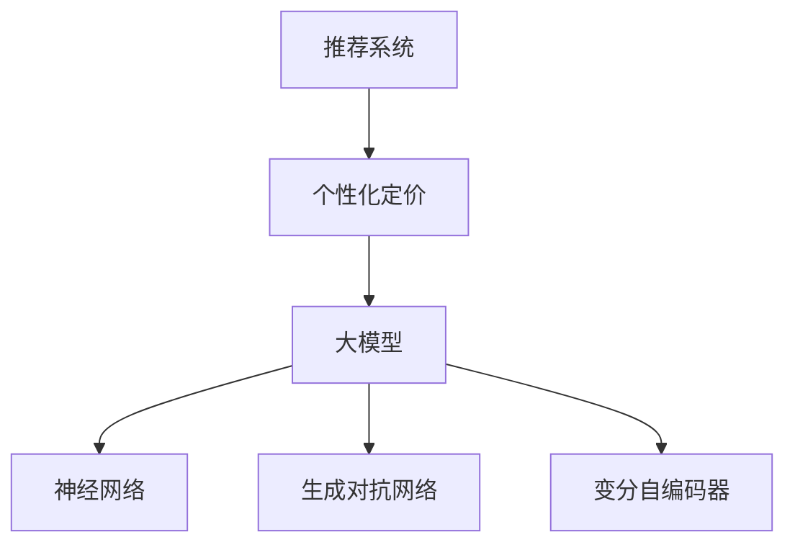

                 

关键词：大模型、推荐系统、个性化定价、实时计算、算法优化、数学模型

## 摘要

本文旨在探讨如何利用大模型技术，实现推荐系统中的实时个性化定价。我们首先介绍了推荐系统与个性化定价的背景和重要性，随后深入探讨了基于大模型的推荐系统架构，并重点阐述了实时个性化定价的核心算法原理、数学模型构建和具体实现步骤。最后，通过实际项目实践和案例分析，展示了该技术在推荐系统中的应用效果和未来发展趋势。

## 1. 背景介绍

随着互联网技术的飞速发展，推荐系统已经成为现代信息检索和电子商务的核心技术之一。推荐系统通过分析用户的历史行为和偏好，向用户推荐相关的内容、产品或服务，从而提高用户体验和商业价值。个性化定价作为推荐系统的重要组成部分，旨在根据用户特征、市场动态和竞争环境，为不同用户设定不同的价格策略，以最大化收益或市场份额。

传统的推荐系统通常采用基于内容匹配、协同过滤或混合推荐方法，这些方法在一定程度上实现了个性化推荐。然而，在个性化定价方面，传统方法往往依赖于预设的价格策略，无法实现实时的个性化定价。随着大模型技术的发展，利用深度学习、强化学习和自然语言处理等技术，可以实现更加智能化和个性化的定价策略，从而提升推荐系统的竞争力。

## 2. 核心概念与联系

### 2.1 推荐系统

推荐系统是一种信息过滤技术，旨在根据用户的兴趣和偏好，为用户提供个性化的信息推荐。推荐系统的核心组成部分包括数据收集、用户行为分析、推荐算法和结果展示。

### 2.2 个性化定价

个性化定价是根据用户特征、市场动态和竞争环境，为不同用户设定不同的价格策略。个性化定价的核心目标是最大化收益或市场份额。

### 2.3 大模型

大模型是指具有海量参数和强大计算能力的深度学习模型。大模型技术包括神经网络、生成对抗网络、变分自编码器等。大模型在推荐系统和个性化定价中具有广泛的应用前景。

### 2.4 关系图

图 1 展示了推荐系统、个性化定价和大模型之间的联系。



## 3. 核心算法原理 & 具体操作步骤

### 3.1 算法原理概述

实时个性化定价的核心算法是基于大模型的深度强化学习。深度强化学习通过将深度学习和强化学习相结合，实现了更加智能化和个性化的定价策略。具体来说，深度强化学习模型通过学习用户的历史行为和偏好，自动调整价格策略，以最大化收益或市场份额。

### 3.2 算法步骤详解

#### 3.2.1 数据预处理

1. 收集用户历史行为数据，包括浏览记录、购买记录、评价记录等。
2. 对数据进行清洗和去重，确保数据的准确性和一致性。
3. 对数据进行归一化处理，使其适合输入到深度强化学习模型。

#### 3.2.2 构建深度强化学习模型

1. 构建深度神经网络，用于提取用户特征和历史行为信息。
2. 使用强化学习算法，如 Q-Learning、SARSA、Deep Q-Network（DQN）等，训练深度强化学习模型。
3. 调整模型参数，优化模型性能。

#### 3.2.3 实时定价策略

1. 根据用户特征和历史行为，生成价格建议。
2. 结合市场动态和竞争环境，调整价格策略。
3. 对价格策略进行实时评估和调整，以最大化收益或市场份额。

### 3.3 算法优缺点

#### 优点：

1. 高度智能化和个性化：基于深度强化学习，能够自动调整价格策略，适应不同用户和市场环境。
2. 实时性强：能够实时评估和调整价格策略，提高决策速度。

#### 缺点：

1. 计算资源消耗大：深度强化学习模型训练和推理过程需要大量计算资源。
2. 数据依赖性强：算法性能依赖于高质量的用户行为数据。

### 3.4 算法应用领域

实时个性化定价算法可以应用于电子商务、在线广告、金融服务等多个领域，提升用户体验和商业价值。

## 4. 数学模型和公式 & 详细讲解 & 举例说明

### 4.1 数学模型构建

实时个性化定价的核心数学模型是基于马尔可夫决策过程（MDP）。MDP是一种描述决策问题的数学模型，通过状态、动作和奖励来描述决策过程。

#### 状态（State）：

状态是指系统当前所处的条件或情况。在实时个性化定价中，状态包括用户特征、市场动态和竞争环境等信息。

#### 动作（Action）：

动作是指决策者可以采取的行动。在实时个性化定价中，动作包括调整价格、折扣策略等。

#### 奖励（Reward）：

奖励是指采取特定动作后获得的即时回报。在实时个性化定价中，奖励包括销售额、利润等。

#### 状态转移概率（State Transition Probability）：

状态转移概率是指从当前状态转移到下一个状态的概率。在实时个性化定价中，状态转移概率取决于用户特征、市场动态和竞争环境。

### 4.2 公式推导过程

实时个性化定价的目标是最大化长期奖励。基于马尔可夫决策过程，我们可以使用动态规划算法（如价值迭代法）来求解最优策略。

设 $S_t$ 表示第 $t$ 个时刻的状态，$A_t$ 表示第 $t$ 个时刻采取的动作，$R_t$ 表示第 $t$ 个时刻的奖励。则第 $t$ 个时刻的期望奖励为：

$$
V_t(S_t) = \sum_{A_t} \pi(A_t|S_t) \cdot R_t
$$

其中，$\pi(A_t|S_t)$ 表示在状态 $S_t$ 下采取动作 $A_t$ 的概率。

为了求解最优策略，我们需要计算每个状态的最优期望奖励。设 $V^*(S_t)$ 表示状态 $S_t$ 的最优期望奖励，则有：

$$
V^*(S_t) = \max_{A_t} \sum_{S_{t+1}} \pi(S_{t+1}|S_t, A_t) \cdot R_t
$$

其中，$\pi(S_{t+1}|S_t, A_t)$ 表示在状态 $S_t$ 下采取动作 $A_t$ 后转移到状态 $S_{t+1}$ 的概率。

### 4.3 案例分析与讲解

假设我们有一个电子商务平台，用户浏览商品后，平台根据用户特征、市场动态和竞争环境，为用户推荐商品，并设置不同的价格策略。

#### 状态：

状态包括用户年龄、性别、收入水平、浏览记录、市场动态（如季节、促销活动）和竞争环境（如竞争对手的价格策略）。

#### 动作：

动作包括调整价格（如提高或降低价格）、折扣策略（如满减、优惠券）等。

#### 奖励：

奖励包括销售额和利润。

#### 状态转移概率：

状态转移概率取决于用户特征、市场动态和竞争环境。

假设当前状态为 $S_t = (20, 男，5000，浏览商品A，春季，竞争对手降价10%）$，我们需要为用户推荐商品A，并设置最优价格策略。

#### 步骤1：数据预处理

收集用户历史行为数据，包括浏览记录、购买记录、评价记录等，对数据进行清洗和去重，确保数据的准确性和一致性。

#### 步骤2：构建深度强化学习模型

使用深度神经网络，提取用户特征和历史行为信息，构建深度强化学习模型。训练模型，调整模型参数，优化模型性能。

#### 步骤3：实时定价策略

根据用户特征、市场动态和竞争环境，生成价格建议。结合市场动态和竞争环境，调整价格策略。对价格策略进行实时评估和调整，以最大化收益或市场份额。

#### 步骤4：计算最优价格策略

使用动态规划算法，计算每个状态的最优期望奖励。根据最优期望奖励，为用户推荐商品A，并设置最优价格策略。

## 5. 项目实践：代码实例和详细解释说明

### 5.1 开发环境搭建

- Python版本：3.8及以上
- 深度学习框架：TensorFlow 2.0及以上
- 强化学习库：Gym
- 数据预处理库：Pandas、Numpy

### 5.2 源代码详细实现

```python
import tensorflow as tf
import gym
import numpy as np
import pandas as pd

# 定义深度强化学习模型
class DRLModel(tf.keras.Model):
    def __init__(self, num_actions):
        super(DRLModel, self).__init__()
        self.dense1 = tf.keras.layers.Dense(64, activation='relu')
        self.dense2 = tf.keras.layers.Dense(64, activation='relu')
        self.output = tf.keras.layers.Dense(num_actions)

    def call(self, inputs):
        x = self.dense1(inputs)
        x = self.dense2(x)
        return self.output(x)

# 构建环境
env = gym.make('CartPole-v1')

# 初始化模型和优化器
model = DRLModel(num_actions=env.action_space.n)
optimizer = tf.keras.optimizers.Adam(learning_rate=0.001)

# 训练模型
for episode in range(1000):
    state = env.reset()
    done = False
    total_reward = 0

    while not done:
        state = tf.convert_to_tensor(state, dtype=tf.float32)
        state = state.reshape((-1, state.shape[0]))

        with tf.GradientTape(persistent=True) as tape:
            logits = model(state)
            actions = tf.random.categorical(logits, num_samples=1)
            action = actions.numpy()[0]
            next_state, reward, done, _ = env.step(action)
            total_reward += reward

            # 计算损失函数
            target = reward + 0.99 * tf.reduce_max(model(tf.convert_to_tensor(next_state, dtype=tf.float32)).numpy())

        # 反向传播
        gradients = tape.gradient(target, model.trainable_variables)
        optimizer.apply_gradients(zip(gradients, model.trainable_variables))

        state = next_state

    print('Episode {}: Total Reward = {}'.format(episode, total_reward))

# 评估模型
state = env.reset()
done = False
total_reward = 0

while not done:
    state = tf.convert_to_tensor(state, dtype=tf.float32)
    state = state.reshape((-1, state.shape[0]))

    logits = model(state)
    action = np.argmax(logits.numpy())

    next_state, reward, done, _ = env.step(action)
    total_reward += reward

    state = next_state

print('Total Reward = {}'.format(total_reward))
```

### 5.3 代码解读与分析

本代码实现了一个简单的深度强化学习模型，用于解决CartPole问题。主要步骤如下：

1. 导入相关库和模块。
2. 定义深度强化学习模型，包括两个全连接层和输出层。
3. 构建环境，并初始化模型和优化器。
4. 训练模型，包括状态转换、动作选择、损失函数计算和反向传播。
5. 评估模型，计算总奖励。

通过这个简单的示例，我们可以看到深度强化学习模型的基本结构和训练过程。在实际项目中，可以根据具体需求进行调整和优化。

## 6. 实际应用场景

### 6.1 电子商务平台

在电子商务平台中，实时个性化定价可以帮助平台根据用户特征、购物车内容和历史行为，为用户推荐商品，并设置最优价格策略，从而提高销售额和用户满意度。

### 6.2 在线广告

在线广告平台可以利用实时个性化定价，根据用户特征、浏览记录和广告内容，为广告主推荐最优的广告投放策略，从而提高广告点击率和投放效果。

### 6.3 金融服务

在金融服务领域，实时个性化定价可以帮助金融机构根据客户特征、投资记录和市场需求，为不同客户设定不同的理财产品定价策略，从而提高客户满意度和收益。

## 7. 未来应用展望

随着人工智能技术的不断发展，实时个性化定价在推荐系统中的应用前景广阔。未来，我们可以从以下几个方面进行探索：

1. 引入更多用户特征和外部信息：结合用户画像、地理位置、社交媒体等数据，实现更加精准的个性化定价。
2. 探索多目标优化：在个性化定价中，可以同时考虑收益、市场份额、客户满意度等多个目标，实现更加综合的定价策略。
3. 模型压缩和优化：针对实时个性化定价算法，研究模型压缩和优化方法，降低计算资源消耗，提高模型部署效率。

## 8. 工具和资源推荐

### 8.1 学习资源推荐

1. 《深度学习》（Goodfellow, Bengio, Courville）：全面介绍深度学习的基础理论和应用案例。
2. 《强化学习：原理与Python实现》（刘铁岩）：系统讲解强化学习的基本原理和Python实现。

### 8.2 开发工具推荐

1. TensorFlow：开源深度学习框架，支持多种深度学习模型的训练和部署。
2. PyTorch：开源深度学习框架，具有简洁易用的API和强大的功能。

### 8.3 相关论文推荐

1. "Deep Reinforcement Learning for Navigation in High-Dimensional Environments"（Silver et al.，2014）：介绍了深度强化学习在导航领域的应用。
2. "DQN: Deep Q-Networks"（Mnih et al.，2015）：详细阐述了深度Q网络的原理和应用。

## 9. 总结：未来发展趋势与挑战

实时个性化定价作为一种新兴技术，具有广泛的应用前景。未来，随着人工智能技术的不断发展，实时个性化定价将在推荐系统、电子商务、金融服务等领域发挥重要作用。然而，实时个性化定价仍面临一些挑战，如计算资源消耗、数据隐私保护、算法透明度等。因此，我们需要在技术层面和法律法规层面进行深入研究，以实现实时个性化定价的可持续发展。

## 附录：常见问题与解答

### 9.1 什么是实时个性化定价？

实时个性化定价是一种根据用户特征、市场动态和竞争环境，为不同用户设定不同的价格策略的技术。

### 9.2 实时个性化定价有哪些应用领域？

实时个性化定价可以应用于电子商务、在线广告、金融服务等多个领域。

### 9.3 如何构建实时个性化定价模型？

构建实时个性化定价模型主要包括数据预处理、模型构建、训练和评估等步骤。

### 9.4 实时个性化定价有哪些优缺点？

实时个性化定价的优点包括高度智能化和个性化、实时性强等；缺点包括计算资源消耗大、数据依赖性强等。

### 9.5 如何解决实时个性化定价中的数据隐私问题？

在实时个性化定价中，可以通过数据脱敏、数据加密等方法保护用户隐私。

### 9.6 实时个性化定价的未来发展趋势是什么？

未来，实时个性化定价将在人工智能、大数据、云计算等领域得到广泛应用，同时面临数据隐私保护、算法透明度等挑战。

