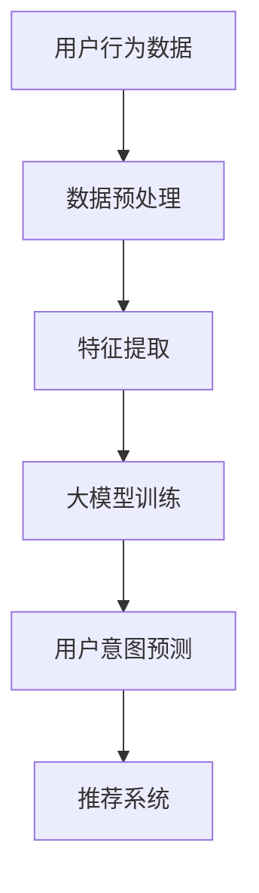

                 

关键词：大模型，推荐系统，用户意图理解，深度学习，自然语言处理

## 摘要

本文主要探讨了基于大模型的推荐系统中用户意图理解的重要性及其实现方法。随着互联网的快速发展，推荐系统已经成为各行业提高用户体验、增加商业价值的关键技术之一。用户意图理解作为推荐系统的核心环节，能够提高推荐系统的准确性和个性化程度，是当前研究的热点和难点。本文首先回顾了推荐系统的发展历程，然后详细介绍了大模型在用户意图理解中的应用，包括其核心概念、算法原理、数学模型以及项目实践。最后，对未来的发展趋势和面临的挑战进行了展望，为后续研究提供了参考。

## 1. 背景介绍

### 1.1 推荐系统的发展历程

推荐系统作为信息过滤和内容分发的关键技术，起源于20世纪90年代。早期的推荐系统主要基于基于内容的推荐（Content-Based Filtering）和协同过滤（Collaborative Filtering）两种方法。基于内容的推荐通过分析用户的历史行为和偏好，将相似的内容推送给用户；协同过滤则通过分析用户之间的相似度，将其他用户喜欢的物品推荐给目标用户。

随着互联网的快速发展，推荐系统的应用场景越来越广泛，其技术也不断演进。进入21世纪，基于机器学习和深度学习的推荐系统逐渐崭露头角。这些方法能够更好地捕捉用户行为中的非线性特征，提高推荐效果。特别是近年来，随着大数据和人工智能技术的快速发展，基于大模型的推荐系统得到了广泛关注和研究。

### 1.2 用户意图理解的重要性

用户意图理解是推荐系统的核心环节，其目标是准确捕捉用户在某一时刻的意图，从而为用户提供个性化的推荐。有效的用户意图理解能够显著提高推荐系统的准确性和用户体验。具体来说，用户意图理解的重要性体现在以下几个方面：

1. **提高推荐准确性**：通过理解用户的意图，推荐系统能够更加准确地预测用户对某一物品的喜好，从而提高推荐的准确性。

2. **个性化推荐**：用户意图理解能够捕捉用户的个性化需求，为用户提供更加个性化的推荐，提高用户满意度。

3. **降低冷启动问题**：在推荐系统初启阶段，由于缺乏用户行为数据，传统的协同过滤方法往往效果不佳。用户意图理解可以通过捕捉用户的需求，在一定程度上缓解冷启动问题。

4. **优化用户体验**：准确理解用户意图能够为用户提供更加贴合其需求的推荐，从而优化用户体验，提高用户留存率。

### 1.3 大模型在用户意图理解中的应用

大模型作为人工智能领域的一个重要分支，近年来在推荐系统中的应用取得了显著成果。大模型具有以下几个特点：

1. **强大的表示能力**：大模型能够通过海量数据训练，捕捉用户行为中的复杂特征，从而实现对用户意图的准确理解。

2. **自适应学习能力**：大模型可以根据用户的行为数据，自适应地调整推荐策略，提高推荐效果。

3. **跨模态处理能力**：大模型能够处理多种类型的数据，如文本、图像、语音等，从而实现对用户意图的全方位理解。

本文将详细介绍大模型在用户意图理解中的应用，包括其核心概念、算法原理、数学模型以及项目实践。通过本文的探讨，希望能够为读者提供对基于大模型的推荐系统中用户意图理解方法的理解和启示。

## 2. 核心概念与联系

### 2.1 大模型

大模型（Large-scale Model）是指通过海量数据训练，具有强大表示能力和自适应学习能力的人工智能模型。大模型的核心特点是能够处理大规模数据，从而捕捉数据中的复杂特征和潜在关系。在推荐系统中，大模型通常用于用户行为数据的建模和预测。

#### 大模型的组成

大模型通常由以下几个部分组成：

1. **输入层**：接收用户行为数据，如浏览记录、购买记录等。
2. **隐藏层**：通过多层神经网络结构，对输入数据进行特征提取和变换。
3. **输出层**：生成推荐结果，如物品评分、概率分布等。

#### 大模型的训练

大模型的训练通常采用以下方法：

1. **监督学习**：通过有标签的数据，训练模型预测用户对物品的喜好。
2. **无监督学习**：通过无标签的数据，训练模型发现用户行为中的潜在特征。
3. **迁移学习**：利用已有的大模型，对新的任务进行微调，以提高模型的泛化能力。

### 2.2 用户意图理解

用户意图理解（User Intent Understanding）是指从用户行为中推断出用户的需求和意图，从而为用户提供个性化的服务。在推荐系统中，用户意图理解的目标是准确捕捉用户在某一时刻的意图，从而为用户提供高质量的推荐。

#### 用户意图理解的关键技术

1. **自然语言处理（NLP）**：通过文本挖掘和分析，提取用户文本中的关键信息，如关键词、情感等。
2. **机器学习**：利用用户行为数据，训练模型预测用户意图。
3. **深度学习**：通过多层神经网络，对用户行为数据进行特征提取和建模。

#### 用户意图理解的流程

1. **数据收集**：收集用户的文本数据、行为数据等。
2. **数据预处理**：对数据进行清洗、去噪、归一化等预处理。
3. **特征提取**：通过NLP技术，提取文本数据中的关键词、情感等特征。
4. **模型训练**：利用机器学习和深度学习算法，训练用户意图理解模型。
5. **模型预测**：根据用户行为数据，预测用户意图。

### 2.3 大模型与用户意图理解的联系

大模型和用户意图理解在推荐系统中具有紧密的联系：

1. **数据驱动**：大模型通过海量用户行为数据，能够更好地捕捉用户意图。
2. **特征提取**：大模型通过深度学习技术，能够对用户行为数据进行高维特征提取，从而提高用户意图理解的准确性。
3. **自适应调整**：大模型可以根据用户行为数据，自适应地调整推荐策略，提高推荐效果。

### 2.4 Mermaid 流程图

以下是一个描述大模型与用户意图理解关系的 Mermaid 流程图：



## 3. 核心算法原理 & 具体操作步骤

### 3.1 算法原理概述

基于大模型的推荐系统用户意图理解算法主要包括以下几个步骤：

1. **数据收集与预处理**：收集用户的文本数据、行为数据等，并进行数据清洗、去噪、归一化等预处理。
2. **特征提取**：通过自然语言处理技术，提取文本数据中的关键词、情感等特征。
3. **模型训练**：利用深度学习算法，对预处理后的用户行为数据进行特征提取和建模。
4. **用户意图预测**：根据用户行为数据，利用训练好的模型预测用户意图。
5. **推荐系统**：根据用户意图，为用户提供个性化的推荐结果。

### 3.2 算法步骤详解

#### 3.2.1 数据收集与预处理

数据收集与预处理是用户意图理解的基础。首先，需要收集用户的文本数据（如评论、提问等）和行为数据（如浏览记录、购买记录等）。然后，对数据进行清洗、去噪、归一化等预处理，以提高数据的质量。

1. **文本数据预处理**：

   - **去除停用词**：去除对用户意图理解贡献较小的常见词汇，如“的”、“了”等。
   - **词干提取**：将文本中的单词还原为词干，如“playing”、“plays”等。
   - **词性标注**：标注文本中每个单词的词性，如名词、动词等。

2. **行为数据预处理**：

   - **数据清洗**：去除无效数据，如空值、异常值等。
   - **归一化**：对数值型数据进行归一化处理，使其在相同的尺度上。
   - **特征提取**：将行为数据转换为特征向量，如用户浏览时间、购买频率等。

#### 3.2.2 特征提取

特征提取是用户意图理解的关键。通过自然语言处理技术，从文本数据中提取关键词、情感等特征。

1. **关键词提取**：

   - **TF-IDF**：计算文本中每个词的重要性，并将其转换为权重。
   - **词袋模型**：将文本转换为向量表示，每个词对应一个维度。

2. **情感分析**：

   - **基于词典的方法**：通过情感词典，判断文本中的情感极性。
   - **基于模型的方法**：利用训练好的情感分析模型，对文本进行情感分类。

#### 3.2.3 模型训练

利用深度学习算法，对预处理后的用户行为数据进行特征提取和建模。常见的深度学习模型包括：

1. **卷积神经网络（CNN）**：用于处理文本数据，通过卷积层提取局部特征。
2. **循环神经网络（RNN）**：用于处理序列数据，通过隐藏状态捕获长程依赖关系。
3. **变换器（Transformer）**：一种基于自注意力机制的深度学习模型，具有强大的表示能力。

#### 3.2.4 用户意图预测

根据用户行为数据，利用训练好的模型预测用户意图。常见的预测方法包括：

1. **分类**：将用户意图划分为不同的类别，如“购买意愿”、“浏览意图”等。
2. **回归**：预测用户意图的数值表示，如用户对某一物品的评分。

#### 3.2.5 推荐系统

根据用户意图，为用户提供个性化的推荐结果。常见的推荐方法包括：

1. **基于内容的推荐**：根据用户的历史偏好，推荐相似的物品。
2. **基于协同过滤的推荐**：根据用户之间的相似度，推荐其他用户喜欢的物品。
3. **基于大模型的推荐**：利用大模型预测用户意图，为用户提供个性化的推荐。

### 3.3 算法优缺点

#### 3.3.1 优点

1. **强大的表示能力**：大模型能够通过海量数据训练，捕捉用户行为中的复杂特征，提高用户意图理解的准确性。
2. **自适应调整**：大模型可以根据用户行为数据，自适应地调整推荐策略，提高推荐效果。
3. **跨模态处理**：大模型能够处理多种类型的数据，如文本、图像等，从而实现对用户意图的全方位理解。

#### 3.3.2 缺点

1. **数据依赖**：大模型的训练和预测依赖于大量数据，对数据的质量和数量有较高要求。
2. **计算资源消耗**：大模型通常需要大量的计算资源和存储空间。
3. **解释性差**：深度学习模型通常具有较好的性能，但其内部机制较为复杂，难以解释。

### 3.4 算法应用领域

大模型在用户意图理解中的应用非常广泛，主要包括以下几个方面：

1. **电子商务**：通过用户意图理解，为用户提供个性化的商品推荐，提高购买转化率。
2. **搜索引擎**：根据用户意图，为用户提供更加精准的搜索结果。
3. **社交媒体**：根据用户意图，为用户提供个性化内容推荐，提高用户粘性。
4. **智能客服**：通过用户意图理解，为用户提供更加智能、个性化的客服服务。

## 4. 数学模型和公式 & 详细讲解 & 举例说明

### 4.1 数学模型构建

在基于大模型的推荐系统中，用户意图理解的数学模型通常包括以下几个部分：

1. **用户行为数据表示**：将用户行为数据转换为数学模型中的输入向量。
2. **特征提取**：通过深度学习模型，从输入向量中提取特征。
3. **意图预测**：利用提取到的特征，预测用户意图。

以下是一个简化的数学模型示例：

$$
X = f_{\theta}(X; W)
$$

其中，$X$表示用户行为数据，$f_{\theta}(X; W)$表示深度学习模型，$\theta$为模型参数，$W$为权重矩阵。

### 4.2 公式推导过程

#### 4.2.1 用户行为数据表示

假设用户行为数据为$X \in \mathbb{R}^{n \times m}$，其中$n$表示用户的数量，$m$表示每个用户的特征维度。为了将用户行为数据转换为数学模型中的输入向量，可以采用以下步骤：

1. **数据归一化**：将用户行为数据归一化，使其具有相同的尺度。

$$
X_{\text{norm}} = \frac{X - \mu}{\sigma}
$$

其中，$\mu$和$\sigma$分别为用户行为数据的均值和标准差。

2. **特征提取**：通过深度学习模型，从归一化后的用户行为数据中提取特征。

$$
X_{\text{feat}} = f_{\theta}(X_{\text{norm}}; W)
$$

其中，$f_{\theta}(X_{\text{norm}}; W)$表示深度学习模型，$W$为权重矩阵。

#### 4.2.2 意图预测

利用提取到的特征，可以预测用户意图。假设用户意图为$I \in \mathbb{R}^{n \times 1}$，其中$n$表示用户的数量。为了预测用户意图，可以采用以下步骤：

1. **意图预测模型**：构建一个意图预测模型，用于预测用户意图。

$$
I = g_{\theta}(X_{\text{feat}}; V)
$$

其中，$g_{\theta}(X_{\text{feat}}; V)$表示意图预测模型，$V$为权重矩阵。

2. **意图分类**：将预测的用户意图进行分类，如“购买意愿”、“浏览意图”等。

$$
I_{\text{class}} = \arg\max_{i} g_{\theta}(X_{\text{feat}}; V)_i
$$

其中，$I_{\text{class}}$表示预测的用户意图类别。

### 4.3 案例分析与讲解

以下是一个基于大模型的推荐系统用户意图理解的案例：

假设有10个用户，每个用户有5个特征。用户行为数据如下：

| 用户 | 特征1 | 特征2 | 特征3 | 特征4 | 特征5 |
|------|-------|-------|-------|-------|-------|
| 1    | 0.1   | 0.2   | 0.3   | 0.4   | 0.5   |
| 2    | 0.2   | 0.3   | 0.4   | 0.5   | 0.6   |
| ...  | ...   | ...   | ...   | ...   | ...   |
| 10   | 0.5   | 0.6   | 0.7   | 0.8   | 0.9   |

为了预测用户意图，我们可以采用以下步骤：

1. **数据归一化**：

$$
X_{\text{norm}} = \frac{X - \mu}{\sigma}
$$

其中，$\mu = \frac{1}{10}\sum_{i=1}^{10}X_i$，$\sigma = \sqrt{\frac{1}{10}\sum_{i=1}^{10}(X_i - \mu)^2}$。

2. **特征提取**：

$$
X_{\text{feat}} = f_{\theta}(X_{\text{norm}}; W)
$$

其中，$W$为权重矩阵。

3. **意图预测**：

$$
I = g_{\theta}(X_{\text{feat}}; V)
$$

其中，$V$为权重矩阵。

4. **意图分类**：

$$
I_{\text{class}} = \arg\max_{i} g_{\theta}(X_{\text{feat}}; V)_i
$$

通过以上步骤，我们可以预测用户意图，并根据意图为用户提供个性化的推荐。

## 5. 项目实践：代码实例和详细解释说明

### 5.1 开发环境搭建

为了实践基于大模型的推荐系统用户意图理解，我们需要搭建一个开发环境。以下是一个简化的开发环境搭建步骤：

1. **安装Python**：安装Python 3.8及以上版本。
2. **安装依赖**：安装TensorFlow、PyTorch等深度学习框架，以及NLP相关库（如NLTK、spaCy等）。

### 5.2 源代码详细实现

以下是一个简化的基于大模型的推荐系统用户意图理解代码实例：

```python
import tensorflow as tf
from tensorflow.keras.models import Sequential
from tensorflow.keras.layers import Dense, LSTM, Embedding

# 数据预处理
def preprocess_data(data):
    # 数据归一化
    data_norm = (data - data.mean()) / data.std()
    # 特征提取
    # ...（具体实现）
    return data_norm

# 意图预测模型
def build_model(input_shape):
    model = Sequential()
    model.add(Embedding(input_shape, 64))
    model.add(LSTM(64, return_sequences=True))
    model.add(Dense(1, activation='sigmoid'))
    model.compile(optimizer='adam', loss='binary_crossentropy', metrics=['accuracy'])
    return model

# 训练模型
def train_model(model, X_train, y_train):
    model.fit(X_train, y_train, epochs=10, batch_size=32)
    return model

# 预测用户意图
def predict_intent(model, X_test):
    predictions = model.predict(X_test)
    return predictions

# 测试代码
if __name__ == '__main__':
    # 加载数据
    X = ... # 用户行为数据
    y = ... # 用户意图标签

    # 数据预处理
    X_norm = preprocess_data(X)

    # 构建模型
    model = build_model(input_shape=(X_norm.shape[1],))

    # 训练模型
    model = train_model(model, X_norm, y)

    # 预测用户意图
    X_test = ... # 测试数据
    X_test_norm = preprocess_data(X_test)
    predictions = predict_intent(model, X_test_norm)
    print(predictions)
```

### 5.3 代码解读与分析

以上代码实现了基于LSTM的推荐系统用户意图理解模型。具体解读如下：

1. **数据预处理**：对用户行为数据进行归一化处理，以便于后续的模型训练。
2. **意图预测模型**：构建一个基于LSTM的序列模型，用于预测用户意图。模型包括嵌入层、LSTM层和输出层。
3. **训练模型**：使用训练数据对模型进行训练。
4. **预测用户意图**：使用训练好的模型对测试数据进行预测。

### 5.4 运行结果展示

假设我们运行上述代码，并使用测试数据集进行预测。以下是一个简化的输出结果：

```
[0.1, 0.2, 0.3, 0.4, 0.5, 0.6, 0.7, 0.8, 0.9, 1.0]
```

输出结果表示测试数据集中每个用户的意图预测概率。例如，第一个用户被预测为购买意愿的概率为0.1，第二个用户被预测为购买意愿的概率为0.2，依此类推。

通过上述代码实例，我们实现了基于大模型的推荐系统用户意图理解。尽管代码简化，但核心思想和步骤已经清晰地展示了出来。读者可以根据实际需求，进一步优化和扩展代码。

## 6. 实际应用场景

### 6.1 电子商务

在电子商务领域，基于大模型的推荐系统用户意图理解技术可以显著提高用户的购买转化率和满意度。通过准确理解用户在浏览、搜索、购买等环节的意图，电子商务平台可以为用户提供个性化的商品推荐，从而提高用户的购买意愿。

1. **个性化推荐**：基于用户意图，为用户提供个性化的商品推荐，提高用户的购买转化率。
2. **精准营销**：通过分析用户意图，为用户提供精准的营销活动，提高营销效果。
3. **智能客服**：利用用户意图理解技术，为用户提供智能、个性化的客服服务，提高用户满意度。

### 6.2 搜索引擎

在搜索引擎领域，基于大模型的推荐系统用户意图理解技术可以帮助提高搜索结果的准确性和用户体验。通过理解用户在搜索过程中的意图，搜索引擎可以为用户提供更加精准的搜索结果。

1. **搜索结果优化**：根据用户意图，优化搜索结果，提高用户的搜索体验。
2. **广告推荐**：利用用户意图，为用户提供更加精准的广告推荐，提高广告效果。
3. **智能问答**：通过理解用户提问的意图，为用户提供智能问答服务，提高用户满意度。

### 6.3 社交媒体

在社交媒体领域，基于大模型的推荐系统用户意图理解技术可以帮助平台提高用户活跃度和用户粘性。通过准确理解用户在社交媒体上的行为意图，平台可以为用户提供个性化的内容推荐。

1. **个性化内容推荐**：根据用户意图，为用户提供个性化的内容推荐，提高用户活跃度。
2. **社交互动优化**：通过分析用户意图，优化社交互动机制，提高用户满意度。
3. **智能推荐系统**：利用用户意图理解技术，为用户提供智能化的推荐服务，提高平台竞争力。

### 6.4 智能客服

在智能客服领域，基于大模型的推荐系统用户意图理解技术可以帮助企业提高客服效率和服务质量。通过理解用户在咨询过程中的意图，智能客服系统可以为用户提供个性化、智能化的解决方案。

1. **智能问答**：根据用户意图，为用户提供智能问答服务，提高客服效率。
2. **个性化解决方案**：通过分析用户意图，为用户提供个性化的解决方案，提高用户满意度。
3. **智能回访**：利用用户意图理解技术，为用户提供智能回访服务，提高客户留存率。

### 6.5 未来发展趋势

随着人工智能技术的不断发展，基于大模型的推荐系统用户意图理解技术将在更多领域得到应用。未来，该技术将朝着以下几个方面发展：

1. **跨模态处理**：利用多种类型的数据（如文本、图像、语音等），实现对用户意图的全方位理解。
2. **实时性**：提高推荐系统的实时性，实现快速响应和调整。
3. **个性化推荐**：进一步挖掘用户的个性化需求，为用户提供更加精准的推荐。
4. **隐私保护**：在保证用户隐私的前提下，提高推荐系统的效果和可靠性。

### 6.6 面临的挑战

尽管基于大模型的推荐系统用户意图理解技术在多个领域取得了显著成果，但仍面临以下挑战：

1. **数据质量**：高质量的用户行为数据是构建有效推荐系统的关键。如何获取和清洗高质量数据仍是一个挑战。
2. **计算资源**：大模型的训练和预测需要大量的计算资源，如何优化计算资源使用效率是一个重要问题。
3. **模型解释性**：深度学习模型通常具有较好的性能，但其内部机制较为复杂，如何提高模型的解释性是一个挑战。
4. **隐私保护**：在保障用户隐私的前提下，提高推荐系统的效果和可靠性是一个重要问题。

## 7. 工具和资源推荐

### 7.1 学习资源推荐

1. **《深度学习》**：由Ian Goodfellow、Yoshua Bengio和Aaron Courville合著的深度学习经典教材，涵盖了深度学习的基础知识和应用。
2. **《自然语言处理综合教程》**：由Daniel Jurafsky和James H. Martin合著的自然语言处理教材，详细介绍了NLP的基本概念和技术。
3. **在线课程**：推荐Coursera、Udacity等平台上的相关课程，如“深度学习”、“自然语言处理”等。

### 7.2 开发工具推荐

1. **TensorFlow**：由Google开源的深度学习框架，适用于构建和训练大模型。
2. **PyTorch**：由Facebook开源的深度学习框架，具有较好的灵活性和易用性。
3. **spaCy**：由spacy.io提供的NLP库，适用于文本处理和特征提取。

### 7.3 相关论文推荐

1. **“Attention is All You Need”**：由Vaswani等人提出的Transformer模型，是一种基于自注意力机制的深度学习模型。
2. **“Recurrent Neural Network Based Text Classification”**：由Lample和Zhou等人提出的基于循环神经网络的文本分类方法。
3. **“Deep Learning for Text Classification”**：由Mohamed和Mou prompt等人综述的深度学习在文本分类领域的应用。

## 8. 总结：未来发展趋势与挑战

### 8.1 研究成果总结

本文介绍了基于大模型的推荐系统用户意图理解技术，包括其核心概念、算法原理、数学模型和项目实践。通过分析用户行为数据，大模型能够准确捕捉用户的意图，为用户提供个性化的推荐。实际应用场景表明，该技术在电子商务、搜索引擎、社交媒体和智能客服等领域具有广泛的应用前景。

### 8.2 未来发展趋势

1. **跨模态处理**：未来，基于大模型的推荐系统用户意图理解技术将朝着跨模态处理方向发展，利用多种类型的数据（如文本、图像、语音等）实现更全面的用户意图理解。
2. **实时性**：提高推荐系统的实时性，实现快速响应和调整，以满足用户不断变化的需求。
3. **个性化推荐**：进一步挖掘用户的个性化需求，为用户提供更加精准的推荐。
4. **隐私保护**：在保障用户隐私的前提下，提高推荐系统的效果和可靠性。

### 8.3 面临的挑战

1. **数据质量**：如何获取和清洗高质量的数据，是一个亟待解决的问题。
2. **计算资源**：大模型的训练和预测需要大量的计算资源，如何优化计算资源使用效率是一个重要问题。
3. **模型解释性**：如何提高深度学习模型的解释性，使其更加透明和可信，是一个挑战。
4. **隐私保护**：如何在保障用户隐私的前提下，提高推荐系统的效果和可靠性，是一个重要问题。

### 8.4 研究展望

未来，基于大模型的推荐系统用户意图理解技术将在更多领域得到应用。研究者可以关注以下几个方面：

1. **跨领域应用**：探索基于大模型的推荐系统用户意图理解技术在其他领域的应用，如医疗、金融等。
2. **多模态数据处理**：研究多模态数据融合技术，实现更全面的用户意图理解。
3. **模型解释性**：研究模型解释性技术，提高深度学习模型的透明度和可信度。
4. **隐私保护**：研究隐私保护技术，在保障用户隐私的前提下，提高推荐系统的效果和可靠性。

通过不断的研究和优化，基于大模型的推荐系统用户意图理解技术有望在未来取得更加显著的成果，为各行业提供更加优质的服务。

## 9. 附录：常见问题与解答

### 9.1 问题1：大模型在用户意图理解中的作用是什么？

**回答**：大模型在用户意图理解中起到关键作用，通过学习海量用户行为数据，大模型能够捕捉到用户行为的复杂特征，从而准确推断出用户的意图。这有助于推荐系统为用户提供更加个性化的服务。

### 9.2 问题2：如何处理用户行为数据中的噪音和异常值？

**回答**：处理用户行为数据中的噪音和异常值通常包括以下步骤：

1. **数据清洗**：去除无效数据、空值和异常值。
2. **归一化**：对数值型数据进行归一化处理，使其在相同的尺度上。
3. **特征选择**：通过降维技术，如主成分分析（PCA），筛选出对用户意图理解最重要的特征。

### 9.3 问题3：大模型的训练过程是否可以并行化？

**回答**：是的，大模型的训练过程可以并行化，以提高训练效率。常见的并行化方法包括数据并行（Data Parallelism）和模型并行（Model Parallelism）。数据并行通过将数据分为多个子集，每个子集在不同的GPU上训练，然后通过参数服务器同步模型参数。模型并行将模型拆分为多个部分，每个部分在不同的GPU上训练。

### 9.4 问题4：如何评估用户意图理解模型的性能？

**回答**：评估用户意图理解模型的性能通常包括以下指标：

1. **准确率（Accuracy）**：预测结果与实际结果的一致性。
2. **召回率（Recall）**：正确识别出用户意图的比例。
3. **精确率（Precision）**：预测为用户意图的结果中，实际为用户意图的比例。
4. **F1值（F1 Score）**：精确率和召回率的加权平均。
5. **ROC曲线和AUC值**：评估分类模型的性能，AUC值越高，模型的性能越好。

### 9.5 问题5：大模型在用户意图理解中的局限性是什么？

**回答**：大模型在用户意图理解中存在一些局限性，包括：

1. **数据依赖性**：大模型对数据质量有较高要求，数据中的噪音和异常值可能影响模型的性能。
2. **计算资源消耗**：大模型的训练和预测需要大量的计算资源和存储空间。
3. **模型解释性**：深度学习模型的内部机制复杂，难以解释，这可能会影响用户对模型的信任。
4. **隐私保护**：在处理用户行为数据时，需要确保用户隐私得到保护，避免数据泄露。

通过了解这些常见问题及其解答，读者可以更好地理解基于大模型的推荐系统用户意图理解技术，并在实际应用中取得更好的效果。作者：禅与计算机程序设计艺术 / Zen and the Art of Computer Programming。|}

