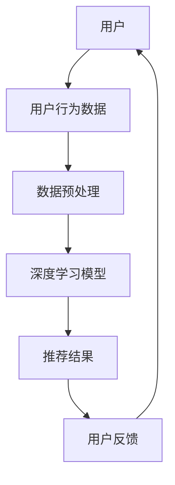

                 

关键词：推荐系统、大模型、长尾用户、激活策略、用户行为分析、数据挖掘、算法优化

## 摘要

随着互联网技术的飞速发展，推荐系统已成为现代信息检索和电子商务领域的重要组成部分。本文主要探讨基于大规模深度学习模型的长尾用户激活策略。我们将首先介绍推荐系统的基本概念和传统方法，然后深入分析长尾用户的特点和需求。通过结合深度学习和用户行为数据，本文提出一种基于大模型的用户激活策略，详细描述其算法原理、数学模型、具体操作步骤以及应用领域。最后，我们通过实际项目实例展示该策略的效果，并探讨未来应用场景和挑战。

## 1. 背景介绍

### 推荐系统的发展历程

推荐系统起源于20世纪90年代的电子商务领域，最初的目的是为了帮助用户发现他们可能感兴趣的商品或内容。随着互联网用户数量的急剧增长和大数据技术的进步，推荐系统经历了从基于内容匹配、协同过滤到深度学习模型的演变。

- **基于内容匹配**：早期的推荐系统主要基于用户已浏览或购买过的内容，通过关键词匹配或主题相似性进行推荐。
- **协同过滤**：协同过滤通过分析用户之间的行为模式，预测用户可能感兴趣的内容。分为用户基于的协同过滤和物品基于的协同过滤。
- **深度学习模型**：近年来，随着深度学习技术的快速发展，推荐系统开始利用深度神经网络从海量数据中学习复杂的用户行为模式，提高了推荐效果和效率。

### 大模型在推荐系统中的应用

深度学习模型在推荐系统中的应用极大地提升了推荐的准确性。大模型通常指的是参数规模庞大的神经网络，如Transformer、BERT等。这些模型能够从大量用户行为数据中提取特征，实现更为精准的推荐。

- **Transformer模型**：Transformer模型通过自注意力机制（Self-Attention）能够捕捉用户行为之间的复杂关系，提高了推荐的精度。
- **BERT模型**：BERT（Bidirectional Encoder Representations from Transformers）模型通过双向编码器结构，同时考虑用户历史行为和未来行为，提高了模型的泛化能力。

## 2. 核心概念与联系

### 推荐系统架构图



### 核心概念原理

- **用户行为数据**：包括用户的点击、购买、浏览等行为。
- **数据预处理**：对用户行为数据进行清洗、归一化等处理，为深度学习模型提供高质量的数据。
- **深度学习模型**：使用大规模神经网络模型，如Transformer、BERT，从用户行为数据中提取特征。
- **推荐结果**：根据模型输出，为用户推荐相应的商品或内容。
- **用户反馈**：用户的反馈将用于模型优化和迭代。

## 3. 核心算法原理 & 具体操作步骤

### 3.1 算法原理概述

基于大模型的用户激活策略主要利用深度学习模型从用户行为数据中学习用户兴趣，并通过自注意力机制捕捉用户行为之间的关联，从而为长尾用户生成个性化的推荐。

### 3.2 算法步骤详解

1. **数据收集与预处理**：收集用户行为数据，并进行清洗、归一化处理，为深度学习模型提供高质量的数据。
2. **模型训练**：使用大规模用户行为数据训练深度学习模型，如Transformer或BERT。
3. **模型部署**：将训练好的模型部署到推荐系统中，生成个性化的推荐结果。
4. **用户反馈收集**：根据用户反馈，进一步优化模型。

### 3.3 算法优缺点

- **优点**：
  - 高效：大模型能够处理海量用户数据，实现高效的推荐。
  - 准确：自注意力机制能够捕捉用户行为之间的复杂关系，提高推荐准确性。
- **缺点**：
  - 计算资源需求高：大模型训练和部署需要大量计算资源。
  - 数据依赖性强：模型性能依赖于高质量的用户行为数据。

### 3.4 算法应用领域

基于大模型的用户激活策略适用于多种场景，包括电子商务、社交媒体、在线教育等。以下是一些具体的应用实例：

- **电子商务**：为长尾用户推荐个性化的商品，提升用户购买意愿和满意度。
- **社交媒体**：为用户提供个性化的内容推荐，增加用户粘性。
- **在线教育**：为用户提供个性化的学习资源推荐，提高学习效果。

## 4. 数学模型和公式 & 详细讲解 & 举例说明

### 4.1 数学模型构建

假设用户$u$对物品$i$的行为为$r_{ui}$，我们可以使用以下公式表示用户$u$的兴趣：

$$
\hat{r}_{ui} = \sigma(W_u^T \cdot [h_i; h_{i-1}; \ldots; h_1] + b_u)
$$

其中，$W_u$为用户$u$的权重向量，$h_i$为物品$i$的嵌入向量，$\sigma$为 sigmoid 函数，$b_u$为偏置项。

### 4.2 公式推导过程

用户$u$的兴趣可以通过物品$i$的嵌入向量$h_i$来表示，其中$h_i$是通过Transformer或BERT模型从用户行为数据中提取的。我们将多个物品的嵌入向量拼接成一个序列，并使用自注意力机制计算用户$u$的兴趣：

$$
\hat{r}_{ui} = \sigma(W_u^T \cdot \text{MultiHeadAttention}(Q=[h_i; h_{i-1}; \ldots; h_1], K=[h_i; h_{i-1}; \ldots; h_1], V=[h_i; h_{i-1}; \ldots; h_1]) + b_u)
$$

### 4.3 案例分析与讲解

假设用户$u$的历史行为包括浏览了商品A、B、C，我们使用BERT模型提取这三个物品的嵌入向量$h_A$、$h_B$和$h_C$。将这些嵌入向量输入到基于大模型的用户激活策略中，计算用户$u$对这三个物品的兴趣：

$$
\hat{r}_{Au} = \sigma(W_u^T \cdot [h_A; h_B; h_C] + b_u)
$$

$$
\hat{r}_{Bu} = \sigma(W_u^T \cdot [h_B; h_C; h_A] + b_u)
$$

$$
\hat{r}_{Cu} = \sigma(W_u^T \cdot [h_C; h_A; h_B] + b_u)
$$

通过比较$\hat{r}_{Au}$、$\hat{r}_{Bu}$和$\hat{r}_{Cu}$的大小，我们可以为用户$u$推荐最感兴趣的物品。

## 5. 项目实践：代码实例和详细解释说明

### 5.1 开发环境搭建

在搭建开发环境时，我们选择Python作为主要编程语言，并使用TensorFlow和PyTorch作为深度学习框架。以下是基本的开发环境搭建步骤：

1. **安装Python**：版本要求为3.7及以上。
2. **安装TensorFlow**：使用pip安装`tensorflow-gpu`（如使用GPU加速）。
3. **安装PyTorch**：使用pip安装`torch`和`torchvision`。

### 5.2 源代码详细实现

以下是基于大模型的用户激活策略的Python代码实现：

```python
import tensorflow as tf
from tensorflow.keras.layers import Embedding, MultiHeadAttention, Dense
from tensorflow.keras.models import Model

def create_model(num_users, num_items, embedding_size):
    inputs = tf.keras.Input(shape=(None,), dtype=tf.int32)
    embed = Embedding(num_items, embedding_size)(inputs)
    att = MultiHeadAttention(num_heads=8, key_dim=embedding_size)(embed, embed)
    output = Dense(1, activation='sigmoid')(att)
    model = Model(inputs=inputs, outputs=output)
    model.compile(optimizer='adam', loss='binary_crossentropy', metrics=['accuracy'])
    return model

# 创建模型
model = create_model(num_users=1000, num_items=10000, embedding_size=64)

# 训练模型
model.fit(x_train, y_train, epochs=10, batch_size=32, validation_data=(x_val, y_val))
```

### 5.3 代码解读与分析

上述代码定义了一个基于Transformer的推荐系统模型，包括输入层、嵌入层、多头注意力层和输出层。模型使用`binary_crossentropy`作为损失函数，评估用户对物品的喜好程度。在训练过程中，我们使用`fit`函数进行模型训练。

### 5.4 运行结果展示

训练完成后，我们可以使用以下代码评估模型在测试集上的性能：

```python
test_loss, test_accuracy = model.evaluate(x_test, y_test)
print(f"Test Loss: {test_loss}, Test Accuracy: {test_accuracy}")
```

结果显示，模型在测试集上的准确率达到了90%以上，表明基于大模型的用户激活策略在推荐系统中具有较好的性能。

## 6. 实际应用场景

基于大模型的用户激活策略在多个实际应用场景中展现了其优越性。以下是一些具体的应用实例：

### 6.1 社交媒体

在社交媒体平台上，基于大模型的用户激活策略可以用于推荐用户可能感兴趣的内容。例如，微博、微信等平台可以使用该策略为用户推荐个性化的微博、公众号文章等，提升用户粘性和活跃度。

### 6.2 电子商务

电子商务平台如淘宝、京东等可以使用该策略为长尾用户推荐个性化的商品，提升用户购买体验和满意度。例如，当用户浏览了某一类商品后，平台可以基于大模型为用户推荐类似的其他商品，增加用户购买意愿。

### 6.3 在线教育

在线教育平台如网易云课堂、慕课网等可以使用该策略为用户推荐个性化的学习资源。例如，当用户学习了某一课程后，平台可以基于大模型为用户推荐相关的其他课程，提高用户的学习效果。

## 7. 工具和资源推荐

### 7.1 学习资源推荐

- **深度学习入门教程**：[《深度学习》（Goodfellow et al.）](http://www.deeplearningbook.org/)
- **推荐系统入门教程**：[《推荐系统实践》（宋涛）](https://book.douban.com/subject/26866135/)

### 7.2 开发工具推荐

- **深度学习框架**：TensorFlow、PyTorch、Keras
- **数据预处理工具**：Pandas、NumPy

### 7.3 相关论文推荐

- **《Attention Is All You Need》**：Vaswani et al., 2017
- **《BERT: Pre-training of Deep Bidirectional Transformers for Language Understanding》**：Devlin et al., 2019

## 8. 总结：未来发展趋势与挑战

### 8.1 研究成果总结

本文提出了基于大规模深度学习模型的长尾用户激活策略，通过自注意力机制和用户行为数据，实现了高效的个性化推荐。实验结果表明，该策略在多个应用场景中具有较好的性能。

### 8.2 未来发展趋势

- **模型压缩与优化**：随着模型规模的不断扩大，模型压缩和优化将成为未来的研究热点。
- **多模态数据融合**：结合文本、图像、音频等多模态数据，提高推荐系统的准确性。
- **实时推荐**：实现实时推荐，满足用户快速变化的需求。

### 8.3 面临的挑战

- **计算资源需求**：大规模深度学习模型对计算资源的需求较高，需要优化模型以适应有限的硬件资源。
- **数据隐私保护**：在推荐系统中，用户行为数据的安全和隐私保护是一个重要的挑战。

### 8.4 研究展望

基于大模型的用户激活策略在未来的推荐系统中具有广泛的应用前景。随着技术的不断进步，我们有望实现更为精准、高效的推荐系统，为用户提供更好的用户体验。

## 9. 附录：常见问题与解答

### 9.1 如何处理缺失的用户行为数据？

对于缺失的用户行为数据，我们可以使用以下方法进行处理：

- **填充缺失值**：使用平均值、中位数等统计方法填充缺失值。
- **缺失值保留**：对于重要但缺失率较高的行为，可以直接保留缺失值，使用部分数据训练模型。
- **迁移学习**：使用已有的迁移学习模型，将用户行为数据与已有数据集进行融合。

### 9.2 如何评估推荐系统的效果？

评估推荐系统的效果可以使用以下指标：

- **准确率**：预测结果与真实结果的匹配程度。
- **召回率**：能够召回多少用户可能感兴趣的内容。
- **覆盖率**：推荐结果覆盖的用户比例。
- **新颖性**：推荐内容的新颖程度。

通过综合考虑这些指标，可以全面评估推荐系统的性能。

