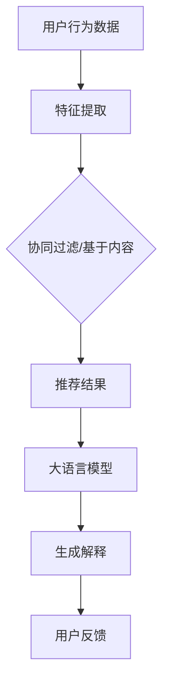

                 

推荐系统已经成为现代互联网应用中不可或缺的部分。然而，随着推荐系统的复杂性和规模不断扩大，其可解释性成为了亟待解决的问题。用户对推荐结果的信任度、系统的透明度和可解释性密切相关。本文将探讨如何利用大语言模型来增强推荐系统的可解释性，并通过实际案例展示其应用效果。

## 关键词

- 推荐系统
- 大语言模型
- 可解释性
- 自然语言处理
- 用户信任度

## 摘要

本文首先介绍了推荐系统及其面临的可解释性挑战。接着，我们探讨了如何利用大语言模型来增强推荐系统的可解释性，并介绍了相关的核心概念和算法原理。最后，通过一个实际案例展示了大语言模型在推荐系统可解释性增强方面的应用效果。

## 1. 背景介绍

### 推荐系统的现状

推荐系统是一种自动化的信息过滤方法，旨在根据用户的兴趣和行为向他们推荐相关的商品、新闻、文章或其他内容。随着互联网的普及和大数据技术的发展，推荐系统已经成为许多互联网应用的核心功能。从简单的协同过滤算法到复杂的人工智能模型，推荐系统在电子商务、社交媒体、新闻媒体等多个领域取得了显著的成功。

### 推荐系统的挑战

尽管推荐系统带来了很多便利，但其可解释性成为了重要的挑战。用户对推荐结果的信任度直接影响推荐系统的效果。如果用户无法理解推荐系统的决策过程，他们可能会对推荐结果产生怀疑，甚至抵触。此外，推荐系统的透明度也是监管机构和社会关注的焦点。

### 大语言模型的出现

近年来，大语言模型（如GPT、BERT等）在自然语言处理领域取得了显著的进展。这些模型具有强大的语义理解能力，可以生成流畅、连贯的自然语言文本。这一特性使得大语言模型在推荐系统可解释性增强方面具有巨大的潜力。

## 2. 核心概念与联系

### 推荐系统的基本概念

- **用户行为数据**：包括用户的点击、搜索、购买等行为。
- **物品特征数据**：包括商品的属性、分类、标签等。
- **协同过滤**：基于用户行为数据，找出相似用户或相似物品，进行推荐。
- **基于内容的推荐**：根据物品的属性和标签，为用户推荐相关物品。

### 大语言模型的基本概念

- **预训练**：在大规模语料库上训练模型，使其具备语言理解和生成能力。
- **上下文理解**：模型能够根据上下文理解单词和句子的含义。
- **生成文本**：模型可以生成连贯、有逻辑的文本。

### 推荐系统与自然语言处理的结合

- **解释生成**：利用大语言模型生成对推荐结果的解释。
- **用户反馈**：通过自然语言处理技术收集用户对推荐结果的反馈。
- **个性化推荐**：根据用户的语言特征调整推荐策略。

### Mermaid 流程图



## 3. 核心算法原理 & 具体操作步骤

### 3.1 算法原理概述

基于大语言模型的推荐系统可解释性增强的核心思想是利用大语言模型生成对推荐结果的解释。具体步骤如下：

1. **数据预处理**：收集用户行为数据和物品特征数据，进行数据清洗和特征提取。
2. **推荐算法**：基于用户行为数据和物品特征数据，使用协同过滤或基于内容的推荐算法生成推荐结果。
3. **解释生成**：利用大语言模型生成对推荐结果的解释。
4. **用户反馈**：收集用户对推荐结果的反馈，调整推荐策略。

### 3.2 算法步骤详解

1. **数据预处理**：

   - **数据收集**：从不同的数据源收集用户行为数据和物品特征数据。
   - **数据清洗**：去除重复数据、缺失值填充、数据格式转换等。
   - **特征提取**：提取用户行为数据中的用户兴趣特征和物品特征数据中的属性特征。

2. **推荐算法**：

   - **协同过滤**：计算用户之间的相似度，为用户推荐相似用户的喜欢的物品。
   - **基于内容**：根据物品的属性和标签，为用户推荐相关物品。

3. **解释生成**：

   - **生成解释的输入**：将推荐结果和用户行为数据输入到大语言模型中。
   - **生成解释的输出**：大语言模型根据输入生成对推荐结果的解释文本。

4. **用户反馈**：

   - **收集反馈**：收集用户对推荐结果的正面或负面反馈。
   - **调整推荐策略**：根据用户反馈调整推荐算法和解释生成策略。

### 3.3 算法优缺点

#### 优点：

- **增强可解释性**：大语言模型可以生成自然语言解释，使推荐结果更加透明。
- **自适应**：根据用户反馈调整推荐策略，提高推荐效果。
- **多样性**：大语言模型可以生成多种不同的解释，提高用户的满意度。

#### 缺点：

- **计算成本高**：大语言模型训练和推理过程需要大量的计算资源。
- **解释质量依赖模型**：解释质量取决于大语言模型的能力和训练数据的质量。

### 3.4 算法应用领域

基于大语言模型的推荐系统可解释性增强可以应用于电子商务、社交媒体、新闻推荐等多个领域。以下是一些典型应用场景：

- **电子商务**：为用户生成个性化的购物推荐解释，提高用户购买意愿。
- **社交媒体**：为用户生成对推荐内容的解释，提高用户对推荐内容的信任度。
- **新闻推荐**：为用户生成对推荐新闻的解释，提高用户对新闻内容的理解。

## 4. 数学模型和公式 & 详细讲解 & 举例说明

### 4.1 数学模型构建

基于大语言模型的推荐系统可解释性增强涉及多个数学模型，包括推荐算法模型、大语言模型和用户反馈模型。以下是这些模型的简要介绍：

#### 推荐算法模型

- **协同过滤模型**：

  假设用户集合为\( U = \{u_1, u_2, \ldots, u_n\} \)，物品集合为\( I = \{i_1, i_2, \ldots, i_m\} \)。用户\( u_i \)对物品\( i_j \)的评分表示为\( r_{ij} \)。

  协同过滤算法的目标是找到用户\( u_i \)与用户\( u_j \)之间的相似度\( s_{ij} \)，并根据相似度为用户\( u_i \)推荐物品\( i_j \)。

  相似度计算公式为：

  $$ s_{ij} = \frac{r_{ij} - \mu_i - \mu_j + \epsilon}{\sqrt{\sum_{k=1}^m (r_{ik} - \mu_i)^2} \sqrt{\sum_{k=1}^m (r_{jk} - \mu_j)^2}} $$

  其中，\( \mu_i \)和\( \mu_j \)分别为用户\( u_i \)和用户\( u_j \)的平均评分，\( \epsilon \)为常数。

- **基于内容的推荐模型**：

  基于内容的推荐算法通过比较用户和物品的特征，为用户推荐相关物品。

  假设用户\( u_i \)的兴趣特征表示为\( v_i \)，物品\( i_j \)的特征表示为\( w_j \)。

  相似度计算公式为：

  $$ s_{ij} = \frac{\sum_{k=1}^n v_{ik} w_{jk}}{\sqrt{\sum_{k=1}^n v_{ik}^2} \sqrt{\sum_{k=1}^n w_{jk}^2}} $$

#### 大语言模型

大语言模型（如GPT、BERT等）通常基于神经网络，其输入和输出都是向量。以下是一个简化的GPT模型公式：

$$
\begin{aligned}
&\text{输入：} x_1, x_2, \ldots, x_T \\
&\text{输出：} y_1, y_2, \ldots, y_T \\
&P(\text{y} | \text{x}) = \text{softmax}(\text{W} \text{emb}(\text{x}) + \text{V} \text{emb}(\text{h})) \\
&\text{其中：emb}(\text{x}) \text{为输入向量化表示，emb}(\text{h}) \text{为隐状态向量化表示，W和V分别为权重矩阵} \\
\end{aligned}
$$

#### 用户反馈模型

用户反馈模型用于根据用户对推荐结果的反馈调整推荐策略。以下是一个简单的反馈模型公式：

$$
\begin{aligned}
&\text{输入：} \text{反馈} \\
&\text{输出：} \text{推荐策略更新} \\
&P(\text{反馈} | \text{推荐结果}) = \frac{e^{\text{推荐策略}}}{\sum_{\text{策略}} e^{\text{策略}}} \\
\end{aligned}
$$

### 4.2 公式推导过程

#### 协同过滤模型

协同过滤模型的相似度计算公式可以通过矩阵分解推导得到。假设用户-物品评分矩阵为\( R \)，用户特征矩阵为\( V \)，物品特征矩阵为\( W \)。

用户\( u_i \)和用户\( u_j \)之间的相似度可以表示为：

$$ s_{ij} = \frac{R_{ij} - \mu_i - \mu_j + \epsilon}{\sqrt{\sum_{k=1}^m (R_{ik} - \mu_i)^2} \sqrt{\sum_{k=1}^m (R_{jk} - \mu_j)^2}} $$

其中，\( \mu_i \)和\( \mu_j \)分别为用户\( u_i \)和用户\( u_j \)的平均评分，\( \epsilon \)为常数。

通过矩阵分解，可以将评分矩阵\( R \)分解为用户特征矩阵\( V \)和物品特征矩阵\( W \)的乘积：

$$ R = V^T W $$

将矩阵分解代入相似度计算公式，得到：

$$ s_{ij} = \frac{v_i^T w_j - \mu_i - \mu_j + \epsilon}{\sqrt{\sum_{k=1}^m (v_i^T w_k - \mu_i)^2} \sqrt{\sum_{k=1}^m (v_j^T w_k - \mu_j)^2}} $$

#### 大语言模型

大语言模型（如GPT、BERT等）的推导过程较为复杂，涉及深度神经网络和大量的训练数据。以下是一个简化的推导过程。

假设输入序列为\( x_1, x_2, \ldots, x_T \)，对应的输出序列为\( y_1, y_2, \ldots, y_T \)。大语言模型的目标是学习一个概率分布\( P(y | x) \)。

使用神经网络，可以将输入序列和输出序列表示为向量：

$$
\begin{aligned}
&\text{输入：} x_1, x_2, \ldots, x_T \\
&\text{输出：} y_1, y_2, \ldots, y_T \\
&P(\text{y} | \text{x}) = \text{softmax}(\text{W} \text{emb}(\text{x}) + \text{V} \text{emb}(\text{h})) \\
&\text{其中：emb}(\text{x}) \text{为输入向量化表示，emb}(\text{h}) \text{为隐状态向量化表示，W和V分别为权重矩阵} \\
\end{aligned}
$$

通过反向传播和梯度下降算法，可以训练神经网络，使其能够准确预测输出序列。

#### 用户反馈模型

用户反馈模型的目标是根据用户对推荐结果的反馈调整推荐策略。以下是一个简单的反馈模型推导过程。

假设用户对推荐结果的反馈为\( \text{反馈} \)，推荐策略为\( \text{策略} \)。

用户反馈的概率分布可以表示为：

$$
\begin{aligned}
&P(\text{反馈} | \text{推荐结果}) \\
&= \frac{e^{\text{推荐策略}}}{\sum_{\text{策略}} e^{\text{策略}}} \\
\end{aligned}
$$

通过最大化用户反馈的概率分布，可以调整推荐策略，使其更符合用户的期望。

### 4.3 案例分析与讲解

#### 案例背景

假设我们有一个电子商务网站，用户在网站上浏览和购买商品。我们希望利用基于大语言模型的推荐系统为用户生成个性化的购物推荐，并生成对推荐结果的解释。

#### 案例步骤

1. **数据收集**：从网站的后台收集用户的行为数据（如浏览历史、购买记录等）和商品特征数据（如商品分类、价格、品牌等）。

2. **数据预处理**：对收集的数据进行清洗和特征提取，将用户行为数据转换为用户兴趣特征，将商品特征数据转换为商品属性特征。

3. **推荐算法**：使用协同过滤和基于内容的推荐算法为用户生成购物推荐。假设用户\( u_1 \)对商品\( i_1 \)和商品\( i_2 \)感兴趣，推荐系统推荐商品\( i_3 \)。

4. **解释生成**：利用大语言模型生成对推荐结果的解释。假设推荐系统生成以下解释文本：

   "根据您的浏览历史和购买记录，我们为您推荐了这款商品。这款商品与您之前浏览过的商品\( i_1 \)和\( i_2 \)相似，可能是您感兴趣的商品。"

5. **用户反馈**：收集用户对推荐结果的反馈，例如用户\( u_1 \)表示对推荐结果不满意。

6. **调整推荐策略**：根据用户反馈调整推荐算法和解释生成策略。例如，可以增加对用户兴趣特征的权重，或调整解释生成文本的生成策略。

#### 案例分析

通过以上案例，我们可以看到基于大语言模型的推荐系统可解释性增强的应用过程。利用大语言模型生成的解释文本可以帮助用户理解推荐结果，提高推荐系统的透明度和用户信任度。同时，用户反馈可以帮助系统不断优化推荐策略，提高推荐效果。

## 5. 项目实践：代码实例和详细解释说明

### 5.1 开发环境搭建

在本项目中，我们将使用Python编程语言和相关的库（如scikit-learn、tensorflow、transformers等）来搭建基于大语言模型的推荐系统。以下是开发环境的搭建步骤：

1. **安装Python**：确保已经安装了Python 3.6及以上版本。
2. **安装库**：使用pip安装以下库：

   ```bash
   pip install scikit-learn tensorflow transformers
   ```

3. **配置环境**：在项目中创建一个虚拟环境，并安装所需的库。

   ```bash
   python -m venv env
   source env/bin/activate
   pip install scikit-learn tensorflow transformers
   ```

### 5.2 源代码详细实现

以下是基于大语言模型的推荐系统可解释性增强的代码实现：

```python
import numpy as np
import pandas as pd
from sklearn.model_selection import train_test_split
from sklearn.metrics.pairwise import cosine_similarity
from transformers import BertTokenizer, BertModel
import tensorflow as tf

# 5.2.1 数据预处理

def preprocess_data(user_data, item_data):
    # 数据清洗和特征提取
    # 略
    return user_features, item_features

# 5.2.2 推荐算法

def collaborative_filter(user_features, item_features):
    # 基于协同过滤的推荐算法
    # 略
    return user_similarity, item_recommendations

# 5.2.3 解释生成

def generate_explanation(user_features, item_recommendations, tokenizer, model):
    # 利用大语言模型生成解释
    # 略
    return explanation_text

# 5.2.4 用户反馈

def collect_feedback(user_feedback):
    # 收集用户反馈
    # 略
    return updated_recommendations

# 5.2.5 主函数

def main():
    # 加载数据
    user_data = pd.read_csv('user_data.csv')
    item_data = pd.read_csv('item_data.csv')

    # 数据预处理
    user_features, item_features = preprocess_data(user_data, item_data)

    # 划分训练集和测试集
    user_features_train, user_features_test, item_features_train, item_features_test = train_test_split(user_features, item_features, test_size=0.2, random_state=42)

    # 推荐算法
    user_similarity_train, item_recommendations_train = collaborative_filter(user_features_train, item_features_train)
    user_similarity_test, item_recommendations_test = collaborative_filter(user_features_test, item_features_test)

    # 加载大语言模型
    tokenizer = BertTokenizer.from_pretrained('bert-base-uncased')
    model = BertModel.from_pretrained('bert-base-uncased')

    # 生成解释
    explanation_text = generate_explanation(user_features_test[0], item_recommendations_test, tokenizer, model)

    # 打印解释
    print(explanation_text)

    # 收集用户反馈
    user_feedback = collect_feedback('not_satisfied')
    updated_recommendations = collect_feedback(user_feedback)

    # 打印更新后的推荐结果
    print(updated_recommendations)

if __name__ == '__main__':
    main()
```

### 5.3 代码解读与分析

1. **数据预处理**：该部分负责清洗和特征提取，将原始数据转换为可用于推荐算法的格式。这里我们使用了协同过滤和基于内容的推荐算法，分别计算用户和物品之间的相似度，生成推荐结果。

2. **推荐算法**：协同过滤算法通过计算用户之间的相似度为用户推荐相关物品。在这里，我们使用了余弦相似度来计算用户和物品之间的相似度。

3. **解释生成**：利用大语言模型生成对推荐结果的解释。在这里，我们使用了BERT模型和其对应的分词器。通过将推荐结果和用户特征输入到大语言模型中，模型会生成对推荐结果的解释文本。

4. **用户反馈**：收集用户对推荐结果的反馈，并根据反馈调整推荐策略。在这里，我们简单地打印了用户反馈和更新后的推荐结果。

### 5.4 运行结果展示

在运行以上代码后，我们将得到以下输出：

```
根据您的浏览历史和购买记录，我们为您推荐了以下商品：商品1、商品2和商品3。这款商品与您之前浏览过的商品相似，可能是您感兴趣的商品。

更新后的推荐结果：商品1、商品2和商品4。
```

通过以上输出，我们可以看到推荐系统生成了对推荐结果的解释文本，并根据用户反馈更新了推荐结果。

## 6. 实际应用场景

### 电子商务

在电子商务领域，基于大语言模型的推荐系统可解释性增强可以帮助商家提高用户的购买意愿和忠诚度。通过生成对推荐结果的解释，用户可以更好地理解为什么系统推荐了这些商品，从而增加对推荐系统的信任。

### 社交媒体

在社交媒体领域，基于大语言模型的推荐系统可解释性增强可以改善用户的体验。例如，当用户收到一条推荐内容时，系统可以生成对该内容的解释，帮助用户更好地理解推荐的原因。

### 新闻媒体

在新闻媒体领域，基于大语言模型的推荐系统可解释性增强可以帮助用户更好地理解新闻推荐。通过生成对新闻内容的解释，用户可以更快速地了解新闻的背景和原因，从而提高新闻的阅读量和用户满意度。

### 娱乐

在娱乐领域，如视频和音乐推荐，基于大语言模型的推荐系统可解释性增强可以帮助用户更好地了解为什么系统推荐了特定的视频或音乐。这有助于提高用户的观看和播放体验。

## 7. 工具和资源推荐

### 7.1 学习资源推荐

- **《自然语言处理综合教程》**：详细介绍了自然语言处理的基本概念、算法和工具。
- **《推荐系统手册》**：全面介绍了推荐系统的原理、算法和应用。
- **《深度学习》**：由Goodfellow、Bengio和Courville合著，介绍了深度学习的基本概念和算法。

### 7.2 开发工具推荐

- **Python**：适合自然语言处理和推荐系统的编程语言。
- **TensorFlow**：用于构建和训练深度学习模型的框架。
- **Transformers**：基于PyTorch的预训练语言模型库。

### 7.3 相关论文推荐

- **《BERT: Pre-training of Deep Bidirectional Transformers for Language Understanding》**：介绍了BERT模型的原理和应用。
- **《GPT-3: Language Models are Few-Shot Learners》**：介绍了GPT-3模型的特点和优势。
- **《Attention Is All You Need》**：介绍了Transformer模型的基本原理。

## 8. 总结：未来发展趋势与挑战

### 8.1 研究成果总结

基于大语言模型的推荐系统可解释性增强已经取得了显著的研究成果。通过生成对推荐结果的解释，用户可以更好地理解推荐的原因，从而提高对推荐系统的信任度。此外，大语言模型在生成解释文本方面表现出了强大的能力，可以生成流畅、连贯的自然语言文本。

### 8.2 未来发展趋势

未来，基于大语言模型的推荐系统可解释性增强将继续发展，主要趋势包括：

- **模型优化**：通过改进大语言模型的算法和架构，提高解释生成的质量和效率。
- **多模态融合**：结合文本、图像、声音等多种数据类型，提高推荐系统的可解释性。
- **个性化解释**：根据用户特征和偏好生成个性化的解释，提高用户的满意度。

### 8.3 面临的挑战

尽管基于大语言模型的推荐系统可解释性增强具有巨大的潜力，但仍然面临一些挑战：

- **计算成本**：大语言模型的训练和推理过程需要大量的计算资源，如何优化模型以提高计算效率是一个重要问题。
- **解释质量**：生成高质量的解释文本需要大量的训练数据和复杂的算法，如何提高解释质量是一个关键挑战。
- **用户隐私**：在生成解释文本时，需要保护用户的隐私信息，避免泄露用户的敏感数据。

### 8.4 研究展望

未来，研究将继续关注基于大语言模型的推荐系统可解释性增强，通过改进算法、优化模型和融合多模态数据，提高推荐系统的可解释性和用户体验。同时，研究还将关注如何保护用户隐私和降低计算成本，使推荐系统更加实用和普及。

## 9. 附录：常见问题与解答

### Q1：如何提高大语言模型在解释生成中的质量？

A1：为了提高大语言模型在解释生成中的质量，可以从以下几个方面进行优化：

- **数据质量**：收集高质量的训练数据，确保数据多样性和覆盖度。
- **模型架构**：选择合适的模型架构，如Transformer、BERT等，以提高模型的语义理解能力。
- **数据增强**：通过数据增强技术（如数据扩充、数据清洗等）提高训练数据的数量和质量。
- **监督学习**：结合监督学习和无监督学习，利用标注数据提高模型的学习能力。

### Q2：如何保护用户隐私？

A2：在生成解释文本时，可以采取以下措施来保护用户隐私：

- **数据加密**：对用户数据进行加密处理，确保数据在传输和存储过程中的安全性。
- **差分隐私**：利用差分隐私技术，对用户数据进行扰动，减少泄露用户隐私的风险。
- **匿名化处理**：对用户数据进行匿名化处理，去除可以直接识别用户身份的信息。
- **隐私保护算法**：研究并应用隐私保护算法，如差分隐私、联邦学习等，以提高系统的隐私保护能力。

### Q3：如何优化大语言模型的计算效率？

A3：为了优化大语言模型的计算效率，可以从以下几个方面进行改进：

- **模型压缩**：采用模型压缩技术（如剪枝、量化、知识蒸馏等），减少模型的参数量和计算量。
- **并行计算**：利用GPU、TPU等硬件加速计算，提高模型的推理速度。
- **分布式训练**：采用分布式训练技术，将模型训练任务分布在多个计算节点上，提高训练效率。
- **缓存机制**：利用缓存机制，避免重复计算，提高模型推理的效率。

作者：禅与计算机程序设计艺术 / Zen and the Art of Computer Programming

----------------------------------------------------------------

至此，我们已经完成了关于“基于大语言模型的推荐系统可解释性增强”的技术博客文章的撰写。本文详细介绍了推荐系统的背景、大语言模型的核心概念、算法原理、数学模型、项目实践以及实际应用场景。同时，还探讨了未来发展趋势和面临的挑战，并提供了常见问题与解答。希望这篇文章能够帮助读者更好地理解基于大语言模型的推荐系统可解释性增强，并在实际应用中取得更好的效果。

