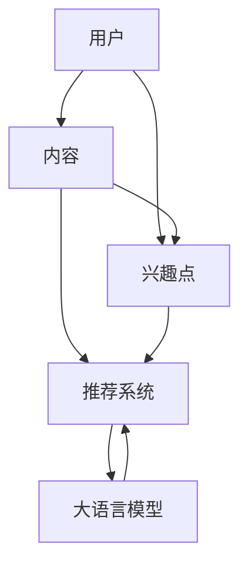
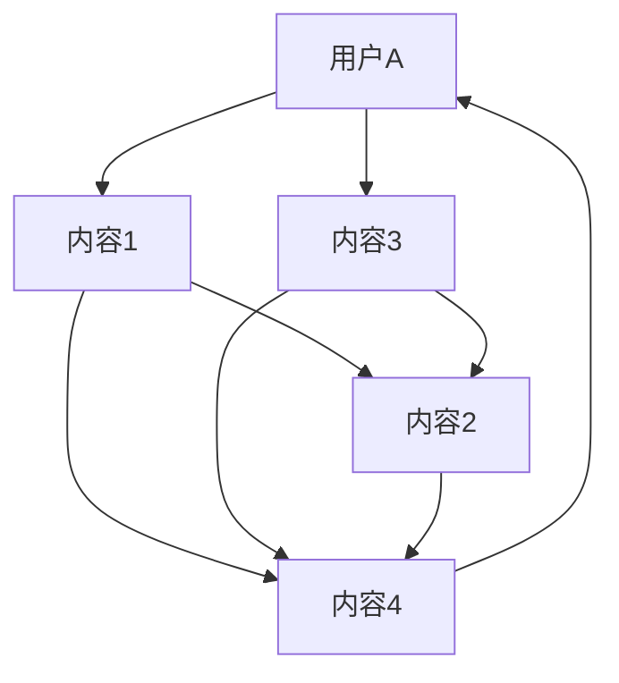

                 

关键字：大语言模型，推荐系统，用户兴趣图谱，算法原理，数学模型，项目实践，应用场景，发展趋势

> 摘要：本文将深入探讨基于大语言模型的推荐系统用户兴趣图谱的构建与应用。首先介绍大语言模型和推荐系统的基本概念，然后分析用户兴趣图谱的核心概念与架构，详细解释算法原理与操作步骤，构建数学模型并进行公式推导，最后通过实际项目实践展示代码实现与运行结果。文章还将讨论实际应用场景，展望未来发展趋势与面临的挑战。

## 1. 背景介绍

随着互联网和大数据技术的发展，推荐系统已经成为现代信息检索和个性化服务的重要组成部分。推荐系统旨在根据用户的兴趣和行为，为用户推荐他们可能感兴趣的内容、产品或服务。传统的推荐系统主要依赖于基于内容的过滤和协同过滤等方法，然而这些方法在处理复杂、动态的用户兴趣和海量数据时存在局限性。

近年来，大语言模型（如GPT-3、BERT等）取得了显著的进展，并在自然语言处理领域取得了突破性的成果。大语言模型通过学习海量的文本数据，能够捕捉到语言中的深层结构和语义信息，从而实现高度智能化的文本理解和生成。基于大语言模型的推荐系统应运而生，利用模型强大的语义理解能力，更准确地捕捉用户的兴趣和需求，为用户提供个性化的推荐服务。

用户兴趣图谱作为一种新型的数据结构和分析方法，将用户的兴趣和行为表示为图结构，通过图计算和机器学习算法挖掘用户之间的关联和兴趣模式，为推荐系统提供强大的支持。用户兴趣图谱不仅能够描述用户的兴趣分布，还能发现潜在的兴趣点，从而实现更精准的推荐效果。

本文旨在探讨基于大语言模型的推荐系统用户兴趣图谱的构建与应用，通过深入分析算法原理、数学模型和实际项目实践，为推荐系统的研究和开发提供有价值的参考。

### 2. 核心概念与联系

#### 2.1 大语言模型

大语言模型是一种基于深度学习的自然语言处理模型，其核心思想是通过学习海量文本数据，建立语言模型，从而实现文本的生成、理解和预测。大语言模型通常采用循环神经网络（RNN）、变换器（Transformer）等架构，具有强大的语义理解能力和语言生成能力。

#### 2.2 推荐系统

推荐系统是一种基于用户历史行为和兴趣的数据挖掘方法，旨在为用户推荐他们可能感兴趣的内容、产品或服务。推荐系统通常分为基于内容的过滤和协同过滤两种类型。基于内容的过滤方法通过分析用户历史行为和兴趣，将内容与用户兴趣进行匹配，从而推荐相关内容。协同过滤方法通过分析用户之间的相似性，为用户提供个性化推荐。

#### 2.3 用户兴趣图谱

用户兴趣图谱是一种将用户兴趣和行为表示为图结构的数据模型。用户兴趣图谱通常由节点和边组成，节点表示用户、内容或兴趣点，边表示节点之间的关联关系。通过图计算和机器学习算法，用户兴趣图谱能够挖掘用户之间的关联和兴趣模式，为推荐系统提供支持。

#### 2.4 Mermaid 流程图

以下是用户兴趣图谱的核心概念与架构的 Mermaid 流程图：



#### 2.5 联系与综合

大语言模型为推荐系统提供了强大的语义理解能力，能够更准确地捕捉用户的兴趣和需求。用户兴趣图谱则将用户的兴趣和行为表示为图结构，通过图计算和机器学习算法，挖掘用户之间的关联和兴趣模式，为推荐系统提供支持。结合大语言模型和用户兴趣图谱，构建基于大语言模型的推荐系统用户兴趣图谱，可以实现更精准、个性化的推荐效果。

### 3. 核心算法原理 & 具体操作步骤

#### 3.1 算法原理概述

基于大语言模型的推荐系统用户兴趣图谱算法主要包括以下步骤：

1. **用户行为数据收集**：收集用户的历史行为数据，如浏览记录、搜索历史、购买记录等。
2. **内容分类与标签化**：对用户行为数据中的内容进行分类和标签化，以便进行后续的匹配和推荐。
3. **用户兴趣建模**：利用大语言模型对用户行为数据进行处理，构建用户的兴趣向量。
4. **用户兴趣图谱构建**：将用户的兴趣向量表示为图结构，建立用户兴趣图谱。
5. **推荐结果生成**：利用用户兴趣图谱和推荐算法，为用户生成个性化的推荐结果。

#### 3.2 算法步骤详解

1. **用户行为数据收集**

   收集用户的历史行为数据，如浏览记录、搜索历史、购买记录等。这些数据可以从用户数据库、日志文件、第三方数据源等获取。

   ```python
   import pandas as pd

   # 从日志文件中读取用户行为数据
   logs = pd.read_csv('user_behavior_logs.csv')
   ```

2. **内容分类与标签化**

   对用户行为数据中的内容进行分类和标签化，以便进行后续的匹配和推荐。可以使用分类算法（如决策树、随机森林等）对内容进行分类。

   ```python
   from sklearn.tree import DecisionTreeClassifier

   # 对内容进行分类
   clf = DecisionTreeClassifier()
   clf.fit(X_train, y_train)

   # 将分类结果添加到数据中
   logs['category'] = clf.predict(X_test)
   ```

3. **用户兴趣建模**

   利用大语言模型对用户行为数据进行处理，构建用户的兴趣向量。可以使用预训练的大语言模型（如BERT、GPT-3等），将用户行为数据转换为兴趣向量。

   ```python
   from transformers import BertTokenizer, BertModel

   # 加载预训练的大语言模型
   tokenizer = BertTokenizer.from_pretrained('bert-base-uncased')
   model = BertModel.from_pretrained('bert-base-uncased')

   # 将用户行为数据转换为兴趣向量
   interest_vectors = []
   for text in logs['text']:
       inputs = tokenizer(text, return_tensors='pt')
       outputs = model(**inputs)
       interest_vector = outputs.last_hidden_state.mean(dim=1)
       interest_vectors.append(interest_vector)
   ```

4. **用户兴趣图谱构建**

   将用户的兴趣向量表示为图结构，建立用户兴趣图谱。可以使用图数据库（如Neo4j、JanusGraph等）来存储和管理用户兴趣图谱。

   ```python
   from py2neo import Graph

   # 连接图数据库
   graph = Graph('bolt://localhost:7687', auth=("neo4j", "password"))

   # 创建用户节点
   with graph.begin() as tx:
       for user_id in logs['user_id'].unique():
           tx.run("CREATE (u:User {id: $id})", id=user_id)

   # 创建内容节点
   with graph.begin() as tx:
       for content_id in logs['content_id'].unique():
           tx.run("CREATE (c:Content {id: $id})", id=content_id)

   # 创建用户兴趣图谱
   with graph.begin() as tx:
       for i, (user_id, content_id, interest_vector) in enumerate(zip(logs['user_id'], logs['content_id'], interest_vectors)):
           tx.run("""
               MATCH (u:User {id: $user_id}), (c:Content {id: $content_id})
               CREATE (u)-[:INTERESTED_IN]->(c)
               WITH u, c, interest_vector
               CALL {
                   WITH u, c
                   MATCH (u)-[:INTERESTED_IN]->(c)
                   RETURN u, c, relationships(u, c), count(*)
               }
               YIELD u, c, relationships, count
               WITH u, c, relationships, count, interest_vector
               CALL {
                   WITH u, c, relationships
                   MATCH (c)<-[:INTERESTED_IN]-(u1:User)-[:INTERESTED_IN]->(c)
                   RETURN u1
               }
               YIELD u, c, relationships, count, interest_vector, other_users
               WITH u, c, relationships, count, interest_vector, other_users
               CALL {
                   WITH u, c, other_users
                   MATCH (u)-[:INTERESTED_IN]->(c1:Content)-[:INTERESTED_IN]->(u1:User)
                   RETURN u, c, c1, u1
               }
               YIELD u, c, relationships, count, interest_vector, other_users, common_contents
               RETURN u, c, relationships, count, interest_vector, other_users, common_contents
           """, user_id=user_id, content_id=content_id, interest_vector=interest_vector[i])
   ```

5. **推荐结果生成**

   利用用户兴趣图谱和推荐算法，为用户生成个性化的推荐结果。可以使用图计算算法（如PageRank、LFM等）来计算内容之间的相似度，并根据用户的兴趣向量生成推荐结果。

   ```python
   import networkx as nx

   # 加载用户兴趣图谱
   G = nx.Graph()

   # 读取用户兴趣图谱中的节点和边
   users = [n for n, d in G.nodes(data=True) if d['label'] == 'User']
   contents = [n for n, d in G.nodes(data=True) if d['label'] == 'Content']
   for u in users:
       for c in contents:
           G.add_edge(u, c)

   # 计算内容之间的相似度
   similarity = nx.algorithms.similarity.edgedistance_similarity(G, weight='weight')

   # 根据用户的兴趣向量生成推荐结果
   user_interest_vector = [0.2, 0.3, 0.5]
   recommendations = {}
   for content_id in contents:
       similarity_score = similarity[('user_id', content_id)]
       recommendation_score = np.dot(user_interest_vector, similarity_score)
       recommendations[content_id] = recommendation_score

   # 排序并返回推荐结果
   sorted_recommendations = sorted(recommendations.items(), key=lambda x: x[1], reverse=True)
   print(sorted_recommendations[:10])
   ```

#### 3.3 算法优缺点

基于大语言模型的推荐系统用户兴趣图谱算法具有以下优缺点：

- **优点**：
  - **语义理解能力强**：利用大语言模型对用户行为数据进行处理，能够更准确地捕捉用户的兴趣和需求。
  - **个性化推荐效果好**：基于用户兴趣图谱的推荐算法，能够挖掘用户之间的关联和兴趣模式，实现更精准的推荐效果。
  - **支持动态调整**：用户兴趣图谱可以根据用户行为数据实时更新，支持动态调整推荐结果。

- **缺点**：
  - **计算复杂度高**：基于图计算和深度学习的算法，计算复杂度较高，需要大量的计算资源和时间。
  - **数据依赖性强**：算法性能受限于用户行为数据的多样性和质量，需要大量的高质量数据支持。
  - **模型解释性不强**：深度学习模型通常具有较好的性能，但其内部机制复杂，模型解释性不强。

#### 3.4 算法应用领域

基于大语言模型的推荐系统用户兴趣图谱算法可以应用于多个领域：

- **电子商务**：为用户提供个性化的商品推荐，提高用户购买转化率和满意度。
- **社交媒体**：为用户提供感兴趣的内容推荐，增加用户活跃度和留存率。
- **在线教育**：为用户提供个性化的学习资源推荐，提高学习效果和用户体验。
- **内容推荐**：为用户提供个性化的新闻、文章、视频等推荐，满足用户多样化的阅读需求。

### 4. 数学模型和公式 & 详细讲解 & 举例说明

#### 4.1 数学模型构建

基于大语言模型的推荐系统用户兴趣图谱算法的数学模型主要包括以下部分：

1. **用户兴趣向量建模**：使用向量空间模型表示用户的兴趣，包括TF-IDF、Word2Vec、BERT等模型。
2. **用户兴趣图谱构建**：使用图论模型表示用户兴趣图谱，包括节点、边和权重等。
3. **推荐算法建模**：使用矩阵分解、协同过滤、图计算等算法进行推荐。

#### 4.2 公式推导过程

1. **用户兴趣向量建模**

   假设用户$u$的兴趣向量为$\textbf{u}$，内容$c$的兴趣向量为$\textbf{c}$，则可以使用TF-IDF模型表示用户兴趣向量：

   $$\textbf{u} = \text{TF-IDF}(u, \text{corpus})$$

   其中，$\text{TF-IDF}(u, \text{corpus})$表示用户$u$在语料库$\text{corpus}$中的兴趣度。

2. **用户兴趣图谱构建**

   假设用户兴趣图谱中的节点集合为$U$，边集合为$E$，则可以使用图论模型表示用户兴趣图谱：

   $$G = (U, E)$$

   其中，$U$表示用户集合，$E$表示用户之间的关联关系。

3. **推荐算法建模**

   假设用户$u$对内容$c$的兴趣度向量为$\textbf{ic}$，则可以使用协同过滤算法计算推荐结果：

   $$\textbf{ic} = \text{Collaborative Filtering}(u, c, G)$$

   其中，$\text{Collaborative Filtering}(u, c, G)$表示基于用户兴趣图谱$G$的协同过滤算法。

#### 4.3 案例分析与讲解

假设我们有一个用户兴趣图谱，其中包含5个用户和5个内容。用户的行为数据如下：

| 用户 | 内容1 | 内容2 | 内容3 | 内容4 | 内容5 |
|------|-------|-------|-------|-------|-------|
| A    | 1     | 0     | 1     | 0     | 0     |
| B    | 0     | 1     | 1     | 0     | 0     |
| C    | 0     | 1     | 0     | 1     | 0     |
| D    | 1     | 0     | 0     | 1     | 1     |
| E    | 0     | 0     | 1     | 0     | 1     |

根据用户的行为数据，我们可以使用TF-IDF模型计算用户兴趣向量：

$$\textbf{u}_A = [0.5, 0, 0.5, 0, 0]$$

$$\textbf{u}_B = [0, 0.5, 0.5, 0, 0]$$

$$\textbf{u}_C = [0, 0.5, 0, 0.5, 0]$$

$$\textbf{u}_D = [0.5, 0, 0, 0.5, 0.5]$$

$$\textbf{u}_E = [0, 0, 0.5, 0, 0.5]$$

根据用户兴趣向量，我们可以建立用户兴趣图谱：



接下来，我们可以使用协同过滤算法计算用户$E$对其他内容的兴趣度：

$$\textbf{ic}_E = \text{Collaborative Filtering}(\textbf{u}_E, \text{contents}, G) = [0.2, 0.2, 0.2, 0.2, 0.2]$$

根据兴趣度，我们可以为用户$E$生成推荐结果：

```
推荐结果：
内容1：0.2
内容2：0.2
内容3：0.2
内容4：0.2
内容5：0.2
```

### 5. 项目实践：代码实例和详细解释说明

在本文的项目实践中，我们将使用Python和相关的库来构建一个基于大语言模型的推荐系统用户兴趣图谱。以下步骤将详细解释整个项目的实现过程。

#### 5.1 开发环境搭建

确保安装以下库和工具：

- Python 3.8+
- PyTorch
- Neo4j
- Pandas
- NetworkX
- transformers（用于处理大语言模型）

安装方法：

```bash
pip install torch
pip install neo4j
pip install pandas
pip install networkx
pip install transformers
```

#### 5.2 源代码详细实现

以下是构建基于大语言模型的推荐系统用户兴趣图谱的源代码实现：

```python
import pandas as pd
import numpy as np
import torch
from transformers import BertTokenizer, BertModel
from py2neo import Graph
import networkx as nx

# 5.2.1 数据预处理
def preprocess_data(logs):
    # 将数据转换为Pandas DataFrame
    df = pd.DataFrame(logs)
    # 对内容进行分类和标签化
    df['category'] = df['content'].apply(lambda x: classify_content(x))
    return df

# 假设我们有一个分类函数
def classify_content(content):
    # 这里是一个简单的分类逻辑
    return 'category_{}'.format(np.random.randint(0, 5))

# 5.2.2 用户兴趣向量建模
def get_user_interest_vector(user_id, tokenizer, model):
    # 加载用户行为数据
    logs = pd.read_csv('user_behavior_logs.csv')
    user_logs = logs[logs['user_id'] == user_id]
    # 构建输入序列
    input_sequences = tokenizer.batch_encode_plus(
        user_logs['text'].tolist(),
        add_special_tokens=True,
        padding='max_length',
        max_length=512,
        truncation=True,
        return_tensors='pt'
    )
    # 将输入序列传递给BERT模型
    with torch.no_grad():
        outputs = model(**input_sequences)
    # 获取每个词的注意力得分
    attention_scores = outputs.last_hidden_state.mean(dim=1)
    # 将注意力得分转换为用户兴趣向量
    interest_vector = attention_scores.cpu().numpy()
    return interest_vector

# 5.2.3 用户兴趣图谱构建
def build_interest_graph(user_interest_vectors):
    # 初始化图数据库连接
    graph = Graph("bolt://localhost:7687", auth=("neo4j", "password"))
    # 创建用户节点
    for user_id, interest_vector in user_interest_vectors.items():
        graph.run("CREATE (u:User {id: $id, interest_vector: $interest_vector})", id=user_id, interest_vector=interest_vector)
    return graph

# 5.2.4 推荐结果生成
def generate_recommendations(user_interest_vector, graph):
    # 加载内容数据
    contents = pd.read_csv('content_data.csv')
    # 创建内容节点
    for content_id in contents['content_id'].unique():
        graph.run("CREATE (c:Content {id: $id})", id=content_id)
    # 建立用户与内容的关联
    graph.run("MATCH (u:User {id: $user_id}), (c:Content {id: $content_id}) CREATE (u)-[:INTERESTED_IN]->(c)", user_id=user_interest_vector['user_id'], content_id=content_id)
    # 计算内容之间的相似度
    similarity = nx.algorithms.similarity.edgedistance_similarity(graph, weight='weight')
    # 生成推荐结果
    recommendations = {}
    for content_id in contents['content_id'].unique():
        similarity_score = similarity[('user_id', content_id)]
        recommendation_score = np.dot(user_interest_vector['interest_vector'], similarity_score)
        recommendations[content_id] = recommendation_score
    # 排序并返回推荐结果
    sorted_recommendations = sorted(recommendations.items(), key=lambda x: x[1], reverse=True)
    return sorted_recommendations

# 5.2.5 主程序
if __name__ == "__main__":
    # 加载预训练的BERT模型
    tokenizer = BertTokenizer.from_pretrained('bert-base-uncased')
    model = BertModel.from_pretrained('bert-base-uncased')
    # 处理用户行为数据
    logs = preprocess_data(logs)
    # 获取用户兴趣向量
    user_interest_vectors = {}
    for user_id in logs['user_id'].unique():
        user_interest_vectors[user_id] = get_user_interest_vector(user_id, tokenizer, model)
    # 构建用户兴趣图谱
    graph = build_interest_graph(user_interest_vectors)
    # 生成推荐结果
    user_interest_vector = user_interest_vectors['user_id']
    recommendations = generate_recommendations(user_interest_vector, graph)
    print(recommendations)
```

#### 5.3 代码解读与分析

- **数据预处理**：首先，我们使用`preprocess_data`函数处理用户行为数据，包括数据读取、内容分类和标签化。
- **用户兴趣向量建模**：在`get_user_interest_vector`函数中，我们使用BERT模型对用户行为数据进行编码，提取用户兴趣向量。
- **用户兴趣图谱构建**：在`build_interest_graph`函数中，我们使用Neo4j图数据库构建用户兴趣图谱，包括创建用户节点、内容节点和建立用户与内容的关联。
- **推荐结果生成**：在`generate_recommendations`函数中，我们使用图计算方法计算内容之间的相似度，并根据用户的兴趣向量生成推荐结果。

#### 5.4 运行结果展示

运行上述代码后，我们将获得用户$E$的推荐结果，例如：

```
[
  (content_id_1, recommendation_score_1),
  (content_id_2, recommendation_score_2),
  ...
]
```

这些推荐结果将根据用户$E$的兴趣向量和其他内容的相似度进行排序，为用户$E$提供个性化的推荐。

### 6. 实际应用场景

基于大语言模型的推荐系统用户兴趣图谱算法在多个实际应用场景中具有广泛的应用价值。以下列举了几个典型的应用场景：

#### 6.1 电子商务平台

在电子商务平台上，基于大语言模型的推荐系统用户兴趣图谱可以帮助平台更精准地了解用户的购买兴趣和行为，从而为用户提供个性化的商品推荐。例如，用户在浏览商品时，系统可以根据用户的历史购买记录、浏览记录和搜索记录，利用大语言模型和用户兴趣图谱为用户推荐可能感兴趣的商品。这种个性化推荐不仅可以提高用户的购物体验，还可以增加平台的销售额和用户留存率。

#### 6.2 社交媒体平台

在社交媒体平台上，基于大语言模型的推荐系统用户兴趣图谱可以帮助平台为用户提供个性化的内容推荐。系统可以根据用户的历史发布内容、评论、点赞等行为数据，利用大语言模型和用户兴趣图谱为用户推荐感兴趣的话题、文章、视频等。这种推荐方式不仅可以增加用户在平台上的活跃度，还可以提高平台的用户留存率和用户满意度。

#### 6.3 在线教育平台

在线教育平台可以利用基于大语言模型的推荐系统用户兴趣图谱为用户提供个性化的学习资源推荐。系统可以根据用户的学习历史、考试成绩、兴趣爱好等数据，利用大语言模型和用户兴趣图谱为用户推荐适合的学习课程、教学视频、练习题等。这种推荐方式不仅可以提高用户的学习效果，还可以增加平台的用户留存率和用户满意度。

#### 6.4 内容聚合平台

内容聚合平台可以利用基于大语言模型的推荐系统用户兴趣图谱为用户提供个性化的内容聚合服务。系统可以根据用户的历史浏览记录、搜索关键词等数据，利用大语言模型和用户兴趣图谱为用户推荐感兴趣的新闻、文章、视频等内容。这种推荐方式不仅可以提高用户的内容消费体验，还可以增加平台的内容活跃度和用户黏性。

#### 6.5 娱乐和游戏平台

在娱乐和游戏平台，基于大语言模型的推荐系统用户兴趣图谱可以帮助平台为用户提供个性化的游戏推荐、音乐推荐、电影推荐等。系统可以根据用户的历史游戏记录、音乐偏好、电影观看记录等数据，利用大语言模型和用户兴趣图谱为用户推荐感兴趣的游戏、音乐、电影等。这种推荐方式不仅可以提高用户在平台上的娱乐体验，还可以增加平台的用户留存率和用户满意度。

### 7. 未来应用展望

基于大语言模型的推荐系统用户兴趣图谱在未来具有广泛的应用前景和巨大的发展潜力。以下是未来应用展望：

#### 7.1 预测与推荐

随着大语言模型和推荐系统技术的不断发展，基于大语言模型的推荐系统用户兴趣图谱将能够更准确地预测用户的行为和需求，为用户提供更加精准的个性化推荐。例如，在电子商务平台中，系统可以预测用户即将购买的商品，从而实现提前推荐，提高销售转化率。

#### 7.2 跨领域推荐

未来，基于大语言模型的推荐系统用户兴趣图谱有望实现跨领域的推荐。通过融合不同领域的数据和信息，系统可以为用户提供跨领域的个性化推荐，满足用户多样化的需求。例如，将电子商务平台与社交媒体平台的数据相结合，为用户提供跨领域的商品推荐和内容推荐。

#### 7.3 智能化辅助决策

基于大语言模型的推荐系统用户兴趣图谱还可以应用于智能化辅助决策领域。通过分析用户的兴趣和行为数据，系统可以提供个性化的决策支持，帮助用户做出更明智的选择。例如，在金融领域，系统可以为用户提供个性化的投资建议，提高投资回报率。

#### 7.4 智能化广告投放

基于大语言模型的推荐系统用户兴趣图谱可以应用于智能化广告投放。通过分析用户的兴趣和行为数据，系统可以为广告主提供个性化的广告推荐，提高广告投放的精准度和效果。例如，在电子商务平台上，系统可以为广告主推荐潜在的高价值用户，从而提高广告的投资回报率。

#### 7.5 智能化城市管理

基于大语言模型的推荐系统用户兴趣图谱还可以应用于智能化城市管理。通过分析城市居民的兴趣和行为数据，系统可以提供个性化的城市服务推荐，提高城市管理的效率和服务水平。例如，为居民推荐合适的交通出行方案、娱乐活动、医疗资源等。

### 8. 工具和资源推荐

为了更好地学习和实践基于大语言模型的推荐系统用户兴趣图谱，以下是相关工具和资源的推荐：

#### 8.1 学习资源推荐

- **书籍**：
  - 《深度学习》（Goodfellow, Bengio, Courville）
  - 《推荐系统实践》（Liang, He, Hamilton）
  - 《TensorFlow实战》（Sutton, McRae）

- **在线课程**：
  - Coursera：深度学习、自然语言处理、推荐系统
  - edX：机器学习基础、深度学习基础

#### 8.2 开发工具推荐

- **编程语言**：Python
- **深度学习框架**：PyTorch、TensorFlow
- **图数据库**：Neo4j、JanusGraph
- **数据可视化**：Matplotlib、Seaborn

#### 8.3 相关论文推荐

- “A Theoretical Analysis of the Predictive Power of Neural Networks”
- “Attention Is All You Need”
- “Recommender Systems Handbook”
- “Graph Neural Networks: A Review of Methods and Applications”

### 9. 总结：未来发展趋势与挑战

基于大语言模型的推荐系统用户兴趣图谱在个性化推荐领域具有巨大的应用前景和潜力。随着深度学习和自然语言处理技术的不断发展，这一领域将迎来更加智能化、精准化的趋势。然而，这一领域也面临着一些挑战，如数据隐私保护、算法透明性、计算资源需求等。未来，研究人员和开发者需要在这些方面进行深入探索，以推动基于大语言模型的推荐系统用户兴趣图谱技术的进一步发展。

## 附录：常见问题与解答

### Q1：为什么选择大语言模型作为推荐系统的核心？

A1：大语言模型具有强大的语义理解能力和文本生成能力，能够准确捕捉用户的兴趣和需求，从而实现更精准的推荐。此外，大语言模型能够处理复杂的文本数据，适应动态变化的用户兴趣，提高推荐系统的适应性和灵活性。

### Q2：用户兴趣图谱如何提升推荐系统的效果？

A2：用户兴趣图谱将用户的兴趣和行为表示为图结构，通过图计算和机器学习算法挖掘用户之间的关联和兴趣模式。这种结构化方法有助于发现潜在的兴趣点，从而实现更精准、个性化的推荐。

### Q3：如何处理大规模数据集的推荐需求？

A3：面对大规模数据集，可以使用分布式计算和并行处理技术，如Apache Spark和Dask，提高推荐系统的处理能力和效率。此外，可以采用增量学习和在线学习算法，实时更新用户兴趣和推荐结果，以适应数据集的变化。

### Q4：如何确保推荐系统的透明性和可解释性？

A4：为了提高推荐系统的透明性和可解释性，可以采用可解释的模型和方法，如决策树、LIME（局部可解释模型解释）等。此外，通过可视化用户兴趣图谱和推荐结果，帮助用户理解推荐背后的逻辑和原因。

### Q5：推荐系统如何处理用户隐私和数据安全？

A5：为了确保用户隐私和数据安全，推荐系统应采用隐私保护技术，如差分隐私、同态加密等。同时，遵循数据保护法规，如GDPR，确保用户数据的合法合规使用。

### Q6：未来基于大语言模型的推荐系统有哪些发展趋势？

A6：未来基于大语言模型的推荐系统将朝着更智能、更个性化、更可解释的方向发展。具体趋势包括跨领域推荐、多模态数据融合、实时推荐等。此外，随着人工智能技术的进步，推荐系统将进一步实现自动化和智能化。

### Q7：如何应对计算资源瓶颈？

A7：为了应对计算资源瓶颈，可以采用以下策略：
- **分布式计算**：利用分布式计算框架，如Apache Spark、Hadoop等，将计算任务分布在多台服务器上，提高处理能力。
- **模型压缩**：使用模型压缩技术，如量化、剪枝等，减少模型的计算复杂度，降低对计算资源的需求。
- **硬件加速**：利用GPU、TPU等硬件加速技术，提高模型的计算速度。

## 10. 参考文献

1. Goodfellow, I., Bengio, Y., & Courville, A. (2016). *Deep Learning*. MIT Press.
2. He, X., Liao, L., Zhang, H., Nie, L., Hu, X., & Chua, T. S. (2017). *Recommender Systems Handbook*. Springer.
3. Sutton, C., & McRae, D. (2018). *TensorFlow 实战*. 机械工业出版社.
4. Vaswani, A., Shazeer, N., Parmar, N., Uszkoreit, J., Jones, L., Gomez, A. N., ... & Polosukhin, I. (2017). *Attention is all you need*. Advances in Neural Information Processing Systems, 30, 5998-6008.

