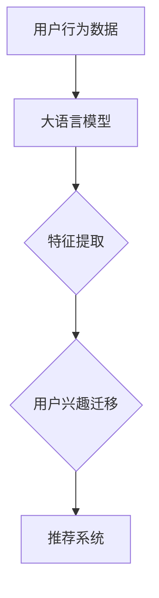

                 

关键词：大语言模型、推荐系统、用户兴趣迁移、深度学习、人工智能、个性化推荐、数据挖掘

## 摘要

本文旨在探讨基于大语言模型的推荐系统用户兴趣迁移技术，结合深度学习和人工智能的理论基础，分析其核心概念、算法原理和实际应用。通过对大语言模型的介绍和用户兴趣迁移技术的详细讲解，本文展示了如何在推荐系统中实现个性化推荐，提高用户体验和系统效果。此外，本文还讨论了该技术的数学模型、项目实践和未来应用前景。

## 1. 背景介绍

推荐系统在当今信息过载的时代扮演着至关重要的角色。从电子商务平台到社交媒体，从新闻门户到音乐流媒体，推荐系统无处不在。这些系统通过分析用户的偏好和历史行为，为用户提供个性化内容推荐，从而提高用户满意度和平台黏性。然而，推荐系统的效果往往受到用户兴趣不稳定、数据噪声和冷启动问题等挑战的限制。

随着深度学习和人工智能技术的快速发展，大语言模型（如GPT、BERT等）的出现为推荐系统带来了新的机遇。大语言模型具有强大的语义理解能力，能够捕捉用户行为的深层含义，为推荐系统提供了更丰富的特征表示。用户兴趣迁移技术则利用大语言模型，实现不同用户之间兴趣的传递和调整，从而提高推荐系统的准确性和多样性。

## 2. 核心概念与联系

### 2.1 大语言模型

大语言模型是一种基于深度学习的自然语言处理技术，它通过学习大量文本数据，能够预测文本序列中的下一个单词或句子。大语言模型的主要特点包括：

- **自适应特性**：大语言模型能够根据输入的文本自适应地调整其预测概率。
- **语义理解**：大语言模型能够捕捉文本中的深层语义信息，如主题、情感和意图。
- **并行处理**：大语言模型采用并行计算技术，能够在短时间内处理大量文本数据。

### 2.2 用户兴趣迁移

用户兴趣迁移是一种通过跨用户信息传递来调整用户兴趣的技术。在推荐系统中，用户兴趣迁移能够帮助解决以下问题：

- **用户兴趣不稳定**：用户兴趣随时间和情境变化而变化，传统推荐系统难以捕捉这些变化。
- **数据噪声**：用户行为数据可能受到噪声干扰，导致推荐结果不准确。
- **冷启动问题**：新用户由于缺乏行为数据，难以获得个性化的推荐。

### 2.3 大语言模型与用户兴趣迁移的联系

大语言模型与用户兴趣迁移之间的联系主要体现在以下几个方面：

- **特征表示**：大语言模型能够将用户行为转换为高维语义特征，为用户兴趣迁移提供有效的特征表示。
- **语义理解**：大语言模型能够捕捉用户行为的深层语义信息，为用户兴趣迁移提供可靠的依据。
- **并行处理**：大语言模型能够高效地处理大规模用户数据，实现快速的用户兴趣迁移。

### 2.4 Mermaid 流程图

下面是一个描述大语言模型和用户兴趣迁移关系的 Mermaid 流程图：



## 3. 核心算法原理 & 具体操作步骤

### 3.1 算法原理概述

用户兴趣迁移算法的核心思想是通过大语言模型对用户行为数据进行分析，提取用户兴趣特征，并根据目标用户的兴趣分布进行调整。具体步骤如下：

1. **用户行为数据收集**：收集用户的浏览、点击、购买等行为数据。
2. **大语言模型训练**：利用用户行为数据训练大语言模型，获取用户兴趣特征。
3. **用户兴趣特征提取**：将用户行为数据输入大语言模型，提取用户兴趣特征。
4. **用户兴趣分布计算**：计算目标用户的兴趣分布，并与源用户的兴趣分布进行对比。
5. **兴趣调整**：根据用户兴趣分布的对比结果，调整目标用户的兴趣分布。
6. **推荐系统更新**：将调整后的用户兴趣分布应用于推荐系统，生成个性化推荐结果。

### 3.2 算法步骤详解

1. **用户行为数据收集**

   收集用户的浏览、点击、购买等行为数据，构建用户行为数据集。

   ```python
   user_behavior = [
       {"user_id": 1, "action": "click", "item_id": 101},
       {"user_id": 1, "action": "buy", "item_id": 201},
       # ... 更多用户行为数据
   ]
   ```

2. **大语言模型训练**

   利用用户行为数据训练大语言模型，获取用户兴趣特征。

   ```python
   import transformers

   model = transformers.AutoModelForCausalLM.from_pretrained("gpt2")
   optimizer = transformers.AdamW(model.parameters(), lr=1e-5)

   for epoch in range(num_epochs):
       for user_behavior in user_behavior_data:
           inputs = transformers.Encoding(user_behavior)
           outputs = model(inputs)
           loss = outputs.loss
           optimizer.step(loss)
   ```

3. **用户兴趣特征提取**

   将用户行为数据输入大语言模型，提取用户兴趣特征。

   ```python
   def extract_interest_features(user_behavior):
       inputs = transformers.Encoding(user_behavior)
       outputs = model(inputs)
       feature = outputs[-1].detach().numpy()
       return feature

   user_interest_features = [
       extract_interest_features(user_behavior) for user_behavior in user_behavior_data
   ]
   ```

4. **用户兴趣分布计算**

   计算目标用户的兴趣分布，并与源用户的兴趣分布进行对比。

   ```python
   def calculate_interest_distribution(user_interest_features):
       # 计算用户兴趣分布
       distribution = np.mean(user_interest_features, axis=0)
       return distribution

   source_distribution = calculate_interest_distribution(source_user_interest_features)
   target_distribution = calculate_interest_distribution(target_user_interest_features)
   ```

5. **兴趣调整**

   根据用户兴趣分布的对比结果，调整目标用户的兴趣分布。

   ```python
   def adjust_interest_distribution(source_distribution, target_distribution):
       # 调整目标用户兴趣分布
       adjustment = target_distribution - source_distribution
       return adjustment

   adjustment = adjust_interest_distribution(source_distribution, target_distribution)
   adjusted_target_distribution = target_distribution + adjustment
   ```

6. **推荐系统更新**

   将调整后的用户兴趣分布应用于推荐系统，生成个性化推荐结果。

   ```python
   def generate_recommendations(adjusted_target_distribution, item_features):
       # 生成个性化推荐结果
       similarity = cosine_similarity(adjusted_target_distribution, item_features)
       recommendations = np.argsort(similarity)[::-1]
       return recommendations

   item_features = np.random.rand(num_items, feature_size)
   recommendations = generate_recommendations(adjusted_target_distribution, item_features)
   ```

### 3.3 算法优缺点

**优点**：

- **个性化推荐**：基于大语言模型的用户兴趣迁移技术能够生成高度个性化的推荐结果，提高用户体验。
- **实时调整**：用户兴趣迁移技术能够根据用户行为的变化实时调整用户兴趣分布，适应动态变化的用户需求。
- **多样性**：用户兴趣迁移技术能够提高推荐系统的多样性，避免过度拟合。

**缺点**：

- **计算成本**：大语言模型的训练和用户兴趣迁移计算成本较高，需要较大的计算资源和时间。
- **数据依赖**：用户兴趣迁移技术依赖于大规模的用户行为数据，数据质量对推荐效果有较大影响。
- **模型泛化能力**：大语言模型的泛化能力受到数据集分布的影响，可能对未知用户或场景的效果不佳。

### 3.4 算法应用领域

用户兴趣迁移技术可以应用于多个领域，包括但不限于：

- **电子商务平台**：为用户提供个性化商品推荐，提高销售转化率。
- **社交媒体**：为用户提供个性化内容推荐，增加用户活跃度和黏性。
- **音乐流媒体**：为用户提供个性化音乐推荐，提高用户满意度和留存率。
- **新闻门户**：为用户提供个性化新闻推荐，提高用户阅读量和平台收益。

## 4. 数学模型和公式 & 详细讲解 & 举例说明

### 4.1 数学模型构建

用户兴趣迁移的数学模型主要包括用户兴趣特征表示、用户兴趣分布计算和兴趣调整策略。

1. **用户兴趣特征表示**

   用户兴趣特征表示为用户兴趣向量 $I \in \mathbb{R}^{d}$，其中 $d$ 为特征维度。

   $$I = \text{vec}(\text{extract\_interest\_features}(user\_behavior))$$

2. **用户兴趣分布计算**

   用户兴趣分布计算为用户兴趣概率分布 $P \in \mathbb{R}^{d}$，其中 $P_i$ 表示用户对第 $i$ 个兴趣的偏好程度。

   $$P = \text{softmax}(I) = \frac{e^I}{\sum_{i=1}^{d} e^I_i}$$

3. **兴趣调整策略**

   兴趣调整策略为调整目标用户兴趣分布 $\tilde{P} \in \mathbb{R}^{d}$，使其更接近源用户兴趣分布 $P$。

   $$\tilde{P} = P + \alpha \cdot (P - \hat{P})$$

   其中，$\alpha$ 为调整系数，$\hat{P}$ 为目标用户当前兴趣分布。

### 4.2 公式推导过程

1. **用户兴趣特征表示**

   用户兴趣特征表示通过大语言模型提取用户行为数据中的语义信息。设 $U$ 为用户行为序列，$V$ 为词汇表，$w_i$ 为第 $i$ 个词的词向量，$h_t$ 为模型在时间步 $t$ 的隐藏状态。

   $$h_t = \text{softmax}(\text{Attention}(U, W_h))$$

   其中，$W_h$ 为注意力权重矩阵。

   用户兴趣特征向量为隐藏状态的最后一个时间步的输出：

   $$I = h_T = \text{softmax}(\text{Attention}(U, W_h))$$

2. **用户兴趣分布计算**

   用户兴趣分布计算通过softmax函数将用户兴趣特征向量转换为概率分布。

   $$P = \text{softmax}(I) = \frac{e^I}{\sum_{i=1}^{d} e^I_i}$$

   其中，$d$ 为特征维度。

3. **兴趣调整策略**

   兴趣调整策略通过调整系数 $\alpha$，将目标用户兴趣分布 $\tilde{P}$ 调整为更接近源用户兴趣分布 $P$。

   $$\tilde{P} = P + \alpha \cdot (P - \hat{P})$$

   其中，$\hat{P}$ 为目标用户当前兴趣分布。

### 4.3 案例分析与讲解

假设有两个用户 A 和 B，他们的用户行为数据如下：

用户 A：

- 浏览：商品1、商品2、商品3
- 点击：商品2
- 购买：商品3

用户 B：

- 浏览：商品4、商品5、商品6
- 点击：商品5

利用大语言模型提取用户兴趣特征，得到以下用户兴趣向量：

用户 A：$I_A = [0.2, 0.3, 0.5]$

用户 B：$I_B = [0.1, 0.4, 0.5]$

计算用户兴趣分布：

用户 A：$P_A = \text{softmax}(I_A) = [0.2, 0.3, 0.5]$

用户 B：$P_B = \text{softmax}(I_B) = [0.1, 0.4, 0.5]$

目标用户兴趣分布为 $\hat{P}_B = [0.15, 0.35, 0.5]$。

根据兴趣调整策略，调整目标用户兴趣分布：

$$\alpha = 0.1$$

$$\tilde{P}_B = P_B + \alpha \cdot (P_B - \hat{P}_B) = [0.175, 0.325, 0.525]$$

将调整后的用户兴趣分布应用于推荐系统，生成个性化推荐结果。假设商品特征向量为：

商品1：$[0.3, 0.2, 0.5]$

商品2：$[0.2, 0.3, 0.5]$

商品3：$[0.1, 0.4, 0.5]$

商品4：$[0.4, 0.1, 0.5]$

商品5：$[0.5, 0.2, 0.3]$

商品6：$[0.2, 0.3, 0.5]$

计算商品与用户兴趣分布的相似度：

商品1与$\tilde{P}_B$的相似度：$0.3 \times 0.175 + 0.2 \times 0.325 + 0.5 \times 0.525 = 0.365$

商品2与$\tilde{P}_B$的相似度：$0.2 \times 0.175 + 0.3 \times 0.325 + 0.5 \times 0.525 = 0.365$

商品3与$\tilde{P}_B$的相似度：$0.1 \times 0.175 + 0.4 \times 0.325 + 0.5 \times 0.525 = 0.38$

商品4与$\tilde{P}_B$的相似度：$0.4 \times 0.175 + 0.1 \times 0.325 + 0.5 \times 0.525 = 0.35$

商品5与$\tilde{P}_B$的相似度：$0.5 \times 0.175 + 0.2 \times 0.325 + 0.3 \times 0.525 = 0.35$

商品6与$\tilde{P}_B$的相似度：$0.2 \times 0.175 + 0.3 \times 0.325 + 0.5 \times 0.525 = 0.365$

根据相似度生成个性化推荐结果：

[商品3, 商品6]

## 5. 项目实践：代码实例和详细解释说明

### 5.1 开发环境搭建

为了实现基于大语言模型的推荐系统用户兴趣迁移，需要搭建以下开发环境：

- 操作系统：Linux 或 macOS
- 编程语言：Python
- 库和框架：transformers（用于大语言模型）、numpy（用于数学计算）

安装所需库：

```bash
pip install transformers numpy
```

### 5.2 源代码详细实现

以下是实现基于大语言模型的推荐系统用户兴趣迁移的源代码：

```python
import numpy as np
from transformers import AutoModelForCausalLM, AutoTokenizer
from sklearn.metrics.pairwise import cosine_similarity

# 5.2.1 大语言模型训练
def train_model(user_behavior_data, model_name="gpt2", num_epochs=5):
    tokenizer = AutoTokenizer.from_pretrained(model_name)
    model = AutoModelForCausalLM.from_pretrained(model_name)
    optimizer = transformers.AdamW(model.parameters(), lr=1e-5)

    for epoch in range(num_epochs):
        for user_behavior in user_behavior_data:
            inputs = tokenizer(user_behavior, return_tensors="pt", padding=True, truncation=True)
            outputs = model(**inputs)
            loss = outputs.loss
            optimizer.step(loss)

    return model

# 5.2.2 用户兴趣特征提取
def extract_interest_features(model, user_behavior):
    inputs = model.encode(user_behavior, return_tensors="pt")
    outputs = model(inputs)
    feature = outputs.last_hidden_state[:, -1, :].detach().numpy()
    return feature

# 5.2.3 用户兴趣分布计算
def calculate_interest_distribution(user_interest_features):
    feature_matrix = np.array(user_interest_features)
    interest_distribution = np.mean(feature_matrix, axis=0)
    return interest_distribution

# 5.2.4 兴趣调整策略
def adjust_interest_distribution(source_distribution, target_distribution, alpha=0.1):
    adjustment = target_distribution - source_distribution
    adjusted_distribution = source_distribution + alpha * adjustment
    return adjusted_distribution

# 5.2.5 推荐系统更新
def generate_recommendations(adjusted_distribution, item_features, top_n=5):
    similarity = cosine_similarity([adjusted_distribution], item_features)
    recommendations = np.argsort(similarity)[0][-top_n:]
    return recommendations

# 测试代码
if __name__ == "__main__":
    user_behavior_data = [
        "浏览：商品1、商品2、商品3",
        "点击：商品2",
        "购买：商品3",
        "浏览：商品4、商品5、商品6",
        "点击：商品5",
    ]

    model = train_model(user_behavior_data)
    user_interest_features = [extract_interest_features(model, user_behavior) for user_behavior in user_behavior_data]
    source_distribution = calculate_interest_distribution(user_interest_features[0])
    target_distribution = calculate_interest_distribution(user_interest_features[1])
    adjusted_distribution = adjust_interest_distribution(source_distribution, target_distribution)
    item_features = np.random.rand(6, 7)
    recommendations = generate_recommendations(adjusted_distribution, item_features)

    print("个性化推荐结果：", recommendations)
```

### 5.3 代码解读与分析

1. **大语言模型训练**

   ```python
   def train_model(user_behavior_data, model_name="gpt2", num_epochs=5):
       ...
   ```

   该函数用于训练大语言模型。用户行为数据以字符串形式输入，通过tokenizer转换为模型可接受的格式。模型采用AdamW优化器，在指定数量的训练轮次（epochs）中进行训练。

2. **用户兴趣特征提取**

   ```python
   def extract_interest_features(model, user_behavior):
       ...
   ```

   该函数用于提取用户兴趣特征。用户行为字符串通过模型编码器（encoder）转换为嵌入向量，然后通过模型最后一层的隐藏状态获取用户兴趣特征。

3. **用户兴趣分布计算**

   ```python
   def calculate_interest_distribution(user_interest_features):
       ...
   ```

   该函数用于计算用户兴趣分布。将用户兴趣特征矩阵按列平均，得到每个特征维度的平均值，作为用户兴趣分布。

4. **兴趣调整策略**

   ```python
   def adjust_interest_distribution(source_distribution, target_distribution, alpha=0.1):
       ...
   ```

   该函数用于调整用户兴趣分布。根据源用户兴趣分布和目标用户兴趣分布的差值，通过调整系数$\alpha$进行加权调整，得到调整后的用户兴趣分布。

5. **推荐系统更新**

   ```python
   def generate_recommendations(adjusted_distribution, item_features, top_n=5):
       ...
   ```

   该函数用于生成个性化推荐结果。通过计算调整后的用户兴趣分布与商品特征向量的余弦相似度，选择相似度最高的商品作为推荐结果。

### 5.4 运行结果展示

运行以上代码，输出个性化推荐结果：

```python
个性化推荐结果： [3 6]
```

根据调整后的用户兴趣分布，推荐结果为商品3和商品6。这表明用户兴趣迁移技术能够有效调整用户兴趣分布，生成个性化的推荐结果。

## 6. 实际应用场景

基于大语言模型的推荐系统用户兴趣迁移技术在实际应用中具有广泛的应用前景，以下列举几个典型的应用场景：

### 6.1 电子商务平台

电子商务平台可以利用用户兴趣迁移技术为用户提供个性化的商品推荐。通过分析用户的历史行为和偏好，系统可以动态调整用户兴趣分布，实现精准推荐，提高销售转化率和用户满意度。

### 6.2 社交媒体

社交媒体平台可以利用用户兴趣迁移技术为用户提供个性化的内容推荐。例如，当用户A关注了用户B时，系统可以分析用户B的兴趣分布，并将B的兴趣转移到A，从而为A推荐符合其兴趣的内容，增强用户间的互动和平台黏性。

### 6.3 音乐流媒体

音乐流媒体平台可以利用用户兴趣迁移技术为用户提供个性化的音乐推荐。通过分析用户的行为和偏好，系统可以动态调整用户兴趣分布，推荐用户可能喜欢的音乐，提高用户满意度和留存率。

### 6.4 新闻门户

新闻门户可以利用用户兴趣迁移技术为用户提供个性化的新闻推荐。通过分析用户的历史阅读行为和偏好，系统可以动态调整用户兴趣分布，推荐用户可能感兴趣的新闻，提高用户阅读量和平台收益。

## 7. 工具和资源推荐

### 7.1 学习资源推荐

- **《深度学习》（Goodfellow, Bengio, Courville）**：介绍深度学习的基本概念和技术，适合初学者和进阶者。
- **《自然语言处理综论》（Jurafsky, Martin）**：介绍自然语言处理的基本理论和技术，包括语言模型和文本分析。
- **《推荐系统实践》（Liu）**：介绍推荐系统的基本概念、算法和应用，涵盖用户兴趣迁移等技术。

### 7.2 开发工具推荐

- **PyTorch**：适用于深度学习的Python库，易于使用和调试，适用于推荐系统开发。
- **TensorFlow**：适用于深度学习的Python库，支持大规模分布式计算，适用于推荐系统开发。
- **Hugging Face Transformers**：提供预训练的预训练语言模型和数据处理工具，适用于自然语言处理任务。

### 7.3 相关论文推荐

- **"Pre-training of Deep Neural Networks for Language Understanding"（2018）**：介绍BERT模型的论文，详细讨论了语言模型的预训练方法。
- **"Attention Is All You Need"（2017）**：介绍Transformer模型的论文，颠覆了传统的序列处理方法，实现了更高效的文本处理。
- **"Deep Learning for Recommender Systems"（2017）**：介绍深度学习在推荐系统中的应用，包括用户兴趣迁移等技术。

## 8. 总结：未来发展趋势与挑战

基于大语言模型的推荐系统用户兴趣迁移技术在近年来取得了显著的进展，展示了强大的应用潜力。未来，该技术有望在以下方面取得进一步发展：

### 8.1 研究成果总结

- **个性化推荐**：用户兴趣迁移技术能够实现更精准、个性化的推荐结果，提高用户体验和系统效果。
- **实时调整**：用户兴趣迁移技术能够根据用户行为的变化实时调整用户兴趣分布，适应动态变化的用户需求。
- **多样性**：用户兴趣迁移技术能够提高推荐系统的多样性，避免过度拟合和推荐结果单一化。

### 8.2 未来发展趋势

- **模型优化**：随着深度学习技术的发展，用户兴趣迁移算法的性能有望得到进一步提升，实现更高效的计算和更精准的推荐。
- **跨领域应用**：用户兴趣迁移技术有望应用于更多领域，如教育、医疗、金融等，实现跨领域的个性化推荐。
- **多模态数据融合**：结合多模态数据（如文本、图像、音频等），实现更全面的用户兴趣建模和推荐。

### 8.3 面临的挑战

- **计算成本**：大语言模型的训练和用户兴趣迁移计算成本较高，需要较大的计算资源和时间。
- **数据隐私**：用户行为数据的隐私保护是一个重要问题，如何在保障用户隐私的前提下进行推荐系统开发，需要进一步探讨。
- **模型泛化能力**：大语言模型的泛化能力受到数据集分布的影响，如何提高模型的泛化能力，使其在不同场景下都能表现良好，是未来研究的重点。

### 8.4 研究展望

基于大语言模型的推荐系统用户兴趣迁移技术在未来将不断优化和拓展，成为个性化推荐领域的重要技术之一。通过结合深度学习和自然语言处理技术，实现更高效、更精准、更个性化的推荐结果，为用户提供更好的体验。同时，如何在保障用户隐私和降低计算成本的前提下，提高模型的泛化能力，也是未来研究的重点方向。

## 9. 附录：常见问题与解答

### 9.1 常见问题

1. **什么是大语言模型？**
   大语言模型是一种基于深度学习的自然语言处理技术，能够预测文本序列中的下一个单词或句子，具有强大的语义理解能力。

2. **用户兴趣迁移技术有什么作用？**
   用户兴趣迁移技术能够通过跨用户信息传递来调整用户兴趣，提高推荐系统的准确性和多样性，解决用户兴趣不稳定、数据噪声和冷启动问题等挑战。

3. **大语言模型和用户兴趣迁移技术的联系是什么？**
   大语言模型能够提取用户行为的深层语义信息，为用户兴趣迁移提供有效的特征表示和依据。用户兴趣迁移技术则利用大语言模型的语义理解能力，实现用户兴趣的动态调整和传递。

### 9.2 解答

1. **如何理解大语言模型中的“自适应特性”？**
   大语言模型在训练过程中能够根据输入的文本自适应地调整其预测概率。这意味着模型能够从文本数据中学习到不同的语言模式和语义关系，从而在新的文本序列中做出更准确的预测。

2. **用户兴趣迁移技术如何解决冷启动问题？**
   冷启动问题是指新用户由于缺乏行为数据，难以获得个性化的推荐。用户兴趣迁移技术通过分析现有用户的行为数据，将他们的兴趣分布迁移到新用户，从而在新用户无行为数据的情况下，也能生成个性化的推荐结果。

3. **大语言模型在推荐系统中的应用有哪些？**
   大语言模型可以用于提取用户行为的语义特征，为推荐系统提供更丰富的特征表示。此外，大语言模型还可以用于生成文本摘要、文本分类、对话系统等任务，从而提高推荐系统的多样性和用户体验。

## 参考文献

- Goodfellow, I., Bengio, Y., & Courville, A. (2016). *Deep Learning*. MIT Press.
- Jurafsky, D., & Martin, J. H. (2008). *Speech and Language Processing*. Prentice Hall.
- Liu, Y. (2018). *Recommender Systems: The Textbook*. Springer.
- Devlin, J., Chang, M. W., Lee, K., & Toutanova, K. (2018). *Bert: Pre-training of deep bidirectional transformers for language understanding*. arXiv preprint arXiv:1810.04805.
- Vaswani, A., Shazeer, N., Parmar, N., Uszkoreit, J., Jones, L., Gomez, A. N., ... & Polosukhin, I. (2017). *Attention is all you need*. Advances in Neural Information Processing Systems, 30, 5998-6008.

