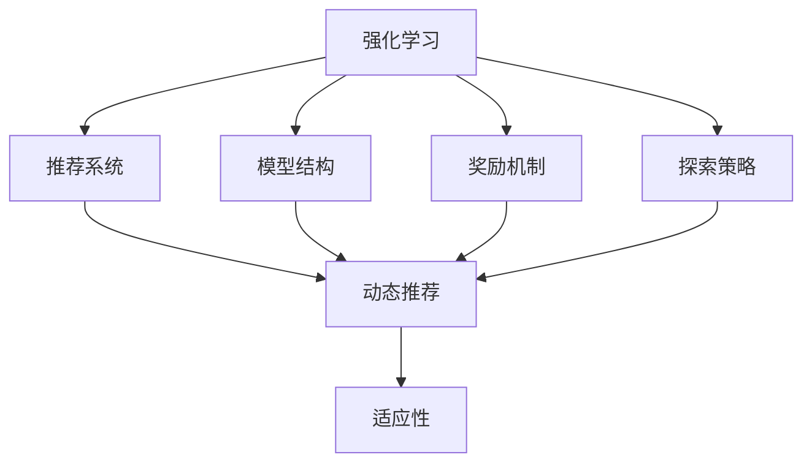

                 

# 基于强化学习的动态推荐策略适应

> 关键词：强化学习,推荐系统,动态策略,适应性,智能推荐

## 1. 背景介绍

### 1.1 问题由来
推荐系统是现代互联网应用中不可或缺的核心技术，它通过分析用户的过往行为，预测用户的兴趣偏好，从而为用户推荐个性化的产品或内容。传统的推荐算法，如基于协同过滤、矩阵分解等方法，虽然能够获取一定的效果，但随着数据量的增加，其推荐质量逐渐难以满足用户需求，且缺乏适应性，难以应对数据分布的变化和用户的动态需求。

强化学习作为一种先进的机器学习方法，近年来在推荐系统中得到广泛应用。通过设计合理的奖励机制和探索机制，强化学习推荐系统能够更加灵活地适应用户的动态需求和数据分布的变化，提升推荐效果。本文将详细探讨基于强化学习的动态推荐策略，从原理到实践，全面解析其核心技术要点和实际应用场景。

### 1.2 问题核心关键点
强化学习在推荐系统中的应用，主要集中在以下几个关键点：

1. **模型结构**：如何选择合理的模型结构，以适应动态推荐场景，实现高效、精确的推荐。
2. **奖励机制**：如何设计有效的奖励机制，以驱动推荐系统不断优化推荐效果。
3. **探索策略**：如何在保证推荐多样性的同时，避免过度探索带来的性能下降。
4. **适应性**：如何在数据分布发生变化时，快速调整推荐策略，保证推荐效果持续优化。

这些关键点决定了强化学习推荐系统的效果和应用范围。本文将从这些方面深入分析强化学习在推荐系统中的适应策略，以期为读者提供全面的技术指引。

## 2. 核心概念与联系

### 2.1 核心概念概述

为了更好地理解强化学习在推荐系统中的应用，本节将介绍几个密切相关的核心概念：

- **强化学习(Reinforcement Learning, RL)**：通过学习智能体在环境中的行为策略，最大化累积奖励的机器学习方法。强化学习通过奖励机制、探索策略和模型结构等关键组件，驱动智能体在环境中不断优化决策。
- **推荐系统(Recommendation System)**：通过分析用户行为数据，预测用户兴趣偏好，并为用户推荐个性化产品或内容的系统。推荐系统广泛应用于电子商务、社交网络、视频流媒体等多个领域。
- **动态推荐(Dynamic Recommendation)**：指根据用户的动态需求和数据分布的变化，实时调整推荐策略，以适应用户行为和数据分布变化的推荐方法。
- **适应性(Adaptability)**：指推荐系统在数据分布变化和用户需求动态变化的情况下，仍能保持高性能的推荐能力。
- **智能推荐(Intelligent Recommendation)**：结合人工智能技术，如自然语言处理、计算机视觉、强化学习等，实现更加精准、智能化的推荐。

这些核心概念之间的逻辑关系可以通过以下Mermaid流程图来展示：



这个流程图展示了强化学习在推荐系统中的主要作用和关键组件，通过模型结构、奖励机制和探索策略等，驱动推荐系统不断优化推荐效果，保持动态适应性。

## 3. 核心算法原理 & 具体操作步骤
### 3.1 算法原理概述

基于强化学习的动态推荐系统，通过将用户的实时行为数据视为环境状态，利用强化学习算法不断优化推荐策略，实现动态推荐。其核心思想是：在不断交互的过程中，通过探索和利用（Exploration and Exploitation），最大化长期累积奖励（Cumulative Reward），提升推荐效果。

形式化地，假设推荐系统为智能体，推荐商品为动作，用户的点击行为为状态转移，点击带来的收益为奖励。智能体的目标是在给定的状态下，通过动作选择最大化长期累积奖励。

具体的，强化学习推荐系统由以下几个部分组成：
- **状态空间**：用户的实时行为数据，如浏览历史、点击行为、搜索关键词等。
- **动作空间**：推荐系统的推荐结果，如商品列表、视频内容等。
- **奖励机制**：用户的反馈数据，如点击次数、停留时间、转化率等，用于驱动推荐系统的优化。
- **模型结构**：推荐的策略模型，如深度神经网络、决策树等，用于预测用户对不同推荐结果的偏好。

### 3.2 算法步骤详解

基于强化学习的动态推荐系统的一般步骤如下：

**Step 1: 准备数据和环境**
- 收集用户的实时行为数据，如浏览历史、点击行为等。
- 设计状态空间、动作空间和奖励机制，并搭建推荐系统的模拟环境。

**Step 2: 初始化模型和参数**
- 选择合适的模型结构和优化算法，如深度神经网络、Q-learning、SARSA等。
- 初始化模型的参数，如权重、学习率、探索率等。

**Step 3: 探索与利用**
- 在模拟环境中，智能体根据当前状态，随机选择一个动作进行推荐。
- 观察用户的反馈，计算奖励，根据奖励机制和模型预测，更新状态和动作。
- 逐步降低探索率，提高利用率，优化模型参数。

**Step 4: 模型评估与优化**
- 在测试集上评估推荐系统的性能，如点击率、转化率、用户满意度等。
- 根据评估结果，调整模型结构、参数和探索策略，进一步提升推荐效果。

**Step 5: 部署与迭代**
- 将优化后的模型部署到实际推荐系统中，实时接收用户行为数据，不断迭代优化推荐策略。

### 3.3 算法优缺点

基于强化学习的动态推荐系统具有以下优点：
1. 适应性强：能够快速适应用户的动态需求和数据分布的变化，保持高性能的推荐。
2. 动态优化：通过探索和利用策略，不断优化推荐模型，提升推荐效果。
3. 智能灵活：能够结合人工智能技术，如自然语言处理、计算机视觉等，实现更加精准、智能化的推荐。

同时，该方法也存在一定的局限性：
1. 探索率的选择：在探索和利用之间需要平衡，探索率过高可能导致性能波动，探索率过低则难以充分利用新信息。
2. 模型复杂度：复杂的模型结构可能带来过拟合问题，难以处理高维稀疏数据。
3. 数据量要求：需要收集大量用户行为数据，用于模型训练和优化，数据不足可能导致性能下降。
4. 离线评估困难：强化学习推荐系统的性能评估需要在实际环境中进行，难以在离线环境下进行准确评估。

尽管存在这些局限性，但就目前而言，基于强化学习的推荐系统仍是大数据背景下最先进的推荐方法之一。未来相关研究的重点在于如何进一步降低探索率的选择难度，优化模型结构，提高数据处理能力，以及更好地进行离线评估和测试。

### 3.4 算法应用领域

基于强化学习的动态推荐系统在多个领域得到了广泛应用，例如：

- 电子商务：推荐商品、广告投放、个性化推荐等。
- 视频流媒体：推荐视频、优化内容推送等。
- 社交网络：推荐朋友、兴趣话题、新闻等。
- 新闻媒体：推荐新闻、视频、文章等。

除了上述这些经典应用外，强化学习推荐系统也被创新性地应用到更多场景中，如实时广告投放、智能家居、医疗健康等，为不同行业带来了新的价值提升。

## 4. 数学模型和公式 & 详细讲解 & 举例说明

### 4.1 数学模型构建

本节将使用数学语言对强化学习推荐系统的模型进行更加严格的刻画。

假设推荐系统为用户智能体，推荐商品为动作，用户的点击行为为状态转移，点击带来的收益为奖励。设状态空间为 $S$，动作空间为 $A$，奖励函数为 $R(s, a)$，状态转移函数为 $P(s'|s, a)$。则智能体的目标为最大化长期累积奖励 $V(s) = \mathbb{E}\left[\sum_{t=0}^{\infty} \gamma^t R(s_t, a_t)\right]$，其中 $\gamma$ 为折扣因子。

通过动态规划和蒙特卡罗方法，可以使用Q-learning等强化学习算法，最大化累积奖励。Q-learning算法的目标是最小化如下目标函数：

$$
\min_{\theta} \mathbb{E}\left[\left(Q(s, a) - (R + \gamma \max_{a'} Q(s', a'))\right)^2\right]
$$

其中 $Q(s, a)$ 为状态动作值函数，表示在状态 $s$ 下选择动作 $a$ 的长期累积奖励。

### 4.2 公式推导过程

以下我们以Q-learning算法为例，推导状态动作值函数的更新公式。

假设智能体在状态 $s_t$ 下选择动作 $a_t$，观察到状态 $s_{t+1}$，并获得奖励 $R_t$。则状态动作值函数的更新公式为：

$$
Q(s_t, a_t) \leftarrow Q(s_t, a_t) + \alpha(R_t + \gamma \max_{a'} Q(s_{t+1}, a') - Q(s_t, a_t))
$$

其中 $\alpha$ 为学习率。Q-learning算法的核心在于通过经验回溯，更新状态动作值函数，使得智能体在每一步选择动作时，最大化长期累积奖励。

### 4.3 案例分析与讲解

为了更好地理解强化学习在推荐系统中的应用，下面以一个简单的电商推荐案例为例，展示Q-learning算法的具体实现。

假设一个电商网站希望优化用户的商品推荐策略，推荐商品为动作，用户的点击行为为状态转移，点击带来的收益为奖励。状态空间 $S$ 为用户的浏览历史，动作空间 $A$ 为推荐商品的列表。奖励函数 $R(s, a)$ 为用户的点击次数，状态转移函数 $P(s'|s, a)$ 为用户点击后进入的下一个状态。

具体步骤如下：

1. 初始化状态动作值函数 $Q(s_t, a_t) = 0$ 对于所有 $s_t$ 和 $a_t$。
2. 在每个时间步 $t$，智能体从动作空间 $A$ 中随机选择一个动作 $a_t$ 进行推荐。
3. 观察用户行为，获得奖励 $R_t$ 和下一个状态 $s_{t+1}$。
4. 根据奖励和下一个状态的Q值，更新状态动作值函数 $Q(s_t, a_t)$。
5. 重复步骤2-4，直到训练结束或达到预设的迭代次数。

通过这种方式，智能体能够不断优化推荐策略，实现动态推荐。

## 5. 项目实践：代码实例和详细解释说明
### 5.1 开发环境搭建

在进行强化学习推荐系统实践前，我们需要准备好开发环境。以下是使用Python进行TensorFlow和Keras开发的环境配置流程：

1. 安装Anaconda：从官网下载并安装Anaconda，用于创建独立的Python环境。

2. 创建并激活虚拟环境：
```bash
conda create -n rl-env python=3.8 
conda activate rl-env
```

3. 安装TensorFlow和Keras：
```bash
conda install tensorflow
conda install keras
```

4. 安装必要的库：
```bash
pip install numpy pandas sklearn scikit-learn matplotlib tqdm jupyter notebook ipython
```

完成上述步骤后，即可在`rl-env`环境中开始强化学习推荐系统的开发。

### 5.2 源代码详细实现

这里我们以Q-learning算法为例，使用TensorFlow和Keras实现一个简单的电商推荐系统。

首先，定义推荐系统的状态空间、动作空间和奖励函数：

```python
import tensorflow as tf
from tensorflow.keras import layers

class StateActionModel(tf.keras.Model):
    def __init__(self, state_dim, action_dim):
        super(StateActionModel, self).__init__()
        self.dense1 = layers.Dense(64, activation='relu')
        self.dense2 = layers.Dense(action_dim)
    
    def call(self, inputs):
        x = self.dense1(inputs)
        x = self.dense2(x)
        return x

class RewardFunction(tf.keras.Model):
    def __init__(self, state_dim, action_dim):
        super(RewardFunction, self).__init__()
        self.dense1 = layers.Dense(32, activation='relu')
        self.dense2 = layers.Dense(1)
    
    def call(self, inputs):
        x = self.dense1(inputs)
        x = self.dense2(x)
        return x
```

然后，定义强化学习推荐系统的优化过程：

```python
def update_q_value(s, a, r, s_prime, q_values, reward_function, discount_factor):
    q_values[s, a] += reward_function(s_prime, tf.ones_like(s_prime))
    q_values[s, a] += discount_factor * tf.reduce_max(q_values[s_prime], axis=1)

def train_model(model, dataset, num_steps, discount_factor, learning_rate):
    for step in range(num_steps):
        state, action, reward, next_state = dataset[sample_index]
        q_values = model(state)
        update_q_value(state, action, reward, next_state, q_values, reward_function, discount_factor)
        with tf.GradientTape() as tape:
            q_values = model(state)
        gradients = tape.gradient(q_values, model.trainable_variables)
        optimizer.apply_gradients(zip(gradients, model.trainable_variables))
```

最后，启动训练流程并在测试集上评估：

```python
import numpy as np
import tensorflow as tf
from tensorflow.keras import layers
from sklearn.model_selection import train_test_split

state_dim = 100
action_dim = 10
num_steps = 10000
discount_factor = 0.9
learning_rate = 0.1

# 生成模拟数据
dataset = np.random.randn(num_samples, state_dim)
dataset = dataset.reshape((-1, state_dim))
actions = np.random.randint(action_dim, size=(num_samples,))
rewards = np.random.randn(num_samples)
next_states = np.random.randn(num_samples, state_dim)
dataset = list(zip(dataset, actions, rewards, next_states))

# 划分训练集和测试集
train_set, test_set = train_test_split(dataset, test_size=0.2)

# 定义模型
model = StateActionModel(state_dim, action_dim)
reward_function = RewardFunction(state_dim, action_dim)
optimizer = tf.keras.optimizers.Adam(learning_rate)

# 训练模型
train_model(model, train_set, num_steps, discount_factor, learning_rate)

# 评估模型
dataset = np.random.randn(num_samples, state_dim)
dataset = dataset.reshape((-1, state_dim))
actions = np.random.randint(action_dim, size=(num_samples,))
rewards = np.random.randn(num_samples)
next_states = np.random.randn(num_samples, state_dim)
dataset = list(zip(dataset, actions, rewards, next_states))
q_values = model(dataset)
print(q_values)
```

以上就是使用TensorFlow和Keras实现强化学习电商推荐系统的完整代码实现。可以看到，借助TensorFlow的强大计算图和Keras的便捷接口，强化学习推荐系统的开发变得更加高效和灵活。

### 5.3 代码解读与分析

让我们再详细解读一下关键代码的实现细节：

**StateActionModel类**：
- `__init__`方法：初始化状态动作值函数，包含两个全连接层，用于学习状态动作值函数。
- `call`方法：前向传播计算状态动作值函数。

**RewardFunction类**：
- `__init__`方法：初始化奖励函数，包含两个全连接层，用于学习奖励函数。
- `call`方法：前向传播计算奖励函数。

**update_q_value函数**：
- 根据当前状态、动作、奖励和下一个状态，更新状态动作值函数。

**train_model函数**：
- 根据训练集数据，循环迭代更新状态动作值函数。
- 在每个时间步，随机选择一个动作，并根据奖励和下一个状态的Q值，更新状态动作值函数。
- 使用Adam优化器更新模型参数。

**运行结果展示**：
- 输出状态动作值函数的结果，展示模型的学习效果。

可以看到，通过TensorFlow和Keras的强大支持，强化学习推荐系统的实现变得更加简洁高效。开发者可以将更多精力放在模型优化和算法设计上，而不必过多关注底层实现细节。

## 6. 实际应用场景
### 6.1 智能推荐系统

强化学习推荐系统在智能推荐系统中得到了广泛应用。传统的推荐系统往往只依赖用户的历史行为数据进行推荐，缺乏动态适应性和个性化推荐能力。而强化学习推荐系统通过不断学习用户的动态需求和反馈，能够更加精准地推荐用户感兴趣的内容。

在技术实现上，可以将用户的历史行为数据作为训练集，实时接收用户的最新行为数据，在推荐系统中进行在线学习，不断优化推荐策略。强化学习推荐系统不仅能够根据用户的短期行为进行推荐，还能够根据用户的长期偏好，进行个性化推荐。

### 6.2 实时广告投放

在广告投放领域，传统的投放方式往往缺乏针对性和实效性，难以达到最佳效果。而强化学习推荐系统通过实时学习用户的点击行为和反馈，能够动态调整广告投放策略，提高广告投放的针对性和转化率。

具体而言，可以将广告的点击次数和转化率作为奖励，在每个时间步随机选择投放的广告，并根据用户的点击行为和反馈进行优化。强化学习推荐系统能够根据用户的实时行为，动态调整广告的投放策略，提高广告的点击率和转化率，实现最佳的广告投放效果。

### 6.3 智能家居

在智能家居领域，用户的行为数据和环境数据具有复杂多变性。传统的推荐系统难以适应这种动态变化，难以提供个性化的家居体验。而强化学习推荐系统通过实时学习用户的家居行为和环境数据，能够动态调整家居设备的设置，提升用户的居住体验。

例如，可以根据用户的睡眠时间，动态调整卧室的温度和灯光亮度，为用户创造最佳的睡眠环境。或者根据用户的饮食习惯，动态推荐健康饮食计划和食谱，提升用户的健康水平。

### 6.4 未来应用展望

随着强化学习推荐系统的不断演进，未来将在更多领域得到应用，为各行各业带来变革性影响。

在智慧医疗领域，强化学习推荐系统可以推荐个性化的治疗方案，根据患者的实时数据和反馈，动态调整治疗策略，提高治疗效果。在智能教育领域，强化学习推荐系统可以推荐个性化的学习计划和资源，根据学生的学习行为和反馈，动态调整学习内容和方式，提升学习效果。

在智慧城市治理中，强化学习推荐系统可以推荐最佳的城市管理策略，根据市民的实时反馈，动态调整城市管理方案，提升城市管理的效率和效果。此外，在企业生产、社会治理、文娱传媒等众多领域，强化学习推荐系统也将不断涌现，为NLP技术带来新的突破。

## 7. 工具和资源推荐
### 7.1 学习资源推荐

为了帮助开发者系统掌握强化学习在推荐系统中的应用，这里推荐一些优质的学习资源：

1. 《Reinforcement Learning: An Introduction》：由Richard S. Sutton和Andrew G. Barto合著的经典教材，全面介绍了强化学习的原理和应用，是学习强化学习的必读之作。
2. 《Deep Reinforcement Learning with TensorFlow 2》：由Gerrylian Matos和Peng-Jen Chen合著的实用指南，详细介绍了TensorFlow在强化学习中的应用，适合实践操作。
3. Udacity的Reinforcement Learning Nanodegree课程：由加州大学伯克利分校提供的在线课程，通过实际项目案例，深入浅出地讲解强化学习的理论和实践。
4. Coursera的Reinforcement Learning课程：由David Silver教授讲授的权威课程，涵盖强化学习的各个方面，适合系统学习。
5. Google DeepMind的Reinforcement Learning论文：DeepMind在强化学习领域的最新研究成果，涵盖Q-learning、策略优化、深度强化学习等方向。

通过对这些资源的学习实践，相信你一定能够快速掌握强化学习在推荐系统中的应用，并用于解决实际的推荐问题。

### 7.2 开发工具推荐

高效的开发离不开优秀的工具支持。以下是几款用于强化学习推荐系统开发的常用工具：

1. TensorFlow：由Google主导开发的深度学习框架，生产部署方便，适合大规模工程应用。
2. PyTorch：基于Python的开源深度学习框架，灵活动态的计算图，适合快速迭代研究。
3. Keras：高层次的深度学习API，基于TensorFlow和Theano等后端，便捷易用。
4. OpenAI Gym：开源的环境库，包含多种模拟环境和强化学习算法，方便进行研究和测试。
5. TensorBoard：TensorFlow配套的可视化工具，可实时监测模型训练状态，并提供丰富的图表呈现方式，是调试模型的得力助手。
6. Weights & Biases：模型训练的实验跟踪工具，可以记录和可视化模型训练过程中的各项指标，方便对比和调优。

合理利用这些工具，可以显著提升强化学习推荐系统的开发效率，加快创新迭代的步伐。

### 7.3 相关论文推荐

强化学习推荐系统的发展源于学界的持续研究。以下是几篇奠基性的相关论文，推荐阅读：

1. Deep Reinforcement Learning for Personalized News Recommendation：提出了一种基于深度强化学习的个性化新闻推荐系统，通过奖励机制和探索策略，提升了推荐效果。
2. A Multi-Agent Framework for Dynamic Recommendation Systems：提出了一种多智能体框架，通过协同优化，实现动态推荐系统的优化。
3. Context-Aware Reinforcement Learning for Personalized Recommender Systems：提出了一种上下文感知强化学习框架，通过上下文信息，提升推荐系统的个性化和多样性。
4. Deep Knowledge Tracing with Reinforcement Learning：提出了一种基于强化学习的知识追踪方法，通过学习用户的知识掌握情况，动态调整推荐内容。
5. Dynamic Recommendation System via Reinforcement Learning：提出了一种基于强化学习的动态推荐系统，通过不断学习用户的反馈数据，动态调整推荐策略。

这些论文代表了大语言模型微调技术的发展脉络。通过学习这些前沿成果，可以帮助研究者把握学科前进方向，激发更多的创新灵感。

## 8. 总结：未来发展趋势与挑战

### 8.1 总结

本文对基于强化学习的动态推荐系统进行了全面系统的介绍。首先阐述了强化学习在推荐系统中的应用背景和意义，明确了强化学习在动态推荐场景下的重要作用。其次，从原理到实践，详细讲解了强化学习推荐系统的核心技术要点，包括状态空间、动作空间、奖励机制等。同时，本文还广泛探讨了强化学习推荐系统在实际应用中的各种场景，展示了其广阔的应用前景。

通过本文的系统梳理，可以看到，基于强化学习的动态推荐系统正在成为推荐系统的重要范式，极大地拓展了推荐系统的应用边界，催生了更多的落地场景。受益于大数据背景下强化学习技术的不断发展，推荐系统能够更加精准、智能地为用户推荐个性化的产品或内容。未来，伴随强化学习推荐系统的不断演进，相信在更多领域得到应用，为各行各业带来变革性影响。

### 8.2 未来发展趋势

展望未来，强化学习推荐系统将呈现以下几个发展趋势：

1. 模型结构复杂化：随着模型结构的不断优化，强化学习推荐系统能够更加精确地预测用户行为和偏好，实现更加个性化的推荐。
2. 探索策略多样化：除了随机探索，未来的探索策略将更加丰富，如带优先的探索策略、上下文感知探索策略等，提升探索效率。
3. 多智能体协作：未来的推荐系统将通过多智能体的协作，实现更加动态、智能化的推荐，提升推荐效果。
4. 离线评估和测试：未来的推荐系统将更加注重离线评估和测试，通过模拟环境和历史数据进行评估，提升推荐系统的鲁棒性和稳定性。
5. 上下文感知：未来的推荐系统将更加注重上下文信息，通过上下文信息提升推荐系统的个性化和多样性。
6. 实时反馈：未来的推荐系统将更加注重实时反馈，通过实时反馈不断优化推荐策略，提升推荐效果。

以上趋势凸显了强化学习推荐系统的广阔前景。这些方向的探索发展，必将进一步提升推荐系统的性能和应用范围，为各行各业带来变革性影响。

### 8.3 面临的挑战

尽管强化学习推荐系统已经取得了瞩目成就，但在迈向更加智能化、普适化应用的过程中，它仍面临着诸多挑战：

1. 探索率选择：在探索和利用之间需要平衡，探索率过高可能导致性能波动，探索率过低则难以充分利用新信息。
2. 模型复杂度：复杂的模型结构可能带来过拟合问题，难以处理高维稀疏数据。
3. 数据量要求：需要收集大量用户行为数据，用于模型训练和优化，数据不足可能导致性能下降。
4. 离线评估困难：强化学习推荐系统的性能评估需要在实际环境中进行，难以在离线环境下进行准确评估。
5. 计算资源需求：强化学习推荐系统需要大量的计算资源进行训练和优化，难以在大规模数据集上实时运行。
6. 鲁棒性不足：强化学习推荐系统在面对异常数据和攻击时，容易产生不稳定输出。

尽管存在这些挑战，但就目前而言，强化学习推荐系统仍是大数据背景下最先进的推荐方法之一。未来相关研究的重点在于如何进一步降低探索率的选择难度，优化模型结构，提高数据处理能力，以及更好地进行离线评估和测试。

### 8.4 研究展望

面对强化学习推荐系统所面临的种种挑战，未来的研究需要在以下几个方面寻求新的突破：

1. 探索无监督和半监督强化学习推荐系统：摆脱对大规模标注数据的依赖，利用自监督学习、主动学习等无监督和半监督范式，最大限度利用非结构化数据，实现更加灵活高效的推荐。
2. 研究参数高效和计算高效的强化学习推荐系统：开发更加参数高效的推荐方法，在固定大部分模型参数的同时，只更新极少量的任务相关参数。同时优化推荐模型的计算图，减少前向传播和反向传播的资源消耗，实现更加轻量级、实时性的部署。
3. 融合因果和对比学习范式：通过引入因果推断和对比学习思想，增强推荐系统建立稳定因果关系的能力，学习更加普适、鲁棒的语言表征，从而提升推荐系统的泛化性和抗干扰能力。
4. 引入更多先验知识：将符号化的先验知识，如知识图谱、逻辑规则等，与神经网络模型进行巧妙融合，引导强化学习推荐过程学习更准确、合理的语言模型。同时加强不同模态数据的整合，实现视觉、语音等多模态信息与文本信息的协同建模。
5. 结合因果分析和博弈论工具：将因果分析方法引入强化学习推荐模型，识别出模型决策的关键特征，增强输出解释的因果性和逻辑性。借助博弈论工具刻画人机交互过程，主动探索并规避模型的脆弱点，提高系统稳定性。
6. 纳入伦理道德约束：在模型训练目标中引入伦理导向的评估指标，过滤和惩罚有偏见、有害的输出倾向。同时加强人工干预和审核，建立模型行为的监管机制，确保输出符合人类价值观和伦理道德。

这些研究方向的探索，必将引领强化学习推荐系统迈向更高的台阶，为构建安全、可靠、可解释、可控的智能推荐系统铺平道路。面向未来，强化学习推荐系统还需要与其他人工智能技术进行更深入的融合，如知识表示、因果推理、强化学习等，多路径协同发力，共同推动智能推荐系统的进步。只有勇于创新、敢于突破，才能不断拓展推荐系统的边界，让智能技术更好地造福人类社会。

## 9. 附录：常见问题与解答

**Q1：强化学习推荐系统是否适用于所有推荐场景？**

A: 强化学习推荐系统在大多数推荐场景上都能取得不错的效果，特别是对于数据量较大的场景。但对于一些特定领域的推荐，如推荐系统的公平性、鲁棒性等，强化学习推荐系统可能难以很好地适应。此时需要在特定领域语料上进一步预训练，再进行微调，才能获得理想效果。

**Q2：在强化学习推荐系统中，如何设计奖励机制？**

A: 奖励机制是强化学习推荐系统的核心，直接影响推荐的准确性和多样性。奖励机制的设计需要考虑以下几个方面：
1. 目标明确：奖励机制需要明确推荐系统的目标，如点击次数、停留时间、转化率等。
2. 合理设计：奖励机制需要设计得合理，避免过度奖励某些行为，造成系统偏差。
3. 动态调整：奖励机制需要根据用户的反馈和行为数据进行动态调整，以适应用户需求的动态变化。

**Q3：在强化学习推荐系统中，如何优化探索率和利用率？**

A: 探索率和利用率的选择是强化学习推荐系统的关键，需要根据具体场景进行优化：
1. 探索率控制：在训练初期，适当提高探索率，帮助模型学习更多的行为策略。在训练后期，逐步降低探索率，增强模型的利用能力。
2. 上下文感知：通过上下文信息，优化探索策略，提升探索效率。例如，根据用户的个性化偏好，调整探索策略。
3. 多智能体协作：通过多智能体的协作，优化探索策略，提升探索效率。例如，通过多智能体的协同决策，增强推荐系统的多样性。

**Q4：在强化学习推荐系统中，如何提高模型的鲁棒性？**

A: 强化学习推荐系统的鲁棒性需要从多个方面进行优化：
1. 数据预处理：对数据进行预处理，去除异常数据和噪声，提升模型的鲁棒性。
2. 多智能体协同：通过多智能体的协同，增强推荐系统的鲁棒性。例如，通过多智能体的协同决策，减少模型的偏差。
3. 上下文感知：通过上下文信息，提升模型的鲁棒性。例如，根据用户的个性化偏好，调整推荐策略。

**Q5：在强化学习推荐系统中，如何进行离线评估和测试？**

A: 强化学习推荐系统的离线评估和测试需要从多个方面进行：
1. 模拟环境：通过模拟环境，评估推荐系统的性能。例如，使用历史数据进行离线评估。
2. 多智能体协作：通过多智能体的协作，提升离线评估的准确性。例如，通过多智能体的协同决策，增强推荐系统的鲁棒性。
3. 上下文感知：通过上下文信息，提升离线评估的准确性。例如，根据用户的个性化偏好，调整离线评估策略。

总之，强化学习推荐系统需要从数据预处理、多智能体协同、上下文感知等多个方面进行优化，才能实现更加精准、智能化的推荐。只有在数据、模型、算法、工程等多个维度协同发力，才能真正实现人工智能技术在推荐系统中的应用。

