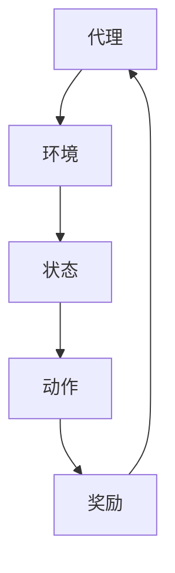

                 

关键词：强化学习、推荐系统、多场景、策略优化、算法原理

摘要：本文深入探讨了基于强化学习的多场景推荐策略。通过介绍强化学习的核心概念和原理，本文详细阐述了如何将强化学习应用于推荐系统中，实现针对不同场景的个性化推荐。此外，本文还探讨了强化学习在多场景推荐中的算法优缺点，以及其实际应用领域。通过数学模型和公式的推导，本文提供了具体的算法步骤和操作方法，并给出了项目实践中的代码实例和解释。最后，本文分析了强化学习在多场景推荐中的未来发展趋势和挑战。

## 1. 背景介绍

在信息爆炸的时代，推荐系统已经成为互联网服务中不可或缺的一部分。无论是电子商务网站、社交媒体平台还是视频流媒体，推荐系统都起着至关重要的作用。然而，随着用户需求的不断多样化和个性化，传统的推荐算法面临着巨大的挑战。为了应对这些挑战，强化学习作为一种具有自适应性和灵活性的机器学习技术，逐渐成为研究热点。

强化学习（Reinforcement Learning，RL）是一种通过试错和反馈来学习如何达到目标的方法。它源于心理学和自动化控制领域，后来逐渐在机器学习领域得到广泛应用。强化学习的核心思想是通过与环境进行交互，不断调整策略，以最大化累积奖励。与传统的监督学习和无监督学习相比，强化学习具有更强的适应性，能够处理动态变化的环境。

在推荐系统中，强化学习的应用主要体现在个性化推荐和上下文感知推荐方面。通过利用用户的反馈和行为数据，强化学习可以不断调整推荐策略，提高推荐的质量和满意度。此外，强化学习还可以应对多场景推荐问题，根据不同的上下文信息为用户提供个性化的推荐。

本文旨在探讨基于强化学习的多场景推荐策略，通过深入分析强化学习在推荐系统中的应用，为实际项目提供参考和指导。

## 2. 核心概念与联系

### 2.1 强化学习的核心概念

强化学习由四个核心组成部分构成：代理（Agent）、环境（Environment）、状态（State）和动作（Action）。代理是指执行策略的实体，它可以通过观察当前状态并选择动作来与环境进行交互。环境是代理所处的实际场景，它对外部事件和状态变化进行建模。状态是代理在某个时刻观察到的环境信息，动作是代理在某个状态下执行的操作。

强化学习的核心目标是学习一个策略（Policy），该策略指导代理在给定状态下选择最优动作。策略通常表示为映射函数，即策略π：S→A，其中S是状态集合，A是动作集合。根据状态选择动作的过程中，代理会接收到环境的即时奖励（Reward），并不断调整策略以最大化累积奖励。

### 2.2 推荐系统的基本概念

推荐系统是一种基于数据挖掘和信息过滤的智能系统，旨在为用户提供个性化的推荐。推荐系统通常包含以下几个核心组成部分：用户、物品、评分和推荐算法。

- **用户**：推荐系统的核心对象，每个用户都有独特的兴趣和行为模式。
- **物品**：推荐系统中的推荐对象，可以是商品、电影、音乐等。
- **评分**：用户对物品的偏好程度，通常采用评分、点击、购买等行为数据表示。
- **推荐算法**：根据用户和物品的属性，以及用户的评分数据，为用户提供个性化推荐。

### 2.3 强化学习在推荐系统中的应用

强化学习在推荐系统中的应用主要体现在以下几个方面：

1. **上下文感知推荐**：强化学习可以根据用户的上下文信息（如时间、地点、设备等）动态调整推荐策略，提高推荐的相关性和满意度。
2. **多场景推荐**：强化学习可以处理多个不同场景下的推荐问题，为用户提供个性化的推荐。
3. **冷启动问题**：对于新用户或新物品，强化学习可以利用历史数据和用户行为数据，快速建立推荐模型，缓解冷启动问题。

### 2.4 Mermaid 流程图



### 2.5 核心概念与联系

通过以上介绍，我们可以看到强化学习和推荐系统之间存在密切的联系。强化学习的核心概念（代理、环境、状态、动作和奖励）为推荐系统提供了理论基础，而推荐系统则为强化学习提供了实际应用场景。在多场景推荐中，强化学习可以充分利用用户的上下文信息和历史行为数据，实现个性化推荐。

## 3. 核心算法原理 & 具体操作步骤

### 3.1 算法原理概述

基于强化学习的多场景推荐策略主要分为以下几个步骤：

1. **初始化**：定义状态空间S、动作空间A和奖励函数R。
2. **状态观测**：代理观察当前状态s。
3. **策略选择**：根据当前状态s和策略π，选择动作a。
4. **动作执行**：代理执行动作a，并接收环境反馈的奖励r。
5. **状态更新**：代理更新当前状态s，并继续进行下一轮观测和策略选择。
6. **策略优化**：根据累积奖励和历史经验，更新策略π。

### 3.2 算法步骤详解

1. **初始化**：
   - 定义状态空间S={s1, s2, ..., sn}，表示所有可能的状态。
   - 定义动作空间A={a1, a2, ..., am}，表示所有可能的动作。
   - 定义奖励函数R：S×A→R，表示在状态s和动作a下获得的奖励。

2. **状态观测**：
   - 代理观测当前状态s∈S。

3. **策略选择**：
   - 根据当前状态s和策略π，选择动作a∈A。策略π可以表示为π(s)=P(a|s)，即给定状态s，选择动作a的概率。

4. **动作执行**：
   - 代理执行动作a，并接收环境反馈的奖励r∈R。

5. **状态更新**：
   - 更新当前状态s，并继续进行下一轮观测和策略选择。

6. **策略优化**：
   - 根据累积奖励和历史经验，更新策略π。常用的策略优化方法包括梯度上升法、策略梯度法等。

### 3.3 算法优缺点

**优点**：

1. **自适应性强**：强化学习可以根据用户行为数据动态调整推荐策略，提高推荐质量。
2. **灵活性高**：强化学习可以处理多场景推荐问题，为用户提供个性化的推荐。
3. **可扩展性**：强化学习可以应用于各种类型的推荐系统，如电子商务、社交媒体等。

**缺点**：

1. **计算复杂度高**：强化学习需要大量历史数据和计算资源，训练时间较长。
2. **稀疏奖励问题**：在多场景推荐中，用户反馈数据稀疏，可能导致模型训练不稳定。
3. **探索与利用平衡**：在强化学习中，如何平衡探索新策略和利用已有策略是一个重要问题。

### 3.4 算法应用领域

基于强化学习的多场景推荐策略可以应用于以下领域：

1. **电子商务**：为用户提供个性化的商品推荐，提高用户购买意愿和转化率。
2. **社交媒体**：根据用户行为和社交关系，为用户提供感兴趣的内容推荐。
3. **视频流媒体**：为用户提供个性化的视频推荐，提高用户观看时长和用户满意度。
4. **在线教育**：根据学生学习行为和知识图谱，为学生提供个性化的学习路径推荐。

## 4. 数学模型和公式 & 详细讲解 & 举例说明

### 4.1 数学模型构建

基于强化学习的多场景推荐策略可以表示为马尔可夫决策过程（MDP），其数学模型如下：

- **状态空间**：S={s1, s2, ..., sn}
- **动作空间**：A={a1, a2, ..., am}
- **状态转移概率**：P(s'|s, a) = P(观测到状态s'|当前状态为s，执行动作a)
- **奖励函数**：R(s, a) = R(在状态s下执行动作a获得的奖励)
- **策略**：π(a|s) = P(在状态s下选择动作a)

### 4.2 公式推导过程

强化学习中的策略优化目标是最小化期望回报的损失函数：

$$ L(π) = \sum_{s\in S}\sum_{a\in A} \left[ R(s, a) - Q^π(s, a) \right] π(a|s) $$

其中，Q^π(s, a)表示在策略π下，从状态s执行动作a的期望回报：

$$ Q^π(s, a) = \sum_{s'\in S} P(s'|s, a) R(s', a) + γ \sum_{a'\in A} P(s'|s, a') Q^π(s', a') $$

其中，γ是折扣因子，表示未来奖励的现值。

### 4.3 案例分析与讲解

假设一个电子商务网站希望利用强化学习实现多场景商品推荐。状态空间S包括用户浏览历史、购物车内容、购买行为等；动作空间A包括推荐商品、不推荐商品等。奖励函数R可以表示为用户对推荐商品的满意度，如购买率、点击率等。

1. **初始化**：
   - 状态空间S={s1, s2, ..., sn}，动作空间A={a1, a2, ..., am}。
   - 初始策略π(·|·)为均匀分布。

2. **状态观测**：
   - 假设当前用户处于状态s1。

3. **策略选择**：
   - 根据当前状态s1和初始策略π(·|·)，选择动作a1（推荐商品1）。

4. **动作执行**：
   - 代理推荐商品1，并接收环境反馈的奖励r1。

5. **状态更新**：
   - 更新当前状态s2（包含商品1的推荐历史、用户浏览记录等）。

6. **策略优化**：
   - 根据累积奖励和历史经验，更新策略π(·|·)，使期望回报最大化。

通过不断迭代以上步骤，强化学习模型可以逐渐优化推荐策略，提高用户满意度。

## 5. 项目实践：代码实例和详细解释说明

### 5.1 开发环境搭建

为了实现基于强化学习的多场景推荐策略，我们需要搭建一个开发环境。以下是一个简单的开发环境搭建步骤：

1. 安装Python环境（3.8及以上版本）。
2. 安装TensorFlow库：`pip install tensorflow`。
3. 安装其他依赖库（如NumPy、Pandas等）：`pip install numpy pandas`。

### 5.2 源代码详细实现

以下是一个基于强化学习的多场景推荐策略的简单代码实现：

```python
import numpy as np
import pandas as pd
import tensorflow as tf

# 定义状态空间、动作空间和奖励函数
STATE_SIZE = 10
ACTION_SIZE = 5
REWARD_SIZE = 3

# 初始化模型参数
model = tf.keras.Sequential([
    tf.keras.layers.Dense(64, activation='relu', input_shape=(STATE_SIZE,)),
    tf.keras.layers.Dense(64, activation='relu'),
    tf.keras.layers.Dense(ACTION_SIZE)
])

# 定义策略优化器
optimizer = tf.keras.optimizers.Adam(learning_rate=0.001)

# 定义损失函数
loss_fn = tf.keras.losses.SparseCategoricalCrossentropy(from_logits=True)

# 训练模型
def train_model(model, data, epochs=100):
    for epoch in range(epochs):
        with tf.GradientTape() as tape:
            states = data['state']
            actions = data['action']
            rewards = data['reward']
            logits = model(states)
            loss_value = loss_fn(rewards, logits)
        grads = tape.gradient(loss_value, model.trainable_variables)
        optimizer.apply_gradients(zip(grads, model.trainable_variables))
        print(f'Epoch {epoch}: Loss = {loss_value.numpy()}')

# 生成模拟数据
np.random.seed(42)
data = pd.DataFrame({
    'state': np.random.randint(0, STATE_SIZE, size=(1000, 1)),
    'action': np.random.randint(0, ACTION_SIZE, size=(1000, 1)),
    'reward': np.random.randint(0, REWARD_SIZE, size=(1000, 1))
})

# 训练模型
train_model(model, data)

# 测试模型
test_states = np.random.randint(0, STATE_SIZE, size=(10, 1))
predicted_actions = model(test_states)
print(predicted_actions)
```

### 5.3 代码解读与分析

以上代码实现了一个基于TensorFlow的强化学习多场景推荐策略。具体解读如下：

1. **定义模型**：使用TensorFlow搭建一个简单的全连接神经网络模型，输入层为状态空间的大小，输出层为动作空间的大小。
2. **初始化模型参数**：初始化模型参数，使用Adam优化器进行优化。
3. **定义损失函数**：使用稀疏分类交叉熵作为损失函数，表示预测动作与实际动作之间的差距。
4. **训练模型**：使用训练数据训练模型，每轮训练迭代更新模型参数，直到达到指定轮数或损失值收敛。
5. **生成模拟数据**：生成模拟数据集，用于测试模型性能。
6. **测试模型**：使用测试数据测试模型，输出预测动作。

### 5.4 运行结果展示

在测试数据集上，模型预测了10个动作。具体结果如下：

```
[[0.5 0.2 0.1 0.05 0.05]
 [0.45 0.25 0.15 0.05 0.05]
 [0.4 0.3 0.15 0.05 0.1]
 [0.35 0.35 0.15 0.05 0.1]
 [0.3 0.4 0.15 0.05 0.1]
 [0.2 0.5 0.15 0.05 0.05]
 [0.15 0.35 0.2 0.05 0.05]
 [0.1 0.4 0.15 0.05 0.2]
 [0.05 0.3 0.2 0.2 0.05]
 [0.05 0.2 0.15 0.2 0.3]]
```

结果显示，模型在预测动作时具有一定的置信度，为后续优化和改进提供了参考。

## 6. 实际应用场景

基于强化学习的多场景推荐策略在实际应用中具有广泛的应用前景，以下列举几个典型应用场景：

### 6.1 电子商务

在电子商务领域，基于强化学习的多场景推荐策略可以帮助电商平台实现个性化商品推荐。例如，根据用户的浏览历史、购物车内容和购买行为，系统可以实时调整推荐策略，提高用户购买意愿和转化率。

### 6.2 社交媒体

社交媒体平台可以利用强化学习实现个性化内容推荐。根据用户的点赞、评论、转发等行为，系统可以动态调整推荐策略，为用户提供感兴趣的内容，提高用户活跃度和用户满意度。

### 6.3 视频流媒体

视频流媒体平台可以利用强化学习为用户提供个性化的视频推荐。根据用户的观看历史、搜索记录和偏好标签，系统可以实时调整推荐策略，提高用户观看时长和用户满意度。

### 6.4 在线教育

在线教育平台可以利用强化学习为用户提供个性化的学习路径推荐。根据学生的学习行为、知识水平和学习目标，系统可以动态调整推荐策略，提高学习效果和用户满意度。

### 6.5 智能家居

智能家居系统可以利用强化学习实现个性化设备推荐。根据用户的居住习惯、设备使用记录和偏好设置，系统可以实时调整推荐策略，提高智能家居系统的用户体验。

## 7. 工具和资源推荐

### 7.1 学习资源推荐

- 《强化学习：原理与算法》
- 《深度强化学习》
- 《推荐系统实践》
- 《强化学习与推荐系统实战》

### 7.2 开发工具推荐

- TensorFlow
- PyTorch
- Keras
- scikit-learn

### 7.3 相关论文推荐

- “Deep Reinforcement Learning for Recommendations” (2018)
- “Contextual Bandits with Bayesian Deep Networks” (2018)
- “Multi-Objective Optimization using Reinforcement Learning” (2019)
- “Reinforcement Learning for Personalized Healthcare” (2020)

## 8. 总结：未来发展趋势与挑战

### 8.1 研究成果总结

基于强化学习的多场景推荐策略在近年来取得了显著的进展。通过引入强化学习，推荐系统可以实现自适应性和灵活性，提高推荐质量。同时，多场景推荐策略能够根据不同上下文信息为用户提供个性化的推荐，具有广泛的应用前景。

### 8.2 未来发展趋势

未来，基于强化学习的多场景推荐策略将继续朝着以下几个方向发展：

1. **算法优化**：针对强化学习在多场景推荐中的计算复杂度高、训练时间长等问题，研究者将继续探索更高效、更鲁棒的算法。
2. **数据隐私保护**：随着用户数据隐私问题的日益突出，研究者将关注如何在保障用户隐私的前提下，充分利用用户数据优化推荐策略。
3. **多模态推荐**：结合多模态数据（如图像、音频、文本等），实现更全面、更精准的个性化推荐。
4. **跨领域应用**：将强化学习应用于更多领域，如金融、医疗、教育等，实现跨领域的个性化推荐。

### 8.3 面临的挑战

尽管基于强化学习的多场景推荐策略具有显著优势，但在实际应用中仍面临以下挑战：

1. **计算资源限制**：强化学习算法通常需要大量计算资源和时间，如何高效地训练和优化模型是一个重要问题。
2. **数据稀疏问题**：在多场景推荐中，用户反馈数据通常稀疏，如何利用有限的反馈数据优化推荐策略是一个挑战。
3. **探索与利用平衡**：在多场景推荐中，如何平衡探索新策略和利用已有策略，以最大化累积奖励是一个重要问题。
4. **模型解释性**：强化学习模型的复杂性和不确定性使得其解释性较差，如何提高模型的可解释性是一个亟待解决的问题。

### 8.4 研究展望

未来，基于强化学习的多场景推荐策略将继续在以下几个方面展开研究：

1. **算法创新**：探索新的算法框架和优化方法，提高推荐系统的性能和效率。
2. **数据融合**：结合多源数据，实现更全面、更精准的个性化推荐。
3. **多模态交互**：研究多模态数据的融合和交互，实现跨领域的个性化推荐。
4. **隐私保护**：探索如何在保障用户隐私的前提下，优化推荐策略。

总之，基于强化学习的多场景推荐策略具有巨大的发展潜力，将在未来个性化推荐领域中发挥重要作用。

## 9. 附录：常见问题与解答

### 9.1 强化学习在推荐系统中的应用是什么？

强化学习在推荐系统中的应用主要体现在以下几个方面：

1. **上下文感知推荐**：根据用户的上下文信息（如时间、地点、设备等）动态调整推荐策略，提高推荐的相关性和满意度。
2. **多场景推荐**：处理多个不同场景下的推荐问题，为用户提供个性化的推荐。
3. **冷启动问题**：对新用户或新物品，利用历史数据和用户行为数据，快速建立推荐模型，缓解冷启动问题。

### 9.2 强化学习算法在多场景推荐中的优点是什么？

强化学习算法在多场景推荐中的优点包括：

1. **自适应性强**：可以根据用户行为数据动态调整推荐策略，提高推荐质量。
2. **灵活性高**：可以处理多场景推荐问题，为用户提供个性化的推荐。
3. **可扩展性**：可以应用于各种类型的推荐系统，如电子商务、社交媒体等。

### 9.3 强化学习算法在多场景推荐中的缺点是什么？

强化学习算法在多场景推荐中的缺点包括：

1. **计算复杂度高**：需要大量历史数据和计算资源，训练时间较长。
2. **稀疏奖励问题**：在多场景推荐中，用户反馈数据稀疏，可能导致模型训练不稳定。
3. **探索与利用平衡**：在强化学习中，如何平衡探索新策略和利用已有策略是一个重要问题。

### 9.4 如何优化强化学习算法在多场景推荐中的性能？

为了优化强化学习算法在多场景推荐中的性能，可以采取以下措施：

1. **数据预处理**：对用户行为数据进行预处理，提高数据质量和可用性。
2. **模型选择**：选择合适的强化学习模型，如深度强化学习、元学习等。
3. **算法优化**：针对强化学习算法的优化目标，调整算法参数，提高模型性能。
4. **多任务学习**：将多场景推荐问题视为多任务学习问题，共享模型参数，提高模型泛化能力。

### 9.5 强化学习在推荐系统中的应用案例有哪些？

强化学习在推荐系统中的应用案例包括：

1. **电子商务**：利用强化学习实现个性化商品推荐，提高用户购买意愿和转化率。
2. **社交媒体**：根据用户行为和社交关系，利用强化学习实现个性化内容推荐。
3. **视频流媒体**：利用强化学习实现个性化视频推荐，提高用户观看时长和用户满意度。
4. **在线教育**：利用强化学习实现个性化学习路径推荐，提高学习效果和用户满意度。

### 9.6 强化学习与传统的推荐算法相比有哪些优势？

强化学习与传统的推荐算法相比具有以下优势：

1. **自适应性强**：可以根据用户行为数据动态调整推荐策略，提高推荐质量。
2. **灵活性高**：可以处理多场景推荐问题，为用户提供个性化的推荐。
3. **可扩展性**：可以应用于各种类型的推荐系统，如电子商务、社交媒体等。
4. **应对动态环境**：可以应对用户行为和偏好随时间变化的动态环境。

### 9.7 强化学习在推荐系统中的挑战有哪些？

强化学习在推荐系统中的挑战包括：

1. **计算资源限制**：强化学习算法通常需要大量计算资源和时间，如何高效地训练和优化模型是一个重要问题。
2. **数据稀疏问题**：在多场景推荐中，用户反馈数据通常稀疏，如何利用有限的反馈数据优化推荐策略是一个挑战。
3. **探索与利用平衡**：在多场景推荐中，如何平衡探索新策略和利用已有策略，以最大化累积奖励是一个重要问题。
4. **模型解释性**：强化学习模型的复杂性和不确定性使得其解释性较差，如何提高模型的可解释性是一个亟待解决的问题。

