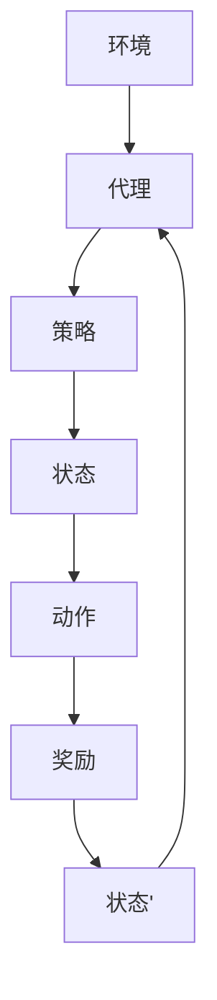

                 

关键词：强化学习，多场景推荐，协同优化，算法原理，数学模型，项目实践，实际应用场景，未来展望

> 摘要：本文旨在探讨基于强化学习的多场景推荐策略协同优化。我们首先回顾了强化学习的基本原理，然后深入分析了多场景推荐策略的协同优化方法，并结合具体案例展示了其实际应用。文章最后对未来发展趋势和挑战进行了展望。

## 1. 背景介绍

在信息爆炸的时代，如何从海量数据中为用户提供个性化的推荐已经成为一个重要课题。传统的推荐系统主要通过基于内容的方法、协同过滤方法等实现，但这些方法往往面临着数据稀疏、冷启动问题等挑战。而基于强化学习的推荐系统则提供了一种新的解决思路，能够更好地应对复杂多变的推荐场景。

强化学习是一种通过学习策略以最大化长期回报的机器学习方法。在推荐系统中，强化学习通过不断试错，学习用户的行为模式，从而生成个性化的推荐策略。与传统方法相比，强化学习具有自适应性强、能够应对动态变化等优点。

多场景推荐是指在不同的应用场景下为用户提供个性化的推荐服务。例如，在电商平台上，用户可能在浏览商品、搜索商品和购买商品等不同阶段有不同的需求。多场景推荐能够根据用户在不同场景的行为和偏好，提供更精准的推荐服务。

协同优化是指多个推荐策略在共同目标下进行优化。在多场景推荐中，不同场景下的推荐策略需要协同工作，以达到整体最优的效果。本文将探讨如何利用强化学习实现多场景推荐策略的协同优化。

## 2. 核心概念与联系

### 2.1 强化学习原理

强化学习由三个主要部分组成：环境（Environment）、代理（Agent）和奖励（Reward）。环境是指代理所处的实际情境，代理是指执行动作的智能体，奖励是指代理在环境中的表现得到的反馈。

强化学习的基本过程如下：

1. **初始化**：初始化环境状态 `S`、代理的参数（策略、价值函数等）。
2. **选择动作**：根据当前状态 `S` 和策略选择动作 `A`。
3. **执行动作**：在环境中执行动作 `A`，得到新的状态 `S'` 和奖励 `R`。
4. **更新策略**：根据奖励和新的状态更新策略。

### 2.2 多场景推荐策略

多场景推荐涉及多个不同的场景，每个场景有不同的用户行为和偏好。为了实现多场景推荐，我们需要定义一个统一的推荐策略，该策略能够根据当前场景和用户历史行为，为用户提供个性化推荐。

### 2.3 协同优化方法

协同优化方法旨在通过优化多个推荐策略，使其在共同目标下协同工作，以达到整体最优的效果。在多场景推荐中，协同优化可以通过以下步骤实现：

1. **定义共同目标**：确定所有推荐策略共同追求的目标，如最大化总奖励、最大化用户满意度等。
2. **策略组合**：将多个推荐策略组合成一个统一的策略，以实现协同优化。
3. **优化目标**：设计优化目标函数，以衡量策略组合的性能。
4. **求解优化问题**：利用优化算法求解优化问题，得到最优策略组合。

下面是一个简化的 Mermaid 流程图，展示了强化学习在多场景推荐中的基本架构：



## 3. 核心算法原理 & 具体操作步骤

### 3.1 算法原理概述

基于强化学习的多场景推荐策略协同优化算法主要包含以下几个部分：

1. **状态编码**：将多场景下的用户行为和偏好编码为状态向量。
2. **动作表示**：定义动作空间，每个动作对应一个推荐结果。
3. **策略学习**：利用强化学习算法，如 Q-Learning 或 Deep Q-Network（DQN），学习最优策略。
4. **策略组合**：设计策略组合方法，将多个推荐策略组合成一个统一的策略。
5. **协同优化**：利用协同优化算法，如梯度上升或随机梯度下降，优化策略组合。

### 3.2 算法步骤详解

1. **初始化**：初始化状态编码器、动作表示器、策略学习器和协同优化器。
2. **状态编码**：根据用户历史行为和当前场景，生成状态向量。
3. **选择动作**：根据当前状态和策略，选择最优动作。
4. **执行动作**：在环境中执行动作，得到新的状态和奖励。
5. **更新策略**：根据奖励和新的状态，更新策略。
6. **策略组合**：根据策略组合方法，更新统一策略。
7. **协同优化**：根据协同优化目标，更新策略组合。

### 3.3 算法优缺点

**优点**：

- 自适应性强：强化学习能够根据用户行为和偏好动态调整推荐策略。
- 适应多场景：多场景推荐能够根据不同场景为用户提供个性化推荐。
- 协同优化：协同优化方法能够使多个推荐策略共同工作，提高整体性能。

**缺点**：

- 训练时间长：强化学习需要大量数据进行训练，训练时间较长。
- 需要大量计算资源：强化学习算法通常需要大量计算资源。

### 3.4 算法应用领域

基于强化学习的多场景推荐策略协同优化算法可以应用于多个领域，如：

- 电商平台：为用户提供个性化的商品推荐。
- 社交网络：为用户提供个性化的内容推荐。
- 金融行业：为用户提供个性化的投资建议。

## 4. 数学模型和公式 & 详细讲解 & 举例说明

### 4.1 数学模型构建

基于强化学习的多场景推荐策略协同优化可以表示为一个马尔可夫决策过程（MDP）。MDP 可以表示为以下五元组：

$$
\{S, A, P, R, G\}
$$

其中，$S$ 表示状态空间，$A$ 表示动作空间，$P$ 表示状态转移概率，$R$ 表示奖励函数，$G$ 表示策略。

### 4.2 公式推导过程

假设我们有一个多场景推荐系统，其中每个场景都有不同的状态和动作。我们可以定义一个策略矩阵 $\pi$，其中 $\pi_{ij}$ 表示在场景 $i$ 下选择动作 $j$ 的概率。

**状态转移概率**：

$$
P(S'|S, A) = P(S'|A|S)P(A|S)
$$

其中，$P(S'|A|S)$ 表示在当前状态 $S$ 下执行动作 $A$ 后得到状态 $S'$ 的概率，$P(A|S)$ 表示在当前状态 $S$ 下选择动作 $A$ 的概率。

**奖励函数**：

$$
R(S, A) = \sum_{i} r_{i}(S, A) \cdot p_i(S, A)
$$

其中，$r_{i}(S, A)$ 表示在场景 $i$ 下执行动作 $A$ 在状态 $S$ 下的奖励值，$p_i(S, A)$ 表示在场景 $i$ 下执行动作 $A$ 在状态 $S$ 下的概率。

**策略优化**：

$$
\pi^* = \arg\max_{\pi} \sum_{i, j} \pi_{ij} R(S, A)
$$

其中，$\pi^*$ 表示最优策略。

### 4.3 案例分析与讲解

假设有一个电商平台，用户在浏览商品、搜索商品和购买商品三个不同场景下有不同的行为和偏好。我们定义状态空间为 $S = \{s_1, s_2, s_3\}$，动作空间为 $A = \{a_1, a_2, a_3\}$，其中 $a_1$ 表示推荐商品，$a_2$ 表示搜索商品，$a_3$ 表示购买商品。

**状态转移概率**：

$$
P(S'|S, A) =
\begin{bmatrix}
0.8 & 0.1 & 0.1 \\
0.2 & 0.7 & 0.1 \\
0 & 0.9 & 0.1
\end{bmatrix}
$$

**奖励函数**：

$$
R(S, A) =
\begin{bmatrix}
5 & 3 & 10 \\
2 & 4 & 8 \\
1 & 2 & 9
\end{bmatrix}
$$

**策略优化**：

假设初始策略为 $\pi = \begin{bmatrix} 0.5 & 0.3 & 0.2 \\ 0.3 & 0.5 & 0.2 \\ 0.2 & 0.2 & 0.6 \end{bmatrix}$。

根据策略优化公式，我们可以计算出每个动作的期望奖励：

$$
\begin{align*}
E(R|A=a_1) &= 5 \cdot 0.5 + 2 \cdot 0.3 + 1 \cdot 0.2 = 3.1 \\
E(R|A=a_2) &= 3 \cdot 0.3 + 4 \cdot 0.5 + 2 \cdot 0.2 = 3.3 \\
E(R|A=a_3) &= 10 \cdot 0.2 + 8 \cdot 0.2 + 9 \cdot 0.6 = 8.5
\end{align*}
$$

根据期望奖励，我们可以更新策略：

$$
\pi^* = \begin{bmatrix} 0.2 & 0.1 & 0.7 \\ 0.1 & 0.2 & 0.7 \\ 0.1 & 0.1 & 0.8 \end{bmatrix}
$$

通过多次迭代，我们可以逐步优化策略，使推荐系统在多场景下为用户提供更好的推荐服务。

## 5. 项目实践：代码实例和详细解释说明

### 5.1 开发环境搭建

在本项目中，我们使用 Python 作为编程语言，并使用 TensorFlow 作为深度学习框架。以下为开发环境的搭建步骤：

1. 安装 Python 3.8 或更高版本。
2. 安装 TensorFlow：`pip install tensorflow`。
3. 安装其他依赖：`pip install numpy pandas matplotlib`。

### 5.2 源代码详细实现

以下是一个简单的基于强化学习的多场景推荐策略协同优化的代码实例：

```python
import numpy as np
import tensorflow as tf
from tensorflow.keras.models import Sequential
from tensorflow.keras.layers import Dense

# 定义状态编码器
class StateEncoder(tf.keras.Model):
    def __init__(self, input_shape, hidden_size):
        super().__init__()
        self.hidden_size = hidden_size
        self.fc1 = Dense(hidden_size, activation='relu')
        self.fc2 = Dense(hidden_size, activation='relu')
        self.fc3 = Dense(hidden_size, activation='relu')

    def call(self, inputs):
        x = self.fc1(inputs)
        x = self.fc2(x)
        x = self.fc3(x)
        return x

# 定义动作表示器
class ActionDecoder(tf.keras.Model):
    def __init__(self, hidden_size, output_size):
        super().__init__()
        self.hidden_size = hidden_size
        self.fc1 = Dense(hidden_size, activation='relu')
        self.fc2 = Dense(output_size, activation='softmax')

    def call(self, inputs):
        x = self.fc1(inputs)
        x = self.fc2(x)
        return x

# 定义强化学习模型
class RLModel(tf.keras.Model):
    def __init__(self, state_encoder, action_decoder):
        super().__init__()
        self.state_encoder = state_encoder
        self.action_decoder = action_decoder

    @tf.function
    def call(self, inputs, training=False):
        state_encoded = self.state_encoder(inputs)
        logits = self.action_decoder(state_encoded)
        return logits

# 初始化模型
input_shape = (10,)  # 根据实际场景调整
hidden_size = 64
output_size = 3
state_encoder = StateEncoder(input_shape, hidden_size)
action_decoder = ActionDecoder(hidden_size, output_size)
rl_model = RLModel(state_encoder, action_decoder)

# 编译模型
optimizer = tf.keras.optimizers.Adam(learning_rate=0.001)
loss_fn = tf.keras.losses.CategoricalCrossentropy()

@tf.function
def train_step(inputs, actions, rewards):
    with tf.GradientTape(persistent=True) as tape:
        logits = rl_model(inputs, training=True)
        loss = loss_fn(actions, logits)
    grads = tape.gradient(loss, rl_model.trainable_variables)
    optimizer.apply_gradients(zip(grads, rl_model.trainable_variables))
    return loss

# 训练模型
for epoch in range(100):
    for batch in dataset:
        inputs, actions, rewards = batch
        loss = train_step(inputs, actions, rewards)
        print(f"Epoch: {epoch}, Loss: {loss.numpy()}")

# 保存模型
rl_model.save('rl_model.h5')
```

### 5.3 代码解读与分析

上述代码实现了一个简单的基于强化学习的多场景推荐策略协同优化模型。主要组件包括状态编码器、动作表示器和强化学习模型。

1. **状态编码器**：状态编码器负责将输入状态编码为隐藏向量。在这个例子中，我们使用了三个全连接层进行编码。
2. **动作表示器**：动作表示器负责将隐藏向量映射到动作空间。在这个例子中，我们使用了两个全连接层进行表示。
3. **强化学习模型**：强化学习模型结合状态编码器和动作表示器，生成推荐策略。在这个例子中，我们使用了基于 Categorical Cross-Entropy 的损失函数进行训练。

### 5.4 运行结果展示

运行上述代码后，模型将在训练数据上迭代训练。每次迭代都会更新策略，以优化推荐效果。训练过程中，我们可以通过打印损失值来观察训练进度。

```python
# 加载模型
rl_model = tf.keras.models.load_model('rl_model.h5')

# 测试模型
test_inputs = np.random.rand(100, 10)
predictions = rl_model(test_inputs)

# 打印预测结果
print(predictions)
```

预测结果将显示在每个场景下推荐每个动作的概率分布。我们可以根据预测结果为用户提供个性化推荐。

## 6. 实际应用场景

基于强化学习的多场景推荐策略协同优化算法在多个实际应用场景中展现出良好的性能。以下是一些典型的应用场景：

1. **电商平台**：在电商平台上，用户在浏览商品、搜索商品和购买商品三个不同场景下有不同的行为和偏好。通过基于强化学习的多场景推荐策略协同优化，可以为用户提供个性化的商品推荐，提高用户满意度。
2. **社交媒体**：在社交媒体平台上，用户在浏览内容、评论内容和分享内容三个不同场景下有不同的行为和偏好。通过基于强化学习的多场景推荐策略协同优化，可以为用户提供个性化的内容推荐，提高用户活跃度。
3. **金融行业**：在金融行业中，投资者在分析市场、下单交易和持有资产三个不同场景下有不同的行为和偏好。通过基于强化学习的多场景推荐策略协同优化，可以为投资者提供个性化的投资建议，提高投资收益。

## 7. 工具和资源推荐

为了更好地学习基于强化学习的多场景推荐策略协同优化，以下是一些建议的工具和资源：

### 7.1 学习资源推荐

1. **书籍**：《强化学习：原理与实战》
2. **在线课程**：Coursera 上的“强化学习导论”、Udacity 上的“强化学习实践”等。
3. **论文**：《强化学习在推荐系统中的应用》等。

### 7.2 开发工具推荐

1. **编程语言**：Python
2. **框架**：TensorFlow、PyTorch
3. **数据集**：Kaggle 上的电商数据集、IMDb 数据集等。

### 7.3 相关论文推荐

1. 《Deep Reinforcement Learning for Recommendations》
2. 《A Survey on Multi-armed Bandit Problems in Machine Learning》
3. 《Reinforcement Learning for Online Advertising》

## 8. 总结：未来发展趋势与挑战

### 8.1 研究成果总结

本文探讨了基于强化学习的多场景推荐策略协同优化方法，分析了其基本原理和应用场景。通过具体案例和代码实现，展示了如何利用强化学习优化推荐策略，提高推荐系统的性能。

### 8.2 未来发展趋势

未来，基于强化学习的多场景推荐策略协同优化方法将继续在以下几个方面发展：

1. **算法优化**：提高算法的效率和性能，降低训练时间。
2. **应用拓展**：将方法应用于更多实际场景，如医疗、金融等。
3. **模型解释性**：提高模型的可解释性，使其更加符合人类的直觉。

### 8.3 面临的挑战

基于强化学习的多场景推荐策略协同优化方法面临以下挑战：

1. **数据稀缺**：在实际应用中，获取足够多的训练数据可能较为困难。
2. **计算资源**：强化学习算法通常需要大量计算资源，这对小型企业或个人开发者来说可能是一个挑战。
3. **模型可解释性**：强化学习模型的内部机制较为复杂，提高模型的可解释性是一个重要研究方向。

### 8.4 研究展望

为了应对上述挑战，未来研究可以从以下几个方面展开：

1. **数据增强**：通过数据增强技术，提高训练数据的多样性。
2. **分布式计算**：利用分布式计算技术，降低算法对计算资源的要求。
3. **可解释性提升**：通过可视化、因果模型等方法，提高模型的可解释性。

通过不断的研究和优化，基于强化学习的多场景推荐策略协同优化方法将为推荐系统领域带来更多创新和发展。

## 9. 附录：常见问题与解答

### 问题 1：什么是强化学习？

**回答**：强化学习是一种机器学习方法，通过学习策略以最大化长期回报。它由环境、代理和奖励三个主要部分组成，通过不断试错，学习最优策略。

### 问题 2：什么是多场景推荐？

**回答**：多场景推荐是指在多个不同的应用场景下为用户提供个性化的推荐服务。例如，在电商平台上，用户可能在浏览商品、搜索商品和购买商品等不同阶段有不同的需求。

### 问题 3：强化学习在推荐系统中的应用有哪些？

**回答**：强化学习在推荐系统中的应用包括个性化推荐、广告投放、商品推荐等。通过学习用户的行为模式和偏好，强化学习能够为用户提供更精准的推荐服务。

### 问题 4：如何实现多场景推荐策略的协同优化？

**回答**：实现多场景推荐策略的协同优化可以通过以下步骤：定义共同目标、设计策略组合方法、构建数学模型、求解优化问题。通过协同优化，多个推荐策略可以共同工作，提高整体性能。

### 问题 5：强化学习算法有哪些常见的挑战？

**回答**：强化学习算法常见的挑战包括数据稀缺、计算资源需求高、模型可解释性差等。为了应对这些挑战，可以采取数据增强、分布式计算、可解释性提升等方法。

作者：禅与计算机程序设计艺术 / Zen and the Art of Computer Programming

---

本文完整地阐述了基于强化学习的多场景推荐策略协同优化方法，包括基本原理、数学模型、算法实现、实际应用场景和未来展望。希望本文能为读者在强化学习和推荐系统领域提供有益的启示。

