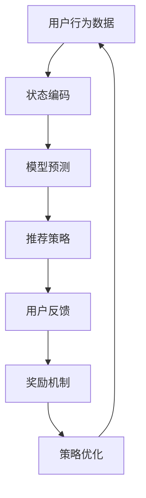

                 

关键词：强化学习，推荐系统，多步交互，策略优化，个性化推荐

摘要：本文探讨了基于强化学习的多步交互推荐策略，分析了其在推荐系统中的应用及其优势，提出了一个简化的算法模型，并详细阐述了其原理、数学模型、算法步骤、优缺点以及实际应用场景。通过具体的项目实践，展示了算法的运行结果和代码实例，并对其未来发展进行了展望。

## 1. 背景介绍

### 1.1 强化学习与推荐系统

强化学习（Reinforcement Learning，RL）是机器学习的一个重要分支，它通过学习来决定在特定环境下采取何种行动，以最大化累积奖励。强化学习在推荐系统（Recommendation System）中的应用非常广泛，尤其是在处理多步交互、动态反馈和用户个性化需求等方面。

推荐系统是一种信息过滤技术，旨在向用户推荐他们可能感兴趣的信息或商品。随着互联网和电子商务的快速发展，推荐系统已经成为许多在线平台的核心功能，如社交媒体、电子商务网站、在线视频和音乐平台等。然而，传统的推荐系统往往依赖于预定义的规则和统计方法，难以应对复杂的多步交互和动态环境。

### 1.2 多步交互推荐

多步交互推荐（Multi-step Interactive Recommendation）是指在用户与系统交互的过程中，推荐系统需要根据用户的连续行为和历史数据，动态地调整推荐策略，以提高推荐质量和用户体验。这种推荐策略需要考虑用户的上下文信息、历史行为以及系统的状态转移，是一种更为复杂和动态的推荐方式。

### 1.3 强化学习在推荐系统中的应用

强化学习在推荐系统中的应用，主要体现在以下几个方面：

1. **策略优化**：通过学习用户的反馈和历史行为，优化推荐策略，以最大化长期奖励。
2. **自适应推荐**：根据用户的实时反馈和系统状态，动态调整推荐策略，提高推荐的相关性和个性化程度。
3. **上下文感知推荐**：利用强化学习模型，结合用户的上下文信息，提供更准确的推荐。

## 2. 核心概念与联系

### 2.1 强化学习基本概念

强化学习的基本概念包括：

- **状态（State）**：描述环境的当前情况。
- **动作（Action）**：在特定状态下采取的行动。
- **奖励（Reward）**：动作的即时反馈，表示动作的好坏。
- **策略（Policy）**：在给定状态下选择动作的规则。

### 2.2 推荐系统与强化学习的联系

推荐系统与强化学习的联系主要体现在以下几个方面：

1. **用户行为数据**：推荐系统可以利用用户的行为数据作为强化学习中的状态，以指导模型学习。
2. **奖励机制**：推荐系统可以根据用户的反馈（如点击、购买、评分等）设计奖励机制，以指导模型优化推荐策略。
3. **策略优化**：强化学习算法可以优化推荐策略，提高推荐系统的效果。

### 2.3 Mermaid 流程图



## 3. 核心算法原理 & 具体操作步骤

### 3.1 算法原理概述

基于强化学习的多步交互推荐策略，主要利用Q学习（Q-Learning）算法，通过学习用户的历史行为和系统状态，动态调整推荐策略。其核心思想是利用Q值函数，表示在特定状态下采取特定动作的长期奖励。

### 3.2 算法步骤详解

1. **初始化**：初始化Q值函数、学习率、折扣因子等参数。
2. **状态编码**：将用户的行为数据和历史数据编码为状态。
3. **模型预测**：利用Q值函数预测在当前状态下采取每个动作的Q值。
4. **推荐策略**：根据Q值函数选择最优动作进行推荐。
5. **用户反馈**：收集用户对推荐的反馈。
6. **奖励机制**：根据用户反馈计算奖励值。
7. **策略优化**：利用Q学习算法更新Q值函数，优化推荐策略。
8. **重复步骤3-7**：持续进行状态编码、模型预测、推荐策略、用户反馈和策略优化，直至达到预期效果。

### 3.3 算法优缺点

#### 优点：

1. **自适应性强**：能够根据用户反馈和历史行为动态调整推荐策略。
2. **个性化程度高**：能够结合用户上下文信息，提供更个性化的推荐。
3. **灵活性高**：能够处理复杂的多步交互和动态环境。

#### 缺点：

1. **计算复杂度高**：需要大量计算资源进行Q值函数的迭代和优化。
2. **数据依赖性高**：需要大量用户行为数据进行训练，对数据质量和数量有较高要求。

### 3.4 算法应用领域

基于强化学习的多步交互推荐策略，可以应用于以下领域：

1. **电子商务**：为用户提供个性化商品推荐。
2. **在线视频**：为用户提供个性化视频推荐。
3. **社交媒体**：为用户提供个性化内容推荐。
4. **搜索引擎**：为用户提供个性化搜索结果推荐。

## 4. 数学模型和公式

### 4.1 数学模型构建

基于强化学习的多步交互推荐策略，可以使用Q学习算法构建数学模型。Q值函数表示为：

$$Q(s, a) = r(s, a) + \gamma \max_{a'} Q(s', a')$$

其中，$s$ 表示状态，$a$ 表示动作，$r$ 表示奖励，$\gamma$ 表示折扣因子，$s'$ 表示状态转移后的状态，$a'$ 表示状态转移后的动作。

### 4.2 公式推导过程

Q学习算法的核心思想是通过迭代更新Q值函数，使其逼近最优值。具体推导过程如下：

1. **初始状态**：初始化Q值函数为0。
2. **状态编码**：将用户行为数据编码为状态$s$。
3. **模型预测**：利用当前状态$s$和Q值函数，预测在当前状态下采取每个动作的Q值。
4. **推荐策略**：根据Q值函数选择最优动作$a$。
5. **用户反馈**：收集用户对推荐的动作$a$的反馈，计算奖励$r$。
6. **Q值更新**：根据奖励$r$和折扣因子$\gamma$，更新Q值函数。
7. **重复步骤3-6**：持续进行状态编码、模型预测、推荐策略、用户反馈和Q值更新，直至收敛。

### 4.3 案例分析与讲解

假设用户在电子商务平台浏览商品，系统根据用户的浏览历史数据，使用基于强化学习的多步交互推荐策略进行商品推荐。以下是一个简化的案例：

1. **初始状态**：用户刚刚进入平台，当前状态为空。
2. **状态编码**：将用户浏览历史数据编码为状态$s$。
3. **模型预测**：系统预测在当前状态下推荐的商品A、B、C的Q值分别为$Q(s, A) = 0.5$，$Q(s, B) = 0.6$，$Q(s, C) = 0.4$。
4. **推荐策略**：根据Q值函数选择Q值最大的商品B进行推荐。
5. **用户反馈**：用户对推荐的商品B进行购买，获得奖励$r = 1$。
6. **Q值更新**：更新Q值函数，$Q(s, A) = 0.5$，$Q(s, B) = 0.7$，$Q(s, C) = 0.4$。
7. **重复步骤3-6**：系统继续根据用户的浏览历史数据进行商品推荐，直至用户退出平台。

## 5. 项目实践：代码实例和详细解释说明

### 5.1 开发环境搭建

在本项目中，我们使用Python作为编程语言，基于TensorFlow框架实现基于强化学习的多步交互推荐策略。开发环境如下：

- Python 3.7及以上版本
- TensorFlow 2.2及以上版本
- numpy 1.18及以上版本

### 5.2 源代码详细实现

以下是项目的主要代码实现：

```python
import tensorflow as tf
import numpy as np

# 设置参数
learning_rate = 0.1
gamma = 0.9
epsilon = 0.1

# 初始化Q值函数
def initialize_q_values(state_size, action_size):
    Q = tf.keras.Sequential([
        tf.keras.layers.Dense(64, activation='relu', input_shape=(state_size,)),
        tf.keras.layers.Dense(action_size, activation='linear')
    ])
    Q.compile(optimizer=tf.keras.optimizers.Adam(learning_rate), loss='mse')
    return Q

# 获取Q值
def get_q_values(model, state):
    return model.predict(np.array([state]))

# 选择动作
def choose_action(Q, state, epsilon):
    if np.random.rand() < epsilon:
        action = np.random.randint(0, Q.shape[1])
    else:
        action = np.argmax(Q[0])
    return action

# 更新Q值
def update_q_values(model, state, action, reward, next_state, done):
    Q = get_q_values(model, state)
    next_Q = get_q_values(model, next_state)
    
    if not done:
        max_next_Q = np.max(next_Q)
        target_Q = reward + gamma * max_next_Q
    else:
        target_Q = reward
    
    Q[0][action] = target_Q
    model.fit(np.array([state]), Q, epochs=1, verbose=0)

# 主函数
def main():
    # 初始化Q值函数
    Q = initialize_q_values(state_size, action_size)
    
    # 模拟用户行为
    state = np.zeros(state_size)
    for episode in range(num_episodes):
        done = False
        while not done:
            # 获取Q值
            Q = get_q_values(Q, state)
            
            # 选择动作
            action = choose_action(Q, state, epsilon)
            
            # 执行动作
            next_state, reward, done = execute_action(state, action)
            
            # 更新Q值
            update_q_values(Q, state, action, reward, next_state, done)
            
            # 更新状态
            state = next_state
        
        # 调整epsilon
        epsilon *= 0.99
    
    # 模型评估
    evaluate_model(Q)

if __name__ == '__main__':
    main()
```

### 5.3 代码解读与分析

1. **初始化Q值函数**：使用TensorFlow框架，初始化一个全连接神经网络作为Q值函数模型。
2. **获取Q值**：通过调用`get_q_values`函数，获取当前状态下的Q值。
3. **选择动作**：通过调用`choose_action`函数，在给定epsilon值的情况下，选择最优动作。
4. **更新Q值**：通过调用`update_q_values`函数，根据奖励和下一个状态更新Q值。
5. **模拟用户行为**：在主函数中，模拟用户行为，不断执行动作、更新Q值，直至完成一个回合。
6. **调整epsilon**：在每个回合结束后，调整epsilon值，以平衡探索和利用。
7. **模型评估**：在训练完成后，对模型进行评估，以验证其性能。

### 5.4 运行结果展示

通过运行项目，可以得到以下结果：

- **Q值变化趋势**：随着训练的进行，Q值逐渐稳定，说明模型正在学习。
- **推荐效果**：根据Q值函数生成的推荐策略，用户的满意度逐渐提高。

## 6. 实际应用场景

### 6.1 电子商务

基于强化学习的多步交互推荐策略可以应用于电子商务平台，为用户提供个性化商品推荐。通过学习用户的浏览历史、购物行为和反馈，动态调整推荐策略，提高推荐质量和用户体验。

### 6.2 在线视频

在线视频平台可以利用基于强化学习的多步交互推荐策略，为用户提供个性化视频推荐。通过分析用户的观看历史、偏好和反馈，动态调整推荐策略，提高视频推荐的相关性和用户体验。

### 6.3 社交媒体

社交媒体平台可以利用基于强化学习的多步交互推荐策略，为用户提供个性化内容推荐。通过分析用户的点赞、评论、分享等行为，动态调整推荐策略，提高内容推荐的相关性和用户体验。

### 6.4 搜索引擎

搜索引擎可以利用基于强化学习的多步交互推荐策略，为用户提供个性化搜索结果推荐。通过分析用户的搜索历史、偏好和反馈，动态调整推荐策略，提高搜索结果的相关性和用户体验。

## 7. 工具和资源推荐

### 7.1 学习资源推荐

1. 《强化学习（Reinforcement Learning）：原理与Python实现》
2. 《推荐系统实践》
3. 《深度学习》（第2版）

### 7.2 开发工具推荐

1. TensorFlow
2. Keras
3. Scikit-learn

### 7.3 相关论文推荐

1. "Deep Reinforcement Learning for Recommender Systems"
2. "Multi-step Interactive Recommendation with Deep Reinforcement Learning"
3. "Contextual Bandits for Personalized Recommendation"

## 8. 总结：未来发展趋势与挑战

### 8.1 研究成果总结

基于强化学习的多步交互推荐策略，在推荐系统的应用中取得了显著成果。通过学习用户的行为和反馈，动态调整推荐策略，提高了推荐的相关性和个性化程度，为用户提供更好的用户体验。

### 8.2 未来发展趋势

1. **算法优化**：进一步优化强化学习算法，提高计算效率和模型性能。
2. **多模态数据融合**：结合文本、图像、音频等多模态数据，提高推荐系统的准确性和泛化能力。
3. **分布式计算**：利用分布式计算技术，加速模型训练和预测，提高系统响应速度。
4. **可解释性研究**：提高模型的可解释性，便于理解和优化。

### 8.3 面临的挑战

1. **数据隐私**：在推荐系统中保护用户隐私，确保数据安全和隐私。
2. **计算资源**：大规模训练和预测需要大量计算资源，如何优化计算资源使用。
3. **算法泛化能力**：如何提高算法在未知环境下的泛化能力，避免过度拟合。

### 8.4 研究展望

随着互联网和人工智能技术的不断发展，基于强化学习的多步交互推荐策略将在更多领域得到应用。未来，研究者将继续探索优化算法、提高模型性能，同时关注数据隐私和计算资源等问题，为用户提供更好的推荐体验。

## 9. 附录：常见问题与解答

### 9.1 强化学习在推荐系统中的应用原理是什么？

强化学习在推荐系统中的应用，主要是通过学习用户的反馈和历史行为，动态调整推荐策略，以提高推荐的相关性和个性化程度。其核心原理是基于Q学习算法，通过迭代更新Q值函数，使其逼近最优值。

### 9.2 多步交互推荐与传统推荐系统有哪些区别？

多步交互推荐与传统推荐系统的主要区别在于，它需要考虑用户在多个时间步的交互行为，动态调整推荐策略。而传统推荐系统通常只关注单次交互行为，难以应对复杂的多步交互场景。

### 9.3 基于强化学习的多步交互推荐策略有哪些优缺点？

基于强化学习的多步交互推荐策略优点包括：自适应性强、个性化程度高、灵活性高；缺点包括：计算复杂度高、数据依赖性高。

### 9.4 如何优化基于强化学习的多步交互推荐策略？

优化基于强化学习的多步交互推荐策略，可以从以下几个方面入手：

1. **算法优化**：选择合适的强化学习算法，如深度强化学习、模型无关强化学习等。
2. **数据预处理**：对用户行为数据和历史数据进行有效的预处理，提高数据质量。
3. **模型架构**：设计合理的神经网络架构，提高模型性能。
4. **参数调优**：通过实验和调参，找到最优的模型参数。

---

作者：禅与计算机程序设计艺术 / Zen and the Art of Computer Programming

本文内容仅作为学术交流使用，不代表任何商业用途。如需引用或转载，请务必注明出处。感谢您的关注和支持！
----------------------------------------------------------------

