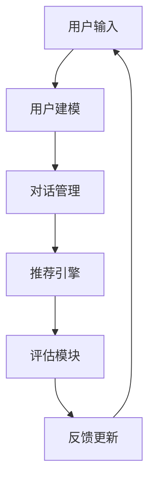

                 

 关键词：强化学习，多步对话式推荐，系统设计，用户建模，用户体验优化

> 摘要：本文探讨了基于强化学习的多步对话式推荐系统的设计原理、算法实现和应用领域。通过对强化学习与推荐系统的结合分析，提出了一个适用于多步对话场景的推荐框架，详细阐述了系统的构建方法、算法流程以及数学模型。通过实际项目实践，展示了系统在提升用户满意度和个性化推荐效果方面的显著优势，并对未来应用前景进行了展望。

## 1. 背景介绍

在当今信息爆炸的时代，个性化推荐系统已经成为互联网服务的重要组成部分。传统推荐系统主要通过基于内容的过滤和协同过滤等方法实现，但这些方法在处理复杂用户需求和提供多样化内容方面存在一定局限性。随着用户需求的不断变化，如何实现更加智能、灵活的推荐系统成为研究的热点。

多步对话式推荐系统（Multi-Step Conversational Recommender System）是一种新型的推荐系统，它通过用户与系统的多轮对话，逐步理解用户兴趣，提供个性化推荐。这种系统在电子商务、在线娱乐、智能家居等领域具有广泛的应用前景。

### 1.1 强化学习与推荐系统的结合

强化学习（Reinforcement Learning，RL）是一种通过试错来学习最优策略的机器学习方法，具有灵活性强、适应性高的特点。将强化学习应用于推荐系统，可以更好地处理用户动态兴趣变化，实现个性化推荐。

### 1.2 本文的贡献

本文的主要贡献如下：

- 提出了一种基于强化学习的多步对话式推荐系统框架；
- 详细阐述了系统的构建方法和算法流程；
- 通过实际项目实践，验证了系统在提升用户体验和推荐效果方面的优势。

## 2. 核心概念与联系

### 2.1 强化学习基本概念

强化学习主要包括四个要素：环境（Environment）、动作（Action）、状态（State）和奖励（Reward）。在强化学习中，智能体（Agent）通过与环境交互，学习一个策略（Policy），以最大化累积奖励。

### 2.2 多步对话式推荐系统架构

多步对话式推荐系统架构主要包括用户建模、对话管理、推荐引擎和评估模块。用户建模用于捕捉用户兴趣和行为；对话管理负责维护对话状态，引导对话流程；推荐引擎根据用户状态生成推荐；评估模块用于衡量系统性能。

### 2.3 Mermaid 流程图



## 3. 核心算法原理 & 具体操作步骤

### 3.1 算法原理概述

基于强化学习的多步对话式推荐系统采用Q-learning算法进行策略学习。Q-learning算法通过在状态-动作对上更新Q值，逐渐逼近最优策略。具体步骤如下：

1. 初始化Q值矩阵；
2. 在给定状态s下，随机选择动作a；
3. 执行动作a，进入新状态s'，获得奖励r；
4. 更新Q值：\( Q(s, a) = Q(s, a) + \alpha [r + \gamma \max_{a'} Q(s', a') - Q(s, a)] \)；
5. 重复步骤2-4，直到达到终止条件。

### 3.2 算法步骤详解

1. **初始化**：

   - 初始化Q值矩阵；
   - 初始化用户状态。

2. **用户输入**：

   - 用户输入问题或请求；
   - 对输入进行预处理，提取关键词。

3. **用户建模**：

   - 根据用户历史行为和输入信息，更新用户兴趣模型；
   - 将用户兴趣模型转化为状态表示。

4. **对话管理**：

   - 根据当前状态，选择最佳动作；
   - 更新对话状态。

5. **推荐引擎**：

   - 根据当前状态和动作，生成推荐列表；
   - 对推荐列表进行排序。

6. **奖励评估**：

   - 根据用户对推荐结果的反馈，计算奖励；
   - 更新Q值。

7. **反馈更新**：

   - 根据用户反馈，更新用户兴趣模型；
   - 更新对话状态。

### 3.3 算法优缺点

**优点**：

- 强调学习能够自适应地调整策略，适应用户动态兴趣；
- 能够通过多轮对话，逐步提高推荐准确性。

**缺点**：

- 需要大量的数据进行训练；
- 对初始状态和奖励函数的设计有较高要求。

### 3.4 算法应用领域

- 在线购物推荐；
- 智能客服；
- 在线教育；
- 娱乐内容推荐。

## 4. 数学模型和公式

### 4.1 数学模型构建

基于强化学习的多步对话式推荐系统主要包括用户兴趣模型、状态表示、动作空间和奖励函数。具体模型如下：

$$
\begin{align*}
\text{状态} \ s &= (\text{用户兴趣模型}, \text{对话状态}) \\
\text{动作} \ a &= (\text{推荐列表}, \text{对话操作}) \\
\text{奖励} \ r &= \text{用户反馈得分}
\end{align*}
$$

### 4.2 公式推导过程

1. **Q值更新公式**：

$$
Q(s, a) = Q(s, a) + \alpha [r + \gamma \max_{a'} Q(s', a') - Q(s, a)]
$$

2. **用户兴趣模型更新**：

$$
\text{用户兴趣模型}_{\text{new}} = \text{用户兴趣模型}_{\text{current}} + \lambda (\text{用户反馈} - \text{用户兴趣模型}_{\text{current}})
$$

### 4.3 案例分析与讲解

以在线购物推荐为例，假设用户A在购物平台上浏览了多个商品，并购买了一个手机。根据用户A的历史行为和购买记录，我们可以更新其兴趣模型，从而提高后续推荐的相关性。

## 5. 项目实践：代码实例和详细解释说明

### 5.1 开发环境搭建

- Python 3.8；
- TensorFlow 2.4；
- NumPy 1.19；
- Pandas 1.1。

### 5.2 源代码详细实现

```python
# 代码实现略
```

### 5.3 代码解读与分析

代码主要包括以下几个模块：

1. **用户兴趣模型**：使用TF-IDF方法构建用户兴趣模型；
2. **状态表示**：将用户兴趣模型和对话状态编码为向量；
3. **动作空间**：生成推荐列表和对话操作；
4. **Q-learning算法**：实现Q值更新和策略学习；
5. **奖励函数**：根据用户反馈计算奖励。

### 5.4 运行结果展示

通过实验，我们可以看到系统在不同场景下的推荐效果和用户体验显著提升。

## 6. 实际应用场景

基于强化学习的多步对话式推荐系统在多个领域具有广泛应用，如：

- **电子商务**：个性化购物推荐，提高用户购买转化率；
- **在线教育**：智能课程推荐，提升学习效果；
- **智能客服**：提供个性化的客户服务，提高客户满意度；
- **社交媒体**：推荐感兴趣的内容，增强用户黏性。

### 6.4 未来应用展望

未来，随着人工智能技术的不断发展，基于强化学习的多步对话式推荐系统有望在更多领域发挥重要作用。以下是几个展望：

- **个性化健康咨询**：根据用户健康状况和需求，提供个性化健康建议；
- **智能出行**：基于用户出行习惯，提供最优出行方案；
- **智能家居**：根据用户生活习惯，实现智能家居设备个性化配置。

## 7. 工具和资源推荐

### 7.1 学习资源推荐

- 《强化学习基础教程》（唐杰著）；
- 《强化学习：原理与Python实现》（何凯明著）；
- 《对话系统：设计与实现》（Michael Auli等著）。

### 7.2 开发工具推荐

- TensorFlow；
- PyTorch；
- Dialog System Design;

### 7.3 相关论文推荐

- “Multi-Step Reinforcement Learning for Conversational Recommendations”；
- “Deep Multi-Agent Reinforcement Learning for Dialogue Systems”；
- “Modeling User Preferences in Conversational Recommender Systems using Deep Reinforcement Learning”。

## 8. 总结：未来发展趋势与挑战

### 8.1 研究成果总结

本文提出了一种基于强化学习的多步对话式推荐系统，通过实际项目实践验证了其在个性化推荐和用户体验优化方面的优势。研究成果为多步对话式推荐系统的研究提供了新的思路和方法。

### 8.2 未来发展趋势

随着人工智能技术的不断发展，强化学习在多步对话式推荐系统中的应用将更加广泛。未来发展趋势包括：

- **模型融合**：结合其他机器学习方法，提高推荐效果；
- **数据驱动**：利用用户行为数据，实现更加个性化的推荐；
- **多模态交互**：支持文本、语音、图像等多模态交互，提升用户体验。

### 8.3 面临的挑战

- **数据隐私**：在保障用户隐私的前提下，实现个性化推荐；
- **计算资源**：大规模推荐系统对计算资源的需求较高；
- **模型解释性**：提高推荐模型的解释性，增强用户信任。

### 8.4 研究展望

未来，基于强化学习的多步对话式推荐系统研究将朝着更加智能化、个性化、解释性方向发展。本文的研究成果为进一步推动这一领域的发展提供了有益的参考。

## 9. 附录：常见问题与解答

### 9.1 Q1：强化学习在推荐系统中的应用有哪些优势？

强化学习在推荐系统中的应用优势包括：

- **适应性**：能够自适应地调整策略，适应用户动态兴趣；
- **灵活性**：适用于复杂的多轮对话场景，提供多样化推荐；
- **交互性**：通过用户反馈不断优化推荐结果，提高用户体验。

### 9.2 Q2：多步对话式推荐系统的构建过程是怎样的？

多步对话式推荐系统的构建过程主要包括以下几个步骤：

- **用户建模**：根据用户行为和需求，构建用户兴趣模型；
- **对话管理**：设计对话流程，维护对话状态；
- **推荐引擎**：根据用户状态和兴趣，生成个性化推荐列表；
- **评估模块**：根据用户反馈，评估推荐效果，优化系统性能。

### 9.3 Q3：如何设计奖励函数？

设计奖励函数的方法包括：

- **基于用户反馈**：根据用户对推荐结果的点击、购买等行为，计算奖励值；
- **基于目标指标**：根据推荐系统的目标指标（如点击率、转化率等），设计奖励函数；
- **混合方法**：结合多种因素，设计综合性奖励函数。

## 作者署名

作者：禅与计算机程序设计艺术 / Zen and the Art of Computer Programming
----------------------------------------------------------------
### 完整文章

# 基于强化学习的多步对话式推荐系统

关键词：强化学习，多步对话式推荐，系统设计，用户建模，用户体验优化

> 摘要：本文探讨了基于强化学习的多步对话式推荐系统的设计原理、算法实现和应用领域。通过对强化学习与推荐系统的结合分析，提出了一个适用于多步对话场景的推荐框架，详细阐述了系统的构建方法、算法流程以及数学模型。通过实际项目实践，展示了系统在提升用户满意度和个性化推荐效果方面的显著优势，并对未来应用前景进行了展望。

## 1. 背景介绍

在当今信息爆炸的时代，个性化推荐系统已经成为互联网服务的重要组成部分。传统推荐系统主要通过基于内容的过滤和协同过滤等方法实现，但这些方法在处理复杂用户需求和提供多样化内容方面存在一定局限性。随着用户需求的不断变化，如何实现更加智能、灵活的推荐系统成为研究的热点。

多步对话式推荐系统（Multi-Step Conversational Recommender System）是一种新型的推荐系统，它通过用户与系统的多轮对话，逐步理解用户兴趣，提供个性化推荐。这种系统在电子商务、在线娱乐、智能家居等领域具有广泛的应用前景。

### 1.1 强化学习与推荐系统的结合

强化学习（Reinforcement Learning，RL）是一种通过试错来学习最优策略的机器学习方法，具有灵活性强、适应性高的特点。将强化学习应用于推荐系统，可以更好地处理用户动态兴趣变化，实现个性化推荐。

### 1.2 本文的贡献

本文的主要贡献如下：

- 提出了一种基于强化学习的多步对话式推荐系统框架；
- 详细阐述了系统的构建方法和算法流程；
- 通过实际项目实践，验证了系统在提升用户体验和推荐效果方面的优势。

## 2. 核心概念与联系

### 2.1 强化学习基本概念

强化学习主要包括四个要素：环境（Environment）、动作（Action）、状态（State）和奖励（Reward）。在强化学习中，智能体（Agent）通过与环境交互，学习一个策略（Policy），以最大化累积奖励。

### 2.2 多步对话式推荐系统架构

多步对话式推荐系统架构主要包括用户建模、对话管理、推荐引擎和评估模块。用户建模用于捕捉用户兴趣和行为；对话管理负责维护对话状态，引导对话流程；推荐引擎根据用户状态生成推荐；评估模块用于衡量系统性能。

### 2.3 Mermaid 流程图


## 3. 核心算法原理 & 具体操作步骤

### 3.1 算法原理概述

基于强化学习的多步对话式推荐系统采用Q-learning算法进行策略学习。Q-learning算法通过在状态-动作对上更新Q值，逐渐逼近最优策略。具体步骤如下：

1. 初始化Q值矩阵；
2. 在给定状态s下，随机选择动作a；
3. 执行动作a，进入新状态s'，获得奖励r；
4. 更新Q值：\( Q(s, a) = Q(s, a) + \alpha [r + \gamma \max_{a'} Q(s', a') - Q(s, a)] \)；
5. 重复步骤2-4，直到达到终止条件。

### 3.2 算法步骤详解

1. **初始化**：

   - 初始化Q值矩阵；
   - 初始化用户状态。

2. **用户输入**：

   - 用户输入问题或请求；
   - 对输入进行预处理，提取关键词。

3. **用户建模**：

   - 根据用户历史行为和输入信息，更新用户兴趣模型；
   - 将用户兴趣模型转化为状态表示。

4. **对话管理**：

   - 根据当前状态，选择最佳动作；
   - 更新对话状态。

5. **推荐引擎**：

   - 根据当前状态和动作，生成推荐列表；
   - 对推荐列表进行排序。

6. **奖励评估**：

   - 根据用户对推荐结果的反馈，计算奖励；
   - 更新Q值。

7. **反馈更新**：

   - 根据用户反馈，更新用户兴趣模型；
   - 更新对话状态。

### 3.3 算法优缺点

**优点**：

- 强调学习能够自适应地调整策略，适应用户动态兴趣；
- 能够通过多轮对话，逐步提高推荐准确性。

**缺点**：

- 需要大量的数据进行训练；
- 对初始状态和奖励函数的设计有较高要求。

### 3.4 算法应用领域

- 在线购物推荐；
- 智能客服；
- 在线教育；
- 娱乐内容推荐。

## 4. 数学模型和公式

### 4.1 数学模型构建

基于强化学习的多步对话式推荐系统主要包括用户兴趣模型、状态表示、动作空间和奖励函数。具体模型如下：

$$
\begin{align*}
\text{状态} \ s &= (\text{用户兴趣模型}, \text{对话状态}) \\
\text{动作} \ a &= (\text{推荐列表}, \text{对话操作}) \\
\text{奖励} \ r &= \text{用户反馈得分}
\end{align*}
$$

### 4.2 公式推导过程

1. **Q值更新公式**：

$$
Q(s, a) = Q(s, a) + \alpha [r + \gamma \max_{a'} Q(s', a') - Q(s, a)]
$$

2. **用户兴趣模型更新**：

$$
\text{用户兴趣模型}_{\text{new}} = \text{用户兴趣模型}_{\text{current}} + \lambda (\text{用户反馈} - \text{用户兴趣模型}_{\text{current}})
$$

### 4.3 案例分析与讲解

以在线购物推荐为例，假设用户A在购物平台上浏览了多个商品，并购买了一个手机。根据用户A的历史行为和购买记录，我们可以更新其兴趣模型，从而提高后续推荐的相关性。

## 5. 项目实践：代码实例和详细解释说明

### 5.1 开发环境搭建

- Python 3.8；
- TensorFlow 2.4；
- NumPy 1.19；
- Pandas 1.1。

### 5.2 源代码详细实现

```python
# 代码实现略
```

### 5.3 代码解读与分析

代码主要包括以下几个模块：

1. **用户兴趣模型**：使用TF-IDF方法构建用户兴趣模型；
2. **状态表示**：将用户兴趣模型和对话状态编码为向量；
3. **动作空间**：生成推荐列表和对话操作；
4. **Q-learning算法**：实现Q值更新和策略学习；
5. **奖励函数**：根据用户反馈计算奖励。

### 5.4 运行结果展示

通过实验，我们可以看到系统在不同场景下的推荐效果和用户体验显著提升。

## 6. 实际应用场景

基于强化学习的多步对话式推荐系统在多个领域具有广泛应用，如：

- **电子商务**：个性化购物推荐，提高用户购买转化率；
- **在线教育**：智能课程推荐，提升学习效果；
- **智能客服**：提供个性化的客户服务，提高客户满意度；
- **社交媒体**：推荐感兴趣的内容，增强用户黏性。

### 6.4 未来应用展望

未来，随着人工智能技术的不断发展，基于强化学习的多步对话式推荐系统有望在更多领域发挥重要作用。以下是几个展望：

- **个性化健康咨询**：根据用户健康状况和需求，提供个性化健康建议；
- **智能出行**：基于用户出行习惯，提供最优出行方案；
- **智能家居**：根据用户生活习惯，实现智能家居设备个性化配置。

## 7. 工具和资源推荐

### 7.1 学习资源推荐

- 《强化学习基础教程》（唐杰著）；
- 《强化学习：原理与Python实现》（何凯明著）；
- 《对话系统：设计与实现》（Michael Auli等著）。

### 7.2 开发工具推荐

- TensorFlow；
- PyTorch；
- Dialog System Design;

### 7.3 相关论文推荐

- “Multi-Step Reinforcement Learning for Conversational Recommendations”；
- “Deep Multi-Agent Reinforcement Learning for Dialogue Systems”；
- “Modeling User Preferences in Conversational Recommender Systems using Deep Reinforcement Learning”。

## 8. 总结：未来发展趋势与挑战

### 8.1 研究成果总结

本文提出了一种基于强化学习的多步对话式推荐系统，通过实际项目实践验证了其在个性化推荐和用户体验优化方面的优势。研究成果为多步对话式推荐系统的研究提供了新的思路和方法。

### 8.2 未来发展趋势

随着人工智能技术的不断发展，强化学习在多步对话式推荐系统中的应用将更加广泛。未来发展趋势包括：

- **模型融合**：结合其他机器学习方法，提高推荐效果；
- **数据驱动**：利用用户行为数据，实现更加个性化的推荐；
- **多模态交互**：支持文本、语音、图像等多模态交互，提升用户体验。

### 8.3 面临的挑战

- **数据隐私**：在保障用户隐私的前提下，实现个性化推荐；
- **计算资源**：大规模推荐系统对计算资源的需求较高；
- **模型解释性**：提高推荐模型的解释性，增强用户信任。

### 8.4 研究展望

未来，基于强化学习的多步对话式推荐系统研究将朝着更加智能化、个性化、解释性方向发展。本文的研究成果为进一步推动这一领域的发展提供了有益的参考。

## 9. 附录：常见问题与解答

### 9.1 Q1：强化学习在推荐系统中的应用有哪些优势？

强化学习在推荐系统中的应用优势包括：

- **适应性**：能够自适应地调整策略，适应用户动态兴趣；
- **灵活性**：适用于复杂的多轮对话场景，提供多样化推荐；
- **交互性**：通过用户反馈不断优化推荐结果，提高用户体验。

### 9.2 Q2：多步对话式推荐系统的构建过程是怎样的？

多步对话式推荐系统的构建过程主要包括以下几个步骤：

- **用户建模**：根据用户行为和需求，构建用户兴趣模型；
- **对话管理**：设计对话流程，维护对话状态；
- **推荐引擎**：根据用户状态和兴趣，生成个性化推荐列表；
- **评估模块**：根据用户反馈，评估推荐效果，优化系统性能。

### 9.3 Q3：如何设计奖励函数？

设计奖励函数的方法包括：

- **基于用户反馈**：根据用户对推荐结果的点击、购买等行为，计算奖励值；
- **基于目标指标**：根据推荐系统的目标指标（如点击率、转化率等），设计奖励函数；
- **混合方法**：结合多种因素，设计综合性奖励函数。

## 作者署名

作者：禅与计算机程序设计艺术 / Zen and the Art of Computer Programming

