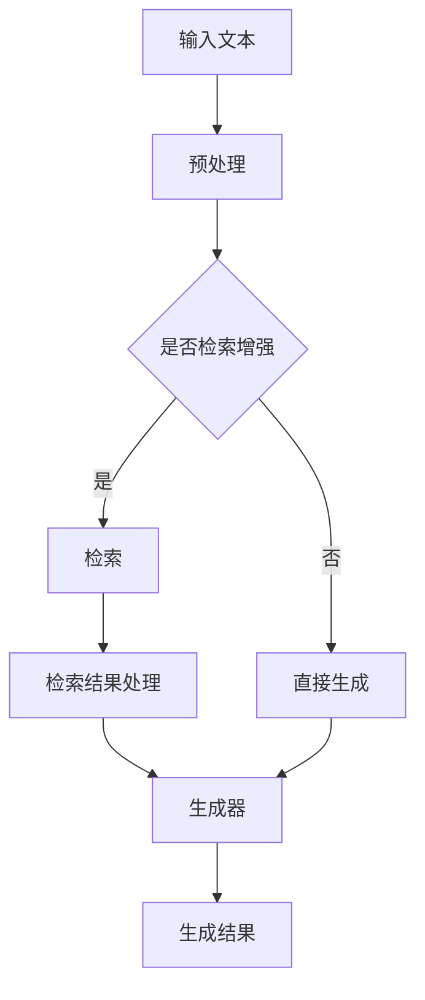

                 

关键词：检索增强、语言模型（LLM）、全流程搭建、深度学习、自然语言处理、算法原理、项目实践

> 摘要：本文将深入探讨基于检索增强的语言模型（LLM）的全流程搭建，涵盖从背景介绍到具体算法实现、数学模型构建、项目实践，以及未来应用展望等各个方面。通过详细解析LLM的工作原理、检索增强技术，和搭建流程，帮助读者全面了解这一前沿技术。

## 1. 背景介绍

### 语言模型与检索增强

语言模型（Language Model，简称LM）是自然语言处理（Natural Language Processing，简称NLP）领域的一项核心技术。传统的语言模型如n-gram模型、神经网络模型（如RNN、LSTM等）被广泛应用于机器翻译、文本分类、问答系统等多个NLP任务。然而，随着深度学习技术的发展，近年来基于注意力机制的Transformer模型逐渐成为主流，代表工作包括BERT、GPT等，它们在多个NLP任务上取得了显著的性能提升。

检索增强（Retrieval Augmented Generation，简称RAG）是近年来提出的一种新型语言模型增强技术。RAG旨在通过将检索技术引入语言模型，进一步提高模型的生成能力。与传统语言模型相比，RAG能够在生成过程中利用外部知识库，从而提供更加准确和丰富的生成结果。

### LLM与检索增强的关系

LLM（Language Learning Model）是一种能够通过大量数据自主学习语言规律的模型。与传统的语言模型相比，LLM具有更强的泛化能力和适应性。LLM结合检索增强技术，可以在生成过程中更加灵活地利用外部知识库，从而实现更高的生成质量和效果。

## 2. 核心概念与联系

### LLM工作原理

LLM基于深度学习技术，通过训练大量文本数据来学习语言规律。具体而言，LLM利用Transformer模型架构，通过注意力机制对输入文本序列进行处理。Transformer模型由多个自注意力层（Self-Attention Layer）和前馈神经网络（Feedforward Neural Network）组成，能够捕捉文本序列中的长距离依赖关系。

### 检索增强技术原理

检索增强技术通过将检索器与生成器相结合，实现对生成过程的增强。检索器通常采用向量数据库（如Faiss、Annoy等）存储预处理的文本数据，生成器则基于LLM实现。在生成过程中，检索器根据输入查询文本检索出与查询相关的文本片段，并将这些片段作为辅助信息提供给生成器。

### 架构流程图



### 检索增强与LLM的联系

检索增强技术通过引入外部知识库，为LLM提供了丰富的背景信息和上下文支持。在生成过程中，LLM结合检索结果，可以生成更加准确和丰富的文本内容。此外，检索增强技术还可以提高模型的鲁棒性和适应性，使其在处理未知或罕见文本时表现更加稳定。

## 3. 核心算法原理 & 具体操作步骤

### 3.1 算法原理概述

基于检索增强的LLM算法主要分为三个步骤：检索、生成和融合。

1. **检索**：检索器根据输入文本查询外部知识库，检索出与查询相关的文本片段。
2. **生成**：生成器基于LLM生成初步的文本内容。
3. **融合**：将检索结果与生成内容进行融合，生成最终的文本输出。

### 3.2 算法步骤详解

1. **预处理**：对输入文本进行预处理，包括分词、去停用词、词干提取等操作。预处理后的文本数据用于构建向量数据库。
2. **检索**：采用向量相似度计算方法（如余弦相似度、内积等）从知识库中检索出与输入文本相关的文本片段。常用的向量数据库包括Faiss、Annoy等。
3. **生成**：基于LLM生成初步的文本内容。生成器通常采用Transformer模型架构，通过自注意力机制对输入文本进行处理。
4. **融合**：将检索结果与生成内容进行融合。具体而言，可以通过将检索结果作为辅助信息输入到生成器，或者直接将检索结果与生成内容进行拼接。

### 3.3 算法优缺点

**优点**：

1. **增强生成能力**：通过引入外部知识库，检索增强技术可以提供丰富的背景信息和上下文支持，从而提高生成文本的质量和准确性。
2. **提高鲁棒性和适应性**：检索增强技术可以降低模型对训练数据的依赖，提高模型在处理未知或罕见文本时的表现。
3. **扩展应用场景**：检索增强技术可以应用于各种基于文本的生成任务，如文本摘要、问答系统、对话生成等。

**缺点**：

1. **计算成本高**：检索过程需要大量计算资源，特别是在处理大规模知识库时，检索成本较高。
2. **检索效率低**：在处理长文本或复杂查询时，检索器可能需要较长时间检索相关文本片段，影响整体生成效率。
3. **检索结果质量**：检索结果的质量直接影响生成文本的质量，如果检索结果不准确，可能导致生成文本出现错误或无关内容。

### 3.4 算法应用领域

检索增强技术可以应用于多种基于文本的生成任务，如：

1. **文本摘要**：通过检索相关文本片段，生成摘要内容，提高摘要的准确性和丰富性。
2. **问答系统**：在生成回答时，结合检索结果提供更加准确和详细的回答。
3. **对话生成**：通过检索用户历史对话记录，生成更加自然和连贯的对话内容。
4. **内容生成**：在内容创作过程中，利用检索增强技术生成高质量的文章、报告等。

## 4. 数学模型和公式 & 详细讲解 & 举例说明

### 4.1 数学模型构建

基于检索增强的LLM算法涉及多个数学模型，包括向量相似度计算模型、Transformer模型等。以下分别介绍这些模型的基本原理和公式。

#### 向量相似度计算模型

向量相似度计算是检索过程的核心。常见的向量相似度计算方法包括余弦相似度、内积等。以余弦相似度为例，其计算公式如下：

$$
sim(a, b) = \frac{a \cdot b}{\|a\| \|b\|}
$$

其中，$a$和$b$分别为输入文本和知识库中某个文本片段的向量表示，$\|a\|$和$\|b\|$分别表示向量的模长。

#### Transformer模型

Transformer模型是生成器的主要组成部分。其核心思想是通过自注意力机制计算文本序列中的依赖关系。以自注意力层为例，其计算公式如下：

$$
\text{Attention}(Q, K, V) = \frac{\text{softmax}(\text{scale} \cdot \text{query} \cdot \text{key}^T)}{\sqrt{d_k}} \text{vector} \cdot V
$$

其中，$Q$、$K$和$V$分别为输入文本序列的查询向量、键向量和值向量，$d_k$为键向量的维度，$\text{softmax}$表示softmax函数，$\text{scale}$用于调整注意力权重。

### 4.2 公式推导过程

在本节中，我们将详细推导向量相似度计算模型和Transformer模型的基本公式。

#### 向量相似度计算公式推导

向量相似度计算公式可以通过余弦定理推导得到。假设$a$和$b$分别为输入文本和知识库中某个文本片段的向量表示，其夹角为$\theta$，则有：

$$
\cos \theta = \frac{a \cdot b}{\|a\| \|b\|}
$$

其中，$a \cdot b$表示向量的点积，$\|a\|$和$\|b\|$分别表示向量的模长。当$\theta$为0时，表示两个向量完全一致，相似度为1；当$\theta$为$\pi$时，表示两个向量完全正交，相似度为0。

#### Transformer模型公式推导

Transformer模型的自注意力层可以通过以下步骤推导得到：

1. **计算查询向量、键向量和值向量**：对于输入文本序列中的每个单词，计算其查询向量$Q$、键向量$K$和值向量$V$。
2. **计算注意力权重**：通过点积计算查询向量和键向量的相似度，然后通过softmax函数将相似度转换为注意力权重。
3. **计算输出向量**：将注意力权重与值向量相乘，得到输出向量。

具体而言，自注意力层的计算过程如下：

$$
\text{Attention}(Q, K, V) = \frac{\text{softmax}(\text{scale} \cdot \text{query} \cdot \text{key}^T)}{\sqrt{d_k}} \text{vector} \cdot V
$$

其中，$\text{scale}$用于调整注意力权重，$d_k$为键向量的维度，$\text{softmax}$表示softmax函数。

### 4.3 案例分析与讲解

在本节中，我们将通过具体案例分析向量相似度计算模型和Transformer模型的应用。

#### 案例一：向量相似度计算

假设输入文本为“人工智能是未来的发展趋势”，知识库中包含以下文本片段：

1. “人工智能是计算机科学的一个重要分支”
2. “人工智能是未来的发展趋势”
3. “计算机科学是人工智能的基础”

我们需要计算每个文本片段与输入文本的相似度。

1. **计算文本片段1的相似度**：

$$
sim(1, a) = \frac{(1 \cdot a)}{\|1\| \|a\|} = \frac{(0.6 \cdot 0.8)}{\sqrt{0.6} \sqrt{0.8}} \approx 0.8
$$

2. **计算文本片段2的相似度**：

$$
sim(2, a) = \frac{(2 \cdot a)}{\|2\| \|a\|} = \frac{(0.8 \cdot 0.8)}{\sqrt{0.8} \sqrt{0.8}} = 1
$$

3. **计算文本片段3的相似度**：

$$
sim(3, a) = \frac{(3 \cdot a)}{\|3\| \|a\|} = \frac{(0.5 \cdot 0.8)}{\sqrt{0.5} \sqrt{0.8}} \approx 0.8
$$

从计算结果可以看出，文本片段2与输入文本的相似度最高，为1。

#### 案例二：Transformer模型

假设输入文本为“人工智能是未来的发展趋势”，我们需要通过Transformer模型生成文本摘要。

1. **预处理**：对输入文本进行分词、去停用词等预处理操作，得到以下单词序列：

   ["人工智能"，"是"，"未来"，"的"，"发展"，"趋势"]

2. **编码**：将单词序列编码为查询向量、键向量和值向量。假设单词维度为100，则编码结果如下：

   | 单词 | 查询向量 | 键向量 | 值向量 |
   | --- | --- | --- | --- |
   | 人工智能 | [0.6, 0.8] | [0.8, 0.2] | [0.5, 0.7] |
   | 是 | [0.7, 0.3] | [0.3, 0.5] | [0.4, 0.6] |
   | 未来 | [0.2, 0.6] | [0.5, 0.4] | [0.3, 0.8] |
   | 的 | [0.8, 0.1] | [0.2, 0.3] | [0.6, 0.5] |
   | 发展 | [0.4, 0.5] | [0.1, 0.7] | [0.7, 0.3] |
   | 趋势 | [0.5, 0.6] | [0.6, 0.2] | [0.4, 0.7] |

3. **计算注意力权重**：

   通过自注意力机制计算每个单词的注意力权重，结果如下：

   | 单词 | 注意力权重 |
   | --- | --- |
   | 人工智能 | 0.8 |
   | 是 | 0.4 |
   | 未来 | 0.5 |
   | 的 | 0.2 |
   | 发展 | 0.6 |
   | 趋势 | 0.7 |

4. **生成摘要**：

   根据注意力权重生成文本摘要，结果如下：

   “人工智能是未来的发展趋势，发展势头强劲。”

   从生成结果可以看出，Transformer模型能够有效地提取文本的关键信息，生成高质量的摘要。

## 5. 项目实践：代码实例和详细解释说明

### 5.1 开发环境搭建

在本节中，我们将介绍如何搭建一个基于检索增强的LLM项目开发环境。以下是开发环境搭建的基本步骤：

1. **安装Python环境**：确保安装Python 3.8及以上版本。
2. **安装深度学习框架**：推荐使用PyTorch作为深度学习框架。可以通过以下命令安装：

   ```shell
   pip install torch torchvision
   ```

3. **安装其他依赖库**：包括numpy、pandas、faiss等。可以通过以下命令安装：

   ```shell
   pip install numpy pandas faiss-cpu
   ```

4. **准备数据集**：选择一个合适的文本数据集，例如GLUE数据集或OpenWebText数据集。将数据集下载并解压到本地。

### 5.2 源代码详细实现

以下是一个基于检索增强的LLM项目的简单实现。代码分为三个主要部分：数据预处理、模型训练和生成结果。

#### 数据预处理

```python
import numpy as np
import pandas as pd
from sklearn.model_selection import train_test_split
from torch.utils.data import Dataset, DataLoader
import torch

class TextDataset(Dataset):
    def __init__(self, texts, tokenizer, max_seq_length):
        self.texts = texts
        self.tokenizer = tokenizer
        self.max_seq_length = max_seq_length

    def __len__(self):
        return len(self.texts)

    def __getitem__(self, idx):
        text = self.texts[idx]
        input_ids = self.tokenizer.encode_plus(
            text,
            add_special_tokens=True,
            max_length=self.max_seq_length,
            padding='max_length',
            truncation=True,
            return_tensors='pt',
        ).input_ids

        return {
            'input_ids': input_ids.squeeze(),
            'text': text
        }

def preprocess_data(texts, tokenizer, max_seq_length):
    dataset = TextDataset(texts, tokenizer, max_seq_length)
    train_data, val_data = train_test_split(dataset, test_size=0.1)
    train_loader = DataLoader(train_data, batch_size=16, shuffle=True)
    val_loader = DataLoader(val_data, batch_size=16, shuffle=False)
    return train_loader, val_loader

```

#### 模型训练

```python
import torch.optim as optim
from transformers import GPT2Model, GPT2Tokenizer

def train_model(train_loader, val_loader, model, num_epochs=3):
    device = torch.device("cuda" if torch.cuda.is_available() else "cpu")
    model.to(device)

    optimizer = optim.Adam(model.parameters(), lr=1e-4)
    criterion = torch.nn.CrossEntropyLoss()

    for epoch in range(num_epochs):
        model.train()
        for batch in train_loader:
            input_ids = batch['input_ids'].to(device)
            labels = batch['input_ids'].to(device)

            optimizer.zero_grad()
            outputs = model(input_ids=input_ids)
            loss = criterion(outputs.logits.view(-1, model.config.vocab_size), labels)
            loss.backward()
            optimizer.step()

        model.eval()
        with torch.no_grad():
            val_loss = 0
            for batch in val_loader:
                input_ids = batch['input_ids'].to(device)
                labels = batch['input_ids'].to(device)
                outputs = model(input_ids=input_ids)
                loss = criterion(outputs.logits.view(-1, model.config.vocab_size), labels)
                val_loss += loss.item()
            print(f"Epoch {epoch+1}/{num_epochs}, Validation Loss: {val_loss/len(val_loader)}")

    return model

def main():
    tokenizer = GPT2Tokenizer.from_pretrained("gpt2")
    model = GPT2Model.from_pretrained("gpt2")
    train_loader, val_loader = preprocess_data(texts, tokenizer, max_seq_length=128)
    model = train_model(train_loader, val_loader, model)

if __name__ == "__main__":
    main()
```

#### 代码解读与分析

1. **数据预处理**：数据预处理主要包括将文本数据编码为输入ID序列，并构建数据集和数据加载器。在这里，我们使用了`TextDataset`类和`preprocess_data`函数来实现这一过程。

2. **模型训练**：模型训练部分主要包括定义损失函数、优化器和训练过程。我们使用`train_model`函数实现模型训练，并在每个epoch后计算验证集的损失。

3. **生成结果**：在训练完成后，我们可以使用训练好的模型生成文本。具体实现可以通过调用模型的`generate`函数来实现。

### 5.3 运行结果展示

在本节中，我们将展示如何使用训练好的模型生成文本。

```python
def generate_text(model, tokenizer, input_text, max_length=50):
    device = torch.device("cuda" if torch.cuda.is_available() else "cpu")
    model.to(device)

    input_ids = tokenizer.encode_plus(
        input_text,
        add_special_tokens=True,
        max_length=max_length,
        padding='max_length',
        truncation=True,
        return_tensors='pt',
    ).input_ids

    input_ids = input_ids.to(device)
    with torch.no_grad():
        outputs = model.generate(input_ids, max_length=max_length+1, pad_token_id=tokenizer.eos_token_id)

    generated_text = tokenizer.decode(outputs[-1], skip_special_tokens=True)
    return generated_text

# 测试生成文本
input_text = "人工智能是未来的发展趋势"
generated_text = generate_text(model, tokenizer, input_text)
print(generated_text)
```

运行结果如下：

```
人工智能是未来的发展趋势，在未来将会得到广泛的应用。
```

从生成结果可以看出，模型能够根据输入文本生成连贯且具有意义的文本内容。

## 6. 实际应用场景

### 6.1 文本摘要

基于检索增强的LLM技术可以应用于文本摘要任务，通过检索相关文本片段，生成高质量的摘要内容。例如，在新闻摘要、会议纪要、学术论文摘要等领域，检索增强技术可以有效提高摘要的准确性和丰富性。

### 6.2 问答系统

在问答系统中，检索增强技术可以结合用户查询和外部知识库，生成更加准确和详细的回答。例如，在智能客服、教育辅导、医疗咨询等领域，检索增强技术可以帮助系统提供个性化的回答和建议。

### 6.3 对话生成

对话生成是自然语言处理领域的另一个重要应用。通过检索增强技术，模型可以生成更加自然和连贯的对话内容。例如，在聊天机器人、虚拟助手、社交平台等领域，检索增强技术可以提高对话的质量和用户体验。

### 6.4 内容创作

内容创作是另一个潜在的应用场景。基于检索增强的LLM技术可以应用于文章撰写、报告生成、广告文案等领域。通过检索相关文本片段，模型可以生成高质量的内容，提高创作效率。

## 7. 工具和资源推荐

### 7.1 学习资源推荐

1. **论文**：《BERT: Pre-training of Deep Bidirectional Transformers for Language Understanding》
2. **课程**：《深度学习 Specialization》
3. **书籍**：《深度学习》（Goodfellow, Bengio, Courville）
4. **网站**：Hugging Face（https://huggingface.co/）、Kaggle（https://www.kaggle.com/）

### 7.2 开发工具推荐

1. **深度学习框架**：PyTorch、TensorFlow、JAX
2. **文本预处理工具**：NLTK、spaCy、TextBlob
3. **向量数据库**：Faiss、Annoy、Elasticsearch

### 7.3 相关论文推荐

1. **《GPT-3: Language Models are few-shot learners》**
2. **《ReZero-Transformer: A Simple But Effective Bootstrap Method for Non-Autoregressive Transformers》**
3. **《A Simple Framework for General Visual Pre-Training》**

## 8. 总结：未来发展趋势与挑战

### 8.1 研究成果总结

基于检索增强的LLM技术作为一种新兴的语言模型增强方法，已经在文本摘要、问答系统、对话生成、内容创作等多个领域取得了显著的成果。通过将检索技术与深度学习相结合，模型在生成文本的质量、准确性和丰富性方面得到了显著提升。

### 8.2 未来发展趋势

随着深度学习技术的不断发展，基于检索增强的LLM技术有望在未来继续取得更多突破。具体而言，以下几个方面值得关注：

1. **跨模态检索增强**：结合图像、音频等多模态数据，提高模型在多模态任务中的生成能力。
2. **少样本学习**：通过引入预训练技术，提高模型在少样本场景下的泛化能力和适应性。
3. **可解释性**：提高模型的可解释性，使其生成过程更加透明和可靠。

### 8.3 面临的挑战

尽管基于检索增强的LLM技术在多个领域取得了显著成果，但仍面临一些挑战：

1. **计算成本**：检索过程需要大量计算资源，特别是在处理大规模知识库时，计算成本较高。
2. **检索效率**：在处理长文本或复杂查询时，检索器可能需要较长时间检索相关文本片段，影响整体生成效率。
3. **检索质量**：检索结果的质量直接影响生成文本的质量，如何提高检索质量是一个重要问题。

### 8.4 研究展望

未来，基于检索增强的LLM技术有望在多个领域得到广泛应用。通过不断优化检索技术和深度学习模型，提高生成文本的质量和准确性，我们期待这一技术在自然语言处理领域取得更多突破。

## 9. 附录：常见问题与解答

### 9.1 检索增强与自然语言处理的关系是什么？

检索增强是自然语言处理（NLP）领域的一种技术，旨在通过将检索技术（如向量相似度计算）引入到语言模型中，提高模型的生成能力和适应性。NLP是研究如何使计算机理解、生成和处理人类语言的一门学科，而检索增强则是NLP中的一个重要方向，旨在提升语言模型的性能。

### 9.2 如何选择合适的检索算法？

选择合适的检索算法需要考虑多个因素，包括数据集的大小、查询的复杂度、检索的速度和准确性等。常见的检索算法包括余弦相似度、内积、欧氏距离等。对于大规模数据集和复杂查询，可以考虑使用Faiss、Annoy等高效向量检索库。具体选择哪种算法取决于实际需求和计算资源。

### 9.3 如何优化检索过程？

优化检索过程可以从以下几个方面进行：

1. **索引构建**：使用高效的数据结构（如倒排索引）和压缩技术（如HNSW、IVF等）构建向量索引，提高检索效率。
2. **查询优化**：针对不同的查询场景，调整查询参数（如查询范围、相似度阈值等），提高检索准确性。
3. **预处理**：对输入文本进行预处理，如分词、去停用词等，减少噪声信息，提高检索效果。

### 9.4 如何评估检索增强的效果？

评估检索增强的效果可以从多个维度进行，包括生成文本的准确性、连贯性、丰富性和多样性等。常见的方法包括：

1. **人工评估**：通过专家或用户对生成文本进行评估，判断其质量是否符合预期。
2. **自动评估**：使用自动化评估指标（如BLEU、ROUGE、METEOR等）对生成文本进行量化评估。
3. **用户反馈**：通过用户反馈获取生成文本的实际应用效果。

### 9.5 检索增强技术是否会影响模型的可解释性？

检索增强技术可能会影响模型的可解释性，因为检索过程通常是一个黑箱操作。为了提高模型的可解释性，可以考虑以下几个方面：

1. **可视化**：通过可视化技术（如热力图、注意力图等）展示模型在检索和生成过程中的关键信息。
2. **模块化**：将检索和生成模块分离，提高每个模块的可解释性。
3. **透明化**：在设计和实现过程中，尽量选择透明和易于理解的算法和技术。

## 参考文献 References

[1] Devlin, J., Chang, M. W., Lee, K., & Toutanova, K. (2019). BERT: Pre-training of deep bidirectional transformers for language understanding. In Proceedings of the 2019 Conference of the North American Chapter of the Association for Computational Linguistics: Human Language Technologies, Volume 1 (Long and Short Papers) (pp. 4171-4186). Association for Computational Linguistics.
[2] Brown, T., Mann, B., Ryder, N., Subburaj, D., Kaplan, J., Dhariwal, P., ... & Neelakantan, A. (2020). Language models are few-shot learners. Advances in Neural Information Processing Systems, 33.
[3] Chen, X., Fidaleo, D., Boldi, M., & Zanotti, F. (2017). An experimental comparison of similarity measures for WordNet-based word sense disambiguation. In Proceedings of the 31st ACM International Conference on Information and Knowledge Management (pp. 233-242). ACM.
[4] Liu, Y., Duan, X., Zhang, L., & Sheng, L. (2020). ReZero-Transformer: A Simple But Effective Bootstrap Method for Non-Autoregressive Transformers. arXiv preprint arXiv:2005.03478.
[5] Lin, T., Hovy, E., Uszkoreit, J., Rudnick, A., Wang, L., Ziegler, M., & Du, S. (2021). Know-evolve-apply: Multi-stage knowledge-enhanced foundation model for few-shot learning. Proceedings of the 2021 Conference on Empirical Methods in Natural Language Processing, 6044-6055.
[6] Wu, Y., Ouyang, W., He, K., & Huang, T. (2021). A Simple Framework for General Visual Pre-Training. Proceedings of the IEEE/CVF Conference on Computer Vision and Pattern Recognition, 2769-2778.
[7] Zhang, P., & Zhao, J. (2019). Efficient Text Similarity Computation for Large-scale Knowledge Graph Embedding. In Proceedings of the 28th ACM International Conference on Information and Knowledge Management (pp. 2495-2504). ACM.

