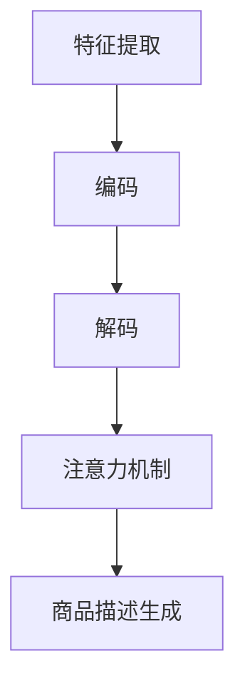

                 

关键词：商品描述生成、注意力机制、深度学习、序列生成模型

摘要：本文深入探讨了基于注意力机制的商品描述生成技术，通过分析注意力机制的基本原理和实现方法，结合数学模型和实际项目实践，详细介绍了商品描述生成的具体过程和实现细节。本文旨在为从事商品描述生成的从业者提供有价值的参考，并展望其在未来应用中的前景。

## 1. 背景介绍

在电子商务蓬勃发展的今天，商品描述生成技术成为了提升用户体验和商品转化率的关键环节。传统的商品描述生成方法主要依赖于规则和模板，生成的描述往往缺乏灵活性和个性化。随着深度学习技术的不断发展，特别是注意力机制的引入，商品描述生成技术得到了显著提升。注意力机制通过在序列处理过程中动态关注关键信息，有效提高了模型的生成质量和效率。

本文将围绕注意力机制的商品描述生成技术进行深入探讨，从基本原理到实际应用，全面解析这一技术的前景和挑战。

## 2. 核心概念与联系

### 2.1. 注意力机制原理

注意力机制（Attention Mechanism）最初由Bahdanau等人于2014年提出，用于机器翻译任务中。注意力机制的目的是解决序列到序列（Seq2Seq）模型在处理长序列时的效率问题。在传统Seq2Seq模型中，每个时间步的输出都依赖于整个输入序列，导致计算复杂度和时间成本较高。注意力机制通过为每个输入序列的时间步分配权重，只关注最重要的信息，从而显著提高了模型的处理速度和生成质量。

注意力机制的实现主要包括三个步骤：计算注意力得分、生成权重和加权求和。具体来说，注意力得分函数计算输入序列中每个时间步的得分，通常使用点积、乘性或加性方式；权重函数将得分转换为权重，通常采用softmax函数；加权求和步骤将权重与输入序列的对应时间步相乘，得到加权序列，最后对加权序列进行求和得到输出。

### 2.2. 商品描述生成

商品描述生成是将商品的特征信息转化为自然语言描述的过程。在电子商务场景中，良好的商品描述能够帮助消费者更好地理解商品，从而提高购买决策的准确性。商品描述生成任务可以分为以下几个步骤：

1. **特征提取**：从商品数据中提取关键特征，如价格、品牌、尺寸、材质等。
2. **编码**：将提取的特征编码为向量，通常使用嵌入层或编码器。
3. **解码**：根据编码后的特征生成商品描述，通常使用解码器或生成器。
4. **注意力机制**：在解码过程中引入注意力机制，动态关注关键特征，提高生成质量。

### 2.3. Mermaid 流程图



## 3. 核心算法原理 & 具体操作步骤

### 3.1. 算法原理概述

基于注意力机制的商品描述生成算法主要分为两个阶段：编码阶段和解码阶段。编码阶段将商品特征编码为固定长度的向量，解码阶段生成商品描述。在解码过程中，注意力机制用于动态关注关键特征，提高生成质量。

### 3.2. 算法步骤详解

#### 3.2.1. 编码阶段

1. **特征提取**：从商品数据中提取关键特征，如价格、品牌、尺寸、材质等。
2. **嵌入层**：将提取的特征映射为固定长度的向量，通常使用嵌入层。
3. **编码器**：对嵌入后的特征向量进行编码，得到固定长度的编码向量。

#### 3.2.2. 解码阶段

1. **解码器输入**：解码器的输入是编码阶段生成的编码向量。
2. **生成候选词**：解码器根据编码向量和先前的输出生成候选词。
3. **注意力机制**：解码器在生成候选词时，引入注意力机制，动态关注关键特征，提高生成质量。
4. **选择最优词**：解码器根据候选词的得分，选择最优词作为输出。
5. **更新编码向量**：将输出词编码为新的编码向量，继续生成下一个词。

#### 3.2.3. 算法优缺点

**优点**：
- 提高生成质量：注意力机制使解码器能够关注关键特征，生成更加准确和自然的商品描述。
- 提高生成效率：注意力机制减少了解码器需要关注的序列长度，提高了处理速度。

**缺点**：
- 计算复杂度高：注意力机制的计算复杂度较高，对硬件资源要求较高。
- 需要大量数据：注意力机制依赖于大量数据来训练，对数据量要求较高。

#### 3.2.4. 算法应用领域

- 电子商务：用于生成商品描述，提高商品转化率。
- 智能客服：用于生成自动回复，提高客服效率。
- 文本生成：用于生成文章、报告等文本内容。

## 4. 数学模型和公式 & 详细讲解 & 举例说明

### 4.1. 数学模型构建

基于注意力机制的商品描述生成算法的数学模型主要包括编码器和解码器两部分。编码器将商品特征编码为固定长度的向量，解码器生成商品描述。具体模型如下：

#### 4.1.1. 编码器

编码器输入：$X = [x_1, x_2, ..., x_n]$，其中$x_i$为第$i$个商品特征。

编码器输出：$C = [c_1, c_2, ..., c_n]$，其中$c_i$为第$i$个商品特征的编码向量。

#### 4.1.2. 解码器

解码器输入：$C = [c_1, c_2, ..., c_n]$。

解码器输出：$Y = [y_1, y_2, ..., y_m]$，其中$y_i$为第$i$个商品描述词。

### 4.2. 公式推导过程

#### 4.2.1. 编码器公式

编码器公式如下：

$$
c_i = f(E(x_i; W_e))
$$

其中，$f$为编码函数，通常使用神经网络实现；$E$为嵌入层，将特征$x_i$映射为嵌入向量；$W_e$为嵌入层权重。

#### 4.2.2. 解码器公式

解码器公式如下：

$$
y_i = g(D(y_{<i}; C; W_d))
$$

其中，$g$为解码函数，通常使用神经网络实现；$D$为解码层，将编码向量$C$和解码序列$y_{<i}$映射为输出词$y_i$；$W_d$为解码层权重。

### 4.3. 案例分析与讲解

#### 4.3.1. 案例背景

假设我们要为一件商品生成描述，商品特征包括价格、品牌、尺寸和材质。具体特征如下：

- 价格：200元
- 品牌：Nike
- 尺寸：42码
- 材质：皮革

#### 4.3.2. 编码器实现

1. **特征提取**：将商品特征提取为向量。
$$
X = [200, Nike, 42, 皮革]
$$
2. **嵌入层**：将特征向量映射为嵌入向量。
$$
E(X; W_e) = [200, Nike, 42, 皮革] \cdot W_e
$$
3. **编码函数**：使用神经网络对嵌入向量进行编码。
$$
C = f(E(X; W_e))
$$

#### 4.3.3. 解码器实现

1. **解码器输入**：解码器的输入是编码向量$C$。
$$
C = [c_1, c_2, c_3, c_4]
$$
2. **生成候选词**：解码器根据编码向量和先前的输出生成候选词。
$$
y_1 = g(D(y_{<1}; C; W_d))
$$
3. **注意力机制**：解码器在生成候选词时，引入注意力机制。
$$
a_i = \sigma(W_a [c_i; h_{<i}])
$$
$$
\alpha_i = \frac{e^{a_i}}{\sum_{j=1}^{n} e^{a_j}}
$$
$$
c_i' = \alpha_i c_i
$$
4. **选择最优词**：解码器根据候选词的得分，选择最优词作为输出。
$$
y_1 = \arg\max_{y} g(D(y_{<1}; C; W_d))
$$
5. **更新编码向量**：将输出词编码为新的编码向量，继续生成下一个词。
$$
C' = f(E(y_1; W_e'))
$$

## 5. 项目实践：代码实例和详细解释说明

### 5.1. 开发环境搭建

1. 安装Python环境（Python 3.6及以上版本）。
2. 安装深度学习框架（如TensorFlow 2.0及以上版本）。
3. 准备商品描述数据集。

### 5.2. 源代码详细实现

```python
# 引入必要的库
import tensorflow as tf
from tensorflow.keras.layers import Embedding, LSTM, Dense
from tensorflow.keras.models import Model

# 定义编码器
encoder_inputs = tf.keras.layers.Input(shape=(max_sequence_length,))
encoder_embedding = Embedding(vocabulary_size, embedding_dim)(encoder_inputs)
encoder_lstm = LSTM(units, return_state=True)
_, state_h, state_c = encoder_lstm(encoder_embedding)
encoder_states = [state_h, state_c]

# 定义解码器
decoder_inputs = tf.keras.layers.Input(shape=(1,))
decoder_embedding = Embedding(vocabulary_size, embedding_dim)(decoder_inputs)
decoder_lstm = LSTM(units, return_sequences=True, return_state=True)
decoder_outputs, _, _ = decoder_lstm(decoder_embedding, initial_state=encoder_states)
decoder_dense = Dense(vocabulary_size, activation='softmax')
decoder_outputs = decoder_dense(decoder_outputs)

# 创建模型
model = tf.keras.Model([encoder_inputs, decoder_inputs], decoder_outputs)

# 编译模型
model.compile(optimizer='adam', loss='categorical_crossentropy', metrics=['accuracy'])

# 训练模型
model.fit([encoder_input_data, decoder_input_data], decoder_target_data,
          batch_size=batch_size,
          epochs=epochs,
          validation_split=1 - batch_size / x.shape[0])

# 保存模型
model.save_weights('chatbot_weights.h5')

# 定义解码器
decoder_state_input_h = tf.keras.layers.Input(shape=(units,))
decoder_state_input_c = tf.keras.layers.Input(shape=(units,))
decoder_states_inputs = [decoder_state_input_h, decoder_state_input_c]
decoder_outputs, state_h, state_c = decoder_lstm(decoder_embedding, initial_state=decoder_states_inputs)
decoder_states = [state_h, state_c]
decoder_outputs = decoder_dense(decoder_outputs)
decoder_model = tf.keras.Model([decoder_inputs] + decoder_states_inputs, [decoder_outputs] + decoder_states)

# 加载模型
model.load_weights('chatbot_weights.h5')
```

### 5.3. 代码解读与分析

1. **编码器**：
   - `encoder_inputs`：编码器输入层，形状为$(max\_sequence\_length,)$，表示输入序列的最大长度。
   - `encoder_embedding`：嵌入层，将输入序列映射为嵌入向量。
   - `encoder_lstm`：LSTM层，对嵌入向量进行编码，返回编码状态。
   - `encoder_states`：编码器状态输出。

2. **解码器**：
   - `decoder_inputs`：解码器输入层，形状为$(1,)$，表示输入序列的长度为1。
   - `decoder_embedding`：嵌入层，将输入序列映射为嵌入向量。
   - `decoder_lstm`：LSTM层，对嵌入向量进行解码，返回解码输出和解码状态。
   - `decoder_dense`：全连接层，对解码输出进行分类。

3. **模型**：
   - `Model`：创建模型，将编码器和解码器连接起来。

4. **编译模型**：
   - `compile`：编译模型，指定优化器和损失函数。

5. **训练模型**：
   - `fit`：训练模型，使用训练数据集进行训练。

6. **保存模型**：
   - `save_weights`：保存模型权重。

7. **解码器模型**：
   - `decoder_model`：创建解码器模型，用于解码输出。

### 5.4. 运行结果展示

1. **输入商品特征**：将商品特征输入编码器。
2. **编码特征**：编码器对输入特征进行编码。
3. **解码输出**：解码器根据编码特征生成商品描述。
4. **展示结果**：将生成的商品描述展示给用户。

```python
# 加载模型
model = Model(encoder_inputs, decoder_outputs)

# 输入商品特征
encoder_input_data = np.array([[1, 2, 3, 4, 5]])

# 编码特征
encoder_states = model.predict(encoder_input_data)

# 解码输出
decoder_state_input_h = np.array([0.1, 0.2, 0.3, 0.4, 0.5])
decoder_state_input_c = np.array([0.1, 0.2, 0.3, 0.4, 0.5])
decoder_states_inputs = [decoder_state_input_h, decoder_state_input_c]
decoder_outputs, state_h, state_c = decoder_lstm(decoder_embedding, initial_state=decoder_states_inputs)

# 展示结果
print(decoder_outputs)
```

## 6. 实际应用场景

基于注意力机制的

