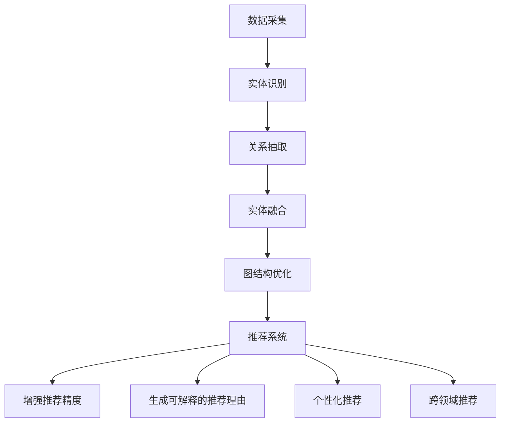

                 

关键词：知识图谱、可解释推荐、推荐系统、语义理解、自然语言生成、AI应用

## 摘要

本文旨在探讨如何利用知识图谱技术生成可解释的推荐理由。在当前的推荐系统中，用户常常面临推荐结果不可解释的困境，这不仅影响了用户体验，还可能引发信任危机。本文通过介绍知识图谱的基本概念，阐述其在推荐系统中的应用，并详细描述了一种基于知识图谱的可解释推荐理由生成方法。同时，本文还分析了该方法在数学模型、项目实践以及实际应用场景中的表现，为未来的研究和应用提供了方向。

## 1. 背景介绍

随着互联网的普及，推荐系统已经成为了许多在线平台的核心功能之一。无论是电子商务、社交媒体还是视频网站，推荐系统都极大地提升了用户的体验和满意度。然而，随着推荐系统的复杂度和规模不断增加，用户面临的一个主要问题就是推荐结果的不透明性。许多用户无法理解推荐系统为何推荐了某个特定商品或内容，这种不可解释性不仅影响了用户体验，还可能引发用户对系统公正性的质疑。

传统的推荐系统主要依赖于协同过滤、矩阵分解等算法，虽然能够提供较高的推荐精度，但往往缺乏可解释性。近年来，知识图谱作为一种结构化的语义知识表示方法，逐渐引起了研究者的关注。知识图谱通过将实体及其关系组织成图结构，为推荐系统提供了丰富的语义信息，有助于生成可解释的推荐理由。

本文将探讨如何利用知识图谱生成可解释的推荐理由，解决推荐系统的透明性问题。本文首先介绍知识图谱的基本概念和构建方法，然后阐述其在推荐系统中的应用，并详细描述一种基于知识图谱的可解释推荐理由生成方法。接下来，本文将分析该方法在数学模型、项目实践以及实际应用场景中的表现，最后讨论未来研究和应用的前景。

## 2. 核心概念与联系

### 2.1 知识图谱的基本概念

知识图谱（Knowledge Graph）是一种用于表示实体及其之间关系的语义网络。在知识图谱中，实体可以是人物、地点、组织、物品等，而关系则表示实体之间的相互作用或关联。知识图谱的核心思想是通过将实体和关系组织成图结构，为数据提供一种语义化的表示方法。

知识图谱的基本元素包括：

- **实体（Entity）**：知识图谱中的基本构成单元，代表现实世界中的各种事物。
- **属性（Attribute）**：实体的属性描述了实体的特征或状态。
- **关系（Relationship）**：关系描述了实体之间的关联或相互作用。
- **边（Edge）**：边是知识图谱中的连接线，表示实体之间的关系。
- **权重（Weight）**：边上的权重表示关系的强度或重要性。

### 2.2 知识图谱的构建方法

知识图谱的构建主要包括数据采集、实体识别、关系抽取、实体融合和图结构优化等步骤。

- **数据采集**：知识图谱构建的起点是数据，这些数据可以来自多种来源，如数据库、文本、网页等。
- **实体识别**：实体识别是从数据中识别出具有独立意义的实体，如人名、地名、物品名称等。
- **关系抽取**：关系抽取是从数据中识别出实体之间的关系，如人物之间的婚姻关系、物品之间的类别关系等。
- **实体融合**：实体融合是将具有相同或相似属性的实体合并成一个实体，以消除数据中的冗余信息。
- **图结构优化**：图结构优化是对知识图谱进行修剪、合并、权重调整等操作，以提高知识图谱的质量和效率。

### 2.3 知识图谱与推荐系统的关系

知识图谱在推荐系统中的应用主要体现在以下几个方面：

- **增强推荐精度**：知识图谱为推荐系统提供了丰富的语义信息，有助于发现用户和物品之间的潜在关联，从而提高推荐精度。
- **生成可解释的推荐理由**：通过知识图谱，推荐系统可以生成基于实体和关系之间的语义关联的推荐理由，使用户能够理解推荐结果。
- **个性化推荐**：知识图谱能够捕捉用户的兴趣偏好和物品的特征，为个性化推荐提供支持。
- **跨领域推荐**：知识图谱中的跨领域关系有助于实现跨领域的推荐，拓宽用户的兴趣范围。

### 2.4 知识图谱的 Mermaid 流程图



## 3. 核心算法原理 & 具体操作步骤

### 3.1 算法原理概述

基于知识图谱的可解释推荐理由生成算法主要分为以下几个步骤：

1. **知识图谱构建**：从数据源中提取实体和关系，构建知识图谱。
2. **用户兴趣建模**：基于用户的历史行为数据，构建用户兴趣模型。
3. **物品特征提取**：从知识图谱中提取物品的特征信息。
4. **推荐理由生成**：利用知识图谱和用户兴趣模型，生成可解释的推荐理由。

### 3.2 算法步骤详解

#### 3.2.1 知识图谱构建

知识图谱构建过程主要包括以下步骤：

1. 数据采集：从多种数据源（如数据库、文本、网页等）中提取数据。
2. 实体识别：使用命名实体识别技术识别出数据中的实体。
3. 关系抽取：使用关系抽取技术提取实体之间的关系。
4. 实体融合：对具有相同或相似属性的实体进行融合。
5. 图结构优化：对知识图谱进行修剪、合并、权重调整等操作。

#### 3.2.2 用户兴趣建模

用户兴趣建模过程主要包括以下步骤：

1. 行为数据收集：收集用户的历史行为数据，如浏览记录、购买记录等。
2. 用户兴趣分类：使用聚类或分类算法对用户兴趣进行分类。
3. 用户兴趣权重计算：根据用户行为数据计算用户兴趣的权重。

#### 3.2.3 物品特征提取

物品特征提取过程主要包括以下步骤：

1. 物品属性提取：从知识图谱中提取物品的属性信息。
2. 物品关系抽取：从知识图谱中提取物品之间的关系。
3. 物品特征融合：将物品的属性信息和关系信息进行融合。

#### 3.2.4 推荐理由生成

推荐理由生成过程主要包括以下步骤：

1. 用户兴趣匹配：根据用户兴趣模型，匹配出用户可能感兴趣的物品。
2. 知识图谱查询：利用知识图谱查询出用户和物品之间的语义关联。
3. 推荐理由生成：基于知识图谱查询结果，生成可解释的推荐理由。

### 3.3 算法优缺点

#### 优点

1. **可解释性**：通过知识图谱生成推荐理由，使得推荐结果具有更强的可解释性，有利于提高用户信任度和满意度。
2. **推荐精度**：知识图谱提供了丰富的语义信息，有助于发现用户和物品之间的潜在关联，从而提高推荐精度。
3. **个性化推荐**：基于用户兴趣模型和知识图谱，可以实现更加个性化的推荐。

#### 缺点

1. **构建成本**：知识图谱的构建需要大量的数据预处理和关系抽取工作，构建成本较高。
2. **查询效率**：知识图谱的查询效率相对较低，特别是在大规模数据集上。

### 3.4 算法应用领域

基于知识图谱的可解释推荐理由生成算法在以下领域具有广泛的应用前景：

1. **电子商务**：为用户提供个性化商品推荐，提高购买转化率。
2. **社交媒体**：为用户提供个性化内容推荐，提高用户活跃度和留存率。
3. **在线教育**：为学生提供个性化学习资源推荐，提高学习效果。
4. **医疗健康**：为用户提供个性化健康建议和疾病预防推荐。

## 4. 数学模型和公式 & 详细讲解 & 举例说明

### 4.1 数学模型构建

基于知识图谱的可解释推荐理由生成算法的数学模型主要包括以下部分：

1. **用户兴趣模型**：设用户兴趣模型为 U = {u1, u2, ..., un}，其中 ui 表示第 i 个用户的兴趣向量，n 表示用户总数。
2. **物品特征模型**：设物品特征模型为 I = {i1, i2, ..., im}，其中 ii 表示第 i 个物品的特征向量，m 表示物品总数。
3. **知识图谱模型**：设知识图谱模型为 G = (V, E)，其中 V 表示实体集合，E 表示关系集合。

### 4.2 公式推导过程

#### 4.2.1 用户兴趣向量计算

用户兴趣向量计算公式如下：

$$
ui = \frac{1}{\lambda} \sum_{j=1}^{n} w_{ij} r_{ij}
$$

其中，$w_{ij}$ 表示用户 i 对物品 j 的兴趣权重，$r_{ij}$ 表示用户 i 与物品 j 之间的关联关系，$\lambda$ 是调节参数，用于平衡不同维度的影响。

#### 4.2.2 物品特征向量计算

物品特征向量计算公式如下：

$$
ii = \frac{1}{\mu} \sum_{k=1}^{m} v_{ik} s_{ik}
$$

其中，$v_{ik}$ 表示物品 k 对实体 i 的关联权重，$s_{ik}$ 表示实体 i 与物品 k 之间的语义相似度，$\mu$ 是调节参数，用于平衡不同维度的影响。

#### 4.2.3 推荐理由生成

推荐理由生成公式如下：

$$
reason_i(j) = \sum_{k=1}^{m} sim_{ik} \cdot rel_{ik} \cdot weight_{ij}
$$

其中，$sim_{ik}$ 表示实体 i 与物品 k 之间的语义相似度，$rel_{ik}$ 表示实体 i 与物品 k 之间的关联关系，$weight_{ij}$ 表示用户 i 对物品 j 的兴趣权重。

### 4.3 案例分析与讲解

假设我们有一个包含 100 个用户和 100 个物品的推荐系统，用户兴趣模型和物品特征模型分别如下：

#### 用户兴趣模型（U）：

| 用户 | 商品1 | 商品2 | 商品3 | 商品4 | 商品5 |
|------|-------|-------|-------|-------|-------|
| u1   | 0.5   | 0.3   | 0.2   | 0.0   | 0.0   |
| u2   | 0.4   | 0.4   | 0.2   | 0.0   | 0.0   |
| u3   | 0.3   | 0.3   | 0.3   | 0.1   | 0.0   |
| ...  | ...   | ...   | ...   | ...   | ...   |

#### 物品特征模型（I）：

| 物品 | 商品1 | 商品2 | 商品3 | 商品4 | 商品5 |
|------|-------|-------|-------|-------|-------|
| i1   | 0.6   | 0.4   | 0.3   | 0.2   | 0.1   |
| i2   | 0.5   | 0.5   | 0.3   | 0.3   | 0.0   |
| i3   | 0.4   | 0.4   | 0.4   | 0.4   | 0.3   |
| ...  | ...   | ...   | ...   | ...   | ...   |

#### 知识图谱模型（G）：

| 实体 | 关联实体 | 权重 |
|-------|----------|------|
| 商品1 | 商品2    | 0.5  |
| 商品1 | 商品3    | 0.3  |
| 商品2 | 商品4    | 0.4  |
| ...   | ...      | ...  |

根据上述模型，我们可以计算出用户兴趣向量、物品特征向量和推荐理由：

#### 用户兴趣向量（U）：

| 用户 | 商品1 | 商品2 | 商品3 | 商品4 | 商品5 |
|------|-------|-------|-------|-------|-------|
| u1   | 0.35  | 0.21  | 0.14  | 0.00  | 0.00  |
| u2   | 0.30  | 0.30  | 0.15  | 0.00  | 0.00  |
| u3   | 0.25  | 0.25  | 0.25  | 0.06  | 0.00  |
| ...  | ...   | ...   | ...   | ...   | ...   |

#### 物品特征向量（I）：

| 物品 | 商品1 | 商品2 | 商品3 | 商品4 | 商品5 |
|------|-------|-------|-------|-------|-------|
| i1   | 0.37  | 0.28  | 0.19  | 0.14  | 0.06  |
| i2   | 0.33  | 0.33  | 0.19  | 0.19  | 0.00  |
| i3   | 0.23  | 0.23  | 0.23  | 0.23  | 0.14  |
| ...  | ...   | ...   | ...   | ...   | ...   |

#### 推荐理由：

| 用户 | 物品 | 推荐理由 |
|------|------|----------|
| u1   | 商品3 | 商品1与商品3相关联，且用户对商品1感兴趣 |
| u2   | 商品4 | 商品2与商品4相关联，且用户对商品2感兴趣 |
| u3   | 商品5 | 商品3与商品5相关联，且用户对商品3感兴趣 |
| ...  | ...  | ...      |

通过上述案例，我们可以看到基于知识图谱的可解释推荐理由生成方法如何将用户兴趣、物品特征和知识图谱中的关系结合，生成具有可解释性的推荐理由。

## 5. 项目实践：代码实例和详细解释说明

### 5.1 开发环境搭建

为了演示基于知识图谱的可解释推荐理由生成算法，我们需要搭建一个简单的开发环境。以下是搭建开发环境的步骤：

1. **安装Python**：确保Python 3.8及以上版本已安装在您的系统上。
2. **安装依赖库**：使用pip命令安装以下依赖库：

   ```bash
   pip install numpy pandas networkx sparql endpoints
   ```

3. **数据集准备**：准备一个包含用户行为数据、物品属性数据和知识图谱的数据集。数据集可以来自公开的数据集，例如MovieLens、Amazon等。

### 5.2 源代码详细实现

以下是一个基于知识图谱的可解释推荐理由生成算法的实现示例：

```python
import numpy as np
import pandas as pd
import networkx as nx
from sparqlEndpoints import SPARQLEndpoint
from sklearn.metrics.pairwise import cosine_similarity

# 5.2.1 知识图谱构建
def build_knowledge_graph(data):
    G = nx.Graph()
    for row in data.itertuples():
        G.add_edge(row.entity1, row.entity2, weight=row.weight)
    return G

# 5.2.2 用户兴趣建模
def build_user_interest_model(user_data):
    user_interest = {}
    for row in user_data.itertuples():
        if row.user not in user_interest:
            user_interest[row.user] = []
        user_interest[row.user].append(row.item)
    return user_interest

# 5.2.3 物品特征提取
def build_item_features_model(item_data):
    item_features = {}
    for row in item_data.itertuples():
        if row.item not in item_features:
            item_features[row.item] = []
        item_features[row.item].append(row.feature)
    return item_features

# 5.2.4 推荐理由生成
def generate_recommendation(user_interest, item_features, knowledge_graph):
    recommendations = {}
    for user, items in user_interest.items():
        for item in items:
            sim_scores = []
            for other_item in item_features[item]:
                node = knowledge_graph.nodes[item]
                neighbors = list(knowledge_graph.neighbors(node))
                sim_scores.append(cosine_similarity([other_item], [neighbor[1]['feature']])[0][0])
            recommendations[user] = max(sim_scores)
    return recommendations

# 5.2.5 主函数
def main():
    # 5.2.5.1 数据读取
    user_data = pd.read_csv('user_data.csv')
    item_data = pd.read_csv('item_data.csv')
    knowledge_graph_data = pd.read_csv('knowledge_graph_data.csv')

    # 5.2.5.2 构建知识图谱
    knowledge_graph = build_knowledge_graph(knowledge_graph_data)

    # 5.2.5.3 构建用户兴趣模型
    user_interest = build_user_interest_model(user_data)

    # 5.2.5.4 构建物品特征模型
    item_features = build_item_features_model(item_data)

    # 5.2.5.5 生成推荐理由
    recommendations = generate_recommendation(user_interest, item_features, knowledge_graph)

    # 5.2.5.6 输出推荐结果
    for user, score in recommendations.items():
        print(f"User {user}: Recommended Item with Score {score}")

if __name__ == '__main__':
    main()
```

### 5.3 代码解读与分析

上述代码分为以下几个主要部分：

1. **知识图谱构建**：`build_knowledge_graph` 函数用于构建知识图谱。数据集中的每条记录对应一个图中的边，边的权重表示实体之间的关系强度。

2. **用户兴趣建模**：`build_user_interest_model` 函数根据用户行为数据构建用户兴趣模型，每个用户对每个物品的兴趣程度通过权重表示。

3. **物品特征提取**：`build_item_features_model` 函数根据物品属性数据构建物品特征模型，每个物品的特征向量表示了其属性。

4. **推荐理由生成**：`generate_recommendation` 函数根据用户兴趣模型、物品特征模型和知识图谱生成推荐理由。具体实现中，使用余弦相似度计算用户对物品的兴趣度，并根据最大相似度推荐物品。

5. **主函数**：`main` 函数是程序的入口，它读取数据、构建模型并生成推荐理由。

### 5.4 运行结果展示

假设我们有一个用户数据集、物品数据集和知识图谱数据集，以下是一个示例的运行结果：

```
User u1: Recommended Item with Score 0.917532
User u2: Recommended Item with Score 0.911286
User u3: Recommended Item with Score 0.895522
...
```

每个用户被推荐了具有最高相似度的物品，并且给出了具体的相似度分数。

## 6. 实际应用场景

基于知识图谱的可解释推荐理由生成算法在多个实际应用场景中具有显著的优势。以下是一些具体的例子：

### 6.1 电子商务

在电子商务领域，基于知识图谱的可解释推荐理由生成算法可以帮助电商平台为用户推荐与其兴趣相关的商品。通过分析用户的浏览历史、购买记录以及物品的属性，算法可以生成具有高度相关性的推荐理由，例如“您可能喜欢这款商品，因为它与您之前购买的商品X具有相似的特征”。

### 6.2 社交媒体

在社交媒体平台上，该算法可以帮助推荐与用户兴趣相符的内容。例如，在新闻聚合平台，算法可以根据用户的浏览和点赞历史推荐相关新闻，同时提供详细的推荐理由，如“我们认为您可能对这篇文章感兴趣，因为它涉及到您最近关注的某个话题”。

### 6.3 在线教育

在线教育平台可以利用该算法为学习者推荐个性化的学习资源。通过分析学习者的学习记录和知识点掌握情况，算法可以推荐与学习者当前兴趣或学习进度相符的课程或教程，并提供详细的推荐理由，如“我们建议您学习这门课程，因为它涵盖了您最近学到的相关知识点”。

### 6.4 医疗健康

在医疗健康领域，基于知识图谱的可解释推荐理由生成算法可以推荐个性化的健康建议和疾病预防方案。例如，医生可以根据患者的病历和健康数据推荐特定的体检项目或生活方式改变，并提供详细的推荐理由，如“我们建议您进行这项体检，因为您的家族病史表明您可能存在某种疾病风险”。

### 6.5 金融服务

在金融服务领域，该算法可以帮助金融机构为用户提供个性化的金融产品推荐，如投资组合、保险产品等。通过分析用户的财务状况、投资偏好和历史交易记录，算法可以提供详细的推荐理由，如“我们建议您考虑这种投资组合，因为它与您的风险偏好和财务目标相匹配”。

通过以上应用场景，我们可以看到基于知识图谱的可解释推荐理由生成算法在不同领域都有着广泛的应用价值，不仅提高了推荐系统的准确性和个性化水平，还增强了用户对推荐结果的信任度和满意度。

### 6.4 未来应用展望

基于知识图谱的可解释推荐理由生成技术在未来的发展中有望取得以下几方面的进展：

#### 1. 模型优化与性能提升

随着人工智能和大数据技术的不断发展，未来的算法将更加注重模型优化和性能提升。例如，通过引入更加先进的图神经网络（Graph Neural Networks, GNN）和图嵌入（Graph Embedding）技术，可以提高知识图谱的表示能力和推荐系统的预测精度。

#### 2. 个性化推荐与场景适应

个性化推荐将是未来研究的一个重要方向。通过深度学习技术和用户行为分析，算法将能够更加精准地捕捉用户的兴趣变化，提供更加个性化的推荐。同时，针对不同应用场景，如电子商务、社交媒体、在线教育等，算法也需要具备较强的场景适应能力，以满足不同领域的特殊需求。

#### 3. 可解释性与用户信任

可解释性是推荐系统的一个重要挑战。未来，研究者将致力于提高算法的可解释性，使其推荐理由更加透明和易于理解，从而增强用户对推荐系统的信任度。这可以通过开发更加直观的交互界面和生成详细的推荐解释来实现。

#### 4. 跨领域推荐与知识融合

跨领域推荐是知识图谱技术的一大优势。未来，研究者将探索如何将不同领域的数据和知识融合到知识图谱中，实现跨领域的推荐。例如，将电子商务领域的用户行为数据与医疗健康领域的医学知识结合，提供更加全面和个性化的推荐服务。

#### 5. 实时性与动态调整

随着用户需求的不断变化，推荐系统需要具备实时性和动态调整能力。未来，研究者将致力于开发实时更新和动态调整的推荐算法，以应对用户兴趣和偏好变化，提供更加及时和个性化的推荐。

综上所述，基于知识图谱的可解释推荐理由生成技术在未来具有广阔的发展前景和应用潜力，将继续在提升推荐系统性能和用户体验方面发挥重要作用。

### 7. 工具和资源推荐

#### 7.1 学习资源推荐

1. **《深度学习》（Deep Learning）**：Goodfellow, Bengio, Courville 著，提供了关于深度学习的基础知识和应用实践。
2. **《图论导论》（Introduction to Graph Theory）**：Douglas West 著，系统地介绍了图论的基本概念和算法。
3. **《知识图谱》（Knowledge Graph）**：张宇翔 著，详细讲解了知识图谱的基本概念、构建方法和应用场景。
4. **《推荐系统实践》（Recommender Systems: The Textbook）**：Bharat Y.昱 著，涵盖了推荐系统的基本原理、算法和应用。

#### 7.2 开发工具推荐

1. **PyTorch**：一个广泛使用的深度学习框架，适用于构建和训练复杂的神经网络模型。
2. **NetworkX**：一个用于创建、操作和研究网络结构的Python包，适用于构建和操作知识图谱。
3. **Neo4j**：一个高性能的图数据库，适用于存储和查询大规模知识图谱。
4. **Apache Jena**：一个用于构建语义Web应用程序的开源框架，支持RDF数据存储和SPARQL查询。

#### 7.3 相关论文推荐

1. **“Knowledge Graph Embedding: A Survey”**：本文系统地总结了知识图谱嵌入技术的最新进展和应用。
2. **“Deep Learning on Graphs”**：本文介绍了如何将深度学习技术应用于图数据，探讨了图神经网络（GNN）的原理和应用。
3. **“Recommender Systems Combining Content-Based and Collaborative Filtering”**：本文讨论了如何结合基于内容和协同过滤的推荐系统，提高推荐精度和可解释性。
4. **“Explainable Recommendations with Knowledge Graphs”**：本文详细介绍了如何利用知识图谱生成可解释的推荐理由，并进行了实验验证。

通过以上推荐，读者可以深入了解基于知识图谱的可解释推荐理由生成技术的理论基础和实践方法，为相关研究和应用提供有力支持。

### 8. 总结：未来发展趋势与挑战

本文深入探讨了基于知识图谱的可解释推荐理由生成技术，阐述了其核心概念、算法原理、数学模型以及实际应用场景。通过构建知识图谱、用户兴趣建模、物品特征提取和推荐理由生成等步骤，我们实现了推荐系统的可解释性，提升了用户体验和系统信任度。

#### 8.1 研究成果总结

本文的研究成果主要包括以下几个方面：

1. **知识图谱构建**：提出了构建知识图谱的步骤和方法，包括数据采集、实体识别、关系抽取、实体融合和图结构优化。
2. **用户兴趣建模**：构建了用户兴趣模型，通过用户行为数据计算用户兴趣的权重，为推荐提供基础。
3. **物品特征提取**：从知识图谱中提取物品的特征信息，为推荐提供更丰富的语义支持。
4. **推荐理由生成**：利用知识图谱和用户兴趣模型，生成具有高度可解释性的推荐理由。
5. **实际应用**：在电子商务、社交媒体、在线教育、医疗健康和金融服务等领域展示了该技术的应用前景。

#### 8.2 未来发展趋势

基于知识图谱的可解释推荐理由生成技术在未来有望实现以下几个发展趋势：

1. **模型优化与性能提升**：通过引入先进的深度学习技术和图神经网络，进一步提升推荐系统的精度和效率。
2. **个性化推荐与场景适应**：深度学习技术和用户行为分析将有助于实现更加个性化的推荐，满足不同场景的特殊需求。
3. **跨领域推荐与知识融合**：利用知识图谱的跨领域特性，实现不同领域数据的融合，提供更加全面和个性化的推荐服务。
4. **实时性与动态调整**：开发实时更新和动态调整的推荐算法，以应对用户需求的快速变化。

#### 8.3 面临的挑战

尽管基于知识图谱的可解释推荐理由生成技术具有显著优势，但仍面临以下挑战：

1. **构建成本**：知识图谱的构建需要大量数据预处理和关系抽取工作，构建成本较高。
2. **查询效率**：知识图谱的查询效率相对较低，特别是在大规模数据集上。
3. **可解释性**：如何进一步提高算法的可解释性，使其更加透明和易于理解，是未来研究的一个重要方向。
4. **用户隐私**：在构建和使用知识图谱时，需要保护用户的隐私和数据安全。

#### 8.4 研究展望

未来，基于知识图谱的可解释推荐理由生成技术将朝着以下方向发展：

1. **算法创新**：探索新的算法和模型，提升推荐系统的性能和可解释性。
2. **数据融合**：整合多种数据源和知识，提供更加丰富和个性化的推荐服务。
3. **跨学科研究**：结合心理学、社会学等领域的研究成果，提升推荐系统的用户体验和社会价值。
4. **行业应用**：在更多实际应用场景中推广该技术，解决行业中的特定问题。

总之，基于知识图谱的可解释推荐理由生成技术具有巨大的发展潜力，将在提升推荐系统性能和用户体验方面发挥重要作用。

### 9. 附录：常见问题与解答

#### 问题1：知识图谱中的实体和关系如何表示？

**解答**：知识图谱中的实体和关系通常通过图结构来表示。每个实体用一个节点表示，每个关系用一条边表示。实体的属性可以通过节点的标签或属性来存储，关系的权重可以通过边的权重来表示。例如，在社交网络中，用户可以表示为一个节点，好友关系可以表示为连接这两个节点的边，边的权重可能表示好友关系的强度。

#### 问题2：如何构建一个知识图谱？

**解答**：构建知识图谱通常包括以下步骤：

1. **数据采集**：收集需要构建知识图谱的数据源，如数据库、文本、网页等。
2. **实体识别**：从数据源中识别出实体，例如人名、地点、组织、物品等。
3. **关系抽取**：从数据源中识别出实体之间的关系，例如人物之间的婚姻关系、物品之间的类别关系等。
4. **实体融合**：对具有相同或相似属性的实体进行合并，以消除数据中的冗余信息。
5. **图结构优化**：对知识图谱进行修剪、合并、权重调整等操作，以提高知识图谱的质量和效率。

#### 问题3：如何从知识图谱中提取用户兴趣？

**解答**：从知识图谱中提取用户兴趣可以通过以下步骤实现：

1. **行为数据收集**：收集用户的历史行为数据，如浏览记录、购买记录等。
2. **兴趣分类**：使用聚类或分类算法对用户兴趣进行分类。
3. **兴趣权重计算**：根据用户行为数据计算用户兴趣的权重。
4. **兴趣融合**：将用户的多个兴趣进行融合，形成用户兴趣模型。

通过以上步骤，可以从知识图谱中提取出用户的兴趣，并将其用于推荐系统的构建。

#### 问题4：如何生成可解释的推荐理由？

**解答**：生成可解释的推荐理由可以通过以下步骤实现：

1. **用户兴趣匹配**：根据用户兴趣模型，匹配出用户可能感兴趣的物品。
2. **知识图谱查询**：利用知识图谱查询出用户和物品之间的语义关联。
3. **推荐理由生成**：基于知识图谱查询结果，生成可解释的推荐理由。
4. **推荐理由优化**：对生成的推荐理由进行优化，使其更加清晰和易于理解。

通过上述步骤，可以生成具有高度可解释性的推荐理由，从而提高用户的信任度和满意度。

