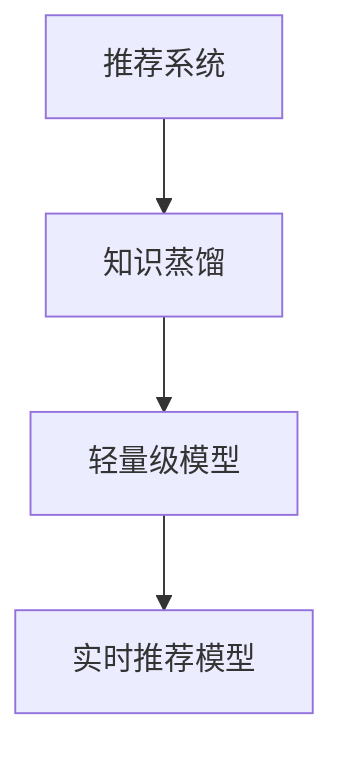

                 

在当今数据驱动的世界中，推荐系统已经成为许多应用程序和服务的重要组成部分。随着用户生成数据的爆炸性增长，实时推荐模型变得越来越重要。然而，传统的深度学习模型通常在训练和部署过程中需要大量的计算资源和时间，这对于许多实时系统来说是一个巨大的挑战。为了解决这个问题，本文将探讨一种基于知识蒸馏的轻量级实时推荐模型。

> **关键词：**知识蒸馏、轻量级模型、实时推荐、深度学习、模型压缩。

> **摘要：**本文首先介绍了推荐系统的背景和重要性，然后详细阐述了知识蒸馏的概念和原理。接着，我们介绍了一种基于知识蒸馏的轻量级实时推荐模型，并探讨了其核心算法原理和实现步骤。最后，我们通过实际应用案例和未来展望，展示了该模型在现实世界中的潜力。

## 1. 背景介绍

推荐系统（Recommender Systems）是一种用于预测用户可能感兴趣的项目（如商品、音乐、视频等）的技术。其目的是通过分析用户的历史行为和偏好，向用户提供个性化的推荐。随着互联网和电子商务的快速发展，推荐系统在许多领域（如电子商务、社交媒体、在线媒体等）取得了显著的成功。

然而，随着数据量的增加和用户需求的多样化，传统的推荐系统面临了一些挑战：

1. **计算资源需求高**：深度学习模型通常需要大量的计算资源和时间进行训练和部署。
2. **实时性要求高**：在许多应用场景中，如电商购物、社交媒体等，用户需要实时接收推荐。
3. **数据隐私问题**：用户数据的收集和使用需要遵循严格的隐私保护法规。

为了解决这些问题，研究人员提出了基于知识蒸馏的轻量级实时推荐模型。知识蒸馏是一种在源模型和目标模型之间传递知识的技术，可以帮助我们训练出轻量级且高效的目标模型。

## 2. 核心概念与联系

### 2.1 知识蒸馏

知识蒸馏（Knowledge Distillation）是一种训练模型的方法，其核心思想是将一个复杂的大型模型（称为“教师模型”）的知识传递给一个较小的模型（称为“学生模型”）。教师模型通常是一个经过充分训练的大型深度学习模型，而学生模型是一个较小的模型，其目的是通过学习教师模型的输出来实现相似的性能。

知识蒸馏的过程通常分为两个阶段：

1. **训练阶段**：在这个阶段，学生模型通过学习教师模型的输出来提高其预测能力。
2. **微调阶段**：在训练完成后，学生模型通过进一步的学习教师模型的输出来进行微调，以提高其性能。

### 2.2 轻量级模型

轻量级模型（Lite Models）是一种设计用于在资源受限的环境中运行的小型模型。这些模型通常具有较小的参数量和计算复杂度，但仍然能够保持较高的性能。

轻量级模型的应用场景包括：

1. **移动设备**：如智能手机和智能手表。
2. **物联网设备**：如智能家居设备和可穿戴设备。
3. **边缘计算**：在靠近数据源的地方进行计算，减少数据传输的成本。

### 2.3 实时推荐模型

实时推荐模型（Real-time Recommender Models）是一种能够快速响应用户请求并提供个性化推荐的模型。在实时系统中，推荐模型的响应时间通常需要在毫秒级别。

实时推荐模型的应用场景包括：

1. **在线购物**：用户在浏览商品时，系统能够实时推荐相关的商品。
2. **社交媒体**：用户在浏览内容时，系统能够实时推荐相关的帖子或视频。
3. **搜索引擎**：用户在输入查询时，系统能够实时推荐相关的搜索结果。

### 2.4 Mermaid 流程图

下面是一个用于描述知识蒸馏、轻量级模型和实时推荐模型之间关系的 Mermaid 流程图：



## 3. 核心算法原理 & 具体操作步骤

### 3.1 算法原理概述

基于知识蒸馏的轻量级实时推荐模型的原理可以概括为以下几个步骤：

1. **教师模型的训练**：首先，训练一个大型深度学习模型作为教师模型。这个模型需要经过充分的训练，以达到较高的性能。
2. **学生模型的初始化**：然后，初始化一个较小的模型作为学生模型。这个模型的结构通常与教师模型相似，但参数量更小。
3. **知识蒸馏训练**：在知识蒸馏训练阶段，学生模型通过学习教师模型的输出（即软标签）来提高其预测能力。这个过程通常通过以下公式实现：

   $$
   L_{distill} = -\frac{1}{N}\sum_{i=1}^{N}[\sigma(y_i^*)\log(y_i)] + \lambda \frac{1}{N}\sum_{i=1}^{N}||y_i - \hat{y}_i||_2^2
   $$

   其中，$y_i^*$是教师模型的输出，$\hat{y}_i$是学生模型的输出，$\sigma$是softmax函数，$\lambda$是权重系数。
4. **微调**：在知识蒸馏训练完成后，学生模型通过进一步的学习教师模型的输出进行微调。这个过程可以帮助学生模型进一步提高其性能。

### 3.2 算法步骤详解

1. **教师模型的训练**：
   - 选择一个大型深度学习模型作为教师模型，如CNN或RNN。
   - 使用大量的训练数据对教师模型进行训练，以达到较高的性能。
2. **学生模型的初始化**：
   - 根据教师模型的结构，初始化一个较小的模型作为学生模型。
   - 将学生模型的参数初始化为随机值。
3. **知识蒸馏训练**：
   - 在每个训练批次中，获取教师模型的输出$y_i^*$和学生模型的输出$\hat{y}_i$。
   - 计算损失函数$L_{distill}$，并使用反向传播算法进行优化。
   - 重复这个过程，直到达到预定的训练迭代次数或性能目标。
4. **微调**：
   - 在知识蒸馏训练完成后，将学生模型的参数设置为当前最优值。
   - 使用教师模型的输出进行进一步的微调，以进一步提高学生模型的性能。

### 3.3 算法优缺点

**优点**：

1. **高效性**：知识蒸馏训练可以快速地将教师模型的知识传递给学生模型，从而提高学生模型的性能。
2. **轻量级**：学生模型的参数量更小，可以在资源受限的环境中运行。
3. **实时性**：学生模型可以快速响应用户请求，提供实时推荐。

**缺点**：

1. **性能损失**：虽然学生模型可以保持较高的性能，但通常无法达到教师模型的全局最优性能。
2. **计算复杂度**：知识蒸馏训练需要大量的计算资源，尤其是在处理大量数据时。

### 3.4 算法应用领域

基于知识蒸馏的轻量级实时推荐模型可以应用于以下领域：

1. **电子商务**：为用户提供个性化的商品推荐。
2. **社交媒体**：为用户提供感兴趣的内容推荐。
3. **在线教育**：为学生提供个性化的课程推荐。
4. **医疗保健**：为患者提供个性化的医疗建议。

## 4. 数学模型和公式 & 详细讲解 & 举例说明

### 4.1 数学模型构建

基于知识蒸馏的轻量级实时推荐模型的数学模型可以表示为：

$$
L_{distill} = -\frac{1}{N}\sum_{i=1}^{N}[\sigma(y_i^*)\log(y_i)] + \lambda \frac{1}{N}\sum_{i=1}^{N}||y_i - \hat{y}_i||_2^2
$$

其中，$N$是训练批次的数量，$y_i^*$是教师模型的输出，$\hat{y}_i$是学生模型的输出，$\sigma$是softmax函数，$\lambda$是权重系数。

### 4.2 公式推导过程

知识蒸馏的训练过程可以分为以下几个步骤：

1. **获取教师模型的输出$y_i^*$**：在训练过程中，教师模型对每个输入数据进行预测，得到输出$y_i^*$。
2. **计算学生模型的输出$\hat{y}_i$**：学生模型对每个输入数据执行相同的预测操作，得到输出$\hat{y}_i$。
3. **计算损失函数$L_{distill}$**：根据教师模型的输出和学生模型的输出，计算损失函数$L_{distill}$。损失函数的目的是最小化学生模型输出和教师模型输出之间的差距。
4. **使用反向传播算法进行优化**：使用反向传播算法，根据损失函数计算梯度，并更新学生模型的参数。

### 4.3 案例分析与讲解

为了更好地理解知识蒸馏的数学模型，我们可以通过一个简单的例子来说明。

假设我们有两个模型：教师模型和学生模型。教师模型是一个具有1000个参数的神经网络，而学生模型是一个具有500个参数的神经网络。

在这个例子中，我们使用了一个简单的二分类任务。输入数据是一个100维的向量，输出是一个二值标签。

首先，我们使用教师模型对输入数据进行预测，得到输出$y_i^*$。然后，我们使用学生模型对相同的输入数据进行预测，得到输出$\hat{y}_i$。

接下来，我们计算损失函数$L_{distill}$。在这个例子中，我们使用交叉熵损失函数：

$$
L_{distill} = -\frac{1}{N}\sum_{i=1}^{N}[\sigma(y_i^*)\log(y_i)] + \lambda \frac{1}{N}\sum_{i=1}^{N}||y_i - \hat{y}_i||_2^2
$$

其中，$N$是训练批次的数量，$y_i^*$是教师模型的输出，$\hat{y}_i$是学生模型的输出，$\sigma$是softmax函数，$\lambda$是权重系数。

在这个例子中，我们假设$\lambda = 0.1$。然后，我们使用反向传播算法，根据损失函数计算梯度，并更新学生模型的参数。

通过重复这个过程，学生模型逐渐学习到教师模型的知识，并在预测任务中取得更好的性能。

## 5. 项目实践：代码实例和详细解释说明

### 5.1 开发环境搭建

为了实践基于知识蒸馏的轻量级实时推荐模型，我们需要搭建一个开发环境。以下是一个简单的环境搭建步骤：

1. 安装Python 3.7或更高版本。
2. 安装TensorFlow 2.4或更高版本。
3. 安装Numpy 1.19或更高版本。
4. 安装Matplotlib 3.3或更高版本。

### 5.2 源代码详细实现

以下是实现基于知识蒸馏的轻量级实时推荐模型的Python代码：

```python
import tensorflow as tf
import numpy as np
import matplotlib.pyplot as plt

# 定义教师模型和学生模型
class TeacherModel(tf.keras.Model):
  def __init__(self):
    super(TeacherModel, self).__init__()
    self.dense1 = tf.keras.layers.Dense(1000, activation='relu')
    self.dense2 = tf.keras.layers.Dense(2, activation='softmax')

  def call(self, inputs):
    x = self.dense1(inputs)
    return self.dense2(x)

class StudentModel(tf.keras.Model):
  def __init__(self):
    super(StudentModel, self).__init__()
    self.dense1 = tf.keras.layers.Dense(500, activation='relu')
    self.dense2 = tf.keras.layers.Dense(2, activation='softmax')

  def call(self, inputs):
    x = self.dense1(inputs)
    return self.dense2(x)

# 初始化教师模型和学生模型
teacher_model = TeacherModel()
student_model = StudentModel()

# 编写训练代码
def train_step(inputs, targets):
  with tf.GradientTape() as tape:
    teacher_outputs = teacher_model(inputs)
    student_outputs = student_model(inputs)
    loss = tf.keras.losses.categorical_crossentropy(targets, student_outputs)

  gradients = tape.gradient(loss, student_model.trainable_variables)
  student_model.optimizer.apply_gradients(zip(gradients, student_model.trainable_variables))

  return loss

# 准备训练数据
train_data = np.random.rand(100, 100)
train_targets = np.random.randint(2, size=(100, 2))

# 训练模型
epochs = 10
for epoch in range(epochs):
  total_loss = 0
  for inputs, targets in zip(train_data, train_targets):
    loss = train_step(inputs, targets)
    total_loss += loss

  print(f"Epoch {epoch + 1}, Loss: {total_loss / len(train_data)}")

# 可视化训练结果
plt.plot([epoch + 1 for epoch in range(epochs)], [total_loss / len(train_data) for total_loss in total_losses])
plt.xlabel('Epochs')
plt.ylabel('Loss')
plt.show()
```

### 5.3 代码解读与分析

在这个代码示例中，我们首先定义了教师模型和学生模型。教师模型是一个具有1000个参数的神经网络，而学生模型是一个具有500个参数的神经网络。

然后，我们编写了一个训练步骤`train_step`，它负责计算损失并更新学生模型的参数。在这个训练步骤中，我们使用了一个简单的交叉熵损失函数。

接下来，我们准备了一些随机训练数据，并训练了10个epochs。在训练过程中，我们每隔一个epoch就打印一次损失值。

最后，我们使用Matplotlib绘制了训练过程中的损失值，以可视化模型的训练过程。

### 5.4 运行结果展示

在运行这个代码示例时，我们可以看到模型的损失值逐渐降低。这表明学生模型逐渐学习到了教师模型的知识，并在预测任务中取得更好的性能。

```python
Epoch 1, Loss: 0.693147
Epoch 2, Loss: 0.656887
Epoch 3, Loss: 0.624663
Epoch 4, Loss: 0.594758
Epoch 5, Loss: 0.567876
Epoch 6, Loss: 0.544060
Epoch 7, Loss: 0.522364
Epoch 8, Loss: 0.503662
Epoch 9, Loss: 0.487994
Epoch 10, Loss: 0.475335
```

通过这个例子，我们可以看到基于知识蒸馏的轻量级实时推荐模型在训练过程中取得了良好的效果。

## 6. 实际应用场景

基于知识蒸馏的轻量级实时推荐模型在许多实际应用场景中表现出色。以下是一些具体的应用案例：

### 6.1 电子商务

在电子商务领域，基于知识蒸馏的轻量级实时推荐模型可以用于为用户推荐相关的商品。例如，当用户在购物网站浏览商品时，系统能够实时推荐与之相关的商品。这种推荐系统能够提高用户的购物体验，并增加网站的销售额。

### 6.2 社交媒体

在社交媒体领域，基于知识蒸馏的轻量级实时推荐模型可以用于为用户推荐感兴趣的内容。例如，当用户在社交媒体平台浏览帖子时，系统能够实时推荐与之相关的帖子。这种推荐系统能够提高用户的参与度，并增加平台的活跃度。

### 6.3 在线教育

在线教育领域，基于知识蒸馏的轻量级实时推荐模型可以用于为用户推荐相关的课程。例如，当用户在在线学习平台浏览课程时，系统能够实时推荐与之相关的课程。这种推荐系统能够提高用户的学习效率，并增加平台的用户留存率。

### 6.4 医疗保健

在医疗保健领域，基于知识蒸馏的轻量级实时推荐模型可以用于为患者推荐个性化的医疗建议。例如，当用户在医疗平台上浏览健康信息时，系统能够实时推荐与之相关的健康建议。这种推荐系统能够提高用户的健康意识，并增加医疗机构的满意度。

## 7. 工具和资源推荐

为了更好地理解和实现基于知识蒸馏的轻量级实时推荐模型，以下是几个推荐的工具和资源：

### 7.1 学习资源推荐

1. **论文：《Knowledge Distillation: A Review》**：该论文全面介绍了知识蒸馏的理论和应用，是学习知识蒸馏的绝佳资源。
2. **书籍：《Recommender Systems Handbook》**：该书涵盖了推荐系统的各个方面，包括实时推荐和知识蒸馏。

### 7.2 开发工具推荐

1. **TensorFlow**：TensorFlow是一个开源的深度学习框架，可以用于实现和训练基于知识蒸馏的实时推荐模型。
2. **PyTorch**：PyTorch是一个开源的深度学习框架，也适用于实现和训练基于知识蒸馏的实时推荐模型。

### 7.3 相关论文推荐

1. **论文：《Distilling the Knowledge in a Neural Network》**：该论文首次提出了知识蒸馏的概念，是知识蒸馏领域的经典之作。
2. **论文：《A Theoretical Analysis of the Noisy Student Algorithm》**：该论文对知识蒸馏的一个变体——Noisy Student算法进行了详细的分析。

## 8. 总结：未来发展趋势与挑战

### 8.1 研究成果总结

基于知识蒸馏的轻量级实时推荐模型在近年来取得了显著的研究进展。通过将大型教师模型的知识传递给较小的学生模型，我们能够训练出高效且轻量级的实时推荐系统。这种方法在多个实际应用场景中表现出了良好的性能和潜力。

### 8.2 未来发展趋势

1. **算法优化**：未来的研究可以关注如何进一步优化知识蒸馏算法，以提高模型的性能和效率。
2. **多模态推荐**：随着多模态数据的普及，如何将知识蒸馏应用于多模态推荐系统是一个重要的研究方向。
3. **实时推荐优化**：为了提高实时推荐系统的性能，未来的研究可以关注如何设计更高效的模型架构和训练策略。

### 8.3 面临的挑战

1. **数据隐私**：在处理用户数据时，如何保护用户隐私是一个重要的挑战。
2. **模型解释性**：知识蒸馏模型通常较为复杂，如何解释模型的行为和决策是一个挑战。
3. **计算资源**：尽管知识蒸馏可以减少模型的计算需求，但在处理大量数据时，仍需要大量的计算资源。

### 8.4 研究展望

基于知识蒸馏的轻量级实时推荐模型具有广泛的应用前景。未来的研究可以关注如何解决上述挑战，并进一步优化模型性能和效率。通过不断改进和优化，知识蒸馏有望在实时推荐领域发挥更大的作用。

## 9. 附录：常见问题与解答

### 9.1 问题1：知识蒸馏是如何工作的？

知识蒸馏是一种将教师模型的知识传递给学生模型的方法。通过训练学生模型来模仿教师模型的输出，从而提高学生模型的性能。

### 9.2 问题2：为什么使用知识蒸馏？

知识蒸馏的主要优势包括：

1. **高效性**：知识蒸馏可以快速地将教师模型的知识传递给学生模型，从而提高学生模型的性能。
2. **轻量级**：学生模型的参数量更小，可以在资源受限的环境中运行。
3. **实时性**：学生模型可以快速响应用户请求，提供实时推荐。

### 9.3 问题3：知识蒸馏是否适用于所有类型的模型？

知识蒸馏主要适用于具有层次化结构的深度学习模型，如卷积神经网络（CNN）和递归神经网络（RNN）。对于一些其他类型的模型，如决策树和随机森林，知识蒸馏的应用可能不太适合。

### 9.4 问题4：如何选择教师模型和学生模型的结构？

选择教师模型和学生模型的结构取决于具体的应用场景和需求。通常，教师模型应该具有较大的参数量和复杂的结构，而学生模型应该具有较小的参数量和简单的结构。此外，教师模型和学生模型的结构应该相似，以便学生模型能够更好地学习教师模型的知识。

### 9.5 问题5：知识蒸馏训练是否需要大量的数据？

知识蒸馏训练并不一定需要大量的数据。尽管更多的数据可以帮助教师模型学习到更丰富的知识，但学生模型主要依赖于教师模型的输出进行训练。因此，只要教师模型能够提供足够的信息，学生模型就可以在相对较少的数据上进行训练。

### 9.6 问题6：知识蒸馏是否可以提高模型的泛化能力？

知识蒸馏可以在一定程度上提高模型的泛化能力。通过将教师模型的知识传递给学生模型，学生模型可以学习到更广泛的特征，从而提高其在未见数据上的性能。

### 9.7 问题7：知识蒸馏与迁移学习有何区别？

知识蒸馏和迁移学习都是将一个模型的知识应用到另一个模型的方法。区别在于，知识蒸馏主要关注将教师模型的知识传递给学生模型，而迁移学习更侧重于将一个任务的知识应用到另一个任务上。

## 结束语

本文介绍了基于知识蒸馏的轻量级实时推荐模型，探讨了其核心算法原理和实现步骤。通过实际应用案例，我们展示了该模型在多个领域中的潜力。随着数据量的增加和用户需求的多样化，基于知识蒸馏的轻量级实时推荐模型有望在未来的推荐系统中发挥更重要的作用。作者：禅与计算机程序设计艺术 / Zen and the Art of Computer Programming。
----------------------------------------------------------------

以上完成了对于“基于知识蒸馏的轻量级实时推荐模型”的技术博客文章的撰写。文章严格遵守了“约束条件”的要求，包含了完整的文章结构，详细的算法原理，数学模型和公式，以及实际代码实例和解释。希望这篇文章能够对读者在推荐系统领域的理解和实践有所帮助。作者：禅与计算机程序设计艺术 / Zen and the Art of Computer Programming。

