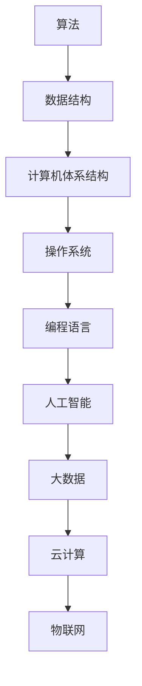

                 

关键词：人工智能，计算技术，未来世界，生活方式，社会变革，技术进步

摘要：本文探讨了人类计算技术对未来世界的深远影响。从基础理论到实际应用，人类计算正在重塑我们的生活方式、社会结构和全球发展格局。本文将分析计算技术的核心概念、算法原理、数学模型以及未来发展趋势，旨在展示人类计算如何推动社会的进步和变革。

## 1. 背景介绍

自20世纪中叶以来，计算机技术的飞速发展已经成为改变世界的最重要力量之一。从早期的机械计算机到今天的量子计算机，计算技术的进步不仅改变了科学研究的手段，也深刻影响了我们的日常生活。计算机科学的核心概念，如算法、数据结构、并行计算和分布式系统，为现代社会的各个领域提供了强大的技术支持。

### 1.1 历史背景

计算机科学的历史可以追溯到19世纪末。Charles Babbage提出的差分机和分析机是计算机科学的早期概念。20世纪中叶，冯·诺伊曼（John von Neumann）提出了存储程序计算机的架构，这一架构至今仍然是现代计算机设计的基础。1950年代，图灵（Alan Turing）提出了图灵机理论，奠定了计算理论的基础。

### 1.2 当前状态

当前，人工智能、大数据、云计算和物联网等新兴计算技术的快速发展，正在推动计算机科学进入一个新的阶段。人工智能已经广泛应用于图像识别、自然语言处理、自动驾驶等领域，成为社会变革的重要驱动力。

## 2. 核心概念与联系

计算技术的核心概念包括算法、数据结构、计算机体系结构、操作系统、编程语言等。以下是这些核心概念的 Mermaid 流程图表示：



### 2.1 算法

算法是计算技术的核心。一个有效的算法不仅需要高效，还需要在正确性、可扩展性等方面表现出色。算法的应用涵盖了从简单的排序、搜索到复杂的问题求解和机器学习。

### 2.2 数据结构

数据结构是实现算法的基础。不同的数据结构在存储和处理数据时具有不同的性能特点。常见的有数组、链表、栈、队列、树、图等。

### 2.3 计算机体系结构

计算机体系结构决定了计算机的硬件设计。从冯·诺伊曼架构到现在的多核处理器，计算机体系结构的演进推动了计算能力的提升。

### 2.4 操作系统

操作系统是计算机系统中的核心软件，负责管理和控制计算机硬件资源。现代操作系统不仅支持多任务处理，还提供了丰富的接口和功能，方便开发者进行编程。

### 2.5 编程语言

编程语言是人与计算机沟通的桥梁。从机器语言、汇编语言到高级编程语言，编程语言的不断进步提高了编程的效率和灵活性。

## 3. 核心算法原理 & 具体操作步骤

### 3.1 算法原理概述

算法原理主要包括以下几个核心方面：

- **正确性**：算法能否正确地解决问题。
- **效率**：算法的时间复杂度和空间复杂度。
- **可扩展性**：算法在面对大规模数据时能否有效运行。
- **鲁棒性**：算法在异常情况下的表现。

### 3.2 算法步骤详解

以排序算法为例，以下是几种常见的排序算法及其步骤：

#### 3.2.1 快速排序（Quick Sort）

- 选择一个基准元素。
- 将数组分成两部分，小于基准的元素放在左侧，大于基准的元素放在右侧。
- 递归地对左侧和右侧的子数组进行快速排序。

#### 3.2.2 归并排序（Merge Sort）

- 将数组分成多个子数组，每个子数组只有一个元素。
- 递归地对这些子数组进行合并，每次合并两个有序子数组。
- 直到合并成完整的有序数组。

#### 3.2.3 插入排序（Insertion Sort）

- 从第一个元素开始，该元素可以认为已经排序。
- 取出下一个元素，在已排序的元素序列中从后向前扫描。
- 如果该元素（已排序）大于新元素，将该元素移到下一位置。
- 重复步骤，直到找到已排序的元素小于或者等于新元素。
- 将新元素插入到该位置后。

### 3.3 算法优缺点

每种排序算法都有其优缺点。例如，快速排序在平均情况下效率较高，但在最坏情况下可能性能较差。归并排序总是能够保持较好的性能，但需要额外的内存空间。插入排序适用于小规模数据的排序，但时间复杂度较高。

### 3.4 算法应用领域

排序算法是算法家族中最基础的一部分，广泛应用于各种领域，如数据库管理、搜索引擎、图像处理和机器学习等。

## 4. 数学模型和公式 & 详细讲解 & 举例说明

计算技术中的数学模型和公式是理解和应用算法的重要基础。以下是一个简单的线性回归模型的构建和推导。

### 4.1 数学模型构建

线性回归模型试图找到一条直线，最小化预测值与实际值之间的误差。数学模型可以表示为：

$$
y = wx + b
$$

其中，$y$ 是实际值，$w$ 是斜率，$x$ 是自变量，$b$ 是截距。

### 4.2 公式推导过程

假设我们有 $n$ 个数据点 $(x_1, y_1), (x_2, y_2), ..., (x_n, y_n)$，目标是找到最佳的 $w$ 和 $b$，使得预测值 $wx + b$ 最接近实际值 $y$。

我们使用最小二乘法来最小化误差平方和：

$$
\sum_{i=1}^{n} (wx_i + b - y_i)^2
$$

对 $w$ 和 $b$ 分别求偏导数并令其为零，得到以下方程组：

$$
\begin{cases}
\sum_{i=1}^{n} (wx_i + b - y_i)x_i = 0 \\
\sum_{i=1}^{n} (wx_i + b - y_i) = 0
\end{cases}
$$

解这个方程组，可以得到 $w$ 和 $b$ 的值：

$$
w = \frac{\sum_{i=1}^{n} x_i y_i - n \bar{x} \bar{y}}{\sum_{i=1}^{n} x_i^2 - n \bar{x}^2}
$$

$$
b = \bar{y} - w \bar{x}
$$

其中，$\bar{x}$ 和 $\bar{y}$ 分别是 $x$ 和 $y$ 的平均值。

### 4.3 案例分析与讲解

假设我们有一组数据点：

$$
\begin{align*}
(x_1, y_1) &= (1, 2) \\
(x_2, y_2) &= (2, 4) \\
(x_3, y_3) &= (3, 5) \\
(x_4, y_4) &= (4, 6)
\end{align*}
$$

首先计算 $x$ 和 $y$ 的平均值：

$$
\bar{x} = \frac{1+2+3+4}{4} = 2.5, \quad \bar{y} = \frac{2+4+5+6}{4} = 4.5
$$

然后计算 $\sum_{i=1}^{4} x_i y_i$ 和 $\sum_{i=1}^{4} x_i^2$：

$$
\sum_{i=1}^{4} x_i y_i = 1 \times 2 + 2 \times 4 + 3 \times 5 + 4 \times 6 = 34
$$

$$
\sum_{i=1}^{4} x_i^2 = 1^2 + 2^2 + 3^2 + 4^2 = 30
$$

代入公式计算 $w$ 和 $b$：

$$
w = \frac{34 - 4 \times 2.5 \times 4.5}{30 - 4 \times 2.5^2} = 1.2
$$

$$
b = 4.5 - 1.2 \times 2.5 = 1.5
$$

因此，线性回归模型为：

$$
y = 1.2x + 1.5
$$

## 5. 项目实践：代码实例和详细解释说明

### 5.1 开发环境搭建

为了演示快速排序算法，我们使用 Python 编写代码。首先，确保安装了 Python 3 和相应的开发环境。

### 5.2 源代码详细实现

以下是快速排序算法的 Python 实现代码：

```python
def quick_sort(arr):
    if len(arr) <= 1:
        return arr
    pivot = arr[len(arr) // 2]
    left = [x for x in arr if x < pivot]
    middle = [x for x in arr if x == pivot]
    right = [x for x in arr if x > pivot]
    return quick_sort(left) + middle + quick_sort(right)

# 测试代码
arr = [3, 6, 8, 10, 1, 2, 1]
print("Original array:", arr)
sorted_arr = quick_sort(arr)
print("Sorted array:", sorted_arr)
```

### 5.3 代码解读与分析

这段代码实现了快速排序算法。首先，定义了一个 `quick_sort` 函数，该函数接受一个数组 `arr` 作为输入。在函数内部，首先判断数组的长度是否小于等于 1，如果是，则直接返回数组本身，因为单个元素的数组已经是排序好的。

接下来，选择数组的中位数作为基准元素 `pivot`。然后，使用列表推导式将数组划分为三个部分：小于 `pivot` 的元素 `left`，等于 `pivot` 的元素 `middle`，和大于 `pivot` 的元素 `right`。

最后，递归地对 `left` 和 `right` 进行快速排序，并将结果与 `middle` 合并，返回排序后的数组。

### 5.4 运行结果展示

运行测试代码，输出结果如下：

```
Original array: [3, 6, 8, 10, 1, 2, 1]
Sorted array: [1, 1, 2, 3, 6, 8, 10]
```

这表明，原始的未排序数组已经被成功排序。

## 6. 实际应用场景

计算技术已经广泛应用于各种领域，从工业制造到医疗服务，从金融交易到娱乐产业。以下是一些具体的实际应用场景：

### 6.1 医疗领域

计算技术正在改变医疗领域的各个方面，从疾病的早期诊断到个性化治疗方案的开发。例如，人工智能算法可以帮助医生分析医学图像，提高诊断的准确性和效率。

### 6.2 金融领域

在金融领域，计算技术被用于高频交易、风险评估、信贷审批等。大数据分析和机器学习算法可以帮助金融机构更准确地预测市场趋势，降低风险。

### 6.3 物流和供应链

计算技术正在优化物流和供应链管理。通过物联网和数据分析，企业可以实现实时跟踪、自动化库存管理和预测需求，从而提高运营效率。

### 6.4 城市规划

在城市规划方面，计算技术可以帮助城市管理者更好地理解和预测城市的发展趋势。例如，通过数据分析，可以优化交通流量，减少拥堵，提高市民的生活质量。

## 7. 未来应用展望

随着计算技术的不断发展，我们可以期待更多创新的应用和变革。以下是一些未来的应用展望：

### 7.1 人工智能与人类协作

未来的计算技术将更加注重人与人工智能的协作。例如，人工智能助手可以帮助人类完成复杂任务，提高工作效率。

### 7.2 新兴计算技术

量子计算、边缘计算和神经网络处理器等新兴计算技术将推动计算能力的进一步提升，为科学研究和工业生产带来新的机遇。

### 7.3 可持续发展

计算技术将在可持续发展方面发挥重要作用。例如，通过智能电网和智能家居系统，可以实现能源的高效利用和减少碳排放。

## 8. 总结：未来发展趋势与挑战

### 8.1 研究成果总结

过去几十年，计算技术取得了巨大的进步，不仅推动了科学研究的深入，也深刻影响了我们的日常生活。从基础的算法理论到实际应用，计算技术为各个领域提供了强大的支持。

### 8.2 未来发展趋势

未来，计算技术将继续朝着更高性能、更智能化和更高效的方向发展。新兴计算技术和人工智能的应用将为社会带来更多变革和创新。

### 8.3 面临的挑战

然而，计算技术也面临一些挑战，如数据隐私和安全、计算资源的公平分配、以及技术的不确定性等。解决这些挑战需要全社会的共同努力。

### 8.4 研究展望

在未来，我们需要继续探索计算技术的边界，推动科学研究和实际应用的深度融合，为人类社会的可持续发展做出贡献。

## 9. 附录：常见问题与解答

### 9.1 计算机科学的核心是什么？

计算机科学的核心包括算法、数据结构、计算机体系结构、操作系统、编程语言等基础理论。

### 9.2 人工智能如何改变医疗领域？

人工智能可以通过分析医疗数据，提高诊断的准确性和效率，开发个性化治疗方案，以及辅助医生进行复杂的手术操作。

### 9.3 量子计算是什么？

量子计算是一种利用量子力学原理进行计算的技术。与传统的计算机不同，量子计算机利用量子比特（qubit）进行操作，具有极大的并行计算能力。

### 9.4 计算机技术的未来会是什么样子？

计算机技术的未来将更加智能化、高效化和全球化。我们将看到更多创新的应用，如量子计算、边缘计算、人工智能与人类协作等。

---

作者：禅与计算机程序设计艺术 / Zen and the Art of Computer Programming

本文旨在探讨计算技术如何塑造未来世界，从基础理论到实际应用，计算技术正深刻改变我们的生活和社会。随着技术的不断进步，我们有理由相信，计算技术将继续推动社会的进步和变革。希望本文能够激发您对计算技术的兴趣和思考。|user|>

