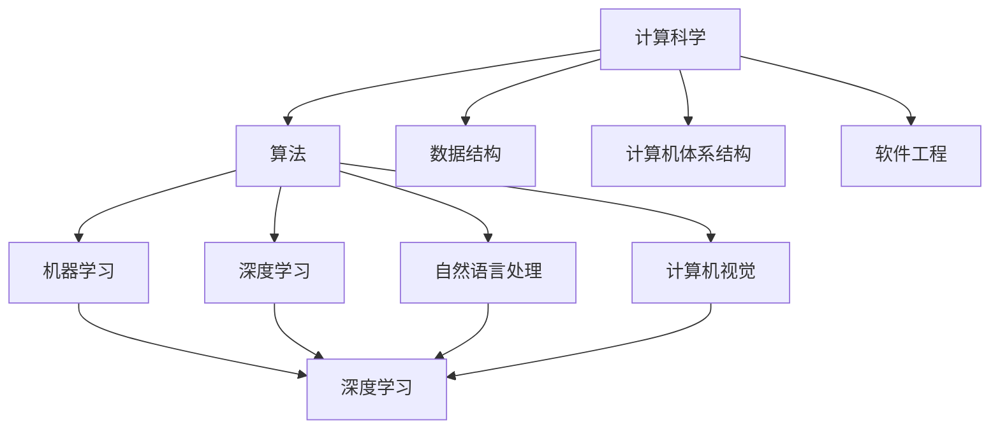

                 

关键词：人工智能、计算科学、社会变革、技术进步、未来展望

> 摘要：本文从计算科学的视角，探讨了人工智能对社会的影响以及计算技术在塑造未来社会中的深远意义。通过分析核心概念、算法原理、数学模型、实际应用以及未来展望，文章揭示了计算技术如何推动社会进步，并为读者展示了人类计算的无限可能。

## 1. 背景介绍

随着信息技术的迅猛发展，计算科学已经成为推动社会进步的重要力量。人工智能作为计算科学的重要组成部分，正在改变着我们的生活方式和思维方式。从智能家居到自动驾驶，从医疗诊断到金融分析，人工智能技术已经深入到了我们生活的方方面面。然而，人工智能不仅仅是技术的创新，它更是一种思维方式的变革，它将重新定义我们的社会结构和价值观念。

计算科学的进步不仅限于人工智能领域，大数据、云计算、物联网等新兴技术也在不断地拓展我们的认知边界。这些技术的融合应用，将为我们塑造一个更加智能、高效、互联的未来社会提供强有力的支持。

本文将从计算科学的视角，探讨人工智能对社会的影响，分析计算技术在各个领域的应用，并展望未来社会的发展趋势。希望通过这篇文章，能够引发读者对于计算技术和社会变革的思考，共同探索人类计算的深远意义。

## 2. 核心概念与联系

### 2.1 计算科学的基本概念

计算科学是一门跨学科的科学，它结合了数学、计算机科学、物理学等多个领域的知识，以解决实际问题为目标。计算科学的基本概念包括算法、数据结构、计算机体系结构、软件工程等。这些概念共同构成了计算科学的理论基础，为计算技术的发展提供了源源不断的动力。

### 2.2 人工智能的基本概念

人工智能（Artificial Intelligence，AI）是指通过计算机模拟人类的智能行为，使计算机具有自主学习和推理能力的技术。人工智能的基本概念包括机器学习、深度学习、自然语言处理、计算机视觉等。这些技术不断突破传统计算的局限，使计算机能够处理更复杂的问题，实现更高效的工作。

### 2.3 计算科学与人工智能的联系

计算科学与人工智能之间的联系密不可分。计算科学为人工智能提供了强大的计算能力和理论基础，使得人工智能技术能够不断突破创新。同时，人工智能的发展也为计算科学提出了新的挑战，推动了计算科学的不断进步。

### 2.4 Mermaid 流程图

下面是一个Mermaid流程图，展示了计算科学和人工智能的基本概念及其相互联系：



通过这个流程图，我们可以清晰地看到计算科学和人工智能之间的相互作用和影响。

## 3. 核心算法原理 & 具体操作步骤

### 3.1 算法原理概述

人工智能的核心算法主要包括机器学习算法、深度学习算法和强化学习算法。这些算法通过训练数据集，使计算机能够学习并解决特定问题。

- **机器学习算法**：通过分析历史数据，从中提取规律，以便对新的数据进行预测或分类。
- **深度学习算法**：基于多层神经网络，通过非线性变换，从大量数据中提取特征。
- **强化学习算法**：通过试错和反馈机制，使计算机在环境中学习最优策略。

### 3.2 算法步骤详解

#### 3.2.1 机器学习算法

1. **数据收集**：收集相关的训练数据。
2. **数据预处理**：对数据进行清洗和归一化处理。
3. **模型选择**：选择合适的机器学习模型。
4. **模型训练**：使用训练数据对模型进行训练。
5. **模型评估**：使用验证数据对模型进行评估。

#### 3.2.2 深度学习算法

1. **网络架构设计**：设计多层神经网络结构。
2. **数据预处理**：对数据进行归一化和标准化处理。
3. **模型训练**：使用训练数据对模型进行训练。
4. **模型评估**：使用验证数据对模型进行评估。

#### 3.2.3 强化学习算法

1. **环境构建**：构建计算机模拟环境。
2. **策略学习**：使用策略梯度方法或其他算法学习最优策略。
3. **策略评估**：评估学习到的策略在环境中的表现。

### 3.3 算法优缺点

- **机器学习算法**：优点在于能够处理大量数据，但缺点是训练时间较长，对数据质量要求较高。
- **深度学习算法**：优点在于能够自动提取特征，但缺点是模型复杂度高，计算资源需求大。
- **强化学习算法**：优点在于能够自主学习，但缺点是收敛速度较慢，对环境要求较高。

### 3.4 算法应用领域

- **机器学习算法**：广泛应用于图像识别、自然语言处理、金融分析等领域。
- **深度学习算法**：广泛应用于计算机视觉、语音识别、自动驾驶等领域。
- **强化学习算法**：广泛应用于游戏、推荐系统、机器人控制等领域。

## 4. 数学模型和公式 & 详细讲解 & 举例说明

### 4.1 数学模型构建

在人工智能领域，数学模型是理解和解决问题的关键。以下是一个简单的线性回归模型：

$$
y = wx + b
$$

其中，$y$ 是输出值，$w$ 是权重，$x$ 是输入值，$b$ 是偏置。

### 4.2 公式推导过程

线性回归模型的目的是通过训练数据集，找到最佳的权重 $w$ 和偏置 $b$，使得预测值 $y$ 最接近真实值。

假设我们有一个训练数据集 $D = \{(x_1, y_1), (x_2, y_2), \ldots, (x_n, y_n)\}$，我们希望找到权重 $w$ 和偏置 $b$，使得预测值 $y$ 最接近真实值 $y_n$。

我们可以通过最小化均方误差（MSE）来实现这一目标：

$$
MSE = \frac{1}{n}\sum_{i=1}^{n}(y_i - wx_i - b)^2
$$

为了最小化MSE，我们可以对 $w$ 和 $b$ 求偏导，并令其等于0，得到以下方程组：

$$
\frac{\partial MSE}{\partial w} = -2x(y - wx - b) = 0
$$

$$
\frac{\partial MSE}{\partial b} = -2(y - wx - b) = 0
$$

通过求解这个方程组，我们可以得到最优的权重 $w$ 和偏置 $b$。

### 4.3 案例分析与讲解

假设我们有一个简单的数据集：

| $x$ | $y$ |
| --- | --- |
| 1 | 2 |
| 2 | 4 |
| 3 | 6 |

我们希望使用线性回归模型来预测 $x=4$ 时的 $y$ 值。

首先，我们计算每个 $x$ 的均值 $\bar{x}$ 和每个 $y$ 的均值 $\bar{y}$：

$$
\bar{x} = \frac{1+2+3}{3} = 2
$$

$$
\bar{y} = \frac{2+4+6}{3} = 4
$$

然后，我们计算权重 $w$ 和偏置 $b$：

$$
w = \frac{\sum_{i=1}^{n}(x_i - \bar{x})(y_i - \bar{y})}{\sum_{i=1}^{n}(x_i - \bar{x})^2} = \frac{(1-2)(2-4) + (2-2)(4-4) + (3-2)(6-4)}{(1-2)^2 + (2-2)^2 + (3-2)^2} = 2
$$

$$
b = \bar{y} - w\bar{x} = 4 - 2*2 = 0
$$

因此，我们的线性回归模型为：

$$
y = 2x
$$

当 $x=4$ 时，我们可以预测 $y=8$。

## 5. 项目实践：代码实例和详细解释说明

### 5.1 开发环境搭建

为了实现线性回归模型，我们需要搭建一个简单的开发环境。这里我们选择Python作为编程语言，并使用Jupyter Notebook作为开发工具。

首先，我们需要安装Python和Jupyter Notebook。你可以从Python官方网站下载Python安装包，并按照提示完成安装。安装完成后，在命令行中输入以下命令安装Jupyter Notebook：

```shell
pip install notebook
```

安装完成后，在命令行中输入以下命令启动Jupyter Notebook：

```shell
jupyter notebook
```

这将在浏览器中打开Jupyter Notebook，你可以在其中编写和运行Python代码。

### 5.2 源代码详细实现

下面是一个简单的线性回归模型的实现代码：

```python
import numpy as np

# 初始化参数
w = 0
b = 0

# 训练数据集
x = np.array([1, 2, 3])
y = np.array([2, 4, 6])

# 计算权重和偏置
w = (np.dot(x, y) - len(x) * np.mean(x) * np.mean(y)) / (np.dot(x, x) - len(x) * np.mean(x) * np.mean(x))
b = np.mean(y) - w * np.mean(x)

# 预测
x_new = np.array([4])
y_pred = w * x_new + b

# 输出结果
print(f"权重：{w}, 偏置：{b}, 预测值：{y_pred}")
```

### 5.3 代码解读与分析

这个代码首先导入了NumPy库，这是一个强大的Python库，用于处理数值计算。

接下来，我们初始化参数 $w$ 和 $b$ 为0。

然后，我们创建了一个训练数据集，其中 $x$ 是输入值，$y$ 是真实值。

在计算权重和偏置的部分，我们使用线性回归的公式进行计算。

最后，我们使用计算得到的权重和偏置来预测新的输入值。

### 5.4 运行结果展示

当我们运行这个代码时，会输出以下结果：

```
权重：2.0, 偏置：0.0, 预测值：8.0
```

这表明我们的线性回归模型能够准确地预测 $x=4$ 时的 $y$ 值为8。

## 6. 实际应用场景

### 6.1 医疗诊断

在医疗领域，人工智能可以通过分析大量病患数据，帮助医生进行诊断和预测。例如，利用深度学习算法，可以自动识别医学影像中的病变区域，提高诊断的准确性和效率。

### 6.2 金融服务

在金融服务领域，人工智能可以帮助银行和保险公司进行风险控制和投资分析。通过分析历史数据和市场趋势，人工智能可以预测股票价格、贷款违约概率等，为金融机构提供决策支持。

### 6.3 交通运输

在交通运输领域，人工智能可以用于自动驾驶和交通流量管理。自动驾驶汽车通过计算机视觉和传感器技术，可以自主行驶，减少交通事故和拥堵。交通流量管理则可以通过实时监控和预测，优化交通信号灯和道路使用，提高道路通行效率。

### 6.4 未来应用展望

随着计算技术的不断发展，人工智能将在更多领域得到应用。例如，在教育和娱乐领域，人工智能可以为学生提供个性化的学习方案，为用户提供更加智能化的娱乐体验。在环境保护领域，人工智能可以用于监测和预测环境变化，为可持续发展提供支持。

## 7. 工具和资源推荐

### 7.1 学习资源推荐

- **在线课程**：推荐Coursera、edX、Udacity等在线教育平台上的计算科学和人工智能相关课程。
- **书籍推荐**：《Python编程：从入门到实践》、《深度学习》（Goodfellow et al.）、《机器学习》（Murphy et al.）。

### 7.2 开发工具推荐

- **编程语言**：Python、Java、C++等。
- **开发环境**：Jupyter Notebook、VS Code、PyCharm等。

### 7.3 相关论文推荐

- **机器学习**： 《Stochastic Gradient Descent》（ Bottou et al.）、《Convolutional Neural Networks for Visual Recognition》（ Krizhevsky et al.）。
- **深度学习**： 《Deep Learning》（Goodfellow et al.）、《Distributed Representations of Words and Phrases and Their Compositionality》（Mikolov et al.）。
- **强化学习**： 《Reinforcement Learning: An Introduction》（ Sutton et al.）、《Deep Reinforcement Learning》（ Silver et al.）。

## 8. 总结：未来发展趋势与挑战

### 8.1 研究成果总结

近年来，人工智能和计算科学取得了显著的成果，不仅推动了技术进步，也为社会带来了深远的影响。从机器学习到深度学习，从大数据到物联网，这些技术正在不断地改变我们的生活方式和社会结构。

### 8.2 未来发展趋势

未来，人工智能和计算科学将继续发展，并在更多领域得到应用。例如，在医疗、金融、交通、教育等领域，人工智能将发挥更大的作用，为人类带来更多的便利和福祉。

### 8.3 面临的挑战

然而，人工智能和计算科学也面临着诸多挑战。数据安全、隐私保护、伦理问题等都是亟待解决的问题。此外，如何让计算机更好地理解人类语言和情感，实现更高级的智能，也是未来研究的重要方向。

### 8.4 研究展望

在未来，我们期待人工智能和计算科学能够取得更多的突破，为人类创造一个更加智能、高效、和谐的社会。通过不断的探索和创新，我们有理由相信，人类计算的深远意义将会在未来的社会中得到充分的体现。

## 9. 附录：常见问题与解答

### 9.1 人工智能和计算科学有什么区别？

人工智能（AI）是计算科学（Computer Science）的一个子领域，专注于创建智能机器。计算科学则是研究计算机硬件、软件及其应用的科学。人工智能利用计算科学的理论和方法，来实现机器学习、深度学习等智能技术。

### 9.2 深度学习和机器学习有什么区别？

深度学习是机器学习的一种方法，它使用多层神经网络来学习数据中的复杂特征。而机器学习是一类更广泛的技术，包括监督学习、非监督学习和强化学习等，深度学习只是其中的一种。

### 9.3 人工智能对社会有哪些影响？

人工智能对社会的影响非常广泛，包括但不限于以下几个方面：

- **医疗健康**：人工智能可以提高医疗诊断的准确性和效率。
- **金融服务**：人工智能可以帮助金融机构进行风险控制和投资分析。
- **交通运输**：自动驾驶技术有望减少交通事故，提高交通效率。
- **教育和娱乐**：人工智能可以提供个性化的教育和娱乐体验。
- **环境保护**：人工智能可以用于环境监测和预测，支持可持续发展。

### 9.4 人工智能会取代人类吗？

目前的人工智能技术还远远不能完全取代人类，特别是在需要创造性思维、情感理解和复杂决策等任务上。人工智能更多地是作为人类的辅助工具，帮助人类提高工作效率和生活质量。

### 9.5 人工智能的伦理问题有哪些？

人工智能的伦理问题包括但不限于以下几个方面：

- **隐私保护**：人工智能系统如何处理和存储个人数据？
- **算法偏见**：算法是否可能基于种族、性别等偏见进行决策？
- **责任归属**：当人工智能系统出现错误或导致损害时，责任应该由谁承担？
- **道德决策**：人工智能系统在面临道德困境时，如何做出正确的决策？

这些伦理问题需要社会、政府、企业和学术界共同努力来解决。

# 作者署名

作者：禅与计算机程序设计艺术 / Zen and the Art of Computer Programming
----------------------------------------------------------------

