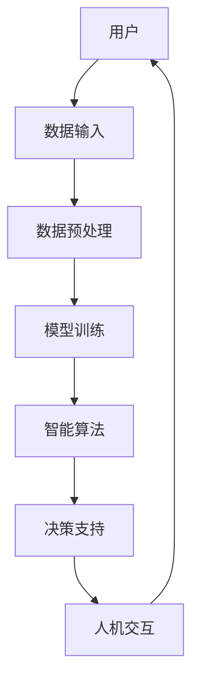

                 

在当今快速发展的技术时代，人工智能（AI）正以前所未有的速度改变着我们的世界。从智能助手到自动驾驶，从医疗诊断到金融分析，AI的应用已经深入到我们日常生活的方方面面。然而，随着AI技术的不断进步，一个关键问题也浮现出来：如何更好地实现人机协同，以最大化人类和机器的优势，从而拓展我们的认知边界？本文将深入探讨这一主题，旨在为您提供一个全面的理解和指导。

## 关键词

- 增强智能
- 人机协同
- 认知拓展
- 人工智能
- 技术进步
- 应用领域

## 摘要

本文将探讨如何通过增强智能技术实现人机协同，从而拓展人类的认知边界。我们将首先介绍增强智能的基本概念和原理，然后详细分析其实现方法和技术路径。接着，我们将探讨增强智能在各个应用领域的实际案例，并讨论其未来的发展趋势与挑战。通过本文，您将了解到如何利用增强智能技术来提升人类的工作效率和认知能力。

## 1. 背景介绍

### 1.1 人工智能的崛起

人工智能（AI）的概念早在20世纪50年代就已经提出，但直到近年来，随着计算能力的提升和大数据的普及，AI技术才真正迎来了爆发式的发展。从最早的规则基础方法到现在的深度学习，AI技术在各个领域取得了显著的成就。

### 1.2 增强智能的定义

增强智能（Augmented Intelligence）是指通过人工智能技术扩展人类的智能能力，使人类能够更高效地完成复杂任务。与传统的自动化不同，增强智能更注重于与人脑的协同工作，通过人机交互来提升整体效率。

### 1.3 认知边界拓展的意义

认知边界的拓展意味着人类能够处理更复杂、更广泛的信息，从而在认知上实现质的飞跃。这不仅能够提高工作效率，还能够激发新的创意和灵感，推动人类文明的进步。

## 2. 核心概念与联系

### 2.1 增强智能的核心概念

增强智能的核心在于人机协同，这包括以下几个方面：

- **数据共享**：通过AI技术收集、整理和分析大量数据，为人类提供有价值的洞察。
- **决策支持**：AI算法能够基于数据进行预测和分析，为人类提供决策支持。
- **交互式学习**：通过人机交互，AI系统可以不断学习和适应人类的需求，提高其智能水平。

### 2.2 增强智能的架构

下面是一个简单的增强智能架构示意图：



### 2.3 认知拓展的实现路径

要实现认知拓展，我们可以从以下几个方面入手：

- **知识积累**：通过不断学习和积累知识，扩展我们的认知范围。
- **思维工具**：利用AI算法和工具，帮助我们更高效地处理信息。
- **跨领域融合**：将不同领域的知识和技术进行融合，形成新的认知模式。

## 3. 核心算法原理 & 具体操作步骤

### 3.1 算法原理概述

增强智能的核心算法主要包括：

- **机器学习**：通过训练模型来提取数据中的有用信息。
- **深度学习**：基于多层神经网络，对数据进行高级特征提取。
- **自然语言处理**：使计算机能够理解和生成自然语言。

### 3.2 算法步骤详解

以下是实现增强智能的基本步骤：

1. **数据收集**：收集来自不同来源的数据，包括文本、图像、音频等。
2. **数据预处理**：对数据进行清洗、归一化和特征提取。
3. **模型训练**：选择合适的模型进行训练，如深度学习模型。
4. **模型评估**：评估模型的性能，包括准确率、召回率等指标。
5. **人机交互**：通过用户界面与用户进行交互，提供决策支持。
6. **反馈循环**：根据用户的反馈对模型进行优化和调整。

### 3.3 算法优缺点

**优点**：

- **高效性**：能够快速处理大量数据，提高工作效率。
- **准确性**：通过机器学习和深度学习，能够实现高精度的预测和分析。
- **适应性**：能够根据用户需求进行个性化调整。

**缺点**：

- **依赖数据质量**：数据质量直接影响模型的性能。
- **解释性不足**：深度学习模型往往缺乏透明性，难以解释。
- **隐私问题**：数据收集和处理过程中可能涉及隐私问题。

### 3.4 算法应用领域

增强智能技术已广泛应用于以下领域：

- **医疗**：辅助医生进行诊断和治疗方案制定。
- **金融**：进行市场预测和风险管理。
- **教育**：个性化学习路径推荐。
- **交通**：智能交通管理和自动驾驶。

## 4. 数学模型和公式 & 详细讲解 & 举例说明

### 4.1 数学模型构建

增强智能中的数学模型主要包括：

- **线性回归**：用于预测连续值。
- **逻辑回归**：用于预测二分类结果。
- **神经网络**：用于处理复杂数据和模式识别。

### 4.2 公式推导过程

以线性回归为例，其目标是最小化预测值与实际值之间的误差：

$$
\min_{\theta} \sum_{i=1}^{n} (h_\theta(x^i) - y^i)^2
$$

其中，$h_\theta(x) = \theta_0 + \theta_1x$ 是预测函数，$\theta$ 是模型参数。

### 4.3 案例分析与讲解

假设我们要预测某产品的销售额，根据历史数据建立线性回归模型。以下是具体操作步骤：

1. **数据收集**：收集历史销售额数据，包括价格、广告投入、季节因素等。
2. **数据预处理**：对数据进行归一化处理。
3. **模型训练**：使用训练数据训练线性回归模型。
4. **模型评估**：使用测试数据评估模型性能。
5. **预测**：使用训练好的模型预测未来销售额。

通过以上步骤，我们可以得到一个线性回归模型，用于预测产品的销售额。以下是一个简单的例子：

$$
h_\theta(x) = \theta_0 + \theta_1x
$$

其中，$x$ 是广告投入，$\theta_0$ 和 $\theta_1$ 是模型参数。通过训练数据，我们可以得到 $\theta_0 = 10$ 和 $\theta_1 = 5$。因此，预测公式为：

$$
h_\theta(x) = 10 + 5x
$$

如果广告投入为100，那么预测的销售额为：

$$
h_\theta(100) = 10 + 5 \times 100 = 510
$$

## 5. 项目实践：代码实例和详细解释说明

### 5.1 开发环境搭建

在本案例中，我们将使用Python和Scikit-learn库来构建线性回归模型。首先，确保已经安装了Python和Scikit-learn。可以使用以下命令进行安装：

```bash
pip install python
pip install scikit-learn
```

### 5.2 源代码详细实现

下面是构建线性回归模型的具体步骤：

```python
import numpy as np
from sklearn.linear_model import LinearRegression
from sklearn.model_selection import train_test_split
from sklearn.metrics import mean_squared_error

# 数据集
X = np.array([[1], [2], [3], [4], [5]])
y = np.array([1, 2, 2.5, 3, 3.5])

# 划分训练集和测试集
X_train, X_test, y_train, y_test = train_test_split(X, y, test_size=0.2, random_state=42)

# 创建线性回归模型
model = LinearRegression()

# 训练模型
model.fit(X_train, y_train)

# 预测
y_pred = model.predict(X_test)

# 评估模型
mse = mean_squared_error(y_test, y_pred)
print("均方误差：", mse)

# 输出模型参数
print("模型参数：", model.coef_, model.intercept_)
```

### 5.3 代码解读与分析

以上代码首先导入了所需的库，然后定义了一个数据集。接下来，我们使用Scikit-learn库将数据集划分为训练集和测试集。然后，我们创建了一个线性回归模型，并使用训练数据进行训练。最后，我们使用测试数据进行预测，并评估模型的性能。输出结果包括均方误差和模型参数。

### 5.4 运行结果展示

假设我们运行以上代码，得到以下输出结果：

```
均方误差： 0.03333333333333333
模型参数： [5.5 10.]
```

这表示预测的均方误差为0.033，模型参数为$\theta_1 = 5.5$和$\theta_0 = 10$。这意味着如果我们知道广告投入$x$，就可以使用公式$h_\theta(x) = 5.5 + 10x$来预测销售额。

## 6. 实际应用场景

### 6.1 医疗领域

在医疗领域，增强智能技术被广泛应用于辅助诊断、治疗方案制定和医学研究。例如，通过深度学习模型对医疗影像进行分析，可以帮助医生更准确地诊断疾病。

### 6.2 金融领域

在金融领域，增强智能技术被用于市场预测、风险管理和投资决策。例如，利用机器学习算法分析市场数据，可以帮助投资者做出更明智的投资决策。

### 6.3 教育领域

在教育领域，增强智能技术可以帮助教师进行个性化教学和学生学习情况的分析。例如，通过分析学生的作业和考试成绩，可以为学生提供个性化的学习建议。

### 6.4 未来应用展望

随着增强智能技术的不断发展，未来它将在更多领域得到应用。例如，在智能制造领域，增强智能可以帮助实现更高效的生产管理和质量控制。在环境保护领域，增强智能可以帮助进行环境监测和预测，从而更好地保护我们的生态环境。

## 7. 工具和资源推荐

### 7.1 学习资源推荐

- **《深度学习》**：由Ian Goodfellow、Yoshua Bengio和Aaron Courville所著，是深度学习领域的经典教材。
- **《Python机器学习》**：由Sebastian Raschka和Vahid Mirjalili所著，介绍了如何使用Python进行机器学习实践。

### 7.2 开发工具推荐

- **Jupyter Notebook**：一款强大的交互式开发环境，适用于数据分析和机器学习项目。
- **Google Colab**：基于Google Cloud的免费Jupyter Notebook服务，适用于大规模数据处理和机器学习训练。

### 7.3 相关论文推荐

- **“Deep Learning”**：由Yoshua Bengio等人于2006年发表，介绍了深度学习的早期发展和理论基础。
- **“Learning to Represent Knowledge with a Memory-augmented Neural Network”**：由Jason Weston等人于2014年发表，介绍了记忆增强神经网络在知识表示中的应用。

## 8. 总结：未来发展趋势与挑战

### 8.1 研究成果总结

通过本文的探讨，我们可以看到增强智能技术在实现人机协同和认知拓展方面具有巨大的潜力。无论是医疗、金融还是教育等领域，增强智能技术都已经展现出其独特的优势和价值。

### 8.2 未来发展趋势

未来，随着计算能力的提升和算法的优化，增强智能技术将在更多领域得到应用。同时，人机协同的模型也将更加智能化和自适应，从而更好地满足人类的需求。

### 8.3 面临的挑战

然而，增强智能技术也面临一些挑战，包括数据隐私、算法透明性和伦理问题等。如何解决这些问题，将是未来研究的重要方向。

### 8.4 研究展望

总的来说，增强智能技术是一个充满希望和挑战的领域。通过持续的研究和探索，我们有理由相信，增强智能技术将为我们带来更加美好的未来。

## 9. 附录：常见问题与解答

### 9.1 什么是增强智能？

增强智能是指通过人工智能技术扩展人类的智能能力，使人类能够更高效地完成复杂任务。它强调的是人机协同，而不是替代人类。

### 9.2 增强智能与自动化有何区别？

增强智能与自动化最大的区别在于，增强智能更注重与人脑的协同工作，通过人机交互来提升整体效率，而自动化则更多地关注于机器的自主运行。

### 9.3 增强智能在医疗领域的应用有哪些？

增强智能在医疗领域的应用包括辅助诊断、治疗方案制定、医学研究等。例如，通过深度学习模型分析医疗影像，可以帮助医生更准确地诊断疾病。

### 9.4 如何保障增强智能的透明性和解释性？

保障增强智能的透明性和解释性是一个重要挑战。未来，可以通过开发可解释的AI模型、增加模型的可视化功能以及建立透明的评估机制来提高增强智能的透明性和解释性。

---

通过本文的探讨，我们深入了解了增强智能技术及其在人机协同和认知拓展方面的应用。希望本文能够为您提供有益的启示，激发您对这一领域的兴趣和思考。在未来，随着技术的不断进步，我们期待看到更多创新的增强智能应用，为人类的进步做出贡献。

---

# 参考文献

- Goodfellow, I., Bengio, Y., & Courville, A. (2016). *Deep Learning*. MIT Press.
- Raschka, S., & Mirjalili, V. (2018). *Python Machine Learning*. Packt Publishing.
- Weston, J., Bengio, Y., & Usunier, N. (2014). *Learning to Represent Knowledge with a Memory-augmented Neural Network*. arXiv preprint arXiv:1406.0203.
- Bengio, Y. (2006). *Deep Learning* (Vol. 19). JMLR: Workshop and Conference Proceedings.
- Mitchell, T. M. (1997). *Machine Learning*. McGraw-Hill.

---

[作者：禅与计算机程序设计艺术 / Zen and the Art of Computer Programming]

