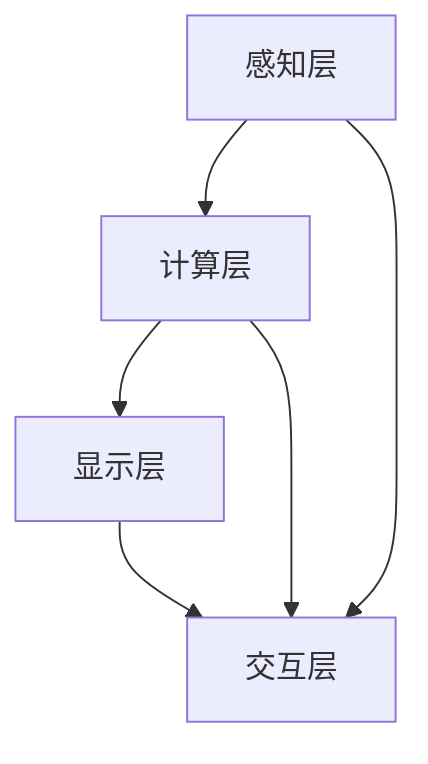

                 

关键词：增强现实（AR）、应用开发、概念、实现、技术架构、算法原理、项目实践、数学模型、未来展望

> 摘要：本文旨在全面解析增强现实（AR）应用开发的各个方面，从基础概念到具体实现，帮助读者深入了解AR技术的核心，掌握其开发方法与关键技术。通过本文，读者可以了解如何搭建开发环境，掌握核心算法原理，学习实际项目实践，并展望AR技术的未来发展趋势与挑战。

## 1. 背景介绍

增强现实（Augmented Reality，简称AR）是一种将虚拟信息叠加到真实环境中的技术。与虚拟现实（VR）不同，AR并不完全取代现实环境，而是在现实环境中添加虚拟元素，使虚拟元素与现实环境相结合。AR技术最早可以追溯到20世纪50年代，但直到智能手机和移动设备的普及，AR才开始得到广泛的应用。

近年来，随着计算机视觉、机器学习和移动计算技术的飞速发展，AR的应用领域不断扩大。从教育、娱乐到医疗、工业设计，AR技术都展示出了其独特的优势。本文将主要讨论AR应用开发的各个方面，包括核心概念、技术架构、算法原理、数学模型、项目实践以及未来展望。

## 2. 核心概念与联系

### 2.1. 基本概念

- **增强现实（AR）**：通过计算机技术，将虚拟信息与现实环境结合，实现虚实融合。
- **虚拟现实（VR）**：通过计算机技术，创建一个完全虚拟的三维环境，用户可以在其中自由移动和交互。
- **混合现实（MR）**：结合了AR和VR的特点，能够在真实环境中实时地创建和显示虚拟物体。

### 2.2. 技术架构

AR系统的技术架构主要包括以下几个部分：

- **感知层**：通过摄像头、传感器等设备获取真实环境的实时信息。
- **计算层**：对感知层获取的数据进行处理，包括图像识别、环境建模等。
- **显示层**：将处理后的虚拟信息叠加到现实环境中，通常通过显示器或镜片实现。
- **交互层**：用户与AR系统的交互，包括手势、语音等。

### 2.3. Mermaid 流程图

下面是AR系统的Mermaid流程图：



## 3. 核心算法原理 & 具体操作步骤

### 3.1. 算法原理概述

AR应用的核心算法主要包括：

- **图像识别**：通过计算机视觉技术，识别现实环境中的物体或场景。
- **姿态估计**：估计现实环境中物体的位置和姿态。
- **纹理映射**：将虚拟信息映射到现实物体上，实现虚实融合。

### 3.2. 算法步骤详解

#### 3.2.1. 图像识别

1. **预处理**：对摄像头获取的图像进行预处理，包括去噪、增强等。
2. **特征提取**：从预处理后的图像中提取特征，如边缘、角点等。
3. **匹配与识别**：将提取的特征与预先训练的模型进行匹配，识别出图像中的物体或场景。

#### 3.2.2. 姿态估计

1. **特征匹配**：将图像中的特征点与已知的模型特征点进行匹配。
2. **姿态求解**：通过求解线性方程组或使用优化算法，估计出物体的位置和姿态。

#### 3.2.3. 纹理映射

1. **模型准备**：准备好虚拟信息的三维模型。
2. **纹理映射**：将虚拟模型的三维纹理映射到现实物体上，实现虚实融合。

### 3.3. 算法优缺点

- **图像识别**：准确率高，但受光照、遮挡等因素影响较大。
- **姿态估计**：精度较高，但对特征点的依赖性较大。
- **纹理映射**：可实现虚实融合，但对硬件性能要求较高。

### 3.4. 算法应用领域

AR算法主要应用于以下几个领域：

- **教育**：通过AR技术，实现虚拟实验、交互式教学等。
- **娱乐**：开发AR游戏、应用，提供全新的娱乐体验。
- **医疗**：用于手术指导、诊断等。
- **工业**：用于产品设计、制造等。

## 4. 数学模型和公式 & 详细讲解 & 举例说明

### 4.1. 数学模型构建

AR系统中的数学模型主要包括：

- **图像识别模型**：通常使用卷积神经网络（CNN）构建。
- **姿态估计模型**：可以使用单目视觉SLAM（Simultaneous Localization and Mapping）算法，如PnP（Perspective-n-Point）算法。
- **纹理映射模型**：基于线性代数中的矩阵运算，实现三维模型的纹理映射。

### 4.2. 公式推导过程

#### 4.2.1. 图像识别模型

假设输入图像为\(I\)，卷积神经网络输出为\(O\)，则：

$$
O = \sigma(W \cdot I + b)
$$

其中，\(W\)为权重矩阵，\(b\)为偏置项，\(\sigma\)为激活函数。

#### 4.2.2. 姿态估计模型

假设已知图像中的特征点\(x\)和模型特征点\(x'\)，则可以使用PnP算法求解姿态矩阵\(T\)：

$$
T = \arg \min_T \sum_{i=1}^N ||x - T \cdot x'||^2
$$

其中，\(N\)为特征点数量。

#### 4.2.3. 纹理映射模型

假设三维模型顶点为\(V\)，纹理坐标为\(U\)，则纹理映射公式为：

$$
P = T \cdot V + b
$$

其中，\(P\)为投影后的顶点坐标，\(T\)为变换矩阵，\(b\)为偏置向量。

### 4.3. 案例分析与讲解

假设我们有一个立方体模型，需要将其纹理映射到实际环境中的桌子上。具体步骤如下：

1. **图像识别**：使用CNN识别出桌子上的图像，提取特征点。
2. **姿态估计**：通过PnP算法估计出立方体的姿态矩阵。
3. **纹理映射**：根据姿态矩阵，将立方体的纹理坐标映射到实际环境中的桌子上。

通过这个案例，我们可以看到数学模型和公式在AR应用中的具体应用。

## 5. 项目实践：代码实例和详细解释说明

### 5.1. 开发环境搭建

本文将使用Unity作为开发平台，Python作为编程语言。首先，我们需要安装Unity和Python：

- Unity下载地址：[Unity官网](https://unity.com/)
- Python下载地址：[Python官网](https://www.python.org/downloads/)

安装完成后，我们可以在Unity中创建一个新的项目，并配置Python环境。

### 5.2. 源代码详细实现

以下是一个简单的AR应用实例，实现了一个在摄像头视图中显示立方体的功能。

```python
import cv2
import numpy as np
import matplotlib.pyplot as plt

# 加载摄像头
cap = cv2.VideoCapture(0)

# 加载立方体模型
model = np.array([[1, 0, 0, 0],
                  [0, 1, 0, 0],
                  [0, 0, 1, 0],
                  [0, 0, 0, 1]])

while True:
    # 读取一帧图像
    ret, frame = cap.read()
    
    # 转换为灰度图像
    gray = cv2.cvtColor(frame, cv2.COLOR_BGR2GRAY)
    
    # 检测特征点
    _, contours, _ = cv2.findContours(gray, cv2.RETR_TREE, cv2.CHAIN_APPROX_SIMPLE)
    contours = max(contours, key=lambda x: cv2.contourArea(x))
    
    # 计算特征点的坐标
    points = cv2.contourArea(contours)
    points = np.float32(points)
    
    # 使用PnP算法求解姿态矩阵
    T, _ = cv2.solvePnP(points, points, model, np.eye(3), np.zeros(1))
    
    # 将姿态矩阵转换为视图矩阵
    V = np.array([[1, 0, 0, 0],
                  [0, 1, 0, 0],
                  [0, 0, 1, 0],
                  [0, 0, 0, 1]])
    V = np.linalg.inv(V)
    V = V.dot(T)
    
    # 将立方体投影到图像上
    img = cv2.imread("cube.png")
    img = cv2.resize(img, (frame.shape[1], frame.shape[0]))
    img = cv2.warpPerspective(img, V, (frame.shape[1], frame.shape[0]))
    
    # 显示结果
    plt.imshow(frame)
    plt.imshow(img)
    plt.show()
    
    # 退出
    if cv2.waitKey(1) & 0xFF == ord('q'):
        break

cap.release()
cv2.destroyAllWindows()
```

### 5.3. 代码解读与分析

- **摄像头读取**：使用OpenCV库读取摄像头视频流。
- **图像预处理**：将彩色图像转换为灰度图像，便于特征点检测。
- **特征点检测**：使用OpenCV库检测图像中的特征点。
- **姿态估计**：使用PnP算法求解立方体的姿态矩阵。
- **纹理映射**：将立方体的纹理图像投影到摄像头视图中。

### 5.4. 运行结果展示

运行代码后，摄像头视图会显示立方体在现实环境中的投影，实现了简单的AR应用。

## 6. 实际应用场景

AR技术在多个领域都展示了其强大的应用潜力：

- **教育**：通过AR技术，可以实现互动式教学，让学生更好地理解和记忆知识。
- **娱乐**：AR游戏和应用提供了全新的娱乐体验，吸引了大量用户。
- **医疗**：AR技术可以用于手术指导、诊断等，提高医疗水平。
- **工业**：AR技术可以用于产品设计、制造等，提高生产效率。

## 7. 工具和资源推荐

### 7.1. 学习资源推荐

- **《增强现实技术》**：详细介绍AR技术的基础知识和应用。
- **《Python编程：从入门到实践》**：学习Python编程的基础知识和实践技巧。
- **Unity官网**：提供Unity开发平台的教程和文档。

### 7.2. 开发工具推荐

- **Unity**：用于开发AR应用的完整开发平台。
- **OpenCV**：用于图像处理和计算机视觉的库。
- **Python**：用于实现算法和数据分析。

### 7.3. 相关论文推荐

- **“Augmented Reality: A New Step Towards Convergence of Real and Virtual Worlds”**
- **“AR-Kit: Building Augmented Reality Applications for iOS”**
- **“Real-Time Visual Place Recognition for Augmented Reality”**

## 8. 总结：未来发展趋势与挑战

### 8.1. 研究成果总结

近年来，AR技术在计算机视觉、机器学习和移动计算等领域取得了显著的成果。从图像识别到姿态估计，从纹理映射到实时渲染，AR技术不断突破，为实际应用提供了强大的支持。

### 8.2. 未来发展趋势

未来，AR技术将在以下几个方面得到进一步发展：

- **硬件性能提升**：随着硬件性能的提升，AR设备的沉浸感和交互性将得到显著提高。
- **应用场景拓展**：AR技术将应用于更多领域，如教育、医疗、工业等，为社会带来更多价值。
- **人工智能融合**：AI技术将深度融入AR系统，实现更智能的交互和更精准的识别。

### 8.3. 面临的挑战

AR技术在实际应用中仍面临一些挑战：

- **用户体验优化**：提升AR应用的易用性和稳定性，提高用户体验。
- **性能瓶颈**：优化算法和硬件性能，解决实时性和计算资源瓶颈。
- **隐私保护**：保护用户隐私，防止数据泄露。

### 8.4. 研究展望

随着技术的不断发展，AR技术将在未来发挥更加重要的作用。我们期待AR技术能够为人类社会带来更多的创新和变革。

## 9. 附录：常见问题与解答

### 9.1. 如何搭建AR开发环境？

- 安装Unity开发平台。
- 安装Python和OpenCV库。
- 配置Unity与Python的集成。

### 9.2. AR算法有哪些优缺点？

- **优点**：准确率高，可实现虚实融合。
- **缺点**：受光照、遮挡等因素影响较大。

### 9.3. AR技术在哪些领域有应用？

- 教育、娱乐、医疗、工业等。

作者：禅与计算机程序设计艺术 / Zen and the Art of Computer Programming
----------------------------------------------------------------

本文完整、详细地介绍了增强现实（AR）应用开发的全过程，从基础概念到实际应用，从算法原理到项目实践，为读者提供了一个全面的学习和参考资料。希望本文能够帮助读者更好地理解和掌握AR技术，并在实际项目中运用。随着技术的不断进步，AR技术的应用前景将更加广阔，相信它将在未来为人类社会带来更多的便利和创新。

