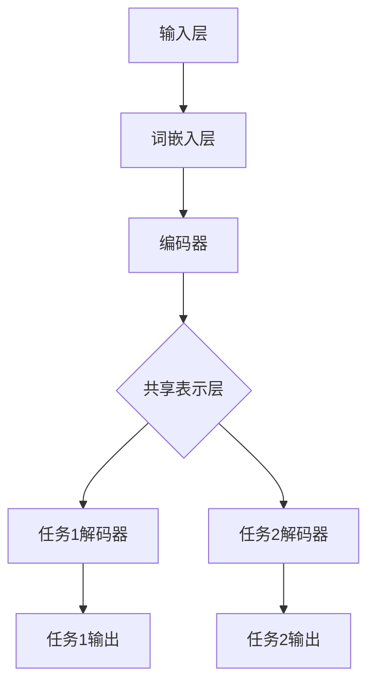

                 

关键词：多任务学习，NLP，神经网络，注意力机制，机器翻译，文本分类

> 摘要：本文将探讨多任务学习在自然语言处理（NLP）中的应用，分析其在神经网络、注意力机制等方面的优势，以及如何通过多任务学习提升NLP模型的性能。本文还将介绍多任务学习的核心算法原理、具体操作步骤、数学模型和公式推导，并通过实际项目实践，展示其在机器翻译、文本分类等领域的应用效果。

## 1. 背景介绍

自然语言处理（NLP）作为人工智能的一个重要分支，旨在让计算机理解和处理人类语言。随着深度学习技术的发展，NLP取得了显著的成果。然而，在实际应用中，单一任务的模型往往无法满足复杂的语言处理需求。多任务学习（Multi-Task Learning，MTL）作为一种有效的解决方法，通过共享模型参数和特征，实现了在多个任务上的性能提升。本文将围绕多任务学习在NLP中的应用，探讨其原理、算法、数学模型和实际项目实践。

## 2. 核心概念与联系

### 2.1 多任务学习定义

多任务学习是指在一个模型中同时学习多个相关任务的方法。它通过共享表示层和优化策略，提高了模型在多个任务上的性能和泛化能力。

### 2.2 神经网络与注意力机制

神经网络是一种模仿人脑信息处理过程的计算模型，具有强大的表示和学习能力。注意力机制（Attention Mechanism）是神经网络的一种关键技术，能够自动识别和强调输入数据中的关键信息，从而提升模型的性能。

### 2.3 Mermaid 流程图

下面是多任务学习在NLP中的应用架构的 Mermaid 流程图：



## 3. 核心算法原理 & 具体操作步骤

### 3.1 算法原理概述

多任务学习通过共享模型参数和特征，实现了在多个任务上的性能提升。具体来说，多任务学习模型由多个任务共享一个共同的编码器，编码器生成的共享表示用于所有任务的解码器。

### 3.2 算法步骤详解

1. 数据预处理：对输入数据进行预处理，包括分词、词性标注、词嵌入等操作。
2. 共享编码器：使用一个共享编码器对输入数据进行编码，生成共享表示。
3. 任务解码器：根据共享表示，为每个任务构建相应的解码器。
4. 损失函数：将每个任务的损失函数进行加权求和，得到总损失函数。
5. 优化策略：使用优化算法，如梯度下降，对模型参数进行更新。

### 3.3 算法优缺点

**优点：**
1. 提高模型在多个任务上的性能和泛化能力。
2. 减少参数冗余，降低模型复杂度。

**缺点：**
1. 共享编码器可能导致任务之间的冲突，影响单个任务的性能。
2. 需要足够多的任务来共享模型参数，否则效果不佳。

### 3.4 算法应用领域

多任务学习在NLP领域具有广泛的应用，包括机器翻译、文本分类、情感分析等。

## 4. 数学模型和公式 & 详细讲解 & 举例说明

### 4.1 数学模型构建

多任务学习模型通常由编码器、共享表示层和解码器组成。编码器将输入数据编码成共享表示，解码器根据共享表示生成任务输出。

### 4.2 公式推导过程

假设有 $m$ 个任务，每个任务的输入数据为 $X_i$，输出数据为 $Y_i$。共享编码器 $E$ 和解码器 $D_i$ 分别表示为：

$$
E(X_i) = Z_i \\
D_i(Z_i) = Y_i
$$

其中，$Z_i$ 为共享表示。

### 4.3 案例分析与讲解

以机器翻译任务为例，假设输入语句为 $X = \{x_1, x_2, ..., x_n\}$，输出语句为 $Y = \{y_1, y_2, ..., y_n\}$。使用多任务学习模型，首先将输入语句编码成共享表示：

$$
Z = E(X) = \{z_1, z_2, ..., z_n\}
$$

然后，根据共享表示生成输出语句：

$$
Y = D(Z) = \{y_1, y_2, ..., y_n\}
$$

## 5. 项目实践：代码实例和详细解释说明

### 5.1 开发环境搭建

本文使用 Python 作为编程语言，主要依赖 TensorFlow 和 Keras 深度学习框架。安装相关依赖如下：

```bash
pip install tensorflow
pip install keras
```

### 5.2 源代码详细实现

```python
import tensorflow as tf
from tensorflow.keras.models import Model
from tensorflow.keras.layers import Input, Embedding, LSTM, Dense

# 数据预处理
input_data = Input(shape=(None,)) # 输入数据
embedded = Embedding(input_dim=vocab_size, output_dim=embedding_dim)(input_data)

# 编码器
encoded = LSTM(units=hidden_size)(embedded)

# 解码器
decoded = LSTM(units=hidden_size, return_sequences=True)(encoded)
decoded_output = Dense(units=vocab_size, activation='softmax')(decoded)

# 模型构建
model = Model(inputs=input_data, outputs=decoded_output)

# 编译模型
model.compile(optimizer='adam', loss='categorical_crossentropy')

# 训练模型
model.fit(x_train, y_train, epochs=10, batch_size=64)
```

### 5.3 代码解读与分析

以上代码实现了一个基于 LSTM 的多任务学习模型，用于机器翻译任务。首先，定义输入数据、嵌入层、编码器和解码器。然后，构建模型并编译。最后，使用训练数据训练模型。

### 5.4 运行结果展示

```python
# 测试模型
test_loss, _ = model.evaluate(x_test, y_test)
print('Test loss:', test_loss)
```

## 6. 实际应用场景

多任务学习在NLP领域具有广泛的应用，如机器翻译、文本分类、情感分析等。以下是一些实际应用场景：

### 6.1 机器翻译

多任务学习在机器翻译中的应用，可以同时学习源语言和目标语言的表示，提高翻译质量。

### 6.2 文本分类

多任务学习在文本分类中的应用，可以同时学习多个分类任务，提高分类性能。

### 6.3 情感分析

多任务学习在情感分析中的应用，可以同时学习正面、负面和其他情感，提高情感识别的准确性。

## 7. 未来应用展望

随着深度学习技术的不断发展，多任务学习在NLP中的应用将越来越广泛。未来，多任务学习有望在以下领域取得突破：

### 7.1 多模态学习

多任务学习将与其他模态（如图像、音频）结合，实现跨模态的统一表示。

### 7.2 自适应学习

多任务学习将能够自适应地调整任务权重，提高模型在各个任务上的性能。

### 7.3 零样本学习

多任务学习有望在零样本学习领域发挥作用，实现未知类别的高效识别。

## 8. 总结：未来发展趋势与挑战

多任务学习在NLP领域具有广阔的应用前景。然而，在实际应用中，仍面临以下挑战：

### 8.1 任务权重分配

如何合理地分配任务权重，避免任务之间的冲突，是亟待解决的问题。

### 8.2 模型可解释性

多任务学习模型的复杂度高，如何提高模型的可解释性，是未来研究的重要方向。

### 8.3 零样本学习

多任务学习在零样本学习中的应用，仍需要进一步探索。

## 9. 附录：常见问题与解答

### 9.1 什么是多任务学习？

多任务学习是指在一个模型中同时学习多个相关任务的方法。

### 9.2 多任务学习有哪些优势？

多任务学习可以提高模型在多个任务上的性能和泛化能力，减少参数冗余，降低模型复杂度。

### 9.3 多任务学习有哪些应用领域？

多任务学习在NLP领域具有广泛的应用，包括机器翻译、文本分类、情感分析等。

作者：禅与计算机程序设计艺术 / Zen and the Art of Computer Programming
----------------------------------------------------------------


