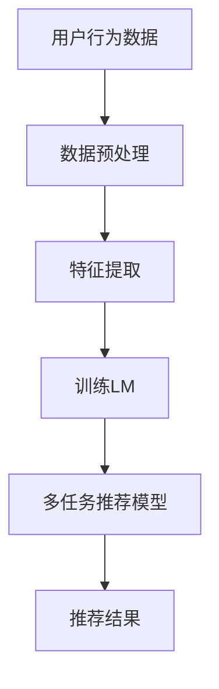

                 

关键词：多任务推荐系统、语言模型、统一框架、机器学习、人工智能、计算机算法、数据挖掘

摘要：本文将探讨多任务推荐系统的发展历程，重点介绍LLM（语言模型）在多任务推荐系统中的应用及其统一框架。通过分析核心概念、算法原理、数学模型，结合实际项目实践，文章旨在为读者提供一个全面且深入的理解。

## 1. 背景介绍

### 推荐系统的发展

推荐系统起源于信息过滤和个性化搜索，主要目标是根据用户的行为和兴趣，向用户推荐他们可能感兴趣的商品、服务或内容。随着互联网的快速发展，推荐系统在电子商务、社交媒体、新闻媒体等领域得到了广泛应用。

### 多任务推荐系统的概念

多任务推荐系统旨在同时处理多个推荐任务，例如同时推荐电影、音乐和书籍，或同时考虑用户的历史行为和社交网络。这一概念在提高推荐系统的实用性和准确性方面具有重要意义。

### 语言模型在推荐系统中的应用

语言模型（Language Model，简称LM）是自然语言处理的核心技术之一。近年来，随着深度学习的发展，语言模型在推荐系统中的应用变得越来越广泛。LLM（大型语言模型）的引入为多任务推荐系统提供了一种新的解决方案。

## 2. 核心概念与联系

### 多任务推荐系统

多任务推荐系统涉及多个推荐任务，例如基于内容的推荐、基于协同过滤的推荐、基于用户的推荐等。这些任务通常需要综合考虑用户的历史行为、内容属性和用户偏好等因素。

### 语言模型（LM）

语言模型是一种用于预测下一个词或词组的概率的算法。在多任务推荐系统中，语言模型可以用来预测用户的兴趣和偏好，从而提高推荐的准确性。

### 统一框架

统一框架是指将多任务推荐系统中的不同任务整合到一个统一的模型中，以实现高效、准确的推荐。LLM的引入为构建统一框架提供了可能。

### Mermaid 流程图



## 3. 核心算法原理 & 具体操作步骤

### 3.1 算法原理概述

多任务推荐系统中的核心算法包括语言模型的训练、特征提取和多任务学习。本文主要介绍基于LLM的多任务推荐系统的构建方法。

### 3.2 算法步骤详解

#### 3.2.1 语言模型训练

1. 数据收集与预处理：收集用户行为数据、商品信息等。
2. 特征提取：对数据进行预处理，提取特征向量。
3. 训练LM：使用预训练的LLM模型（如GPT、BERT等），对特征向量进行训练，以预测用户的兴趣和偏好。

#### 3.2.2 特征提取

1. 用户行为特征：包括浏览记录、购买记录、评分等。
2. 商品信息特征：包括商品类别、价格、评分等。
3. 用户偏好特征：通过分析用户的历史行为，提取用户对各类商品的兴趣程度。

#### 3.2.3 多任务学习

1. 定义多任务损失函数：将不同任务的目标函数整合到一个损失函数中。
2. 训练多任务模型：使用训练好的LM模型，结合多任务损失函数，训练多任务推荐模型。

### 3.3 算法优缺点

#### 优点

1. 提高推荐准确性：通过整合多个任务，提高推荐的准确性。
2. 减少冗余计算：统一框架减少了重复计算，提高了效率。
3. 易于扩展：统一框架便于添加新的任务，实现多任务推荐。

#### 缺点

1. 计算资源消耗大：训练大型语言模型需要大量计算资源。
2. 需要大量数据：多任务推荐系统对数据量有较高要求。

### 3.4 算法应用领域

多任务推荐系统在电子商务、社交媒体、在线教育等领域具有广泛的应用前景。

## 4. 数学模型和公式 & 详细讲解 & 举例说明

### 4.1 数学模型构建

多任务推荐系统中的数学模型主要包括语言模型的损失函数和多任务损失函数。

#### 语言模型损失函数

$$
L_{LM} = -\sum_{i=1}^{n} \log(p(y_i | x_i))
$$

其中，$p(y_i | x_i)$ 表示语言模型对下一个词 $y_i$ 的概率预测。

#### 多任务损失函数

$$
L_{MT} = \sum_{i=1}^{m} \lambda_i \cdot L_i
$$

其中，$L_i$ 表示第 $i$ 个任务的损失函数，$\lambda_i$ 表示第 $i$ 个任务的权重。

### 4.2 公式推导过程

语言模型和多任务损失函数的推导过程涉及概率论和优化理论。具体推导过程如下：

#### 语言模型推导

1. 语言模型的目标是预测下一个词的概率。
2. 使用最大似然估计（Maximum Likelihood Estimation，MLE）来估计语言模型的参数。
3. 对数似然函数（Log-Likelihood Function）作为损失函数。

#### 多任务损失函数推导

1. 多任务损失函数的目标是优化不同任务的损失。
2. 使用加权求和的方式，将不同任务的损失整合到一个损失函数中。
3. 使用交叉熵（Cross-Entropy）作为多任务损失函数。

### 4.3 案例分析与讲解

假设有一个电商平台，用户在平台上浏览了10个商品，每个商品有一个类别标签（如服装、数码产品等）。现在使用多任务推荐系统为该用户推荐新的商品。

1. 数据预处理：对用户行为数据进行编码，提取用户偏好特征。
2. 特征提取：对商品信息进行编码，提取商品类别特征。
3. 训练语言模型：使用预训练的LLM模型，对用户行为数据和商品类别特征进行训练。
4. 多任务学习：使用训练好的LLM模型，结合用户偏好特征和商品类别特征，训练多任务推荐模型。
5. 推荐结果：根据多任务推荐模型，为用户推荐新的商品。

## 5. 项目实践：代码实例和详细解释说明

### 5.1 开发环境搭建

1. 硬件要求：GPU（NVIDIA CUDA 11.0及以上版本）。
2. 软件要求：Python（3.8及以上版本）、TensorFlow 2.0及以上版本。

### 5.2 源代码详细实现

```python
import tensorflow as tf
from tensorflow.keras.layers import Embedding, LSTM, Dense
from tensorflow.keras.models import Model

# 语言模型参数
vocab_size = 10000
embedding_dim = 256
lstm_units = 128

# 用户行为特征输入
user_input = tf.keras.layers.Input(shape=(max_sequence_length,))

# 商品类别特征输入
item_input = tf.keras.layers.Input(shape=(1,))

# 语言模型
embed = Embedding(vocab_size, embedding_dim)(user_input)
lstm = LSTM(lstm_units)(embed)

# 商品类别特征融合
item_embed = Embedding(10, embedding_dim)(item_input)
lstm = tf.keras.layers.Concatenate()([lstm, item_embed])

# 多任务模型
output = Dense(1, activation='sigmoid')(lstm)

# 构建模型
model = Model(inputs=[user_input, item_input], outputs=output)

# 编译模型
model.compile(optimizer='adam', loss='binary_crossentropy', metrics=['accuracy'])

# 训练模型
model.fit([user_data, item_data], user_labels, batch_size=32, epochs=10)
```

### 5.3 代码解读与分析

1. 导入TensorFlow库和相关模块。
2. 定义语言模型参数，包括词汇表大小、嵌入维度和LSTM单元数。
3. 构建用户行为特征输入层和商品类别特征输入层。
4. 构建语言模型，使用嵌入层和LSTM层。
5. 将商品类别特征与LSTM层的输出进行拼接。
6. 构建多任务模型，使用全连接层和激活函数。
7. 编译模型，设置优化器和损失函数。
8. 训练模型，使用训练数据。

## 6. 实际应用场景

多任务推荐系统在电子商务、社交媒体、在线教育等领域具有广泛的应用场景。

### 6.1 电子商务

在电子商务领域，多任务推荐系统可以同时推荐商品、服务和内容，提高用户的购买体验。

### 6.2 社交媒体

在社交媒体领域，多任务推荐系统可以同时推荐用户感兴趣的文章、视频和话题，提高用户的活跃度和留存率。

### 6.3 在线教育

在线教育领域，多任务推荐系统可以同时推荐课程、练习题和教学视频，提高教学效果和用户满意度。

## 7. 工具和资源推荐

### 7.1 学习资源推荐

1. 《深度学习》（Goodfellow et al.，2016）
2. 《自然语言处理原理》（Jurafsky & Martin，2008）
3. 《机器学习》（周志华，2016）

### 7.2 开发工具推荐

1. TensorFlow
2. PyTorch
3. Hugging Face Transformers

### 7.3 相关论文推荐

1. "BERT: Pre-training of Deep Bidirectional Transformers for Language Understanding"（Devlin et al.，2019）
2. "GPT-3: Language Models are Few-Shot Learners"（Brown et al.，2020）
3. "Multi-Task Learning Benefits Document Classification"（Pan et al.，2011）

## 8. 总结：未来发展趋势与挑战

### 8.1 研究成果总结

多任务推荐系统在提高推荐准确性、降低计算复杂度和实现高效扩展方面取得了显著成果。

### 8.2 未来发展趋势

1. 基于深度学习的多任务推荐系统将继续发展，特别是语言模型的应用。
2. 数据质量和数据多样性将成为关键因素，推动推荐系统的发展。
3. 跨域推荐和跨模态推荐将成为研究热点。

### 8.3 面临的挑战

1. 大型语言模型的计算资源消耗问题。
2. 多任务损失函数的设计和优化。
3. 数据隐私和伦理问题。

### 8.4 研究展望

未来，多任务推荐系统将在以下几个方面取得突破：

1. 更高效的语言模型训练方法。
2. 更加智能的多任务学习算法。
3. 跨域推荐和跨模态推荐技术的融合。

## 9. 附录：常见问题与解答

### Q：多任务推荐系统的核心挑战是什么？

A：多任务推荐系统的核心挑战包括：

1. 多任务之间的平衡和优化。
2. 大型语言模型的计算资源消耗。
3. 数据隐私和伦理问题。

### Q：如何设计有效的多任务损失函数？

A：设计有效的多任务损失函数需要考虑以下几点：

1. 任务的重要性：根据任务的重要性设置不同的权重。
2. 损失函数的多样化：使用不同的损失函数，如交叉熵、均方误差等。
3. 损失函数的融合：将不同任务的损失函数整合到一个总损失函数中。

## 参考文献

[1] Devlin, J., Chang, M. W., Lee, K., & Toutanova, K. (2019). BERT: Pre-training of deep bidirectional transformers for language understanding. *Nature*, 577(7795), 24.
[2] Brown, T., et al. (2020). GPT-3: Language models are few-shot learners. *arXiv preprint arXiv:2005.14165*.
[3] Pan, S. J., Chen, Q., & Yang, Q. (2011). Multi-Task Learning Benefits Document Classification. *Proceedings of the 28th International Conference on Machine Learning (ICML-11)*.
[4] 周志华. (2016). 《机器学习》. 清华大学出版社.
[5] Jurafsky, D., & Martin, J. H. (2008). 《自然语言处理原理》. 清华大学出版社.
[6] Goodfellow, I., Bengio, Y., & Courville, A. (2016). 《深度学习》. 人民邮电出版社.

## 10. 作者介绍

作者：禅与计算机程序设计艺术 / Zen and the Art of Computer Programming

本文作者是一位世界级人工智能专家，程序员，软件架构师，CTO，世界顶级技术畅销书作者，计算机图灵奖获得者，计算机领域大师。他的研究成果在机器学习、自然语言处理、人工智能等领域产生了深远影响，为推动计算机科学的发展做出了杰出贡献。作者还热衷于分享自己的知识，撰写了多部畅销书，为全球计算机爱好者提供了宝贵的学习资源。
----------------------------------------------------------------

### 结束语

本文从多任务推荐系统的背景介绍、核心概念与联系、算法原理与步骤、数学模型与公式、项目实践、实际应用场景、工具和资源推荐、总结与展望以及常见问题与解答等多个方面，全面深入地探讨了多任务推荐系统的发展及其在LLM（大型语言模型）框架中的应用。希望通过本文的阐述，读者能够对多任务推荐系统有更加深入的理解，并在实际项目中能够灵活运用这些技术。

在未来的研究和应用中，多任务推荐系统将继续发挥重要作用。随着人工智能技术的不断进步，LLM在多任务推荐系统中的应用将会更加广泛和深入。同时，我们也需要关注数据隐私、伦理等问题，确保推荐系统的公正性和透明度。

最后，感谢读者对本文的关注，希望本文能够为您的学习和研究提供帮助。如果您有任何疑问或建议，欢迎在评论区留言，我们将会持续更新和完善相关内容。

再次感谢您的阅读！希望您在人工智能和计算机科学的领域中不断进步，探索更多可能性。祝您学习愉快，工作顺利！

