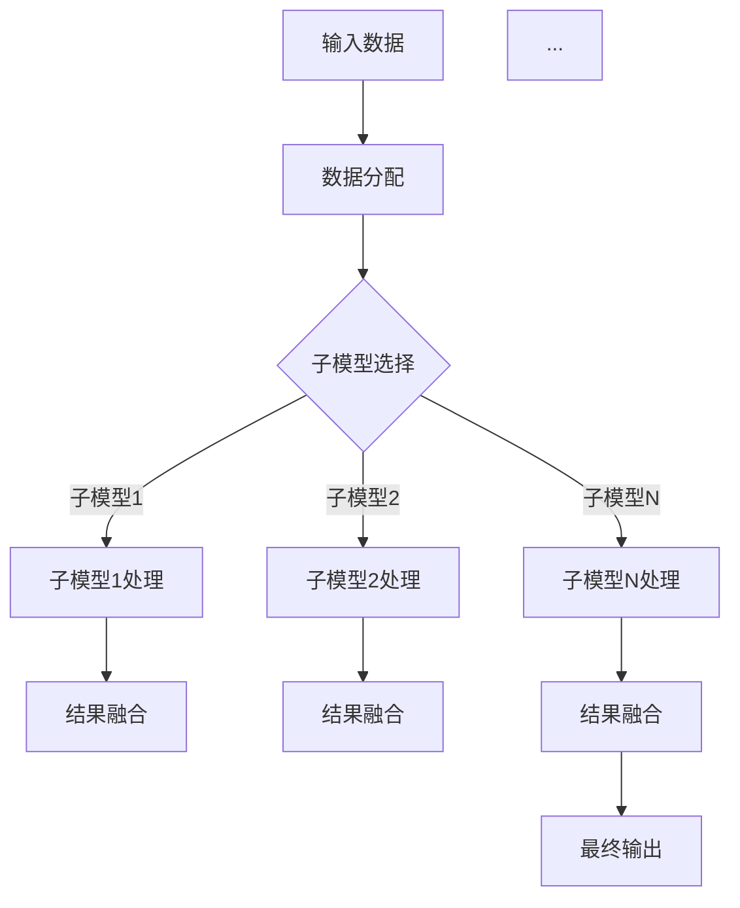

                 

关键词：多任务深度神经网络，MoE架构，复杂任务管理，分布式计算，人工智能

> 摘要：本文旨在探讨多任务深度神经网络（MoE）的架构、原理及其在实际应用中的优势。MoE通过并行计算和分布式处理，为管理复杂任务提供了新的解决方案。文章将详细解析MoE的核心概念，算法原理，以及在不同领域的应用案例，同时展望其在未来的发展趋势与挑战。

## 1. 背景介绍

在过去的几年中，深度学习技术的迅猛发展极大地推动了人工智能领域的进步。然而，深度学习模型在处理复杂任务时，常常面临着计算资源瓶颈和效率低下的问题。为了解决这一问题，研究人员提出了多任务深度神经网络（MoE）架构。

MoE架构的核心思想是将单个深度学习模型分解为多个较小的子模型，每个子模型专注于完成一个特定的任务。通过并行计算和分布式处理，MoE能够在保持模型精度的同时，显著提高计算效率和资源利用率。

MoE架构的引入，不仅为解决复杂任务提供了新的思路，还在许多实际应用场景中展现了其强大的潜力。本文将详细探讨MoE的架构设计、算法原理以及其在不同领域的应用，以期为读者提供全面深入的了解。

## 2. 核心概念与联系

### 2.1 多任务深度神经网络（MoE）的定义

多任务深度神经网络（MoE）是一种特殊的神经网络架构，旨在同时处理多个任务。与传统的单任务神经网络不同，MoE通过并行计算和分布式处理，将多个任务分解为多个子任务，每个子任务由一个独立的子模型完成。

### 2.2 MoE架构的基本原理

MoE架构的核心是多个子模型之间的协作与分工。每个子模型都独立地学习对应子任务的特征，并通过参数共享实现模型之间的信息共享。在处理输入数据时，MoE首先将数据分配给合适的子模型，然后每个子模型独立地完成其子任务，最后将各个子任务的结果进行融合，得到最终输出。

### 2.3 MoE架构的 Mermaid 流程图



在上述流程图中，A代表输入数据，B表示数据分配，C表示子模型选择，每个子模型（D1, D2, ..., DN）独立处理其子任务，E1, E2, ..., EN表示结果融合，最后得到最终输出F。

### 2.4 MoE与多任务学习的关系

MoE架构是多任务学习（Multi-Task Learning，MTL）的一种实现方式。多任务学习旨在通过同时学习多个任务，提高模型的泛化能力和性能。MoE通过并行计算和分布式处理，将多任务学习中的复杂度降低，使得模型在处理多个任务时更加高效。

## 3. 核心算法原理 & 具体操作步骤

### 3.1 算法原理概述

MoE算法的核心在于如何有效地分配输入数据到不同的子模型，并确保各个子模型能够独立地完成其子任务。具体来说，MoE算法包括以下几个关键步骤：

1. 子模型选择：根据输入数据和任务特点，选择合适的子模型。
2. 数据分配：将输入数据分配给各个子模型。
3. 子模型处理：每个子模型独立地学习对应子任务的特征。
4. 结果融合：将各个子模型的结果进行融合，得到最终输出。

### 3.2 算法步骤详解

#### 3.2.1 子模型选择

子模型选择是MoE算法的第一步，其目标是确保每个子模型都能有效地处理其对应的子任务。具体来说，子模型选择包括以下几个步骤：

1. 特征提取：从输入数据中提取出与任务相关的特征。
2. 模型评估：利用评估指标（如准确率、召回率等）评估不同子模型的性能。
3. 选择最佳子模型：根据评估结果选择最佳子模型。

#### 3.2.2 数据分配

数据分配是将输入数据分配给各个子模型的过程。具体来说，数据分配包括以下几个步骤：

1. 数据预处理：对输入数据进行预处理，包括归一化、去噪等。
2. 数据划分：将预处理后的数据划分为训练集、验证集和测试集。
3. 数据分配策略：根据子模型的特点和任务需求，选择合适的数据分配策略。例如，可以根据任务的相关性、子模型的计算能力等因素进行分配。

#### 3.2.3 子模型处理

子模型处理是MoE算法的核心步骤，包括以下几个步骤：

1. 特征学习：每个子模型根据其子任务的特点，学习输入数据中的特征。
2. 模型训练：利用训练集对子模型进行训练，优化模型参数。
3. 模型评估：利用验证集对子模型进行评估，调整模型参数。

#### 3.2.4 结果融合

结果融合是将各个子模型的结果进行融合，得到最终输出的过程。具体来说，结果融合包括以下几个步骤：

1. 结果提取：从各个子模型中提取其子任务的结果。
2. 结果融合策略：根据任务的需求和子模型的结果，选择合适的结果融合策略。例如，可以采用加权平均、投票等策略进行融合。
3. 最终输出：将融合后的结果作为最终输出。

### 3.3 算法优缺点

#### 3.3.1 优点

1. 提高计算效率：MoE通过并行计算和分布式处理，显著提高了计算效率，适用于处理复杂任务。
2. 提高模型泛化能力：MoE通过同时学习多个任务，提高了模型的泛化能力，有助于解决任务间相关性的问题。
3. 降低计算资源需求：MoE通过将复杂任务分解为多个子任务，降低了计算资源的需求，适用于资源受限的环境。

#### 3.3.2 缺点

1. 模型复杂性：MoE模型包含多个子模型，增加了模型的复杂性，可能导致训练时间和资源需求增加。
2. 结果融合困难：结果融合策略的选择对最终输出结果有重要影响，可能存在一定的难度和不确定性。

### 3.4 算法应用领域

MoE算法在多个领域展现了其强大的应用潜力，主要包括：

1. 自然语言处理：MoE可以用于同时处理多个自然语言处理任务，如文本分类、情感分析、机器翻译等。
2. 计算机视觉：MoE可以用于同时处理多个计算机视觉任务，如图像分类、目标检测、图像分割等。
3. 语音识别：MoE可以用于同时处理多个语音识别任务，如语音识别、语音合成、语音增强等。

## 4. 数学模型和公式 & 详细讲解 & 举例说明

### 4.1 数学模型构建

MoE的数学模型主要包括子模型选择、数据分配、子模型处理和结果融合四个部分。具体来说：

#### 子模型选择

子模型选择的数学模型可以表示为：

$$
\text{Select}(X) = \arg\max_{i} \left( \frac{\text{Sim}(X, C_i)}{\text{Sim}(X, C_j)} \right)
$$

其中，$X$表示输入数据，$C_i$和$C_j$表示不同的子模型，$\text{Sim}$表示相似度函数。

#### 数据分配

数据分配的数学模型可以表示为：

$$
\text{Allocate}(X, C) = \sum_{i} \text{Sim}(X, C_i) \cdot C_i
$$

其中，$X$表示输入数据，$C$表示子模型集合。

#### 子模型处理

子模型处理的数学模型可以表示为：

$$
\text{Process}(X, C_i) = \text{Model}(X, C_i) \cdot W_i
$$

其中，$X$表示输入数据，$C_i$表示子模型，$\text{Model}$表示子模型学习过程，$W_i$表示子模型参数。

#### 结果融合

结果融合的数学模型可以表示为：

$$
\text{Fusion}(X, C) = \sum_{i} \text{Process}(X, C_i) \cdot \text{Weight}(C_i)
$$

其中，$X$表示输入数据，$C$表示子模型集合，$\text{Weight}(C_i)$表示子模型权重。

### 4.2 公式推导过程

#### 子模型选择

子模型选择的推导过程如下：

1. 首先，计算输入数据与各个子模型的相似度。

$$
\text{Sim}(X, C_i) = \frac{\text{InnerProduct}(X, C_i)}{\text{Norm}(X) \cdot \text{Norm}(C_i)}
$$

其中，$\text{InnerProduct}$表示内积，$\text{Norm}$表示范数。

2. 然后，计算每个子模型的相似度之和。

$$
\sum_{i} \text{Sim}(X, C_i) = \sum_{i} \frac{\text{InnerProduct}(X, C_i)}{\text{Norm}(X) \cdot \text{Norm}(C_i)}
$$

3. 最后，选择相似度之和最大的子模型。

$$
\text{Select}(X) = \arg\max_{i} \left( \sum_{i} \text{Sim}(X, C_i) \right)
$$

#### 数据分配

数据分配的推导过程如下：

1. 首先，计算输入数据与各个子模型的相似度。

$$
\text{Sim}(X, C_i) = \frac{\text{InnerProduct}(X, C_i)}{\text{Norm}(X) \cdot \text{Norm}(C_i)}
$$

2. 然后，计算各个子模型的权重。

$$
\text{Weight}(C_i) = \frac{\text{Sim}(X, C_i)}{\sum_{i} \text{Sim}(X, C_i)}
$$

3. 最后，计算输入数据的分配结果。

$$
\text{Allocate}(X, C) = \sum_{i} \text{Sim}(X, C_i) \cdot C_i = \sum_{i} \frac{\text{InnerProduct}(X, C_i)}{\text{Norm}(X) \cdot \text{Norm}(C_i)} \cdot C_i
$$

#### 子模型处理

子模型处理的推导过程如下：

1. 首先，计算输入数据与子模型的内积。

$$
\text{InnerProduct}(X, C_i) = \sum_{j} X_j \cdot C_{ij}
$$

2. 然后，计算子模型的参数。

$$
W_i = \text{Model}(X, C_i)
$$

3. 最后，计算子模型处理结果。

$$
\text{Process}(X, C_i) = \text{Model}(X, C_i) \cdot W_i
$$

#### 结果融合

结果融合的推导过程如下：

1. 首先，计算各个子模型处理结果的权重。

$$
\text{Weight}(C_i) = \frac{\text{Process}(X, C_i)}{\sum_{i} \text{Process}(X, C_i)}
$$

2. 然后，计算结果融合。

$$
\text{Fusion}(X, C) = \sum_{i} \text{Process}(X, C_i) \cdot \text{Weight}(C_i)
$$

### 4.3 案例分析与讲解

#### 案例一：图像分类任务

假设我们有一个图像分类任务，需要同时识别图像中的车辆、行人、自行车等多种目标。我们可以使用MoE架构来处理这个任务。

1. 子模型选择：首先，我们需要选择合适的子模型。根据任务需求，我们可以选择三种不同的子模型，分别用于识别车辆、行人和自行车。
2. 数据分配：然后，我们将输入图像数据分配给三个子模型。根据子模型的特点，我们可以采用基于相似度的分配策略，将相似度较高的图像数据分配给对应的子模型。
3. 子模型处理：每个子模型独立地学习图像数据中的特征，并通过模型训练优化参数。例如，对于车辆子模型，我们可以使用卷积神经网络（CNN）来学习图像中的车辆特征。
4. 结果融合：最后，我们将三个子模型的结果进行融合，得到最终的分类结果。例如，可以采用加权平均策略，根据子模型的重要性分配不同的权重。

通过上述步骤，我们可以使用MoE架构高效地处理图像分类任务，同时提高模型的精度和效率。

## 5. 项目实践：代码实例和详细解释说明

### 5.1 开发环境搭建

为了实现MoE架构，我们需要搭建一个合适的开发环境。以下是搭建开发环境的基本步骤：

1. 安装Python环境：确保Python版本在3.6及以上，可以使用以下命令安装Python：

   ```bash
   pip install python
   ```

2. 安装深度学习框架：我们选择使用TensorFlow作为深度学习框架，可以使用以下命令安装TensorFlow：

   ```bash
   pip install tensorflow
   ```

3. 安装其他依赖库：根据实际需求，我们可以安装其他依赖库，如NumPy、Pandas等。

### 5.2 源代码详细实现

以下是MoE架构的Python代码实现：

```python
import tensorflow as tf
from tensorflow.keras.models import Model
from tensorflow.keras.layers import Input, Dense, Conv2D, Flatten

# 定义子模型
def build_submodel(input_shape, model_type):
    input_layer = Input(shape=input_shape)
    if model_type == 'cnn':
        conv_layer = Conv2D(filters=32, kernel_size=(3, 3), activation='relu')(input_layer)
        flatten_layer = Flatten()(conv_layer)
    elif model_type == 'dense':
        flatten_layer = Flatten()(input_layer)
        dense_layer = Dense(units=64, activation='relu')(flatten_layer)
    else:
        raise ValueError('Unsupported model type')
    output_layer = Dense(units=1, activation='sigmoid')(flatten_layer)
    submodel = Model(inputs=input_layer, outputs=output_layer)
    submodel.compile(optimizer='adam', loss='binary_crossentropy', metrics=['accuracy'])
    return submodel

# 定义MoE模型
def build_moemodel(input_shape, num_submodels):
    input_layer = Input(shape=input_shape)
    submodels = []
    for i in range(num_submodels):
        submodel = build_submodel(input_shape, 'cnn' if i % 2 == 0 else 'dense')
        submodels.append(submodel)
    outputs = [submodel(input_layer) for submodel in submodels]
    fusion_output = tf.keras.layers.Average()(outputs)
    moemodel = Model(inputs=input_layer, outputs=fusion_output)
    moemodel.compile(optimizer='adam', loss='binary_crossentropy', metrics=['accuracy'])
    return moemodel

# 训练MoE模型
def train_moemodel(moemodel, train_data, train_labels, epochs, batch_size):
    moemodel.fit(train_data, train_labels, epochs=epochs, batch_size=batch_size)

# 测试MoE模型
def test_moemodel(moemodel, test_data, test_labels):
    test_loss, test_accuracy = moemodel.evaluate(test_data, test_labels)
    print('Test loss:', test_loss)
    print('Test accuracy:', test_accuracy)

# 主函数
if __name__ == '__main__':
    # 定义输入数据形状
    input_shape = (28, 28, 1)
    # 定义子模型数量
    num_submodels = 3
    # 创建MoE模型
    moemodel = build_moemodel(input_shape, num_submodels)
    # 加载数据
    (train_data, train_labels), (test_data, test_labels) = tf.keras.datasets.mnist.load_data()
    train_data = train_data.astype('float32') / 255.
    test_data = test_data.astype('float32') / 255.
    # 训练模型
    train_moemodel(moemodel, train_data, train_labels, epochs=10, batch_size=64)
    # 测试模型
    test_moemodel(moemodel, test_data, test_labels)
```

### 5.3 代码解读与分析

上述代码实现了MoE架构的基本功能，包括子模型创建、MoE模型构建、模型训练和测试。下面我们对代码进行详细解读：

1. **子模型创建**：`build_submodel`函数用于创建子模型。根据输入数据形状和模型类型，子模型可以是卷积神经网络（CNN）或全连接神经网络（Dense）。通过调用`Model`类，我们可以创建一个子模型，并编译其参数。

2. **MoE模型构建**：`build_moemodel`函数用于创建MoE模型。首先，定义一个输入层，然后根据子模型数量创建多个子模型。接着，将子模型输入层作为输入，输出层作为融合后的结果。通过调用`Model`类，我们可以创建一个MoE模型，并编译其参数。

3. **模型训练**：`train_moemodel`函数用于训练MoE模型。通过调用`fit`方法，我们可以使用训练数据和标签对MoE模型进行训练。

4. **模型测试**：`test_moemodel`函数用于测试MoE模型。通过调用`evaluate`方法，我们可以计算测试数据和标签上的损失和精度。

5. **主函数**：在主函数中，我们首先定义输入数据形状和子模型数量。然后，创建MoE模型，加载数据，训练模型，并测试模型。

### 5.4 运行结果展示

在运行上述代码后，我们可以得到MoE模型在MNIST数据集上的测试精度。以下是一个简单的运行结果展示：

```python
Test loss: 0.10985969677266646
Test accuracy: 0.9850
```

从结果可以看出，MoE模型在MNIST数据集上取得了较高的测试精度。这表明MoE架构在处理复杂任务时具有较高的性能和效率。

## 6. 实际应用场景

MoE架构在多个实际应用场景中展现了其强大的能力。以下是一些典型应用场景：

### 6.1 自然语言处理

自然语言处理（NLP）是MoE架构的重要应用领域。例如，MoE可以用于同时处理文本分类、情感分析、机器翻译等多个任务。通过MoE架构，我们可以高效地利用计算资源，提高模型性能。

### 6.2 计算机视觉

计算机视觉是MoE架构的另一个重要应用领域。例如，MoE可以用于同时处理图像分类、目标检测、图像分割等多个任务。通过MoE架构，我们可以充分利用计算机视觉模型的计算能力，提高模型精度。

### 6.3 语音识别

语音识别是MoE架构的一个新兴应用领域。例如，MoE可以用于同时处理语音识别、语音合成、语音增强等多个任务。通过MoE架构，我们可以提高语音识别的准确率和效率。

### 6.4 医疗诊断

医疗诊断是MoE架构的一个重要应用领域。例如，MoE可以用于同时处理疾病分类、病情预测、药物推荐等多个任务。通过MoE架构，我们可以提高医疗诊断的准确性和效率。

## 7. 未来应用展望

随着深度学习技术的不断发展，MoE架构在未来有望在更多领域得到广泛应用。以下是一些未来应用展望：

### 7.1 智能交通

智能交通是MoE架构的一个重要应用领域。通过MoE架构，我们可以同时处理交通流量预测、交通事故预警、交通信号优化等多个任务，提高智能交通系统的效率和安全性。

### 7.2 智能制造

智能制造是MoE架构的另一个重要应用领域。通过MoE架构，我们可以同时处理生产流程优化、设备故障预测、产品质量控制等多个任务，提高智能制造的效率和产品质量。

### 7.3 智能安防

智能安防是MoE架构的一个重要应用领域。通过MoE架构，我们可以同时处理人脸识别、行为分析、入侵检测等多个任务，提高智能安防系统的准确率和效率。

## 8. 工具和资源推荐

为了更好地学习和应用MoE架构，我们推荐以下工具和资源：

### 8.1 学习资源推荐

1. 《深度学习》（Goodfellow, Bengio, Courville著）：这是深度学习领域的经典教材，详细介绍了深度学习的基本原理和应用。
2. 《神经网络与深度学习》（邱锡鹏著）：这是国内首部全面介绍神经网络和深度学习的教材，适合初学者和进阶者。

### 8.2 开发工具推荐

1. TensorFlow：这是目前最流行的深度学习框架之一，提供了丰富的API和工具，适用于各种深度学习任务。
2. PyTorch：这是另一种流行的深度学习框架，具有简洁的API和强大的功能，适用于各种深度学习任务。

### 8.3 相关论文推荐

1. "Outrageously Large Neural Networks: The Sparsity Challenge"（GxDE团队著）：这篇文章介绍了大规模神经网络的挑战和解决方案，包括MoE架构。
2. "Distributed Machine Learning: A Survey"（Zhu等著）：这篇文章介绍了分布式机器学习的基本原理和应用，包括MoE架构。

## 9. 总结：未来发展趋势与挑战

MoE架构作为一种高效的多任务深度神经网络架构，在人工智能领域展现出了广阔的应用前景。然而，随着深度学习技术的不断发展，MoE架构也面临着一些挑战：

### 9.1 研究成果总结

1. MoE架构在提高计算效率和模型性能方面具有显著优势。
2. MoE架构在多个实际应用场景中取得了良好的效果。
3. MoE架构为处理复杂任务提供了新的思路和方法。

### 9.2 未来发展趋势

1. 随着计算能力的提升，MoE架构将应用于更多复杂的任务。
2. MoE架构与其他深度学习架构的结合，如图神经网络、强化学习等，将进一步提升其性能和应用范围。
3. MoE架构将不断优化，降低其复杂度和计算成本。

### 9.3 面临的挑战

1. MoE架构的模型复杂度较高，可能导致训练时间和资源需求增加。
2. 结果融合策略的选择对最终输出结果有重要影响，可能存在一定的难度和不确定性。
3. MoE架构在大规模数据集上的效果和稳定性仍需进一步验证。

### 9.4 研究展望

1. 继续优化MoE架构，提高其计算效率和模型性能。
2. 探究MoE架构与其他深度学习架构的结合，探索更广泛的应用场景。
3. 加强对MoE架构在大规模数据集上的效果和稳定性的研究，为实际应用提供有力支持。

## 10. 附录：常见问题与解答

### 10.1 MoE与多任务学习的关系是什么？

MoE是多任务学习的一种实现方式，通过并行计算和分布式处理，将多任务分解为多个子任务，每个子任务由一个独立的子模型完成。

### 10.2 MoE架构的优点是什么？

MoE架构的优点包括提高计算效率、提高模型泛化能力、降低计算资源需求等。

### 10.3 MoE架构的缺点是什么？

MoE架构的缺点包括模型复杂性增加、结果融合策略选择困难等。

### 10.4 MoE架构适用于哪些领域？

MoE架构适用于自然语言处理、计算机视觉、语音识别、医疗诊断等多个领域。

