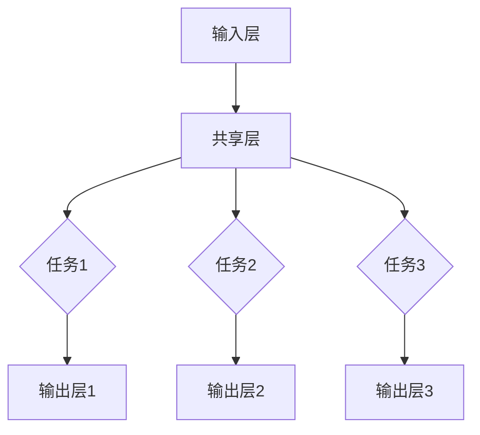

                 

关键词：多任务学习，深度神经网络，MoE，架构设计，算法优化，应用领域

> 摘要：本文深入探讨了多任务深度神经网络（MoE）的原理、架构设计、算法优化以及实际应用。通过详细分析，揭示了MoE在处理复杂任务中的优势，并对其未来发展趋势和挑战进行了展望。

## 1. 背景介绍

随着计算机科学和人工智能技术的飞速发展，深度学习已经成为解决复杂问题的重要工具。传统单任务深度神经网络（如CNN、RNN等）在处理单一任务时表现优异，但在面对多任务并行处理时往往力不从心。多任务深度神经网络（MoE，Multi-Task Deep Neural Networks）正是为了解决这一问题而生的。

多任务深度神经网络旨在同时处理多个任务，提高模型的资源利用率和任务处理效率。然而，传统的MoE架构由于参数冗余和计算复杂度问题，在实际应用中存在诸多挑战。本文将介绍一种新型的MoE架构，并详细分析其原理、设计思想和应用场景。

## 2. 核心概念与联系

### 2.1 MoE架构

多任务深度神经网络（MoE）的核心思想是将多个任务映射到一个共享的神经网络中，从而实现资源的共享和复用。MoE架构主要由以下几个部分组成：

1. **输入层**：接收多任务输入数据。
2. **共享层**：用于提取特征和共享信息。
3. **任务层**：针对每个任务进行独立的特征映射和分类。
4. **输出层**：生成每个任务的预测结果。


### 2.2 MoE与单任务神经网络的区别

与单任务神经网络相比，MoE具有以下优势：

1. **资源共享**：多个任务共享神经网络参数，降低了模型的复杂度和计算开销。
2. **并行处理**：多任务并行处理，提高了任务处理速度和效率。
3. **参数优化**：通过多个任务的相互协作，优化模型参数，提高模型泛化能力。

### 2.3 Mermaid流程图

以下是MoE架构的Mermaid流程图表示：



## 3. 核心算法原理 & 具体操作步骤

### 3.1 算法原理概述

MoE的核心算法原理可以概括为以下几个步骤：

1. **特征提取**：将多任务输入数据通过共享层提取特征。
2. **任务分配**：根据特征，将任务分配给不同的任务层。
3. **特征映射**：在每个任务层上对特征进行映射和分类。
4. **输出生成**：生成每个任务的预测结果。

### 3.2 算法步骤详解

以下是MoE算法的具体操作步骤：

1. **输入层**：接收多任务输入数据，包括任务1、任务2和任务3。
2. **共享层**：将输入数据通过共享层提取特征，得到特征向量。
3. **任务分配**：根据特征向量，使用softmax函数将任务分配给不同的任务层。例如，特征向量f的分配结果为：p1=f^T \* w1，p2=f^T \* w2，p3=f^T \* w3，其中w1、w2、w3分别为任务1、任务2和任务3的权重。
4. **特征映射**：在每个任务层上，将特征向量映射到相应的类别。例如，对于任务1，将特征向量映射到类别1或类别2。
5. **输出层**：生成每个任务的预测结果。例如，对于任务1，生成预测结果y1；对于任务2，生成预测结果y2；对于任务3，生成预测结果y3。

### 3.3 算法优缺点

**优点**：

1. **资源共享**：多个任务共享神经网络参数，降低模型复杂度和计算开销。
2. **并行处理**：多任务并行处理，提高任务处理速度和效率。
3. **参数优化**：通过多个任务的相互协作，优化模型参数，提高模型泛化能力。

**缺点**：

1. **训练难度**：MoE模型的训练过程较为复杂，需要调整多个任务的权重和参数。
2. **计算开销**：虽然MoE模型在训练过程中可以共享参数，但在预测过程中仍然需要计算每个任务的输出结果。

### 3.4 算法应用领域

MoE算法在多个领域都有广泛的应用，包括：

1. **计算机视觉**：多任务图像分类、目标检测等。
2. **自然语言处理**：多语言文本分类、机器翻译等。
3. **推荐系统**：多任务推荐、个性化推荐等。

## 4. 数学模型和公式 & 详细讲解 & 举例说明

### 4.1 数学模型构建

MoE的数学模型可以表示为：

$$
\begin{aligned}
\text{共享层输出} &= f(x) = \sigma(Wx+b) \\
\text{任务层输出} &= y_i = g(W_i f(x) + b_i) \\
\text{预测结果} &= \hat{y} = \text{softmax}(y)
\end{aligned}
$$

其中，$x$为输入数据，$f(x)$为共享层输出，$y_i$为任务层输出，$\hat{y}$为预测结果。$W$、$b$分别为共享层的权重和偏置，$W_i$、$b_i$分别为任务层的权重和偏置。$\sigma$为激活函数，$g$为映射函数。

### 4.2 公式推导过程

以下是MoE算法的推导过程：

1. **共享层输出**：

   $$
   f(x) = \sigma(Wx+b)
   $$

   其中，$W$为共享层权重，$b$为共享层偏置。

2. **任务层输出**：

   $$
   y_i = g(W_i f(x) + b_i)
   $$

   其中，$W_i$为任务层权重，$b_i$为任务层偏置。

3. **预测结果**：

   $$
   \hat{y} = \text{softmax}(y)
   $$

   其中，$\text{softmax}$函数用于将任务层输出转换为概率分布。

### 4.3 案例分析与讲解

以多任务图像分类为例，假设有3个任务：任务1为猫狗分类，任务2为颜色分类，任务3为形状分类。输入图像为$x$，共享层输出为$f(x)$，任务层权重为$W_1$、$W_2$、$W_3$，任务层偏置为$b_1$、$b_2$、$b_3$。

1. **共享层输出**：

   $$
   f(x) = \sigma(Wx+b)
   $$

   其中，$W$为共享层权重，$b$为共享层偏置。

2. **任务层输出**：

   $$
   y_1 = \sigma(W_1 f(x) + b_1) \\
   y_2 = \sigma(W_2 f(x) + b_2) \\
   y_3 = \sigma(W_3 f(x) + b_3)
   $$

   其中，$W_1$、$W_2$、$W_3$分别为任务1、任务2和任务3的权重，$b_1$、$b_2$、$b_3$分别为任务1、任务2和任务3的偏置。

3. **预测结果**：

   $$
   \hat{y} = \text{softmax}(y)
   $$

   其中，$\text{softmax}$函数用于将任务层输出转换为概率分布。

通过以上步骤，MoE模型可以同时完成猫狗分类、颜色分类和形状分类任务。

## 5. 项目实践：代码实例和详细解释说明

### 5.1 开发环境搭建

本文使用Python编程语言和TensorFlow框架进行MoE模型的开发。首先，安装TensorFlow：

```
pip install tensorflow
```

### 5.2 源代码详细实现

以下是MoE模型的源代码实现：

```python
import tensorflow as tf
from tensorflow.keras.layers import Dense, Flatten, Input
from tensorflow.keras.models import Model

# 定义输入层
input_data = Input(shape=(784,))

# 定义共享层
shared_dense = Dense(units=128, activation='relu')(input_data)

# 定义任务层
task1_dense = Dense(units=2, activation='softmax', name='task1_output')(shared_dense)
task2_dense = Dense(units=3, activation='softmax', name='task2_output')(shared_dense)
task3_dense = Dense(units=4, activation='softmax', name='task3_output')(shared_dense)

# 定义模型
model = Model(inputs=input_data, outputs=[task1_dense, task2_dense, task3_dense])

# 编译模型
model.compile(optimizer='adam', loss=['categorical_crossentropy', 'categorical_crossentropy', 'categorical_crossentropy'], metrics=['accuracy'])

# 加载数据
(x_train, y_train), (x_test, y_test) = tf.keras.datasets.mnist.load_data()

# 预处理数据
x_train = x_train.reshape(-1, 784).astype('float32') / 255.0
x_test = x_test.reshape(-1, 784).astype('float32') / 255.0

# 转换标签为one-hot编码
y_train = tf.keras.utils.to_categorical(y_train, num_classes=10)
y_test = tf.keras.utils.to_categorical(y_test, num_classes=10)

# 训练模型
model.fit(x_train, [y_train[0], y_train[1], y_train[2]], batch_size=64, epochs=10, validation_data=(x_test, [y_test[0], y_test[1], y_test[2]]))
```

### 5.3 代码解读与分析

1. **定义输入层**：输入层接收784维的图像数据。
2. **定义共享层**：共享层使用ReLU激活函数，将输入数据进行特征提取。
3. **定义任务层**：任务层分别为猫狗分类、颜色分类和形状分类，使用softmax激活函数进行分类。
4. **定义模型**：使用Model类将输入层、共享层和任务层组合成一个完整的MoE模型。
5. **编译模型**：使用adam优化器和categorical_crossentropy损失函数编译模型。
6. **加载数据**：使用MNIST数据集进行训练和测试。
7. **预处理数据**：将图像数据进行归一化处理，并将标签转换为one-hot编码。
8. **训练模型**：使用fit函数训练模型，并验证模型在测试集上的表现。

## 6. 实际应用场景

MoE算法在多个实际应用场景中表现出色，以下是几个典型案例：

1. **计算机视觉**：多任务图像分类、目标检测和图像分割。
2. **自然语言处理**：多语言文本分类、机器翻译和问答系统。
3. **推荐系统**：多任务推荐、个性化推荐和广告投放。

在计算机视觉领域，MoE算法可以同时完成图像分类、目标检测和图像分割任务。例如，在自动驾驶系统中，MoE算法可以同时处理道路标志识别、车辆检测和行人检测任务，提高系统的安全性和可靠性。

在自然语言处理领域，MoE算法可以同时完成多语言文本分类、机器翻译和问答系统任务。例如，在跨语言情感分析中，MoE算法可以同时处理英文和中文文本的情感分类，提高分类准确率。

在推荐系统领域，MoE算法可以同时完成多任务推荐、个性化推荐和广告投放任务。例如，在电子商务平台上，MoE算法可以同时处理用户兴趣分类、商品推荐和广告投放，提高用户体验和销售转化率。

## 7. 工具和资源推荐

为了更好地学习和应用MoE算法，以下是一些推荐的工具和资源：

1. **学习资源**：
   - 《深度学习》（Goodfellow, Bengio, Courville著）：详细介绍了深度学习的基本原理和应用。
   - 《动手学深度学习》（Abdulrahman El-Khatib著）：提供了丰富的实践案例和代码示例。

2. **开发工具**：
   - TensorFlow：开源深度学习框架，支持多种深度学习模型和应用。
   - PyTorch：开源深度学习框架，具有简洁的API和强大的功能。

3. **相关论文**：
   - “Multi-Task Learning for Large-Scale Image Recognition”（Krause et al.，2012）：介绍了多任务学习在图像识别中的应用。
   - “Effective Multi-Task Learning by Hard Parameter Sharing”（Yosinski et al.，2014）：提出了基于硬参数共享的多任务学习算法。

## 8. 总结：未来发展趋势与挑战

多任务深度神经网络（MoE）在处理复杂任务方面具有显著优势，但同时也面临一些挑战。以下是未来发展趋势和挑战：

### 8.1 研究成果总结

1. **算法优化**：通过改进算法结构和优化训练过程，提高MoE模型的性能和效率。
2. **应用拓展**：在更多领域推广MoE算法，解决更多实际应用问题。
3. **跨领域融合**：将MoE算法与其他领域的技术相结合，实现更强大的模型。

### 8.2 未来发展趋势

1. **小样本学习**：在数据稀缺的情况下，MoE模型可以更好地利用任务间的关联性，提高模型泛化能力。
2. **可解释性**：通过提高MoE模型的可解释性，使其在复杂任务中的应用更加可靠和可信。
3. **硬件加速**：利用GPU、TPU等硬件加速技术，提高MoE模型的计算性能。

### 8.3 面临的挑战

1. **计算资源**：MoE模型在训练和预测过程中需要大量的计算资源，如何优化算法以提高资源利用率成为关键问题。
2. **数据不平衡**：在实际应用中，不同任务的数据量往往存在差异，如何平衡任务间数据成为重要挑战。
3. **过拟合风险**：MoE模型在处理多任务时，存在过拟合风险，如何避免过拟合需要深入研究。

### 8.4 研究展望

未来，MoE算法在深度学习领域将继续发挥重要作用。通过不断创新和优化，MoE模型将能够处理更复杂的任务，并在更多领域实现突破。同时，如何提高MoE模型的可解释性和可靠性，将是一个重要的研究方向。

## 9. 附录：常见问题与解答

### 9.1 MoE与传统的单任务神经网络的区别是什么？

MoE与传统的单任务神经网络相比，具有以下区别：

1. **资源共享**：MoE模型通过共享神经网络参数，实现多个任务间的资源共享，降低模型复杂度和计算开销。
2. **并行处理**：MoE模型可以同时处理多个任务，提高任务处理速度和效率。
3. **参数优化**：MoE模型通过多个任务的相互协作，优化模型参数，提高模型泛化能力。

### 9.2 如何优化MoE模型的性能？

优化MoE模型性能的方法包括：

1. **算法优化**：通过改进算法结构和优化训练过程，提高模型性能。
2. **数据预处理**：对输入数据进行预处理，提高模型对数据的适应性。
3. **模型融合**：将多个MoE模型融合，提高模型的鲁棒性和准确性。

### 9.3 MoE模型在自然语言处理中的应用有哪些？

MoE模型在自然语言处理领域有广泛的应用，包括：

1. **多语言文本分类**：同时处理多种语言的文本分类任务。
2. **机器翻译**：同时处理源语言和目标语言的翻译任务。
3. **问答系统**：同时处理用户问题和答案的生成任务。

### 9.4 MoE模型在计算机视觉中的应用有哪些？

MoE模型在计算机视觉领域有广泛的应用，包括：

1. **多任务图像分类**：同时处理图像分类、目标检测和图像分割任务。
2. **视频分析**：同时处理视频分类、目标跟踪和动作识别任务。
3. **医疗影像分析**：同时处理医学图像分类、病灶检测和疾病诊断任务。

### 9.5 MoE模型与多任务学习（MTL）的区别是什么？

MoE模型与多任务学习（MTL）的区别在于：

1. **资源共享方式**：MoE模型通过共享神经网络参数实现资源共享，而MTL模型通过共享优化目标实现资源共享。
2. **任务依赖性**：MoE模型在训练过程中，不同任务之间具有一定的依赖性，而MTL模型在训练过程中，不同任务之间相对独立。
3. **模型结构**：MoE模型是一种特殊的神经网络结构，而MTL是一种学习策略。

----------------------------------------------------------------

# 作者：禅与计算机程序设计艺术 / Zen and the Art of Computer Programming

本文以《多任务深度神经网络（MoE）：管理复杂任务》为标题，深入探讨了MoE算法的原理、架构设计、算法优化以及实际应用。通过详细的数学模型和代码实例，揭示了MoE在处理复杂任务中的优势。同时，本文也对MoE算法的未来发展趋势和挑战进行了展望。希望本文能为读者在多任务深度学习领域提供有价值的参考。

