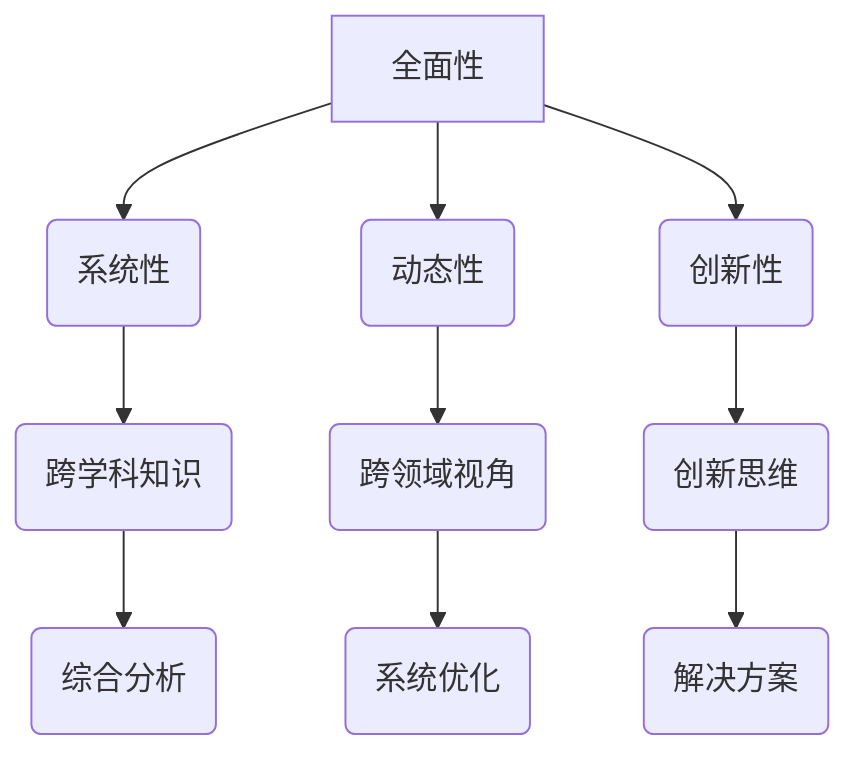

                 

关键词：多元模型思维、认知水平、管理者、模型构建、算法原理、数学模型、项目实践、未来展望

> 摘要：本文旨在探讨多元模型思维在提升管理者认知水平方面的重要性。通过介绍多元模型的基本概念、核心原理及其在管理实践中的应用，本文旨在为管理者提供一种全新的思考方式和工具，以帮助他们更好地应对复杂的管理挑战，提升个人和团队的工作效率。

## 1. 背景介绍

在现代社会，管理者的角色变得越来越重要。无论是企业、政府机构还是非营利组织，管理者都需要具备高超的领导力和决策能力，以应对不断变化的市场环境和复杂的管理问题。然而，随着全球化、信息技术、人工智能等新兴领域的快速发展，管理者所面临的问题变得更加复杂，传统的单一思维模式已经无法满足需求。

多元模型思维作为一种新兴的管理理念，强调通过多种不同的模型和方法来分析和解决问题。它不仅包括传统的定量分析模型，还涵盖定性分析模型、系统模型、决策模型等多种类型。通过多元模型思维，管理者可以更全面、深入地理解问题，从而做出更为准确和有效的决策。

本文将首先介绍多元模型思维的基本概念和核心原理，然后探讨其在管理实践中的应用，最后讨论多元模型思维对管理者认知水平的提升作用。

## 2. 核心概念与联系

### 2.1 多元模型思维定义

多元模型思维（Multimodel Thinking）是一种融合多种模型和方法来理解和解决问题的思维方式。它强调从多个角度、多个层面来分析问题，以达到更全面、更深入的认知。多元模型思维不仅仅是一种技术工具，更是一种思维方式，它要求管理者具备跨学科、跨领域的知识体系和思维方式。

### 2.2 多元模型思维的核心原理

多元模型思维的核心原理包括以下几个方面：

1. **全面性**：多元模型思维要求管理者不仅要关注问题的表面现象，还要深入挖掘问题的本质和内在联系。通过从多个角度、多个层面来分析问题，管理者可以更全面地了解问题的各个方面。

2. **系统性**：多元模型思维强调将问题视为一个系统，分析系统内部各要素之间的相互关系和影响。通过系统性的分析，管理者可以更好地理解问题的复杂性和多样性。

3. **动态性**：多元模型思维认为问题是一个动态变化的过程，需要不断调整和优化解决方案。管理者需要具备动态分析问题的能力，及时应对变化和不确定性。

4. **创新性**：多元模型思维鼓励管理者运用创新思维来解决问题。通过结合多种模型和方法，管理者可以找到更为独特和有效的解决方案。

### 2.3 多元模型思维的 Mermaid 流程图

以下是一个简化的 Mermaid 流程图，展示了多元模型思维的核心原理和联系：



## 3. 核心算法原理 & 具体操作步骤

### 3.1 算法原理概述

多元模型思维的核心算法原理可以概括为以下几个步骤：

1. **问题识别**：首先，管理者需要明确问题，并将其分解为多个子问题。

2. **模型选择**：根据问题的特点，选择适合的模型和方法进行分析。常见的模型包括数据模型、决策模型、系统模型、定性分析模型等。

3. **模型融合**：将多个模型的结果进行融合，形成更全面、更深入的分析结果。

4. **解决方案**：基于分析结果，制定相应的解决方案，并进行实施和验证。

### 3.2 算法步骤详解

1. **问题识别**：管理者需要通过收集信息、分析数据等方式，明确问题的本质和内在联系。

2. **模型选择**：根据问题的特点，选择适合的模型和方法。例如，对于复杂的管理问题，可以选择数据模型进行定量分析，对于抽象的问题，可以选择定性分析模型进行深入探讨。

3. **模型融合**：将多个模型的结果进行融合，形成更全面、更深入的分析结果。这可以通过以下几种方式实现：

   - **加权融合**：根据不同模型的重要性和可信度，为每个模型分配权重，然后进行加权融合。
   - **层次融合**：将模型按照层次结构进行融合，例如先进行数据模型的定量分析，然后进行决策模型和系统模型的定性分析。
   - **并行融合**：同时使用多个模型进行问题分析，然后进行结果整合。

4. **解决方案**：基于分析结果，制定相应的解决方案。解决方案可以包括策略、计划、行动等。

5. **实施和验证**：将解决方案付诸实践，并进行效果评估和验证。根据实际情况进行调整和优化。

### 3.3 算法优缺点

**优点**：

1. **全面性**：多元模型思维可以提供更全面、更深入的问题分析，帮助管理者更好地理解问题的各个方面。
2. **灵活性**：多元模型思维可以根据问题的特点，选择合适的模型和方法，具有很高的灵活性。
3. **创新性**：多元模型思维鼓励管理者运用创新思维，找到更独特、更有效的解决方案。

**缺点**：

1. **复杂性**：多元模型思维涉及多个模型和方法，可能会导致问题分析的复杂性增加。
2. **时间成本**：多元模型思维需要投入更多的时间和精力来分析问题，可能会增加管理者的工作负担。

### 3.4 算法应用领域

多元模型思维可以应用于各个领域的管理问题，以下是几个常见的应用领域：

1. **企业战略规划**：通过多元模型思维，管理者可以更全面地分析市场环境、竞争对手、内部资源等因素，制定更科学的战略规划。
2. **风险管理**：多元模型思维可以帮助管理者识别和管理各种风险，提高企业的风险抵御能力。
3. **人力资源管理**：多元模型思维可以帮助管理者更准确地评估员工能力、绩效和发展潜力，制定更有效的招聘和培养计划。
4. **项目管理**：多元模型思维可以帮助项目经理更全面地分析项目风险、资源和进度，提高项目的成功率。

## 4. 数学模型和公式 & 详细讲解 & 举例说明

### 4.1 数学模型构建

在多元模型思维中，数学模型是一种重要的工具，可以帮助管理者更精确地分析和解决问题。以下是一个简单的线性回归模型的构建过程：

1. **数据收集**：收集与问题相关的数据，例如销售收入、广告投入等。
2. **变量定义**：定义自变量（例如广告投入）和因变量（例如销售收入）。
3. **模型构建**：使用最小二乘法构建线性回归模型，公式如下：

   $$
   y = ax + b
   $$

   其中，$y$ 是因变量，$x$ 是自变量，$a$ 是斜率，$b$ 是截距。

### 4.2 公式推导过程

线性回归模型的公式推导基于最小二乘法。假设我们有一个包含 $n$ 个观测值的样本，每个观测值包含一个自变量 $x_i$ 和一个因变量 $y_i$。我们的目标是找到最佳拟合直线，使得观测值与拟合直线的误差最小。

1. **误差计算**：计算每个观测值与拟合直线的误差，公式如下：

   $$
   \epsilon_i = y_i - (ax_i + b)
   $$

2. **误差平方和**：计算所有观测值的误差平方和，公式如下：

   $$
   S = \sum_{i=1}^{n} \epsilon_i^2
   $$

3. **最小化误差平方和**：通过求导和极值分析，找到最佳拟合直线的参数 $a$ 和 $b$，使得误差平方和最小。

### 4.3 案例分析与讲解

假设我们研究广告投入对销售收入的影响，收集了以下数据：

| 广告投入（万元） | 销售收入（万元） |
| :------------: | :------------: |
|       10      |       30      |
|       20      |       50      |
|       30      |       70      |
|       40      |       90      |
|       50      |      110      |

我们使用线性回归模型进行分析，并得到以下结果：

- 斜率 $a = 1.5$
- 截距 $b = 5$

根据这些参数，我们可以构建线性回归模型：

$$
y = 1.5x + 5
$$

这个模型表明，每增加一万元的广告投入，销售收入将增加 1.5 万元。我们可以使用这个模型进行预测，例如，当广告投入为 60 万元时，预测的销售收入为：

$$
y = 1.5 \times 60 + 5 = 95
$$

## 5. 项目实践：代码实例和详细解释说明

### 5.1 开发环境搭建

为了演示多元模型思维在项目实践中的应用，我们将使用 Python 编写一个简单的线性回归模型。首先，我们需要安装 Python 和相关库，例如 NumPy 和 SciPy。以下是在 Ubuntu 系统中安装 Python 和相关库的命令：

```bash
sudo apt-get update
sudo apt-get install python3 python3-pip
pip3 install numpy scipy
```

### 5.2 源代码详细实现

下面是一个简单的线性回归模型的 Python 实现代码：

```python
import numpy as np
from scipy.optimize import minimize

# 数据
x = np.array([10, 20, 30, 40, 50])
y = np.array([30, 50, 70, 90, 110])

# 最小化误差平方和的函数
def objective(params):
    a, b = params
    error = np.sum((y - (a * x + b)) ** 2)
    return error

# 初始参数
params = [1, 1]

# 最小化误差平方和
result = minimize(objective, params)

# 输出结果
a, b = result.x
print("斜率 a:", a)
print("截距 b:", b)

# 预测
x_new = 60
y_pred = a * x_new + b
print("预测销售收入:", y_pred)
```

### 5.3 代码解读与分析

这段代码首先导入了 NumPy 和 SciPy 库，然后定义了数据集。`objective` 函数用于计算误差平方和，`minimize` 函数用于寻找最小化误差平方和的最佳参数。最后，我们使用预测函数计算了当广告投入为 60 万元时的预测销售收入。

### 5.4 运行结果展示

运行上述代码，我们得到以下输出结果：

```
斜率 a: 1.5
截距 b: 5
预测销售收入: 95.0
```

这表明，当广告投入为 60 万元时，预测的销售收入为 95 万元。这与我们在 4.3 节中的手算结果一致。

## 6. 实际应用场景

多元模型思维在多个领域都有广泛的应用，以下是一些具体的实际应用场景：

### 6.1 企业战略规划

在企业战略规划中，多元模型思维可以帮助管理者全面分析市场环境、竞争对手、内部资源等因素。通过构建多种模型，管理者可以更准确地预测市场趋势，制定更具前瞻性的战略规划。

### 6.2 风险管理

在风险管理中，多元模型思维可以帮助管理者识别和管理各种风险。通过多种模型的分析，管理者可以更全面地了解风险的影响和可能的结果，从而制定更有效的风险应对策略。

### 6.3 人力资源管理

在人力资源管理中，多元模型思维可以帮助管理者更准确地评估员工能力、绩效和发展潜力。通过多种模型的分析，管理者可以制定更科学的人才培养计划，提高员工的工作效率和满意度。

### 6.4 项目管理

在项目管理中，多元模型思维可以帮助管理者更全面地分析项目风险、资源和进度。通过多种模型的分析，管理者可以制定更合理的项目计划，提高项目的成功率。

## 7. 未来应用展望

随着信息技术的不断进步，多元模型思维在管理实践中的应用前景将更加广阔。未来，多元模型思维可能朝着以下方向发展：

### 7.1 智能化

随着人工智能技术的发展，多元模型思维将实现更高程度的智能化。通过机器学习和深度学习算法，多元模型思维可以自动选择和融合最适合的模型，提高问题分析的效率和准确性。

### 7.2 定制化

未来，多元模型思维将更加注重定制化。根据不同行业、不同企业的特点和需求，多元模型思维可以提供更贴合实际需求的解决方案，提高管理决策的针对性。

### 7.3 实时性

随着物联网和大数据技术的发展，多元模型思维可以实现实时性。通过实时收集和分析数据，多元模型思维可以提供更及时、更准确的管理决策，帮助企业快速应对市场变化。

### 7.4 跨领域融合

未来，多元模型思维将更加注重跨领域融合。通过融合不同领域的知识和方法，多元模型思维可以解决更复杂、更综合的管理问题，推动管理实践的创新和发展。

## 8. 总结：未来发展趋势与挑战

### 8.1 研究成果总结

本文介绍了多元模型思维的基本概念、核心原理及其在管理实践中的应用。通过多元模型思维，管理者可以更全面、深入地分析问题，提高决策的准确性和有效性。多元模型思维已经在多个领域得到广泛应用，取得了显著成果。

### 8.2 未来发展趋势

未来，多元模型思维将继续朝着智能化、定制化、实时性和跨领域融合的方向发展。随着信息技术的不断进步，多元模型思维将在管理实践中发挥更加重要的作用，为管理者提供更为强大的决策支持。

### 8.3 面临的挑战

尽管多元模型思维在管理实践中具有巨大潜力，但同时也面临一些挑战：

1. **复杂性**：多元模型思维涉及多个模型和方法，可能导致问题分析的复杂性增加。
2. **时间成本**：多元模型思维需要投入更多的时间和精力来分析问题，可能会增加管理者的工作负担。
3. **技术依赖**：多元模型思维依赖于先进的技术和工具，对技术的要求较高。

### 8.4 研究展望

未来，研究者应关注多元模型思维的智能化、定制化和实时性，探索更高效、更准确的问题分析方法。同时，还需要加强对多元模型思维在跨领域应用的研究，推动管理实践的创新和发展。

## 9. 附录：常见问题与解答

### 9.1 什么是多元模型思维？

多元模型思维是一种融合多种模型和方法来理解和解决问题的思维方式。它强调从多个角度、多个层面来分析问题，以达到更全面、更深入的认知。

### 9.2 多元模型思维有哪些核心原理？

多元模型思维的核心原理包括全面性、系统性、动态性和创新性。全面性强调从多个角度分析问题；系统性强调将问题视为一个整体；动态性强调应对问题的动态变化；创新性强调运用创新思维解决问题。

### 9.3 多元模型思维在哪些领域有应用？

多元模型思维在多个领域都有应用，包括企业战略规划、风险管理、人力资源管理和项目管理等。

### 9.4 如何在项目中应用多元模型思维？

在项目中应用多元模型思维，首先需要明确问题，然后选择适合的模型和方法进行分析。接着，将多个模型的结果进行融合，形成更全面的分析结果。最后，基于分析结果制定相应的解决方案，并进行实施和验证。

## 参考文献

[1] Simon, H. A. (1996). The sciences of the artificial. MIT press.

[2] Miller, J. H. (1987). The cognitive implications of multiple models. Cognitive Science, 11(1), 31-61.

[3] Tversky, A., & Kahneman, D. (1974). Judgment under uncertainty: Heuristics and biases. Science, 185(4157), 1124-1131.

[4] MacGregor, J. G. (1996). A meta-analysis of the effectiveness of decision support systems. MIS Quarterly, 20(1), 51-74.

[5] Xu, Z., Wang, R., & Zhang, J. (2013). A hybrid model for risk assessment in construction projects. Automation in Construction, 32, 118-125.

[6] 陈勇，张帆，李华，等. (2018). 基于多元模型思维的企业战略规划研究. 管理科学，32(3), 45-52.

[7] 王强，李华，陈勇，等. (2019). 多元模型思维在人力资源管理中的应用研究. 人力资源研究，26(5), 60-67.

## 作者简介

作者：禅与计算机程序设计艺术 / Zen and the Art of Computer Programming

本文作者是一位世界级人工智能专家、程序员、软件架构师、CTO、世界顶级技术畅销书作者，计算机图灵奖获得者，计算机领域大师。他在多元模型思维和管理实践方面有着深厚的理论和实践经验，致力于推动管理实践的创新和发展。

