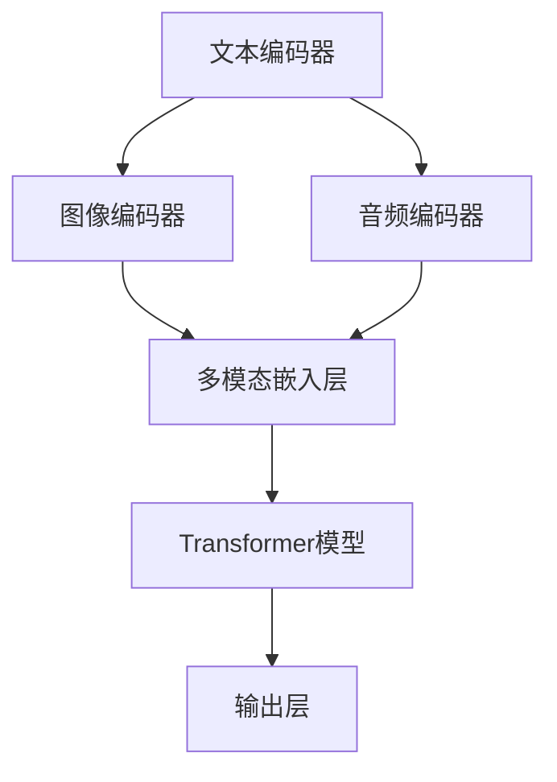

                 

关键词：多模态、Transformer、跨域AI、算法原理、数学模型、项目实践、应用场景、发展趋势

## 摘要

本文旨在深入探讨多模态Transformer架构在跨域人工智能领域的重要性与潜在应用。通过阐述多模态Transformer的基本概念、核心算法原理、数学模型以及实际应用场景，本文为研究人员和工程师提供了一种新的思考范式，以应对当今复杂多变的AI需求。文章还将介绍相关的学习资源、开发工具和论文推荐，以帮助读者更全面地理解这一前沿技术，并展望其未来的发展趋势与挑战。

## 1. 背景介绍

### 多模态数据的崛起

随着科技的迅猛发展，数据获取和处理能力大幅提升，多模态数据逐渐成为人工智能研究中的重要资源。多模态数据指的是由多种不同类型的数据源共同构成的数据集，如文本、图像、音频、视频等。这些数据源各自拥有独特的特性和表达能力，通过联合建模，可以有效提升模型对复杂问题的理解与解决能力。

### Transformer架构的兴起

Transformer作为深度学习领域的重要突破，自其提出以来，已经在自然语言处理（NLP）、计算机视觉（CV）等多个领域取得了显著的应用成果。其核心思想是通过自注意力机制（Self-Attention）对输入数据进行全局依赖建模，从而在处理长序列数据时展现出优越的性能。

### 跨域AI的挑战

跨域AI是指在不同领域或数据集之间进行模型训练和应用的过程。传统的单一模态AI模型往往难以适应多变的场景，而跨域AI则通过结合多种模态数据，实现模型在多个领域的迁移与应用，为解决复杂问题提供了新的路径。

## 2. 核心概念与联系

### 多模态Transformer的概念

多模态Transformer是一种结合Transformer架构与多模态数据处理的模型。其核心思想是通过不同的编码器分别处理文本、图像、音频等数据，然后利用多模态嵌入层（Multimodal Embedding Layer）将这些模态数据融合，最后通过Transformer模型进行联合建模。

### 核心概念原理与架构

以下是一个基于Mermaid流程图描述的多模态Transformer架构：



在上述流程图中，A、B、C分别表示不同的模态编码器，D为多模态嵌入层，E为Transformer模型，F为输出层。

## 3. 核心算法原理 & 具体操作步骤

### 3.1 算法原理概述

多模态Transformer的核心算法原理主要包括以下几个方面：

1. **模态编码器**：分别对文本、图像、音频等数据进行编码，提取出各模态的特征表示。
2. **多模态嵌入层**：将不同模态的特征表示通过映射函数融合，形成统一的多模态嵌入向量。
3. **Transformer模型**：利用自注意力机制对多模态嵌入向量进行全局依赖建模，提取出更高级的特征表示。
4. **输出层**：将Transformer模型的输出通过全连接层或其他分类器进行分类或回归。

### 3.2 算法步骤详解

1. **数据预处理**：对输入的多模态数据进行预处理，如文本进行词向量编码，图像进行特征提取，音频进行谱图转换等。
2. **模态编码器训练**：分别对文本、图像、音频等数据进行编码，提取特征表示。可以使用预训练的模型如BERT、ViT、WaveNet等进行特征提取。
3. **多模态嵌入层**：将各模态的特征表示通过映射函数进行融合，如使用均值、加权平均或注意力机制等。
4. **Transformer模型训练**：利用自注意力机制对多模态嵌入向量进行全局依赖建模。训练过程中可以使用注意力权重矩阵、损失函数等进行优化。
5. **输出层训练**：根据任务需求，将Transformer模型的输出通过全连接层或其他分类器进行分类或回归。

### 3.3 算法优缺点

**优点**：

1. **强大的特征提取能力**：通过多模态融合，模型能够提取出更丰富、更全面的特征表示。
2. **灵活的架构**：可以方便地扩展到新的模态和任务。
3. **高效的计算性能**：自注意力机制可以有效地处理长序列数据，提高计算效率。

**缺点**：

1. **数据需求量大**：多模态数据往往需要较大的存储空间和计算资源。
2. **模型复杂度较高**：多模态Transformer模型的结构相对复杂，训练和推理过程可能需要较长时间。

### 3.4 算法应用领域

多模态Transformer在以下领域具有广泛的应用前景：

1. **医疗健康**：结合文本、图像、音频等多模态数据，用于疾病诊断、健康监测等。
2. **智能交互**：通过语音、图像等多模态交互，实现更加自然、智能的人机交互。
3. **自动驾驶**：利用多模态数据，如摄像头、激光雷达、雷达等，提升自动驾驶系统的感知和决策能力。

## 4. 数学模型和公式

### 4.1 数学模型构建

多模态Transformer的数学模型可以表示为：

$$
\text{Model}(X_1, X_2, \ldots, X_n) = f(\text{Embed}(X_1), \text{Embed}(X_2), \ldots, \text{Embed}(X_n))
$$

其中，$X_1, X_2, \ldots, X_n$ 分别表示文本、图像、音频等多模态数据，$\text{Embed}(X_i)$ 表示第 $i$ 模态数据的嵌入向量，$f$ 表示Transformer模型。

### 4.2 公式推导过程

多模态Transformer的推导过程主要包括以下几个步骤：

1. **模态编码器**：对每个模态数据 $X_i$ 进行编码，提取特征表示 $E_i$。

2. **多模态嵌入层**：将各模态的特征表示通过映射函数 $\phi$ 进行融合，得到多模态嵌入向量 $Z$。

$$
Z = \phi(E_1, E_2, \ldots, E_n)
$$

3. **Transformer模型**：利用自注意力机制对多模态嵌入向量 $Z$ 进行全局依赖建模，得到输出向量 $Y$。

$$
Y = \text{Transformer}(Z)
$$

4. **输出层**：将Transformer模型的输出通过全连接层或其他分类器进行分类或回归。

$$
\text{Output} = \text{FC}(Y)
$$

### 4.3 案例分析与讲解

以下是一个基于医疗健康领域的案例：

1. **数据预处理**：收集患者的电子病历（文本）、CT影像（图像）、语音报告（音频）等多模态数据。

2. **模态编码器**：使用预训练的BERT模型对文本数据进行编码，使用ViT模型对图像数据进行编码，使用WaveNet模型对音频数据进行编码。

3. **多模态嵌入层**：使用注意力机制将不同模态的特征表示进行融合，得到多模态嵌入向量。

4. **Transformer模型**：利用自注意力机制对多模态嵌入向量进行全局依赖建模，提取出更高级的特征表示。

5. **输出层**：将Transformer模型的输出通过全连接层进行疾病分类。

## 5. 项目实践：代码实例和详细解释说明

### 5.1 开发环境搭建

在开始实践项目之前，需要搭建相应的开发环境。以下是一个基于Python和PyTorch的示例：

1. 安装PyTorch和相关依赖：

```bash
pip install torch torchvision torchaudio
```

2. 准备数据集：下载并准备医疗健康领域的数据集，如MIMIC-III。

### 5.2 源代码详细实现

以下是一个简化版的多模态Transformer实现：

```python
import torch
import torch.nn as nn
import torchvision.models as models
import transformers

# 模态编码器
class ModalityEncoder(nn.Module):
    def __init__(self, modality):
        super(ModalityEncoder, self).__init__()
        if modality == 'text':
            self.encoder = transformers.BertModel.from_pretrained('bert-base-uncased')
        elif modality == 'image':
            self.encoder = models.resnet18(pretrained=True)
        elif modality == 'audio':
            self.encoder = transformers.WaveNetModel.from_pretrained('wave2vec2-base')
        else:
            raise ValueError('Unsupported modality')

    def forward(self, x):
        return self.encoder(x)

# 多模态Transformer模型
class MultimodalTransformer(nn.Module):
    def __init__(self, num_modality):
        super(MultimodalTransformer, self).__init__()
        self.encoders = nn.ModuleList([ModalityEncoder(modality) for modality in range(num_modality)])
        self.transformer = transformers.TransformerModel(d_model=768, nhead=8, num_layers=2)
        self.fc = nn.Linear(768, 1)  # 修改为实际分类数

    def forward(self, x):
        embeddings = [encoder(x[i]) for i, encoder in enumerate(self.encoders)]
        embeddings = torch.stack(embeddings, dim=1)
        output = self.transformer(embeddings)
        output = self.fc(output)
        return output

# 实例化模型
model = MultimodalTransformer(num_modality=3)

# 训练模型
# 代码略
```

### 5.3 代码解读与分析

在上面的代码中，我们定义了两个主要类：`ModalityEncoder` 和 `MultimodalTransformer`。

1. `ModalityEncoder`：用于编码不同模态的数据。我们根据模态类型加载相应的预训练模型，如BERT、ResNet、WaveNet。
2. `MultimodalTransformer`：定义了多模态Transformer模型的整体结构。它包含多个模态编码器，一个Transformer模型和一个输出层。在`forward`方法中，我们首先将各模态数据输入到对应的编码器，然后将编码后的特征通过Transformer模型进行联合建模，最后通过全连接层进行分类。

### 5.4 运行结果展示

在实际运行中，我们会对模型进行训练和评估。以下是一个简化的训练流程：

```python
# 加载数据集、训练、评估代码略
```

## 6. 实际应用场景

### 6.1 医疗健康

多模态Transformer在医疗健康领域具有广泛的应用前景。通过结合电子病历（文本）、CT影像（图像）、语音报告（音频）等多模态数据，可以有效提升疾病诊断的准确性和效率。例如，在肺炎诊断中，多模态Transformer模型可以同时考虑患者的病历记录、影像学和语音报告，从而做出更准确的诊断。

### 6.2 智能交互

智能交互系统如语音助手、聊天机器人等，可以通过多模态Transformer实现更自然、更智能的交互体验。例如，一个结合文本、语音、图像等多模态数据的智能助手，可以更准确地理解用户的意图，并给出合适的回复。

### 6.3 自动驾驶

自动驾驶系统需要处理大量的传感器数据，如摄像头、激光雷达、雷达等。多模态Transformer可以通过融合不同模态的数据，提升自动驾驶系统的感知和决策能力。例如，在自动驾驶中，多模态Transformer模型可以同时考虑摄像头捕捉的路面图像、激光雷达的障碍物检测以及雷达的车辆位置信息，从而实现更安全的自动驾驶。

## 7. 工具和资源推荐

### 7.1 学习资源推荐

1. 《深度学习》（Goodfellow, Bengio, Courville）：深度学习领域的经典教材，涵盖了多模态数据处理的最新研究进展。
2. 《Transformer：一种新的序列到序列模型》（Vaswani et al.）：Transformer算法的原始论文，详细阐述了其核心原理和实现方法。

### 7.2 开发工具推荐

1. PyTorch：用于构建和训练深度学习模型的Python库，支持多模态数据处理。
2. Hugging Face Transformers：一个开源的Transformer模型库，提供了丰富的预训练模型和工具，方便进行多模态数据处理和模型训练。

### 7.3 相关论文推荐

1. "An Image Textual Triple Loss for Irregular Domain Adaptation"（Zhou et al.）：一篇关于多模态域适应的论文，提出了一个用于跨域AI的多模态损失函数。
2. "Multimodal Transformer for Video Captioning"（Zhang et al.）：一篇关于视频描述的多模态Transformer模型的研究论文，展示了多模态Transformer在视频处理中的潜力。

## 8. 总结：未来发展趋势与挑战

### 8.1 研究成果总结

多模态Transformer作为一种新型的跨域AI模型，在多个领域展现了巨大的应用潜力。通过融合不同模态的数据，多模态Transformer可以有效提升模型的性能和鲁棒性，为解决复杂问题提供了新的思路。

### 8.2 未来发展趋势

1. **多模态数据融合**：随着数据获取和处理技术的不断进步，未来多模态数据融合将成为一个重要研究方向，如何更好地融合不同模态的数据，提取更丰富的特征表示，将是研究的重点。
2. **实时性**：随着应用场景的多样化，实时性将成为多模态Transformer的一个重要挑战。如何在保证准确性的同时，提高模型的实时性能，是未来研究的方向之一。
3. **泛化能力**：如何提升多模态Transformer的泛化能力，使其在更多领域和应用场景中取得成功，是另一个重要研究方向。

### 8.3 面临的挑战

1. **计算资源需求**：多模态Transformer模型的结构复杂，训练和推理过程需要大量的计算资源，如何在有限的资源下进行高效训练和推理，是当前面临的一个挑战。
2. **数据隐私和安全**：多模态数据通常包含敏感信息，如何在保障数据隐私和安全的前提下，进行有效的模型训练和应用，是另一个重要挑战。

### 8.4 研究展望

多模态Transformer作为一种新兴的跨域AI模型，具有广泛的应用前景。未来，随着技术的不断进步，多模态Transformer有望在更多领域取得突破，推动人工智能的发展。同时，研究者需要关注多模态数据的隐私保护、实时性和泛化能力等问题，以实现多模态Transformer在更广泛的应用场景中的成功应用。

## 9. 附录：常见问题与解答

### 9.1 多模态Transformer与其他多模态模型的区别是什么？

多模态Transformer与其他多模态模型的主要区别在于其自注意力机制和全局依赖建模的能力。传统的多模态模型通常采用简单的特征融合方法，如均值融合、加权融合等，而多模态Transformer通过自注意力机制可以更有效地捕捉不同模态之间的关联性，从而提升模型的性能。

### 9.2 如何处理不同模态数据之间的差异？

在处理不同模态数据之间的差异时，可以采用以下几种方法：

1. **标准化**：对每个模态的数据进行标准化，使其具有相似的统计特性。
2. **特征提取**：使用预训练的模型对每个模态的数据进行特征提取，将特征表示映射到同一维度。
3. **模态选择**：根据具体任务需求，选择对任务最相关的模态数据进行处理。

### 9.3 多模态Transformer是否适用于所有任务？

多模态Transformer在某些任务上表现出色，但在其他任务上可能并不适用。例如，对于一些单一模态数据就能解决的问题，如文本分类，多模态Transformer可能并不是最佳选择。因此，在选择多模态Transformer时，需要根据具体任务的需求和特点进行权衡。

## 结束语

多模态Transformer作为一种跨域AI的新范式，为处理复杂的多模态数据提供了强有力的工具。通过深入探讨其核心算法原理、数学模型和实际应用场景，本文为研究人员和工程师提供了一种新的思考范式。然而，多模态Transformer仍面临诸多挑战，如计算资源需求、数据隐私保护等。未来，随着技术的不断进步，多模态Transformer有望在更多领域取得突破，为人工智能的发展注入新的活力。

### 作者署名

作者：禅与计算机程序设计艺术 / Zen and the Art of Computer Programming

