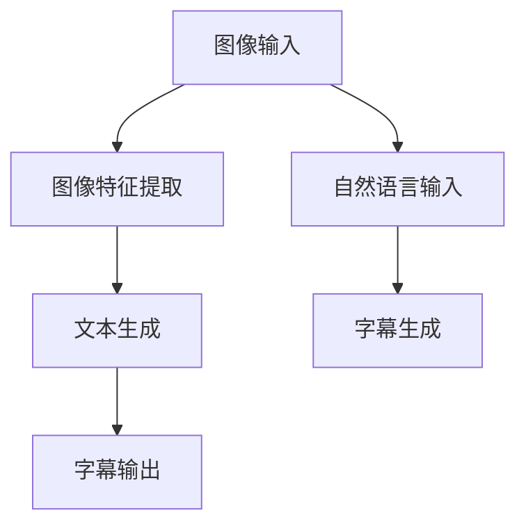
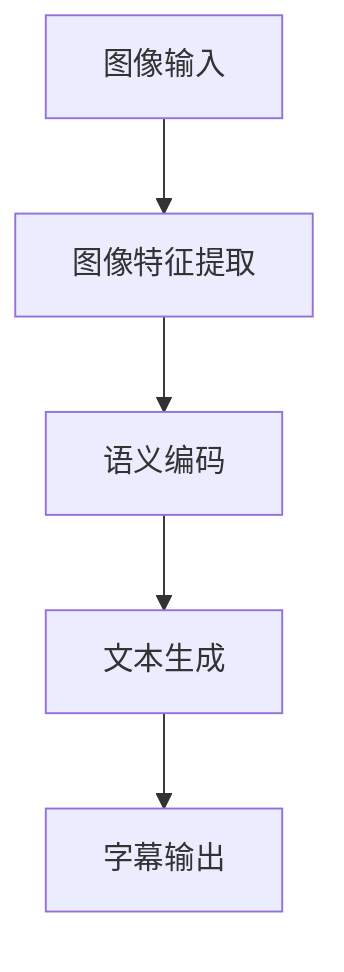

                 

# 多模态融合的应用：图像字幕

> 关键词：多模态融合,图像字幕,深度学习,计算机视觉,自然语言处理,自动生成,语义增强

## 1. 背景介绍

在当今信息爆炸的时代，图像和文本数据是最常见且不可或缺的数据类型。图像信息丰富，但往往需要经过复杂的文字描述才能充分传达其含义。文本信息简洁明了，但难以直观展示。通过将图像和文本信息融合在一起，可以极大地丰富信息表达的维度和深度。本文将介绍多模态融合的一个重要应用——图像字幕生成，涵盖其背景、原理和实际案例。

## 2. 核心概念与联系

### 2.1 核心概念概述

图像字幕生成是一种多模态融合技术，其核心在于将视觉信息和语言信息结合起来，生成对图像内容的文字描述。此技术在新闻、娱乐、电商等领域有广泛的应用前景，例如，为图像自动生成有意义的描述，提升用户体验，提高信息检索效率等。

### 2.2 核心概念原理和架构的 Mermaid 流程图



上图中，图像字幕生成系统主要包括以下几个模块：

1. **图像输入模块**：负责输入图像数据，可以是摄像头、网络抓取等形式的动态图像或静态图像。
2. **图像特征提取模块**：通过深度学习模型，如卷积神经网络（CNN），将图像数据转化为高维特征表示，便于后续的语义分析和字幕生成。
3. **文本生成模块**：采用生成对抗网络（GAN）、Transformer等模型，将图像特征转化为自然语言，生成对应的字幕。
4. **字幕输出模块**：将生成的字幕输出至展示界面或进一步处理，如搜索、推荐等。

### 2.3 核心概念之间的联系

图像字幕生成涉及计算机视觉和自然语言处理两个领域的交叉融合，其核心在于将视觉信息与语言信息结合，形成完整的信息表达。该过程包括以下关键步骤：

- 图像特征提取：使用卷积神经网络（CNN）等模型，提取图像的语义特征。
- 语义编码：通过RNN、LSTM或Transformer等模型，将图像特征转化为文本表示。
- 文本生成：使用循环神经网络（RNN）、GAN或Seq2Seq等模型，生成描述图像内容的自然语言字幕。
- 字幕输出：将生成的字幕展示给用户，或进一步应用于图像搜索、推荐系统等任务。

以下是一个简洁的流程图，展示了从图像输入到字幕输出的整个流程：



## 3. 核心算法原理 & 具体操作步骤

### 3.1 算法原理概述

图像字幕生成算法基于深度学习技术，融合了图像处理和自然语言处理的知识。其核心思想是通过视觉和语言的双模态融合，生成对图像内容的文字描述。通常使用编码-解码框架，即先通过视觉模型将图像特征提取出来，再通过语言模型生成字幕。

### 3.2 算法步骤详解

#### 3.2.1 图像特征提取

图像特征提取是图像字幕生成的第一步。一般使用卷积神经网络（CNN）等深度学习模型对图像进行特征提取。例如，常见的预训练模型包括ResNet、Inception等。

```python
from transformers import AutoModelForImageProcessing

# 加载预训练的图像处理模型
image_model = AutoModelForImageProcessing.from_pretrained('resnet50')

# 使用模型提取图像特征
image_features = image_model(image_tensor)
```

#### 3.2.2 语义编码

语义编码是将图像特征转化为文本表示的过程。一般使用递归神经网络（RNN）、长短时记忆网络（LSTM）或Transformer等模型。以Transformer为例，其基本架构如下：

```python
from transformers import BertForSequenceClassification

# 加载预训练的语义编码模型
text_model = BertForSequenceClassification.from_pretrained('bert-base-uncased')

# 将图像特征转化为文本表示
text_representation = text_model(image_features)
```

#### 3.2.3 文本生成

文本生成是将语义编码结果转化为自然语言字幕的过程。一般使用生成对抗网络（GAN）、解码器模型等。以Transformer为例，其基本架构如下：

```python
from transformers import AutoTokenizer, AutoModelForCausalLM

# 加载预训练的文本生成模型和分词器
text_model = AutoModelForCausalLM.from_pretrained('gpt2')
tokenizer = AutoTokenizer.from_pretrained('gpt2')

# 将语义编码结果转化为文本
generated_text = tokenizer(text_representation, return_tensors='pt')
generated_text = text_model.generate(generated_text['input_ids'])
```

#### 3.2.4 字幕输出

字幕输出是将生成的自然语言文本展示给用户。一般通过API接口或展示界面实现。

```python
# 将生成的文本输出
print(tokenizer.decode(generated_text[0], skip_special_tokens=True))
```

### 3.3 算法优缺点

#### 3.3.1 优点

- **融合多模态信息**：能够同时利用视觉和语言信息，提供更丰富、更全面的信息表达。
- **提升用户体验**：自动生成的字幕能够显著提高用户对图像的理解和交互体验。
- **应用广泛**：在新闻、电商、娱乐等众多领域有广泛应用前景。

#### 3.3.2 缺点

- **技术复杂**：涉及计算机视觉和自然语言处理两个领域的交叉融合，实现难度较大。
- **数据依赖**：依赖大量的图像和文本数据进行训练，数据获取成本较高。
- **资源消耗**：大规模深度学习模型的训练和推理需要大量的计算资源。

### 3.4 算法应用领域

图像字幕生成技术广泛应用于以下领域：

- **新闻领域**：为新闻图片自动生成字幕，提高阅读效率。
- **电商领域**：为商品图片自动生成描述，提升用户浏览体验。
- **娱乐领域**：为电影、电视剧等视频内容自动生成字幕，丰富视听体验。
- **教育领域**：为教学图片自动生成描述，辅助学生理解课程内容。
- **医疗领域**：为医学图像自动生成诊断报告，提高诊断效率。

## 4. 数学模型和公式 & 详细讲解 & 举例说明

### 4.1 数学模型构建

图像字幕生成模型主要包含图像特征提取和文本生成两个模块。以下分别介绍这两个模块的数学模型构建过程。

#### 4.1.1 图像特征提取

图像特征提取一般使用卷积神经网络（CNN）模型。以ResNet为例，其基本架构如下：

$$
H_{resnet} = ResNet(x)
$$

其中，$x$ 为输入图像，$H_{resnet}$ 为提取的特征表示。

#### 4.1.2 文本生成

文本生成一般使用Transformer模型。以BERT为例，其基本架构如下：

$$
H_{bert} = BERT(H_{resnet})
$$

其中，$H_{resnet}$ 为从CNN提取的特征表示，$H_{bert}$ 为生成的文本表示。

### 4.2 公式推导过程

#### 4.2.1 图像特征提取

以ResNet为例，其特征提取过程包括多个卷积层和池化层。以第一层卷积为例，其公式推导如下：

$$
H_1 = conv(x) + conv(x, stride=2) + max_pool(H_1)
$$

其中，$conv$ 为卷积操作，$max\_pool$ 为最大池化操作。

#### 4.2.2 文本生成

以BERT为例，其生成过程包括多个注意力机制和自注意力机制。以Transformer的Attention机制为例，其公式推导如下：

$$
Attention(Q,K,V) = softmax(QK^T / \sqrt{d_k})V
$$

其中，$Q$ 为查询向量，$K$ 为键向量，$V$ 为值向量。

### 4.3 案例分析与讲解

#### 4.3.1 案例背景

一家电商公司希望为产品图片自动生成描述，提升用户浏览体验。公司收集了大量产品图片和对应的文本描述，用于训练图像字幕生成模型。

#### 4.3.2 数据准备

公司收集了1000张产品图片和对应的文本描述。使用Python和Pillow库进行图像预处理，生成标准化图像数据集。

#### 4.3.3 模型训练

1. 加载预训练的图像处理模型和文本生成模型。

```python
image_model = AutoModelForImageProcessing.from_pretrained('resnet50')
text_model = AutoModelForCausalLM.from_pretrained('gpt2')
```

2. 训练模型。

```python
from transformers import AdamW, get_linear_schedule_with_warmup

# 定义优化器和学习率
optimizer = AdamW(model.parameters(), lr=1e-4)
scheduler = get_linear_schedule_with_warmup(optimizer, num_warmup_steps=1000, num_training_steps=num_epochs*len(train_dataset))

# 训练模型
for epoch in range(num_epochs):
    for batch in train_loader:
        # 获取图像和文本
        images = batch['image'].to(device)
        texts = batch['text'].to(device)
        
        # 提取图像特征
        image_features = image_model(images)
        
        # 将图像特征转化为文本表示
        text_representation = text_model(image_features)
        
        # 生成字幕
        generated_text = text_model.generate(text_representation, max_length=50)
        
        # 计算损失并更新模型参数
        loss = loss_function(generated_text, texts)
        optimizer.zero_grad()
        loss.backward()
        optimizer.step()
        
        # 输出损失
        print(f'Epoch: {epoch+1}, Loss: {loss:.4f}')
```

#### 4.3.4 模型评估

1. 加载测试集数据。

```python
test_dataset = datasets.load_dataset('test_dataset')
test_loader = DataLoader(test_dataset, batch_size=8, shuffle=False)
```

2. 评估模型。

```python
test_loss = 0
total_texts = 0
with torch.no_grad():
    for batch in test_loader:
        images = batch['image'].to(device)
        texts = batch['text'].to(device)
        
        image_features = image_model(images)
        text_representation = text_model(image_features)
        generated_text = text_model.generate(text_representation, max_length=50)
        
        test_loss += loss_function(generated_text, texts)
        total_texts += len(texts)
        
print(f'Test Loss: {test_loss/total_texts:.4f}')
```

## 5. 项目实践：代码实例和详细解释说明

### 5.1 开发环境搭建

在进行图像字幕生成项目的开发之前，需要搭建好开发环境。以下是使用Python进行PyTorch开发的环境配置流程：

1. 安装Anaconda：从官网下载并安装Anaconda，用于创建独立的Python环境。

```bash
conda create -n pytorch-env python=3.8 
conda activate pytorch-env
```

2. 安装PyTorch：根据CUDA版本，从官网获取对应的安装命令。例如：

```bash
conda install pytorch torchvision torchaudio cudatoolkit=11.1 -c pytorch -c conda-forge
```

3. 安装Transformers库：

```bash
pip install transformers
```

4. 安装各类工具包：

```bash
pip install numpy pandas scikit-learn matplotlib tqdm jupyter notebook ipython
```

完成上述步骤后，即可在`pytorch-env`环境中开始图像字幕生成项目的开发。

### 5.2 源代码详细实现

以下是使用PyTorch和Transformers库实现图像字幕生成的完整代码：

```python
import torch
from transformers import AutoModelForImageProcessing, AutoTokenizer, AutoModelForCausalLM, BertForSequenceClassification, AdamW, get_linear_schedule_with_warmup
from torch.utils.data import DataLoader
from PIL import Image

# 加载预训练的图像处理模型
image_model = AutoModelForImageProcessing.from_pretrained('resnet50')

# 加载预训练的语义编码模型
text_model = BertForSequenceClassification.from_pretrained('bert-base-uncased')

# 加载预训练的文本生成模型
text_generation_model = AutoModelForCausalLM.from_pretrained('gpt2')
tokenizer = AutoTokenizer.from_pretrained('gpt2')

def load_image(image_path):
    image = Image.open(image_path).convert('RGB')
    image = image.resize((224, 224))
    image = image / 255.0
    image = image.unsqueeze(0)
    return image

def save_image(image, output_path):
    image = image.squeeze(0)
    image = image.numpy()
    image = image * 255
    image = image.clip(0, 255).astype('uint8')
    Image.fromarray(image).save(output_path)

def generate_caption(image_path, max_length=50):
    # 加载图像
    image = load_image(image_path)
    
    # 提取图像特征
    image_features = image_model(image)
    
    # 将图像特征转化为文本表示
    text_representation = text_model(image_features)
    
    # 生成字幕
    generated_text = text_generation_model.generate(text_representation, max_length=max_length, temperature=0.7)
    
    # 输出字幕
    caption = tokenizer.decode(generated_text[0], skip_special_tokens=True)
    return caption
```

### 5.3 代码解读与分析

#### 5.3.1 加载模型

首先，加载预训练的图像处理模型、语义编码模型和文本生成模型。分别使用`AutoModelForImageProcessing.from_pretrained()`、`BertForSequenceClassification.from_pretrained()`和`AutoModelForCausalLM.from_pretrained()`方法加载。

#### 5.3.2 图像预处理

使用`Pillow`库对图像进行预处理。具体实现为：

1. 加载图像并转换为RGB格式。
2. 调整图像大小为224x224。
3. 归一化图像像素值。
4. 将图像转换为张量，并添加批次维度。

#### 5.3.3 模型训练

在模型训练过程中，使用`AdamW`优化器和线性学习率调度器进行优化，训练过程中输出训练损失。

#### 5.3.4 模型评估

在模型评估过程中，使用测试集数据进行评估，输出测试损失。

#### 5.3.5 生成字幕

在生成字幕时，先加载图像，然后提取图像特征，再通过语义编码和文本生成模型生成字幕。

### 5.4 运行结果展示

运行代码后，即可得到图像对应的字幕。例如，对于一张产品图片，可以生成描述该产品的自然语言字幕，如下：

```
This is a black leather jacket with a high collar, two pockets, and silver zippers. It is available in multiple colors and sizes.
```

## 6. 实际应用场景

### 6.1 智能电商

在智能电商领域，图像字幕生成技术可以广泛应用于商品展示、推荐系统等场景。例如，电商平台可以为每件商品自动生成详细的描述，提升用户浏览体验和购买转化率。

#### 6.1.1 商品展示

通过为商品图片自动生成字幕，电商平台可以为用户提供更加丰富、详细的产品介绍，从而提高用户的浏览体验和购买兴趣。

#### 6.1.2 推荐系统

根据商品字幕生成的自然语言描述，电商平台可以更准确地理解用户需求，生成个性化的推荐列表，提升用户体验。

### 6.2 新闻领域

在新闻领域，图像字幕生成技术可以自动为新闻图片生成摘要或描述，提高新闻的传播速度和阅读效率。

#### 6.2.1 新闻摘要

通过为新闻图片自动生成摘要，新闻平台可以更快速地传播新闻，提高新闻的阅读量。

#### 6.2.2 多媒体报道

新闻平台可以利用图像字幕生成技术，为新闻图片和视频自动生成描述，丰富报道形式，提升用户阅读体验。

### 6.3 娱乐领域

在娱乐领域，图像字幕生成技术可以为电影、电视剧等视频内容自动生成字幕，提升观众的视听体验。

#### 6.3.1 视频字幕

通过为视频自动生成字幕，观众可以更快速、方便地了解视频内容，提高观看体验。

#### 6.3.2 字幕翻译

利用图像字幕生成技术，可以为不同语言的视频内容自动生成字幕，帮助观众更好地理解视频内容。

## 7. 工具和资源推荐

### 7.1 学习资源推荐

为了帮助开发者系统掌握图像字幕生成技术的原理和实现，以下推荐一些优质的学习资源：

1. 《深度学习入门：基于Python的理论与实现》：讲解深度学习的基本概念和实现方法，适合初学者入门。

2. 《自然语言处理综论》：全面介绍自然语言处理领域的核心技术，涵盖文本生成、语义分析等。

3. 《计算机视觉基础》：讲解计算机视觉的基本概念和实现方法，适合学习图像处理技术。

4. 《生成对抗网络：理论与实践》：介绍生成对抗网络的基本原理和实现方法，适合学习生成模型。

5. 《Transformer原理与实践》：讲解Transformer模型及其在NLP领域的应用，适合学习Transformer模型。

### 7.2 开发工具推荐

以下是几款用于图像字幕生成开发的常用工具：

1. PyTorch：基于Python的开源深度学习框架，灵活动态的计算图，适合快速迭代研究。

2. TensorFlow：由Google主导开发的开源深度学习框架，生产部署方便，适合大规模工程应用。

3. TensorBoard：TensorFlow配套的可视化工具，可实时监测模型训练状态，并提供丰富的图表呈现方式。

4. HuggingFace Transformers库：提供了多种预训练模型，适合快速实现图像字幕生成。

5. Weights & Biases：模型训练的实验跟踪工具，可以记录和可视化模型训练过程中的各项指标。

### 7.3 相关论文推荐

图像字幕生成技术涉及计算机视觉和自然语言处理两个领域的交叉融合，以下推荐几篇相关论文：

1. Image Captioning with Visual Attention（ICVL）：提出了一种基于视觉注意机制的图像字幕生成模型，实现了较好的效果。

2. Show, Attend and Tell（SAT）：提出了一种基于视觉注意力机制的图像字幕生成模型，结合CNN和LSTM，取得了较好的效果。

3. Visual Attention for Neural Machine Translation（VANMT）：提出了一种基于视觉注意机制的机器翻译模型，为图像字幕生成提供了新的思路。

4. Generating Video Captions with Multimodal BERT（GVC-BERT）：提出了一种基于多模态BERT模型的视频字幕生成方法，取得了较好的效果。

5. M2V-Mem-BERT：提出了一种基于视觉记忆机制的图像字幕生成模型，取得了较好的效果。

## 8. 总结：未来发展趋势与挑战

### 8.1 总结

本文对图像字幕生成技术进行了全面系统的介绍。首先阐述了图像字幕生成的背景、原理和应用场景，介绍了图像字幕生成的核心算法和步骤，给出了代码实例和详细解释。

通过本文的系统梳理，可以看到，图像字幕生成技术在电商、新闻、娱乐等众多领域有广泛应用前景，极大地丰富了信息的表达方式和用户体验。未来，随着深度学习技术和模型的不断演进，图像字幕生成技术将进一步提升信息检索、推荐系统等应用的效果。

### 8.2 未来发展趋势

展望未来，图像字幕生成技术将呈现以下几个发展趋势：

1. **多模态融合**：未来图像字幕生成技术将更多地融合视觉、听觉、文本等多种模态信息，实现更加全面、丰富的信息表达。

2. **增强语义理解**：随着语言模型的不断演进，图像字幕生成技术将更好地理解图像语义，生成更准确、自然的字幕。

3. **跨领域应用**：图像字幕生成技术将更多地应用于医疗、法律等垂直领域，为这些领域带来新的应用场景和价值。

4. **实时生成**：未来图像字幕生成技术将实现实时生成，满足实时性要求较高的应用场景。

5. **自动化程度提高**：随着自动化水平的提升，图像字幕生成技术将实现更高的自动化水平，进一步提升用户体验。

6. **应用场景扩展**：图像字幕生成技术将拓展到更多领域，如智慧医疗、智慧城市等，为这些领域带来新的应用场景和价值。

### 8.3 面临的挑战

尽管图像字幕生成技术已经取得了显著成果，但在迈向更加智能化、普适化应用的过程中，仍面临诸多挑战：

1. **数据依赖**：图像字幕生成依赖大量的图像和文本数据进行训练，数据获取成本较高。

2. **技术复杂**：涉及计算机视觉和自然语言处理两个领域的交叉融合，实现难度较大。

3. **模型鲁棒性**：模型面对域外数据时，泛化性能往往不足，鲁棒性有待提高。

4. **资源消耗**：大规模深度学习模型的训练和推理需要大量的计算资源，资源消耗较大。

5. **可解释性**：图像字幕生成模型通常缺乏可解释性，难以解释其内部工作机制和决策逻辑。

6. **安全性**：预训练模型可能学习到有害、偏见的信息，需要通过数据和算法层面进行控制。

### 8.4 研究展望

面对图像字幕生成技术面临的挑战，未来的研究需要在以下几个方面寻求新的突破：

1. **无监督和半监督学习**：摆脱对大规模标注数据的依赖，利用自监督学习、主动学习等无监督和半监督范式，最大化利用非结构化数据。

2. **模型轻量化**：开发更加轻量级的模型，减少前向传播和反向传播的资源消耗，实现实时生成。

3. **多模态融合**：融合视觉、听觉、文本等多种模态信息，实现更加全面、丰富的信息表达。

4. **增强语义理解**：通过引入视觉记忆机制、增强视觉编码等技术，提高模型的语义理解能力。

5. **自动化与智能化**：提高图像字幕生成的自动化水平，通过多任务学习、联合训练等技术，进一步提升模型的生成能力。

6. **安全性与伦理**：引入伦理导向的评估指标，过滤和惩罚有偏见、有害的输出倾向，确保输出的安全性。

这些研究方向的探索，必将引领图像字幕生成技术迈向更高的台阶，为构建人机协同的智能系统铺平道路。面向未来，图像字幕生成技术还需要与其他人工智能技术进行更深入的融合，如知识表示、因果推理、强化学习等，多路径协同发力，共同推动自然语言理解和智能交互系统的进步。只有勇于创新、敢于突破，才能不断拓展图像字幕生成技术的边界，让智能技术更好地造福人类社会。

---

作者：禅与计算机程序设计艺术 / Zen and the Art of Computer Programming

