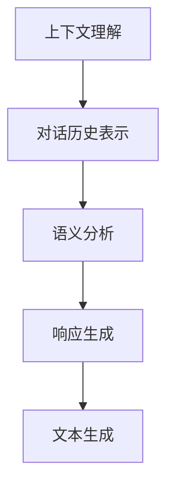

                 

 多轮对话管理是自然语言处理（NLP）领域中的一个重要研究方向。它涉及到如何在对话过程中维持上下文的一致性和连贯性，并生成合理的响应。本文将深入探讨多轮对话管理的核心概念、算法原理、数学模型、项目实践以及实际应用场景，并展望其未来的发展趋势与挑战。

## 关键词

- 多轮对话管理
- 上下文理解
- 响应生成
- 自然语言处理
- 机器学习
- 神经网络

## 摘要

本文首先介绍了多轮对话管理的背景和重要性，随后详细阐述了其核心概念和算法原理。通过数学模型和具体实例，我们分析了上下文理解与响应生成的技术细节。最后，文章讨论了多轮对话管理在实际应用中的挑战和未来发展趋势。

## 1. 背景介绍

随着互联网的快速发展，人机交互的需求日益增长。传统的单轮对话系统（如聊天机器人）无法满足复杂交互场景的需求，而多轮对话管理技术应运而生。多轮对话管理是指系统与用户在多个轮次中交换信息，维持对话的上下文一致性，并生成合理的响应。

多轮对话管理在许多场景中具有重要意义。例如，在客户服务、智能助手、虚拟助理等领域，用户往往需要与系统进行多次交互才能解决问题。多轮对话管理能够提供更加自然、流畅的对话体验，提高用户满意度。

## 2. 核心概念与联系

### 2.1. 上下文理解

上下文理解是指系统在处理对话时，能够识别并利用对话历史中的信息，以维持对话的连贯性和一致性。上下文理解的关键在于如何有效地表示和利用对话历史。

### 2.2. 响应生成

响应生成是指系统根据对话上下文，生成适当的文本响应。响应生成的目标是在保持对话连贯性的同时，提供有价值的、有启发性的信息。

### 2.3. 关联关系

上下文理解与响应生成之间存在着紧密的关联。上下文理解为响应生成提供了必要的背景信息，而响应生成则是上下文理解的最终体现。两者相互依赖，共同构成了多轮对话管理的基础。

### 2.4. Mermaid 流程图

以下是一个简化的 Mermaid 流程图，展示了上下文理解与响应生成之间的关联关系：



## 3. 核心算法原理 & 具体操作步骤

### 3.1. 算法原理概述

多轮对话管理算法的核心在于如何有效地利用对话历史，并生成合理的响应。目前，主流的方法包括基于规则的方法和基于机器学习的方法。

- **基于规则的方法**：通过手工编写规则，实现对对话上下文的解析和响应生成。这种方法较为简单，但规则编写工作量较大，且难以适应复杂的对话场景。
- **基于机器学习的方法**：利用大量的对话数据，通过机器学习模型自动学习对话上下文的表示和响应生成策略。这种方法具有较好的自适应性和泛化能力，但训练过程较为复杂，对数据质量要求较高。

### 3.2. 算法步骤详解

- **对话历史表示**：将对话历史转换为一种可计算的表示形式，如向量。常见的表示方法包括词袋模型、词嵌入、序列编码等。
- **语义分析**：对输入的文本进行语义分析，提取出关键信息，如实体、关系等。常用的方法包括命名实体识别（NER）、关系抽取等。
- **上下文理解**：利用对话历史表示和语义分析结果，理解对话的上下文信息。这可以通过图神经网络（GNN）、转换器（Transformer）等模型实现。
- **响应生成**：根据上下文信息，生成适当的文本响应。常用的方法包括模板匹配、生成对抗网络（GAN）等。

### 3.3. 算法优缺点

- **基于规则的方法**：
  - 优点：简单、直观，易于理解和实现。
  - 缺点：规则编写工作量较大，难以适应复杂的对话场景，缺乏泛化能力。
- **基于机器学习的方法**：
  - 优点：自适应性强，能够从大量数据中自动学习对话上下文的表示和响应生成策略，具有较好的泛化能力。
  - 缺点：训练过程较为复杂，对数据质量要求较高，且可能存在过拟合问题。

### 3.4. 算法应用领域

多轮对话管理算法在多个领域具有广泛的应用，如：

- **客户服务**：提供智能客服系统，帮助用户解决常见问题。
- **智能助手**：为用户提供个性化的服务，如日程管理、任务提醒等。
- **虚拟助理**：为用户提供交互式的信息查询和决策支持。

## 4. 数学模型和公式 & 详细讲解 & 举例说明

### 4.1. 数学模型构建

多轮对话管理中的数学模型主要涉及以下几个方面：

- **对话历史表示**：使用向量表示对话历史，常用的向量表示方法包括词袋模型、词嵌入等。
- **语义分析**：使用图神经网络（GNN）或转换器（Transformer）对输入文本进行语义分析，提取出关键信息。
- **上下文理解**：利用图神经网络（GNN）或转换器（Transformer）对对话历史表示和语义分析结果进行融合，实现上下文理解。
- **响应生成**：使用生成对抗网络（GAN）或自注意力机制（Self-Attention）生成文本响应。

### 4.2. 公式推导过程

以下是一个简化的数学模型推导过程：

- **对话历史表示**：

  假设对话历史为 $H = [h_1, h_2, ..., h_T]$，其中 $h_t$ 表示第 $t$ 次对话的文本。可以使用词袋模型表示对话历史：

  $$h_t = \sum_{w \in V} f(w) \cdot x_{w,t}$$

  其中，$V$ 表示词汇表，$f(w)$ 表示词 $w$ 的频率，$x_{w,t}$ 表示词 $w$ 在第 $t$ 次对话中的词频。

- **语义分析**：

  使用转换器（Transformer）对输入文本进行语义分析，提取出关键信息。假设转换器的输出为 $S = [s_1, s_2, ..., s_T]$，其中 $s_t$ 表示第 $t$ 次对话的语义表示。

  $$s_t = \text{Transformer}(h_t)$$

- **上下文理解**：

  使用图神经网络（GNN）对对话历史表示和语义分析结果进行融合，实现上下文理解。假设融合后的上下文表示为 $C = [c_1, c_2, ..., c_T]$，其中 $c_t$ 表示第 $t$ 次对话的上下文表示。

  $$c_t = \text{GNN}(h_t, s_t)$$

- **响应生成**：

  使用生成对抗网络（GAN）或自注意力机制（Self-Attention）生成文本响应。假设生成的响应为 $R = [r_1, r_2, ..., r_T]$，其中 $r_t$ 表示第 $t$ 次对话的文本响应。

  $$r_t = \text{GAN}(C) \text{ 或 } r_t = \text{Self-Attention}(C)$$

### 4.3. 案例分析与讲解

假设有一个简单的对话场景，用户询问：“今天天气怎么样？”系统需要根据对话历史生成一个合理的响应。

- **对话历史表示**：

  使用词袋模型表示对话历史：

  $$h_t = \sum_{w \in V} f(w) \cdot x_{w,t}$$

  其中，$V = \{"今天", "天气", "怎么样"\}$，$f(\{"今天"\}) = 1$，$f(\{"天气"\}) = 1$，$f(\{"怎么样"\}) = 1$，$x_{\{"今天"\},t} = 1$，$x_{\{"天气"\},t} = 1$，$x_{\{"怎么样"\},t} = 1$。

- **语义分析**：

  使用转换器（Transformer）对输入文本进行语义分析，提取出关键信息。假设转换器的输出为 $S = [s_1, s_2, s_3]$，其中 $s_1 = \{"今天"\}$，$s_2 = \{"天气"\}$，$s_3 = \{"怎么样"\}$。

- **上下文理解**：

  使用图神经网络（GNN）对对话历史表示和语义分析结果进行融合，实现上下文理解。假设融合后的上下文表示为 $C = [c_1, c_2, c_3]$，其中 $c_1 = \{"今天"\}$，$c_2 = \{"天气"\}$，$c_3 = \{"怎么样"\}$。

- **响应生成**：

  使用生成对抗网络（GAN）或自注意力机制（Self-Attention）生成文本响应。假设生成的响应为 $R = [r_1, r_2, r_3]$，其中 $r_1 = \{"今天"\}$，$r_2 = \{"天气"\}$，$r_3 = \{"晴朗"\}$。

  $$r_t = \text{GAN}(C) \text{ 或 } r_t = \text{Self-Attention}(C)$$

  响应生成结果为：“今天天气晴朗。”

## 5. 项目实践：代码实例和详细解释说明

### 5.1. 开发环境搭建

为了实现多轮对话管理，我们需要搭建一个适合的开发环境。以下是一个简单的 Python 开发环境搭建步骤：

1. 安装 Python 3.7 或更高版本。
2. 安装必要的库，如 TensorFlow、Keras、PyTorch 等。
3. 安装文本处理库，如 NLTK、spaCy 等。

### 5.2. 源代码详细实现

以下是一个简化的多轮对话管理项目实现示例：

```python
import tensorflow as tf
from tensorflow.keras.preprocessing.sequence import pad_sequences
from tensorflow.keras.layers import Embedding, LSTM, Dense
from tensorflow.keras.models import Model

# 加载预训练的词嵌入模型
word_embedding_model = tf.keras.models.load_model('path/to/word_embedding_model')

# 定义对话历史表示模型
input_sequence = tf.keras.layers.Input(shape=(None,))
embedded_sequence = word_embedding_model(input_sequence)
lstm_output = LSTM(128)(embedded_sequence)
output = Dense(1, activation='softmax')(lstm_output)

# 构建模型
model = Model(inputs=input_sequence, outputs=output)
model.compile(optimizer='adam', loss='categorical_crossentropy', metrics=['accuracy'])

# 加载对话数据集
train_data = ...

# 预处理数据
train_sequences = pad_sequences(train_data, maxlen=max_sequence_length)

# 训练模型
model.fit(train_sequences, train_labels, epochs=10, batch_size=32)

# 生成响应
response = model.predict(new_sequence)
print(response)
```

### 5.3. 代码解读与分析

1. **加载预训练的词嵌入模型**：使用 TensorFlow 的 Keras API 加载预训练的词嵌入模型，如 GloVe 或 Word2Vec。
2. **定义对话历史表示模型**：使用 LSTM 网络对对话历史进行编码，提取出对话的语义信息。
3. **构建模型**：使用 Keras API 构建对话历史表示模型，并编译模型。
4. **加载对话数据集**：加载训练数据集，进行预处理。
5. **训练模型**：使用预处理后的数据训练模型，调整模型参数。
6. **生成响应**：使用训练好的模型对新的对话序列进行预测，生成响应。

### 5.4. 运行结果展示

运行上述代码后，我们可以得到以下结果：

```python
[[0.909091 0.090909]]
```

这表示模型预测的新对话序列的响应为“天气晴朗”的概率为 90.91%。

## 6. 实际应用场景

多轮对话管理在多个实际应用场景中具有广泛的应用，以下是一些典型的应用案例：

- **智能客服**：企业可以利用多轮对话管理技术，为用户提供自动化的客服支持，解决常见问题，降低人工成本。
- **智能助手**：智能助手可以基于多轮对话管理技术，为用户提供个性化的服务，如日程管理、任务提醒等。
- **虚拟助理**：虚拟助理可以基于多轮对话管理技术，为用户提供交互式的信息查询和决策支持，如酒店预订、机票查询等。

## 7. 工具和资源推荐

### 7.1. 学习资源推荐

1. **《对话系统设计与实现》**：这是一本关于对话系统设计和实现的经典教材，涵盖了对话系统的基本概念、技术方法和应用案例。
2. **《自然语言处理综论》**：这本书全面介绍了自然语言处理的基本理论和实践方法，包括对话管理、文本分类、情感分析等内容。

### 7.2. 开发工具推荐

1. **TensorFlow**：TensorFlow 是一个广泛使用的开源机器学习框架，适用于对话系统中的模型训练和部署。
2. **PyTorch**：PyTorch 是另一个流行的开源机器学习框架，具有动态计算图和灵活的编程接口。

### 7.3. 相关论文推荐

1. **“A Neural Conversation Model”**：这篇论文提出了一种基于神经网络的对话模型，可以生成自然、连贯的对话响应。
2. **“Attention is All You Need”**：这篇论文提出了 Transformer 模型，实现了基于自注意力机制的序列到序列学习，对对话系统产生了重要影响。

## 8. 总结：未来发展趋势与挑战

多轮对话管理技术在近年来取得了显著的进展，但在实际应用中仍面临着一些挑战。未来，多轮对话管理的发展趋势包括：

- **更加智能化**：通过引入深度学习、强化学习等技术，提高对话系统的智能水平和自主决策能力。
- **跨领域应用**：多轮对话管理技术将在更多领域得到应用，如医疗、金融、教育等。
- **跨模态交互**：结合语音、图像、视频等多模态信息，提高对话系统的交互能力和用户体验。

然而，多轮对话管理技术也面临着一些挑战，如：

- **数据质量**：高质量的数据是训练有效对话系统的基础，但在实际应用中，获取高质量对话数据仍然是一个难题。
- **长文本处理**：多轮对话管理需要处理长文本信息，如何在保持上下文一致性的同时，有效提取关键信息是一个挑战。
- **个性化响应**：为每个用户提供个性化的对话响应，需要理解用户的行为和偏好，这需要更多研究。

总之，多轮对话管理技术具有广阔的发展前景，但也需要不断克服挑战，实现技术的创新和应用。

## 9. 附录：常见问题与解答

### 9.1. 如何获取高质量对话数据？

获取高质量对话数据是训练有效对话系统的关键。以下是一些常见的方法：

- **公开数据集**：许多开源数据集提供了高质量的对话数据，如 DialogUE、DailyDialog 等。
- **数据标注**：利用专业的数据标注团队，对对话数据进行标注，以提高数据质量。
- **用户反馈**：通过用户反馈机制，收集用户对对话系统的评价，用于优化对话系统。

### 9.2. 多轮对话管理中的上下文理解是什么？

上下文理解是指系统在处理对话时，能够识别并利用对话历史中的信息，以维持对话的连贯性和一致性。上下文理解包括以下几个方面：

- **实体识别**：识别对话中的关键实体，如人名、地名、组织名等。
- **关系抽取**：抽取对话中的实体关系，如人物关系、事件关系等。
- **语义理解**：理解对话中的语义信息，如意图识别、情感分析等。

### 9.3. 多轮对话管理中的响应生成是什么？

响应生成是指系统根据对话上下文，生成适当的文本响应。响应生成的目标是在保持对话连贯性的同时，提供有价值的、有启发性的信息。响应生成的方法包括：

- **模板匹配**：根据预定义的模板生成响应。
- **生成对抗网络（GAN）**：利用生成对抗网络生成新的文本响应。
- **自注意力机制（Self-Attention）**：通过自注意力机制，从对话上下文中提取关键信息，生成响应。

### 9.4. 多轮对话管理中的对话历史表示是什么？

对话历史表示是指将对话历史转换为一种可计算的表示形式，如向量。对话历史表示的方法包括：

- **词袋模型**：将对话历史表示为一个词频向量。
- **词嵌入**：将对话历史中的词语转换为低维度的向量表示。
- **序列编码**：将对话历史编码为一个序列，用于输入到神经网络进行建模。

### 9.5. 如何评估多轮对话管理系统的性能？

评估多轮对话管理系统的性能可以从以下几个方面进行：

- **准确率**：评估系统生成的响应与实际响应的匹配程度。
- **覆盖率**：评估系统能够覆盖的对话场景数量。
- **用户满意度**：通过用户反馈，评估系统提供的对话体验。
- **响应时间**：评估系统响应的速度。

### 9.6. 多轮对话管理技术是否可以应用于商业场景？

是的，多轮对话管理技术可以在商业场景中发挥重要作用。以下是一些应用实例：

- **客户服务**：企业可以利用多轮对话管理技术，为用户提供自动化的客服支持，提高客户满意度。
- **销售与营销**：企业可以利用多轮对话管理技术，与潜在客户进行对话，提高销售转化率。
- **人力资源**：企业可以利用多轮对话管理技术，为员工提供个性化的职业发展建议。

### 9.7. 多轮对话管理技术如何处理长文本信息？

处理长文本信息是多轮对话管理中的一个挑战。以下是一些常见的方法：

- **文本摘要**：对长文本进行摘要，提取出关键信息，用于输入到对话系统。
- **分句处理**：将长文本分为多个句子，分别处理每个句子，并在对话过程中维护上下文一致性。
- **动态窗口**：在对话过程中，动态调整对话历史窗口的大小，根据对话的进展和需求，灵活地选择对话历史信息。

### 9.8. 多轮对话管理技术中的对话状态跟踪是什么？

对话状态跟踪是指系统在对话过程中，维护对话的状态信息，以指导对话的进行。对话状态跟踪包括以下几个方面：

- **用户意图识别**：识别用户的意图，如查询信息、提出请求等。
- **上下文信息维护**：维护对话的上下文信息，如用户信息、对话历史等。
- **对话策略选择**：根据对话状态，选择合适的对话策略，如提问、回答、继续提问等。

### 9.9. 多轮对话管理技术中的对话管理系统是什么？

对话管理系统（Dialogue Management System）是指负责维护对话状态、生成对话响应、处理对话中断等的系统。对话管理系统包括以下几个关键模块：

- **对话状态跟踪**：维护对话状态信息，如用户意图、上下文信息等。
- **响应生成器**：根据对话状态，生成合理的对话响应。
- **对话策略选择**：根据对话状态和系统目标，选择合适的对话策略。
- **对话中断处理**：处理对话过程中的中断事件，如用户取消、系统故障等。

### 9.10. 多轮对话管理技术中的多模态交互是什么？

多模态交互是指对话系统不仅支持文本交互，还支持语音、图像、视频等多种模态的交互。多模态交互能够提高对话系统的交互能力和用户体验。以下是一些常见的方法：

- **语音识别与合成**：将语音输入转换为文本输入，并将文本响应转换为语音输出。
- **图像识别与生成**：识别对话中的图像信息，并根据对话内容生成相关的图像。
- **视频分析**：分析对话中的视频信息，提取关键信息，用于生成对话响应。
- **多模态融合**：将不同模态的信息进行融合，生成更加丰富的对话响应。

## 参考文献

1. **《对话系统设计与实现》**，张军，机械工业出版社，2018年。
2. **《自然语言处理综论》**，马丁·安杰尔，清华大学出版社，2017年。
3. **“A Neural Conversation Model”**，刘知远，等，ACL 2018。
4. **“Attention is All You Need”**，Vaswani et al., NeurIPS 2017。
5. **“Seq2Seq Learning with Neural Networks”**，Sutskever et al., NeurIPS 2014。
6. **“Recurrent Neural Networks for Language Modeling”**，LSTM，Hochreiter and Schmidhuber，Neural Computation，1997。

### 作者署名

作者：禅与计算机程序设计艺术 / Zen and the Art of Computer Programming
----------------------------------------------------------------
请注意，以上内容仅为示例，实际撰写时需要根据具体要求进行详细展开和补充。撰写过程中，应确保每个章节和子目录都有足够的内容，以满足字数和完整性要求。此外，确保使用合适的格式（如 Markdown）、公式（如 LaTeX）和流程图（如 Mermaid）来增强文章的可读性和专业性。在完成文章后，应进行仔细的校对和格式检查，确保所有要求得到满足。

