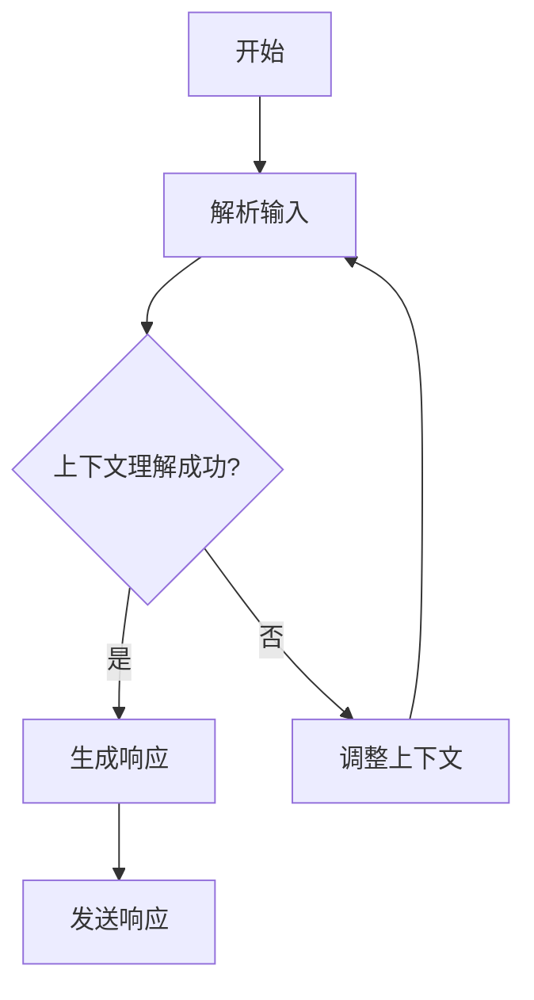

                 

关键词：多轮对话管理、上下文理解、响应生成、人工智能、自然语言处理、聊天机器人

摘要：本文旨在探讨多轮对话管理中上下文理解与响应生成的关键技术，通过阐述核心概念、算法原理、数学模型及项目实践，深入分析其在人工智能和自然语言处理领域的重要性及应用前景。

## 1. 背景介绍

在当今快速发展的信息技术时代，人工智能（AI）和自然语言处理（NLP）成为了引领技术创新的重要领域。特别是在聊天机器人和虚拟助手领域，多轮对话管理技术成为了研究的焦点。多轮对话管理旨在使机器能够理解和回应人类用户的复杂对话请求，提供更加自然、流畅和有用的交互体验。

多轮对话管理涉及到多个关键技术，其中上下文理解和响应生成尤为关键。上下文理解是指机器能够捕捉对话中的语言线索和隐含信息，从而对用户的意图和需求进行准确的理解。响应生成则是基于上下文理解，机器生成恰当的回复，以实现与用户的连贯对话。本文将围绕这两个核心概念，深入探讨多轮对话管理的技术原理、实现方法和应用场景。

## 2. 核心概念与联系

### 2.1. 上下文理解

上下文理解是多轮对话管理的基础，其目标是使机器能够从对话中提取有意义的信息，并在后续对话中加以利用。上下文理解主要包括以下三个方面：

- **语义理解**：通过分析语言结构和语义关系，识别对话中的实体、事件和关系。
- **情感分析**：理解用户的情感状态，以提供更符合用户情绪的响应。
- **上下文推理**：基于已有信息进行逻辑推理，以推断用户未明确表达的需求。

### 2.2. 响应生成

响应生成是基于上下文理解的结果，生成符合对话逻辑和用户需求的回复。响应生成主要分为以下几种类型：

- **模板匹配**：根据预定义的回复模板生成响应，简单直接，但缺乏个性化和灵活性。
- **规则匹配**：基于规则引擎，根据对话历史和上下文信息生成响应，具有较强的逻辑性。
- **基于机器学习**：利用深度学习模型，从大量对话数据中学习生成规则，实现更加自然和个性化的响应。

### 2.3. Mermaid 流程图

以下是一个简单的 Mermaid 流程图，展示了上下文理解与响应生成的主要步骤和流程节点：



## 3. 核心算法原理 & 具体操作步骤

### 3.1. 算法原理概述

多轮对话管理的关键在于如何有效地进行上下文理解和响应生成。以下介绍几种常见的算法原理：

- **序列模型**：如 RNN（循环神经网络）和 LSTM（长短期记忆网络），能够捕捉对话中的时间序列特征。
- **注意力机制**：通过加权对话历史信息，使模型能够关注到对话中的关键信息。
- **图神经网络**：利用图结构表示对话，进行更加复杂的上下文理解和推理。
- **预训练语言模型**：如 GPT（Generative Pre-trained Transformer）和 BERT（Bidirectional Encoder Representations from Transformers），通过预训练学习到丰富的语言知识，提高对话质量。

### 3.2. 算法步骤详解

1. **输入解析**：接收用户输入，进行分词、词性标注等预处理。
2. **上下文提取**：利用序列模型或注意力机制，从对话历史中提取关键信息。
3. **意图识别**：使用分类算法，如朴素贝叶斯、支持向量机或深度学习模型，识别用户的意图。
4. **实体提取**：从解析结果中提取关键实体，如人名、地点、时间等。
5. **情感分析**：利用情感分析模型，判断用户的情感状态。
6. **响应生成**：基于意图识别、实体提取和情感分析结果，生成合适的响应。
7. **响应优化**：通过语言生成模型，如 GPT 或 BERT，对生成的响应进行优化，使其更加自然和流畅。
8. **发送响应**：将优化后的响应发送给用户。

### 3.3. 算法优缺点

- **优点**：
  - 能够实现自然、流畅的多轮对话。
  - 能够处理复杂的对话场景和用户需求。
  - 学习能力强，能够不断优化对话质量。
- **缺点**：
  - 需要大量的训练数据和计算资源。
  - 对上下文理解和响应生成的准确性要求较高。
  - 需要不断调整和优化模型，以适应不同的对话场景。

### 3.4. 算法应用领域

- **聊天机器人**：如客服机器人、社交机器人、教育机器人等。
- **虚拟助手**：如智能助手、智能秘书、智能家居控制等。
- **智能客服**：为企业提供高效的客户服务解决方案。
- **人机交互**：为用户提供更加自然、便捷的交互体验。

## 4. 数学模型和公式 & 详细讲解 & 举例说明

### 4.1. 数学模型构建

多轮对话管理中的数学模型主要涉及以下三个方面：

- **序列模型**：如 RNN 和 LSTM，使用矩阵乘法和激活函数进行计算。
- **注意力机制**：通过计算注意力权重矩阵，对对话历史信息进行加权。
- **图神经网络**：利用图卷积神经网络，进行对话关系的建模。

### 4.2. 公式推导过程

以下是一个简化的 RNN 模型的推导过程：

1. **输入表示**：将输入序列表示为矩阵 X，其中每个元素表示一个词向量。
2. **隐藏状态更新**：使用矩阵乘法和激活函数，更新隐藏状态 H。
   $$ H_t = \text{激活函数}(W_h \cdot [H_{t-1}, X_t]) $$
3. **输出表示**：将隐藏状态表示为矩阵 Y，其中每个元素表示一个词向量。
   $$ Y_t = W_o \cdot H_t $$

### 4.3. 案例分析与讲解

假设有一个对话场景，用户询问“明天天气如何？”以下是一个简化的对话处理过程：

1. **输入解析**：将用户输入“明天天气如何？”进行分词和词性标注。
2. **上下文提取**：从对话历史中提取关键信息，如“明天”、“天气”等。
3. **意图识别**：识别用户的意图为“获取天气信息”。
4. **响应生成**：根据用户意图和上下文信息，生成响应“明天天气晴朗，气温约为 25°C”。
5. **响应优化**：使用 GPT 模型，对生成的响应进行优化，使其更加自然和流畅。

## 5. 项目实践：代码实例和详细解释说明

### 5.1. 开发环境搭建

- **Python 环境**：安装 Python 3.7 以上版本。
- **NLP 库**：安装 TensorFlow、Keras、NLTK、spaCy 等库。

### 5.2. 源代码详细实现

以下是一个简化的多轮对话管理项目的源代码实现：

```python
import tensorflow as tf
from tensorflow.keras.models import Model
from tensorflow.keras.layers import Input, LSTM, Dense, Embedding

# 输入层
input_seq = Input(shape=(max_seq_length,))

# 嵌入层
embed = Embedding(vocab_size, embedding_dim)(input_seq)

# LSTM 层
lstm = LSTM(units=64, activation='tanh')(embed)

# Dense 层
output = Dense(vocab_size, activation='softmax')(lstm)

# 模型
model = Model(inputs=input_seq, outputs=output)

# 编译模型
model.compile(optimizer='adam', loss='categorical_crossentropy', metrics=['accuracy'])

# 训练模型
model.fit(x_train, y_train, epochs=10, batch_size=32)
```

### 5.3. 代码解读与分析

上述代码实现了一个基于 LSTM 的多轮对话管理模型。主要步骤如下：

1. **输入层**：定义输入序列的形状，如长度为 50 的词向量序列。
2. **嵌入层**：将词向量序列映射到高维向量空间。
3. **LSTM 层**：对输入序列进行递归处理，捕捉时间序列特征。
4. **Dense 层**：将 LSTM 层的输出映射到词汇表，生成预测结果。
5. **编译模型**：配置优化器和损失函数，准备训练模型。
6. **训练模型**：使用训练数据，训练模型，优化参数。

### 5.4. 运行结果展示

运行上述代码，训练完成后，可以使用以下代码进行预测和对话：

```python
# 预测
predicted = model.predict(x_test)

# 对话
while True:
    user_input = input("请输入问题：")
    if user_input == '退出':
        break
    input_seq = prepare_input(user_input)
    response = model.predict(input_seq)
    print("机器人回复：", decode_response(response))
```

在对话过程中，用户输入问题，模型根据输入生成回复，实现简单的多轮对话。

## 6. 实际应用场景

多轮对话管理技术在多个领域具有广泛的应用：

- **客服机器人**：为企业提供 7x24 小时全天候的客户服务，提高客户满意度。
- **智能助手**：为个人用户提供日程管理、信息查询、任务提醒等服务。
- **智能客服**：为企业提供高效、智能的客户服务解决方案，降低人工成本。
- **教育领域**：为学生提供个性化辅导、作业批改、考试评测等服务。
- **医疗健康**：为用户提供健康咨询、疾病预防、药物推荐等服务。

### 6.4. 未来应用展望

随着人工智能和自然语言处理技术的不断发展，多轮对话管理技术将得到更加广泛的应用。未来展望包括：

- **更复杂的对话场景**：支持更复杂的对话任务，如情感交流、复杂问题解答等。
- **更强大的上下文理解**：通过深度学习模型和大数据技术，实现更加精准的上下文理解。
- **个性化对话**：根据用户行为和偏好，提供个性化的对话体验。
- **跨语言对话**：实现多语言对话，满足全球用户的需求。

## 7. 工具和资源推荐

### 7.1. 学习资源推荐

- **《深度学习》**：Goodfellow、Bengio 和 Courville 著，全面介绍深度学习的基础知识。
- **《自然语言处理综论》**：Jurafsky 和 Martin 著，详细介绍自然语言处理的理论和实践。
- **《AI 之旅》**：Manning、Rosenshine 和 Schütze 著，涵盖人工智能的基础知识和应用。

### 7.2. 开发工具推荐

- **TensorFlow**：Google 开发的一款开源深度学习框架，适用于各种复杂场景。
- **Keras**：基于 TensorFlow 的高级神经网络 API，简化深度学习模型的搭建。
- **spaCy**：一款强大的自然语言处理库，支持多种语言和丰富的功能。

### 7.3. 相关论文推荐

- **“Attention is All You Need”**：Vaswani 等，介绍 Transformer 模型及其在序列建模中的应用。
- **“BERT: Pre-training of Deep Bidirectional Transformers for Language Understanding”**：Devlin 等，介绍 BERT 模型及其在 NLP 任务中的表现。
- **“Recurrent Neural Network Based Language Model”**：LSTM 模型的经典论文。

## 8. 总结：未来发展趋势与挑战

### 8.1. 研究成果总结

本文围绕多轮对话管理中的上下文理解和响应生成，详细探讨了核心概念、算法原理、数学模型和项目实践。通过分析研究现状，总结了多轮对话管理技术在人工智能和自然语言处理领域的重要性。

### 8.2. 未来发展趋势

随着人工智能和自然语言处理技术的不断发展，多轮对话管理技术将朝着更加智能化、个性化、多模态的方向发展。深度学习、图神经网络、多语言处理等技术将进一步推动多轮对话管理技术的进步。

### 8.3. 面临的挑战

尽管多轮对话管理技术取得了显著进展，但仍面临一些挑战，包括：

- **上下文理解准确性**：如何提高上下文理解的准确性，更好地捕捉对话中的隐含信息。
- **响应生成自然性**：如何生成更加自然、流畅和个性化的响应。
- **跨语言对话**：如何实现跨语言的多轮对话管理，满足全球用户的需求。

### 8.4. 研究展望

未来的研究应重点关注以下几个方面：

- **多模态对话管理**：结合文本、语音、图像等多模态信息，实现更加丰富和自然的对话。
- **个性化对话**：根据用户行为和偏好，提供个性化的对话体验。
- **跨领域对话管理**：拓展多轮对话管理技术在医疗、教育、金融等领域的应用。

## 9. 附录：常见问题与解答

### 9.1. 什么是多轮对话管理？

多轮对话管理是指使机器能够理解和回应人类用户的复杂对话请求，提供更加自然、流畅和有用的交互体验。它涉及到上下文理解和响应生成等关键技术。

### 9.2. 上下文理解有哪些挑战？

上下文理解面临的挑战包括捕捉对话中的隐含信息、处理语言歧义、理解用户情感状态等。此外，如何适应不同领域的对话场景也是一个挑战。

### 9.3. 多轮对话管理有哪些应用领域？

多轮对话管理广泛应用于客服机器人、智能助手、智能客服、教育领域和医疗健康等领域。

### 9.4. 如何优化多轮对话管理模型？

可以通过以下几种方式优化多轮对话管理模型：

- **增加训练数据**：使用更多的对话数据，提高模型的泛化能力。
- **调整模型参数**：通过调整网络结构、学习率等参数，优化模型性能。
- **引入注意力机制**：利用注意力机制，使模型更加关注对话中的关键信息。
- **使用预训练语言模型**：利用预训练语言模型，提高模型的初始性能。

### 9.5. 多轮对话管理技术有哪些发展方向？

未来的多轮对话管理技术将朝着多模态对话管理、个性化对话、跨语言对话管理等方向发展。

---

### 作者署名

作者：禅与计算机程序设计艺术 / Zen and the Art of Computer Programming

