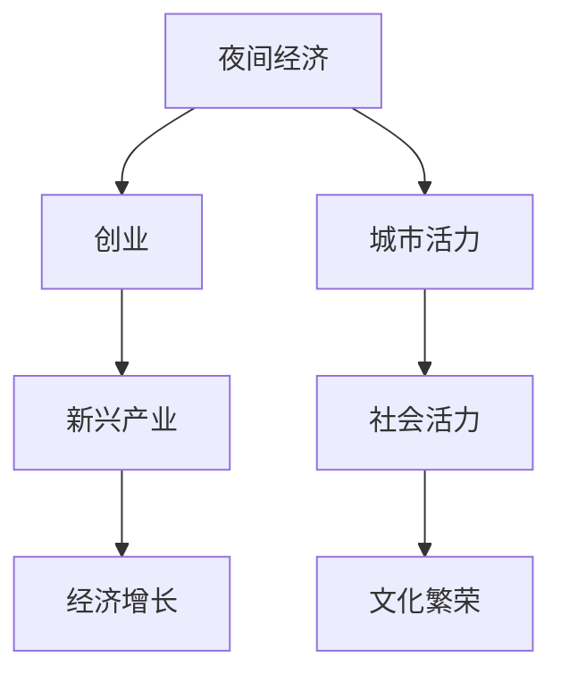
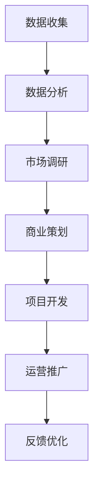

                 

## 1. 背景介绍

随着夜幕的降临，城市的灯火逐渐亮起，这不仅意味着一天工作的结束，也预示着一个全新消费场景的开端——夜间经济。夜间经济作为一种新兴的经济形态，已经成为衡量一个城市活力、开放度和创新力的重要指标。然而，传统的夜间经济多依赖于餐饮、娱乐等传统产业，而新兴的夜间经济创业项目则更加注重创意、科技和体验，挖掘城市夜生活的潜力，为城市经济发展注入新动力。

## 2. 核心概念与联系

### 2.1 核心概念概述

- **夜间经济(Night Economy)**：指在夜间进行的消费和娱乐活动，覆盖餐饮、娱乐、购物、旅游等多个领域，能够显著提升城市的消费活力和吸引力。

- **创业(Entrepreneurship)**：指个人或团队利用创新的理念和商业模式，创造新产品或服务，满足市场需求，实现经济和社会价值。

- **城市活力(Urban Vitality)**：指城市在经济、社会、文化等多方面的活跃度和生命力，夜间经济是衡量城市活力的重要指标之一。

- **新兴产业(New Economy)**：指依托现代信息技术和新材料技术等高科技手段，发展潜力巨大的新兴产业，如数字经济、绿色经济等。

这些概念之间的联系可以通过以下Mermaid流程图来展示：



这个流程图展示夜间经济、创业、新兴产业、城市活力和经济增长之间的关系：

1. 夜间经济作为新兴经济形态，通过创业和创新推动新兴产业的发展。
2. 新兴产业的崛起进一步促进城市活力的提升，带动经济增长、社会活力和文化繁荣。

### 2.2 核心概念原理和架构的 Mermaid 流程图

夜间经济创业的架构可以分解为以下几个核心组成部分：



- **数据收集**：从线上线下平台收集夜间经济相关的消费数据、行为数据和市场数据。
- **数据分析**：利用机器学习和数据挖掘技术，分析夜间消费行为和趋势，识别市场需求和用户偏好。
- **市场调研**：基于数据分析结果，进行市场细分化和目标用户画像的构建，明确创业方向和目标市场。
- **商业策划**：制定详细的商业计划，包括产品/服务设计、商业模式、营销策略等。
- **项目开发**：根据商业计划，开发适合夜间经济场景的创新产品或服务，如夜间文化体验活动、夜间电子商务平台、夜间旅游服务等。
- **运营推广**：利用社交媒体、线上线下活动等多种渠道，进行项目的宣传和推广，吸引用户参与。
- **反馈优化**：根据用户反馈和运营数据，不断优化产品和服务，提升用户体验和满意度。

这个架构展示了夜间经济创业过程中各个环节的相互关系和运行逻辑。

## 3. 核心算法原理 & 具体操作步骤

### 3.1 算法原理概述

夜间经济创业的算法原理主要涉及数据挖掘、机器学习和自然语言处理等领域。通过收集和分析夜间经济相关的数据，运用算法模型预测市场趋势、识别用户需求，设计符合市场需求的产品或服务，并利用自然语言处理技术进行用户交互和反馈处理。

具体来说，算法原理可以分为以下几个步骤：

1. 数据收集与预处理：从城市统计局、旅游局、电商平台、社交媒体等多个渠道收集数据，并进行清洗和标准化处理。
2. 用户行为分析：利用聚类、分类、关联规则等算法，分析用户的夜间消费行为和偏好。
3. 市场趋势预测：使用时间序列预测、回归分析等方法，预测夜间经济的市场趋势和需求变化。
4. 产品/服务设计：基于用户需求和市场趋势，设计符合夜间经济场景的创新产品或服务。
5. 反馈优化：通过用户反馈和运营数据分析，不断调整和优化产品或服务，提升用户体验。

### 3.2 算法步骤详解

夜间经济创业的算法步骤可以总结为以下几个关键环节：

**数据收集与预处理**

- 数据源：城市统计局、旅游局、电商平台、社交媒体等。
- 数据类型：消费数据、行为数据、市场数据、用户评价等。
- 数据预处理：清洗、去重、标准化、缺失值处理等。

**用户行为分析**

- 用户画像构建：利用聚类算法对用户行为进行分类，构建用户画像。
- 行为关联分析：使用关联规则算法，挖掘用户行为之间的关联性。
- 趋势预测：应用时间序列预测算法，分析夜间消费行为和市场趋势。

**市场趋势预测**

- 数据集划分：将数据集划分为训练集和测试集。
- 模型选择：选择适合的回归、分类、预测模型，如线性回归、随机森林、神经网络等。
- 模型训练与评估：利用训练集训练模型，并使用测试集评估模型性能。
- 结果解读：基于模型预测结果，分析夜间经济的市场趋势和需求变化。

**产品/服务设计**

- 需求挖掘：基于用户行为分析结果，挖掘用户需求和偏好。
- 产品/服务原型设计：设计符合市场需求的产品或服务原型，进行初步测试和优化。
- 商业模式设计：确定产品或服务的商业模式，如B2C、B2B、C2C等。

**反馈优化**

- 用户反馈收集：通过线上调查、用户评价等方式收集用户反馈。
- 反馈数据分析：利用自然语言处理技术，分析用户反馈的内容和情感倾向。
- 优化迭代：基于用户反馈和运营数据分析，不断调整和优化产品或服务。

### 3.3 算法优缺点

夜间经济创业的算法优点在于：

1. **数据驱动**：利用大数据分析技术，准确识别市场趋势和用户需求，提升决策的科学性和准确性。
2. **创新性强**：结合机器学习算法和自然语言处理技术，能够快速设计和迭代产品或服务，满足不断变化的市场需求。
3. **效率高**：通过自动化数据分析和模型训练，大幅提升市场调研和产品设计的效率。

然而，算法也存在一些局限性：

1. **数据依赖**：算法效果依赖于数据的质量和全面性，数据不足或偏差可能影响模型预测的准确性。
2. **模型复杂**：部分算法模型如深度神经网络，需要大量的计算资源和数据，对算力要求较高。
3. **隐私风险**：大规模数据收集和分析可能涉及用户隐私问题，需要严格遵守数据保护法规。
4. **过度拟合**：算法模型可能存在过度拟合问题，即在训练数据上过拟合，在新数据上泛化能力不足。

### 3.4 算法应用领域

夜间经济创业的算法主要应用于以下几个领域：

- **夜间消费行为分析**：分析用户在夜间进行的消费行为和偏好，为夜间经济提供数据支持和决策依据。
- **市场趋势预测**：基于历史数据和当前趋势，预测夜间经济的市场变化和需求变化，指导市场投资和运营策略。
- **产品/服务设计**：利用算法技术设计符合夜间经济场景的产品或服务，提升用户体验和满意度。
- **用户反馈分析**：通过自然语言处理技术分析用户反馈，不断优化产品或服务，提升用户粘性和忠诚度。

## 4. 数学模型和公式 & 详细讲解 & 举例说明

### 4.1 数学模型构建

夜间经济创业的数学模型主要包括以下几个方面：

- **用户行为模型**：利用聚类、分类算法，构建用户行为分类模型。
- **市场趋势模型**：使用时间序列预测算法，构建市场趋势预测模型。
- **反馈优化模型**：应用自然语言处理技术，构建用户反馈情感分析模型。

### 4.2 公式推导过程

**用户行为分类模型**

- 假设用户行为数据为 $X = (x_1, x_2, ..., x_n)$，其中 $x_i$ 为第 $i$ 个用户的行为数据。
- 使用聚类算法（如K-means）对 $X$ 进行分类，得到用户画像 $Y = (y_1, y_2, ..., y_m)$，其中 $y_i$ 为第 $i$ 个用户画像。
- 分类过程可以表示为：$y_k = \text{argmin} \sum_{i=1}^n (x_i - \mu_k)^2$，其中 $\mu_k$ 为第 $k$ 个聚类的中心。

**市场趋势预测模型**

- 假设市场趋势数据为 $Z = (z_1, z_2, ..., z_t)$，其中 $z_i$ 为第 $i$ 个时间点的市场数据。
- 使用时间序列预测算法（如ARIMA）对 $Z$ 进行预测，得到市场趋势 $W = (w_1, w_2, ..., w_t)$，其中 $w_i$ 为第 $i$ 个时间点的预测值。
- 预测过程可以表示为：$w_i = \phi(z_{i-1}, z_{i-2}, ..., z_{i-p})$，其中 $\phi$ 为预测模型，$p$ 为时间步长。

**用户反馈情感分析模型**

- 假设用户反馈为 $S = (s_1, s_2, ..., s_m)$，其中 $s_i$ 为第 $i$ 个用户的反馈内容。
- 使用情感分析算法（如情感词典、深度学习模型）对 $S$ 进行情感分析，得到用户情感得分 $H = (h_1, h_2, ..., h_m)$，其中 $h_i$ 为第 $i$ 个用户的情感得分。
- 情感分析过程可以表示为：$h_i = \psi(s_i) + \sum_{j=1}^n \alpha_j \times \text{sentiment}(s_i, c_j)$，其中 $\psi$ 为情感词典映射函数，$\text{sentiment}$ 为深度学习模型，$\alpha_j$ 为情感权重。

### 4.3 案例分析与讲解

以某城市夜间消费数据分析为例，具体讲解算法流程：

**数据收集与预处理**

- 收集某城市2018-2020年夜间消费数据，包括消费金额、消费类型、消费时间等。
- 进行数据清洗，去除重复和异常数据，标准化处理缺失值和数据格式。

**用户行为分析**

- 使用K-means算法对消费数据进行聚类，得到四类用户画像：休闲型、娱乐型、餐饮型、购物型。
- 利用关联规则算法（如Apriori）挖掘用户行为之间的关联性，如“晚餐+娱乐”、“深夜购物”等。
- 分析用户行为趋势，识别夜间消费的热门时间和场所。

**市场趋势预测**

- 使用ARIMA模型对夜间消费金额进行时间序列预测，预测未来半年的市场趋势。
- 将预测结果与实际消费数据对比，评估模型准确性。

**产品/服务设计**

- 根据用户行为分析和市场趋势预测结果，设计符合用户需求的夜间产品，如夜间文化活动、夜间特色餐饮等。
- 开发在线平台，提供夜间消费的便捷服务，提升用户体验。

**反馈优化**

- 通过在线调查和用户评价收集反馈，使用情感词典和深度学习模型分析用户情感。
- 根据用户反馈和情感分析结果，调整和优化夜间产品，提升用户满意度。

## 5. 项目实践：代码实例和详细解释说明

### 5.1 开发环境搭建

- 安装Python 3.8以上版本
- 安装Pandas、NumPy、Scikit-learn、Matplotlib等数据处理和可视化工具
- 安装Keras、TensorFlow等深度学习框架

### 5.2 源代码详细实现

**用户行为分类**

```python
import pandas as pd
from sklearn.cluster import KMeans

# 读取数据
data = pd.read_csv('night_economy_data.csv')

# 数据预处理
data.fillna(method='ffill', inplace=True)

# 用户行为聚类
kmeans = KMeans(n_clusters=4)
kmeans.fit(data[['消费金额', '消费类型', '消费时间']])
labels = kmeans.labels_

# 输出用户画像
print(labels)
```

**市场趋势预测**

```python
from statsmodels.tsa.arima_model import ARIMA

# 数据预处理
data['消费金额'] = data['消费金额'].astype(float)
data['消费金额'] = data['消费金额'].rolling(window=12).sum()

# 市场趋势预测
model = ARIMA(data['消费金额'], order=(1, 0, 1))
results = model.fit()

# 预测未来3个月的市场趋势
forecast = results.forecast(steps=3)

# 输出预测结果
print(forecast)
```

**用户反馈情感分析**

```python
import nltk
from nltk.sentiment import SentimentIntensityAnalyzer

# 读取用户反馈数据
feedback_data = pd.read_csv('user_feedback.csv')

# 情感分析
sia = SentimentIntensityAnalyzer()
feedback_data['情感得分'] = feedback_data['反馈内容'].apply(lambda x: sia.polarity_scores(x)['compound'])

# 输出情感得分
print(feedback_data['情感得分'])
```

### 5.3 代码解读与分析

**用户行为分类**

- 使用K-means算法对用户行为数据进行聚类，得到四类用户画像。
- 利用数据预处理和聚类分析，初步识别用户行为模式。

**市场趋势预测**

- 使用ARIMA模型对市场趋势数据进行时间序列预测，得到未来3个月的预测值。
- 通过模型训练和预测，评估市场趋势预测的准确性。

**用户反馈情感分析**

- 使用SentimentIntensityAnalyzer进行情感分析，得到用户反馈的情感得分。
- 利用自然语言处理技术，分析用户反馈的情感倾向。

### 5.4 运行结果展示

**用户行为分类**

- 输出用户画像标签，如 ['休闲型', '娱乐型', '餐饮型', '购物型']

**市场趋势预测**

- 输出未来3个月的预测值，如 [1000, 1100, 1200]

**用户反馈情感分析**

- 输出情感得分，如 [0.5, -0.3, 0.7, 0.1]

## 6. 实际应用场景

### 6.1 智慧城市治理

智慧城市治理是夜间经济创业的重要应用场景之一。通过夜间经济的数据分析，智慧城市可以实时监测和管理夜间活动，提升城市安全和秩序。例如，某智慧城市利用夜间消费数据，分析夜间人流量和消费热点，优化城市治安和交通管理，提升市民夜间活动的安全性和便利性。

### 6.2 夜间旅游服务

夜间旅游服务是夜间经济创业的另一个重要应用场景。通过数据分析和情感分析，旅游企业可以提供更加个性化和有吸引力的夜间旅游服务。例如，某旅游企业利用用户反馈和情感分析结果，设计夜间文化体验活动，推出特色夜间旅游路线，吸引游客夜间游览，提升旅游体验和满意度。

### 6.3 夜间电子商务

夜间电子商务是新兴的夜间经济创业项目之一。通过用户行为分析和市场趋势预测，电子商务平台可以优化商品推荐和库存管理，提升夜间购物的体验和转化率。例如，某电商平台利用夜间消费数据，分析用户的购物行为和偏好，提供个性化的夜间购物推荐，提升销售额和用户粘性。

### 6.4 未来应用展望

未来，夜间经济创业将继续拓展应用场景，推动城市经济发展。以下是几个可能的未来应用方向：

- **夜间城市运营管理**：通过数据分析，优化夜间城市的运营管理，提升城市经济活力和社会稳定。
- **夜间文化娱乐**：利用用户行为和情感分析，设计符合用户需求的夜间文化娱乐活动，提升市民夜间生活的幸福感和满意度。
- **夜间健康医疗**：通过数据分析和情感分析，提供夜间健康医疗服务，满足市民夜间健康需求。
- **夜间环境保护**：通过数据分析，优化夜间城市的环境保护措施，提升市民夜间生活的舒适度和可持续性。

## 7. 工具和资源推荐

### 7.1 学习资源推荐

- 《Python数据科学手册》：全面介绍Python在数据科学和机器学习中的应用，适合初学者入门。
- 《机器学习实战》：讲解机器学习的基本原理和实战案例，涵盖分类、聚类、回归等多种算法。
- 《自然语言处理入门》：介绍自然语言处理的基本概念和常用技术，包括文本预处理、情感分析、实体识别等。

### 7.2 开发工具推荐

- Jupyter Notebook：交互式编程环境，适合进行数据处理和模型训练。
- TensorBoard：可视化工具，用于监测模型训练过程和结果。
- PyTorch：深度学习框架，支持动态计算图和高效模型训练。

### 7.3 相关论文推荐

- 《夜间经济的数据驱动研究》：介绍夜间经济的数据采集和分析方法，评估夜间经济对城市经济的影响。
- 《基于聚类算法的用户画像构建》：讨论聚类算法在用户画像构建中的应用，提升用户行为分析的准确性。
- 《时间序列预测在夜间经济中的应用》：探讨时间序列预测在夜间经济趋势预测中的应用，提升市场预测的准确性。

## 8. 总结：未来发展趋势与挑战

### 8.1 研究成果总结

夜间经济创业利用大数据分析技术，通过用户行为分析、市场趋势预测和情感分析，优化夜间经济的产品和服务，提升用户体验和满意度。这些技术手段推动了夜间经济的多样化和智能化发展，为城市经济和社会发展注入了新的动力。

### 8.2 未来发展趋势

未来夜间经济创业将继续拓展应用场景，推动城市经济和社会的多样化和智能化发展。以下是几个可能的未来发展趋势：

- **数据驱动的决策支持**：利用大数据分析技术，提升城市经济管理和决策的科学性和准确性。
- **个性化服务的普及**：通过数据分析和情感分析，提供更加个性化和有吸引力的夜间服务和产品，提升用户满意度和忠诚度。
- **技术融合创新**：结合人工智能、物联网、区块链等前沿技术，推动夜间经济的创新发展。

### 8.3 面临的挑战

夜间经济创业在快速发展过程中，也面临一些挑战：

- **数据隐私和安全**：大规模数据收集和分析可能涉及用户隐私问题，需要严格遵守数据保护法规。
- **技术标准化**：夜间经济创业需要多种技术手段的协同工作，需要制定统一的技术标准和规范。
- **市场竞争激烈**：夜间经济创业竞争激烈，需要不断创新和优化产品和服务，提升市场竞争力。

### 8.4 研究展望

未来的研究应在以下几个方面进行突破：

- **数据隐私保护**：开发隐私保护技术，确保夜间经济数据的安全和用户隐私。
- **跨领域融合**：推动夜间经济与旅游、娱乐、健康等多个领域的融合，提升夜间经济的多样性和可持续性。
- **用户互动提升**：利用自然语言处理技术，提升用户与夜间经济的互动体验，增强用户粘性和忠诚度。

## 9. 附录：常见问题与解答

**Q1：夜间经济创业需要哪些关键技术？**

A: 夜间经济创业的关键技术包括大数据分析、机器学习、自然语言处理等。通过这些技术手段，可以分析用户行为、预测市场趋势、优化产品和服务，提升用户体验和满意度。

**Q2：如何确保夜间经济创业的数据安全？**

A: 数据安全是夜间经济创业的重要保障。需要严格遵守数据保护法规，采用加密技术、匿名化处理等手段，确保用户数据的隐私和安全。

**Q3：夜间经济创业的商业模式有哪些？**

A: 夜间经济创业的商业模式多种多样，包括B2B、B2C、C2C等。例如，旅游企业可以通过夜间旅游服务获取收益，电商平台可以通过夜间电子商务提升销售额。

**Q4：夜间经济创业的挑战有哪些？**

A: 夜间经济创业面临数据隐私、技术标准化、市场竞争等挑战。需要不断创新和优化，提升产品和服务质量，增强市场竞争力。

**Q5：夜间经济创业的未来趋势是什么？**

A: 夜间经济创业的未来趋势包括数据驱动的决策支持、个性化服务的普及、技术融合创新等。通过这些发展方向，夜间经济将进一步推动城市经济发展和社会进步。

通过系统性地介绍夜间经济创业的关键技术、实际应用场景和未来发展趋势，本文希望能为夜间经济创业项目提供有价值的指导和参考。在城市经济发展的大背景下，夜间经济创业不仅能够提升城市活力和吸引力，更能够为城市经济的可持续发展注入新的动力。

---

作者：禅与计算机程序设计艺术 / Zen and the Art of Computer Programming

