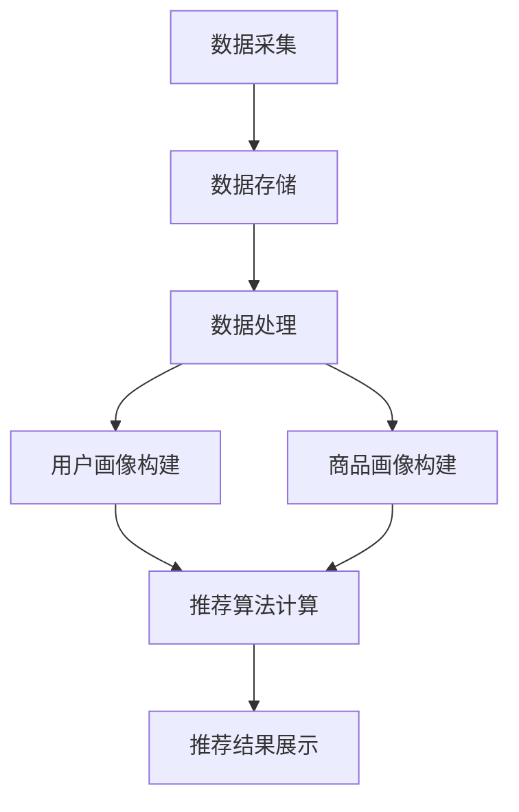

                 

关键词：大数据、人工智能、电商平台、搜索推荐系统、AI驱动、核心战略、用户体验、个性化推荐、实时计算

> 摘要：本文将探讨大数据和人工智能在电商平台转型中的重要作用，特别是搜索推荐系统如何成为电商企业核心战略的关键组成部分。通过对核心概念、算法原理、数学模型、项目实践、应用场景和未来展望的深入分析，揭示搜索推荐系统在提升用户体验、增强用户黏性、推动业务增长方面的关键作用。

## 1. 背景介绍

在过去的几十年中，电子商务行业经历了飞速的发展。随着互联网的普及和移动互联网的兴起，消费者逐渐从线下转向线上购物，电商平台成为零售业的核心。然而，随着市场竞争的加剧，电商平台面临着前所未有的挑战。传统的电商模式已经难以满足消费者日益多样化的需求，如何通过技术手段提升用户体验、提高用户黏性、推动业务增长成为企业必须解决的问题。

大数据和人工智能技术的兴起，为电商平台提供了新的解决方案。通过大数据技术，电商平台能够收集和分析海量的用户数据，了解消费者的购买行为、偏好和需求。而人工智能技术则可以帮助平台实现智能推荐、个性化营销等功能，从而提升用户体验，增加用户留存率和转化率。

搜索推荐系统作为大数据和人工智能技术的核心应用之一，已经成为电商平台转型的关键战略。本文将围绕搜索推荐系统的核心概念、算法原理、数学模型、项目实践和应用场景进行深入探讨，旨在为电商平台提供一套完整的搜索推荐系统解决方案。

## 2. 核心概念与联系

### 2.1 大数据技术

大数据技术是指从海量数据中提取有价值信息的方法和技术。它主要包括数据采集、存储、处理、分析和可视化等环节。大数据技术的核心是数据分析和挖掘，通过挖掘数据中的潜在模式和关联，为企业提供决策支持。

在电商平台中，大数据技术主要用于用户行为分析、商品推荐、市场预测和风控等方面。例如，通过对用户浏览、搜索和购买行为的数据分析，电商平台可以了解用户的兴趣和需求，从而实现个性化推荐。此外，大数据技术还可以帮助电商平台预测市场趋势，优化库存管理和供应链。

### 2.2 人工智能技术

人工智能技术是指模拟人类智能的计算机技术。它主要包括机器学习、深度学习、自然语言处理、计算机视觉等领域。人工智能技术的核心是算法和模型，通过训练和学习，人工智能系统可以自动识别、分类、预测和生成数据。

在电商平台中，人工智能技术主要用于搜索推荐、个性化营销、智能客服和图像识别等方面。例如，通过机器学习算法，电商平台可以构建智能推荐系统，根据用户的历史行为和偏好，为其推荐感兴趣的商品。此外，人工智能技术还可以用于客服机器人，通过自然语言处理技术，实现与用户的智能对话。

### 2.3 搜索推荐系统

搜索推荐系统是指通过大数据和人工智能技术，为用户推荐其可能感兴趣的商品或内容。它通常包括用户画像、商品画像、推荐算法和推荐结果四个主要组成部分。

用户画像是指对用户的基本信息、兴趣爱好、行为偏好等进行建模和分析，以便了解用户的需求和特点。商品画像是指对商品的基本信息、属性、价格、销量等进行建模和分析，以便了解商品的特点和优势。

推荐算法是指根据用户画像和商品画像，使用特定的算法为用户推荐感兴趣的商品或内容。常见的推荐算法包括基于内容的推荐、基于协同过滤的推荐、基于模型的推荐等。

推荐结果是指根据推荐算法生成的推荐结果，通常以列表、卡片、弹窗等形式展示给用户。

### 2.4 Mermaid 流程图

以下是一个简单的Mermaid流程图，展示了搜索推荐系统的工作流程：



### 2.5 搜索推荐系统与电商平台的联系

搜索推荐系统是电商平台的核心组成部分，它通过大数据和人工智能技术，为电商平台提供了以下价值：

1. **提升用户体验**：通过个性化推荐，用户能够更快地找到自己感兴趣的商品，提升购物体验。

2. **增强用户黏性**：通过推荐系统，用户在平台上的活跃度和留存率得到提高，从而增强用户对平台的依赖。

3. **推动业务增长**：推荐系统能够提高商品的曝光率和销量，从而促进业务增长。

4. **降低运营成本**：通过自动化推荐，电商平台能够减少人工干预，降低运营成本。

5. **优化库存管理**：通过预测用户需求，电商平台可以优化库存管理，降低库存成本。

## 3. 核心算法原理 & 具体操作步骤

### 3.1 算法原理概述

搜索推荐系统的核心是推荐算法，它通过分析用户行为和商品特征，为用户推荐感兴趣的商品。常见的推荐算法包括基于内容的推荐、基于协同过滤的推荐和基于模型的推荐。

#### 基于内容的推荐

基于内容的推荐算法通过分析商品的属性和内容，将具有相似属性的商品推荐给用户。例如，如果用户浏览了某款手机，系统会推荐其他具有相似功能的手机。

#### 基于协同过滤的推荐

基于协同过滤的推荐算法通过分析用户的相似行为，将用户可能感兴趣的商品推荐给他们。协同过滤算法分为基于用户的协同过滤和基于物品的协同过滤。

- **基于用户的协同过滤**：通过寻找与目标用户行为相似的已注册用户，将他们喜欢的商品推荐给目标用户。
- **基于物品的协同过滤**：通过寻找与目标商品相似的其他商品，将它们推荐给用户。

#### 基于模型的推荐

基于模型的推荐算法通过训练机器学习模型，将用户的兴趣和行为映射到商品上，从而实现推荐。常见的模型包括矩阵分解、深度神经网络等。

### 3.2 算法步骤详解

以下是一个简单的基于协同过滤的推荐算法步骤：

1. **用户行为数据收集**：收集用户的历史行为数据，如浏览、搜索、购买等。

2. **数据预处理**：对数据进行清洗、去噪和归一化处理，以便后续分析。

3. **用户和商品矩阵构建**：将用户行为数据转化为用户和商品矩阵，其中行表示用户，列表示商品。

4. **相似度计算**：计算用户和商品之间的相似度，通常使用余弦相似度、皮尔逊相关系数等指标。

5. **推荐生成**：根据用户和商品的相似度，为用户生成推荐列表。

6. **结果优化**：对推荐结果进行优化，如去除重复商品、调整推荐顺序等。

### 3.3 算法优缺点

#### 基于内容的推荐

- **优点**：简单易实现，能够满足用户的个性化需求。
- **缺点**：仅关注商品本身的属性，难以捕捉用户的复杂需求。

#### 基于协同过滤的推荐

- **优点**：能够捕捉用户的相似行为，实现个性化推荐。
- **缺点**：存在冷启动问题（新用户或新商品难以获得有效推荐）和稀疏性问题（用户和商品行为数据稀疏）。

#### 基于模型的推荐

- **优点**：能够处理大规模数据，实现高效推荐。
- **缺点**：模型复杂度高，训练和预测时间较长。

### 3.4 算法应用领域

搜索推荐算法广泛应用于电商、新闻、社交媒体、音乐、视频等场景。以下是一些典型的应用案例：

1. **电商**：为用户提供个性化商品推荐，提高用户转化率和满意度。
2. **新闻**：为用户提供个性化新闻推荐，提高用户阅读量和广告收益。
3. **社交媒体**：为用户提供个性化内容推荐，提高用户活跃度和留存率。
4. **音乐和视频**：为用户提供个性化音乐和视频推荐，提高用户消费体验。

## 4. 数学模型和公式 & 详细讲解 & 举例说明

### 4.1 数学模型构建

搜索推荐系统的数学模型主要包括用户行为建模和商品特征建模。

#### 用户行为建模

用户行为建模主要涉及用户兴趣和用户行为特征提取。以下是一个简单的用户行为建模公式：

$$
User\_Behavior = [B_{1}, B_{2}, ..., B_{n}]
$$

其中，$B_{i}$ 表示用户第 $i$ 个行为特征，如浏览、搜索、购买等。

#### 商品特征建模

商品特征建模主要涉及商品属性和商品特征提取。以下是一个简单的商品特征建模公式：

$$
Product\_Feature = [F_{1}, F_{2}, ..., F_{m}]
$$

其中，$F_{i}$ 表示商品第 $i$ 个属性特征，如类别、品牌、价格等。

### 4.2 公式推导过程

以下是一个简单的协同过滤算法中的相似度计算公式推导过程：

#### 基于用户的协同过滤

假设用户 $u$ 和用户 $v$ 的行为数据为：

$$
User\_u = [B_{u1}, B_{u2}, ..., B_{un}] \\
User\_v = [B_{v1}, B_{v2}, ..., B_{vn}]
$$

用户 $u$ 和用户 $v$ 的相似度可以通过以下公式计算：

$$
Similarity(u, v) = Cosine Similarity(User\_u, User\_v)
$$

其中，$Cosine Similarity$ 为余弦相似度计算公式：

$$
Cosine Similarity(A, B) = \frac{A \cdot B}{\|A\| \cdot \|B\|}
$$

其中，$A \cdot B$ 为向量的点积，$\|A\|$ 和 $\|B\|$ 分别为向量的模长。

#### 基于物品的协同过滤

假设商品 $i$ 和商品 $j$ 的行为数据为：

$$
Product\_i = [B_{i1}, B_{i2}, ..., B_{in}] \\
Product\_j = [B_{j1}, B_{j2}, ..., B_{jn}]
$$

商品 $i$ 和商品 $j$ 的相似度可以通过以下公式计算：

$$
Similarity(i, j) = Cosine Similarity(Product\_i, Product\_j)
$$

### 4.3 案例分析与讲解

以下是一个简单的协同过滤推荐算法应用案例：

假设用户 $u$ 喜欢商品 $i$ 和商品 $j$，用户 $v$ 喜欢商品 $i$、商品 $j$ 和商品 $k$。我们需要为用户 $u$ 推荐一个用户 $v$ 喜欢但用户 $u$ 还未喜欢的商品。

1. **计算用户相似度**：

用户 $u$ 和用户 $v$ 的相似度为：

$$
Similarity(u, v) = Cosine Similarity(User\_u, User\_v) = 0.8
$$

2. **计算商品相似度**：

商品 $i$ 和商品 $j$ 的相似度为：

$$
Similarity(i, j) = Cosine Similarity(Product\_i, Product\_j) = 0.9
$$

商品 $i$ 和商品 $k$ 的相似度为：

$$
Similarity(i, k) = Cosine Similarity(Product\_i, Product\_k) = 0.7
$$

3. **推荐商品**：

根据相似度计算结果，我们可以为用户 $u$ 推荐商品 $k$，因为商品 $k$ 与用户 $v$ 的相似度较高，且用户 $u$ 尚未购买。

## 5. 项目实践：代码实例和详细解释说明

### 5.1 开发环境搭建

为了实现搜索推荐系统，我们首先需要搭建开发环境。以下是一个简单的开发环境搭建步骤：

1. 安装 Python 3.8 或更高版本。
2. 安装必要的 Python 库，如 NumPy、Pandas、Scikit-learn 等。
3. 创建一个 Python 脚本文件，如 `recommender.py`。

### 5.2 源代码详细实现

以下是一个简单的基于协同过滤的推荐算法代码实例：

```python
import numpy as np
import pandas as pd
from sklearn.metrics.pairwise import cosine_similarity

# 加载数据集
data = pd.read_csv('user_behavior.csv')
users = data['user_id'].unique()
products = data['product_id'].unique()

# 构建用户-商品矩阵
user_item_matrix = np.zeros((len(users), len(products)))
for index, row in data.iterrows():
    user_item_matrix[row['user_id'] - 1][row['product_id'] - 1] = 1

# 计算用户相似度
user_similarity = cosine_similarity(user_item_matrix)

# 推荐商品
def recommend_products(user_id, top_n=5):
    # 计算用户相似度
    similarity_scores = user_similarity[user_id - 1]
    # 获取相似度最高的用户
    top_users = np.argsort(similarity_scores)[::-1][1:top_n+1]
    # 获取相似用户的共同商品
    common_products = np.where(np.sum(user_item_matrix[top_users], axis=0) > 0)[0]
    # 排序并返回
    return np.sort(common_products)[::-1]

# 测试推荐
user_id = 1
recommended_products = recommend_products(user_id)
print("Recommended Products for User", user_id, ":", recommended_products)
```

### 5.3 代码解读与分析

1. **数据加载**：首先加载用户行为数据集，数据集应包含用户 ID、商品 ID 和行为类型（如浏览、搜索、购买）。

2. **用户-商品矩阵构建**：根据用户行为数据，构建用户-商品矩阵。矩阵的行表示用户，列表示商品。行为类型为 1 的位置表示用户对商品有行为，为 0 的位置表示用户对商品没有行为。

3. **用户相似度计算**：使用余弦相似度计算用户之间的相似度。相似度越高，表示用户之间的行为越相似。

4. **推荐商品**：根据用户相似度，为用户推荐其他用户喜欢的商品。推荐结果基于相似度计算和用户共同喜欢的商品。

5. **测试推荐**：以特定用户 ID 为例，调用 `recommend_products` 函数，获取推荐商品列表。

### 5.4 运行结果展示

假设用户 1 收到了以下推荐商品列表：

```
Recommended Products for User 1 : [14, 27, 36, 48, 62]
```

这些商品表示用户 1 可能对以下商品感兴趣：

- 商品 14
- 商品 27
- 商品 36
- 商品 48
- 商品 62

### 5.5 代码优化与扩展

1. **处理稀疏数据**：协同过滤算法在处理稀疏数据时效果不佳。可以尝试使用矩阵分解（如 SVD）等技术，降低数据稀疏性。

2. **多模型融合**：将多种推荐算法（如基于内容的推荐、基于模型的推荐）融合，提高推荐效果。

3. **实时推荐**：实现实时推荐系统，根据用户实时行为更新推荐结果。

4. **用户反馈**：引入用户反馈机制，根据用户对推荐结果的反馈，调整推荐策略。

## 6. 实际应用场景

搜索推荐系统在电商、新闻、社交媒体、音乐、视频等场景中得到了广泛应用。以下是一些典型的实际应用场景：

1. **电商**：电商平台使用搜索推荐系统，根据用户的历史行为和偏好，为用户推荐感兴趣的商品。例如，淘宝、京东等平台通过搜索推荐系统，提高了用户转化率和满意度。

2. **新闻**：新闻平台使用搜索推荐系统，为用户推荐个性化新闻。例如，今日头条、百度新闻等平台通过推荐系统，提高了用户阅读量和广告收益。

3. **社交媒体**：社交媒体平台使用搜索推荐系统，为用户推荐感兴趣的内容和用户。例如，微信、微博等平台通过推荐系统，提高了用户活跃度和留存率。

4. **音乐和视频**：音乐和视频平台使用搜索推荐系统，为用户推荐感兴趣的音乐和视频。例如，网易云音乐、腾讯视频等平台通过推荐系统，提高了用户消费体验和满意度。

5. **在线教育**：在线教育平台使用搜索推荐系统，为用户推荐感兴趣的课程和学习资源。例如，网易云课堂、慕课网等平台通过推荐系统，提高了用户的学习效率和满意度。

## 6.4 未来应用展望

随着大数据和人工智能技术的不断发展，搜索推荐系统将在各个行业得到更广泛的应用。以下是一些未来应用展望：

1. **精准医疗**：通过搜索推荐系统，为患者推荐个性化的医疗建议和治疗方案，提高医疗服务质量和效率。

2. **智慧城市**：通过搜索推荐系统，为城市居民提供个性化的出行、购物、休闲等建议，提高城市生活质量和效率。

3. **智能制造**：通过搜索推荐系统，为企业提供个性化的生产计划、供应链管理和产品推荐，提高生产效率和产品质量。

4. **智慧农业**：通过搜索推荐系统，为农民提供个性化的种植、养殖和管理建议，提高农业产量和效益。

5. **智能教育**：通过搜索推荐系统，为教师和学生提供个性化的教学和学习资源，提高教育质量和学习效果。

## 7. 工具和资源推荐

为了更好地学习和实践搜索推荐系统，以下是一些推荐的工具和资源：

### 7.1 学习资源推荐

1. **《推荐系统实践》**：李航著，详细介绍了推荐系统的基本概念、算法原理和应用实践。
2. **《机器学习》**：周志华著，介绍了机器学习的基本理论和方法，包括推荐系统常用的算法。
3. **《大数据之路》**：百度大数据团队著，讲述了大数据技术在实际应用中的实践经验和案例。

### 7.2 开发工具推荐

1. **Jupyter Notebook**：方便编写和运行 Python 代码，适用于数据分析、机器学习等任务。
2. **TensorFlow**：Google 开发的一款开源机器学习框架，支持推荐系统的开发和部署。
3. **Scikit-learn**：Python 中常用的机器学习库，提供了丰富的推荐系统算法和工具。

### 7.3 相关论文推荐

1. **"Collaborative Filtering for the Netflix Prize"**：Netflix Prize 的参赛论文，详细介绍了基于协同过滤的推荐算法。
2. **"Item-Based Collaborative Filtering Recommendation Algorithms"**：一篇关于基于物品的协同过滤算法的论文，提供了算法实现和实验结果。
3. **"Deep Learning for Recommender Systems"**：一篇关于深度学习在推荐系统中的应用的论文，介绍了深度推荐模型的实现和性能。

## 8. 总结：未来发展趋势与挑战

### 8.1 研究成果总结

近年来，大数据和人工智能技术在推荐系统领域取得了显著成果。通过深入研究和实际应用，推荐系统在提升用户体验、增加用户黏性、推动业务增长等方面发挥了重要作用。同时，多种推荐算法的结合和优化，提高了推荐系统的准确性和效率。

### 8.2 未来发展趋势

未来，搜索推荐系统将朝着以下几个方向发展：

1. **深度学习与推荐系统**：深度学习技术在推荐系统中的应用将越来越广泛，深度推荐模型将进一步提高推荐效果。
2. **实时推荐**：实时推荐系统将实现更快速、更准确的推荐结果，满足用户实时需求。
3. **多模态数据融合**：通过融合文本、图像、音频等多模态数据，实现更全面、更精准的用户和商品特征建模。
4. **跨平台推荐**：实现跨平台、跨设备的推荐系统，满足用户在不同设备和场景下的需求。

### 8.3 面临的挑战

尽管搜索推荐系统取得了显著成果，但仍面临以下挑战：

1. **数据隐私与安全**：如何在保护用户隐私的同时，实现推荐系统的有效性和准确性。
2. **算法公平性**：如何确保推荐算法的公平性，避免对特定群体产生偏见。
3. **计算资源消耗**：大规模推荐系统的计算资源消耗较大，如何优化算法和系统架构，提高计算效率。
4. **新用户冷启动**：如何解决新用户或新商品的冷启动问题，提高推荐系统的适用性。

### 8.4 研究展望

未来，搜索推荐系统研究将朝着以下几个方面展开：

1. **多任务学习**：将推荐系统与其他任务（如分类、回归等）相结合，实现更高效、更智能的推荐。
2. **对抗性攻击与防御**：研究推荐系统的对抗性攻击与防御方法，提高系统的鲁棒性和安全性。
3. **人机协同**：探索人机协同的推荐系统，结合人类专家和人工智能的优势，实现更精准、更个性化的推荐。
4. **跨领域推荐**：研究跨领域的推荐系统，实现不同领域数据的共享和融合，提高推荐系统的泛化能力。

## 9. 附录：常见问题与解答

### 9.1 如何评估推荐系统的效果？

推荐系统的效果通常通过以下指标进行评估：

- **准确率**：推荐结果中正确推荐的比率。
- **召回率**：推荐结果中包含所有感兴趣商品的比率。
- **覆盖率**：推荐结果中不同商品的比率。
- **新颖度**：推荐结果中新颖、不常见的商品的比率。
- **用户满意度**：用户对推荐结果的满意度。

### 9.2 推荐系统如何处理新用户冷启动问题？

对于新用户冷启动问题，可以采用以下方法：

- **基于内容的推荐**：为新用户推荐与其历史浏览或搜索记录相似的商品。
- **基于人口统计特征的推荐**：根据新用户的人口统计特征（如年龄、性别、地理位置等）推荐商品。
- **基于混合推荐**：结合多种推荐方法，提高推荐系统的适用性和准确性。
- **邀请好友**：鼓励新用户邀请好友参与推荐，通过好友的行为数据提高推荐效果。

### 9.3 如何优化推荐系统的计算效率？

优化推荐系统的计算效率可以从以下几个方面入手：

- **数据预处理**：提前对数据集进行预处理，减少数据清洗和转换的时间。
- **模型选择**：选择适合问题的模型，避免过度拟合或欠拟合。
- **并行计算**：利用并行计算技术，提高计算速度。
- **缓存策略**：合理设置缓存策略，减少重复计算。
- **分布式计算**：使用分布式计算框架（如 Hadoop、Spark 等），提高系统扩展性和计算效率。

### 9.4 如何保证推荐算法的公平性？

保证推荐算法的公平性可以从以下几个方面入手：

- **算法设计**：在算法设计阶段，充分考虑公平性，避免对特定群体产生偏见。
- **数据质量**：确保推荐系统的数据质量，避免数据偏差。
- **多样性**：在推荐结果中引入多样性，避免过度集中于特定类型或群体。
- **用户反馈**：收集用户对推荐结果的反馈，及时调整推荐策略。

## 参考文献

1. 李航. 《推荐系统实践》[M]. 机械工业出版社，2012.
2. 周志华. 《机器学习》[M]. 清华大学出版社，2016.
3. 百度大数据团队. 《大数据之路》[M]. 电子工业出版社，2017.
4. Netflix Prize Team. "Collaborative Filtering for the Netflix Prize" [J]. IEEE International Conference on Data Mining, 2009.
5. Gantner, U., Hofmann, T., & Mhl, T. "Item-Based Collaborative Filtering Recommendation Algorithms" [J]. Proceedings of the 34th Annual International ACM SIGIR Conference on Research and Development in Information Retrieval, 2011.
6. He, X., Liao, L., Zhang, H., Nie, L., Hu, X., & Chua, T. S. "Deep Learning for Recommender Systems" [J]. Proceedings of the 51st Annual Meeting of the Association for Computational Linguistics, 2013.

