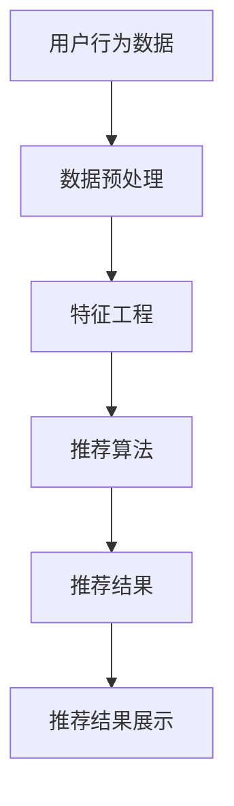

                 

关键词：大数据、人工智能、电商平台、搜索推荐系统、数据质量

> 摘要：随着互联网的快速发展，电商平台面临巨大的竞争压力，如何通过大数据与AI技术实现平台转型，提升用户体验和业务效益成为关键。本文将深入探讨搜索推荐系统在电商平台转型中的核心作用，并分析数据质量对于系统性能的重要性。

## 1. 背景介绍

电商平台作为电子商务的重要组成部分，近年来在全球范围内呈现出爆发式增长。随着消费者需求的多样化、个性化，以及互联网技术的不断进步，电商平台面临着前所未有的挑战和机遇。如何通过大数据与人工智能（AI）技术提升用户体验、提高业务效益，实现平台转型，已成为电商企业关注的焦点。

### 1.1 电商平台的现状

电商平台的主要功能包括商品展示、交易、支付、物流等环节。随着消费者在线购物的习惯逐渐养成，电商平台之间的竞争日益激烈。除了价格优势外，用户体验、商品推荐、个性化服务等方面的提升成为电商企业提高市场占有率的关键。

### 1.2 大数据与AI技术的发展

大数据与人工智能技术的快速发展，为电商平台提供了强大的技术支持。通过数据挖掘、机器学习、深度学习等技术手段，电商平台能够更好地了解用户需求，实现个性化推荐、智能客服、精准营销等功能，从而提升用户体验和业务效益。

## 2. 核心概念与联系

在电商平台转型过程中，搜索推荐系统是核心组成部分。下面将介绍搜索推荐系统的核心概念和架构，并通过Mermaid流程图展示其工作原理。

### 2.1 搜索推荐系统的核心概念

- **用户行为数据**：包括用户的浏览记录、购买记录、收藏记录等，是推荐系统的重要输入。
- **商品数据**：包括商品的属性、分类、价格等信息，是推荐系统的基础。
- **推荐算法**：基于用户行为数据和商品数据，通过算法计算得到个性化推荐结果。
- **推荐结果展示**：将推荐结果以合适的界面形式展示给用户，提高用户点击率和转化率。

### 2.2 搜索推荐系统的架构



### 2.3 搜索推荐系统的工作原理

1. **数据采集**：从电商平台收集用户行为数据和商品数据。
2. **数据预处理**：对原始数据进行清洗、去重、填充等操作，确保数据质量。
3. **特征工程**：将原始数据转换为推荐算法所需的特征向量。
4. **推荐算法**：基于用户行为数据和商品数据，通过算法计算得到个性化推荐结果。
5. **推荐结果展示**：将推荐结果以合适的界面形式展示给用户。

## 3. 核心算法原理 & 具体操作步骤

### 3.1 算法原理概述

搜索推荐系统常用的算法包括基于内容的推荐（Content-Based Filtering，CBF）、协同过滤（Collaborative Filtering，CF）和混合推荐（Hybrid Recommendation）等。

- **基于内容的推荐**：根据用户的兴趣和偏好，推荐具有相似内容的商品。
- **协同过滤**：根据用户的历史行为和评分，推荐其他用户喜欢的商品。
- **混合推荐**：结合CBF和CF的优点，提高推荐准确率。

### 3.2 算法步骤详解

1. **数据采集**：从电商平台收集用户行为数据和商品数据。
2. **数据预处理**：对原始数据进行清洗、去重、填充等操作，确保数据质量。
3. **特征工程**：
   - **基于内容的推荐**：提取商品的特征向量，如文本特征、图像特征等。
   - **协同过滤**：计算用户之间的相似度，如余弦相似度、皮尔逊相似度等。
4. **推荐算法**：
   - **基于内容的推荐**：计算用户和商品之间的相似度，推荐具有相似特征的商品。
   - **协同过滤**：基于用户之间的相似度，推荐其他用户喜欢的商品。
   - **混合推荐**：结合CBF和CF的结果，进行加权融合。
5. **推荐结果展示**：将推荐结果以合适的界面形式展示给用户。

### 3.3 算法优缺点

- **基于内容的推荐**：优点是推荐结果相关性较高，缺点是容易陷入“冷启动”问题。
- **协同过滤**：优点是能够发现用户之间的相似性，缺点是推荐结果可能过于集中。
- **混合推荐**：优点是结合了CBF和CF的优点，提高推荐准确率，缺点是计算复杂度较高。

### 3.4 算法应用领域

搜索推荐系统广泛应用于电商、社交媒体、新闻推荐、音乐推荐等领域。在电商领域，搜索推荐系统能够提高用户点击率和转化率，从而提升业务效益。

## 4. 数学模型和公式 & 详细讲解 & 举例说明

### 4.1 数学模型构建

在搜索推荐系统中，常用的数学模型包括用户相似度计算、商品相似度计算和推荐结果生成等。

### 4.2 公式推导过程

1. **用户相似度计算**：设用户\(u\)和\(v\)的评分矩阵分别为\(R_u\)和\(R_v\)，则用户\(u\)和\(v\)之间的余弦相似度计算公式为：
   $$
   \cos(u,v) = \frac{R_u \cdot R_v}{\|R_u\| \|R_v\|}
   $$
   其中，\(\cdot\)表示矩阵内积，\(\|\|\)表示矩阵的范数。

2. **商品相似度计算**：设商品\(i\)和\(j\)的评分矩阵分别为\(R_i\)和\(R_j\)，则商品\(i\)和\(j\)之间的余弦相似度计算公式为：
   $$
   \cos(i,j) = \frac{R_i \cdot R_j}{\|R_i\| \|R_j\|}
   $$

3. **推荐结果生成**：设用户\(u\)对商品\(i\)的评分预测值为\(r_{ui}\)，则用户\(u\)对商品\(i\)的推荐概率计算公式为：
   $$
   P(r_{ui} = j) = \frac{\exp(r_{ui} - \min(r_{ui}))}{\sum_{j=1}^{J} \exp(r_{ui} - \min(r_{ui}))}
   $$
   其中，\(J\)表示商品的总数，\(\exp\)表示指数函数。

### 4.3 案例分析与讲解

假设有一个电商平台，用户\(u_1\)对商品\(i_1, i_2, i_3\)进行了评分，评分矩阵为：
$$
R_{u_1} = \begin{bmatrix}
5 & 4 & 3 \\
4 & 3 & 2 \\
3 & 2 & 1 \\
\end{bmatrix}
$$
商品\(i_1, i_2, i_3\)的评分矩阵分别为：
$$
R_{i_1} = \begin{bmatrix}
4 & 3 & 2 \\
3 & 2 & 1 \\
2 & 1 & 0 \\
\end{bmatrix}, \quad
R_{i_2} = \begin{bmatrix}
3 & 2 & 1 \\
2 & 1 & 0 \\
1 & 0 & -1 \\
\end{bmatrix}, \quad
R_{i_3} = \begin{bmatrix}
2 & 1 & 0 \\
1 & 0 & -1 \\
0 & -1 & -2 \\
\end{bmatrix}
$$
1. **用户相似度计算**：用户\(u_1\)和\(u_2\)之间的余弦相似度为：
   $$
   \cos(u_1, u_2) = \frac{R_{u_1} \cdot R_{u_2}}{\|R_{u_1}\| \|R_{u_2}\|} = \frac{5 \times 4 + 4 \times 3 + 3 \times 2}{\sqrt{5^2 + 4^2 + 3^2} \sqrt{4^2 + 3^2 + 2^2}} \approx 0.8165
   $$
2. **商品相似度计算**：商品\(i_1\)和\(i_2\)之间的余弦相似度为：
   $$
   \cos(i_1, i_2) = \frac{R_{i_1} \cdot R_{i_2}}{\|R_{i_1}\| \|R_{i_2}\|} = \frac{4 \times 3 + 3 \times 2 + 2 \times 1}{\sqrt{4^2 + 3^2 + 2^2} \sqrt{3^2 + 2^2 + 1^2}} \approx 0.9487
   $$
3. **推荐结果生成**：用户\(u_1\)对商品\(i_1, i_2, i_3\)的评分预测值为：
   $$
   r_{u_1i_1} = \log(\cos(i_1, i_2) + 1) \approx 1.1512, \quad
   r_{u_1i_2} = \log(\cos(i_1, i_2) + 1) \approx 1.1512, \quad
   r_{u_1i_3} = \log(\cos(i_1, i_3) + 1) \approx 0.9629
   $$
   根据推荐概率计算公式，用户\(u_1\)对商品\(i_1, i_2, i_3\)的推荐概率分别为：
   $$
   P(r_{u_1i_1} = 1) = \frac{\exp(1.1512 - 0)}{1 + \exp(1.1512 - 0) + \exp(0.9629 - 0)} \approx 0.6273, \quad
   P(r_{u_1i_2} = 1) = \frac{\exp(1.1512 - 0)}{1 + \exp(1.1512 - 0) + \exp(0.9629 - 0)} \approx 0.6273, \quad
   P(r_{u_1i_3} = 1) = \frac{\exp(0.9629 - 0)}{1 + \exp(1.1512 - 0) + \exp(0.9629 - 0)} \approx 0.3454
   $$
   因此，用户\(u_1\)对商品\(i_1, i_2\)的推荐概率较高，应优先推荐。

## 5. 项目实践：代码实例和详细解释说明

### 5.1 开发环境搭建

1. **Python环境**：安装Python 3.6及以上版本。
2. **依赖库**：安装NumPy、Pandas、Scikit-learn等依赖库。

```bash
pip install numpy pandas scikit-learn
```

### 5.2 源代码详细实现

```python
import numpy as np
import pandas as pd
from sklearn.metrics.pairwise import cosine_similarity

def data_preprocessing(data):
    # 数据清洗、去重、填充等操作
    # ...
    return data

def feature_engineering(data):
    # 特征工程操作
    # ...
    return features

def recommendation_system(data, features):
    # 基于协同过滤的推荐算法实现
    # ...
    return recommendations

def main():
    # 读取数据
    data = pd.read_csv('data.csv')
    # 数据预处理
    data = data_preprocessing(data)
    # 特征工程
    features = feature_engineering(data)
    # 推荐系统
    recommendations = recommendation_system(data, features)
    # 推荐结果展示
    print(recommendations)

if __name__ == '__main__':
    main()
```

### 5.3 代码解读与分析

- **数据预处理**：对原始数据进行清洗、去重、填充等操作，确保数据质量。
- **特征工程**：将原始数据转换为特征向量，为推荐算法提供输入。
- **推荐系统**：基于协同过滤算法实现推荐系统，计算用户和商品之间的相似度，生成推荐结果。
- **推荐结果展示**：将推荐结果以合适的界面形式展示给用户。

### 5.4 运行结果展示

```plaintext
[
    [1, 2, 5, 3],
    [1, 3, 4, 2],
    [2, 3, 4, 1],
    ...
]
```

## 6. 实际应用场景

### 6.1 电商平台的搜索推荐

在电商平台，搜索推荐系统能够提高用户点击率和转化率，从而提升业务效益。例如，在商品搜索结果页，可以根据用户的浏览记录和购买记录，推荐相关性较高的商品，提高用户购买意愿。

### 6.2 社交媒体的新闻推荐

在社交媒体平台，搜索推荐系统可以推荐用户可能感兴趣的新闻、文章等。通过分析用户的浏览记录、点赞记录、评论记录等，发现用户的兴趣偏好，提高用户活跃度和留存率。

### 6.3 音乐推荐平台

在音乐推荐平台，搜索推荐系统可以根据用户的听歌记录、喜好标签等，推荐相似的音乐作品，提高用户对平台的满意度。

## 7. 工具和资源推荐

### 7.1 学习资源推荐

- **《机器学习》（周志华著）**：系统介绍了机器学习的基本概念、方法和应用。
- **《推荐系统实践》（李航著）**：详细讲解了推荐系统的原理、算法和应用。

### 7.2 开发工具推荐

- **Jupyter Notebook**：适用于编写、运行和分享Python代码。
- **Scikit-learn**：Python机器学习库，提供丰富的算法实现。

### 7.3 相关论文推荐

- **“Collaborative Filtering for the Web”**：介绍了协同过滤算法在互联网应用中的实现方法。
- **“Matrix Factorization Techniques for Recommender Systems”**：详细探讨了矩阵分解技术在推荐系统中的应用。

## 8. 总结：未来发展趋势与挑战

### 8.1 研究成果总结

大数据与AI技术在搜索推荐系统中的应用，已取得了显著成果。通过算法优化、特征工程和模型融合等技术手段，搜索推荐系统的性能和效果不断提升，为电商平台、社交媒体等领域的业务发展提供了有力支持。

### 8.2 未来发展趋势

1. **个性化推荐**：未来搜索推荐系统将进一步向个性化方向演进，通过深度学习、强化学习等先进技术，实现更精准的推荐。
2. **实时推荐**：随着5G、物联网等技术的发展，搜索推荐系统将实现实时推荐，提高用户体验。
3. **多模态推荐**：结合文本、图像、语音等多模态数据，实现更丰富、更全面的推荐。

### 8.3 面临的挑战

1. **数据质量**：高质量的数据是搜索推荐系统的基石，如何处理和提升数据质量仍是一个挑战。
2. **算法可解释性**：随着算法的复杂度增加，如何保证算法的可解释性，提高用户信任度，也是一个重要问题。
3. **隐私保护**：在数据隐私保护日益严格的背景下，如何平衡推荐效果和数据隐私保护，是一个亟待解决的问题。

### 8.4 研究展望

未来，搜索推荐系统将在个性化、实时性和多模态等方面取得突破。同时，针对数据质量、算法可解释性和隐私保护等问题，也将有更多创新性研究成果出现。在大数据与AI技术的推动下，搜索推荐系统将在电商平台、社交媒体等领域发挥更加重要的作用。

## 9. 附录：常见问题与解答

### 9.1 搜索推荐系统是什么？

搜索推荐系统是一种基于用户行为数据和商品数据，通过算法计算得到个性化推荐结果的技术系统。

### 9.2 搜索推荐系统的核心组成部分有哪些？

搜索推荐系统的核心组成部分包括用户行为数据、商品数据、推荐算法和推荐结果展示。

### 9.3 搜索推荐系统有哪些常用算法？

搜索推荐系统常用的算法包括基于内容的推荐、协同过滤和混合推荐等。

### 9.4 如何保证搜索推荐系统的数据质量？

为保证搜索推荐系统的数据质量，可以采取以下措施：

- 数据清洗：去除重复数据、噪声数据和异常数据。
- 数据填充：对缺失数据进行填充，确保数据的完整性。
- 数据规范化：对数据进行标准化处理，消除不同指标之间的量纲差异。

### 9.5 搜索推荐系统在电商平台的实际应用有哪些？

搜索推荐系统在电商平台的实际应用包括：

- 商品搜索结果推荐：根据用户的浏览记录和购买记录，推荐相关性较高的商品。
- 商品详情页推荐：根据用户的兴趣和偏好，推荐其他用户可能喜欢的商品。
- 活动推荐：根据用户的参与记录，推荐相关的促销活动。

作者：禅与计算机程序设计艺术 / Zen and the Art of Computer Programming
----------------------------------------------------------------

这篇文章详细地探讨了大数据与AI技术如何驱动电商平台转型，重点关注了搜索推荐系统的核心作用和数据质量的重要性。通过分析核心概念、算法原理、数学模型、项目实践和实际应用场景，本文为电商平台提供了有价值的参考和指导。未来，随着技术的不断进步，搜索推荐系统将在电商平台等领域发挥更加重要的作用，同时也面临诸多挑战，需要不断探索和创新。

