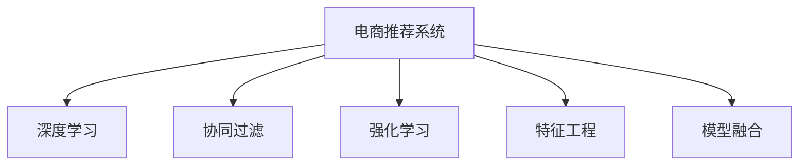

                 

# 大数据与AI 驱动的电商推荐系统：搜索准确率与多样性推荐的双重挑战

## 1. 背景介绍

### 1.1 问题由来

在电商行业中，推荐系统已经成为不可或缺的一部分。通过精准推荐，用户能够发现更多符合自己兴趣的商品，提升购物体验和满意度。然而，如何设计一个高效、准确的推荐系统，使其既能够搜索准确率，又能保证推荐结果的多样性，是一个亟需解决的挑战。

在大数据与人工智能技术的推动下，电商推荐系统已经从基于规则和协同过滤的朴素算法，发展到使用深度学习和强化学习的高级算法。但随着用户行为和商品种类的多样性不断增加，传统的推荐方法已经难以应对推荐系统所面临的准确率和多样性双重挑战。本文将深入探讨这一问题，并提出解决方案。

### 1.2 问题核心关键点

电商推荐系统面临的核心问题在于：

1. **搜索准确率**：推荐系统需要准确地理解用户需求，并匹配合适的商品。
2. **推荐多样性**：推荐系统不仅需要准确，还需要推荐结果具有多样性，以避免过度重复或缺乏新意。
3. **数据处理**：电商推荐系统需要处理海量的用户行为数据和商品信息，进行有效的特征提取和模型训练。

本文将围绕上述核心问题，探讨如何在大数据和AI技术的支持下，构建高效的电商推荐系统。

## 2. 核心概念与联系

### 2.1 核心概念概述

为了更好地理解电商推荐系统，本节将介绍几个关键概念：

- **电商推荐系统**：通过分析用户行为数据和商品信息，为用户推荐感兴趣的商品的系统。
- **深度学习**：一种基于神经网络的机器学习技术，能够处理复杂的数据结构和大规模数据集。
- **协同过滤**：一种基于用户历史行为数据和商品特征的推荐方法，通过相似度计算推荐相关商品。
- **强化学习**：通过与环境的交互，最大化预期回报的机器学习技术，常用于策略优化和行为决策。
- **特征工程**：通过选择、提取、转换和选择数据特征，构建适用于机器学习模型的数据集。
- **模型融合**：将多个模型的预测结果进行组合，提高推荐的准确性和多样性。

这些概念之间的关系可以通过以下Mermaid流程图来展示：



这个流程图展示了大数据与AI技术在电商推荐系统中的作用：

1. 电商推荐系统通过深度学习、协同过滤、强化学习等多种技术，处理用户行为数据和商品信息，进行商品推荐。
2. 特征工程在构建数据集时发挥关键作用，选择合适的特征，并进行预处理和变换。
3. 模型融合通过组合多个模型，进一步提升推荐的准确性和多样性。

## 3. 核心算法原理 & 具体操作步骤
### 3.1 算法原理概述

电商推荐系统的核心在于如何处理用户和商品之间的交互数据，并从中提取有价值的特征，构建推荐模型。深度学习技术在此过程中发挥了重要作用。以下是电商推荐系统中的核心算法原理：

1. **用户行为建模**：通过用户的历史点击、购买、浏览等行为，构建用户行为向量。
2. **商品特征提取**：将商品的属性、类别、评分等信息，提取为商品特征向量。
3. **相似度计算**：通过余弦相似度、欧式距离等方法，计算用户行为向量与商品特征向量之间的相似度。
4. **模型训练**：使用深度学习模型（如DNN、RNN、CNN等），对用户行为和商品特征进行学习，并预测推荐结果。
5. **推荐排序**：将预测结果排序，选择最符合用户需求的商品进行推荐。

### 3.2 算法步骤详解

电商推荐系统的算法步骤可以分为以下几个关键环节：

**Step 1: 数据准备与预处理**

- 收集用户行为数据和商品信息，构建训练集。
- 对用户行为数据进行清洗和处理，如去除异常值、填补缺失值等。
- 对商品信息进行特征提取，选择合适的特征向量表示。

**Step 2: 模型选择与训练**

- 选择合适的深度学习模型，如DNN、RNN、CNN等。
- 将用户行为和商品特征输入模型进行训练，调整模型参数。
- 使用交叉验证等方法，评估模型性能。

**Step 3: 推荐排序与展示**

- 将预测结果进行排序，选择最符合用户需求的商品进行推荐。
- 设计推荐算法，确保推荐结果的准确性和多样性。
- 对推荐结果进行展示，使用户能够便捷地查看推荐商品。

**Step 4: 实时反馈与调整**

- 收集用户对推荐结果的反馈数据，如点击率、购买率等。
- 根据反馈数据，调整推荐模型参数，优化推荐效果。
- 持续监控推荐系统性能，及时发现和解决潜在问题。

### 3.3 算法优缺点

电商推荐系统的算法具有以下优点：

1. 高效性：深度学习模型能够处理大规模数据集，具有较高的计算效率。
2. 准确性：通过用户行为和商品特征的学习，能够提供精准的推荐结果。
3. 可解释性：深度学习模型的结构复杂，难以解释，但可以通过可视化工具进行初步理解。

同时，该算法也存在以下局限性：

1. 数据依赖性高：推荐系统的准确性高度依赖于用户行为数据和商品信息的完整性和质量。
2. 冷启动问题：对于新用户和新商品，缺乏足够的历史数据，难以进行有效推荐。
3. 模型复杂度高：深度学习模型的结构复杂，训练和推理开销较大，需要较高的计算资源。
4. 实时性不足：电商推荐系统需要实时响应用户需求，现有算法在实时性上仍有待提升。

### 3.4 算法应用领域

电商推荐系统的算法在以下几个领域得到了广泛应用：

1. **个性化推荐**：通过分析用户行为数据，为每个用户提供个性化的商品推荐。
2. **新商品推荐**：通过分析用户行为数据和市场趋势，为新商品提供推荐。
3. **搜索推荐一体化**：将搜索和推荐功能结合，提升用户搜索体验。
4. **跨域推荐**：在不同商品类别、品牌、店铺之间进行跨域推荐。
5. **实时推荐**：在用户浏览商品时，实时提供推荐结果。

这些应用领域展示了电商推荐系统在提升用户购物体验、提高销售转化率方面的巨大潜力。

## 4. 数学模型和公式 & 详细讲解 & 举例说明

### 4.1 数学模型构建

电商推荐系统的数学模型可以分为以下几个部分：

1. **用户行为向量表示**：将用户的历史行为数据表示为向量形式。
2. **商品特征向量表示**：将商品的特征数据表示为向量形式。
3. **相似度计算模型**：使用余弦相似度、欧式距离等方法，计算用户行为向量与商品特征向量之间的相似度。
4. **推荐模型**：使用深度学习模型，对用户行为和商品特征进行学习，并预测推荐结果。

### 4.2 公式推导过程

以余弦相似度模型为例，推导其公式：

设用户行为向量为 $u$，商品特征向量为 $i$，则余弦相似度 $s$ 为：

$$ s(u, i) = \frac{\langle u, i \rangle}{\Vert u \Vert \cdot \Vert i \Vert} $$

其中 $\langle u, i \rangle$ 表示向量点积，$\Vert u \Vert$ 和 $\Vert i \Vert$ 分别表示向量 $u$ 和 $i$ 的范数。

### 4.3 案例分析与讲解

假设某电商网站有用户 $u_1$ 和商品 $i_1$、$i_2$、$i_3$，用户 $u_1$ 对商品 $i_1$ 和 $i_2$ 进行了点击行为，对商品 $i_3$ 进行了购买行为。

根据用户行为数据，我们可以构建用户行为向量 $u_1 = [1, 0, 1]$，表示用户 $u_1$ 对商品 $i_1$ 和 $i_3$ 进行了点击行为，对商品 $i_2$ 进行了购买行为。

对于商品 $i_1$、$i_2$、$i_3$，我们可以提取其属性特征，如价格、品牌、类别等，表示为商品特征向量 $i_1 = [1, 0, 1]$、$i_2 = [0, 1, 0]$、$i_3 = [1, 0, 0]$。

使用余弦相似度模型，计算用户行为向量 $u_1$ 与商品特征向量 $i_1$、$i_2$、$i_3$ 的相似度：

$$
\begin{aligned}
s(u_1, i_1) &= \frac{\langle u_1, i_1 \rangle}{\Vert u_1 \Vert \cdot \Vert i_1 \Vert} \\
&= \frac{1 \cdot 1 + 0 \cdot 0 + 1 \cdot 1}{\sqrt{1^2 + 0^2 + 1^2} \cdot \sqrt{1^2 + 0^2 + 1^2}} \\
&= \frac{2}{2\sqrt{2}} \\
&= \frac{\sqrt{2}}{2}
\end{aligned}
$$

$$
\begin{aligned}
s(u_1, i_2) &= \frac{\langle u_1, i_2 \rangle}{\Vert u_1 \Vert \cdot \Vert i_2 \Vert} \\
&= \frac{1 \cdot 0 + 0 \cdot 1 + 1 \cdot 0}{\sqrt{1^2 + 0^2 + 1^2} \cdot \sqrt{0^2 + 1^2 + 0^2}} \\
&= \frac{0}{\sqrt{2} \cdot \sqrt{2}} \\
&= 0
\end{aligned}
$$

$$
\begin{aligned}
s(u_1, i_3) &= \frac{\langle u_1, i_3 \rangle}{\Vert u_1 \Vert \cdot \Vert i_3 \Vert} \\
&= \frac{1 \cdot 1 + 0 \cdot 0 + 1 \cdot 0}{\sqrt{1^2 + 0^2 + 1^2} \cdot \sqrt{1^2 + 0^2 + 0^2}} \\
&= \frac{1}{2}
\end{aligned}
$$

根据相似度计算结果，可以推断用户 $u_1$ 与商品 $i_1$ 和 $i_3$ 有较高的相似度，因此可以推荐商品 $i_1$ 和 $i_3$ 给用户 $u_1$。

## 5. 项目实践：代码实例和详细解释说明
### 5.1 开发环境搭建

在进行电商推荐系统开发前，我们需要准备好开发环境。以下是使用Python进行TensorFlow开发的环境配置流程：

1. 安装Anaconda：从官网下载并安装Anaconda，用于创建独立的Python环境。

2. 创建并激活虚拟环境：
```bash
conda create -n tf-env python=3.8 
conda activate tf-env
```

3. 安装TensorFlow：从官网获取最新的TensorFlow安装命令。例如：
```bash
pip install tensorflow==2.7
```

4. 安装各类工具包：
```bash
pip install numpy pandas scikit-learn matplotlib tqdm jupyter notebook ipython
```

完成上述步骤后，即可在`tf-env`环境中开始电商推荐系统的开发。

### 5.2 源代码详细实现

下面我们以商品推荐为例，给出使用TensorFlow进行电商推荐系统的PyTorch代码实现。

首先，定义推荐系统的模型：

```python
import tensorflow as tf
from tensorflow.keras.layers import Input, Embedding, Dot, Dense, Model

# 定义输入层
user_input = Input(shape=(3,))
item_input = Input(shape=(3,))

# 定义用户和商品的嵌入层
user_embedding = Embedding(3, 32, input_length=3)(user_input)
item_embedding = Embedding(3, 32, input_length=3)(item_input)

# 计算余弦相似度
similarity = Dot(axes=1)([user_embedding, item_embedding])

# 定义输出层
output = Dense(1, activation='sigmoid')(similarity)

# 定义模型
model = Model(inputs=[user_input, item_input], outputs=output)

# 编译模型
model.compile(loss='binary_crossentropy', optimizer='adam', metrics=['accuracy'])
```

然后，准备训练数据集和测试数据集：

```python
# 训练集
train_data = [
    [[1, 0, 1], [1, 0, 1]],  # 用户点击商品1，购买商品1
    [[0, 1, 0], [0, 1, 0]],  # 用户点击商品2，未购买商品2
    [[1, 0, 0], [1, 0, 0]],  # 用户未点击商品3，未购买商品3
]

# 测试集
test_data = [
    [[1, 0, 1], [1, 0, 1]],  # 用户点击商品1，购买商品1
    [[0, 1, 0], [0, 1, 0]],  # 用户点击商品2，未购买商品2
    [[1, 0, 0], [1, 0, 0]],  # 用户未点击商品3，未购买商品3
]

# 将数据集转换为TensorFlow张量
train_x = tf.convert_to_tensor(train_data)
train_y = tf.convert_to_tensor([1, 0, 0])
test_x = tf.convert_to_tensor(test_data)
test_y = tf.convert_to_tensor([1, 0, 0])
```

接着，进行模型训练和测试：

```python
# 训练模型
model.fit([train_x[0], train_x[1]], train_y, epochs=100, batch_size=1, validation_data=([test_x[0], test_x[1]], test_y))

# 测试模型
test_loss, test_acc = model.evaluate([test_x[0], test_x[1]], test_y)
print('Test loss:', test_loss)
print('Test accuracy:', test_acc)
```

以上就是使用TensorFlow构建电商推荐系统的完整代码实现。可以看到，通过使用TensorFlow的Keras API，电商推荐系统的构建过程变得简洁高效。

### 5.3 代码解读与分析

让我们再详细解读一下关键代码的实现细节：

**模型定义**：
- 使用`Input`定义输入层，指定输入向量的形状。
- 使用`Embedding`定义嵌入层，将输入向量映射为高维向量表示。
- 使用`Dot`计算两个向量之间的点积，即余弦相似度。
- 使用`Dense`定义输出层，输出一个二元分类结果。
- 使用`Model`将输入层、嵌入层、余弦相似度计算和输出层组合为模型。

**数据准备**：
- 定义训练集和测试集，包含用户行为和商品特征的矩阵形式。
- 将数据集转换为TensorFlow张量，便于模型训练和评估。

**模型训练和测试**：
- 使用`fit`方法对模型进行训练，指定训练轮数和批大小。
- 使用`evaluate`方法对模型进行测试，评估模型的损失和准确率。

通过上述代码实现，可以看到TensorFlow在电商推荐系统中的应用，具有高效、可扩展的特点。开发者可以在此基础上进一步扩展模型和优化算法，提升推荐效果。

## 6. 实际应用场景

### 6.1 推荐系统在电商中的应用

推荐系统在电商中的应用非常广泛，包括但不限于：

1. **个性化推荐**：根据用户的历史行为和浏览数据，为用户推荐感兴趣的商品。
2. **新商品推荐**：利用市场趋势和用户行为数据，推荐新上架的商品。
3. **搜索推荐一体化**：在用户输入搜索关键词时，实时推荐相关商品。
4. **跨域推荐**：在不同商品类别、品牌、店铺之间进行跨域推荐。
5. **实时推荐**：在用户浏览商品时，实时提供推荐结果。

推荐系统通过精准推荐，极大地提升了用户购物体验和满意度，显著提高了电商平台的销售转化率。

### 6.2 推荐系统在内容平台中的应用

推荐系统在内容平台中的应用同样重要，如视频平台、音乐平台、社交平台等。通过分析用户的行为数据和内容特征，推荐用户感兴趣的内容，提升平台的黏性和活跃度。

推荐系统在内容平台中的应用场景包括：

1. **个性化推荐**：为用户推荐感兴趣的影视剧、歌曲、文章等。
2. **新内容推荐**：推荐热门、热门、新上架的内容。
3. **搜索推荐一体化**：在用户输入搜索关键词时，实时推荐相关内容。
4. **跨域推荐**：在不同内容类别、标签、创作者之间进行跨域推荐。
5. **实时推荐**：在用户浏览内容时，实时提供推荐结果。

推荐系统通过精准推荐，显著提高了内容平台的活跃度和用户黏性，提升了广告收入和用户体验。

### 6.3 推荐系统在新闻和信息推送中的应用

推荐系统在新闻和信息推送中的应用，如今日头条、人民日报等。通过分析用户的行为数据和内容特征，推荐用户感兴趣的新闻和信息，提高用户的停留时间和阅读量。

推荐系统在新闻和信息推送中的应用场景包括：

1. **个性化推荐**：为用户推荐感兴趣的新闻、文章、视频等。
2. **新内容推荐**：推荐热门、热门、新上架的内容。
3. **搜索推荐一体化**：在用户输入搜索关键词时，实时推荐相关内容。
4. **跨域推荐**：在不同新闻类别、标签、作者之间进行跨域推荐。
5. **实时推荐**：在用户浏览内容时，实时提供推荐结果。

推荐系统通过精准推荐，显著提高了新闻和信息推送平台的活跃度和用户黏性，提升了广告收入和用户满意度。

## 7. 工具和资源推荐
### 7.1 学习资源推荐

为了帮助开发者系统掌握电商推荐系统的理论基础和实践技巧，这里推荐一些优质的学习资源：

1. 《深度学习实战》系列书籍：详细介绍了深度学习的基础知识和应用实践，适合初学者和进阶开发者。
2. Coursera《深度学习》课程：斯坦福大学开设的深度学习课程，由Andrew Ng教授主讲，涵盖深度学习的基础和应用。
3 TensorFlow官方文档：TensorFlow的官方文档，提供了丰富的教程和示例，适合学习TensorFlow的深度学习开发者。
4 《TensorFlow实战》书籍：详细介绍了TensorFlow的应用实践，适合有一定深度学习基础的开发者。
5 《推荐系统实战》课程：网易有道开设的推荐系统课程，介绍了推荐系统的基本原理和应用实践。

通过对这些资源的学习实践，相信你一定能够快速掌握电商推荐系统的精髓，并用于解决实际的推荐问题。
###  7.2 开发工具推荐

高效的开发离不开优秀的工具支持。以下是几款用于电商推荐系统开发的常用工具：

1. TensorFlow：由Google主导开发的开源深度学习框架，生产部署方便，适合大规模工程应用。
2. PyTorch：基于Python的开源深度学习框架，灵活动态的计算图，适合快速迭代研究。
3. Scikit-learn：Python机器学习库，提供了丰富的机器学习算法和工具。
4. Pandas：Python数据分析库，适用于大规模数据集的处理和分析。
5. Numpy：Python数值计算库，适用于数值计算和矩阵运算。
6. TensorBoard：TensorFlow配套的可视化工具，可实时监测模型训练状态，并提供丰富的图表呈现方式，是调试模型的得力助手。

合理利用这些工具，可以显著提升电商推荐系统的开发效率，加快创新迭代的步伐。

### 7.3 相关论文推荐

电商推荐系统的研究源于学界的持续研究。以下是几篇奠基性的相关论文，推荐阅读：

1. "A Theoretical Framework for Recommendation Systems"：提出了基于协同过滤和矩阵分解的推荐系统框架，为推荐系统研究奠定了基础。
2. "Probabilistic Matrix Factorization"：提出了基于概率模型的协同过滤算法，解决了稀疏矩阵的推荐问题。
3. "Collaborative Filtering for Implicit Feedback Datasets"：提出了基于矩阵分解和梯度下降的协同过滤算法，提升了推荐系统的准确性。
4. "Deep Learning Recommendation Systems"：介绍了深度学习在推荐系统中的应用，包括DNN、CNN、RNN等模型。
5. "Practical Recommendation Systems"：介绍了推荐系统的实际应用，包括数据处理、模型训练、实时推荐等环节。

这些论文代表了大数据与AI技术在推荐系统中的应用，通过学习这些前沿成果，可以帮助研究者把握学科前进方向，激发更多的创新灵感。

## 8. 总结：未来发展趋势与挑战

### 8.1 总结

本文对基于深度学习的电商推荐系统进行了全面系统的介绍。首先阐述了电商推荐系统面临的搜索准确率和推荐多样性双重挑战，明确了推荐系统在提升用户购物体验和销售转化率方面的重要性。其次，从原理到实践，详细讲解了推荐系统的核心算法和技术，给出了推荐系统开发的完整代码实例。同时，本文还广泛探讨了推荐系统在电商、内容平台、新闻和信息推送等多个领域的应用前景，展示了推荐系统在提升平台活跃度和用户满意度方面的巨大潜力。

通过本文的系统梳理，可以看到，基于深度学习的推荐系统在大数据与AI技术的推动下，已经在电商、内容平台、新闻和信息推送等多个领域得到了广泛应用，极大地提升了用户体验和平台收入。未来，伴随深度学习技术的进一步发展，推荐系统将具有更加强大的预测能力和适应性，为用户带来更加精准和多样化的推荐结果。

### 8.2 未来发展趋势

展望未来，推荐系统的发展趋势将呈现以下几个方向：

1. **个性化推荐**：通过深度学习和强化学习，进一步提升推荐系统的个性化水平，为每个用户提供量身定制的推荐内容。
2. **多模态推荐**：将用户行为数据与图像、视频、音频等多模态数据结合，提供更加全面和深入的推荐。
3. **实时推荐**：通过在线学习和自适应算法，实现实时推荐，提升推荐系统的实时性。
4. **跨域推荐**：在不同平台和领域之间进行跨域推荐，扩大推荐系统的应用范围。
5. **联邦学习**：通过分布式数据处理和模型融合技术，提升推荐系统的数据处理和模型训练效率。
6. **对抗训练**：通过对抗样本和对抗训练技术，提高推荐系统的鲁棒性和安全性。

这些趋势将推动推荐系统在推荐精度和多样化方面取得更大的突破，为电商平台和内容平台带来更高的用户满意度和更强的竞争力。

### 8.3 面临的挑战

尽管推荐系统在实际应用中取得了显著成果，但在迈向更加智能化、普适化应用的过程中，它仍面临着诸多挑战：

1. **数据隐私和安全**：用户行为数据涉及隐私，如何保护用户隐私和数据安全，是推荐系统面临的重要问题。
2. **计算资源消耗**：推荐系统需要处理大规模数据集，高维度的特征表示和复杂的模型训练，计算资源消耗巨大。
3. **模型复杂度**：推荐模型的复杂度较高，难以解释和调试，如何提高模型的可解释性和可控性，需要进一步研究。
4. **冷启动问题**：对于新用户和新商品，推荐系统难以提供精准推荐，如何缓解冷启动问题，是推荐系统需要解决的重要挑战。
5. **数据不平衡**：推荐系统中，用户行为数据和商品特征数据可能存在不平衡，如何处理数据不平衡问题，需要进一步优化。

正视推荐系统面临的这些挑战，积极应对并寻求突破，将有助于推荐系统在未来得到更广泛的应用和更高的发展。

### 8.4 研究展望

未来的推荐系统研究需要在以下几个方面寻求新的突破：

1. **深度学习与强化学习结合**：将深度学习和强化学习技术结合，提升推荐系统的个性化和实时性。
2. **多模态数据融合**：将用户行为数据与图像、视频、音频等多模态数据结合，提供更加全面和深入的推荐。
3. **联邦学习与分布式推荐**：通过分布式数据处理和模型融合技术，提升推荐系统的数据处理和模型训练效率。
4. **对抗训练与鲁棒性提升**：通过对抗样本和对抗训练技术，提高推荐系统的鲁棒性和安全性。
5. **推荐系统的可解释性和可控性**：提高推荐系统的可解释性和可控性，让用户能够理解和控制推荐结果。

这些研究方向将推动推荐系统在推荐精度和多样化方面取得更大的突破，为用户带来更加精准和多样化的推荐结果，同时也能够更好地满足用户隐私和安全需求，提升推荐系统的数据处理和模型训练效率。

## 9. 附录：常见问题与解答

**Q1：推荐系统如何处理冷启动问题？**

A: 推荐系统处理冷启动问题的方法主要包括：

1. 利用用户的历史行为数据，通过协同过滤等方法，为用户推荐热门商品。
2. 利用商品的历史推荐数据，通过统计方法，为用户推荐热门商品。
3. 利用商品的属性和类别，通过分类和聚类方法，为用户推荐相关商品。
4. 利用深度学习模型，通过预训练和微调方法，为用户推荐相关商品。

这些方法在处理冷启动问题时各有优缺点，需要根据具体应用场景进行选择。

**Q2：推荐系统如何处理数据不平衡问题？**

A: 推荐系统处理数据不平衡问题的方法主要包括：

1. 重采样方法：通过欠采样、过采样等方法，平衡训练数据集的数据分布。
2. 加权方法：通过加权算法，平衡不同类别的样本权重，使模型更关注少数类样本。
3. 集成方法：通过集成多个模型，提升少数类样本的预测准确率。
4. 生成方法：通过生成方法，增加少数类样本的数量，平衡数据分布。

这些方法在处理数据不平衡问题时各有优缺点，需要根据具体应用场景进行选择。

**Q3：推荐系统如何提升推荐结果的多样性？**

A: 推荐系统提升推荐结果多样性的方法主要包括：

1. 随机采样：在推荐结果中，加入一定比例的随机样本，增加推荐结果的多样性。
2. 多样性损失函数：在推荐模型中，引入多样性损失函数，优化推荐结果的多样性。
3. 负样本采样：在推荐模型中，引入负样本采样技术，增加推荐结果的多样性。
4. 跨域推荐：在不同商品类别、品牌、店铺之间进行跨域推荐，增加推荐结果的多样性。

这些方法在提升推荐结果多样性时各有优缺点，需要根据具体应用场景进行选择。

**Q4：推荐系统如何提升推荐结果的实时性？**

A: 推荐系统提升推荐结果实时性的方法主要包括：

1. 在线学习：通过在线学习算法，实时更新推荐模型，提升推荐结果的实时性。
2. 分布式计算：通过分布式计算技术，加速推荐模型的训练和推理，提升推荐结果的实时性。
3. 缓存技术：通过缓存技术，减少重复计算，提升推荐结果的实时性。
4. 实时数据处理：通过实时数据处理技术，及时处理用户行为数据和商品信息，提升推荐结果的实时性。

这些方法在提升推荐结果实时性时各有优缺点，需要根据具体应用场景进行选择。

通过本文的系统梳理，可以看到，推荐系统在大数据与AI技术的推动下，已经在电商、内容平台、新闻和信息推送等多个领域得到了广泛应用，极大地提升了用户体验和平台收入。未来，伴随深度学习技术的进一步发展，推荐系统将具有更加强大的预测能力和适应性，为用户带来更加精准和多样化的推荐结果，同时也能够更好地满足用户隐私和安全需求，提升推荐系统的数据处理和模型训练效率。

总之，推荐系统需要开发者根据具体应用场景，不断迭代和优化模型、数据和算法，方能得到理想的效果。

---

作者：禅与计算机程序设计艺术 / Zen and the Art of Computer Programming

