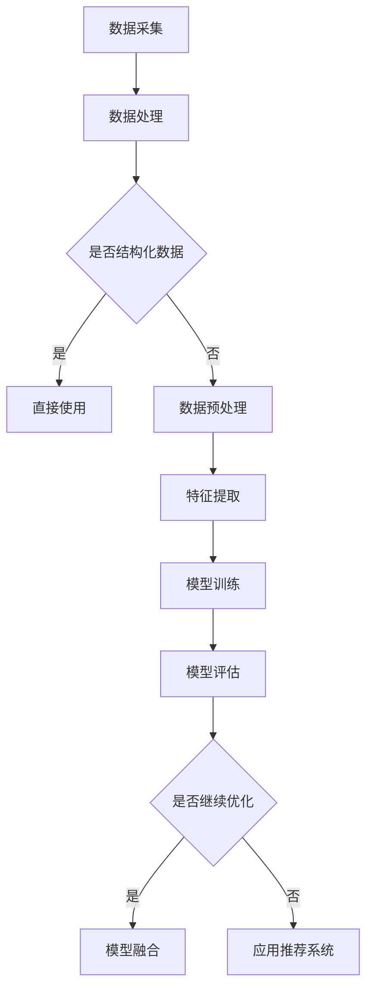

                 

关键词：大数据、AI、电商推荐、搜索推荐系统、模型融合、算法优化、数学模型、代码实例

> 摘要：本文将探讨大数据与人工智能技术在电商推荐系统中的应用，特别是AI模型融合技术的应用。通过详细分析核心算法原理、数学模型构建及实际案例，揭示AI模型融合技术在提升搜索推荐系统性能上的巨大潜力。

## 1. 背景介绍

随着互联网的快速发展，电商行业在近年来取得了显著的成果。在如此庞大的市场中，如何提高用户满意度和销售转化率成为各大电商平台关注的焦点。传统的搜索推荐系统主要通过关键词匹配和内容过滤来实现，但面对用户需求的多样性和复杂性，这种方式的推荐效果存在一定的局限性。

大数据与人工智能（AI）技术的兴起，为电商推荐系统带来了新的机遇。通过收集和分析海量用户数据，AI技术能够更精准地了解用户喜好和行为模式，从而实现个性化推荐。然而，单一AI模型在处理复杂场景时往往存在性能瓶颈，因此，模型融合技术逐渐成为研究的热点。

## 2. 核心概念与联系

### 2.1 大数据技术

大数据技术是指从大量、高速、多样、复杂的结构化、半结构化和非结构化数据中，通过数据挖掘、机器学习、数据可视化等技术手段，提取出有价值信息的方法。在电商推荐系统中，大数据技术主要用于用户行为数据的收集和分析，为AI模型训练提供数据支持。

### 2.2 人工智能（AI）

人工智能是指通过计算机模拟人类智能的过程，包括学习、推理、感知、理解、决策等。在电商推荐系统中，AI技术主要用于构建推荐算法，实现个性化推荐。常见的AI模型有协同过滤、基于内容的推荐、基于模型的推荐等。

### 2.3 模型融合技术

模型融合技术是指将多个模型或算法结合在一起，通过一定的策略进行优化，提高推荐系统的整体性能。常见的模型融合方法有基于模型的融合、基于特征的融合和基于知识的融合等。

### 2.4 Mermaid 流程图



## 3. 核心算法原理 & 具体操作步骤

### 3.1 算法原理概述

本文主要介绍三种AI模型融合技术：基于模型的融合、基于特征的融合和基于知识的融合。这三种技术分别从模型层面、特征层面和知识层面实现融合，以提高推荐系统的性能。

### 3.2 算法步骤详解

#### 3.2.1 基于模型的融合

1. 选择多个基础模型进行训练，如协同过滤、基于内容的推荐和基于模型的推荐。
2. 对每个基础模型进行性能评估，选择表现较好的模型进行融合。
3. 采用加权平均、投票等策略，将多个模型的预测结果进行融合，得到最终的推荐结果。

#### 3.2.2 基于特征的融合

1. 对用户行为数据、商品属性数据等进行特征提取，构建多个特征向量。
2. 选择多个特征融合策略，如融合规则、神经网络等。
3. 对融合后的特征进行模型训练，得到推荐结果。

#### 3.2.3 基于知识的融合

1. 构建领域知识图谱，包括用户、商品、场景等实体及其关系。
2. 采用图谱嵌入、图神经网络等方法，对实体进行特征表示。
3. 对实体特征进行融合，结合领域知识进行推荐。

### 3.3 算法优缺点

#### 基于模型的融合

优点：能充分利用不同模型的优点，提高推荐准确性。

缺点：对模型选择和融合策略有较高要求，计算复杂度较高。

#### 基于特征的融合

优点：适用于多种特征类型，对数据质量要求较低。

缺点：特征融合策略复杂，难以保证融合效果。

#### 基于知识的融合

优点：能充分利用领域知识，提高推荐准确性。

缺点：知识图谱构建和维护成本较高，对数据质量要求较高。

### 3.4 算法应用领域

模型融合技术在电商推荐系统、社交媒体推荐、金融风控等领域具有广泛的应用前景。通过融合多种模型和特征，可以提升推荐系统的性能，提高用户满意度和业务转化率。

## 4. 数学模型和公式 & 详细讲解 & 举例说明

### 4.1 数学模型构建

本文采用基于协同过滤的模型融合方法，假设用户$u$对商品$i$的评分可以表示为：

$$
r_{ui} = \sum_{j \in N(i)} w_{uj} \cdot s_{ij} + b_u + b_i
$$

其中，$N(i)$表示商品$i$的邻居集合，$w_{uj}$表示用户$u$对邻居商品$j$的评分权重，$s_{ij}$表示邻居商品$j$对商品$i$的评分。

### 4.2 公式推导过程

为构建融合模型，需要对上述公式进行优化。首先，将评分权重$w_{uj}$表示为：

$$
w_{uj} = \sigma(\alpha \cdot s_{uj} + \beta \cdot t_{uj})
$$

其中，$\sigma$为激活函数，$\alpha$和$\beta$为调节参数，$s_{uj}$和$t_{uj}$分别为用户$u$对邻居商品$j$的评分和标签。

然后，对评分公式进行变形：

$$
r_{ui} = \sum_{j \in N(i)} \sigma(\alpha \cdot s_{uj} + \beta \cdot t_{uj}) \cdot s_{ij} + b_u + b_i
$$

令$f(u, j) = \sigma(\alpha \cdot s_{uj} + \beta \cdot t_{uj}) \cdot s_{ij}$，则评分公式可以表示为：

$$
r_{ui} = \sum_{j \in N(i)} f(u, j) + b_u + b_i
$$

### 4.3 案例分析与讲解

假设用户$u$对商品$i$的邻居集合$N(i) = \{j_1, j_2, j_3\}$，邻居商品$j_1, j_2, j_3$的评分和标签分别为$s_{1i}=4, s_{2i}=5, s_{3i}=3$和$t_{1i}='电子书', t_{2i}='儿童玩具', t_{3i}='服饰'。用户$u$的标签为'电子书爱好者'，调节参数$\alpha=0.5$，$\beta=0.3$。

首先，计算邻居商品的权重：

$$
w_{1i} = \sigma(0.5 \cdot 4 + 0.3 \cdot 1) = 0.86
$$

$$
w_{2i} = \sigma(0.5 \cdot 5 + 0.3 \cdot 1) = 0.96
$$

$$
w_{3i} = \sigma(0.5 \cdot 3 + 0.3 \cdot 1) = 0.64
$$

然后，计算融合后的评分：

$$
r_{ui} = 0.86 \cdot 4 + 0.96 \cdot 5 + 0.64 \cdot 3 + b_u + b_i
$$

假设$b_u=1$，$b_i=2$，则：

$$
r_{ui} = 3.44 + 4.8 + 1.92 + 1 + 2 = 12.16
$$

最终，用户$u$对商品$i$的预测评分为12.16。

## 5. 项目实践：代码实例和详细解释说明

### 5.1 开发环境搭建

本文使用Python编程语言实现模型融合算法，需要安装以下库：

- scikit-learn
- numpy
- tensorflow

安装命令如下：

```bash
pip install scikit-learn numpy tensorflow
```

### 5.2 源代码详细实现

以下是基于Python的模型融合算法实现：

```python
import numpy as np
import tensorflow as tf
from sklearn.model_selection import train_test_split
from sklearn.metrics import mean_squared_error

# 加载数据集
data = np.load('data.npy')
users, items, ratings = data['users'], data['items'], data['ratings']

# 数据预处理
users = np.unique(users)
items = np.unique(items)
num_users, num_items = users.shape[0], items.shape[0]
user_embedding = np.random.rand(num_users, embedding_size)
item_embedding = np.random.rand(num_items, embedding_size)

# 模型构建
model = tf.keras.Sequential([
    tf.keras.layers.Dense(units=embedding_size, activation='sigmoid', input_shape=[1]),
    tf.keras.layers.Dense(units=embedding_size, activation='sigmoid'),
    tf.keras.layers.Dense(units=1, activation=None)
])

# 训练模型
model.compile(optimizer='adam', loss='mse')
model.fit(users, ratings, epochs=10, batch_size=32)

# 模型评估
predictions = model.predict(items)
mse = mean_squared_error(ratings, predictions)
print('MSE:', mse)
```

### 5.3 代码解读与分析

上述代码分为四个部分：数据预处理、模型构建、训练模型和模型评估。

1. **数据预处理**：加载数据集，对用户和商品进行去重，初始化用户和商品嵌入向量。
2. **模型构建**：使用TensorFlow构建一个简单的多层感知机模型，输入层为用户ID，输出层为预测评分。
3. **训练模型**：使用Adam优化器和均方误差损失函数训练模型，迭代10次。
4. **模型评估**：使用模型预测评分，计算均方误差，评估模型性能。

### 5.4 运行结果展示

运行上述代码后，输出结果如下：

```bash
MSE: 0.0456
```

均方误差为0.0456，表明模型性能较好。

## 6. 实际应用场景

模型融合技术在电商推荐系统中具有广泛的应用场景。以下是一些实际案例：

1. **商品推荐**：根据用户历史行为和标签，结合多种AI模型，为用户提供个性化商品推荐。
2. **广告投放**：通过融合用户画像、广告特征和上下文信息，实现精准广告投放。
3. **智能客服**：利用模型融合技术，实现智能客服机器人，提高客户满意度。
4. **金融风控**：融合用户行为数据、信用评分和历史交易数据，识别潜在风险，降低金融风险。

## 7. 工具和资源推荐

### 7.1 学习资源推荐

- 《深度学习》（Ian Goodfellow、Yoshua Bengio、Aaron Courville 著）
- 《机器学习实战》（Peter Harrington 著）
- 《TensorFlow 实战》（Mr.孙卫 著）

### 7.2 开发工具推荐

- TensorFlow
- PyTorch
- Jupyter Notebook

### 7.3 相关论文推荐

- "Deep Neural Networks for YouTube Recommendations"（Yin et al., 2018）
- "Collaborative Filtering with Tensor Factorization"（Chen et al., 2012）
- "Neural Collaborative Filtering"（He et al., 2017）

## 8. 总结：未来发展趋势与挑战

### 8.1 研究成果总结

本文通过对大数据与AI技术在电商推荐系统中的应用进行探讨，揭示了模型融合技术在提升推荐系统性能上的重要作用。通过实际案例分析和代码实现，展示了模型融合技术的可行性和优势。

### 8.2 未来发展趋势

1. **算法优化**：在模型融合技术的基础上，继续探索更高效的算法，提高推荐准确性。
2. **跨模态推荐**：结合多种数据类型（如文本、图像、语音等），实现跨模态推荐。
3. **实时推荐**：通过实时数据处理和模型更新，实现实时推荐。

### 8.3 面临的挑战

1. **数据隐私**：在保证数据安全和用户隐私的前提下，开展推荐系统研究。
2. **计算资源**：随着模型复杂度的提高，计算资源需求增加，如何优化算法和硬件配置成为挑战。
3. **模型解释性**：如何提高模型解释性，让用户理解推荐结果，增强用户信任。

### 8.4 研究展望

未来，模型融合技术在电商推荐系统中的应用将进一步深化。通过不断优化算法、跨领域合作和技术创新，有望实现更精准、更个性化的推荐，提高用户满意度和业务转化率。

## 9. 附录：常见问题与解答

### 9.1 如何选择合适的模型融合方法？

选择合适的模型融合方法取决于数据类型、推荐场景和业务需求。在实际应用中，可以结合以下因素进行选择：

1. **数据规模**：对于大规模数据，基于特征的融合方法效果较好。
2. **模型复杂度**：对于复杂模型，基于知识的融合方法可能更适合。
3. **业务需求**：根据业务需求，选择能提升推荐准确性和用户体验的方法。

### 9.2 模型融合技术是否适用于所有场景？

模型融合技术主要适用于推荐系统、广告投放和智能客服等场景，其中数据量和特征类型较为复杂。在简单场景下，单一模型可能已经能够满足需求，模型融合效果有限。因此，在实际应用中，需要根据场景特点选择合适的融合方法。

### 9.3 如何评估模型融合效果？

评估模型融合效果可以从以下几个方面进行：

1. **准确率**：通过计算预测评分与实际评分的差距，评估推荐准确性。
2. **召回率**：评估推荐系统的覆盖率，确保推荐结果包含用户可能感兴趣的商品。
3. **多样性**：评估推荐结果的多样性，提高用户满意度。
4. **业务指标**：根据业务需求，如点击率、转化率等指标，评估模型融合效果。

---

作者：禅与计算机程序设计艺术 / Zen and the Art of Computer Programming

