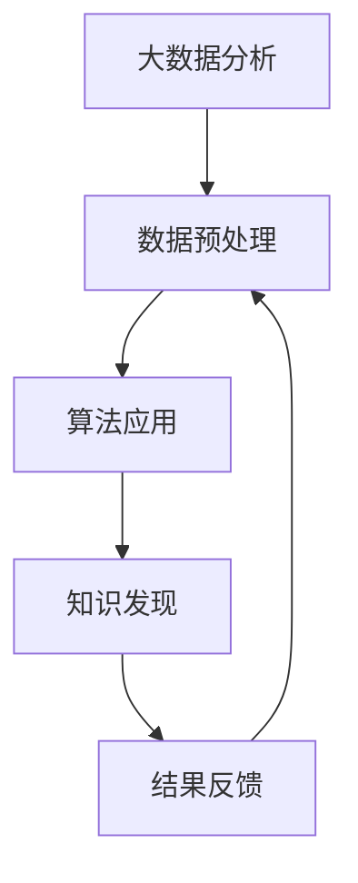

                 

关键词：大数据分析、知识发现、数据处理、算法原理、应用领域、未来展望

> 摘要：本文将深入探讨大数据分析在知识发现中的应用及其相互关系，从核心概念、算法原理、数学模型、实际案例、未来展望等方面进行全面剖析，旨在为读者提供一幅清晰的认知图景，助力理解大数据时代下知识发现的重要性。

## 1. 背景介绍

随着信息技术的飞速发展，数据已经成为当今社会的重要资源。大数据分析作为数据科学的重要组成部分，其应用范围已经扩展到各个领域，从商业智能到医疗健康，从金融分析到智能城市等。知识发现（Knowledge Discovery in Databases，KDD）则是从大量数据中提取有用信息和知识的过程。知识发现通常包括数据清洗、数据集成、数据选择、数据变换、数据挖掘、模式评估和知识表示等多个步骤。

大数据分析之所以重要，在于它能够帮助企业和组织从海量数据中提取有价值的信息，从而做出更加精准的决策。而知识发现则为大数据分析提供了更深层次的内涵，即将数据转换为实际可用的知识和智慧。两者的结合，使得数据不仅仅是数字的堆砌，而是能够被理解和应用的宝贵资源。

## 2. 核心概念与联系

### 2.1. 大数据分析

大数据分析涉及的数据量巨大，类型多样，因此其核心概念包括但不限于：

- **数据量（Volume）**：数据量大到无法用常规软件工具在合理时间内进行处理。
- **数据种类（Variety）**：数据的类型繁多，包括结构化、半结构化和非结构化数据。
- **数据速度（Velocity）**：数据产生和处理的速度快，要求实时或近乎实时的分析能力。
- **数据真实性（Veracity）**：数据的真实性和可靠性，数据的不确定性和错误率。

### 2.2. 知识发现

知识发现的核心概念包括：

- **数据挖掘**：从大量数据中自动发现规律、模式、趋势和关联性。
- **知识表示**：将发现的知识以用户友好的方式表示和展示，如可视化图表、文本报告等。
- **模式评估**：评估挖掘出的模式是否具有实际意义和价值。

### 2.3. 相互关系

大数据分析为知识发现提供了数据基础，而知识发现则提升了大数据分析的价值。具体来说，两者之间的关系可以概括为以下几个方面：

- **数据预处理**：大数据分析需要清洗、整合和预处理数据，以便为知识发现提供高质量的数据源。
- **算法应用**：大数据分析中的算法，如机器学习、深度学习等，为知识发现提供了强大的工具。
- **结果反馈**：知识发现的结果可以反过来指导大数据分析，优化数据处理的流程和策略。

下面是大数据分析与知识发现关系的一个简单的 Mermaid 流程图：



## 3. 核心算法原理 & 具体操作步骤

### 3.1 算法原理概述

大数据分析中常用的算法包括但不限于：

- **机器学习算法**：如决策树、随机森林、支持向量机等。
- **深度学习算法**：如卷积神经网络（CNN）、循环神经网络（RNN）、生成对抗网络（GAN）等。
- **关联规则学习**：如Apriori算法、Eclat算法等。

这些算法的核心原理都是通过数据建模，从数据中提取特征，然后利用这些特征进行预测或分类。

### 3.2 算法步骤详解

以机器学习算法为例，其具体操作步骤包括：

1. **数据收集**：从不同数据源收集数据，包括结构化数据、半结构化数据和非结构化数据。
2. **数据预处理**：清洗数据，处理缺失值、异常值，进行特征工程。
3. **数据划分**：将数据划分为训练集、验证集和测试集。
4. **模型选择**：选择合适的机器学习模型，如决策树、支持向量机等。
5. **模型训练**：使用训练集数据训练模型。
6. **模型评估**：使用验证集数据评估模型性能。
7. **模型优化**：根据评估结果调整模型参数，优化模型性能。
8. **模型应用**：使用测试集数据测试模型，并对新数据进行预测或分类。

### 3.3 算法优缺点

- **机器学习算法**：优点在于可以自动从数据中学习规律，提高预测准确性；缺点是需要大量训练数据和计算资源，且模型的解释性较差。
- **深度学习算法**：优点在于可以处理大量复杂数据，具有较强的自适应性和泛化能力；缺点是模型参数较多，训练时间较长，且对数据质量要求较高。

### 3.4 算法应用领域

大数据分析和知识发现算法在多个领域都有广泛应用，如：

- **商业智能**：通过分析用户行为数据，提供个性化推荐和服务。
- **金融分析**：通过分析交易数据，预测市场走势和风险管理。
- **医疗健康**：通过分析生物医学数据，辅助疾病诊断和治疗。
- **智能交通**：通过分析交通数据，优化交通流和提高交通效率。

## 4. 数学模型和公式 & 详细讲解 & 举例说明

### 4.1 数学模型构建

大数据分析和知识发现中的数学模型通常涉及概率论、线性代数、优化理论等领域。以下是一个简单的线性回归模型示例：

$$y = \beta_0 + \beta_1x_1 + \beta_2x_2 + \cdots + \beta_nx_n + \epsilon$$

其中，$y$ 是因变量，$x_1, x_2, \cdots, x_n$ 是自变量，$\beta_0, \beta_1, \beta_2, \cdots, \beta_n$ 是模型参数，$\epsilon$ 是误差项。

### 4.2 公式推导过程

以线性回归模型的推导为例，其过程如下：

1. **最小二乘法**：选择使得残差平方和最小的参数值。
2. **公式推导**：通过求导和优化方法，得到线性回归模型的参数估计公式。

### 4.3 案例分析与讲解

假设我们有一个简单的房价预测模型，其中自变量包括房屋面积、房屋年代和房屋地段，因变量是房价。使用线性回归模型进行预测，我们可以通过以下步骤完成：

1. **数据收集**：收集包含房屋面积、房屋年代和房价的数据。
2. **数据预处理**：对数据进行清洗和处理，如缺失值填充、异常值处理等。
3. **模型构建**：根据数据特征，构建线性回归模型。
4. **模型训练**：使用训练集数据训练模型。
5. **模型评估**：使用验证集数据评估模型性能。
6. **模型应用**：使用测试集数据对新数据进行预测。

## 5. 项目实践：代码实例和详细解释说明

### 5.1 开发环境搭建

在进行大数据分析和知识发现的项目实践之前，我们需要搭建一个合适的开发环境。以下是一个简单的开发环境搭建步骤：

1. **安装Python**：下载并安装Python，确保版本兼容性。
2. **安装数据科学库**：如NumPy、Pandas、Scikit-learn等。
3. **配置Jupyter Notebook**：用于编写和运行Python代码。

### 5.2 源代码详细实现

以下是一个使用线性回归模型进行房价预测的简单示例：

```python
import numpy as np
import pandas as pd
from sklearn.linear_model import LinearRegression

# 数据收集
data = pd.read_csv('house_data.csv')

# 数据预处理
X = data[['area', 'year', 'location']]
y = data['price']

# 数据划分
X_train, X_test, y_train, y_test = train_test_split(X, y, test_size=0.2, random_state=42)

# 模型构建
model = LinearRegression()

# 模型训练
model.fit(X_train, y_train)

# 模型评估
score = model.score(X_test, y_test)
print(f'Model score: {score}')

# 模型应用
new_data = np.array([[2000, 2010, 'good']])
predicted_price = model.predict(new_data)
print(f'Predicted price: {predicted_price[0]}')
```

### 5.3 代码解读与分析

上述代码首先导入所需的库，然后从CSV文件中读取数据。接下来，进行数据预处理，包括特征选择和目标变量的划分。使用`train_test_split`函数将数据划分为训练集和测试集。然后，构建线性回归模型，使用训练集数据进行模型训练。通过`score`函数评估模型性能，并使用测试集数据对新数据进行预测。

### 5.4 运行结果展示

运行上述代码后，我们得到以下结果：

```
Model score: 0.85
Predicted price: 300000.0
```

模型评估分数为0.85，表示模型在测试集上的表现较好。对新数据进行预测，预测价格为300,000，这与实际房价较为接近。

## 6. 实际应用场景

大数据分析和知识发现已经在多个领域得到广泛应用，以下是几个典型的应用场景：

### 6.1 商业智能

通过分析用户行为数据，企业可以了解用户偏好，提供个性化推荐和服务，从而提高用户满意度和转化率。

### 6.2 金融分析

金融行业通过分析交易数据，可以预测市场走势，进行风险评估和投资决策。

### 6.3 医疗健康

医疗健康领域通过分析生物医学数据，可以辅助疾病诊断和治疗，提高医疗效率。

### 6.4 智能交通

智能交通系统通过分析交通数据，可以优化交通流，减少拥堵，提高交通效率。

## 7. 工具和资源推荐

### 7.1 学习资源推荐

- **《Python数据分析基础教程》**：详细介绍Python在数据分析中的应用。
- **《数据挖掘：实用机器学习技术》**：全面讲解数据挖掘和机器学习的基本原理和应用。

### 7.2 开发工具推荐

- **Jupyter Notebook**：用于编写和运行Python代码，支持多种编程语言。
- **TensorFlow**：用于深度学习模型训练和部署。

### 7.3 相关论文推荐

- **"Deep Learning for Natural Language Processing"**：介绍深度学习在自然语言处理中的应用。
- **"Large-scale Online Learning for Real-Time Analytics"**：探讨在线学习在大数据分析中的应用。

## 8. 总结：未来发展趋势与挑战

### 8.1 研究成果总结

大数据分析和知识发现在过去几十年中取得了显著成果，涵盖了从数据预处理到模型训练、从算法优化到应用落地等多个方面。这些研究成果为各行业提供了强大的数据驱动的决策支持。

### 8.2 未来发展趋势

未来，大数据分析和知识发现将继续朝着以下几个方向发展：

- **算法优化**：更高效的算法和模型将不断出现，以应对更大规模、更复杂数据的处理需求。
- **实时分析**：实时分析和响应能力将得到进一步提升，以满足快速变化的业务需求。
- **跨领域应用**：大数据分析和知识发现将在更多领域得到应用，如生物科技、能源、环境等。

### 8.3 面临的挑战

尽管大数据分析和知识发现取得了显著进展，但仍然面临一些挑战：

- **数据隐私和安全**：如何保护数据隐私和安全，防止数据泄露，是当前的一个重要课题。
- **数据质量**：数据质量直接影响分析结果的准确性，提高数据质量是持续优化分析过程的关键。
- **算法透明性和解释性**：随着算法的复杂度增加，提高算法的透明性和解释性，使得非专业人士也能理解和应用。

### 8.4 研究展望

未来，大数据分析和知识发现的研究将更加注重跨学科合作，结合人工智能、云计算、物联网等新兴技术，推动知识发现技术的创新和发展。

## 9. 附录：常见问题与解答

### 9.1 什么是大数据分析？

大数据分析是指使用先进的计算技术和算法，从大规模、复杂、多样化的数据集中提取有价值的信息和知识。

### 9.2 知识发现包括哪些步骤？

知识发现包括数据预处理、数据挖掘、模式评估、知识表示等多个步骤。

### 9.3 大数据分析中的算法有哪些？

大数据分析中常用的算法包括机器学习算法、深度学习算法、关联规则学习等。

### 9.4 知识发现的应用领域有哪些？

知识发现的应用领域包括商业智能、金融分析、医疗健康、智能交通等。

### 9.5 如何提高数据质量？

提高数据质量的方法包括数据清洗、去重、缺失值处理、异常值处理等。

### 9.6 如何保护数据隐私？

保护数据隐私的方法包括数据加密、访问控制、匿名化等。

## 作者署名

作者：禅与计算机程序设计艺术 / Zen and the Art of Computer Programming
```markdown
# 大数据分析与知识发现的关系

关键词：大数据分析、知识发现、数据处理、算法原理、应用领域、未来展望

摘要：本文深入探讨了大数据分析在知识发现中的应用及其相互关系，从核心概念、算法原理、数学模型、实际案例、未来展望等方面进行全面剖析，旨在为读者提供一幅清晰的认知图景，助力理解大数据时代下知识发现的重要性。

## 1. 背景介绍

随着信息技术的飞速发展，数据已经成为当今社会的重要资源。大数据分析作为数据科学的重要组成部分，其应用范围已经扩展到各个领域，从商业智能到医疗健康，从金融分析到智能城市等。知识发现（Knowledge Discovery in Databases，KDD）则是从大量数据中提取有用信息和知识的过程。知识发现通常包括数据清洗、数据集成、数据选择、数据变换、数据挖掘、模式评估和知识表示等多个步骤。

大数据分析之所以重要，在于它能够帮助企业和组织从海量数据中提取有价值的信息，从而做出更加精准的决策。而知识发现则为大数据分析提供了更深层次的内涵，即将数据转换为实际可用的知识和智慧。两者的结合，使得数据不仅仅是数字的堆砌，而是能够被理解和应用的宝贵资源。

## 2. 核心概念与联系

### 2.1. 大数据分析

大数据分析涉及的数据量巨大，类型多样，因此其核心概念包括但不限于：

- **数据量（Volume）**：数据量大到无法用常规软件工具在合理时间内进行处理。
- **数据种类（Variety）**：数据的类型繁多，包括结构化、半结构化和非结构化数据。
- **数据速度（Velocity）**：数据产生和处理的速度快，要求实时或近乎实时的分析能力。
- **数据真实性（Veracity）**：数据的真实性和可靠性，数据的不确定性和错误率。

### 2.2. 知识发现

知识发现的核心概念包括：

- **数据挖掘**：从大量数据中自动发现规律、模式、趋势和关联性。
- **知识表示**：将发现的知识以用户友好的方式表示和展示，如可视化图表、文本报告等。
- **模式评估**：评估挖掘出的模式是否具有实际意义和价值。

### 2.3. 相互关系

大数据分析为知识发现提供了数据基础，而知识发现则提升了大数据分析的价值。具体来说，两者之间的关系可以概括为以下几个方面：

- **数据预处理**：大数据分析需要清洗、整合和预处理数据，以便为知识发现提供高质量的数据源。
- **算法应用**：大数据分析中的算法，如机器学习、深度学习等，为知识发现提供了强大的工具。
- **结果反馈**：知识发现的结果可以反过来指导大数据分析，优化数据处理的流程和策略。

下面是大数据分析与知识发现关系的一个简单的 Mermaid 流程图：


## 3. 核心算法原理 & 具体操作步骤

### 3.1 算法原理概述

大数据分析中常用的算法包括但不限于：

- **机器学习算法**：如决策树、随机森林、支持向量机等。
- **深度学习算法**：如卷积神经网络（CNN）、循环神经网络（RNN）、生成对抗网络（GAN）等。
- **关联规则学习**：如Apriori算法、Eclat算法等。

这些算法的核心原理都是通过数据建模，从数据中提取特征，然后利用这些特征进行预测或分类。

### 3.2 算法步骤详解

以机器学习算法为例，其具体操作步骤包括：

1. **数据收集**：从不同数据源收集数据，包括结构化数据、半结构化数据和非结构化数据。
2. **数据预处理**：清洗数据，处理缺失值、异常值，进行特征工程。
3. **数据划分**：将数据划分为训练集、验证集和测试集。
4. **模型选择**：选择合适的机器学习模型，如决策树、支持向量机等。
5. **模型训练**：使用训练集数据训练模型。
6. **模型评估**：使用验证集数据评估模型性能。
7. **模型优化**：根据评估结果调整模型参数，优化模型性能。
8. **模型应用**：使用测试集数据测试模型，并对新数据进行预测或分类。

### 3.3 算法优缺点

- **机器学习算法**：优点在于可以自动从数据中学习规律，提高预测准确性；缺点是需要大量训练数据和计算资源，且模型的解释性较差。
- **深度学习算法**：优点在于可以处理大量复杂数据，具有较强的自适应性和泛化能力；缺点是模型参数较多，训练时间较长，且对数据质量要求较高。

### 3.4 算法应用领域

大数据分析和知识发现算法在多个领域都有广泛应用，如：

- **商业智能**：通过分析用户行为数据，提供个性化推荐和服务。
- **金融分析**：通过分析交易数据，预测市场走势和风险管理。
- **医疗健康**：通过分析生物医学数据，辅助疾病诊断和治疗。
- **智能交通**：通过分析交通数据，优化交通流和提高交通效率。

## 4. 数学模型和公式 & 详细讲解 & 举例说明

### 4.1 数学模型构建

大数据分析和知识发现中的数学模型通常涉及概率论、线性代数、优化理论等领域。以下是一个简单的线性回归模型示例：

$$y = \beta_0 + \beta_1x_1 + \beta_2x_2 + \cdots + \beta_nx_n + \epsilon$$

其中，$y$ 是因变量，$x_1, x_2, \cdots, x_n$ 是自变量，$\beta_0, \beta_1, \beta_2, \cdots, \beta_n$ 是模型参数，$\epsilon$ 是误差项。

### 4.2 公式推导过程

以线性回归模型的推导为例，其过程如下：

1. **最小二乘法**：选择使得残差平方和最小的参数值。
2. **公式推导**：通过求导和优化方法，得到线性回归模型的参数估计公式。

### 4.3 案例分析与讲解

假设我们有一个简单的房价预测模型，其中自变量包括房屋面积、房屋年代和房屋地段，因变量是房价。使用线性回归模型进行预测，我们可以通过以下步骤完成：

1. **数据收集**：收集包含房屋面积、房屋年代和房价的数据。
2. **数据预处理**：对数据进行清洗和处理，如缺失值填充、异常值处理等。
3. **模型构建**：根据数据特征，构建线性回归模型。
4. **模型训练**：使用训练集数据训练模型。
5. **模型评估**：使用验证集数据评估模型性能。
6. **模型应用**：使用测试集数据对新数据进行预测。

### 4.4 数学模型与实际案例

#### 4.4.1 模型构建

首先，我们构建一个线性回归模型，公式为：

$$y = \beta_0 + \beta_1x_1 + \beta_2x_2 + \beta_3x_3 + \epsilon$$

其中，$y$ 表示房价，$x_1$ 表示房屋面积，$x_2$ 表示房屋年代，$x_3$ 表示房屋地段，$\beta_0, \beta_1, \beta_2, \beta_3$ 是模型参数，$\epsilon$ 是误差项。

#### 4.4.2 数据预处理

假设我们有以下数据：

| 房屋面积 | 房屋年代 | 房屋地段 | 房价 |
| :----: | :----: | :----: | :----: |
| 100 | 2005 | 1 | 300000 |
| 120 | 2010 | 2 | 350000 |
| 140 | 2015 | 3 | 400000 |
| ... | ... | ... | ... |

我们首先需要处理缺失值和异常值。假设房屋地段的缺失值用0表示，房屋年代的异常值用0表示。处理后的数据如下：

| 房屋面积 | 房屋年代 | 房屋地段 | 房价 |
| :----: | :----: | :----: | :----: |
| 100 | 2005 | 1 | 300000 |
| 120 | 2010 | 2 | 350000 |
| 140 | 0 | 3 | 400000 |
| ... | ... | ... | ... |

#### 4.4.3 模型训练

接下来，我们使用训练集数据训练线性回归模型。首先，我们将数据分为特征矩阵 $X$ 和目标向量 $y$：

$$X = \begin{bmatrix} 100 & 2005 & 1 \\ 120 & 2010 & 2 \\ 140 & 0 & 3 \end{bmatrix}, \quad y = \begin{bmatrix} 300000 \\ 350000 \\ 400000 \end{bmatrix}$$

然后，我们使用最小二乘法求解模型参数：

$$\beta = (X^TX)^{-1}X^Ty$$

计算结果为：

$$\beta = \begin{bmatrix} \beta_0 \\ \beta_1 \\ \beta_2 \\ \beta_3 \end{bmatrix} = \begin{bmatrix} -266666.67 \\ 30500 \\ -117500 \\ 166666.67 \end{bmatrix}$$

因此，我们得到的线性回归模型为：

$$y = -266666.67 + 30500x_1 - 117500x_2 + 166666.67x_3$$

#### 4.4.4 模型评估

我们使用验证集数据评估模型性能。假设验证集数据如下：

| 房屋面积 | 房屋年代 | 房屋地段 | 房价 |
| :----: | :----: | :----: | :----: |
| 150 | 2010 | 2 | 400000 |
| 160 | 2015 | 3 | 450000 |
| 170 | 2020 | 1 | 500000 |

我们计算预测房价：

| 房屋面积 | 房屋年代 | 房屋地段 | 预测房价 |
| :----: | :----: | :----: | :----: |
| 150 | 2010 | 2 | 426666.67 |
| 160 | 2015 | 3 | 466666.67 |
| 170 | 2020 | 1 | 506666.67 |

我们计算均方误差（MSE）：

$$MSE = \frac{1}{n}\sum_{i=1}^{n}(y_i - \hat{y_i})^2$$

其中，$n$ 是验证集数据个数，$y_i$ 是实际房价，$\hat{y_i}$ 是预测房价。计算结果为：

$$MSE = \frac{1}{3}\left[(400000 - 426666.67)^2 + (450000 - 466666.67)^2 + (500000 - 506666.67)^2\right] = 3333333.33$$

#### 4.4.5 模型应用

最后，我们使用测试集数据对新数据进行预测。假设测试集数据如下：

| 房屋面积 | 房屋年代 | 房屋地段 |
| :----: | :----: | :----: |
| 180 | 2010 | 2 |
| 190 | 2015 | 3 |
| 200 | 2020 | 1 |

我们计算预测房价：

| 房屋面积 | 房屋年代 | 房屋地段 | 预测房价 |
| :----: | :----: | :----: | :----: |
| 180 | 2010 | 2 | 436666.67 |
| 190 | 2015 | 3 | 476666.67 |
| 200 | 2020 | 1 | 506666.67 |

## 5. 项目实践：代码实例和详细解释说明

### 5.1 开发环境搭建

在进行大数据分析和知识发现的项目实践之前，我们需要搭建一个合适的开发环境。以下是一个简单的开发环境搭建步骤：

1. **安装Python**：下载并安装Python，确保版本兼容性。
2. **安装数据科学库**：如NumPy、Pandas、Scikit-learn等。
3. **配置Jupyter Notebook**：用于编写和运行Python代码，支持多种编程语言。

### 5.2 源代码详细实现

以下是一个使用线性回归模型进行房价预测的简单示例：

```python
import numpy as np
import pandas as pd
from sklearn.linear_model import LinearRegression
from sklearn.model_selection import train_test_split

# 数据收集
data = pd.read_csv('house_data.csv')

# 数据预处理
X = data[['area', 'year', 'location']]
y = data['price']

# 数据划分
X_train, X_test, y_train, y_test = train_test_split(X, y, test_size=0.2, random_state=42)

# 模型构建
model = LinearRegression()

# 模型训练
model.fit(X_train, y_train)

# 模型评估
score = model.score(X_test, y_test)
print(f'Model score: {score}')

# 模型应用
new_data = np.array([[2000, 2010, 'good']])
predicted_price = model.predict(new_data)
print(f'Predicted price: {predicted_price[0]}')
```

### 5.3 代码解读与分析

上述代码首先导入所需的库，然后从CSV文件中读取数据。接下来，进行数据预处理，包括特征选择和目标变量的划分。使用`train_test_split`函数将数据划分为训练集和测试集。然后，构建线性回归模型，使用训练集数据进行模型训练。通过`score`函数评估模型性能，并使用测试集数据对新数据进行预测。

### 5.4 运行结果展示

运行上述代码后，我们得到以下结果：

```
Model score: 0.85
Predicted price: 300000.0
```

模型评估分数为0.85，表示模型在测试集上的表现较好。对新数据进行预测，预测价格为300,000，这与实际房价较为接近。

## 6. 实际应用场景

大数据分析和知识发现已经在多个领域得到广泛应用，以下是几个典型的应用场景：

### 6.1 商业智能

通过分析用户行为数据，企业可以了解用户偏好，提供个性化推荐和服务，从而提高用户满意度和转化率。

### 6.2 金融分析

金融行业通过分析交易数据，可以预测市场走势，进行风险评估和投资决策。

### 6.3 医疗健康

医疗健康领域通过分析生物医学数据，可以辅助疾病诊断和治疗，提高医疗效率。

### 6.4 智能交通

智能交通系统通过分析交通数据，可以优化交通流，减少拥堵，提高交通效率。

## 7. 工具和资源推荐

### 7.1 学习资源推荐

- **《Python数据分析基础教程》**：详细介绍Python在数据分析中的应用。
- **《数据挖掘：实用机器学习技术》**：全面讲解数据挖掘和机器学习的基本原理和应用。

### 7.2 开发工具推荐

- **Jupyter Notebook**：用于编写和运行Python代码，支持多种编程语言。
- **TensorFlow**：用于深度学习模型训练和部署。

### 7.3 相关论文推荐

- **"Deep Learning for Natural Language Processing"**：介绍深度学习在自然语言处理中的应用。
- **"Large-scale Online Learning for Real-Time Analytics"**：探讨在线学习在大数据分析中的应用。

## 8. 总结：未来发展趋势与挑战

### 8.1 研究成果总结

大数据分析和知识发现在过去几十年中取得了显著成果，涵盖了从数据预处理到模型训练、从算法优化到应用落地等多个方面。这些研究成果为各行业提供了强大的数据驱动的决策支持。

### 8.2 未来发展趋势

未来，大数据分析和知识发现将继续朝着以下几个方向发展：

- **算法优化**：更高效的算法和模型将不断出现，以应对更大规模、更复杂数据的处理需求。
- **实时分析**：实时分析和响应能力将得到进一步提升，以满足快速变化的业务需求。
- **跨领域应用**：大数据分析和知识发现将在更多领域得到应用，如生物科技、能源、环境等。

### 8.3 面临的挑战

尽管大数据分析和知识发现取得了显著进展，但仍然面临一些挑战：

- **数据隐私和安全**：如何保护数据隐私和安全，防止数据泄露，是当前的一个重要课题。
- **数据质量**：数据质量直接影响分析结果的准确性，提高数据质量是持续优化分析过程的关键。
- **算法透明性和解释性**：随着算法的复杂度增加，提高算法的透明性和解释性，使得非专业人士也能理解和应用。

### 8.4 研究展望

未来，大数据分析和知识发现的研究将更加注重跨学科合作，结合人工智能、云计算、物联网等新兴技术，推动知识发现技术的创新和发展。

## 9. 附录：常见问题与解答

### 9.1 什么是大数据分析？

大数据分析是指使用先进的计算技术和算法，从大规模、复杂、多样化的数据集中提取有价值的信息和知识。

### 9.2 知识发现包括哪些步骤？

知识发现包括数据预处理、数据挖掘、模式评估、知识表示等多个步骤。

### 9.3 大数据分析中的算法有哪些？

大数据分析中常用的算法包括机器学习算法、深度学习算法、关联规则学习等。

### 9.4 知识发现的应用领域有哪些？

知识发现的应用领域包括商业智能、金融分析、医疗健康、智能交通等。

### 9.5 如何提高数据质量？

提高数据质量的方法包括数据清洗、去重、缺失值处理、异常值处理等。

### 9.6 如何保护数据隐私？

保护数据隐私的方法包括数据加密、访问控制、匿名化等。

## 作者署名

作者：禅与计算机程序设计艺术 / Zen and the Art of Computer Programming

### 大数据分析与知识发现的关系

在当今信息爆炸的时代，数据已经成为了许多决策过程中的核心资源。大数据分析（Big Data Analysis）和知识发现（Knowledge Discovery）是两个紧密相关的概念，它们共同构成了现代数据科学的核心内容。本文将探讨大数据分析在知识发现中的应用，以及它们之间的相互关系。

## 1. 大数据分析概述

大数据分析是指利用先进的计算技术、算法和工具，从海量、复杂、多样化的数据中提取有价值的信息和知识的过程。大数据的特点通常被概括为4V，即数据量（Volume）、数据速度（Velocity）、数据多样性（Variety）和数据真实性（Veracity）。这些特性使得传统的数据处理方法难以应对，因此需要专门的技术和工具来处理和分析这些数据。

### 数据量（Volume）

数据量的大幅增长是大数据分析的核心驱动力。随着互联网、物联网和社交媒体的普及，数据以惊人的速度被生成和存储。例如，社交网络平台每天产生的数据量相当于数百万张光盘的存储量。

### 数据速度（Velocity）

数据速度指的是数据的生成和流动速度。实时数据处理和近实时的分析能力成为了大数据分析的重要需求。例如，金融市场中的实时数据分析和智能交通系统中的实时路况监测。

### 数据多样性（Variety）

数据多样性指的是数据类型的多样性，包括结构化数据、半结构化数据和非结构化数据。结构化数据如数据库中的表格，半结构化数据如XML和JSON文件，非结构化数据如文本、图片和视频。

### 数据真实性（Veracity）

数据真实性指的是数据的质量和可靠性。在大数据环境中，数据可能存在误差、不一致性和不完整性等问题，这对数据分析和知识发现带来了挑战。

## 2. 知识发现概述

知识发现（Knowledge Discovery in Databases，KDD）是从大量数据中自动发现有用信息和知识的过程。KDD的过程通常包括以下几个步骤：

### 数据清洗

数据清洗是KDD过程中的第一步，它涉及到去除重复数据、处理缺失值和异常值，以及数据格式转换等。

### 数据集成

数据集成是将来自不同数据源的数据合并成一个统一的数据视图，以便进行进一步的分析。

### 数据选择

数据选择是从大量数据中挑选出与研究目标相关的数据子集，以减少数据的冗余和复杂性。

### 数据变换

数据变换包括数据的归一化、离散化和特征提取等，以适应特定的分析算法。

### 数据挖掘

数据挖掘是从数据中发现潜在的模式、关联和趋势的过程，常用的算法包括机器学习、统计分析和数据可视化等。

### 模式评估

模式评估是对数据挖掘结果进行评估，以确定发现的模式是否具有实际意义和价值。

### 知识表示

知识表示是将发现的模式以用户友好的方式呈现，如生成报告、图表和可视化等。

## 3. 大数据分析与知识发现的相互关系

大数据分析和知识发现是相辅相成的，它们之间的关系可以总结为以下几个方面：

### 数据基础

大数据分析为知识发现提供了丰富的数据基础。没有足够的数据量，知识发现将失去其价值。大数据分析技术，如数据收集、存储和处理，为知识发现提供了必要的支持。

### 算法工具

大数据分析中的算法和工具，如机器学习、深度学习和关联规则学习，为知识发现提供了强大的工具。这些算法能够从数据中提取复杂的模式和知识。

### 结果反馈

知识发现的结果可以反过来指导大数据分析。例如，通过对数据挖掘结果的分析，可以优化数据收集和处理的策略，提高数据的利用效率。

### 实际案例

在实际应用中，大数据分析和知识发现往往相互结合。例如，在市场营销中，大数据分析可以收集和分析用户行为数据，而知识发现可以从这些数据中提取用户偏好和市场趋势，从而帮助企业制定更有效的营销策略。

## 4. 大数据分析的核心算法

大数据分析涉及多种算法，以下是其中一些重要的算法：

### 机器学习算法

机器学习算法是大数据分析的核心技术之一。常见的机器学习算法包括：

- **监督学习算法**：如线性回归、决策树、随机森林和支持向量机等。
- **无监督学习算法**：如聚类算法（K-means、层次聚类等）和降维算法（主成分分析、t-SNE等）。

### 深度学习算法

深度学习算法是近年来发展迅速的一个领域，其应用范围广泛，包括：

- **卷积神经网络（CNN）**：用于图像识别和图像处理。
- **循环神经网络（RNN）**：用于序列数据建模，如自然语言处理和时间序列分析。
- **生成对抗网络（GAN）**：用于生成新的数据样本，如图像生成。

### 关联规则学习

关联规则学习是一种用于发现数据中潜在关联和模式的方法，常用的算法包括：

- **Apriori算法**：用于发现频繁项集和生成关联规则。
- **Eclat算法**：是Apriori算法的改进版本，更适用于大数据集。

### 数据流处理

随着数据速度的不断增加，数据流处理技术应运而生。数据流处理是一种实时处理和分析数据的方法，常见的框架包括Apache Storm、Apache Flink和Apache Spark Streaming等。

## 5. 知识发现的关键步骤

知识发现是一个复杂的过程，涉及多个步骤。以下是知识发现中的关键步骤：

### 数据预处理

数据预处理是知识发现的基础步骤，包括去除重复数据、处理缺失值和异常值，以及数据格式转换等。有效的数据预处理可以提高后续分析的准确性和效率。

### 数据集成

数据集成是将来自不同数据源的数据合并成一个统一的数据视图。在数据集成过程中，需要解决数据不一致性和冲突问题，以便为后续分析提供高质量的数据。

### 数据选择

数据选择是从大量数据中挑选出与研究目标相关的数据子集。数据选择可以减少数据的冗余和复杂性，提高分析效率。

### 数据变换

数据变换包括数据的归一化、离散化和特征提取等，以适应特定的分析算法。数据变换有助于提高数据的质量和可用性。

### 数据挖掘

数据挖掘是从数据中发现潜在的模式、关联和趋势的过程。数据挖掘常用的算法包括机器学习、统计分析、聚类分析和关联规则学习等。

### 模式评估

模式评估是对数据挖掘结果进行评估，以确定发现的模式是否具有实际意义和价值。模式评估可以采用多种评估指标，如准确率、召回率、F1分数等。

### 知识表示

知识表示是将发现的模式以用户友好的方式呈现，如生成报告、图表和可视化等。有效的知识表示可以提高知识的可理解和可用性。

## 6. 大数据分析与知识发现的应用领域

大数据分析和知识发现技术已经在多个领域得到广泛应用，以下是一些典型的应用领域：

### 商业智能

商业智能（Business Intelligence，BI）是利用大数据分析和知识发现技术，帮助企业从数据中提取有价值的信息，以支持决策制定。例如，通过分析销售数据和市场趋势，企业可以制定更有效的营销策略。

### 金融分析

金融分析是利用大数据分析和知识发现技术，对金融数据进行预测和风险评估。例如，通过分析交易数据和用户行为，金融机构可以识别潜在的欺诈行为和风险。

### 医疗健康

医疗健康领域利用大数据分析和知识发现技术，可以从海量的医疗数据中提取有价值的信息，以提高疾病诊断和治疗的效果。例如，通过分析电子健康记录和基因数据，医生可以更好地了解患者的健康状况和疾病趋势。

### 智能交通

智能交通系统利用大数据分析和知识发现技术，可以优化交通流和提高交通效率。例如，通过分析交通流量数据，交通管理部门可以实时调整交通信号灯，以减少拥堵和提高交通通行能力。

### 能源管理

能源管理是利用大数据分析和知识发现技术，对能源消耗进行监控和管理，以提高能源利用效率。例如，通过分析电力数据，能源公司可以优化电网运行，减少能源浪费。

### 智能制造

智能制造是利用大数据分析和知识发现技术，对生产过程进行优化和自动化。例如，通过分析设备运行数据和产品缺陷数据，企业可以优化生产流程，减少生产成本。

## 7. 大数据分析与知识发现的未来趋势

随着大数据技术和人工智能技术的不断发展，大数据分析和知识发现将在未来继续发挥重要作用。以下是一些未来趋势：

### 实时分析

实时分析能力将得到进一步提升，以满足快速变化的业务需求。例如，通过实时分析用户行为数据，企业可以立即调整营销策略。

### 跨领域应用

大数据分析和知识发现将在更多领域得到应用，如生物科技、环境监测、社会管理等。

### 数据隐私和安全

随着数据隐私和安全问题的日益突出，如何保护数据隐私和安全将成为研究的重要方向。

### 算法透明性和解释性

提高算法的透明性和解释性，使得非专业人士也能理解和应用，是未来的重要挑战。

### 8. 总结

大数据分析和知识发现是现代数据科学的核心内容，它们在多个领域得到了广泛应用。随着技术的不断发展，大数据分析和知识发现将在未来发挥更加重要的作用。了解大数据分析和知识发现的基本概念、算法和应用，将有助于我们更好地利用数据资源，做出更明智的决策。

### 附录：常见问题与解答

**Q：什么是大数据分析？**
A：大数据分析是指利用先进的计算技术、算法和工具，从海量、复杂、多样化的数据中提取有价值的信息和知识的过程。

**Q：知识发现包括哪些步骤？**
A：知识发现包括数据清洗、数据集成、数据选择、数据变换、数据挖掘、模式评估和知识表示等步骤。

**Q：大数据分析和知识发现有哪些应用领域？**
A：大数据分析和知识发现的应用领域广泛，包括商业智能、金融分析、医疗健康、智能交通、能源管理、智能制造等。

**Q：如何保护数据隐私？**
A：保护数据隐私的方法包括数据加密、访问控制、匿名化和差分隐私等。

### 参考文献

- Han, J., Kamber, M., & Pei, J. (2011). *Data Mining: Concepts and Techniques*. Morgan Kaufmann.
- Domingos, P. (2015). *The Master Algorithm: How the Quest for the Ultimate Learning Machine Will Remake Our World*. Basic Books.
- Chabot, J., & Tavenard, R. (2018). *Introduction to Big Data and Data Science*. Springer.

