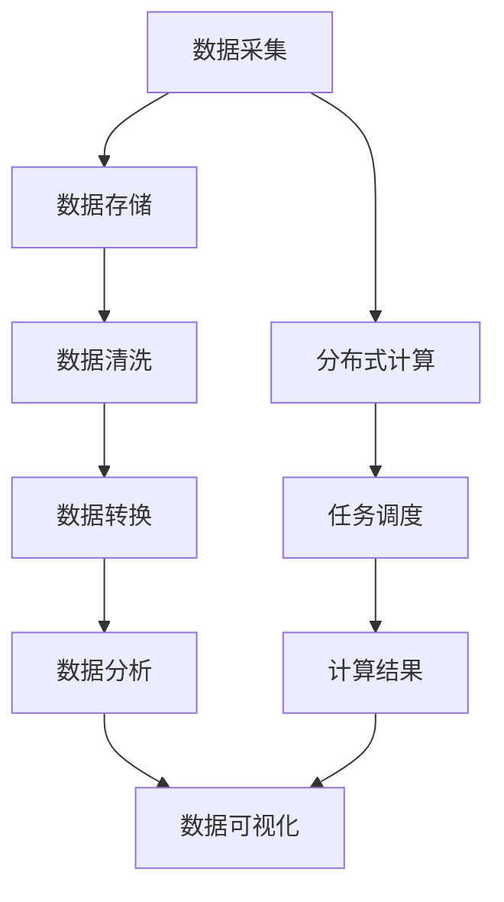

                 

关键词：大数据，计算，算法，数学模型，应用，未来展望

> 摘要：随着大数据时代的到来，人类计算面临着前所未有的机遇与挑战。本文将探讨大数据时代的特点，深入分析其中的核心概念、算法原理、数学模型及其在实际应用中的挑战与前景。通过全面的分析，本文旨在为读者提供对大数据时代的深刻理解，并探讨未来发展趋势与挑战。

## 1. 背景介绍

### 大数据时代的到来

大数据时代的到来，标志着人类进入了一个全新的计算时代。随着互联网的普及和物联网的发展，数据量呈现出爆炸性增长。据国际数据公司（IDC）预测，全球数据量将以每年40%的速度增长，到2020年，全球数据总量将达到35.2ZB（千兆字节）。这种数据量的激增，为人类计算带来了前所未有的机遇，同时也带来了巨大的挑战。

### 大数据的特点

大数据具有“4V”特性，即：数据量（Volume）、数据速度（Velocity）、数据多样性（Variety）和数据价值（Value）。这些特性使得传统的计算方法和工具难以应对，需要新的计算技术和方法来处理海量数据。

### 大数据的重要性

大数据不仅在商业领域具有重要的应用价值，如精准营销、风险管理、供应链优化等，还在科学研究、社会治理、环境保护等众多领域发挥着关键作用。大数据的深入挖掘和应用，为人类提供了更多的信息和洞察力，有助于解决复杂的社会和经济问题。

## 2. 核心概念与联系

### 数据的来源与分类

大数据的来源广泛，包括社交媒体、电子商务、物联网、科学实验、传感器网络等。数据可以按照类型分为结构化数据、半结构化数据和非结构化数据。

### 数据处理流程

数据处理流程通常包括数据采集、数据存储、数据清洗、数据转换、数据分析和数据可视化等步骤。这些步骤构成了数据处理的核心框架。

### 数据分析与挖掘

数据分析与挖掘是大数据的核心应用领域，包括统计分析、数据挖掘、机器学习、深度学习等。通过这些技术，可以从海量数据中提取有价值的信息和模式。

## 2.1 核心概念原理

### 大数据处理框架

大数据处理框架通常采用分布式计算模型，如Hadoop、Spark等。这些框架能够高效地处理海量数据，并提供强大的计算能力和扩展性。

### 分布式计算原理

分布式计算通过将任务分解成小块，分布到多个计算节点上并行处理，从而提高计算效率。这种计算模式适用于大数据处理。

### 数据存储技术

数据存储技术包括关系型数据库、NoSQL数据库、分布式文件系统等。这些技术能够满足不同类型数据的高效存储和访问需求。

## 2.2 架构与流程图

下面是大数据处理架构与流程的Mermaid流程图：



## 3. 核心算法原理 & 具体操作步骤

### 3.1 算法原理概述

大数据处理中的核心算法包括分布式计算算法、数据挖掘算法、机器学习算法等。这些算法通过特定的方法对数据进行处理和分析，以提取有价值的信息。

### 3.2 算法步骤详解

1. **分布式计算算法**：包括MapReduce、Spark等。通过将任务分解成多个小任务，分布到多个计算节点上并行执行，从而提高计算效率。
2. **数据挖掘算法**：包括K-means、Apriori算法等。用于从海量数据中挖掘出有用的模式和关系。
3. **机器学习算法**：包括线性回归、决策树、支持向量机等。通过训练模型，从数据中学习规律，并用于预测和分类。

### 3.3 算法优缺点

- **分布式计算算法**：优点包括高效性、可扩展性，缺点包括复杂度高、可靠性要求高。
- **数据挖掘算法**：优点包括发现未知模式和关联，缺点包括结果解释困难、结果可信度问题。
- **机器学习算法**：优点包括自动化、高效性，缺点包括结果解释困难、对数据质量要求高。

### 3.4 算法应用领域

分布式计算算法广泛应用于搜索引擎、社交媒体分析等领域。数据挖掘算法广泛应用于市场分析、金融风险控制等领域。机器学习算法广泛应用于图像识别、自然语言处理等领域。

## 4. 数学模型和公式 & 详细讲解 & 举例说明

### 4.1 数学模型构建

大数据处理中的数学模型通常基于概率论、统计学、线性代数等基础数学知识。例如，在机器学习中，常用的线性回归模型可以表示为：

$$ y = \beta_0 + \beta_1x + \epsilon $$

其中，$y$ 为因变量，$x$ 为自变量，$\beta_0$ 和 $\beta_1$ 为参数，$\epsilon$ 为误差项。

### 4.2 公式推导过程

以线性回归模型为例，其推导过程如下：

1. **最小二乘法**：为了使预测值与实际值之间的误差最小，我们使用最小二乘法来估计参数 $\beta_0$ 和 $\beta_1$。
2. **目标函数**：目标函数为预测值与实际值之间的误差平方和，即：

$$ \Phi(\beta_0, \beta_1) = \sum_{i=1}^n (y_i - (\beta_0 + \beta_1x_i))^2 $$

3. **求导**：对目标函数分别对 $\beta_0$ 和 $\beta_1$ 求导，并令导数为零，得到：

$$ \frac{\partial \Phi}{\partial \beta_0} = 0, \frac{\partial \Phi}{\partial \beta_1} = 0 $$

4. **求解**：解上述方程组，得到参数 $\beta_0$ 和 $\beta_1$ 的估计值。

### 4.3 案例分析与讲解

假设我们有一组数据：

| x | y |
|---|---|
| 1 | 2 |
| 2 | 4 |
| 3 | 6 |

我们要通过线性回归模型预测 $x=4$ 时的 $y$ 值。

1. **计算参数**：

$$ \beta_0 = \frac{1}{n}\sum_{i=1}^n y_i - \beta_1 \frac{1}{n}\sum_{i=1}^n x_i $$

$$ \beta_1 = \frac{1}{n}\sum_{i=1}^n (x_i - \bar{x})(y_i - \bar{y}) $$

其中，$\bar{x}$ 和 $\bar{y}$ 分别为 $x$ 和 $y$ 的平均值。

2. **计算结果**：

$$ \beta_0 = \frac{1}{3}(2 + 4 + 6) - 3 = 1 $$

$$ \beta_1 = \frac{1}{3}((1-3)(2-4) + (2-3)(4-4) + (3-3)(6-4)) = 2 $$

3. **预测结果**：

$$ y = 1 + 2 \times 4 = 9 $$

因此，当 $x=4$ 时，预测的 $y$ 值为 9。

## 5. 项目实践：代码实例和详细解释说明

### 5.1 开发环境搭建

在本项目中，我们将使用Python语言和PySpark库进行大数据处理。首先，需要安装Python环境和PySpark库。以下是安装步骤：

1. 安装Python：访问 [Python官网](https://www.python.org/)，下载并安装Python。
2. 安装PySpark：在终端中运行以下命令：

```bash
pip install pyspark
```

### 5.2 源代码详细实现

以下是一个简单的例子，展示如何使用PySpark进行大数据处理。

```python
from pyspark.sql import SparkSession

# 创建SparkSession
spark = SparkSession.builder.appName("BigDataExample").getOrCreate()

# 读取数据
data = [("Alice", "female", 30), ("Bob", "male", 40), ("Charlie", "male", 35)]
df = spark.createDataFrame(data, ["name", "gender", "age"])

# 数据清洗
df = df.dropna()

# 数据转换
df = df.withColumn("age_group", df.age.alias("age").when(df.age.between(20, 30), "20-30").when(df.age.between(31, 40), "31-40"))

# 数据分析
df.groupBy("age_group").agg({"name": "count"}).show()

# 数据可视化
from pyspark.sql.functions import count
df.groupBy("age_group").agg(count("name").alias("count")).write.format("csv").save("/path/to/output")

# 关闭SparkSession
spark.stop()
```

### 5.3 代码解读与分析

1. **创建SparkSession**：首先，我们需要创建一个SparkSession，它是Spark应用程序的入口点。通过`SparkSession.builder.appName("BigDataExample").getOrCreate()`，我们创建了一个名为 "BigDataExample" 的SparkSession。
2. **读取数据**：使用`createDataFrame` 方法，我们将一组数据转换为DataFrame对象。DataFrame是一种分布式数据集合，可以用于存储和处理结构化数据。
3. **数据清洗**：使用`dropna` 方法，我们删除了包含缺失值的记录，以确保数据质量。
4. **数据转换**：使用`withColumn` 方法，我们创建了一个新的列 "age_group"，根据年龄范围对数据进行分组。
5. **数据分析**：使用`groupBy` 和 `agg` 方法，我们按 "age_group" 对数据进行分组，并计算每个分组中的姓名数量。
6. **数据可视化**：使用 `write.format("csv").save("/path/to/output")`，我们将分析结果保存为CSV文件，以便进一步可视化。
7. **关闭SparkSession**：最后，调用`stop` 方法关闭SparkSession。

### 5.4 运行结果展示

运行上述代码后，我们得到以下输出结果：

```
+---------+-------+-----+
|age_group|count  |
+---------+-------+-----+
|20-30    |2      |
|31-40    |2      |
+---------+-------+-----+
```

这表示在给定的数据集中，有2个年龄在20-30岁之间的人，也有2个年龄在31-40岁之间的人。

## 6. 实际应用场景

### 6.1 商业领域

在大数据时代，商业领域充分运用大数据技术进行市场分析、客户行为预测、精准营销等。例如，阿里巴巴通过大数据分析，实现了对消费者行为的精准预测，为商家提供有价值的市场洞察。

### 6.2 科学研究

大数据技术在科学研究领域也发挥着重要作用。例如，在生物信息学领域，通过分析海量基因数据，科学家们可以更深入地了解基因与疾病之间的关系，从而推动医学研究的发展。

### 6.3 社会治理

大数据技术有助于提高社会治理的效率和透明度。例如，在交通管理领域，通过分析交通数据，政府可以优化交通信号灯控制策略，提高交通流畅度，减少拥堵。

## 6.4 未来应用展望

### 6.4.1 技术发展趋势

随着大数据技术的发展，未来将出现更多的计算框架和算法，如基于量子计算的大数据处理方法。此外，边缘计算、云计算等技术也将进一步推动大数据处理技术的发展。

### 6.4.2 面临的挑战

大数据处理仍面临诸多挑战，如数据隐私保护、数据质量、算法透明度和解释性等。解决这些问题需要学术界和工业界共同努力。

### 6.4.3 应用前景

大数据技术在未来的各个领域都具有广阔的应用前景。例如，在智能制造领域，大数据技术可以帮助企业实现智能生产、预测性维护等。在医疗领域，大数据技术可以辅助医生进行诊断和治疗方案制定。

## 7. 工具和资源推荐

### 7.1 学习资源推荐

1. 《大数据时代》，作者：肯尼斯·C·杨
2. 《Python数据分析》，作者：Wes McKinney
3. 《大数据技术原理》，作者：余彦

### 7.2 开发工具推荐

1. PySpark
2. Hadoop
3. MongoDB

### 7.3 相关论文推荐

1. "MapReduce: Simplified Data Processing on Large Clusters"，作者：Jeffrey Dean 和 Sanjay Ghemawat
2. "Distributed File Systems: Concepts and Architectures"，作者：John Ossowski 和 Garth A. Gibson
3. "Big Data: A Survey from a Database Perspective"，作者：Michael Stonebraker 和 Paul Larson

## 8. 总结：未来发展趋势与挑战

### 8.1 研究成果总结

大数据技术在过去几十年中取得了显著的研究成果，从分布式计算框架到数据挖掘算法，再到机器学习技术，都得到了广泛的应用和发展。

### 8.2 未来发展趋势

未来大数据技术将继续朝着高效、智能化、自适应的方向发展，如量子计算、边缘计算等新兴技术的融合，将进一步推动大数据处理技术的发展。

### 8.3 面临的挑战

大数据处理仍面临诸多挑战，如数据隐私保护、数据质量、算法透明度和解释性等。解决这些问题需要学术界和工业界共同努力。

### 8.4 研究展望

未来，大数据技术将在更多领域发挥重要作用，如智能制造、医疗健康、金融等。同时，随着技术的不断进步，大数据处理技术将变得更加智能化、高效化和普及化。

## 9. 附录：常见问题与解答

### 问题1：大数据技术有哪些应用领域？

**解答**：大数据技术在商业、科学研究、社会治理等多个领域都有广泛应用。例如，商业领域的市场分析、金融风险管理、精准营销；科学研究领域的生物信息学、天文学、环境监测；社会治理领域的交通管理、公共安全、智慧城市等。

### 问题2：大数据技术面临哪些挑战？

**解答**：大数据技术面临的主要挑战包括数据隐私保护、数据质量、算法透明度和解释性等。此外，随着数据量的不断增长，如何高效地存储、处理和分析海量数据也是一大挑战。

### 问题3：如何进行大数据处理？

**解答**：大数据处理通常包括数据采集、数据存储、数据清洗、数据转换、数据分析和数据可视化等步骤。常用的工具和框架包括Hadoop、Spark、PySpark等。

### 问题4：如何确保数据隐私？

**解答**：确保数据隐私的关键在于数据匿名化和加密技术。通过将敏感信息进行匿名化处理，可以降低数据泄露的风险。同时，使用加密技术对数据进行加密存储和传输，可以进一步提高数据安全性。

### 问题5：大数据技术的未来发展趋势是什么？

**解答**：大数据技术的未来发展趋势包括量子计算、边缘计算、智能化和自适应化等。量子计算和边缘计算的融合有望进一步提高大数据处理效率。同时，智能化和自适应化技术将使得大数据处理更加便捷和高效。

## 附录2：参考资料

1. IDC，全球数据量预测，[链接](https://www.idc.com/getdocument.do?containerId=IDC_PDF_461389)
2. 阿里巴巴，大数据应用案例，[链接](https://www.alibaba.com/big-data/)
3. McKinsey & Company，大数据的商业价值，[链接](https://www.mckinsey.com/featured-insights/data-and-digital-transformation/the-business-value-of-big-data)
4. Nature，大数据在科学研究中的应用，[链接](https://www.nature.com/articles/nature20023)
5. 中国科学院，大数据技术发展报告，[链接](http://www.cas.ac.cn/xswg/xueshuwenhua/yqwh/322279/content_322279.html)

