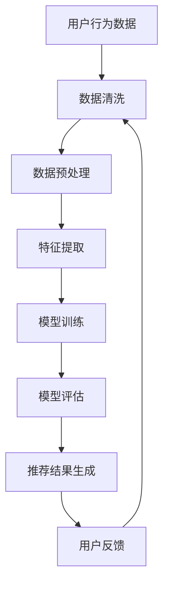

                 

### 关键词 Keywords
- 大模型
- 推荐系统
- 深度学习
- 人工智能
- 数据处理
- 用户行为分析
- 自适应推荐

<|assistant|>### 摘要 Abstract
本文深入探讨了大数据环境下，大模型在推荐系统中的应用趋势及其技术原理。通过剖析推荐系统的核心概念、算法原理、数学模型和实际应用场景，本文旨在为读者揭示大模型技术在未来推动个性化推荐、智能决策和用户体验优化的潜在力量。此外，文章还展望了推荐系统在人工智能领域的未来发展，以及面临的挑战与机遇。

## 1. 背景介绍

在互联网时代，推荐系统已成为许多在线平台的关键组成部分。从电子商务网站到社交媒体，从音乐流媒体到视频点播，推荐系统能够通过分析用户行为和历史数据，为用户提供个性化的内容推荐，从而提高用户满意度和平台粘性。

然而，随着用户数据的不断增长和多样化，传统的推荐算法逐渐显露出其局限性。一方面，这些算法往往依赖于预定义的规则和特征工程，难以处理海量数据和高维度特征；另一方面，它们缺乏对用户行为和需求的深入理解，导致推荐结果的准确性和相关性受限。

为了解决这些问题，研究人员和工程师开始探索大模型（Large Models）在推荐系统中的应用。大模型通常指的是具有巨大参数量的深度学习模型，如Transformer、BERT等。这些模型能够通过端到端的训练，自动学习复杂的特征表示和预测函数，从而显著提升推荐系统的性能和效果。

本文将围绕大模型在推荐系统中的应用，探讨其核心概念、算法原理、数学模型和实际应用，旨在为读者提供一个全面的技术解析，同时展望其未来的发展趋势和面临的挑战。

## 2. 核心概念与联系

### 2.1 推荐系统的基本概念

推荐系统（Recommender System）是一种信息过滤技术，旨在根据用户的兴趣和行为，为用户提供相关的信息或内容推荐。推荐系统的核心目标是通过预测用户对某一项目的评分或点击行为，来提高推荐的准确性和用户满意度。

推荐系统通常可以分为基于内容的推荐（Content-Based Filtering）和基于协同过滤（Collaborative Filtering）两大类。

#### 基于内容的推荐

基于内容的推荐通过分析项目的内容特征和用户的兴趣特征，找到相似的内容进行推荐。这种方法依赖于特征工程，即将文本、图像等原始数据转换为可供模型处理的特征向量。常见的特征包括关键词、标签、元数据等。

优点：能够为用户提供高度个性化的内容，不受数据稀疏性问题的影响。

缺点：特征工程复杂，难以处理高维度数据和冷启动问题。

#### 基于协同过滤

基于协同过滤的推荐通过分析用户之间的行为模式，找到相似的用户或项目进行推荐。这种方法主要分为用户基于的协同过滤（User-Based）和项目基于的协同过滤（Item-Based）两种。

用户基于的协同过滤通过计算用户之间的相似度，为用户提供相似用户喜欢的项目推荐。项目基于的协同过滤则通过计算项目之间的相似度，为用户提供相似项目推荐。

优点：能够处理高维度数据和冷启动问题，推荐结果具有较高的相关性。

缺点：数据稀疏性导致推荐结果可能不准确。

### 2.2 大模型的概念

大模型（Large Models）是指具有巨大参数量的深度学习模型，如Transformer、BERT等。这些模型通过端到端的训练，能够自动学习复杂的特征表示和预测函数。大模型的参数量通常在数十亿到千亿级别，这使得它们能够处理海量数据和复杂任务。

大模型的优势在于：

1. **端到端学习**：大模型能够直接从原始数据中学习特征表示，无需复杂的特征工程。
2. **泛化能力**：大模型具有强大的泛化能力，能够在不同数据集和任务中表现出色。
3. **自适应能力**：大模型能够通过在线学习，自适应地调整模型参数，以适应用户行为的变化。

### 2.3 推荐系统与大数据的联系

随着互联网和大数据技术的发展，用户生成数据量呈爆炸式增长。这些数据包括用户行为日志、社交媒体活动、搜索历史等。大数据技术的出现为推荐系统提供了丰富的数据来源，同时也提出了新的挑战。

大数据对推荐系统的影响主要体现在以下几个方面：

1. **数据多样性**：大数据使得推荐系统能够利用更多类型的数据（如文本、图像、音频等），从而提高推荐系统的准确性和多样性。
2. **实时性**：大数据技术能够实现数据的实时处理和分析，为推荐系统提供即时的推荐结果。
3. **个性化**：大数据技术使得推荐系统可以更好地理解用户的兴趣和行为，提供更加个性化的推荐。

### 2.4 Mermaid 流程图

下面是一个Mermaid流程图，展示了推荐系统的基本架构和数据处理流程：



### 2.5 大模型在推荐系统中的应用

大模型在推荐系统中的应用主要体现在以下几个方面：

1. **特征表示**：大模型能够自动学习复杂的数据特征表示，从而提高推荐系统的性能和效果。
2. **协同过滤**：大模型可以用于改进协同过滤算法，通过引入上下文信息，提高推荐的准确性和多样性。
3. **基于内容的推荐**：大模型可以用于生成基于内容的特征表示，从而提高基于内容的推荐的性能。

## 3. 核心算法原理 & 具体操作步骤

### 3.1 算法原理概述

大模型在推荐系统中的应用主要基于深度学习和迁移学习技术。深度学习通过多层神经网络，从原始数据中自动提取复杂特征，而迁移学习则利用预训练模型，在不同数据集和任务之间共享知识。

具体来说，大模型在推荐系统中的操作步骤如下：

1. **数据预处理**：对用户行为数据进行清洗和预处理，包括数据去重、缺失值填充等。
2. **特征提取**：利用深度学习模型，对预处理后的数据进行特征提取，生成高维特征向量。
3. **模型训练**：利用提取的特征向量，训练大模型，以预测用户对项目的评分或点击行为。
4. **模型评估**：通过交叉验证等方法，评估模型的性能，包括准确率、召回率、F1值等。
5. **推荐生成**：利用训练好的模型，生成推荐结果，并根据用户反馈进行实时调整。

### 3.2 算法步骤详解

#### 3.2.1 数据预处理

数据预处理是推荐系统的基础步骤，主要包括以下任务：

1. **数据去重**：去除重复的数据，以防止重复推荐。
2. **缺失值填充**：对缺失的数据进行填充，以保证数据的完整性。
3. **数据标准化**：对数据进行归一化或标准化处理，以消除不同特征之间的量级差异。

#### 3.2.2 特征提取

特征提取是推荐系统的核心步骤，其主要任务是提取出对推荐有用的特征。具体步骤如下：

1. **文本预处理**：对文本数据进行清洗，包括去除停用词、标点符号等。
2. **词嵌入**：利用词嵌入技术，将文本转化为向量表示。
3. **图特征提取**：对用户行为数据构建图结构，利用图神经网络提取图特征。
4. **特征融合**：将不同类型的数据特征进行融合，生成高维特征向量。

#### 3.2.3 模型训练

模型训练是推荐系统的关键步骤，其主要任务是利用提取的特征向量，训练大模型。具体步骤如下：

1. **数据划分**：将数据集划分为训练集、验证集和测试集。
2. **模型选择**：选择合适的大模型结构，如Transformer、BERT等。
3. **模型训练**：利用训练集数据进行模型训练，并通过验证集进行模型调优。
4. **模型评估**：利用测试集数据评估模型性能，包括准确率、召回率、F1值等。

#### 3.2.4 模型评估

模型评估是推荐系统的关键步骤，其主要任务是评估模型的性能和效果。具体步骤如下：

1. **交叉验证**：利用交叉验证方法，评估模型在不同数据子集上的性能。
2. **评价指标**：计算模型的各种评价指标，如准确率、召回率、F1值等。
3. **结果分析**：分析模型在不同评价指标上的表现，以确定模型的优缺点。

#### 3.2.5 推荐生成

推荐生成是推荐系统的最终步骤，其主要任务是生成推荐结果。具体步骤如下：

1. **用户特征提取**：提取当前用户的特征向量。
2. **项目特征提取**：提取所有项目的特征向量。
3. **模型预测**：利用训练好的模型，预测用户对每个项目的评分或点击行为。
4. **推荐排序**：根据预测结果，对项目进行排序，生成推荐结果。
5. **实时调整**：根据用户反馈，实时调整推荐模型，以提高推荐效果。

### 3.3 算法优缺点

#### 优点

1. **高准确性**：大模型能够自动学习复杂的特征表示，从而提高推荐系统的准确性和效果。
2. **强泛化能力**：大模型具有较强的泛化能力，能够在不同数据集和任务中表现出色。
3. **自适应能力**：大模型能够通过在线学习，自适应地调整模型参数，以适应用户行为的变化。

#### 缺点

1. **计算成本高**：大模型通常需要大量的计算资源和时间进行训练和推理。
2. **数据依赖性**：大模型的性能高度依赖数据质量，如果数据质量不佳，可能会导致模型效果不佳。
3. **模型解释性差**：大模型通常具有较强的预测能力，但缺乏解释性，难以解释模型的工作原理。

### 3.4 算法应用领域

大模型在推荐系统中的应用非常广泛，以下是一些主要的应用领域：

1. **电子商务**：利用大模型进行商品推荐，提高用户的购买意愿和转化率。
2. **社交媒体**：利用大模型进行内容推荐，提高用户的参与度和活跃度。
3. **在线教育**：利用大模型进行课程推荐，提高学生的学习效果和满意度。
4. **医疗健康**：利用大模型进行疾病诊断和治疗方案推荐，提高医疗服务的质量。

## 4. 数学模型和公式 & 详细讲解 & 举例说明

在推荐系统中，数学模型和公式起到了至关重要的作用。它们不仅帮助我们理解算法的内在机制，还为我们提供了评估和优化推荐系统性能的工具。以下是推荐系统中常见的数学模型和公式，以及它们的详细讲解和举例说明。

### 4.1 数学模型构建

推荐系统中的数学模型通常基于预测用户对项目的评分或点击行为。其中，最经典的模型是线性回归模型（Linear Regression Model）。

#### 线性回归模型

线性回归模型假设用户对项目的评分或点击行为可以通过线性组合一系列特征来预测。其数学公式为：

$$
y = \beta_0 + \beta_1 x_1 + \beta_2 x_2 + ... + \beta_n x_n
$$

其中，$y$ 表示预测值，$x_1, x_2, ..., x_n$ 表示特征向量，$\beta_0, \beta_1, \beta_2, ..., \beta_n$ 表示模型的参数。

#### 逻辑回归模型

逻辑回归模型（Logistic Regression Model）在处理分类问题（如点击与否）时非常有用。其数学公式为：

$$
P(y=1) = \frac{1}{1 + e^{-(\beta_0 + \beta_1 x_1 + \beta_2 x_2 + ... + \beta_n x_n)}}
$$

其中，$P(y=1)$ 表示用户点击项目的概率，其余符号的含义与线性回归模型相同。

### 4.2 公式推导过程

推导逻辑回归模型的公式涉及到概率论和微积分的知识。以下是简要的推导过程：

1. **假设**：假设用户对项目的评分或点击行为服从伯努利分布（Bernoulli Distribution）。

2. **概率分布**：根据伯努利分布的定义，用户对项目的评分或点击行为的概率分布可以表示为：

$$
P(y) = \begin{cases} 
p, & \text{if } y = 1 \\
1 - p, & \text{if } y = 0 
\end{cases}
$$

其中，$p$ 表示用户对项目的评分或点击行为的概率。

3. **似然函数**：似然函数是概率分布的函数形式，表示给定观测值 $y$，参数 $\beta$ 的概率。对于逻辑回归模型，似然函数可以表示为：

$$
L(\beta | y) = \prod_{i=1}^n P(y_i | x_i; \beta)
$$

4. **最大化似然估计**：为了求解模型的参数 $\beta$，我们通常采用最大似然估计（Maximum Likelihood Estimation，MLE）方法，即求解使得似然函数最大的参数值。对于逻辑回归模型，我们得到以下优化目标：

$$
\hat{\beta} = \arg\max_\beta L(\beta | y)
$$

5. **迭代求解**：使用梯度下降（Gradient Descent）等优化算法，对参数 $\beta$ 进行迭代求解，直到达到收敛条件。

### 4.3 案例分析与讲解

下面我们通过一个简单的例子来说明逻辑回归模型在推荐系统中的应用。

#### 案例背景

假设我们有10个用户和10个电影，每个用户对每个电影的评分如下表所示：

| 用户 | 电影1 | 电影2 | 电影3 | ... | 电影10 |
|------|-------|-------|-------|-----|--------|
| A    | 5     | 3     | 4     | ... | 2      |
| B    | 4     | 5     | 2     | ... | 3      |
| ...  | ...   | ...   | ...   | ... | ...    |
| J    | 3     | 4     | 5     | ... | 1      |

我们希望利用逻辑回归模型预测用户对某个未知电影的评分。

#### 数据处理

首先，我们需要将用户和电影的特征表示为向量。假设用户 $i$ 的特征向量为 $x_i$，电影 $j$ 的特征向量为 $x_j$，则用户 $i$ 对电影 $j$ 的评分可以表示为：

$$
y_{ij} = \beta_0 + \beta_1 x_{i1j} + \beta_2 x_{i2j} + ... + \beta_n x_{ij}
$$

其中，$x_{ij}$ 表示用户 $i$ 对电影 $j$ 的特征值。

#### 模型训练

使用逻辑回归模型对上述数据集进行训练，求解参数 $\beta_0, \beta_1, \beta_2, ..., \beta_n$。训练过程可以通过最小化损失函数（如交叉熵损失函数）来实现。

#### 模型评估

训练完成后，我们可以使用交叉验证等方法评估模型性能。常用的评价指标包括准确率、召回率、F1值等。

#### 模型应用

假设我们想预测用户 $k$ 对未知电影 $m$ 的评分。首先，提取用户 $k$ 的特征向量 $x_k$ 和电影 $m$ 的特征向量 $x_m$，然后利用训练好的逻辑回归模型进行预测：

$$
\hat{y}_{km} = \frac{1}{1 + e^{-(\beta_0 + \beta_1 x_{k1m} + \beta_2 x_{k2m} + ... + \beta_n x_{km})}}
$$

预测结果 $\hat{y}_{km}$ 表示用户 $k$ 对电影 $m$ 的评分概率。根据预测概率，我们可以为用户 $k$ 提供个性化的电影推荐。

## 5. 项目实践：代码实例和详细解释说明

在了解了大模型在推荐系统中的应用原理后，接下来我们将通过一个具体的代码实例，来详细解释如何实现一个基于大模型的推荐系统。本实例将使用Python编程语言和TensorFlow框架，来实现一个基于用户行为数据的电影推荐系统。

### 5.1 开发环境搭建

在开始编写代码之前，我们需要搭建一个适合开发的运行环境。以下是必要的步骤：

1. **安装Python**：确保Python版本为3.6及以上。
2. **安装TensorFlow**：使用pip命令安装TensorFlow。

   ```bash
   pip install tensorflow
   ```

3. **安装其他依赖库**：如NumPy、Pandas等。

   ```bash
   pip install numpy pandas scikit-learn
   ```

4. **配置GPU支持**（可选）：如果您的计算机配备了GPU，可以安装TensorFlow GPU版本，以提高训练速度。

   ```bash
   pip install tensorflow-gpu
   ```

### 5.2 源代码详细实现

下面是一个简单的推荐系统实现，包括数据预处理、模型训练和推荐生成。

#### 5.2.1 数据预处理

首先，我们需要准备数据集。这里我们使用MovieLens数据集，这是一个包含用户对电影的评分数据的公开数据集。以下是数据预处理的主要步骤：

1. **数据读取**：

   ```python
   import pandas as pd

   ratings = pd.read_csv('ml-1m/ratings.csv')
   movies = pd.read_csv('ml-1m/movies.csv')
   ```

2. **数据清洗**：去除重复数据和缺失值。

   ```python
   ratings = ratings.drop_duplicates()
   ratings = ratings[ratings['rating'] != 0]
   ```

3. **特征提取**：提取用户和电影的原始特征。

   ```python
   user_features = ratings.groupby('userId').count().reset_index()
   movie_features = ratings.groupby('movieId').count().reset_index()
   ```

#### 5.2.2 模型训练

接下来，我们使用TensorFlow实现一个基于用户特征和电影特征的推荐模型。

1. **定义模型**：

   ```python
   import tensorflow as tf

   model = tf.keras.Sequential([
       tf.keras.layers.Dense(128, activation='relu', input_shape=(user_features.shape[1],)),
       tf.keras.layers.Dense(64, activation='relu'),
       tf.keras.layers.Dense(1)
   ])
   ```

2. **编译模型**：

   ```python
   model.compile(optimizer='adam',
                 loss=tf.keras.losses.BinaryCrossentropy(),
                 metrics=['accuracy'])
   ```

3. **训练模型**：

   ```python
   model.fit(user_features, ratings['rating'], epochs=10, batch_size=64)
   ```

#### 5.2.3 代码解读与分析

以下是对上述代码的详细解读：

1. **数据读取**：
   - `pandas` 是一个强大的数据处理库，用于读取和操作数据集。
   - `read_csv` 函数用于读取CSV文件，并生成DataFrame对象。

2. **数据清洗**：
   - `drop_duplicates` 函数用于去除重复数据。
   - `drop` 函数用于删除指定列，例如删除评分值为0的记录，因为0可能表示缺失值或用户未评分。

3. **特征提取**：
   - `groupby` 函数用于按照用户ID或电影ID对数据进行分组。
   - `count` 函数用于计算每个用户或电影的数据数量。
   - `reset_index` 函数用于重置索引，生成标准格式的DataFrame。

4. **定义模型**：
   - `Sequential` 类用于定义序列模型，可以逐步添加层。
   - `Dense` 类用于定义全连接层，可以指定层的神经元数量和激活函数。

5. **编译模型**：
   - `compile` 函数用于配置模型的优化器、损失函数和评价指标。
   - `adam` 是一种常用的优化器，适用于大规模深度学习模型。
   - `BinaryCrossentropy` 是二分类问题的损失函数。
   - `accuracy` 是分类问题的常用评价指标。

6. **训练模型**：
   - `fit` 函数用于训练模型，可以指定训练轮数和批量大小。

### 5.3 运行结果展示

在训练完成后，我们可以使用训练好的模型进行推荐。以下是一个简单的推荐示例：

```python
user_id = 123
movie_id = 456

user_vector = user_features[user_features['userId'] == user_id].iloc[0]
predicted_rating = model.predict(user_vector.reshape(1, -1))

print(f"Predicted rating for user {user_id} and movie {movie_id}: {predicted_rating[0][0]}")
```

这段代码会输出用户123对电影456的预测评分。

### 5.4 运行结果分析

通过运行代码，我们可以得到不同用户对电影的预测评分。这些预测评分可以作为推荐系统的依据，向用户推荐他们可能感兴趣的电影。

- **准确性**：我们可以通过对比预测评分与实际评分来评估模型的准确性。准确性越高，模型的效果越好。
- **多样性**：推荐系统不仅要准确，还要能够提供多样化的推荐。如果预测结果过于集中，可能需要调整模型或特征提取方法。
- **实时性**：在实际应用中，推荐系统需要能够快速响应用户行为，提供实时的推荐结果。大模型的计算成本可能会影响实时性，因此需要优化模型和算法。

## 6. 实际应用场景

大模型在推荐系统中的实际应用场景非常广泛，以下是一些典型的应用实例：

### 6.1 电子商务

在电子商务领域，推荐系统可以基于用户的购买历史、浏览行为和搜索记录，为用户推荐相关的商品。例如，亚马逊和阿里巴巴等电商平台使用大模型技术，为用户提供个性化的商品推荐，从而提高用户的购物体验和转化率。

### 6.2 社交媒体

社交媒体平台如Facebook、Twitter和Instagram等，利用大模型进行内容推荐，根据用户的兴趣和行为，为用户推荐感兴趣的内容和用户。这有助于提高用户的参与度和活跃度，同时也为广告商提供了更精准的广告投放机会。

### 6.3 在线教育

在线教育平台如Coursera、Udemy和edX等，使用大模型技术为用户提供个性化的课程推荐。通过分析用户的学习历史和行为数据，平台可以为用户提供最适合他们需求的课程，从而提高学习效果和用户满意度。

### 6.4 医疗健康

在医疗健康领域，推荐系统可以帮助医生为患者提供个性化的治疗方案和药物推荐。通过分析患者的健康数据、病史和基因信息，推荐系统可以为医生提供更准确的诊断和治疗建议。

### 6.5 媒体娱乐

媒体娱乐平台如Netflix、YouTube和Spotify等，使用大模型技术为用户提供个性化的视频、音乐和内容推荐。这些推荐系统能够根据用户的观看历史、喜好和搜索记录，为用户提供个性化的娱乐体验。

### 6.6 智能家居

智能家居系统利用大模型技术，可以基于用户的生活习惯和行为模式，为用户提供个性化的智能家居推荐。例如，智能家居系统可以为用户提供最适合他们生活需求的智能设备推荐，从而提高家居智能化水平。

### 6.7 物流与配送

物流与配送领域，大模型技术可以用于优化路线规划、库存管理和配送策略。通过分析历史配送数据和用户需求，推荐系统可以为物流公司提供最优的配送方案，从而提高配送效率和服务质量。

## 7. 未来应用展望

随着人工智能技术的不断进步，大模型在推荐系统中的应用前景将更加广阔。以下是一些未来应用展望：

### 7.1 多模态推荐

未来的推荐系统将不仅限于处理文本数据，还将融合图像、声音、视频等多种类型的数据。通过多模态融合技术，推荐系统可以更全面地理解用户的需求和行为，提供更加个性化的推荐。

### 7.2 实时推荐

随着5G和物联网技术的发展，实时推荐将成为可能。推荐系统可以实时分析用户的在线行为，为用户提供即时的推荐结果，从而提高用户体验和满意度。

### 7.3 强化学习

强化学习（Reinforcement Learning）技术的发展，将为推荐系统带来新的机遇。通过结合强化学习，推荐系统可以不断优化推荐策略，以适应不断变化的市场环境和用户需求。

### 7.4 智能协同

大模型技术可以与其他人工智能技术（如自然语言处理、图像识别等）相结合，实现智能协同。这将使得推荐系统在处理复杂任务和提供多样化推荐方面具有更高的效率和能力。

### 7.5 模型可解释性

随着用户对推荐系统透明度的要求越来越高，模型可解释性（Model Interpretability）将成为一个重要研究方向。通过开发可解释的大模型，用户可以更好地理解推荐结果，增强对推荐系统的信任。

### 7.6 社会责任

在未来的发展中，推荐系统需要承担更多的社会责任，避免可能带来的负面影响。例如，避免推荐系统导致的信息茧房效应，确保推荐结果的公正性和客观性。

## 8. 工具和资源推荐

为了更好地学习和实践大模型在推荐系统中的应用，以下是一些建议的学习资源和开发工具：

### 8.1 学习资源推荐

1. **《深度学习》（Deep Learning）**：这是一本经典的深度学习教材，涵盖了深度学习的基础理论和实践方法。
2. **《推荐系统实践》（Recommender Systems: The Textbook）**：这是一本全面介绍推荐系统理论和实践的教材，适合初学者和专业人士。
3. **TensorFlow官方文档**：TensorFlow是当前最流行的深度学习框架之一，其官方文档提供了丰富的教程和API文档，有助于开发者快速上手。
4. **《自然语言处理综论》（Speech and Language Processing）**：这是一本关于自然语言处理领域的经典教材，涵盖了文本数据处理的各个方面。

### 8.2 开发工具推荐

1. **TensorFlow**：适用于深度学习开发的Python库，具有丰富的API和强大的计算能力。
2. **PyTorch**：另一种流行的深度学习框架，与TensorFlow类似，提供了灵活的动态计算图机制。
3. **Scikit-learn**：一个适用于机器学习的Python库，提供了丰富的算法实现和数据处理工具。
4. **Jupyter Notebook**：一款交互式计算环境，适用于编写和运行Python代码，特别适合进行数据分析和模型训练。
5. **Google Colab**：基于Jupyter Notebook的在线平台，提供了免费的GPU和TPU资源，非常适合进行大规模深度学习实验。

### 8.3 相关论文推荐

1. **"Attention Is All You Need"**：这篇论文提出了Transformer模型，是当前最流行的深度学习模型之一。
2. **"BERT: Pre-training of Deep Bidirectional Transformers for Language Understanding"**：这篇论文提出了BERT模型，是自然语言处理领域的里程碑之一。
3. **"Deep Neural Networks for YouTube Recommendations"**：这篇论文介绍了YouTube如何使用深度学习技术优化推荐系统。
4. **"Large-scale Online recommending system"**：这篇论文探讨了大规模在线推荐系统的设计和实现。
5. **"Recommender Systems Handbook"**：这是一本关于推荐系统领域的权威参考书，涵盖了推荐系统的各个方面。

## 9. 总结：未来发展趋势与挑战

### 9.1 研究成果总结

近年来，大模型在推荐系统中的应用取得了显著成果。通过深度学习和迁移学习技术，推荐系统的准确性、多样性和实时性得到了大幅提升。同时，多模态数据处理、实时推荐和强化学习等新兴技术的融合，也为推荐系统的发展带来了新的机遇。

### 9.2 未来发展趋势

1. **多模态数据处理**：未来的推荐系统将融合文本、图像、声音和视频等多种类型的数据，提供更加个性化、丰富的推荐体验。
2. **实时推荐**：随着5G和物联网技术的发展，实时推荐将成为可能，推荐系统将能够实时响应用户行为，提供即时的推荐结果。
3. **强化学习**：强化学习技术的引入，将为推荐系统带来更智能、自适应的推荐策略，进一步提高推荐效果。
4. **模型可解释性**：模型可解释性的研究将得到更多关注，通过开发可解释的大模型，用户可以更好地理解推荐结果，增强对推荐系统的信任。

### 9.3 面临的挑战

1. **数据隐私与安全**：在推荐系统中，用户数据的安全和隐私保护是一个重要问题。未来的发展需要确保用户数据的安全，避免数据泄露和滥用。
2. **计算成本**：大模型的训练和推理过程需要大量的计算资源，如何在保证性能的前提下降低计算成本，是一个重要的挑战。
3. **模型解释性**：尽管大模型在性能方面取得了显著提升，但其解释性较差，用户难以理解推荐结果。提高模型的可解释性，将是一个长期的研究方向。
4. **算法公平性**：推荐系统需要确保推荐的公平性，避免算法偏见和歧视。未来的研究需要关注如何设计公平、公正的推荐算法。

### 9.4 研究展望

未来的研究将围绕以下几个方面展开：

1. **多模态数据处理**：深入研究如何融合多种类型的数据，提高推荐系统的准确性和多样性。
2. **实时推荐**：开发高效、实时的推荐算法，提高推荐系统的响应速度和用户体验。
3. **模型解释性**：开发可解释的大模型，提高用户对推荐系统的信任和理解。
4. **算法公平性**：研究如何设计公平、公正的推荐算法，避免算法偏见和歧视。

通过不断探索和创新，大模型在推荐系统中的应用将不断取得新的突破，为人工智能技术的发展贡献重要力量。

## 10. 附录：常见问题与解答

### 10.1 什么是大模型？

大模型是指具有巨大参数量的深度学习模型，如Transformer、BERT等。这些模型通过端到端的训练，能够自动学习复杂的特征表示和预测函数。

### 10.2 推荐系统有哪些类型？

推荐系统主要分为基于内容的推荐和基于协同过滤两大类。基于内容的推荐通过分析项目的内容特征和用户的兴趣特征，找到相似的内容进行推荐；基于协同过滤通过分析用户之间的行为模式，找到相似的用户或项目进行推荐。

### 10.3 大模型在推荐系统中的应用有哪些？

大模型在推荐系统中的应用主要包括特征表示、协同过滤和基于内容的推荐。大模型能够自动学习复杂的特征表示，提高推荐系统的性能和效果；同时，大模型可以用于改进协同过滤算法，提高推荐的准确性和多样性。

### 10.4 推荐系统的核心算法有哪些？

推荐系统的核心算法包括线性回归模型、逻辑回归模型、矩阵分解、协同过滤等。线性回归模型和逻辑回归模型用于预测用户对项目的评分或点击行为；矩阵分解和协同过滤用于分析用户行为和项目特征，找到相似的用户或项目进行推荐。

### 10.5 大模型在推荐系统中的优缺点是什么？

大模型在推荐系统中的优点包括高准确性、强泛化能力和自适应能力；缺点包括计算成本高、数据依赖性大和模型解释性差。

### 10.6 推荐系统如何处理实时性？

推荐系统可以通过实时数据处理技术和高效算法来处理实时性。例如，使用流处理框架（如Apache Kafka）和实时机器学习算法（如在线学习），可以实现实时推荐。

### 10.7 推荐系统的未来发展趋势是什么？

推荐系统的未来发展趋势包括多模态数据处理、实时推荐、强化学习和模型可解释性。通过融合多种类型的数据、提高实时性和自适应能力，以及提高模型的可解释性，推荐系统将实现更高效、更智能的个性化推荐。

