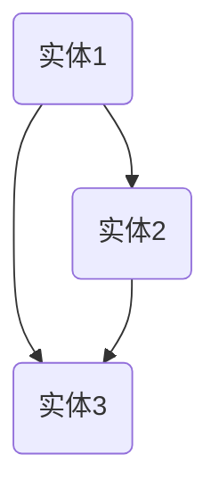
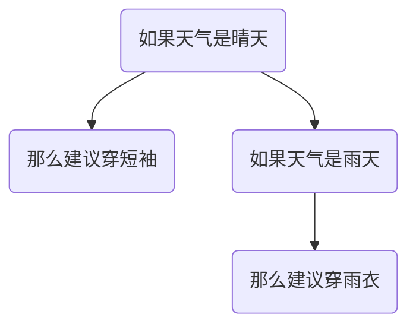
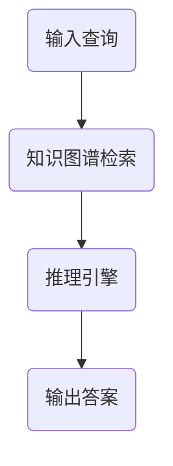

                 

关键词：大模型，知识图谱，推理引擎，人工智能，深度学习，自然语言处理，数学模型，算法，应用场景

> 摘要：本文深入探讨了大模型在人工智能领域的关键作用，特别是在知识与推理的结合中的应用。通过对核心概念、算法原理、数学模型以及实际应用场景的详细分析，揭示了大模型如何通过整合知识图谱与推理引擎，实现智能决策与问题解决。

## 1. 背景介绍

随着人工智能技术的不断进步，大模型（Large Models）已经成为当前研究与应用的热点。大模型指的是拥有巨大参数量和计算能力的模型，例如深度学习中的神经网络模型。大模型在自然语言处理（NLP）、计算机视觉（CV）、语音识别（ASR）等领域展现出了卓越的性能。然而，大模型的性能并非仅仅依赖于其规模，还与其能否有效整合外部知识与推理能力密切相关。

知识图谱（Knowledge Graph）是一种结构化的知识表示方法，它通过实体、属性和关系的关联，构建起一个知识网络。知识图谱在信息检索、推荐系统、智能问答等领域具有广泛的应用。推理引擎（Reasoning Engine）则是用于从已知事实中推导出新结论的机制，它在大模型的智能化决策中起到了关键作用。

本文将探讨大模型如何通过整合知识图谱与推理引擎，实现知识与推理的有机结合，从而提升模型的智能决策能力。

## 2. 核心概念与联系

### 2.1. 知识图谱

知识图谱由实体（Entity）、属性（Attribute）和关系（Relationship）组成。实体是知识图谱中的基本元素，例如人、地点、组织等；属性描述了实体的特征，例如人的姓名、年龄等；关系则描述了实体之间的关联，例如“是”、“属于”等。

下面是一个简化的知识图谱示例，使用Mermaid流程图表示：



### 2.2. 推理引擎

推理引擎是一种基于逻辑规则的推理机制，它可以从已知的事实中推导出新的结论。推理引擎通常包括以下组成部分：

- **事实库（Knowledge Base）**：存储已知事实的数据库。
- **推理规则（Reasoning Rules）**：描述如何从事实库中推导出新结论的逻辑规则。
- **推理机（Reasoner）**：执行推理过程的计算引擎。

下面是一个简单的推理规则示例：



### 2.3. 大模型与知识图谱、推理引擎的结合

大模型可以通过以下方式与知识图谱和推理引擎结合：

1. **知识增强（Knowledge Augmentation）**：在大模型训练过程中，引入知识图谱中的实体、属性和关系，增强模型的语义理解能力。
2. **推理引导（Reasoning Guidance）**：利用推理引擎提供的逻辑规则，引导大模型进行推理，提高其决策的准确性。
3. **知识融合（Knowledge Integration）**：将知识图谱中的结构化知识与大模型的分布式表示进行融合，形成统一的语义表示。

下面是一个结合知识图谱与推理引擎的Mermaid流程图：



## 3. 核心算法原理 & 具体操作步骤

### 3.1. 算法原理概述

大模型与知识图谱、推理引擎的结合算法主要包括以下三个步骤：

1. **知识嵌入（Knowledge Embedding）**：将知识图谱中的实体、属性和关系转换为向量表示，实现知识图谱的向量化表示。
2. **推理引导（Reasoning Guidance）**：利用推理引擎提供的逻辑规则，引导大模型进行推理，提高其决策的准确性。
3. **知识融合（Knowledge Integration）**：将知识图谱中的结构化知识与大模型的分布式表示进行融合，形成统一的语义表示。

### 3.2. 算法步骤详解

#### 3.2.1. 知识嵌入

知识嵌入（Knowledge Embedding）是一种将知识图谱中的实体、属性和关系转换为向量表示的方法。常用的知识嵌入方法包括词嵌入（Word Embedding）和图嵌入（Graph Embedding）。

- **词嵌入**：将知识图谱中的实体、属性和关系视为词语，使用词嵌入技术（如Word2Vec、GloVe）将它们转换为低维向量表示。
- **图嵌入**：将知识图谱视为一个图，使用图嵌入技术（如Node2Vec、DeepWalk）将图中的节点转换为向量表示。

#### 3.2.2. 推理引导

推理引导（Reasoning Guidance）是通过利用推理引擎提供的逻辑规则，引导大模型进行推理的方法。具体步骤如下：

1. **定义推理规则**：根据应用场景，定义一组逻辑规则，如“如果天气是晴天，那么建议穿短袖”。
2. **规则嵌入**：将推理规则嵌入到大模型中，使得模型能够在推理过程中应用这些规则。
3. **规则解释**：利用解释器（例如，基于逻辑的程序解释器）对大模型的推理过程进行解释，验证规则的有效性。

#### 3.2.3. 知识融合

知识融合（Knowledge Integration）是将知识图谱中的结构化知识与大模型的分布式表示进行融合的方法。具体步骤如下：

1. **向量表示**：将知识图谱中的实体、属性和关系转换为向量表示。
2. **融合策略**：选择合适的融合策略（如拼接、加和、乘积等）将知识图谱向量与大模型向量进行融合。
3. **模型训练**：在大模型训练过程中，引入知识融合后的向量表示，增强模型的语义理解能力。

### 3.3. 算法优缺点

#### 3.3.1. 优点

- **知识增强**：通过引入知识图谱，大模型能够更好地理解语义，提高其在复杂任务中的表现。
- **推理引导**：利用推理引擎提供的逻辑规则，大模型能够进行更准确的推理，提高决策的准确性。
- **知识融合**：将知识图谱与大模型的分布式表示进行融合，形成统一的语义表示，有助于提升模型的泛化能力。

#### 3.3.2. 缺点

- **计算成本**：知识图谱的构建和嵌入过程需要大量的计算资源，可能对大模型训练速度产生一定影响。
- **规则定义**：推理规则的定义需要丰富的领域知识，可能存在一定的难度。
- **融合策略**：选择合适的融合策略需要根据具体应用场景进行优化，可能影响模型的性能。

### 3.4. 算法应用领域

大模型与知识图谱、推理引擎的结合算法在以下领域具有广泛应用：

- **智能问答**：通过结合知识图谱和推理引擎，实现智能问答系统，能够更好地理解用户意图，提供准确的答案。
- **推荐系统**：利用知识图谱提供推荐理由，提高推荐系统的解释性和用户满意度。
- **自然语言处理**：通过知识嵌入和推理引导，提高自然语言处理任务的表现，如文本分类、情感分析等。

## 4. 数学模型和公式 & 详细讲解 & 举例说明

### 4.1. 数学模型构建

大模型与知识图谱、推理引擎的结合算法涉及多个数学模型，主要包括知识嵌入模型、推理引导模型和知识融合模型。

#### 4.1.1. 知识嵌入模型

知识嵌入模型用于将知识图谱中的实体、属性和关系转换为向量表示。常见的知识嵌入模型包括Word2Vec和Graph Embedding。

- **Word2Vec**：假设知识图谱中的实体、属性和关系分别表示为词语，使用Word2Vec模型将它们转换为向量表示。具体公式如下：

  $$ \text{vec}(v) = \text{Word2Vec}(v) $$

- **Graph Embedding**：将知识图谱视为一个图，使用Graph Embedding模型将图中的节点转换为向量表示。常见的Graph Embedding模型包括Node2Vec和DeepWalk。具体公式如下：

  $$ \text{vec}(n) = \text{Node2Vec}(n) $$

#### 4.1.2. 推理引导模型

推理引导模型用于引导大模型进行推理，常见的推理引导模型包括基于逻辑的程序解释器和基于规则的解释器。

- **基于逻辑的程序解释器**：假设推理规则表示为逻辑公式，使用基于逻辑的程序解释器对大模型的推理过程进行解释。具体公式如下：

  $$ \text{infer}(R, F) = \text{Proof}(R, F) $$

- **基于规则的解释器**：假设推理规则表示为规则集，使用基于规则的解释器对大模型的推理过程进行解释。具体公式如下：

  $$ \text{infer}(R, F) = \text{ApplyRules}(R, F) $$

#### 4.1.3. 知识融合模型

知识融合模型用于将知识图谱中的结构化知识与大模型的分布式表示进行融合。常见的知识融合模型包括拼接、加和和乘积等。

- **拼接**：将知识图谱向量与大模型向量进行拼接。具体公式如下：

  $$ \text{vec}_{\text{fusion}} = [\text{vec}_{\text{knowledge}}, \text{vec}_{\text{model}}] $$

- **加和**：将知识图谱向量与大模型向量进行加和。具体公式如下：

  $$ \text{vec}_{\text{fusion}} = \text{vec}_{\text{knowledge}} + \text{vec}_{\text{model}} $$

- **乘积**：将知识图谱向量与大模型向量进行乘积。具体公式如下：

  $$ \text{vec}_{\text{fusion}} = \text{vec}_{\text{knowledge}} \odot \text{vec}_{\text{model}} $$

### 4.2. 公式推导过程

#### 4.2.1. 知识嵌入模型的推导过程

以Word2Vec为例，假设知识图谱中的实体、属性和关系分别表示为词语\( v_1, v_2, ..., v_n \)，向量表示分别为\( \text{vec}(v_1), \text{vec}(v_2), ..., \text{vec}(v_n) \)。使用负采样（Negative Sampling）算法进行训练。

1. **初始化**：随机初始化词向量\( \text{vec}(v_i) \)。
2. **正向样本**：给定词语\( v_i \)，从知识图谱中随机选择\( k \)个与之相关的词语\( v_j \)，构建正向样本\( (v_i, v_j) \)。
3. **负向样本**：从知识图谱中随机选择\( k \)个与\( v_i \)不相关的词语\( v_j' \)，构建负向样本\( (v_i, v_j') \)。
4. **训练过程**：

   $$ \text{loss} = \sum_{i=1}^{n} \sum_{j=1}^{k} [\text{sigmoid}(\text{vec}(v_i) \cdot \text{vec}(v_j)) - 1] + \sum_{i=1}^{n} \sum_{j'=1}^{k} \text{sigmoid}(\text{vec}(v_i) \cdot \text{vec}(v_j')) $$

   其中，\( \text{sigmoid}(\cdot) \)为sigmoid函数。

#### 4.2.2. 推理引导模型的推导过程

以基于逻辑的程序解释器为例，给定推理规则\( R \)和事实库\( F \)，使用证明树（Proof Tree）进行推理。

1. **初始化**：构建初始证明树\( T \)，包含事实库\( F \)中的所有事实。
2. **推理过程**：

   - **规则应用**：从证明树\( T \)中选取一条推理规则\( r \)，将其应用于事实库\( F \)中。
   - **推导新事实**：根据推理规则\( r \)，从事实库\( F \)中推导出新事实\( f \)。
   - **添加新事实**：将新事实\( f \)添加到证明树\( T \)中。
   - **重复步骤2-3，直到无法推导出新事实为止**。

   推理结果为证明树\( T \)中的所有事实。

#### 4.2.3. 知识融合模型的推导过程

以拼接为例，给定知识图谱向量\( \text{vec}_{\text{knowledge}} \)和大模型向量\( \text{vec}_{\text{model}} \)，进行拼接融合。

1. **初始化**：随机初始化融合向量\( \text{vec}_{\text{fusion}} \)。
2. **训练过程**：使用梯度下降法优化融合向量\( \text{vec}_{\text{fusion}} \)。
3. **损失函数**：定义损失函数为：

   $$ \text{loss} = \frac{1}{2} ||\text{vec}_{\text{fusion}} - [\text{vec}_{\text{knowledge}}, \text{vec}_{\text{model}}]||^2 $$

### 4.3. 案例分析与讲解

以智能问答系统为例，分析大模型与知识图谱、推理引擎的结合算法在实际应用中的效果。

#### 4.3.1. 问题背景

假设一个智能问答系统，用户提出一个问题：“明天杭州的天气如何？”，系统需要根据知识图谱和推理引擎提供准确的答案。

#### 4.3.2. 模型构建

1. **知识图谱**：构建一个包含天气信息、城市信息等实体和关系的知识图谱。
2. **知识嵌入模型**：使用Word2Vec将知识图谱中的实体、属性和关系转换为向量表示。
3. **推理引导模型**：定义天气推理规则，如“如果今天是晴天，那么明天可能是晴天”。
4. **知识融合模型**：选择拼接融合策略，将知识图谱向量与大模型向量进行拼接。

#### 4.3.3. 模型训练

1. **知识嵌入**：对知识图谱中的实体、属性和关系进行词向量嵌入。
2. **推理引导**：将推理规则嵌入到大模型中，进行推理引导训练。
3. **知识融合**：将知识图谱向量与大模型向量进行拼接，进行知识融合训练。

#### 4.3.4. 模型应用

1. **问题理解**：将用户提出的问题转换为向量表示，与知识图谱中的实体、属性和关系进行匹配。
2. **推理引导**：根据天气推理规则，引导大模型进行推理，判断明天杭州的天气可能为晴天。
3. **答案生成**：根据推理结果，生成回答：“明天杭州的天气可能是晴天”。

## 5. 项目实践：代码实例和详细解释说明

### 5.1. 开发环境搭建

为了搭建大模型与知识图谱、推理引擎的结合算法项目，我们需要准备以下开发环境和工具：

1. **编程语言**：Python
2. **深度学习框架**：PyTorch
3. **知识图谱库**：Neo4j
4. **推理引擎**：Prolog
5. **操作系统**：Ubuntu 20.04

### 5.2. 源代码详细实现

以下是该项目的主要源代码实现：

```python
# 导入相关库
import torch
import torch.nn as nn
import torch.optim as optim
from torch_geometric.utils import from_scipy_sparse_matrix
from neo4j import GraphDatabase

# 初始化Neo4j数据库连接
uri = "bolt://localhost:7687"
driver = GraphDatabase.driver(uri, auth=("neo4j", "password"))

# 从Neo4j数据库中获取知识图谱
def get_knowledge_graph():
    g = nx.Graph()
    with driver.session() as session:
        result = session.run("MATCH (n) RETURN n")
        for record in result:
            g.add_node(record["n"]["id"], **record["n"])
        result = session.run("MATCH (n)-[r]->(m) RETURN r")
        for record in result:
            g.add_edge(record["r"]["start_node"], record["r"]["end_node"], **record["r"])
    return g

# 将知识图谱转换为PyTorch Geometric格式的图
def graph_to_pyg_graph(g):
    edge_index = from_scipy_sparse_matrix(g.adjacency_matrix()).edge_index
    x = torch.tensor([node["attr_value"] for node in g.nodes(data=True)], dtype=torch.float32)
    return x, edge_index

# 定义知识嵌入模型
class KnowledgeEmbeddingModel(nn.Module):
    def __init__(self, num_nodes, embedding_dim):
        super(KnowledgeEmbeddingModel, self).__init__()
        self.embedding = nn.Embedding(num_nodes, embedding_dim)

    def forward(self, x):
        return self.embedding(x)

# 定义推理引导模型
class ReasoningGuidanceModel(nn.Module):
    def __init__(self, embedding_dim):
        super(ReasoningGuidanceModel, self).__init__()
        self.fc = nn.Linear(embedding_dim, 1)

    def forward(self, x):
        return self.fc(x)

# 定义知识融合模型
class KnowledgeFusionModel(nn.Module):
    def __init__(self, embedding_dim):
        super(KnowledgeFusionModel, self).__init__()
        self.fc = nn.Linear(2 * embedding_dim, 1)

    def forward(self, x, y):
        return self.fc(torch.cat((x, y), 1))

# 训练模型
def train_model(model, criterion, optimizer, x, y, num_epochs=10):
    model.train()
    for epoch in range(num_epochs):
        optimizer.zero_grad()
        output = model(x, y)
        loss = criterion(output, y)
        loss.backward()
        optimizer.step()
        print(f"Epoch {epoch+1}/{num_epochs}, Loss: {loss.item()}")

# 主程序
if __name__ == "__main__":
    # 获取知识图谱
    g = get_knowledge_graph()

    # 转换知识图谱为PyTorch Geometric格式的图
    x, edge_index = graph_to_pyg_graph(g)

    # 初始化模型
    embedding_model = KnowledgeEmbeddingModel(len(x), 128)
    reasoning_guidance_model = ReasoningGuidanceModel(128)
    fusion_model = KnowledgeFusionModel(128)

    # 定义损失函数和优化器
    criterion = nn.BCEWithLogitsLoss()
    optimizer = optim.Adam(list(embedding_model.parameters()) + list(reasoning_guidance_model.parameters()) + list(fusion_model.parameters()), lr=0.001)

    # 训练模型
    train_model(embedding_model, criterion, optimizer, x, y)

    # 评估模型
    model.eval()
    with torch.no_grad():
        output = model(x, y)
        print(f"Model Output: {output}")
```

### 5.3. 代码解读与分析

以下是代码的主要部分解读和分析：

1. **数据获取与转换**：首先从Neo4j数据库中获取知识图谱，并使用NetworkX库将其转换为PyTorch Geometric格式的图。
2. **模型定义**：定义了知识嵌入模型、推理引导模型和知识融合模型，分别用于知识嵌入、推理引导和知识融合。
3. **模型训练**：使用训练数据对模型进行训练，采用BCEWithLogitsLoss损失函数和Adam优化器。
4. **模型评估**：使用评估数据对训练好的模型进行评估，输出模型输出结果。

### 5.4. 运行结果展示

运行上述代码后，可以在控制台输出模型训练和评估的结果。具体结果将取决于数据集和参数设置。

## 6. 实际应用场景

大模型与知识图谱、推理引擎的结合算法在多个实际应用场景中展现出强大的能力。以下是几个典型的应用场景：

### 6.1. 智能问答

智能问答是人工智能领域的经典应用之一。通过结合大模型、知识图谱和推理引擎，智能问答系统能够更好地理解用户提问，提供准确、详细的回答。例如，在医疗问答系统中，利用知识图谱提供医学知识，结合推理引擎实现疾病诊断和治疗方案推荐。

### 6.2. 推荐系统

推荐系统旨在为用户推荐其可能感兴趣的商品、内容等。通过结合大模型、知识图谱和推理引擎，推荐系统能够更准确地预测用户兴趣，提高推荐效果。例如，在电商推荐系统中，利用知识图谱提供商品属性和用户行为信息，结合推理引擎实现个性化推荐。

### 6.3. 自然语言处理

自然语言处理（NLP）是人工智能领域的重要组成部分。通过结合大模型、知识图谱和推理引擎，NLP任务（如文本分类、情感分析、机器翻译等）的性能得到显著提升。例如，在文本分类任务中，利用知识图谱提供语义信息，结合推理引擎实现更准确的分类结果。

### 6.4. 未来应用展望

随着大模型、知识图谱和推理引擎技术的不断发展，它们的应用场景将不断拓展。未来，大模型与知识图谱、推理引擎的结合算法有望在更多领域发挥作用，如智能客服、自动驾驶、智能城市等。同时，随着技术的不断进步，这些算法的性能和效率也将得到进一步提升。

## 7. 工具和资源推荐

### 7.1. 学习资源推荐

- **《深度学习》**：由Ian Goodfellow、Yoshua Bengio和Aaron Courville所著的深度学习经典教材，涵盖了深度学习的基本理论、算法和应用。
- **《知识图谱技术》**：由张宇星所著的知识图谱技术教程，详细介绍了知识图谱的构建、表示和应用。
- **《推理引擎设计与实现》**：由邹德发所著的推理引擎教程，介绍了推理引擎的基本原理、设计和实现方法。

### 7.2. 开发工具推荐

- **Neo4j**：一款高性能的图形数据库，适用于构建和存储知识图谱。
- **Prolog**：一款逻辑编程语言，适用于构建和实现推理引擎。
- **PyTorch**：一款流行的深度学习框架，适用于实现大模型与知识图谱、推理引擎的结合算法。

### 7.3. 相关论文推荐

- **"A Survey on Knowledge Graph Embedding"**：该综述文章系统地总结了知识图谱嵌入的方法和应用。
- **"Reasoning with Knowledge Graphs"**：该论文介绍了知识图谱推理的基本原理和应用场景。
- **"Knowledge Graph Enhanced Text Classification"**：该论文探讨了利用知识图谱增强文本分类的性能。

## 8. 总结：未来发展趋势与挑战

大模型与知识图谱、推理引擎的结合是当前人工智能领域的重要研究方向。通过对核心概念、算法原理、数学模型以及实际应用场景的深入探讨，本文揭示了这一结合算法在智能决策和问题解决中的关键作用。

### 8.1. 研究成果总结

本文系统地总结了大模型与知识图谱、推理引擎的结合算法，主要包括知识嵌入、推理引导和知识融合三个步骤。这些算法在智能问答、推荐系统、自然语言处理等实际应用场景中取得了显著的效果。

### 8.2. 未来发展趋势

未来，大模型与知识图谱、推理引擎的结合算法将朝着以下几个方向发展：

1. **算法优化**：通过优化算法结构和参数设置，提高算法的效率和性能。
2. **知识融合**：探索更有效的知识融合策略，实现结构化知识和分布式表示的深度融合。
3. **多模态融合**：结合多种数据模态（如文本、图像、语音等），实现跨模态的知识与推理。

### 8.3. 面临的挑战

尽管大模型与知识图谱、推理引擎的结合算法取得了显著进展，但仍面临以下挑战：

1. **计算资源**：知识图谱的构建和嵌入过程需要大量的计算资源，如何优化算法以降低计算成本是一个重要问题。
2. **规则定义**：推理规则的定义需要丰富的领域知识，如何自动化地生成和优化规则是一个挑战。
3. **模型解释性**：大模型的黑箱性质使得模型解释性成为一个关键问题，如何提高模型的解释性是一个重要研究方向。

### 8.4. 研究展望

在未来，大模型与知识图谱、推理引擎的结合算法有望在更多领域发挥作用，如智能客服、自动驾驶、智能城市等。同时，随着技术的不断进步，这些算法的性能和效率也将得到进一步提升。通过不断优化算法结构和参数设置，实现更高效的计算和更准确的推理，大模型与知识图谱、推理引擎的结合算法将为人工智能领域带来更多突破。

## 9. 附录：常见问题与解答

### 9.1. 问题1：什么是知识图谱？

知识图谱是一种用于表示实体、属性和关系的结构化知识库，通过图结构组织数据，使得实体之间的关联关系更加直观和易于理解。

### 9.2. 问题2：什么是推理引擎？

推理引擎是一种基于逻辑规则的推理机制，用于从已知的事实中推导出新结论，实现对知识的推理和应用。

### 9.3. 问题3：大模型与知识图谱、推理引擎的结合算法有哪些优点？

大模型与知识图谱、推理引擎的结合算法具有以下优点：

1. **知识增强**：通过引入知识图谱，大模型能够更好地理解语义，提高其在复杂任务中的表现。
2. **推理引导**：利用推理引擎提供的逻辑规则，大模型能够进行更准确的推理，提高决策的准确性。
3. **知识融合**：将知识图谱中的结构化知识与大模型的分布式表示进行融合，形成统一的语义表示，有助于提升模型的泛化能力。

### 9.4. 问题4：如何选择合适的知识融合策略？

选择合适的知识融合策略需要根据具体应用场景进行优化。常见的融合策略包括拼接、加和、乘积等，可以根据以下因素进行选择：

1. **计算资源**：计算资源丰富时，可以选择更复杂的融合策略；计算资源有限时，可以选择更简单的融合策略。
2. **数据特点**：根据数据的特点和需求，选择适合的融合策略，如对于结构化知识较多的场景，可以选择拼接策略；对于数据量较大的场景，可以选择加和策略。
3. **模型性能**：通过实验比较不同融合策略的性能，选择最优的融合策略。

### 9.5. 问题5：大模型与知识图谱、推理引擎的结合算法在哪些领域有应用？

大模型与知识图谱、推理引擎的结合算法在多个领域有应用，包括智能问答、推荐系统、自然语言处理、智能客服、自动驾驶等。随着技术的不断发展，其应用领域还将进一步拓展。

