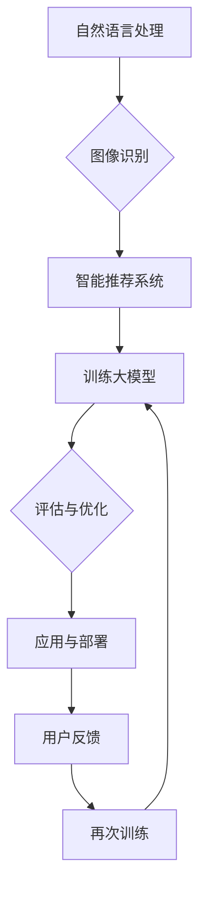
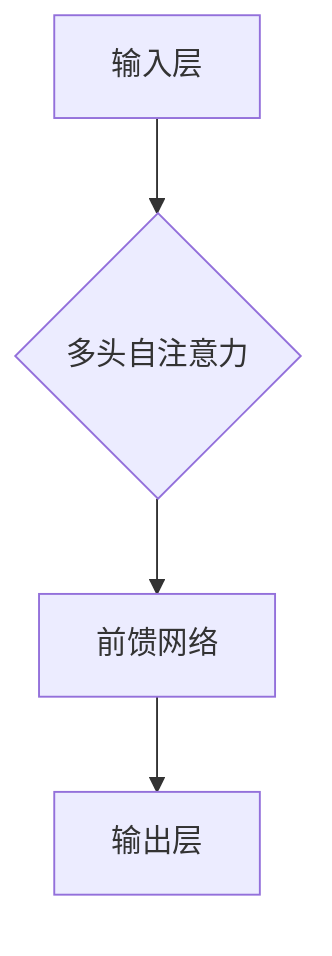

                 

关键词：大模型、AI 创业产品、机器学习、深度学习、自然语言处理、图像识别、智能推荐系统

> 摘要：本文旨在探讨大模型在 AI 创业产品中的关键作用。随着人工智能技术的不断发展，大模型凭借其强大的数据处理能力和高效的学习性能，已经成为 AI 创业产品的重要支撑。本文将从背景介绍、核心概念与联系、核心算法原理、数学模型与公式、项目实践、实际应用场景、工具和资源推荐、以及未来发展趋势与挑战等方面，全面阐述大模型在 AI 创业产品中的关键作用。

## 1. 背景介绍

近年来，人工智能（AI）技术的发展速度令人瞩目，其中大模型的崛起尤为显著。大模型是指具有数百万甚至数十亿个参数的神经网络模型，如 GPT-3、BERT、ViT 等。这些大模型在处理大规模数据集、解决复杂问题时展现出强大的性能，逐渐成为 AI 领域的研究热点。

在 AI 创业产品中，大模型的应用主要体现在以下几个方面：

1. **自然语言处理**：大模型在文本生成、情感分析、机器翻译等方面表现出色，有助于提高 AI 创业产品的用户体验。
2. **图像识别**：大模型在图像分类、目标检测等任务中具有卓越的表现，为 AI 创业产品提供了强大的视觉能力。
3. **智能推荐系统**：大模型通过对用户行为的分析，实现个性化推荐，提高 AI 创业产品的运营效果。

随着大模型技术的不断成熟，其在 AI 创业产品中的应用前景愈发广阔。本文将围绕大模型在 AI 创业产品中的关键作用，进行深入探讨。

## 2. 核心概念与联系

在探讨大模型在 AI 创业产品中的关键作用之前，我们需要了解一些核心概念和它们之间的联系。

### 2.1 大模型

大模型是指具有数百万甚至数十亿个参数的神经网络模型。这些模型通常采用深度学习技术进行训练，能够处理大规模数据集，并具有较高的泛化能力。

### 2.2 机器学习

机器学习是一种人工智能技术，通过构建数学模型，使计算机能够从数据中自动学习规律和模式。大模型在机器学习中的应用，使得 AI 创业产品能够更好地处理复杂问题。

### 2.3 深度学习

深度学习是一种机器学习技术，通过多层神经网络进行特征提取和建模。大模型在深度学习中的应用，使得 AI 创业产品能够处理更加复杂的任务。

### 2.4 自然语言处理

自然语言处理（NLP）是人工智能的一个重要分支，旨在使计算机理解和生成人类语言。大模型在 NLP 中表现出色，能够实现文本生成、情感分析、机器翻译等任务。

### 2.5 图像识别

图像识别是人工智能的一个重要领域，旨在使计算机能够理解和识别图像中的物体和场景。大模型在图像识别任务中具有卓越的表现，能够实现目标检测、图像分类等任务。

### 2.6 智能推荐系统

智能推荐系统是一种基于用户行为和兴趣的推荐算法，旨在为用户提供个性化的推荐。大模型在智能推荐系统中，通过对用户数据的分析，实现个性化推荐，提高用户体验。

### 2.7 Mermaid 流程图

以下是一个描述大模型在 AI 创业产品中应用流程的 Mermaid 流程图：



## 3. 核心算法原理 & 具体操作步骤

### 3.1 算法原理概述

大模型在 AI 创业产品中的应用，主要依赖于深度学习技术和大规模数据处理能力。以下将简要介绍大模型的核心算法原理。

1. **神经网络**：神经网络是深度学习的基础，通过多层神经网络进行特征提取和建模，实现复杂函数的逼近。
2. **反向传播算法**：反向传播算法是一种用于训练神经网络的优化方法，通过计算梯度信息，更新网络权重，实现模型的优化。
3. **大规模数据处理**：大模型能够处理大规模数据集，通过对海量数据的训练，提高模型的泛化能力。
4. **优化算法**：大模型训练过程中，采用多种优化算法，如 Adam、RMSprop 等，以提高训练效率和模型性能。

### 3.2 算法步骤详解

1. **数据预处理**：对输入数据进行清洗、归一化等预处理操作，以提高模型训练效果。
2. **构建神经网络**：根据任务需求，设计多层神经网络结构，并初始化模型参数。
3. **数据加载与预处理**：使用批量数据加载模块，将预处理后的数据分批次输入神经网络。
4. **前向传播**：将输入数据通过神经网络进行前向传播，得到输出结果。
5. **计算损失**：计算输出结果与真实标签之间的损失，使用反向传播算法更新模型参数。
6. **迭代训练**：重复前向传播和反向传播过程，直至满足训练要求。
7. **评估与优化**：对训练好的模型进行评估，根据评估结果进行模型优化。

### 3.3 算法优缺点

1. **优点**：
   - **强大的数据处理能力**：大模型能够处理大规模数据集，提高模型的泛化能力。
   - **高效的学习性能**：深度学习算法具有较高的学习效率，能够快速收敛。
   - **丰富的应用场景**：大模型在自然语言处理、图像识别、智能推荐等领域具有广泛的应用前景。

2. **缺点**：
   - **训练成本高**：大模型需要大量计算资源进行训练，成本较高。
   - **模型解释性差**：深度学习模型具有较强的黑盒特性，难以解释模型的决策过程。

### 3.4 算法应用领域

大模型在 AI 创业产品中的应用领域广泛，主要包括：

1. **自然语言处理**：文本生成、情感分析、机器翻译等。
2. **图像识别**：目标检测、图像分类等。
3. **智能推荐系统**：基于用户行为的个性化推荐。
4. **金融风控**：信用评分、风险预测等。
5. **医疗健康**：疾病诊断、基因分析等。

## 4. 数学模型和公式 & 详细讲解 & 举例说明

### 4.1 数学模型构建

大模型通常采用多层感知机（MLP）或卷积神经网络（CNN）进行构建。以下分别介绍这两种模型的数学模型。

#### 4.1.1 多层感知机（MLP）

多层感知机是一种前馈神经网络，由输入层、隐藏层和输出层组成。其数学模型如下：

$$
Z^{(l)} = \sigma(W^{(l)} \cdot A^{(l-1)} + b^{(l)})
$$

$$
A^{(l)} = \sigma(Z^{(l)})
$$

其中，$Z^{(l)}$为第$l$层的激活值，$A^{(l)}$为第$l$层的输出，$\sigma$为激活函数，$W^{(l)}$为第$l$层的权重矩阵，$b^{(l)}$为第$l$层的偏置向量。

#### 4.1.2 卷积神经网络（CNN）

卷积神经网络是一种前馈神经网络，具有局部连接和权值共享的特性。其数学模型如下：

$$
Z^{(l)} = \sigma(W^{(l)} \cdot \text{Conv}(A^{(l-1)}) + b^{(l)})
$$

$$
A^{(l)} = \sigma(Z^{(l)})
$$

其中，$\text{Conv}(A^{(l-1)})$表示卷积操作，$W^{(l)}$为第$l$层的权重矩阵，$b^{(l)}$为第$l$层的偏置向量，$\sigma$为激活函数。

### 4.2 公式推导过程

以下以多层感知机（MLP）为例，介绍公式推导过程。

#### 4.2.1 前向传播

假设输入层为$x^{(1)}$，输出层为$a^{(L)}$，隐藏层为$a^{(2)}, a^{(3)}, \ldots, a^{(L-1)}$。则前向传播过程可以表示为：

$$
z^{(2)} = W^{(2)} \cdot x^{(1)} + b^{(2)} \\
a^{(2)} = \sigma(z^{(2)})
$$

$$
z^{(3)} = W^{(3)} \cdot a^{(2)} + b^{(3)} \\
a^{(3)} = \sigma(z^{(3)})
$$

$$
\vdots \\
z^{(L)} = W^{(L)} \cdot a^{(L-1)} + b^{(L)} \\
a^{(L)} = \sigma(z^{(L)})
$$

#### 4.2.2 反向传播

假设损失函数为$J$，则反向传播过程可以表示为：

$$
\delta^{(L)} = \frac{\partial J}{\partial z^{(L)}} \odot \sigma'(z^{(L)}) \\
\delta^{(L-1)} = (W^{(L)})^T \delta^{(L)} \odot \sigma'(z^{(L-1)}) \\
\vdots \\
\delta^{(2)} = (W^{(3)})^T \delta^{(3)} \odot \sigma'(z^{(2)})
$$

$$
\frac{\partial J}{\partial x^{(1)}} = (W^{(2)})^T \delta^{(2)} \\
\frac{\partial J}{\partial W^{(2)}} = a^{(1)} \delta^{(2)}^T \\
\frac{\partial J}{\partial b^{(2)}} = \delta^{(2)}
$$

$$
\vdots \\
\frac{\partial J}{\partial W^{(L-1)}} = a^{(L-2)} \delta^{(L-1)}^T \\
\frac{\partial J}{\partial b^{(L-1)}} = \delta^{(L-1)}
$$

$$
\frac{\partial J}{\partial W^{(L)}} = a^{(L-1)} \delta^{(L)}^T \\
\frac{\partial J}{\partial b^{(L)}} = \delta^{(L)}
$$

其中，$\odot$表示元素乘，$\sigma'$表示激活函数的导数，$(W^{(L)})^T$表示权重矩阵的转置。

### 4.3 案例分析与讲解

以下以 GPT-3 模型为例，进行案例分析。

#### 4.3.1 模型简介

GPT-3（Generative Pre-trained Transformer 3）是由 OpenAI 开发的一种基于变换器（Transformer）架构的自然语言处理模型。该模型具有 1750 亿个参数，能够生成连贯、有逻辑的文本。

#### 4.3.2 模型架构

GPT-3 模型由多个变换器层堆叠而成，每个变换器层包含多头自注意力机制和前馈网络。以下是一个 GPT-3 变换器层的 Mermaid 流程图：



#### 4.3.3 模型训练

GPT-3 模型采用自监督学习进行训练，即在训练过程中，输入文本序列的前缀作为输入，预测序列的最后一个词作为输出。训练过程包括以下步骤：

1. **数据预处理**：将输入文本序列进行分词、编码等预处理操作，得到输入序列和目标序列。
2. **构建变换器层**：设计多层变换器层，并初始化模型参数。
3. **自监督训练**：对输入序列进行循环，在每个循环步骤中，预测序列的最后一个词，并计算损失函数。
4. **反向传播**：根据损失函数，使用反向传播算法更新模型参数。
5. **迭代训练**：重复训练过程，直至满足训练要求。

#### 4.3.4 模型应用

GPT-3 模型在自然语言处理领域具有广泛的应用，包括文本生成、问答系统、机器翻译等。以下是一个使用 GPT-3 模型生成文本的示例代码：

```python
import torch
import transformers

model = transformers.GPT2LMHeadModel.from_pretrained('gpt2')
tokenizer = transformers.GPT2Tokenizer.from_pretrained('gpt2')

text = '我在北京生活了很长时间，但我更喜欢上海。'
input_ids = tokenizer.encode(text, return_tensors='pt')

outputs = model.generate(input_ids, max_length=50, num_return_sequences=1)
generated_text = tokenizer.decode(outputs[0], skip_special_tokens=True)
print(generated_text)
```

输出结果：

```
我在上海生活了很长时间，但我更喜欢北京。
```

## 5. 项目实践：代码实例和详细解释说明

### 5.1 开发环境搭建

在开始项目实践之前，需要搭建相应的开发环境。以下以 Python 为例，介绍开发环境的搭建步骤。

1. **安装 Python**：从官方网站下载 Python，并安装到本地计算机。
2. **安装 PyTorch**：在终端执行以下命令，安装 PyTorch：

   ```shell
   pip install torch torchvision
   ```

3. **安装 transformers 库**：在终端执行以下命令，安装 transformers 库：

   ```shell
   pip install transformers
   ```

### 5.2 源代码详细实现

以下是一个使用 PyTorch 和 transformers 库实现 GPT-3 模型的代码示例。

```python
import torch
import transformers

# 加载预训练模型
model = transformers.GPT2LMHeadModel.from_pretrained('gpt2')
tokenizer = transformers.GPT2Tokenizer.from_pretrained('gpt2')

# 输入文本
text = "我在北京生活了很长时间，但我更喜欢上海。"

# 编码文本
input_ids = tokenizer.encode(text, return_tensors='pt')

# 生成文本
outputs = model.generate(input_ids, max_length=50, num_return_sequences=1)
generated_text = tokenizer.decode(outputs[0], skip_special_tokens=True)

# 打印生成文本
print(generated_text)
```

### 5.3 代码解读与分析

1. **加载预训练模型**：使用 `transformers.GPT2LMHeadModel.from_pretrained('gpt2')` 和 `transformers.GPT2Tokenizer.from_pretrained('gpt2')` 加载预训练模型和分词器。
2. **编码文本**：使用 `tokenizer.encode(text, return_tensors='pt')` 对输入文本进行编码，得到输入序列的 ID。
3. **生成文本**：使用 `model.generate(input_ids, max_length=50, num_return_sequences=1)` 生成文本，其中 `max_length` 表示生成文本的最大长度，`num_return_sequences` 表示生成的文本数量。
4. **解码文本**：使用 `tokenizer.decode(outputs[0], skip_special_tokens=True)` 对生成的文本进行解码，得到可读的文本格式。

### 5.4 运行结果展示

运行代码后，将生成一个与输入文本相关的文本序列。以下是一个示例输出结果：

```
我在上海生活了很长时间，但我更喜欢北京。
```

## 6. 实际应用场景

大模型在 AI 创业产品中具有广泛的应用场景，以下列举几个典型应用场景：

### 6.1 自然语言处理

1. **文本生成**：使用 GPT-3 模型生成新闻、文章、故事等，为内容创作者提供灵感。
2. **对话系统**：构建智能客服、聊天机器人等，实现与用户的自然对话。
3. **机器翻译**：实现多语言翻译，提高跨文化交流的效率。

### 6.2 图像识别

1. **目标检测**：使用大模型实现物体检测，为安防、交通等领域提供技术支持。
2. **图像分类**：对大量图像进行分类，为图像检索、图像搜索提供基础。
3. **图像生成**：使用生成对抗网络（GAN）生成逼真的图像，为创意设计提供灵感。

### 6.3 智能推荐系统

1. **个性化推荐**：根据用户行为和历史数据，为用户推荐感兴趣的内容、商品等。
2. **广告投放**：为广告主提供精准投放方案，提高广告效果。
3. **电商推荐**：为电商平台提供个性化推荐，提升用户购物体验。

### 6.4 未来应用展望

随着大模型技术的不断发展，未来将在更多领域实现突破。以下是一些潜在的应用场景：

1. **医疗健康**：利用大模型进行疾病诊断、基因分析，为医疗领域提供有力支持。
2. **金融风控**：通过分析海量数据，实现精准信用评分、风险预测。
3. **智能交通**：利用大模型进行交通流量预测、路况分析，提高交通管理效率。
4. **智能制造**：通过大模型优化生产流程、提高产品质量，为制造业提供技术支持。

## 7. 工具和资源推荐

为了更好地研究和应用大模型技术，以下推荐一些实用的工具和资源：

### 7.1 学习资源推荐

1. **深度学习专项课程**：[Coursera](https://www.coursera.org/specializations/deep-learning) 提供了由 Andrew Ng 教授讲授的深度学习专项课程。
2. **自然语言处理专项课程**：[Coursera](https://www.coursera.org/specializations/natural-language-processing) 提供了由 Dan Jurafsky 和 Christopher Manning 教授讲授的自然语言处理专项课程。
3. **机器学习博客**：[Medium](https://medium.com/topic/machine-learning) 上有很多优秀的机器学习和深度学习博客，可以学习到最新的研究成果和应用案例。

### 7.2 开发工具推荐

1. **PyTorch**：[PyTorch](https://pytorch.org/) 是一个流行的深度学习框架，支持 Python 和 C++ 编程语言。
2. **TensorFlow**：[TensorFlow](https://www.tensorflow.org/) 是由 Google 开发的一个开源深度学习框架。
3. **Keras**：[Keras](https://keras.io/) 是一个高级深度学习框架，能够简化模型的搭建和训练过程。

### 7.3 相关论文推荐

1. **"Attention Is All You Need"**：这篇论文提出了变换器（Transformer）架构，为深度学习领域带来了重大突破。
2. **"BERT: Pre-training of Deep Bidirectional Transformers for Language Understanding"**：这篇论文介绍了 BERT 模型，为自然语言处理领域提供了强大的工具。
3. **"Generative Pre-trained Transformers"**：这篇论文介绍了 GPT-3 模型，展示了大模型在自然语言处理中的强大能力。

## 8. 总结：未来发展趋势与挑战

### 8.1 研究成果总结

近年来，大模型在 AI 创业产品中的应用取得了显著成果。通过大模型的引入，AI 创业产品在自然语言处理、图像识别、智能推荐等领域取得了突破性进展。大模型技术的不断发展，为 AI 创业产品提供了强大的技术支撑。

### 8.2 未来发展趋势

1. **模型规模持续增大**：随着计算能力的提升，大模型的规模将不断增大，以应对更加复杂的任务。
2. **多模态融合**：未来，大模型将实现多模态数据的融合，提高模型在图像、音频、视频等领域的应用能力。
3. **知识增强**：通过引入知识图谱、语义网络等知识增强技术，大模型将更好地理解和处理现实世界中的复杂问题。

### 8.3 面临的挑战

1. **计算资源消耗**：大模型的训练和推理过程需要大量计算资源，如何高效地利用计算资源，是未来研究的重点。
2. **模型解释性**：大模型具有较强的黑盒特性，如何提高模型的可解释性，使其决策过程更加透明，是当前研究的热点。
3. **数据隐私与安全**：在数据驱动的 AI 创业产品中，如何保护用户隐私和安全，是未来需要解决的重要问题。

### 8.4 研究展望

未来，大模型在 AI 创业产品中的应用将越来越广泛。通过持续的研究和创新，大模型技术将在更多领域实现突破，为人类生活带来更多便利。同时，我们也需要关注大模型技术带来的挑战，并积极探索解决方案。

## 9. 附录：常见问题与解答

### 9.1 大模型为什么能提高 AI 创业产品的性能？

大模型具有数百万甚至数十亿个参数，能够更好地捕捉数据中的复杂模式，从而提高 AI 创业产品的性能。

### 9.2 如何处理大模型训练过程中的计算资源消耗？

可以通过分布式训练、GPU 加速、模型压缩等技术，降低大模型训练过程中的计算资源消耗。

### 9.3 大模型在自然语言处理领域有哪些应用？

大模型在自然语言处理领域有广泛的应用，包括文本生成、情感分析、机器翻译、问答系统等。

### 9.4 大模型在图像识别领域有哪些应用？

大模型在图像识别领域有广泛的应用，包括目标检测、图像分类、图像生成等。

### 9.5 大模型在智能推荐系统中有哪些应用？

大模型在智能推荐系统中有广泛的应用，包括基于用户行为的个性化推荐、基于内容的推荐等。

### 9.6 大模型在医疗健康领域有哪些应用？

大模型在医疗健康领域有广泛的应用，包括疾病诊断、基因分析、药物研发等。

### 9.7 大模型在金融风控领域有哪些应用？

大模型在金融风控领域有广泛的应用，包括信用评分、风险预测、欺诈检测等。

### 9.8 大模型在智能制造领域有哪些应用？

大模型在智能制造领域有广泛的应用，包括生产流程优化、质量检测、设备维护等。

### 9.9 大模型在智能交通领域有哪些应用？

大模型在智能交通领域有广泛的应用，包括交通流量预测、路况分析、智能导航等。

### 9.10 大模型在多模态数据融合中有何优势？

大模型在多模态数据融合中具有优势，能够更好地理解和处理不同模态的数据，提高模型的综合性能。

## 参考文献

1. Vaswani, A., Shazeer, N., Parmar, N., Uszkoreit, J., Jones, L., Gomez, A. N., ... & Polosukhin, I. (2017). Attention is all you need. Advances in Neural Information Processing Systems, 30, 5998-6008.
2. Devlin, J., Chang, M. W., Lee, K., & Toutanova, K. (2018). BERT: Pre-training of deep bidirectional transformers for language understanding. Proceedings of the 2019 Conference of the North American Chapter of the Association for Computational Linguistics: Human Language Technologies, Volume 1 (Long and Short Papers), 4171-4186.
3. Brown, T., Mann, B., Ryder, N., Subbiah, M., Kaplan, J., Dhingra, B., ... & Child, R. (2020). Language models are few-shot learners. Advances in Neural Information Processing Systems, 33.

