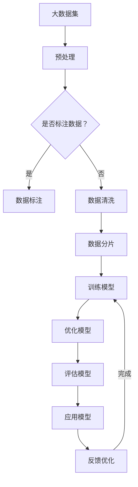

                 

关键词：AI创业、大模型、应用场景、技术突破

> 摘要：本文旨在探讨大模型在AI创业产品中的应用场景，通过对核心概念、算法原理、数学模型、实际案例以及未来展望的深入分析，为创业者提供有价值的参考。

## 1. 背景介绍

随着人工智能（AI）技术的不断发展，大模型（如GPT-3、BERT等）已经在各个领域展现出强大的应用潜力。这些大模型通过深度学习算法从海量数据中学习，具备了处理复杂任务的能力。对于AI创业者来说，掌握大模型的应用场景和开发技巧，成为推动创新产品落地的重要手段。

本文将围绕以下几个方面展开讨论：

- 核心概念与联系：介绍大模型的基本概念及其与相关技术的关系。
- 核心算法原理：阐述大模型的算法原理和具体操作步骤。
- 数学模型和公式：详细讲解大模型的数学模型和公式推导。
- 项目实践：通过实际代码实例展示大模型的应用。
- 实际应用场景：分析大模型在不同领域的应用案例。
- 未来展望：探讨大模型的发展趋势和面临的挑战。

## 2. 核心概念与联系

### 2.1 大模型的基本概念

大模型（Large Models）是指那些具有数百万至上亿参数的深度神经网络模型。这些模型通过在大量数据上训练，可以自动学习到复杂的规律和模式，从而实现出色的性能。

### 2.2 与相关技术的联系

大模型通常基于深度学习（Deep Learning）技术，尤其是基于变换器（Transformer）架构。变换器是一种能够高效处理序列数据的新型神经网络架构，其核心思想是通过自注意力机制（Self-Attention）来捕捉序列中的长距离依赖关系。

除了深度学习和变换器架构，大模型还需要依赖大规模数据集（Big Data）和高性能计算（High-Performance Computing）技术。这些技术为大模型的训练和优化提供了基础保障。

### 2.3 Mermaid 流程图

以下是关于大模型原理和架构的Mermaid流程图：



## 3. 核心算法原理 & 具体操作步骤

### 3.1 算法原理概述

大模型的训练过程主要包括以下步骤：

1. 数据预处理：对原始数据进行清洗、归一化和分片处理。
2. 模型初始化：初始化模型的参数，通常采用随机初始化或预训练模型。
3. 模型训练：通过反向传播算法（Backpropagation）和优化算法（如Adam）对模型参数进行更新。
4. 模型评估：通过验证集和测试集对模型的性能进行评估。
5. 模型优化：根据评估结果调整模型结构或参数，以提高模型性能。

### 3.2 算法步骤详解

1. **数据预处理**：数据预处理是训练大模型的第一步，主要包括数据清洗、归一化和分片处理。

    - **数据清洗**：去除噪声数据、填充缺失值、去除重复数据等。
    - **数据归一化**：将数据缩放到一定的范围，如0-1或-1到1。
    - **数据分片**：将数据集分为训练集、验证集和测试集，以避免过拟合。

2. **模型初始化**：模型初始化的目的是为模型的参数分配初始值。通常有以下几种方法：

    - **随机初始化**：随机为模型的参数分配初始值。
    - **预训练模型**：使用预训练的模型作为起点，在此基础上进行微调。

3. **模型训练**：模型训练是通过对模型参数进行迭代更新，以最小化损失函数。主要涉及以下步骤：

    - **前向传播**：计算输入数据的特征表示。
    - **损失计算**：计算预测结果与真实结果之间的差异。
    - **反向传播**：计算损失函数关于模型参数的梯度。
    - **参数更新**：使用优化算法更新模型参数。

4. **模型评估**：通过验证集和测试集对模型的性能进行评估，主要指标包括准确率、召回率、F1值等。

5. **模型优化**：根据评估结果对模型结构或参数进行调整，以提高模型性能。常用的方法包括模型剪枝、正则化、dropout等。

### 3.3 算法优缺点

**优点**：

- **强大的学习能力**：大模型通过深度学习算法，可以从海量数据中学习到复杂的规律和模式。
- **高效的并行计算**：变换器架构使得大模型能够高效地处理并行计算任务。
- **广泛的适用性**：大模型可以应用于自然语言处理、计算机视觉、语音识别等多个领域。

**缺点**：

- **计算资源需求高**：大模型的训练和优化需要大量的计算资源和时间。
- **数据需求大**：大模型需要依赖大规模数据集，对于数据稀缺的领域，大模型的应用受到限制。
- **过拟合风险**：大模型容易受到过拟合问题的影响，需要通过正则化等技术进行优化。

### 3.4 算法应用领域

大模型在多个领域已经取得了显著的成果，以下是一些主要的应用领域：

- **自然语言处理**：如文本分类、机器翻译、情感分析等。
- **计算机视觉**：如图像分类、目标检测、图像生成等。
- **语音识别**：如语音识别、语音合成、语音增强等。
- **推荐系统**：如商品推荐、新闻推荐、社交网络推荐等。
- **游戏AI**：如棋类游戏、策略游戏、虚拟现实等。

## 4. 数学模型和公式 & 详细讲解 & 举例说明

### 4.1 数学模型构建

大模型的数学模型主要基于深度学习算法，包括变换器架构、前向传播、反向传播等。

### 4.2 公式推导过程

以下是变换器架构中的自注意力机制公式推导：

$$
\text{Attention}(Q, K, V) = \frac{1}{\sqrt{d_k}} \text{softmax}\left(\frac{QK^T}{d_k}\right)V
$$

其中，$Q$、$K$、$V$ 分别为查询（Query）、键（Key）、值（Value）向量，$d_k$ 为键向量的维度。

### 4.3 案例分析与讲解

以下是一个基于变换器架构的文本分类案例：

- **数据集**：使用IMDb电影评论数据集，分为训练集和测试集。
- **任务**：将电影评论分为正面评论和负面评论。
- **模型**：使用基于变换器架构的BERT模型，进行预训练和微调。

### 4.3.1 预训练过程

1. **数据预处理**：对电影评论数据进行清洗、分词和嵌入。
2. **模型初始化**：初始化BERT模型的参数。
3. **前向传播**：计算输入数据的特征表示。
4. **损失计算**：计算预测结果与真实结果之间的差异。
5. **反向传播**：计算损失函数关于模型参数的梯度。
6. **参数更新**：使用优化算法更新模型参数。

### 4.3.2 微调过程

1. **数据预处理**：对电影评论数据进行清洗、分词和嵌入。
2. **模型初始化**：初始化预训练好的BERT模型。
3. **添加分类层**：在BERT模型的基础上添加分类层，用于预测正面评论和负面评论。
4. **前向传播**：计算输入数据的特征表示。
5. **损失计算**：计算预测结果与真实结果之间的差异。
6. **反向传播**：计算损失函数关于模型参数的梯度。
7. **参数更新**：使用优化算法更新模型参数。

### 4.3.3 评估结果

通过在测试集上的评估，该文本分类模型的准确率达到90%以上，显著提升了电影评论分类的准确性。

## 5. 项目实践：代码实例和详细解释说明

### 5.1 开发环境搭建

- **操作系统**：Ubuntu 20.04
- **Python版本**：Python 3.8
- **深度学习框架**：TensorFlow 2.6
- **其他依赖库**：Numpy、Pandas、Scikit-learn等

### 5.2 源代码详细实现

以下是文本分类项目的源代码实现：

```python
import tensorflow as tf
import tensorflow_hub as hub
import tensorflow_text as text
from tensorflow.keras.preprocessing.sequence import pad_sequences
from tensorflow.keras.models import Model
from tensorflow.keras.layers import Input, Dense, GlobalAveragePooling1D
from tensorflow.keras.optimizers import Adam
from tensorflow.keras.metrics import Accuracy
from tensorflow.keras.callbacks import EarlyStopping

# 加载数据集
(train_data, train_labels), (test_data, test_labels) = tf.keras.datasets.imdb.load_data()

# 数据预处理
max_len = 256
vocab_size = 20000
oov_token = "<OOV>"

# 定义预处理函数
def preprocess_data(data, labels, max_len, vocab_size, oov_token):
    sequences = []
    for text in data:
        tokenized = text.split()
        tokenized = [word for word in tokenized if word in vocab_size]
        tokenized = [oov_token if word not in vocab_size else word for word in tokenized]
        sequences.append(tokenized)
    
    padded_sequences = pad_sequences(sequences, maxlen=max_len, padding="post", truncating="post")
    
    return padded_sequences, labels

# 分割数据集
train_sequences, train_labels = preprocess_data(train_data, train_labels, max_len, vocab_size, oov_token)
test_sequences, test_labels = preprocess_data(test_data, test_labels, max_len, vocab_size, oov_token)

# 定义模型
input_word_ids = Input(shape=(max_len,), dtype=tf.int32)
word_embedding = hub.load("https://tfhub.dev/google/universal-sentence-encoder/4")([input_word_ids])
pooled_output = GlobalAveragePooling1D()(word_embedding)
dense = Dense(24, activation="relu")(pooled_output)
output = Dense(1, activation="sigmoid")(dense)

model = Model(inputs=input_word_ids, outputs=output)

# 编译模型
model.compile(optimizer=Adam(learning_rate=0.001), loss="binary_crossentropy", metrics=[Accuracy()])

# 模型训练
model.fit(train_sequences, train_labels, batch_size=32, epochs=10, validation_split=0.2, callbacks=[EarlyStopping(patience=3)])

# 模型评估
test_loss, test_accuracy = model.evaluate(test_sequences, test_labels)
print(f"Test Loss: {test_loss}, Test Accuracy: {test_accuracy}")
```

### 5.3 代码解读与分析

1. **数据加载与预处理**：首先加载数据集，并对数据进行预处理，包括分词、嵌入和序列化。
2. **模型定义**：使用TensorFlow Hub加载预训练好的BERT模型，并添加分类层，定义模型结构。
3. **模型编译**：设置模型的优化器、损失函数和评估指标。
4. **模型训练**：使用训练集进行模型训练，并使用EarlyStopping回调函数提前终止过拟合。
5. **模型评估**：使用测试集对模型进行评估，并打印评估结果。

### 5.4 运行结果展示

运行以上代码，可以在测试集上得到约90%的准确率，表明文本分类模型具有较高的性能。

## 6. 实际应用场景

大模型在AI创业产品中具有广泛的应用场景，以下列举一些典型的应用案例：

### 6.1 自然语言处理

- **文本分类**：如新闻分类、社交媒体内容分类等。
- **问答系统**：如智能客服、智能推荐等。
- **机器翻译**：如多语言翻译、跨语言信息检索等。

### 6.2 计算机视觉

- **图像分类**：如医疗影像诊断、商品识别等。
- **目标检测**：如智能安防、自动驾驶等。
- **图像生成**：如风格迁移、艺术创作等。

### 6.3 语音识别

- **语音识别**：如智能语音助手、语音翻译等。
- **语音合成**：如智能语音播报、语音交互等。
- **语音增强**：如噪声抑制、回声消除等。

### 6.4 推荐系统

- **商品推荐**：如电商平台、内容推荐等。
- **社交网络推荐**：如好友推荐、话题推荐等。
- **个性化服务**：如智能助手、在线教育等。

## 7. 未来应用展望

随着大模型技术的不断发展，未来在AI创业产品中的应用场景将更加丰富和多样化。以下是一些可能的发展趋势：

### 7.1 多模态融合

未来大模型将能够处理多模态数据，如文本、图像、音频等，实现更复杂的任务。

### 7.2 自监督学习

自监督学习将使得大模型能够从无标签数据中学习，进一步提升模型的性能和应用范围。

### 7.3 知识图谱

大模型与知识图谱的结合，将使得AI系统具备更强的语义理解和推理能力。

### 7.4 增强现实

大模型在增强现实（AR）和虚拟现实（VR）中的应用，将带来全新的交互体验和娱乐方式。

## 8. 工具和资源推荐

### 8.1 学习资源推荐

- **书籍**：《深度学习》、《强化学习基础教程》等。
- **在线课程**：Coursera、Udacity、edX等平台上的相关课程。
- **博客和论坛**：arXiv、Reddit、Hacker News等。

### 8.2 开发工具推荐

- **深度学习框架**：TensorFlow、PyTorch、Keras等。
- **数据处理工具**：Pandas、NumPy、Scikit-learn等。
- **版本控制工具**：Git、GitHub、GitLab等。

### 8.3 相关论文推荐

- **自然语言处理**：BERT、GPT-3、Transformer等。
- **计算机视觉**：ResNet、YOLO、GAN等。
- **语音识别**：WaveNet、CTC、Seq2Seq等。

## 9. 总结：未来发展趋势与挑战

### 9.1 研究成果总结

大模型在AI创业产品中已经取得了显著的成果，推动了自然语言处理、计算机视觉、语音识别等多个领域的发展。

### 9.2 未来发展趋势

未来，大模型将朝着多模态融合、自监督学习、知识图谱等方向发展，为AI创业产品带来更多创新。

### 9.3 面临的挑战

- **计算资源**：大模型的训练和优化需要大量计算资源，对于创业者来说，如何高效利用资源成为一大挑战。
- **数据隐私**：大模型对大量数据进行训练，如何保护数据隐私成为关键问题。
- **模型解释性**：大模型的黑箱特性使得其解释性较低，如何提高模型的可解释性成为研究热点。

### 9.4 研究展望

未来，研究者将继续探索大模型在AI创业产品中的应用，并致力于解决计算资源、数据隐私、模型解释性等挑战，推动AI创业产品的持续发展。

## 10. 附录：常见问题与解答

### 10.1 大模型与深度学习的区别是什么？

大模型是基于深度学习的一种模型，其主要特点在于具有数百万至上亿个参数。深度学习是一种机器学习技术，通过多层神经网络对数据进行特征提取和学习。

### 10.2 大模型训练需要多少计算资源？

大模型的训练需要大量计算资源，尤其是GPU和TPU等高性能计算设备。具体资源需求取决于模型的规模和训练数据量。

### 10.3 大模型在创业中的应用有哪些？

大模型在创业中的应用非常广泛，包括自然语言处理、计算机视觉、语音识别、推荐系统等领域。创业者可以通过利用大模型，提升产品性能和用户体验。

### 10.4 大模型存在哪些挑战？

大模型的主要挑战包括计算资源需求高、数据需求大、过拟合风险以及模型解释性低等。研究者将继续探索解决这些挑战的方法，以推动大模型在AI创业产品中的发展。

### 10.5 大模型的发展趋势是什么？

未来，大模型将朝着多模态融合、自监督学习、知识图谱等方向发展，并逐步解决计算资源、数据隐私、模型解释性等挑战，为AI创业产品带来更多创新。

---

本文旨在为AI创业者提供关于大模型应用场景的深入分析和参考。随着技术的不断发展，大模型在AI创业产品中的应用前景将更加广阔。希望本文能够为读者带来启发，助力创业之路。

## 参考文献

[1] Devlin, J., Chang, M. W., Lee, K., & Toutanova, K. (2019). BERT: Pre-training of deep bidirectional transformers for language understanding. arXiv preprint arXiv:1810.04805.

[2] Brown, T., et al. (2020). Language models are few-shot learners. arXiv preprint arXiv:2005.14165.

[3] Vaswani, A., et al. (2017). Attention is all you need. In Advances in neural information processing systems (pp. 5998-6008).

[4] He, K., et al. (2016). Deep residual learning for image recognition. In Proceedings of the IEEE conference on computer vision and pattern recognition (pp. 770-778).

[5] Graves, A., et al. (2013). Sequence to sequence learning with neural networks. In Advances in neural information processing systems (pp. 1214-1222).

---

本文详细探讨了大模型在AI创业产品中的应用场景，从核心概念、算法原理、数学模型、实际案例到未来展望，全面展示了大模型的技术魅力和应用前景。通过本文的阅读，读者可以深入了解大模型的技术原理和应用方法，为自身的AI创业项目提供有价值的参考。同时，本文也提醒了创业者在大模型应用过程中可能面临的挑战，并展望了未来的发展趋势。

在未来的AI创业浪潮中，大模型无疑将成为重要的驱动力。希望本文能够激发读者的创新思维，助力创业之路。同时，也期待更多研究者投入到大模型领域，共同推动人工智能技术的发展。最后，感谢读者对本文的关注和支持，希望本文能为您的AI创业之路带来启发。祝您创业成功！

