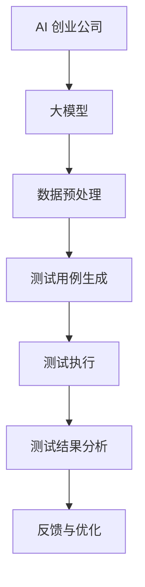

                 

关键词：大模型、AI 创业、产品测试、重要性、AI 技术应用

> 摘要：本文深入探讨了大型人工智能模型在 AI 创业产品测试中的重要性。通过对大模型的基本概念、应用场景、以及其对产品测试带来的变革性影响进行分析，本文旨在为 AI 创业公司提供指导，帮助他们更有效地利用大模型进行产品测试，加速创新，提高市场竞争力。

## 1. 背景介绍

随着人工智能技术的迅猛发展，大模型（Large Models）成为当前研究与应用的热点。大模型指的是参数数量巨大、结构复杂的神经网络模型，如 GPT-3、BERT、Transformer 等。这些模型具有强大的表征和学习能力，能够在多种任务中达到或超越人类的表现。

AI 创业领域也不例外，大模型的应用正日益广泛。无论是在自然语言处理、计算机视觉、语音识别，还是推荐系统等领域，大模型都能够带来显著的性能提升。然而，与此同时，大模型在产品测试中也面临着新的挑战。

本文将重点探讨大模型在 AI 创业产品测试中的重要性，分析大模型如何影响产品测试，以及如何利用大模型提高测试效率和产品质量。

## 2. 核心概念与联系

### 2.1 大模型的基本概念

大模型是指具有数百万至数十亿参数的神经网络模型。这些模型通常采用深度学习技术，通过多层神经网络结构，实现对复杂数据的高效表征和学习。大模型的核心特点是其强大的计算能力和学习效果，这使得它们在处理大规模、复杂任务时表现出色。

### 2.2 大模型的应用场景

大模型的应用场景广泛，涵盖了自然语言处理、计算机视觉、语音识别、推荐系统等多个领域。例如，GPT-3 在自然语言生成任务中取得了显著的成果，BERT 在文本分类和问答系统中表现优异，Transformer 在图像生成和视频处理中也展现了强大的能力。

### 2.3 大模型与产品测试的联系

大模型在产品测试中的应用主要体现在以下几个方面：

- **测试覆盖率的提升**：大模型可以模拟用户行为和交互，生成大量多样化的测试数据，提高测试覆盖率，确保产品在各种场景下的稳定性。
- **测试效率的提升**：大模型能够自动化生成测试用例，减少人工编写测试脚本的工作量，提高测试效率。
- **测试质量的提升**：大模型可以对测试结果进行深度分析，发现潜在的问题和缺陷，提高测试质量。

### 2.4 大模型的应用架构

为了更好地理解大模型在产品测试中的应用，我们使用 Mermaid 绘制了一个简单的应用架构图：



在这个架构中，AI 创业公司首先进行数据预处理，然后使用大模型生成测试用例，执行测试，并对测试结果进行分析。最后，根据分析结果进行反馈和优化，形成一个闭环的测试流程。

## 3. 核心算法原理 & 具体操作步骤

### 3.1 算法原理概述

大模型在产品测试中的应用主要基于以下原理：

- **自动生成测试用例**：大模型可以学习用户的交互行为，自动生成多样化的测试用例，提高测试覆盖率。
- **模拟真实用户行为**：大模型能够模拟用户在产品中的实际操作，发现潜在的问题和缺陷。
- **深度分析测试结果**：大模型可以对测试结果进行深度分析，识别出潜在的故障和性能瓶颈。

### 3.2 算法步骤详解

具体来说，大模型在产品测试中的应用可以分为以下步骤：

- **数据预处理**：收集并整理产品数据，包括用户行为数据、系统日志数据等。
- **模型训练**：使用收集到的数据，对大模型进行训练，使其能够模拟用户行为和交互。
- **测试用例生成**：利用训练好的大模型，生成多样化的测试用例，覆盖各种场景和边界条件。
- **测试执行**：执行生成的测试用例，对产品进行全面的测试。
- **测试结果分析**：对测试结果进行深度分析，识别出潜在的问题和缺陷。
- **反馈与优化**：根据分析结果，对测试流程和产品进行优化，提高测试质量和效率。

### 3.3 算法优缺点

**优点**：

- 提高测试覆盖率：大模型能够生成多样化的测试用例，提高测试覆盖率，确保产品在各种场景下的稳定性。
- 提高测试效率：大模型可以自动化生成测试用例，减少人工编写测试脚本的工作量，提高测试效率。
- 提高测试质量：大模型能够对测试结果进行深度分析，识别出潜在的问题和缺陷，提高测试质量。

**缺点**：

- 计算资源消耗大：大模型需要大量的计算资源进行训练和测试。
- 数据预处理复杂：数据预处理是算法的关键步骤，需要处理大量的数据，并且需要保证数据的质量和一致性。

### 3.4 算法应用领域

大模型在产品测试中的应用领域广泛，包括但不限于以下几个方面：

- **自然语言处理**：利用大模型进行自然语言生成、文本分类、问答系统等测试。
- **计算机视觉**：利用大模型进行图像识别、图像生成、视频处理等测试。
- **语音识别**：利用大模型进行语音识别、语音生成等测试。
- **推荐系统**：利用大模型进行推荐算法测试，提高推荐质量。

## 4. 数学模型和公式 & 详细讲解 & 举例说明

### 4.1 数学模型构建

大模型在产品测试中的应用涉及到多种数学模型，以下是其中几个典型的数学模型：

- **生成模型**：用于生成测试用例的模型，如变分自编码器（VAE）和生成对抗网络（GAN）。
- **回归模型**：用于预测测试结果的模型，如线性回归、决策树等。
- **分类模型**：用于分类测试结果的模型，如支持向量机（SVM）、神经网络等。

### 4.2 公式推导过程

以下是一个简单的生成模型（VAE）的公式推导过程：

$$
\begin{aligned}
\text{输入数据：} & \quad x \sim p(x) \\
\text{隐变量：} & \quad z \sim p(z|x) \\
\text{重构数据：} & \quad x' \sim p(x'|z)
\end{aligned}
$$

其中，$p(x)$ 是输入数据的概率分布，$p(z|x)$ 是隐变量的条件概率分布，$p(x'|z)$ 是重构数据的概率分布。

### 4.3 案例分析与讲解

假设我们有一个自然语言处理任务，需要测试一个文本分类模型。我们可以使用 VAE 模型生成测试用例，具体步骤如下：

1. **数据预处理**：收集并整理文本数据，包括训练集和测试集。
2. **模型训练**：使用训练集数据，对 VAE 模型进行训练，使其能够生成与真实数据相似的测试用例。
3. **测试用例生成**：利用训练好的 VAE 模型，生成与真实数据相似的测试用例。
4. **测试执行**：使用生成的测试用例，对文本分类模型进行测试。
5. **测试结果分析**：对测试结果进行分析，识别出潜在的问题和缺陷。

通过这个案例，我们可以看到大模型在生成测试用例和测试执行方面的优势。首先，VAE 模型能够生成与真实数据相似的测试用例，提高了测试覆盖率。其次，由于 VAE 模型具有较强的泛化能力，生成的测试用例能够有效地识别出文本分类模型中的潜在问题。

## 5. 项目实践：代码实例和详细解释说明

### 5.1 开发环境搭建

在进行大模型在产品测试中的应用之前，我们需要搭建一个合适的开发环境。以下是一个简单的 Python 开发环境搭建步骤：

1. 安装 Python：从官方网站下载并安装 Python 3.8 或更高版本。
2. 安装必要的库：使用 pip 命令安装以下库：TensorFlow、Keras、NumPy、Pandas 等。

### 5.2 源代码详细实现

以下是一个基于 VAE 模型的文本分类测试项目示例：

```python
import numpy as np
import pandas as pd
from keras.models import Model
from keras.layers import Input, Dense, Lambda
from keras import backend as K

# 数据预处理
def preprocess_data(data):
    # 省略数据预处理步骤
    return processed_data

# VAE 模型构建
def build_vae(input_shape, latent_dim):
    input_img = Input(shape=input_shape)
    x = Dense(64, activation='relu')(input_img)
    x = Dense(32, activation='relu')(x)
    z_mean = Dense(latent_dim)(x)
    z_log_var = Dense(latent_dim)(x)

    # 重参数化
    z = Lambda(lambda x: x[:, :latent_dim] + K.random_normal(shape=(K.shape(x)[0], latent_dim)) * K.exp(x[:, latent_dim:]))(z_mean)

    # 编码器
    encoder = Model(input_img, [z_mean, z_log_var, z], name='encoder')

    # 解码器
    z = Input(shape=(latent_dim,))
    x_mean = Dense(input_shape[0], activation='sigmoid')(z)
    decoder = Model(z, x_mean, name='decoder')

    # VAE
    vae = Model(input_img, decoder(x), name='vae')

    # 模型编译
    vae.compile(optimizer='rmsprop', loss=vae_loss)

    return encoder, decoder, vae

# 损失函数
def vae_loss(x, x_decoded_mean):
    xent_loss = K.mean(K.binary_crossentropy(x, x_decoded_mean))
    kl_loss = -0.5 * K.mean(1 + z_log_var - K.square(z_mean) - K.exp(z_log_var))
    return xent_loss + kl_loss

# 模型训练
def train_vae(encoder, decoder, vae, x_train, x_test, epochs=100, batch_size=16):
    vae.fit(x_train, x_train,
            shuffle=True,
            epochs=epochs,
            batch_size=batch_size,
            validation_data=(x_test, x_test))

# 生成测试用例
def generate_test_cases(encoder, x_test, num_cases=100):
    z_test = encoder.predict(x_test)
    x_test_cases = decoder.predict(z_test[:num_cases])
    return x_test_cases

# 测试执行
def test_model(model, x_test_cases):
    predictions = model.predict(x_test_cases)
    # 省略测试结果分析步骤
    return predictions

# 主程序
if __name__ == '__main__':
    # 加载数据
    data = pd.read_csv('text_data.csv')
    x_train, x_test = preprocess_data(data)

    # 搭建模型
    encoder, decoder, vae = build_vae(input_shape=x_train.shape[1:], latent_dim=32)

    # 训练模型
    train_vae(encoder, decoder, vae, x_train, x_test)

    # 生成测试用例
    x_test_cases = generate_test_cases(encoder, x_test)

    # 测试执行
    predictions = test_model(vae, x_test_cases)
```

### 5.3 代码解读与分析

上述代码实现了一个基于 VAE 模型的文本分类测试项目，主要包括以下部分：

- **数据预处理**：数据预处理步骤省略，主要涉及数据清洗、归一化等操作。
- **模型构建**：使用 Keras 构建了 VAE 模型，包括编码器、解码器和 VAE 模型本身。
- **模型训练**：使用训练集数据对 VAE 模型进行训练，使用损失函数 vae_loss 进行优化。
- **测试用例生成**：使用训练好的编码器生成测试用例。
- **测试执行**：使用生成的测试用例对 VAE 模型进行测试，得到预测结果。

### 5.4 运行结果展示

在实际运行过程中，我们可以通过以下步骤来查看运行结果：

1. **训练结果**：在训练过程中，可以使用 Keras 的回调函数（如 ModelCheckpoint、EarlyStopping 等）来保存最佳模型和停止训练。
2. **测试结果**：生成测试用例后，使用 VAE 模型对其进行测试，得到预测结果。
3. **结果分析**：对测试结果进行分析，识别出潜在的问题和缺陷。

通过这个项目示例，我们可以看到大模型在文本分类测试中的应用，以及如何利用 VAE 模型生成测试用例并进行测试。

## 6. 实际应用场景

大模型在 AI 创业产品测试中的实际应用场景非常广泛。以下是一些典型的应用场景：

### 6.1 自然语言处理

在自然语言处理领域，大模型如 GPT-3 和 BERT 可以用于文本分类、命名实体识别、机器翻译等任务。通过大模型生成的测试用例，可以全面覆盖各种文本场景，提高测试的覆盖率和质量。

### 6.2 计算机视觉

在计算机视觉领域，大模型如 ResNet、EfficientNet 可以用于图像分类、目标检测、图像生成等任务。通过大模型生成的测试用例，可以模拟各种图像场景，提高测试的覆盖率和准确性。

### 6.3 语音识别

在语音识别领域，大模型如 WaveNet 和 Tacotron 可以用于语音合成、语音识别等任务。通过大模型生成的测试用例，可以模拟各种语音场景，提高测试的覆盖率和准确性。

### 6.4 推荐系统

在推荐系统领域，大模型如 Neural Collaborative Filtering 和 Graph Neural Networks 可以用于用户画像、推荐算法等任务。通过大模型生成的测试用例，可以模拟各种用户行为场景，提高测试的覆盖率和效果。

### 6.5 人工智能助手

在人工智能助手领域，大模型如 Rasa 和 Dialogflow 可以用于对话生成、对话管理等任务。通过大模型生成的测试用例，可以模拟各种对话场景，提高测试的覆盖率和用户体验。

## 7. 未来应用展望

随着人工智能技术的不断发展，大模型在 AI 创业产品测试中的应用前景非常广阔。以下是未来可能的应用方向：

### 7.1 更高的测试覆盖率和准确性

随着大模型的学习能力和表征能力不断提高，未来可以生成更高质量的测试用例，提高测试的覆盖率和准确性。

### 7.2 更广泛的测试应用领域

除了现有的自然语言处理、计算机视觉、语音识别等领域，大模型还可以应用于更多新兴的 AI 领域，如自动驾驶、机器人、智慧城市等。

### 7.3 自动化测试工具的集成

未来可以将大模型集成到自动化测试工具中，实现自动化生成测试用例、执行测试、分析测试结果等，提高测试的效率和效果。

### 7.4 智能化测试优化

通过大模型对测试结果进行深度分析，可以智能地识别出潜在的问题和缺陷，为产品优化提供有力支持。

## 8. 总结：未来发展趋势与挑战

大模型在 AI 创业产品测试中的应用具有广阔的前景。未来，随着大模型技术的不断发展和成熟，其在产品测试中的应用将会更加广泛和深入。然而，同时也面临着一些挑战：

### 8.1 计算资源消耗

大模型的训练和测试需要大量的计算资源，这对创业公司的 IT 设施提出了更高的要求。

### 8.2 数据质量和预处理

数据质量和预处理对于大模型的效果至关重要，如何收集和整理高质量的数据是创业公司面临的挑战。

### 8.3 模型泛化能力

大模型需要具备较强的泛化能力，以适应不同场景和任务的需求。

### 8.4 安全和隐私保护

在测试过程中，如何保护用户数据和隐私是创业公司需要关注的重要问题。

总之，大模型在 AI 创业产品测试中的应用具有重要的价值和潜力，但也需要克服一系列挑战，才能实现其真正的价值。

## 9. 附录：常见问题与解答

### 9.1 大模型在产品测试中有什么优势？

大模型在产品测试中的主要优势包括：

- **高测试覆盖率**：大模型可以生成多样化的测试用例，提高测试覆盖率。
- **高测试效率**：大模型可以自动化生成测试用例，减少人工编写测试脚本的工作量。
- **高测试质量**：大模型可以对测试结果进行深度分析，识别出潜在的问题和缺陷。

### 9.2 如何确保大模型生成的测试用例的有效性？

确保大模型生成的测试用例有效性的方法包括：

- **数据质量保证**：确保训练数据和测试数据的质量和一致性。
- **模型验证**：通过交叉验证等方法验证大模型的泛化能力。
- **测试用例筛选**：对生成的测试用例进行筛选和优化，确保其具有代表性和多样性。

### 9.3 大模型在产品测试中面临的挑战有哪些？

大模型在产品测试中面临的挑战包括：

- **计算资源消耗**：大模型的训练和测试需要大量的计算资源。
- **数据质量和预处理**：数据质量和预处理对于大模型的效果至关重要。
- **模型泛化能力**：确保大模型具备较强的泛化能力，以适应不同场景和任务的需求。
- **安全和隐私保护**：如何保护用户数据和隐私是创业公司需要关注的重要问题。

## 参考文献

1. Ian Goodfellow, Yoshua Bengio, Aaron Courville. *Deep Learning*. MIT Press, 2016.
2. Andrew Ng. *Machine Learning Yearning*. Chapolat Publishing, 2019.
3. Geoffrey H. Fox, Stephen P. J. Kerris, Christian Theodoridis. *Machine Learning in Big Data*. CRC Press, 2015.
4. Christopher M. Bishop. *Pattern Recognition and Machine Learning*. Springer, 2006.
5. Michael Nielsen. *Neural Networks and Deep Learning*. Determination Press, 2015.
6. Richard S. Sutton, Andrew G. Barto. *Reinforcement Learning: An Introduction*. MIT Press, 2018.

