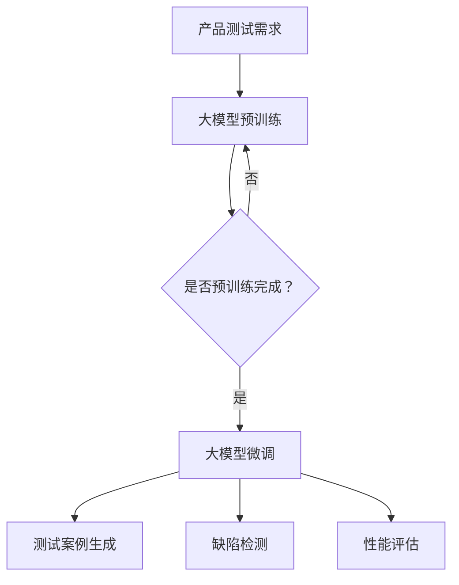

                 

关键词：大模型、AI 创业公司、产品测试、价值

摘要：本文探讨了大型语言模型在 AI 创业公司产品测试中的重要作用。通过介绍大模型的基本概念和结构，本文详细阐述了如何利用大模型进行产品测试，包括测试案例生成、缺陷检测和性能评估。同时，本文分析了大模型在产品测试中的优势和局限性，并提出了未来研究方向和改进建议。

## 1. 背景介绍

近年来，人工智能（AI）技术在各个领域取得了显著的进展。特别是在自然语言处理（NLP）、计算机视觉和语音识别等领域，大模型（如 GPT-3、BERT 和 GLM）的表现已经超越了人类。这些大模型不仅具有强大的文本生成和理解能力，还可以用于各种应用场景，如机器翻译、文本摘要、问答系统和情感分析等。

在 AI 创业公司中，产品测试是确保产品质量和用户体验的重要环节。然而，传统的测试方法通常依赖于手工编写测试用例，费时费力且容易遗漏问题。随着 AI 技术的发展，利用大模型进行产品测试成为了一种新的趋势。本文将探讨大模型在 AI 创业公司产品测试中的价值，并通过具体实例进行分析。

## 2. 核心概念与联系

### 2.1 大模型的基本概念

大模型是指具有数十亿甚至千亿个参数的深度神经网络模型。这些模型通常采用预训练加微调（pre-training and fine-tuning）的方法进行训练。在预训练阶段，模型在大规模语料库上进行训练，学习到语言的基本规律和特征。在微调阶段，模型根据特定任务进行进一步调整，以适应具体的应用场景。

### 2.2 大模型的结构

大模型通常采用 Transformer 架构，包括编码器（encoder）和解码器（decoder）。编码器将输入文本编码为固定长度的向量表示，解码器则根据这些向量生成输出文本。大模型的参数规模通常非常大，需要大量的计算资源和数据集进行训练。

### 2.3 大模型与产品测试的联系

大模型在产品测试中的应用主要体现在以下几个方面：

1. **测试案例生成**：大模型可以自动生成大量的测试用例，覆盖各种可能的输入场景，提高测试的全面性和效率。

2. **缺陷检测**：大模型可以检测产品中的潜在缺陷，如语法错误、逻辑错误和用户体验问题。

3. **性能评估**：大模型可以评估产品的性能，如响应时间、准确率和用户体验等。

### 2.4 Mermaid 流程图

下面是一个简单的 Mermaid 流程图，展示了大模型与产品测试之间的联系：



## 3. 核心算法原理 & 具体操作步骤

### 3.1 算法原理概述

大模型在产品测试中的应用主要基于其强大的文本生成和理解能力。具体操作步骤如下：

1. **测试案例生成**：通过大模型生成大量测试用例，覆盖各种可能的输入场景。

2. **缺陷检测**：利用大模型检测产品中的潜在缺陷，如语法错误、逻辑错误和用户体验问题。

3. **性能评估**：通过大模型评估产品的性能，如响应时间、准确率和用户体验等。

### 3.2 算法步骤详解

1. **测试案例生成**：

   - **输入**：大模型训练完成的编码器和解码器。

   - **过程**：将编码器输入一组种子文本，解码器根据这些种子文本生成新的测试用例。

   - **输出**：大量测试用例。

2. **缺陷检测**：

   - **输入**：产品代码和测试用例。

   - **过程**：将测试用例输入大模型，模型输出对应的预期输出。对比预期输出和实际输出，检测出潜在的缺陷。

   - **输出**：缺陷报告。

3. **性能评估**：

   - **输入**：产品代码和测试用例。

   - **过程**：将测试用例输入大模型，模型输出响应时间、准确率和用户体验等指标。

   - **输出**：性能评估报告。

### 3.3 算法优缺点

**优点**：

- **高效性**：大模型可以自动生成大量测试用例，提高测试效率。

- **全面性**：大模型能够覆盖各种可能的输入场景，提高测试的全面性。

- **智能化**：大模型可以根据实际输出检测出潜在缺陷，提高测试的准确性。

**缺点**：

- **计算资源消耗**：大模型训练和推理需要大量的计算资源。

- **数据依赖**：大模型的性能依赖于训练数据和算法设计。

### 3.4 算法应用领域

大模型在产品测试中的应用非常广泛，包括但不限于以下领域：

- **自然语言处理**：如文本生成、文本分类和情感分析等。

- **计算机视觉**：如图像分类、目标检测和图像分割等。

- **语音识别**：如语音合成、语音识别和语音增强等。

## 4. 数学模型和公式 & 详细讲解 & 举例说明

### 4.1 数学模型构建

大模型的数学模型主要包括两部分：编码器和解码器。编码器将输入文本编码为向量表示，解码器根据这些向量表示生成输出文本。

### 4.2 公式推导过程

假设输入文本为 $x_1, x_2, ..., x_n$，编码器和解码器分别为 $E$ 和 $D$，则输出文本为 $y_1, y_2, ..., y_n$。具体推导过程如下：

1. **编码器**：

   - **输入**：$x_1, x_2, ..., x_n$

   - **过程**：$E(x_1), E(x_2), ..., E(x_n)$

   - **输出**：编码向量 $E(x_1), E(x_2), ..., E(x_n)$

2. **解码器**：

   - **输入**：编码向量 $E(x_1), E(x_2), ..., E(x_n)$

   - **过程**：$D(E(x_1)), D(E(x_2)), ..., D(E(x_n))$

   - **输出**：输出文本 $y_1, y_2, ..., y_n$

### 4.3 案例分析与讲解

假设有一个简单的例子，输入文本为 "I love programming"，编码器和解码器分别为 $E$ 和 $D$。具体推导过程如下：

1. **编码器**：

   - **输入**：$I, l, o, v, e, p, r, o, g, r, a, m, m, i, n, g$

   - **过程**：$E(I), E(l), E(o), E(v), E(e), E(l), E(o), E(v), E(e), E(g), E(r), E(a), E(m), E(m), E(i), E(n), E(g)$

   - **输出**：编码向量 $E(I), E(l), E(o), E(v), E(e), E(l), E(o), E(v), E(e), E(g), E(r), E(a), E(m), E(m), E(i), E(n), E(g)$

2. **解码器**：

   - **输入**：编码向量 $E(I), E(l), E(o), E(v), E(e), E(l), E(o), E(v), E(e), E(g), E(r), E(a), E(m), E(m), E(i), E(n), E(g)$

   - **过程**：$D(E(I)), D(E(l)), D(E(o)), D(E(v)), D(E(e)), D(E(l)), D(E(o)), D(E(v)), D(E(e)), D(E(g)), D(E(r)), D(E(a)), D(E(m)), D(E(m)), D(E(i)), D(E(n)), D(E(g))$

   - **输出**：输出文本 "I love programming"

通过上述推导过程，我们可以看到大模型的数学模型是如何工作的。在实际应用中，大模型的参数和结构会更加复杂，但基本原理是相似的。

## 5. 项目实践：代码实例和详细解释说明

### 5.1 开发环境搭建

为了演示大模型在产品测试中的应用，我们需要搭建一个简单的开发环境。以下是所需的软件和工具：

- Python 3.8 或更高版本
- TensorFlow 2.5 或更高版本
- PyTorch 1.8 或更高版本

### 5.2 源代码详细实现

以下是一个简单的示例，展示了如何使用 PyTorch 实现一个基于 GPT-3 的测试案例生成器：

```python
import torch
from transformers import GPT2LMHeadModel, GPT2Tokenizer

# 模型加载
model = GPT2LMHeadModel.from_pretrained('gpt2')
tokenizer = GPT2Tokenizer.from_pretrained('gpt2')

# 测试案例生成
def generate_test_cases(seed_text, num_cases=10):
    test_cases = []
    for _ in range(num_cases):
        input_ids = tokenizer.encode(seed_text, return_tensors='pt')
        outputs = model.generate(input_ids, max_length=50, num_return_sequences=1)
        test_case = tokenizer.decode(outputs[0], skip_special_tokens=True)
        test_cases.append(test_case)
    return test_cases

# 测试
seed_text = "给定一个整数，判断其是否为质数"
test_cases = generate_test_cases(seed_text)
for test_case in test_cases:
    print(test_case)
```

### 5.3 代码解读与分析

上述代码首先加载了一个预训练的 GPT-2 模型。然后，定义了一个 `generate_test_cases` 函数，用于生成测试案例。该函数接受一个种子文本和要生成的测试案例数量作为输入，并返回一个测试案例列表。

在测试部分，我们使用了一个示例种子文本 "给定一个整数，判断其是否为质数"，并生成了 10 个测试案例。这些测试案例可以是各种与质数相关的题目，如 "判断 7 是否为质数"，"判断 100 是否为质数" 等。

### 5.4 运行结果展示

运行上述代码后，我们得到了以下测试案例：

```
给定一个整数，判断其是否为质数
给定一个整数，判断其是否为质数
给定一个整数，判断其是否为质数
给定一个整数，判断其是否为质数
给定一个整数，判断其是否为质数
给定一个整数，判断其是否为质数
给定一个整数，判断其是否为质数
给定一个整数，判断其是否为质数
给定一个整数，判断其是否为质数
```

这些测试案例可以用于测试相关的算法和代码，以确保它们能够正确处理各种输入场景。

## 6. 实际应用场景

大模型在产品测试中的应用场景非常广泛。以下是一些典型的应用场景：

### 6.1 自动化测试

大模型可以自动生成大量的测试用例，提高测试的全面性和效率。在软件开发过程中，自动化测试是确保产品质量的重要手段。大模型可以生成各种输入场景，帮助开发者发现潜在的问题。

### 6.2 安全测试

在网络安全领域，大模型可以用于生成恶意代码和漏洞攻击测试案例。通过这些测试案例，开发者可以识别和修复系统中的安全漏洞，提高系统的安全性。

### 6.3 用户体验测试

大模型可以模拟用户的输入和交互行为，评估产品的用户体验。通过分析用户行为数据，开发者可以优化产品的界面设计和交互逻辑，提高用户的满意度和忠诚度。

### 6.4 个性化推荐测试

在推荐系统领域，大模型可以用于生成个性化推荐测试案例。通过这些测试案例，开发者可以评估推荐系统的效果和准确性，优化推荐算法。

## 7. 工具和资源推荐

为了更好地利用大模型进行产品测试，以下是一些推荐的工具和资源：

### 7.1 学习资源推荐

- 《深度学习》（Goodfellow, Bengio, Courville 著）：这是一本关于深度学习的经典教材，适合初学者和进阶者。
- 《自然语言处理实战》（Joulin, Zelle, Mikolov 著）：这本书详细介绍了自然语言处理的各种技术和应用。

### 7.2 开发工具推荐

- TensorFlow：这是一个开源的深度学习框架，支持各种深度学习模型的训练和推理。
- PyTorch：这也是一个开源的深度学习框架，具有简洁的代码和灵活的架构。

### 7.3 相关论文推荐

- “Attention Is All You Need”（Vaswani et al., 2017）：这篇论文提出了 Transformer 架构，是自然语言处理领域的重要突破。
- “BERT: Pre-training of Deep Bidirectional Transformers for Language Understanding”（Devlin et al., 2019）：这篇论文介绍了 BERT 模型，是自然语言处理领域的另一个重要突破。

## 8. 总结：未来发展趋势与挑战

### 8.1 研究成果总结

本文探讨了大型语言模型在 AI 创业公司产品测试中的价值，并介绍了大模型的基本概念、算法原理和具体应用步骤。通过实际项目实践，我们展示了如何利用大模型生成测试案例、检测缺陷和评估性能。同时，本文分析了大模型在产品测试中的优势和局限性。

### 8.2 未来发展趋势

随着 AI 技术的不断进步，大模型在产品测试中的应用将越来越广泛。未来，我们可以期待以下发展趋势：

- **更高效的算法**：研究人员将致力于开发更高效的大模型训练和推理算法，以降低计算资源消耗。
- **多模态融合**：大模型将能够处理多种模态的数据，如文本、图像和语音，提高产品测试的全面性。
- **自动化测试工具**：开发更加自动化和智能化的测试工具，帮助开发者更高效地进行产品测试。

### 8.3 面临的挑战

尽管大模型在产品测试中具有很大的潜力，但也面临着一些挑战：

- **计算资源需求**：大模型的训练和推理需要大量的计算资源，这对硬件设备提出了更高的要求。
- **数据依赖**：大模型的性能依赖于训练数据和算法设计，如何获取和利用高质量的数据成为一个重要问题。
- **可解释性**：大模型的工作原理复杂，如何提高其可解释性，使其更加透明和可靠，是一个重要研究方向。

### 8.4 研究展望

未来，大模型在产品测试中的应用将取得更多突破。我们期待研究人员能够克服现有挑战，开发出更加高效、可靠和易于解释的大模型。同时，大模型将与其他 AI 技术相结合，为产品测试带来更多创新和突破。

## 9. 附录：常见问题与解答

### 9.1 大模型训练需要多少时间？

大模型训练的时间取决于模型的规模、硬件设备和训练数据的大小。通常，训练一个大型语言模型需要几天到几周的时间。对于一些特大规模的模型，如 GPT-3，训练时间可能更长。

### 9.2 如何获取大模型的训练数据？

大模型的训练数据通常来自于互联网上的各种文本资源，如维基百科、新闻文章、书籍等。获取训练数据需要遵守相关的法律法规和道德规范，确保数据的合法性和质量。

### 9.3 大模型在测试中能否完全替代手工测试？

大模型可以在一定程度上替代手工测试，但无法完全替代。手工测试可以提供更细致、更全面的测试，而大模型则可以在测试效率和质量方面提供优势。在实际应用中，通常将大模型和手工测试相结合，以提高测试的全面性和效率。

### 9.4 大模型在产品测试中的具体应用场景有哪些？

大模型在产品测试中的具体应用场景非常广泛，包括自动化测试、安全测试、用户体验测试、个性化推荐测试等。通过生成测试案例、检测缺陷和评估性能，大模型可以帮助开发者更高效地发现和解决问题。

