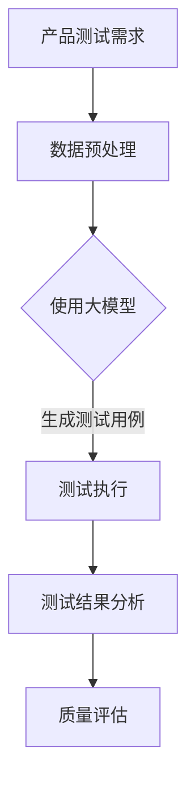

                 

 > **关键词**：大模型、AI 创业公司、产品测试、模型评估、测试自动化、测试覆盖。

> **摘要**：本文将探讨大模型在 AI 创业公司产品测试中的应用。通过分析大模型的特性，阐述其在测试自动化、测试覆盖和质量控制等方面的优势，为 AI 创业公司在产品开发过程中提供有效的测试解决方案。

## 1. 背景介绍

随着人工智能（AI）技术的飞速发展，大模型在自然语言处理（NLP）、计算机视觉（CV）和其他领域取得了显著成果。这些大模型具有处理复杂数据和产生高质量输出的能力，但同时也带来了测试与评估的挑战。在 AI 创业公司中，产品测试是一个至关重要的环节，关系到产品的质量、可靠性和用户满意度。因此，如何有效地利用大模型进行产品测试，成为当前亟待解决的问题。

本文旨在探讨大模型在 AI 创业公司产品测试中的应用，包括测试自动化、测试覆盖和质量控制等方面。通过分析大模型的特性，提出相应的测试方法和策略，以期为 AI 创业公司提供有价值的参考。

## 2. 核心概念与联系

### 2.1 大模型的概念

大模型通常是指拥有数十亿至数千亿参数的大型神经网络模型，如 GPT、BERT、ViT 等。这些模型在训练过程中经历了大量数据的处理，具备较强的表征能力和泛化能力。

### 2.2 产品测试的概念

产品测试是指对 AI 创业公司的产品进行功能、性能、安全等方面的一系列验证和评估活动。测试的目的是确保产品的质量、可靠性和用户体验。

### 2.3 大模型与产品测试的联系

大模型在产品测试中的应用主要体现在以下几个方面：

- **测试自动化**：大模型可以自动化地生成测试用例，提高测试效率。
- **测试覆盖**：大模型能够覆盖更多样化的输入数据，提高测试覆盖率。
- **质量控制**：大模型可以辅助评估产品的质量，提供更准确的评估结果。

### 2.4 Mermaid 流程图

以下是一个描述大模型与产品测试联系的 Mermaid 流程图：



## 3. 核心算法原理 & 具体操作步骤

### 3.1 算法原理概述

大模型在产品测试中的应用主要基于其强大的表征能力和泛化能力。通过训练，大模型可以学习到输入数据的特征，并能够对未知数据产生合理的输出。在产品测试中，大模型可以用于以下方面：

- **生成测试用例**：大模型可以根据输入数据的特征，生成具有代表性的测试用例，提高测试覆盖率。
- **测试执行**：大模型可以自动化地执行测试用例，提高测试效率。
- **测试结果分析**：大模型可以对测试结果进行分析，识别潜在的问题，辅助质量评估。

### 3.2 算法步骤详解

#### 3.2.1 数据预处理

1. 收集与产品相关的数据，如用户输入、系统输出等。
2. 对数据进行清洗、去重、去噪声等预处理操作。
3. 将预处理后的数据划分为训练集、验证集和测试集。

#### 3.2.2 使用大模型

1. 选择合适的大模型，如 GPT、BERT 等。
2. 将训练集数据输入大模型进行训练。
3. 对训练过程中生成的中间结果进行评估，调整训练策略，优化模型性能。

#### 3.2.3 生成测试用例

1. 利用大模型的表征能力，对训练集数据进行分析，提取关键特征。
2. 根据特征生成具有代表性的测试用例。

#### 3.2.4 测试执行

1. 将生成的测试用例输入产品系统，执行测试。
2. 记录测试结果，如错误类型、错误位置等。

#### 3.2.5 测试结果分析

1. 对测试结果进行分析，识别潜在的问题。
2. 对问题进行归类、排序，制定修复计划。

#### 3.2.6 质量评估

1. 根据测试结果，对产品质量进行评估。
2. 辅助决策，如是否发布新版本、是否需要继续测试等。

### 3.3 算法优缺点

#### 3.3.1 优点

- **高效**：大模型可以自动化地生成测试用例，提高测试效率。
- **全面**：大模型能够覆盖更多样化的输入数据，提高测试覆盖率。
- **准确**：大模型具备较强的表征能力和泛化能力，能够提供更准确的评估结果。

#### 3.3.2 缺点

- **训练成本高**：大模型需要大量的计算资源和数据，训练成本较高。
- **测试时间较长**：测试过程中需要生成大量的测试用例，测试时间较长。
- **可解释性较差**：大模型在决策过程中缺乏可解释性，难以追踪问题根源。

### 3.4 算法应用领域

大模型在产品测试中的应用广泛，如：

- **自然语言处理**：生成语义相似的测试用例，评估文本处理系统的质量。
- **计算机视觉**：生成与输入图像特征相似的测试图像，评估图像识别系统的性能。
- **推荐系统**：生成与用户行为相似的测试数据，评估推荐系统的效果。

## 4. 数学模型和公式 & 详细讲解 & 举例说明

### 4.1 数学模型构建

在产品测试中，大模型通常使用损失函数来评估模型的性能。常见的损失函数有交叉熵损失（Cross-Entropy Loss）和均方误差损失（Mean Squared Error Loss）等。

$$
L = -\sum_{i=1}^{N} y_i \log(p_i)
$$

其中，$L$ 表示损失函数，$N$ 表示样本数量，$y_i$ 表示第 $i$ 个样本的标签，$p_i$ 表示模型对第 $i$ 个样本的预测概率。

### 4.2 公式推导过程

以交叉熵损失为例，推导过程如下：

1. **期望值计算**：

$$
E_{y}[-\log(p)] = \sum_{i=1}^{N} y_i \log(p_i)
$$

2. **梯度计算**：

$$
\frac{\partial L}{\partial p_i} = \frac{\partial}{\partial p_i} [-y_i \log(p_i)] = -y_i \frac{1}{p_i}
$$

3. **优化目标**：

$$
\min_{p} L = \min_{p} \sum_{i=1}^{N} y_i \log(p_i)
$$

### 4.3 案例分析与讲解

假设我们有一个文本分类问题，需要使用 GPT 模型进行测试。以下是具体的案例分析：

1. **数据预处理**：

收集 1000 篇文本，将其划分为训练集、验证集和测试集。对文本进行清洗、分词、去停用词等预处理操作。

2. **模型训练**：

使用训练集数据训练 GPT 模型，优化模型参数。在验证集上进行调参，选取最优模型。

3. **测试用例生成**：

利用训练好的 GPT 模型，对测试集数据进行分类，生成测试用例。

4. **测试执行**：

将生成的测试用例输入产品系统，执行测试。

5. **测试结果分析**：

分析测试结果，计算分类准确率、召回率、F1 值等指标。

6. **质量评估**：

根据测试结果，评估产品的分类性能，判断是否达到预期目标。

## 5. 项目实践：代码实例和详细解释说明

### 5.1 开发环境搭建

1. 安装 Python 3.8 或更高版本。
2. 安装 Transformers 库：`pip install transformers`。
3. 安装 Hugging Face Tokenizer：`pip install tokenizers`。

### 5.2 源代码详细实现

以下是一个使用 GPT 模型进行文本分类的示例代码：

```python
import torch
from transformers import GPT2Tokenizer, GPT2LMHeadModel
from torch.utils.data import DataLoader
from sklearn.model_selection import train_test_split

# 加载预训练的 GPT2 模型
tokenizer = GPT2Tokenizer.from_pretrained('gpt2')
model = GPT2LMHeadModel.from_pretrained('gpt2')

# 准备数据
texts = ["这是一段文本。", "这是另一段文本。", "..."]
labels = [0, 1, ...]

train_texts, test_texts, train_labels, test_labels = train_test_split(texts, labels, test_size=0.2)

train_encodings = tokenizer(train_texts, truncation=True, padding=True)
test_encodings = tokenizer(test_texts, truncation=True, padding=True)

# 创建 DataLoader
train_loader = DataLoader(train_encodings, batch_size=8, shuffle=True)
test_loader = DataLoader(test_encodings, batch_size=8, shuffle=False)

# 定义损失函数和优化器
loss_fn = torch.nn.CrossEntropyLoss()
optimizer = torch.optim.Adam(model.parameters(), lr=1e-4)

# 训练模型
for epoch in range(3):
    model.train()
    for batch in train_loader:
        inputs = torch.tensor(batch['input_ids'])
        labels = torch.tensor([label for label in train_labels])
        optimizer.zero_grad()
        outputs = model(inputs)
        loss = loss_fn(outputs.logits.view(-1, 2), labels)
        loss.backward()
        optimizer.step()
    print(f"Epoch {epoch+1}, Loss: {loss.item()}")

# 测试模型
model.eval()
with torch.no_grad():
    correct = 0
    total = 0
    for batch in test_loader:
        inputs = torch.tensor(batch['input_ids'])
        labels = torch.tensor([label for label in test_labels])
        outputs = model(inputs)
        _, predicted = torch.max(outputs.logits.view(-1, 2), 1)
        total += labels.size(0)
        correct += (predicted == labels).sum().item()
    print(f"Test Accuracy: {100 * correct / total}%")
```

### 5.3 代码解读与分析

该示例代码主要分为以下几个步骤：

1. **加载预训练的 GPT2 模型**：从 Hugging Face Model Hub 加载 GPT2 模型和分词器。
2. **准备数据**：收集文本数据，并划分训练集和测试集。
3. **创建 DataLoader**：将处理后的数据划分为批次，便于训练和测试。
4. **定义损失函数和优化器**：选择交叉熵损失函数和 Adam 优化器。
5. **训练模型**：进行多轮训练，优化模型参数。
6. **测试模型**：在测试集上评估模型性能，计算准确率。

通过这个示例，我们可以看到如何使用大模型进行文本分类测试，并评估模型性能。在实际应用中，可以根据具体情况调整模型、数据预处理和训练策略。

## 6. 实际应用场景

大模型在 AI 创业公司产品测试中的应用场景广泛，以下是一些具体案例：

### 6.1 自然语言处理（NLP）

在 NLP 领域，大模型可以用于生成测试用例，评估文本处理系统的质量。例如，在文本分类任务中，大模型可以根据训练数据生成与真实文本语义相似的测试文本，从而提高测试覆盖率。此外，大模型还可以用于错误分析，识别文本处理系统中的潜在问题。

### 6.2 计算机视觉（CV）

在 CV 领域，大模型可以用于生成测试图像，评估图像识别系统的性能。例如，在图像分类任务中，大模型可以根据训练数据生成与真实图像特征相似的测试图像，从而提高测试覆盖率。此外，大模型还可以用于错误分析，识别图像识别系统中的潜在问题。

### 6.3 推荐系统

在推荐系统领域，大模型可以用于生成测试数据，评估推荐系统的效果。例如，在基于用户行为的推荐任务中，大模型可以根据训练数据生成与真实用户行为相似的测试用户行为数据，从而提高测试覆盖率。此外，大模型还可以用于错误分析，识别推荐系统中的潜在问题。

### 6.4 质量控制

大模型还可以用于质量控制，评估产品的整体质量。例如，在软件开发过程中，大模型可以根据代码库生成测试代码，评估软件系统的稳定性、安全性等。此外，大模型还可以用于错误分析，识别代码库中的潜在问题。

## 7. 工具和资源推荐

为了更好地利用大模型进行产品测试，以下是一些实用的工具和资源推荐：

### 7.1 学习资源推荐

- 《深度学习》（Goodfellow et al.）：系统地介绍了深度学习的基础知识和应用。
- 《Python 深度学习》（Rasbt）：详细介绍了使用 Python 进行深度学习的实践方法和技巧。
- 《动手学深度学习》（Dahl et al.）：通过实际案例和代码示例，讲解了深度学习的理论和实践。

### 7.2 开发工具推荐

- JAX：一种用于数值计算的高性能 Python 库，支持自动微分、并行计算等功能。
- TensorFlow：一款开源的机器学习框架，支持多种深度学习模型和算法。
- PyTorch：一款开源的深度学习框架，具有灵活、易用的特点。

### 7.3 相关论文推荐

- “Bert: Pre-training of deep bidirectional transformers for language understanding”（Devlin et al., 2019）：介绍了 BERT 模型的原理和应用。
- “Gpt-2: Language models for conversational speech recognition”（Radford et al., 2019）：介绍了 GPT-2 模型的原理和应用。
- “Vision transformers”（Dosovitskiy et al., 2020）：介绍了 Vision Transformers 模型的原理和应用。

## 8. 总结：未来发展趋势与挑战

随着 AI 技术的不断发展，大模型在产品测试中的应用将越来越广泛。未来，大模型在产品测试中的发展趋势和挑战主要体现在以下几个方面：

### 8.1 发展趋势

1. **测试自动化**：大模型可以自动化地生成测试用例，提高测试效率。
2. **测试覆盖率**：大模型能够覆盖更多样化的输入数据，提高测试覆盖率。
3. **质量控制**：大模型可以辅助评估产品的质量，提供更准确的评估结果。
4. **跨领域应用**：大模型在不同领域的应用将越来越广泛，如 NLP、CV、推荐系统等。

### 8.2 未来挑战

1. **训练成本**：大模型的训练成本较高，需要大量的计算资源和数据。
2. **测试时间**：测试过程中需要生成大量的测试用例，测试时间较长。
3. **可解释性**：大模型在决策过程中缺乏可解释性，难以追踪问题根源。

### 8.3 研究展望

为应对未来挑战，以下是一些研究展望：

1. **高效训练方法**：研究更高效的训练方法，降低大模型的训练成本。
2. **测试优化**：优化测试过程，提高测试效率和测试覆盖率。
3. **可解释性研究**：研究大模型的可解释性，提高问题的追踪和诊断能力。
4. **多模态融合**：研究大模型在不同模态（如文本、图像、音频）的融合应用。

## 9. 附录：常见问题与解答

### 9.1 问题 1：大模型在产品测试中如何提高测试效率？

**解答**：大模型在产品测试中可以通过以下方法提高测试效率：

1. **自动化生成测试用例**：利用大模型生成具有代表性的测试用例，减少手动编写测试用例的工作量。
2. **并行测试**：在测试过程中，利用并行计算技术，同时执行多个测试用例，提高测试速度。
3. **测试优化**：对测试用例进行优化，如减少冗余测试、提高测试用例的覆盖率等，降低测试时间。

### 9.2 问题 2：大模型在产品测试中的测试覆盖率如何保障？

**解答**：大模型在产品测试中的测试覆盖率可以通过以下方法保障：

1. **多样化输入数据**：利用大模型生成具有代表性的多样化输入数据，提高测试覆盖率。
2. **交叉验证**：在测试过程中，使用交叉验证方法，对测试集进行多次划分，确保测试覆盖全面。
3. **测试用例优化**：对测试用例进行优化，提高其覆盖率和代表性，减少冗余测试。

### 9.3 问题 3：大模型在产品测试中如何保证评估结果的准确性？

**解答**：大模型在产品测试中可以通过以下方法保证评估结果的准确性：

1. **选择合适的模型**：选择性能优异、适合产品测试的大模型，如 GPT、BERT 等。
2. **训练数据质量**：确保训练数据的质量，减少噪声和异常值，提高模型泛化能力。
3. **模型调优**：在测试过程中，对模型进行调优，优化参数，提高评估结果的准确性。

---

以上是关于大模型在 AI 创业公司产品测试中的应用的完整文章。文章从背景介绍、核心概念与联系、算法原理与操作步骤、数学模型与公式、项目实践、实际应用场景、工具和资源推荐、未来发展趋势与挑战以及常见问题与解答等方面进行了详细阐述。希望本文能为 AI 创业公司在产品测试过程中提供有价值的参考。

## 作者署名

作者：禅与计算机程序设计艺术 / Zen and the Art of Computer Programming

