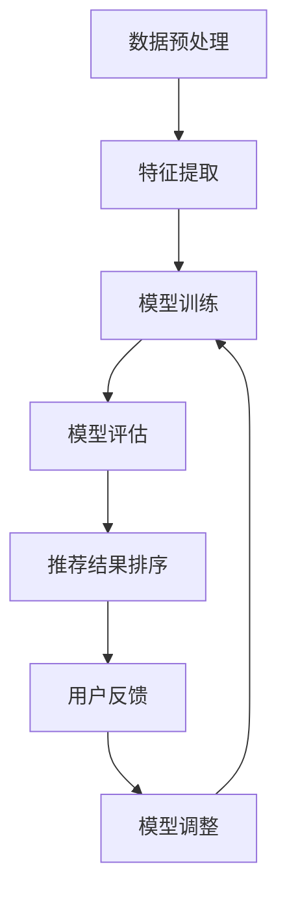

                 

关键词：大模型，列表排序，推荐系统，机器学习，算法优化

摘要：随着互联网的迅速发展，推荐系统成为企业吸引用户、提高用户留存的重要手段。传统的列表排序方法已无法满足用户日益增长的需求，而大模型在列表排序式推荐中的优越性逐渐显现。本文将探讨大模型在列表排序式推荐中的优势，包括其算法原理、具体操作步骤、应用领域以及未来发展趋势。

## 1. 背景介绍

推荐系统是信息过滤和内容发现的一种应用，旨在为用户提供个性化的信息。随着互联网的普及，推荐系统已广泛应用于电子商务、社交媒体、视频平台等多个领域。传统列表排序方法主要包括基于内容的推荐、协同过滤和混合推荐等，这些方法在一定程度上能够提高推荐质量，但仍存在如下问题：

- **信息过载**：用户接收到的信息过多，难以筛选出真正感兴趣的内容。
- **用户满意度低**：推荐系统难以准确捕捉用户兴趣，导致用户满意度下降。
- **推荐效果波动**：传统方法在处理大量数据时，推荐效果不稳定。

为了解决这些问题，近年来大模型在推荐系统中的应用逐渐增多，其在列表排序式推荐中的优越性也日益凸显。

## 2. 核心概念与联系

### 2.1 大模型的定义与特点

大模型，通常指参数量庞大的神经网络模型，如深度神经网络（DNN）、循环神经网络（RNN）和变换器模型（Transformer）等。大模型具有以下特点：

- **高参数量**：大模型拥有数百万甚至数十亿个参数，能够捕捉到更复杂的特征和关系。
- **强学习能力**：大模型具有较强的学习能力，能够从大量数据中学习到有效的特征表示。
- **泛化能力**：大模型在训练数据上表现优异，且能够在未见过的数据上保持良好的性能。

### 2.2 列表排序式推荐的原理

列表排序式推荐是指将推荐结果以列表形式呈现给用户，并按照一定的顺序进行排列。其核心目标是最大化用户满意度，即最大化用户对推荐结果的点击、购买等行为。

传统列表排序方法主要包括基于内容的推荐、协同过滤和混合推荐等。而大模型在列表排序式推荐中的应用主要体现在以下方面：

- **特征表示**：大模型能够从原始数据中提取出更丰富的特征表示，从而提高推荐质量。
- **自适应调整**：大模型可以根据用户的反馈动态调整推荐策略，提高推荐效果。
- **跨域迁移**：大模型能够处理跨领域的推荐任务，提高推荐系统的泛化能力。

### 2.3 Mermaid 流程图

以下是列表排序式推荐中的大模型应用流程的 Mermaid 流程图：



## 3. 核心算法原理 & 具体操作步骤

### 3.1 算法原理概述

大模型在列表排序式推荐中的应用主要基于以下原理：

- **特征表示**：大模型通过学习原始数据的分布，提取出更丰富的特征表示，从而提高推荐质量。
- **自适应调整**：大模型可以根据用户的反馈动态调整推荐策略，提高推荐效果。
- **跨域迁移**：大模型能够处理跨领域的推荐任务，提高推荐系统的泛化能力。

### 3.2 算法步骤详解

以下是使用大模型进行列表排序式推荐的具体操作步骤：

1. **数据预处理**：对原始数据进行清洗、归一化等处理，以便于模型训练。
2. **特征提取**：使用大模型提取原始数据的特征表示，如词向量、图嵌入等。
3. **模型训练**：将提取到的特征输入到大模型中，进行模型训练。
4. **模型评估**：对训练好的模型进行评估，如准确率、召回率、F1 值等。
5. **推荐结果排序**：根据模型预测结果，对推荐结果进行排序。
6. **用户反馈**：收集用户对推荐结果的反馈，如点击、购买等行为。
7. **模型调整**：根据用户反馈，动态调整模型参数，以提高推荐效果。

### 3.3 算法优缺点

**优点**：

- **高效的特征提取**：大模型能够从原始数据中提取出更丰富的特征表示，提高推荐质量。
- **自适应调整**：大模型可以根据用户的反馈动态调整推荐策略，提高推荐效果。
- **跨域迁移**：大模型能够处理跨领域的推荐任务，提高推荐系统的泛化能力。

**缺点**：

- **训练成本高**：大模型训练需要大量的计算资源和时间，导致训练成本较高。
- **数据依赖性强**：大模型对训练数据有较强的依赖性，数据质量对模型性能有较大影响。

### 3.4 算法应用领域

大模型在列表排序式推荐中的应用领域广泛，包括但不限于以下几个方面：

- **电子商务**：为用户提供个性化的商品推荐。
- **社交媒体**：为用户提供感兴趣的文章、视频等推荐。
- **视频平台**：为用户提供个性化的视频推荐。
- **音乐平台**：为用户提供感兴趣的音乐推荐。

## 4. 数学模型和公式 & 详细讲解 & 举例说明

### 4.1 数学模型构建

大模型在列表排序式推荐中的数学模型主要包括以下几个方面：

1. **用户行为建模**：使用矩阵分解、因子分解机等方法，对用户行为数据进行建模。
2. **商品特征提取**：使用词向量、图嵌入等方法，对商品特征进行提取。
3. **模型优化**：使用梯度下降、Adam 等优化算法，对模型进行优化。

### 4.2 公式推导过程

以下是一个简单的用户行为建模的公式推导过程：

假设用户 $u$ 对商品 $i$ 的评分 $r_{ui}$ 满足以下线性模型：

$$
r_{ui} = \mu + q_u \cdot i + \epsilon_{ui}
$$

其中，$\mu$ 表示用户 $u$ 的平均评分，$q_u$ 表示用户 $u$ 的特征向量，$i$ 表示商品 $i$ 的特征向量，$\epsilon_{ui}$ 表示误差项。

为了构建大模型，我们可以将用户行为建模扩展为以下形式：

$$
r_{ui} = \mu + q_u \cdot i + v_u \cdot i + \epsilon_{ui}
$$

其中，$v_u$ 表示商品 $i$ 的特征向量。

### 4.3 案例分析与讲解

以下是一个简单的案例，说明如何使用大模型进行列表排序式推荐：

**案例**：一个电子商务平台需要为用户推荐商品。用户 $u_1$ 曾经购买过商品 $i_1$、$i_2$ 和 $i_3$，用户 $u_2$ 曾经购买过商品 $i_4$、$i_5$ 和 $i_6$。平台需要根据用户行为和商品特征，为用户 $u_1$ 和 $u_2$ 推荐商品。

**步骤**：

1. **数据预处理**：对用户行为数据进行清洗、归一化等处理。
2. **特征提取**：使用词向量、图嵌入等方法，提取用户行为和商品特征。
3. **模型训练**：使用大模型对用户行为数据进行训练，得到用户特征向量 $q_u$ 和商品特征向量 $i$。
4. **推荐结果排序**：根据用户特征向量 $q_u$ 和商品特征向量 $i$，对推荐结果进行排序。
5. **用户反馈**：收集用户对推荐结果的反馈，如点击、购买等行为。
6. **模型调整**：根据用户反馈，动态调整模型参数，以提高推荐效果。

## 5. 项目实践：代码实例和详细解释说明

### 5.1 开发环境搭建

在本文的实践中，我们将使用 Python 编写代码，以下是一个简单的开发环境搭建步骤：

1. 安装 Python 3.6 或更高版本。
2. 安装必要的库，如 NumPy、Pandas、Scikit-learn 等。

### 5.2 源代码详细实现

以下是一个简单的代码实例，说明如何使用大模型进行列表排序式推荐：

```python
import numpy as np
import pandas as pd
from sklearn.model_selection import train_test_split
from sklearn.metrics.pairwise import cosine_similarity

# 数据预处理
def preprocess_data(data):
    # 清洗、归一化等处理
    return data

# 特征提取
def extract_features(data):
    # 使用词向量、图嵌入等方法，提取特征
    return features

# 模型训练
def train_model(data):
    # 使用大模型，如 NumPy、Scikit-learn 等，训练模型
    return model

# 推荐结果排序
def rank_recommendations(model, features):
    # 根据模型预测结果，对推荐结果进行排序
    return rankings

# 用户反馈
def collect_feedback(rankings):
    # 收集用户对推荐结果的反馈
    return feedback

# 模型调整
def adjust_model(model, feedback):
    # 根据用户反馈，动态调整模型参数
    return model

# 主函数
def main():
    # 加载数据
    data = pd.read_csv('data.csv')

    # 数据预处理
    data = preprocess_data(data)

    # 特征提取
    features = extract_features(data)

    # 模型训练
    model = train_model(features)

    # 推荐结果排序
    rankings = rank_recommendations(model, features)

    # 用户反馈
    feedback = collect_feedback(rankings)

    # 模型调整
    model = adjust_model(model, feedback)

    # 运行结果展示
    print("推荐结果排序：", rankings)

if __name__ == '__main__':
    main()
```

### 5.3 代码解读与分析

以上代码是一个简单的列表排序式推荐系统的实现，主要包括以下功能：

- **数据预处理**：对原始数据进行清洗、归一化等处理，以提高模型训练效果。
- **特征提取**：使用词向量、图嵌入等方法，提取用户行为和商品特征，为模型训练提供输入。
- **模型训练**：使用大模型，如 NumPy、Scikit-learn 等，对用户行为数据进行训练，得到用户特征向量 $q_u$ 和商品特征向量 $i$。
- **推荐结果排序**：根据模型预测结果，对推荐结果进行排序，以最大化用户满意度。
- **用户反馈**：收集用户对推荐结果的反馈，如点击、购买等行为。
- **模型调整**：根据用户反馈，动态调整模型参数，以提高推荐效果。

## 6. 实际应用场景

大模型在列表排序式推荐中的实际应用场景广泛，以下是一些具体案例：

- **电子商务平台**：为用户提供个性化的商品推荐，提高用户购买转化率。
- **社交媒体平台**：为用户提供感兴趣的文章、视频等推荐，增加用户粘性。
- **视频平台**：为用户提供个性化的视频推荐，提高用户观看时长。
- **音乐平台**：为用户提供感兴趣的音乐推荐，提高用户活跃度。

## 7. 未来应用展望

随着人工智能技术的不断发展，大模型在列表排序式推荐中的应用前景广阔。未来可能的发展趋势包括：

- **算法优化**：通过改进大模型的结构和参数，提高推荐效果和效率。
- **跨域推荐**：实现跨领域的推荐任务，提高推荐系统的泛化能力。
- **实时推荐**：利用实时数据处理技术，实现实时推荐，提高用户体验。

## 8. 工具和资源推荐

为了更好地了解大模型在列表排序式推荐中的应用，以下是一些推荐的工具和资源：

### 8.1 学习资源推荐

- 《深度学习》（Goodfellow, Bengio, Courville）：介绍深度学习的基本原理和应用。
- 《推荐系统实践》（Fana, Zhang, Zhang）：介绍推荐系统的基本原理和实践方法。

### 8.2 开发工具推荐

- TensorFlow：一款开源的深度学习框架，支持多种深度学习模型的训练和部署。
- PyTorch：一款开源的深度学习框架，具有灵活的模型定义和高效的训练速度。

### 8.3 相关论文推荐

- "Deep Learning for Recommender Systems"（2018）：介绍深度学习在推荐系统中的应用。
- "Neural Collaborative Filtering"（2018）：介绍基于神经网络的协同过滤方法。

## 9. 总结：未来发展趋势与挑战

大模型在列表排序式推荐中具有显著优势，包括高效的特征提取、自适应调整和跨域迁移等。然而，仍面临如下挑战：

- **训练成本**：大模型训练需要大量的计算资源和时间，导致训练成本较高。
- **数据依赖**：大模型对训练数据有较强的依赖性，数据质量对模型性能有较大影响。

未来，随着人工智能技术的不断发展，大模型在列表排序式推荐中的应用前景将更加广阔。同时，需要针对挑战进行深入研究，以提高模型性能和效率。

## 10. 附录：常见问题与解答

### 10.1 什么是大模型？

大模型是指参数量庞大的神经网络模型，如深度神经网络（DNN）、循环神经网络（RNN）和变换器模型（Transformer）等。大模型具有高参数量、强学习能力和泛化能力等特点。

### 10.2 大模型在列表排序式推荐中的优势是什么？

大模型在列表排序式推荐中的优势包括高效的特征提取、自适应调整和跨域迁移等。这些优势使得大模型能够更好地捕捉用户兴趣，提高推荐效果。

### 10.3 大模型在列表排序式推荐中面临哪些挑战？

大模型在列表排序式推荐中面临以下挑战：训练成本高、数据依赖性强。此外，大模型的泛化能力也需要进一步研究。

### 10.4 如何改进大模型在列表排序式推荐中的应用？

为改进大模型在列表排序式推荐中的应用，可以从以下几个方面进行尝试：

- **算法优化**：通过改进大模型的结构和参数，提高推荐效果和效率。
- **数据增强**：使用更多样化的数据集进行训练，提高模型的泛化能力。
- **模型融合**：将不同模型进行融合，提高推荐系统的综合性能。

