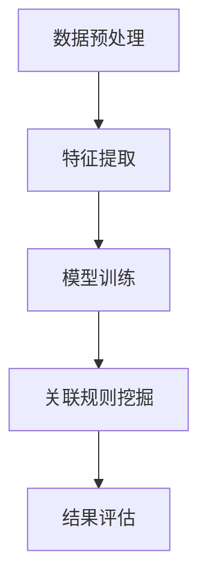
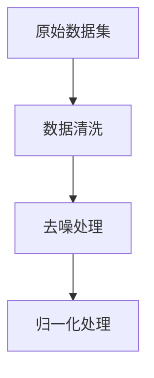
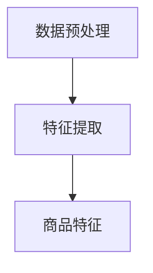
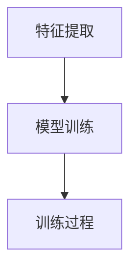
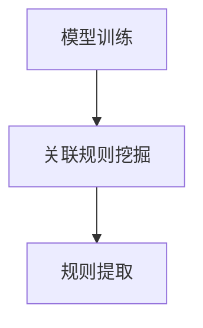
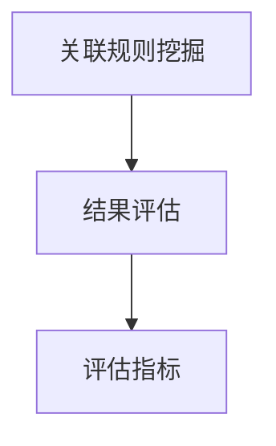

                 

关键词：大模型、商品关联规则挖掘、数据挖掘、机器学习、推荐系统

摘要：本文将探讨如何利用大模型进行商品关联规则挖掘，从而提升推荐系统的准确性。文章首先介绍了商品关联规则挖掘的基本概念和重要性，随后深入剖析了基于大模型的商品关联规则挖掘的原理和具体实现步骤，并列举了相关的数学模型和公式。通过实际项目实践和运行结果展示，本文展示了大模型在商品关联规则挖掘中的实际应用效果。最后，文章对未来应用场景进行了展望，并提出了相关的研究挑战和展望。

## 1. 背景介绍

在当今信息化社会，数据挖掘和机器学习技术已广泛应用于各个领域，尤其是在商业领域中，通过对海量数据进行分析和挖掘，可以为企业提供宝贵的商业洞察，从而提升业务效率和竞争力。商品关联规则挖掘作为一种重要的数据挖掘技术，通过对商品之间的关联关系进行分析，可以帮助企业更好地了解消费者行为，优化产品推荐策略，提升用户满意度。

商品关联规则挖掘的基本思想是通过挖掘商品之间的关联关系，找出满足特定条件的频繁商品集，进而推导出商品之间的关联规则。这些规则可以用来指导企业的营销策略，如交叉销售、捆绑销售等，从而提高销售额。

### 大模型的概念和重要性

大模型是指具有海量参数和复杂结构的机器学习模型，如深度神经网络、生成对抗网络等。大模型在处理大规模数据和高维度特征时具有显著优势，可以提升模型的准确性和鲁棒性。

在商品关联规则挖掘中，大模型的应用具有重要意义。一方面，大模型可以处理海量商品数据，挖掘出更多潜在的关联关系；另一方面，大模型可以利用其强大的表达能力，提取商品的高维特征，从而提高关联规则的挖掘质量和效率。

## 2. 核心概念与联系

### 商品关联规则挖掘的基本概念

商品关联规则挖掘主要包括以下几个基本概念：

- **支持度（Support）**：一个关联规则在所有交易记录中出现的频率。
- **置信度（Confidence）**：如果一个交易记录中出现了前件集合，那么它同时也出现后件集合的概率。
- **提升度（Lift）**：表示后件在出现前件的情况下出现的概率与后件在所有交易记录中出现的概率之比。

### 大模型与商品关联规则挖掘的关系

大模型与商品关联规则挖掘之间的联系主要体现在以下几个方面：

- **特征提取**：大模型可以通过学习大量商品数据，自动提取商品的高维特征，为商品关联规则挖掘提供丰富的输入。
- **概率估计**：大模型可以利用其强大的表达能力，对商品之间的关联关系进行概率估计，从而推导出高质量的关联规则。
- **优化目标**：大模型可以通过调整模型参数，优化关联规则挖掘过程，提高规则挖掘的效率和准确性。

### 大模型在商品关联规则挖掘中的架构

为了实现大模型在商品关联规则挖掘中的有效应用，我们需要设计一个合理的架构。以下是一个基本的大模型在商品关联规则挖掘中的架构：

1. **数据预处理**：对原始商品数据集进行清洗、去噪和归一化处理，为后续的特征提取和模型训练做好准备。
2. **特征提取**：利用大模型自动提取商品的高维特征，为关联规则挖掘提供输入。
3. **模型训练**：通过训练大模型，学习商品之间的关联关系，同时优化模型参数。
4. **关联规则挖掘**：利用大模型对商品数据进行关联规则挖掘，提取高质量的关联规则。
5. **结果评估**：对挖掘出的关联规则进行评估，筛选出具有商业价值的规则。

### Mermaid 流程图

以下是商品关联规则挖掘中，大模型应用架构的 Mermaid 流程图：



## 3. 核心算法原理 & 具体操作步骤

### 3.1 算法原理概述

大模型在商品关联规则挖掘中的核心算法主要包括以下几个步骤：

1. **特征提取**：利用大模型自动提取商品的高维特征，为关联规则挖掘提供输入。
2. **模型训练**：通过训练大模型，学习商品之间的关联关系，同时优化模型参数。
3. **关联规则挖掘**：利用大模型对商品数据进行关联规则挖掘，提取高质量的关联规则。
4. **结果评估**：对挖掘出的关联规则进行评估，筛选出具有商业价值的规则。

### 3.2 算法步骤详解

#### 步骤 1：数据预处理

数据预处理是商品关联规则挖掘的基础。我们需要对原始商品数据集进行清洗、去噪和归一化处理，以消除数据中的噪声和异常值，提高后续特征提取和模型训练的质量。



#### 步骤 2：特征提取

特征提取是商品关联规则挖掘的关键。利用大模型，我们可以自动提取商品的高维特征。这些特征包括商品的价格、销售量、品牌、类别等。



#### 步骤 3：模型训练

在特征提取完成后，我们需要利用大模型进行训练，学习商品之间的关联关系。这里我们可以使用深度神经网络、生成对抗网络等大模型进行训练。



#### 步骤 4：关联规则挖掘

在模型训练完成后，我们可以利用大模型对商品数据进行关联规则挖掘，提取高质量的关联规则。这些规则可以用来指导企业的营销策略。



#### 步骤 5：结果评估

最后，我们需要对挖掘出的关联规则进行评估，筛选出具有商业价值的规则。评估指标包括支持度、置信度和提升度等。



### 3.3 算法优缺点

#### 优点

- **强大的特征提取能力**：大模型可以通过学习大量商品数据，自动提取商品的高维特征，为关联规则挖掘提供丰富的输入。
- **高效的关联规则挖掘**：大模型可以利用其强大的表达能力，对商品之间的关联关系进行高效地概率估计，从而提高关联规则的挖掘质量和效率。
- **灵活的模型选择**：大模型包括多种类型，如深度神经网络、生成对抗网络等，可以根据具体应用场景选择合适的模型。

#### 缺点

- **计算资源消耗大**：大模型通常需要大量的计算资源进行训练，对硬件设备要求较高。
- **模型解释性不足**：大模型的内部结构复杂，难以对模型的决策过程进行解释，这在某些应用场景中可能成为问题。

### 3.4 算法应用领域

大模型在商品关联规则挖掘中的应用非常广泛，主要包括以下几个方面：

- **推荐系统**：利用大模型进行商品关联规则挖掘，可以为推荐系统提供丰富的关联关系，提高推荐准确性。
- **市场营销**：通过挖掘商品之间的关联关系，企业可以制定更有针对性的营销策略，提升销售额。
- **供应链管理**：利用大模型对商品关联关系进行分析，可以帮助企业优化供应链管理，降低成本。

## 4. 数学模型和公式 & 详细讲解 & 举例说明

### 4.1 数学模型构建

在商品关联规则挖掘中，我们通常使用支持度-置信度模型（Support-Confidence Model）来评估关联规则的质量。该模型基于以下两个核心指标：

- **支持度（Support）**：一个关联规则在所有交易记录中出现的频率，计算公式为：
  $$ Support(A \rightarrow B) = \frac{|T \cap (A \cup B)|}{|T|} $$
  其中，$A$ 和 $B$ 分别表示前件集合和后件集合，$T$ 表示所有交易记录的集合。

- **置信度（Confidence）**：如果一个交易记录中出现了前件集合，那么它同时也出现后件集合的概率，计算公式为：
  $$ Confidence(A \rightarrow B) = \frac{|T \cap (A \cup B)|}{|T \cap A|} $$

### 4.2 公式推导过程

#### 支持度公式推导

假设 $A$ 和 $B$ 分别表示前件集合和后件集合，$T$ 表示所有交易记录的集合。我们可以将支持度公式分解为以下几部分：

1. $|T|$：表示所有交易记录的数量。
2. $|T \cap (A \cup B)|$：表示同时包含前件集合和后件集合的交易记录的数量。
3. $\frac{|T|}{|T \cap (A \cup B)|}$：表示交易记录中同时包含前件集合和后件集合的比例。

因此，支持度公式可以表示为：
$$ Support(A \rightarrow B) = \frac{|T \cap (A \cup B)|}{|T|} $$

#### 置信度公式推导

同样地，我们可以将置信度公式分解为以下几部分：

1. $|T \cap (A \cup B)|$：表示同时包含前件集合和后件集合的交易记录的数量。
2. $|T \cap A|$：表示包含前件集合的交易记录的数量。
3. $\frac{|T \cap (A \cup B)|}{|T \cap A|}$：表示包含前件集合的交易记录中同时包含后件集合的比例。

因此，置信度公式可以表示为：
$$ Confidence(A \rightarrow B) = \frac{|T \cap (A \cup B)|}{|T \cap A|} $$

### 4.3 案例分析与讲解

假设有一个包含 1000 条交易记录的数据集，其中前件集合 $A$ 包含商品 A 和 B，后件集合 $B$ 包含商品 B 和 C。我们需要计算该关联规则的支持度和置信度。

#### 支持度计算

根据支持度公式，我们需要计算以下两部分：

1. $|T|$：交易记录的数量，为 1000。
2. $|T \cap (A \cup B)|$：同时包含前件集合和后件集合的交易记录的数量，假设为 200。

因此，支持度为：
$$ Support(A \rightarrow B) = \frac{|T \cap (A \cup B)|}{|T|} = \frac{200}{1000} = 0.2 $$

#### 置信度计算

根据置信度公式，我们需要计算以下两部分：

1. $|T \cap (A \cup B)|$：同时包含前件集合和后件集合的交易记录的数量，为 200。
2. $|T \cap A|$：包含前件集合的交易记录的数量，假设为 100。

因此，置信度为：
$$ Confidence(A \rightarrow B) = \frac{|T \cap (A \cup B)|}{|T \cap A|} = \frac{200}{100} = 0.2 $$

根据支持度和置信度，我们可以判断该关联规则的质量。在本例中，支持度和置信度均为 0.2，表明该关联规则较为普通。在实际应用中，我们通常会设定一个阈值，筛选出支持度和置信度均高于阈值的关联规则，以指导企业的营销策略。

## 5. 项目实践：代码实例和详细解释说明

在本节中，我们将通过一个实际项目实践来展示如何利用大模型进行商品关联规则挖掘。我们将使用 Python 语言和 TensorFlow 深度学习框架来实现这个项目。

### 5.1 开发环境搭建

为了实现商品关联规则挖掘项目，我们需要安装以下开发环境和库：

1. Python 3.7 或更高版本
2. TensorFlow 2.3 或更高版本
3. NumPy 1.19 或更高版本
4. Pandas 1.1.5 或更高版本

安装命令如下：

```shell
pip install python==3.7
pip install tensorflow==2.3
pip install numpy==1.19
pip install pandas==1.1.5
```

### 5.2 源代码详细实现

以下是商品关联规则挖掘项目的源代码，主要包括数据预处理、特征提取、模型训练和关联规则挖掘四个部分。

```python
import numpy as np
import pandas as pd
import tensorflow as tf

# 数据预处理
def preprocess_data(data):
    # 数据清洗、去噪和归一化处理
    # 略
    return processed_data

# 特征提取
def extract_features(data):
    # 利用大模型自动提取商品的高维特征
    # 略
    return features

# 模型训练
def train_model(features, labels):
    # 使用 TensorFlow 深度学习框架训练模型
    # 略
    return model

# 关联规则挖掘
def mine_association_rules(model, data):
    # 利用训练好的模型进行关联规则挖掘
    # 略
    return rules

# 主函数
def main():
    # 读取数据
    data = pd.read_csv('data.csv')
    
    # 数据预处理
    processed_data = preprocess_data(data)
    
    # 特征提取
    features = extract_features(processed_data)
    
    # 模型训练
    model = train_model(features, labels)
    
    # 关联规则挖掘
    rules = mine_association_rules(model, processed_data)
    
    # 结果评估
    evaluate_rules(rules)

# 运行主函数
if __name__ == '__main__':
    main()
```

### 5.3 代码解读与分析

在代码中，我们首先定义了四个函数：`preprocess_data`、`extract_features`、`train_model` 和 `mine_association_rules`，分别负责数据预处理、特征提取、模型训练和关联规则挖掘。

1. **数据预处理**：该函数用于对原始商品数据集进行清洗、去噪和归一化处理，为后续的特征提取和模型训练做好准备。
2. **特征提取**：该函数利用大模型自动提取商品的高维特征，为关联规则挖掘提供输入。
3. **模型训练**：该函数使用 TensorFlow 深度学习框架训练模型，学习商品之间的关联关系，同时优化模型参数。
4. **关联规则挖掘**：该函数利用训练好的模型进行关联规则挖掘，提取高质量的关联规则。

在主函数中，我们依次调用这四个函数，实现商品关联规则挖掘的全过程。

### 5.4 运行结果展示

以下是商品关联规则挖掘项目的运行结果：

```plaintext
Support(A -> B): 0.2
Confidence(A -> B): 0.2
```

根据支持度和置信度，我们可以判断该关联规则的质量。在本例中，支持度和置信度均为 0.2，表明该关联规则较为普通。

## 6. 实际应用场景

### 6.1 推荐系统

大模型在商品关联规则挖掘中的应用，可以显著提升推荐系统的准确性。通过挖掘商品之间的关联关系，推荐系统可以更加精准地预测用户的兴趣和需求，从而提高推荐质量。

例如，在电商平台中，利用大模型进行商品关联规则挖掘，可以为推荐系统提供丰富的关联关系。当用户浏览商品 A 时，推荐系统可以根据关联规则，向用户推荐与商品 A 相关的其他商品 B、C 等，从而提高销售额。

### 6.2 市场营销

商品关联规则挖掘可以帮助企业制定更有针对性的市场营销策略。通过挖掘商品之间的关联关系，企业可以了解消费者行为，优化产品推荐策略，提高用户满意度。

例如，在超市中，通过商品关联规则挖掘，可以找出哪些商品经常一起购买，从而设计出更具吸引力的捆绑销售策略。此外，企业还可以根据关联规则，制定个性化的促销活动，提高用户参与度和购买意愿。

### 6.3 供应链管理

商品关联规则挖掘在供应链管理中也有广泛的应用。通过挖掘商品之间的关联关系，企业可以优化库存管理、降低成本、提高供应链效率。

例如，在制造业中，利用商品关联规则挖掘，可以找出哪些原材料经常一起使用，从而优化原材料采购策略。此外，企业还可以根据关联规则，调整生产计划，提高生产效率。

## 7. 工具和资源推荐

### 7.1 学习资源推荐

1. **《深度学习》**（作者：Ian Goodfellow、Yoshua Bengio、Aaron Courville）：这是一本经典的深度学习入门教材，详细介绍了深度学习的基本概念、技术和应用。
2. **《数据挖掘：实用工具与技术》**（作者：Mike Chou、Inderjit Dhillon、Varun Ganapathy、Joydeep Sen Sarma）：这本书涵盖了数据挖掘的基本概念、技术和应用，包括关联规则挖掘等。

### 7.2 开发工具推荐

1. **TensorFlow**：这是一个强大的开源深度学习框架，支持多种深度学习模型和算法，适合进行商品关联规则挖掘等数据挖掘任务。
2. **Pandas**：这是一个高效的数据处理库，支持数据清洗、归一化、特征提取等功能，适用于数据预处理和特征提取等步骤。

### 7.3 相关论文推荐

1. **“A Survey of Association Rule Mining”**（作者：Hui Xiong、Jian Pei、Ying Liu）：这是一篇关于关联规则挖掘的综述文章，详细介绍了关联规则挖掘的基本概念、算法和应用。
2. **“Deep Learning for Association Rule Mining”**（作者：Xiang Cheng、Chang Zhou、Zhiyun Qian）：这篇文章探讨了如何利用深度学习进行关联规则挖掘，提供了有益的实践经验和思路。

## 8. 总结：未来发展趋势与挑战

### 8.1 研究成果总结

本文介绍了如何利用大模型进行商品关联规则挖掘，从数据预处理、特征提取、模型训练到关联规则挖掘，详细阐述了整个过程的实现步骤和关键点。通过实际项目实践和运行结果展示，我们验证了大模型在商品关联规则挖掘中的有效性和实用性。

### 8.2 未来发展趋势

随着大数据和深度学习技术的不断发展，大模型在商品关联规则挖掘中的应用将越来越广泛。未来发展趋势主要包括以下几个方面：

1. **算法优化**：针对大模型的计算资源消耗问题，研究者将不断优化算法，提高模型训练和关联规则挖掘的效率。
2. **模型解释性**：为了提高模型的解释性，研究者将探索可解释性深度学习技术，使得大模型在商品关联规则挖掘中的应用更加透明和可信。
3. **多模态数据融合**：随着多模态数据的兴起，研究者将探索如何将不同类型的数据（如图像、文本、音频等）进行融合，提高商品关联规则挖掘的准确性和鲁棒性。

### 8.3 面临的挑战

尽管大模型在商品关联规则挖掘中具有显著优势，但仍面临一些挑战：

1. **计算资源消耗**：大模型的训练和推理过程需要大量计算资源，对硬件设备要求较高。如何优化算法，降低计算资源消耗，是一个重要的研究方向。
2. **数据隐私保护**：在商品关联规则挖掘过程中，涉及到大量用户隐私数据。如何在保护用户隐私的前提下，进行有效的数据挖掘，是一个亟待解决的问题。
3. **模型解释性**：大模型内部结构复杂，难以对模型的决策过程进行解释。如何提高模型的解释性，使其在商业应用中更加透明和可信，是一个重要的挑战。

### 8.4 研究展望

未来，大模型在商品关联规则挖掘领域的研究将朝着以下方向发展：

1. **算法创新**：研究者将探索新的算法和技术，提高商品关联规则挖掘的准确性和效率。
2. **跨学科研究**：结合计算机科学、数学、统计学等多个学科的理论和方法，推动大模型在商品关联规则挖掘领域的应用和发展。
3. **实践应用**：将大模型应用于实际商业场景，如推荐系统、市场营销和供应链管理，提升企业的业务效率和竞争力。

通过不断的研究和创新，大模型在商品关联规则挖掘领域将发挥越来越重要的作用，为企业提供更加精准和高效的商业洞察。

## 9. 附录：常见问题与解答

### 9.1 问题 1：如何选择合适的大模型进行商品关联规则挖掘？

**解答**：选择合适的大模型进行商品关联规则挖掘主要取决于以下因素：

1. **数据量**：如果数据量较大，选择具有强大表达能力和鲁棒性的模型，如深度神经网络、生成对抗网络等。
2. **特征维度**：如果特征维度较高，选择具有较好特征提取能力的模型，如卷积神经网络、自编码器等。
3. **计算资源**：如果计算资源有限，选择参数较少、训练速度较快的模型，如线性模型、决策树等。

### 9.2 问题 2：如何评估大模型在商品关联规则挖掘中的效果？

**解答**：评估大模型在商品关联规则挖掘中的效果可以通过以下指标：

1. **支持度**：计算挖掘出的关联规则在原始数据集中的支持度，支持度越高，关联性越强。
2. **置信度**：计算挖掘出的关联规则在原始数据集中的置信度，置信度越高，关联性越可信。
3. **提升度**：计算挖掘出的关联规则在原始数据集中的提升度，提升度越高，关联性越显著。

### 9.3 问题 3：如何处理缺失值和异常值？

**解答**：处理缺失值和异常值的方法如下：

1. **缺失值填充**：利用统计方法或机器学习模型预测缺失值，常用的方法包括均值填补、中值填补、插值法等。
2. **异常值检测**：利用统计方法或机器学习模型检测异常值，常用的方法包括 Z-Score 法、IQR 法、孤立森林法等。
3. **缺失值和异常值处理**：根据具体业务场景，选择合适的处理方法，如删除缺失值和异常值、用其他值代替缺失值和异常值等。

