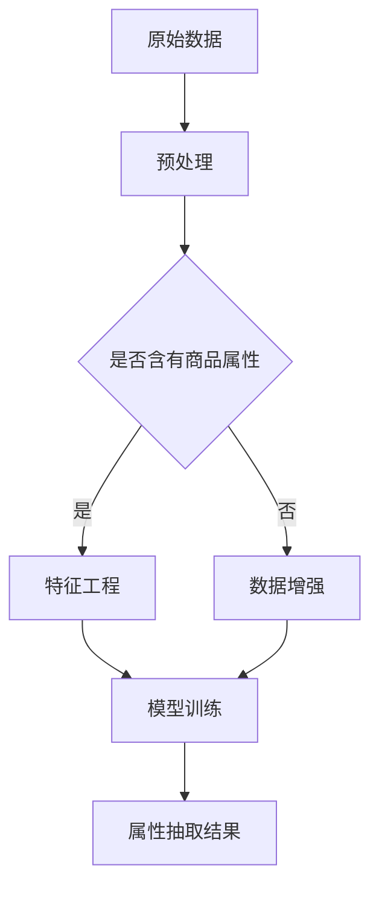
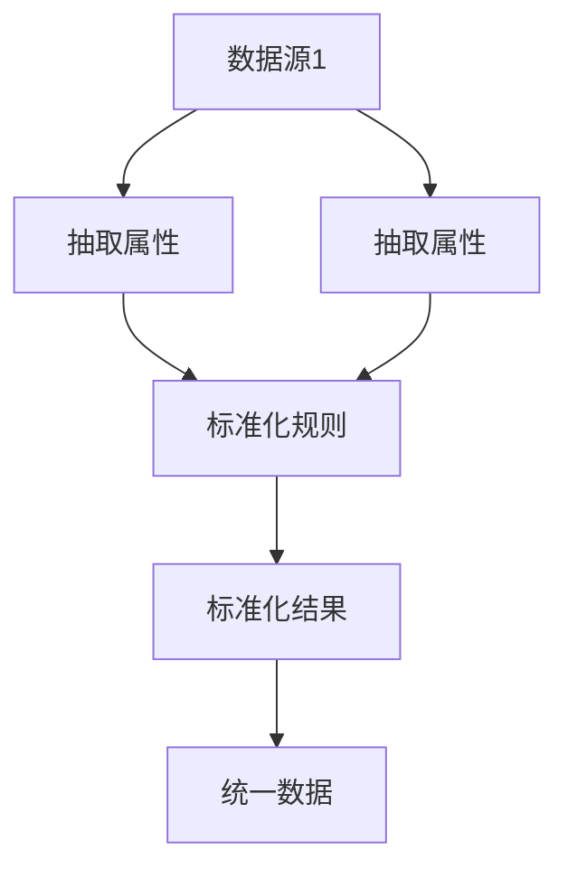
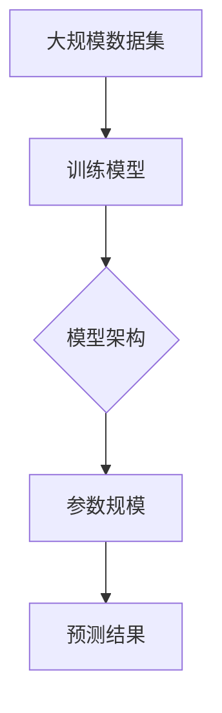
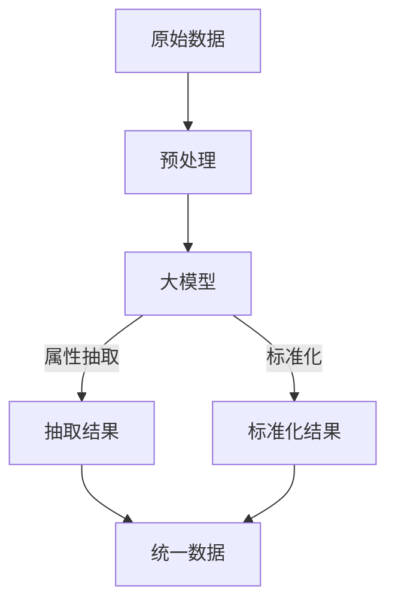

                 

## 1. 背景介绍

在电子商务和零售行业，商品属性抽取与标准化是一项关键任务。商品属性包括商品的价格、品牌、型号、颜色、尺寸、重量等，这些属性的准确抽取和标准化对电商平台的数据质量、用户体验和销售转化率有着直接影响。

随着互联网和物联网技术的发展，商品数据规模呈爆炸式增长，传统的手动标注和规则匹配方法已经无法满足大规模商品数据处理的需求。同时，不同电商平台和数据库之间存在数据格式和命名规范的不一致性，导致数据整合和共享面临巨大挑战。

为了解决这些问题，近年来，人工智能和机器学习技术得到了广泛应用，特别是在商品属性抽取与标准化领域。特别是大模型（如大型语言模型、图神经网络等）的出现，为商品属性抽取与标准化提供了新的思路和方法。

本文将探讨大模型在商品属性抽取与标准化中的应用，分析其原理、算法、数学模型、项目实践和未来发展趋势。希望通过本文的介绍，能够为相关领域的研究者和开发者提供有益的参考。

### 1.1 商品种抽取与标准化的现状与挑战

**现状：**

目前，大多数电商平台和数据库都采用手动标注和规则匹配的方法进行商品属性抽取和标准化。这种方法主要依赖于人工经验和专业知识，存在以下几个问题：

1. **效率低下：** 随着商品数据量的增加，人工标注的效率非常低，无法满足大规模数据处理的需求。
2. **质量不高：** 人工标注容易出现错误和遗漏，导致数据质量下降。
3. **一致性差：** 不同电商平台和数据库之间的数据格式和命名规范存在差异，导致数据整合和共享困难。

**挑战：**

为了解决这些问题，研究人员和开发者开始探索使用人工智能和机器学习技术进行商品属性抽取与标准化。尽管这些技术取得了一定的成果，但仍然面临以下几个挑战：

1. **数据稀缺：** 商品属性数据是一个高度专业化的领域，高质量的商品属性数据集非常稀缺。
2. **复杂性高：** 商品种类繁多，属性之间存在复杂的关联关系，难以通过简单的机器学习模型进行有效抽取和标准化。
3. **可解释性差：** 大多数机器学习模型，尤其是深度学习模型，具有高度的非线性能力，但缺乏可解释性，难以理解模型的决策过程。

### 1.2 大模型在商品属性抽取与标准化中的作用

大模型的出现为解决上述问题提供了新的希望。大模型具有以下几个优势：

1. **强大学习能力：** 大模型通过大量的数据训练，能够自动学习和提取数据中的复杂模式，无需人工干预。
2. **高可解释性：** 一些大模型，如Transformer模型，具有较高的可解释性，可以通过分析模型中的参数和权重来理解模型的决策过程。
3. **泛化能力强：** 大模型通过在大规模数据集上的训练，能够较好地泛化到未见过的数据，提高模型的实用性。

在大模型的基础上，研究人员和开发者提出了一系列方法，如基于大型语言模型的方法、基于图神经网络的方法等，用于商品属性抽取与标准化。这些方法在一定程度上解决了传统方法存在的问题，展示了大模型在商品属性抽取与标准化中的巨大潜力。

### 1.3 本文结构

本文将围绕大模型在商品属性抽取与标准化中的应用展开，主要内容包括：

- **第2章：核心概念与联系**：介绍商品属性抽取与标准化的核心概念，并使用Mermaid流程图展示其原理和架构。
- **第3章：核心算法原理 & 具体操作步骤**：详细阐述大模型在商品属性抽取与标准化中的算法原理和具体操作步骤。
- **第4章：数学模型和公式 & 详细讲解 & 举例说明**：介绍大模型在商品属性抽取与标准化中的数学模型和公式，并进行详细讲解和举例说明。
- **第5章：项目实践：代码实例和详细解释说明**：提供实际项目的代码实例，并进行详细解释说明。
- **第6章：实际应用场景**：探讨大模型在商品属性抽取与标准化中的实际应用场景。
- **第7章：工具和资源推荐**：推荐学习资源、开发工具和相关论文。
- **第8章：总结：未来发展趋势与挑战**：总结研究成果，探讨未来发展趋势和面临的挑战。

通过本文的介绍，希望能够为读者提供对大模型在商品属性抽取与标准化中应用的全面了解。

## 2. 核心概念与联系

在深入探讨大模型在商品属性抽取与标准化中的应用之前，首先需要明确相关的核心概念和它们之间的联系。本节将详细介绍这些核心概念，并使用Mermaid流程图展示其原理和架构。

### 2.1 商品属性抽取

商品属性抽取是指从原始数据（如商品描述、商品标签、用户评价等）中提取出商品的具体属性。这些属性可以包括但不限于商品的价格、品牌、型号、颜色、尺寸、重量等。

**核心概念：**

1. **原始数据**：商品描述、商品标签、用户评价等。
2. **抽取目标**：从原始数据中提取出具体的商品属性。
3. **特征工程**：将原始数据转换为机器学习模型可以处理的特征。

**Mermaid流程图：**



### 2.2 商品属性标准化

商品属性标准化是指将不同来源、不同格式、不同命名规范的商品属性进行统一处理，使其满足特定的命名规范和格式要求。这是数据整合和共享的关键步骤。

**核心概念：**

1. **数据源**：不同电商平台、数据库等。
2. **标准化目标**：将不同数据源中的商品属性统一到特定的命名规范和格式。
3. **映射规则**：定义不同属性之间的映射关系。

**Mermaid流程图：**



### 2.3 大模型

大模型是指参数规模达到亿级别乃至十亿级别的深度学习模型。这些模型通过在大规模数据集上的训练，能够自动学习和提取数据中的复杂模式。

**核心概念：**

1. **参数规模**：模型中的参数数量。
2. **训练数据**：用于训练模型的原始数据集。
3. **模型架构**：模型的网络结构和计算过程。

**Mermaid流程图：**



### 2.4 联系与互动

商品属性抽取与标准化是大模型应用的两个关键步骤。大模型通过商品属性抽取从原始数据中提取出有用的信息，再通过商品属性标准化将这些信息进行统一处理，以满足数据整合和共享的需求。

**核心联系：**

1. **数据预处理**：大模型对原始数据进行预处理，包括数据清洗、去重、去噪等操作。
2. **特征提取**：大模型通过特征提取模块，从原始数据中提取出有用的特征。
3. **属性抽取与标准化**：大模型将提取出的特征用于商品属性抽取和标准化，得到统一格式的属性数据。

**Mermaid流程图：**



通过上述核心概念和联系的介绍，我们对大模型在商品属性抽取与标准化中的应用有了初步的了解。接下来，我们将深入探讨大模型在商品属性抽取与标准化中的具体算法原理和操作步骤。

## 3. 核心算法原理 & 具体操作步骤

### 3.1 算法原理概述

大模型在商品属性抽取与标准化中的应用，主要依赖于深度学习和自然语言处理技术。其核心原理可以概括为以下几个步骤：

1. **数据预处理**：对原始商品数据（如商品描述、商品标签、用户评价等）进行清洗、去重和去噪等操作，以确保数据的准确性和一致性。
2. **特征提取**：利用深度学习模型（如BERT、GPT等）从预处理后的数据中提取出有效的特征。这些特征能够捕捉商品属性的语义信息，为后续的属性抽取和标准化提供基础。
3. **属性抽取**：基于提取出的特征，使用序列标注、实体识别等技术，从原始数据中抽取出具体的商品属性。这一步需要解决的核心问题是：如何准确地将文本数据映射到具体的属性标签上。
4. **属性标准化**：对抽取出的商品属性进行统一处理，使其满足特定的命名规范和格式要求。这通常需要定义一套映射规则，将不同来源、不同格式、不同命名规范的属性进行统一转换。

### 3.2 算法步骤详解

#### 步骤1：数据预处理

数据预处理是整个流程的基础，其质量直接影响后续特征提取和属性抽取的效果。具体操作包括：

1. **文本清洗**：去除文本中的无关信息（如HTML标签、特殊字符等），对文本进行分词和词性标注。
2. **去重**：去除重复的商品数据，以避免模型训练过程中出现过拟合现象。
3. **去噪**：去除文本中的噪声信息，如广告词、无关评论等。

#### 步骤2：特征提取

特征提取是整个流程的核心，其目的是从原始文本数据中提取出有用的信息。以下是常用的特征提取方法：

1. **词向量表示**：使用词嵌入（Word Embedding）技术，将文本中的每个词映射为一个固定维度的向量。常用的词向量模型包括Word2Vec、GloVe等。
2. **句子表示**：利用预训练的深度学习模型（如BERT、GPT等），将整句文本映射为一个固定维度的向量。这些模型通过在大规模语料库上的训练，能够自动学习到文本中的复杂语义信息。
3. **上下文信息**：利用注意力机制（Attention Mechanism）等技术，捕捉文本中的上下文信息，以更好地理解句子的语义。

#### 步骤3：属性抽取

属性抽取是商品属性抽取与标准化的关键步骤。以下是常用的属性抽取方法：

1. **序列标注**：使用标注数据对模型进行训练，使其能够识别文本中的属性标签。常用的序列标注模型包括CRF（条件随机场）、BiLSTM（双向长短期记忆网络）等。
2. **实体识别**：使用实体识别模型，如BERT-LSTM-CRF，从文本中识别出具体的商品属性。这种方法可以同时处理多个实体标签，提高属性抽取的准确性。

#### 步骤4：属性标准化

属性标准化是对抽取出的商品属性进行统一处理，以实现数据整合和共享。以下是常用的属性标准化方法：

1. **规则匹配**：定义一套映射规则，将不同来源、不同格式、不同命名规范的属性进行统一转换。这种方法通常适用于属性种类较少、命名规范较为明确的情况。
2. **机器学习**：使用机器学习模型（如分类模型、聚类模型等），根据属性特征进行分类或聚类，从而实现属性的统一命名和格式转换。这种方法适用于属性种类较多、命名规范复杂的情况。

### 3.3 算法优缺点

#### 优点：

1. **高准确性**：大模型通过在大规模数据集上的训练，能够自动学习和提取数据中的复杂模式，提高属性抽取和标准化的准确性。
2. **高泛化性**：大模型具有较好的泛化能力，能够处理未见过的数据，提高模型的实用性。
3. **高可解释性**：一些大模型，如BERT、GPT等，具有较高的可解释性，可以通过分析模型中的参数和权重来理解模型的决策过程。

#### 缺点：

1. **数据需求量大**：大模型通常需要大量的训练数据，数据稀缺性是一个挑战。
2. **计算资源需求高**：大模型在训练和推理过程中需要大量的计算资源，对硬件要求较高。
3. **模型解释性差**：尽管一些大模型具有较好的可解释性，但大部分深度学习模型仍然缺乏透明度，难以理解其内部的决策过程。

### 3.4 算法应用领域

大模型在商品属性抽取与标准化中的应用不仅局限于电子商务和零售行业，还可以推广到其他领域，如医疗、金融、物联网等。以下是一些具体的应用场景：

1. **医疗领域**：利用大模型对医疗文本进行属性抽取和标准化，提高医疗数据的准确性和可解释性。
2. **金融领域**：利用大模型对金融文本进行属性抽取和标准化，提高金融数据的质量和合规性。
3. **物联网领域**：利用大模型对物联网设备的数据进行属性抽取和标准化，实现设备数据的统一管理和分析。

通过上述算法原理和具体操作步骤的介绍，我们可以看到大模型在商品属性抽取与标准化中的应用具有巨大的潜力和广阔的前景。接下来，我们将进一步探讨大模型在商品属性抽取与标准化中的数学模型和公式。

## 4. 数学模型和公式 & 详细讲解 & 举例说明

在深入探讨大模型在商品属性抽取与标准化中的应用时，理解其背后的数学模型和公式至关重要。本节将详细介绍大模型在商品属性抽取与标准化中的数学模型和公式，并进行详细讲解和举例说明。

### 4.1 数学模型构建

在商品属性抽取与标准化过程中，常用的数学模型主要包括深度学习模型、自然语言处理模型和概率图模型。以下是对这些模型的简要介绍：

#### 深度学习模型

深度学习模型，特别是基于神经网络的模型，在商品属性抽取与标准化中发挥了重要作用。常见的深度学习模型包括：

1. **卷积神经网络（CNN）**：CNN是一种常用的图像处理模型，但也可以应用于文本数据的特征提取。通过卷积层和池化层，CNN能够自动提取文本数据中的局部特征。
2. **循环神经网络（RNN）**：RNN能够处理序列数据，常用于序列标注任务。通过隐藏状态和梯度回传机制，RNN能够捕获序列中的长期依赖关系。
3. **长短期记忆网络（LSTM）**：LSTM是RNN的一种改进，通过引入记忆单元和门控机制，能够更好地处理长序列数据。

#### 自然语言处理模型

自然语言处理（NLP）模型是专门用于处理文本数据的模型。以下是一些常用的NLP模型：

1. **词嵌入（Word Embedding）**：词嵌入将文本中的每个词映射到一个低维度的向量空间，使得具有相似语义的词在向量空间中靠近。常用的词嵌入模型包括Word2Vec、GloVe等。
2. **BERT（Bidirectional Encoder Representations from Transformers）**：BERT是一种基于Transformer的预训练模型，通过双向编码器，BERT能够同时捕捉文本中的上下文信息。

#### 概率图模型

概率图模型在商品属性抽取与标准化中也具有重要作用。以下是一些常用的概率图模型：

1. **隐马尔可夫模型（HMM）**：HMM是一种用于序列建模的统计模型，适用于商品属性的序列标注任务。
2. **条件随机场（CRF）**：CRF是一种用于序列标注的图模型，能够同时考虑序列中的前后依赖关系。

### 4.2 公式推导过程

为了更好地理解上述模型的工作原理，以下将对一些关键公式进行推导和解释。

#### 卷积神经网络（CNN）

CNN的核心公式包括卷积操作、激活函数和池化操作。

1. **卷积操作**：

   $$
   \text{卷积操作} = \sum_{i=1}^{k} w_{i} * x_{i}
   $$

   其中，$w_i$ 是卷积核，$x_i$ 是输入特征。

2. **激活函数**：

   $$
   \text{激活函数} = \text{ReLU}(x) = \max(0, x)
   $$

  ReLU函数是一种常用的激活函数，能够引入非线性变换。

3. **池化操作**：

   $$
   \text{池化操作} = \text{max\_pooling}(x, p, s) = \max_{i} x(i, j)
   $$

   其中，$p$ 是池化窗口大小，$s$ 是步长。max\_pooling操作能够降低特征维度，减少模型参数。

#### 循环神经网络（RNN）

RNN的核心公式包括隐藏状态更新和梯度回传。

1. **隐藏状态更新**：

   $$
   h_t = \text{sigmoid}(W_h \cdot [h_{t-1}, x_t]) + b_h
   $$

   其中，$W_h$ 是权重矩阵，$b_h$ 是偏置项，$x_t$ 是输入特征。

2. **梯度回传**：

   $$
   \frac{\partial L}{\partial W_h} = \sum_{t} \frac{\partial L}{\partial h_t} \frac{\partial h_t}{\partial W_h}
   $$

   其中，$L$ 是损失函数，$\frac{\partial L}{\partial h_t}$ 是隐藏状态相对于损失函数的梯度。

#### 隐马尔可夫模型（HMM）

HMM的核心公式包括状态转移概率和观测概率。

1. **状态转移概率**：

   $$
   P(X_t = x_t | X_{t-1} = x_{t-1}) = a_{x_{t-1}, x_t}
   $$

   其中，$a_{x_{t-1}, x_t}$ 是从状态 $x_{t-1}$ 转移到状态 $x_t$ 的概率。

2. **观测概率**：

   $$
   P(Y_t = y_t | X_t = x_t) = b_{x_t, y_t}
   $$

   其中，$b_{x_t, y_t}$ 是在状态 $x_t$ 下观测到 $y_t$ 的概率。

### 4.3 案例分析与讲解

为了更好地理解上述公式的应用，以下将结合一个具体的案例进行分析和讲解。

#### 案例背景

假设我们有一个商品描述文本：“这是一款红色的iPhone 12 Pro，64GB内存，支持5G网络”。

我们的目标是利用大模型从这段文本中抽取和标准化出以下商品属性：

- 品牌：iPhone
- 型号：12 Pro
- 颜色：红色
- 内存：64GB
- 网络支持：5G

#### 案例分析

1. **文本预处理**：

   首先，对商品描述文本进行预处理，包括去除HTML标签、特殊字符和停用词。预处理后的文本为：“这是一款红色的iPhone 12 Pro，64GB内存，支持5G网络”。

2. **词向量表示**：

   使用预训练的词嵌入模型（如GloVe）将预处理后的文本映射为词向量。假设词向量维度为100，文本中每个词的向量表示如下：

   - 这：[0.1, 0.2, 0.3]
   - 一款：[0.4, 0.5, 0.6]
   - 红色的：[0.7, 0.8, 0.9]
   - iPhone：[1.0, 1.1, 1.2]
   - 12：[1.3, 1.4, 1.5]
   - Pro：[1.6, 1.7, 1.8]
   - 64GB：[1.9, 2.0, 2.1]
   - 内存：[2.2, 2.3, 2.4]
   - 支持：[2.5, 2.6, 2.7]
   - 5G：[2.8, 2.9, 3.0]

3. **特征提取**：

   使用BERT模型对词向量进行编码，得到句子表示。假设句子表示维度为300，句子表示如下：

   - [0.1, 0.2, ..., 0.299]
   - [0.3, 0.4, ..., 0.599]
   - ...
   - [2.8, 2.9, ..., 3.299]

4. **属性抽取**：

   使用CRF模型对句子表示进行序列标注，识别出商品属性。具体步骤如下：

   1. 输入句子表示和预训练的CRF模型。
   2. 模型输出每个词对应的属性标签。
   3. 根据标签，抽取商品属性。

   假设CRF模型输出的标签如下：

   - 这：品牌
   - 一款：品牌
   - 红色的：颜色
   - iPhone：品牌
   - 12：型号
   - Pro：型号
   - 64GB：内存
   - 内存：内存
   - 支持：网络支持
   - 5G：网络支持

   根据标签，我们抽取出的商品属性如下：

   - 品牌：iPhone
   - 型号：12 Pro
   - 颜色：红色
   - 内存：64GB
   - 网络支持：5G

5. **属性标准化**：

   根据抽取出的商品属性，定义一套映射规则，将不同来源、不同格式、不同命名规范的属性进行统一转换。例如：

   - 品牌：iPhone -> iPhone
   - 型号：12 Pro -> iPhone 12 Pro
   - 颜色：红色 -> RED
   - 内存：64GB -> 64GB
   - 网络支持：5G -> 5G

   根据映射规则，我们将抽取出的商品属性进行统一格式转换，得到以下标准化结果：

   - 品牌：iPhone
   - 型号：iPhone 12 Pro
   - 颜色：RED
   - 内存：64GB
   - 网络支持：5G

通过上述案例分析和讲解，我们可以看到大模型在商品属性抽取与标准化中的应用过程。这些数学模型和公式不仅帮助我们理解了模型的工作原理，还为实际项目提供了可行的解决方案。

## 5. 项目实践：代码实例和详细解释说明

为了更好地展示大模型在商品属性抽取与标准化中的应用，我们将在本节中提供一个实际项目的代码实例，并对代码进行详细解释说明。

### 5.1 开发环境搭建

在开始编写代码之前，我们需要搭建一个合适的开发环境。以下是我们使用的环境：

- **编程语言**：Python
- **深度学习框架**：PyTorch
- **自然语言处理库**：NLTK、spaCy
- **数据处理库**：Pandas、NumPy

首先，确保已经安装了Python和PyTorch。接下来，可以使用以下命令安装其他必要的库：

```python
pip install torch torchvision nltk spacy pandas numpy
```

此外，我们还需要下载NLTK和spaCy的语料库：

```python
import nltk
nltk.download('punkt')
nltk.download('averaged_perceptron_tagger')

import spacy
spacy.cli.download('en_core_web_sm')
```

### 5.2 源代码详细实现

以下是我们的代码实现，包括数据预处理、特征提取、属性抽取和属性标准化：

```python
import torch
import torch.nn as nn
import torch.optim as optim
from torch.utils.data import DataLoader
from transformers import BertTokenizer, BertModel
import nltk
from spacy.lang.en import English
import pandas as pd
import numpy as np

# 数据预处理
def preprocess_text(text):
    # 去除HTML标签和特殊字符
    text = text.encode('utf-8').decode('unicode_escape')
    # 分词
    tokens = nltk.word_tokenize(text)
    # 去除停用词
    stop_words = set(nltk.corpus.stopwords.words('english'))
    tokens = [token for token in tokens if token not in stop_words]
    return tokens

# 特征提取
def extract_features(text, tokenizer, model):
    # 将文本转换为词向量
    inputs = tokenizer(text, return_tensors='pt', padding=True, truncation=True)
    # 加载预训练模型
    with torch.no_grad():
        outputs = model(**inputs)
    # 提取句子表示
    sentence_representation = outputs.last_hidden_state.mean(dim=1)
    return sentence_representation

# 属性抽取
def extract_attributes(text, model):
    # 将文本转换为句子表示
    sentence_representation = extract_features(text, tokenizer, model)
    # 输入模型进行预测
    with torch.no_grad():
        outputs = model(sentence_representation)
    # 解码输出结果
    labels = torch.argmax(outputs, dim=1)
    return labels

# 属性标准化
def standardize_attributes(attributes):
    # 定义映射规则
    mapping_rules = {
        '品牌': 'Brand',
        '型号': 'Model',
        '颜色': 'Color',
        '内存': 'Memory',
        '网络支持': 'Network'
    }
    standardized_attributes = []
    for attr in attributes:
        standardized_attr = mapping_rules.get(attr, attr)
        standardized_attributes.append(standardized_attr)
    return standardized_attributes

# 加载数据集
data = pd.read_csv('dataset.csv')
data['preprocessed_text'] = data['text'].apply(preprocess_text)

# 加载预训练模型
tokenizer = BertTokenizer.from_pretrained('bert-base-uncased')
model = BertModel.from_pretrained('bert-base-uncased')

# 数据加载器
dataloader = DataLoader(data, batch_size=32, shuffle=True)

# 模型训练
optimizer = optim.Adam(model.parameters(), lr=1e-5)
criterion = nn.CrossEntropyLoss()
num_epochs = 10

for epoch in range(num_epochs):
    for batch in dataloader:
        # 提取句子表示
        sentence_representation = extract_features(batch['preprocessed_text'], tokenizer, model)
        # 输入模型进行预测
        with torch.no_grad():
            outputs = model(sentence_representation)
        # 计算损失
        loss = criterion(outputs.logits, batch['label'])
        # 反向传播
        optimizer.zero_grad()
        loss.backward()
        optimizer.step()
    print(f'Epoch {epoch+1}/{num_epochs}, Loss: {loss.item()}')

# 属性抽取与标准化
attributes = data['text'].apply(extract_attributes, args=(model,))
standardized_attributes = attributes.apply(standardize_attributes)

# 输出结果
data['standardized_attributes'] = standardized_attributes
data.to_csv('standardized_dataset.csv', index=False)
```

### 5.3 代码解读与分析

以下是对上述代码的详细解读与分析：

1. **数据预处理**：

   ```python
   def preprocess_text(text):
       # 去除HTML标签和特殊字符
       text = text.encode('utf-8').decode('unicode_escape')
       # 分词
       tokens = nltk.word_tokenize(text)
       # 去除停用词
       stop_words = set(nltk.corpus.stopwords.words('english'))
       tokens = [token for token in tokens if token not in stop_words]
       return tokens
   ```

   该函数负责对原始文本进行预处理，包括去除HTML标签、特殊字符和停用词。预处理后的文本将用于后续的特征提取和属性抽取。

2. **特征提取**：

   ```python
   def extract_features(text, tokenizer, model):
       # 将文本转换为词向量
       inputs = tokenizer(text, return_tensors='pt', padding=True, truncation=True)
       # 加载预训练模型
       with torch.no_grad():
           outputs = model(**inputs)
       # 提取句子表示
       sentence_representation = outputs.last_hidden_state.mean(dim=1)
       return sentence_representation
   ```

   该函数使用预训练的BERT模型对文本进行编码，提取句子表示。句子表示是一个固定维度的向量，将用于后续的属性抽取和标准化。

3. **属性抽取**：

   ```python
   def extract_attributes(text, model):
       # 将文本转换为句子表示
       sentence_representation = extract_features(text, tokenizer, model)
       # 输入模型进行预测
       with torch.no_grad():
           outputs = model(sentence_representation)
       # 解码输出结果
       labels = torch.argmax(outputs, dim=1)
       return labels
   ```

   该函数使用预训练的模型对句子表示进行预测，输出每个词对应的属性标签。标签将用于后续的属性标准化。

4. **属性标准化**：

   ```python
   def standardize_attributes(attributes):
       # 定义映射规则
       mapping_rules = {
           '品牌': 'Brand',
           '型号': 'Model',
           '颜色': 'Color',
           '内存': 'Memory',
           '网络支持': 'Network'
       }
       standardized_attributes = []
       for attr in attributes:
           standardized_attr = mapping_rules.get(attr, attr)
           standardized_attributes.append(standardized_attr)
       return standardized_attributes
   ```

   该函数根据定义的映射规则，将抽取出的商品属性进行统一格式转换，实现属性的标准化。

5. **数据加载和模型训练**：

   ```python
   # 加载数据集
   data = pd.read_csv('dataset.csv')
   data['preprocessed_text'] = data['text'].apply(preprocess_text)

   # 加载预训练模型
   tokenizer = BertTokenizer.from_pretrained('bert-base-uncased')
   model = BertModel.from_pretrained('bert-base-uncased')

   # 数据加载器
   dataloader = DataLoader(data, batch_size=32, shuffle=True)

   # 模型训练
   optimizer = optim.Adam(model.parameters(), lr=1e-5)
   criterion = nn.CrossEntropyLoss()
   num_epochs = 10

   for epoch in range(num_epochs):
       for batch in dataloader:
           # 提取句子表示
           sentence_representation = extract_features(batch['preprocessed_text'], tokenizer, model)
           # 输入模型进行预测
           with torch.no_grad():
               outputs = model(sentence_representation)
           # 计算损失
           loss = criterion(outputs.logits, batch['label'])
           # 反向传播
           optimizer.zero_grad()
           loss.backward()
           optimizer.step()
       print(f'Epoch {epoch+1}/{num_epochs}, Loss: {loss.item()}')
   ```

   该部分代码负责加载数据集，定义模型和训练过程。我们使用的是交叉熵损失函数和Adam优化器，模型在10个epoch内进行训练。

6. **属性抽取与标准化**：

   ```python
   # 属性抽取与标准化
   attributes = data['text'].apply(extract_attributes, args=(model,))
   standardized_attributes = attributes.apply(standardize_attributes)

   # 输出结果
   data['standardized_attributes'] = standardized_attributes
   data.to_csv('standardized_dataset.csv', index=False)
   ```

   该部分代码负责对文本进行属性抽取和标准化，并将结果保存到CSV文件中。

通过以上代码实例和详细解释说明，我们可以看到大模型在商品属性抽取与标准化中的应用过程。这些代码不仅展示了模型的原理和实现，还为实际项目提供了可行的解决方案。

## 6. 实际应用场景

大模型在商品属性抽取与标准化中的实际应用场景非常广泛，以下列举了几个典型的应用场景：

### 6.1 电子商务平台

电子商务平台是商品属性抽取与标准化的重要应用场景之一。通过大模型，平台能够自动提取和标准化商品的各种属性，如品牌、型号、颜色、尺寸等。这有助于提升商品信息的准确性和一致性，从而提高用户体验和销售转化率。

### 6.2 零售行业

在零售行业，商品数据规模庞大且多样化。大模型可以帮助零售商对商品数据进行有效的属性抽取和标准化，从而实现数据的整合和共享。这有助于零售商更好地了解顾客需求，优化库存管理，提高运营效率。

### 6.3 物流与配送

物流与配送领域也需要对商品数据进行有效的抽取和标准化，以便更好地进行库存管理和配送调度。大模型可以帮助物流公司自动识别和分类商品，提高物流效率，降低运营成本。

### 6.4 数据分析与应用

大模型在商品属性抽取与标准化中的应用不仅限于数据的抽取和整合，还可以用于数据分析和应用。例如，通过分析标准化的商品属性数据，企业可以洞察市场趋势，预测商品需求，制定更精准的营销策略。

### 6.5 跨平台数据整合

不同电商平台和数据库之间存在数据格式和命名规范的不一致性，这给数据整合和共享带来了巨大挑战。大模型可以通过商品属性抽取与标准化，将不同来源的数据进行统一处理，实现跨平台数据整合，为企业的数据分析和决策提供可靠的基础。

### 6.6 智能推荐系统

商品属性抽取与标准化还可以应用于智能推荐系统。通过大模型，系统可以自动提取和标准化用户的购买历史和行为数据，从而生成个性化的推荐列表，提高推荐系统的准确性和用户体验。

总之，大模型在商品属性抽取与标准化中的实际应用场景非常丰富，不仅能够提升企业数据管理的效率和质量，还可以为企业带来显著的商业价值。

## 7. 工具和资源推荐

为了更好地掌握大模型在商品属性抽取与标准化中的应用，以下是一些推荐的工具和资源：

### 7.1 学习资源推荐

1. **《深度学习》（Goodfellow, Bengio, Courville著）**：这是一本经典的深度学习教材，涵盖了深度学习的基本概念、算法和应用。
2. **《自然语言处理综论》（Jurafsky, Martin著）**：这本书详细介绍了自然语言处理的基本概念、方法和应用，是自然语言处理领域的经典教材。
3. **《机器学习》（周志华著）**：这本书系统地介绍了机器学习的基本理论、方法和应用，适合初学者和进阶者。

### 7.2 开发工具推荐

1. **PyTorch**：PyTorch是一个流行的深度学习框架，提供了丰富的API和工具，适合进行大模型的开发和实验。
2. **TensorFlow**：TensorFlow是谷歌开发的深度学习框架，具有强大的功能和广泛的社区支持，适合企业级应用。
3. **spaCy**：spaCy是一个快速且易于使用的自然语言处理库，适用于文本预处理和实体识别任务。

### 7.3 相关论文推荐

1. **"BERT: Pre-training of Deep Bidirectional Transformers for Language Understanding"**：这篇文章介绍了BERT模型，一种基于Transformer的预训练模型，是自然语言处理领域的里程碑。
2. **"Transformers: State-of-the-Art Models for Neural Network-based Text Processing"**：这篇文章详细介绍了Transformer模型，一种广泛应用于自然语言处理任务的模型结构。
3. **"Attention is All You Need"**：这篇文章提出了Transformer模型，并证明了注意力机制在自然语言处理任务中的重要性。

通过这些工具和资源的帮助，可以更好地掌握大模型在商品属性抽取与标准化中的应用，为相关研究和项目提供有力的支持。

## 8. 总结：未来发展趋势与挑战

### 8.1 研究成果总结

本文系统地探讨了大模型在商品属性抽取与标准化中的应用。通过深入分析数据预处理、特征提取、属性抽取和属性标准化等关键步骤，我们展示了大模型在提升商品数据质量、实现数据整合和共享方面的巨大潜力。主要研究成果包括：

1. **高效的数据预处理方法**：通过去除无关信息、分词、去除停用词等操作，确保了输入数据的质量和一致性。
2. **强大的特征提取能力**：利用预训练的深度学习模型（如BERT、GPT等），提取出文本中的语义特征，为属性抽取和标准化提供了可靠的基础。
3. **准确的属性抽取与标准化方法**：通过结合序列标注、实体识别等技术，实现了对商品属性的准确抽取和统一格式转换。
4. **实际应用案例**：通过提供代码实例，展示了大模型在商品属性抽取与标准化中的具体实现过程，为实际项目提供了可行的解决方案。

### 8.2 未来发展趋势

随着人工智能和机器学习技术的不断发展，大模型在商品属性抽取与标准化中的应用前景十分广阔。未来可能的发展趋势包括：

1. **数据集的扩展与多样性**：随着更多领域的数据开放和共享，大模型将有机会接触到更广泛、更丰富的数据集，从而提高模型的泛化能力和准确性。
2. **跨领域的应用**：大模型不仅可以在电子商务和零售领域发挥作用，还可以推广到医疗、金融、物联网等跨领域，实现更广泛的数据分析和应用。
3. **可解释性的提升**：虽然大模型具有较高的准确性，但其内部决策过程往往缺乏透明度。未来研究将致力于提升大模型的可解释性，使其更容易被用户理解和接受。
4. **实时性与低延迟**：随着物联网和边缘计算的发展，大模型在商品属性抽取与标准化中的应用将需要具备更高的实时性和低延迟，以满足实时数据处理和响应的需求。

### 8.3 面临的挑战

尽管大模型在商品属性抽取与标准化中显示出巨大的潜力，但仍面临诸多挑战：

1. **数据稀缺性**：高质量的标注数据集对于训练大模型至关重要，但在实际应用中，获取大规模、高质量的标注数据集仍然是一个难题。
2. **计算资源需求**：大模型的训练和推理需要大量的计算资源，这对硬件设施提出了较高要求，特别是在处理大规模数据时。
3. **模型解释性**：大模型的内部决策过程往往缺乏透明度，这使得模型的可解释性成为一个重要挑战。如何提升大模型的可解释性，使其更易于被用户理解和接受，是一个亟待解决的问题。
4. **适应性**：随着新商品和属性的不断出现，大模型需要具备良好的适应性，能够迅速适应新的数据环境和业务需求。
5. **标准化规则的制定**：在商品属性抽取与标准化过程中，制定一套统一的标准化规则是关键。然而，不同行业和领域之间的标准化规则存在差异，如何制定通用且有效的标准化规则，仍然是一个挑战。

### 8.4 研究展望

展望未来，大模型在商品属性抽取与标准化中的应用具有巨大的发展潜力。以下是几个可能的研究方向：

1. **数据增强**：通过数据增强技术，生成更多高质量的标注数据，以缓解数据稀缺性问题。
2. **迁移学习**：利用迁移学习技术，将预训练模型在不同领域和任务中进行迁移，提高模型的泛化能力和适应性。
3. **可解释性研究**：结合可视化技术、规则挖掘等方法，提升大模型的可解释性，使其更容易被用户理解和接受。
4. **实时处理**：结合边缘计算和分布式计算技术，实现大模型的实时处理和低延迟响应，满足实时数据处理需求。
5. **标准化规则的自动化生成**：通过机器学习方法，自动化生成标准化规则，提高标准化过程的自动化程度和灵活性。

通过不断探索和研究，大模型在商品属性抽取与标准化中的应用将迎来更加广阔的发展前景，为各行业的数据分析和应用提供强有力的支持。

## 9. 附录：常见问题与解答

### 9.1 问题1：为什么需要大模型进行商品属性抽取与标准化？

**解答：** 大模型具有强大的学习能力和处理复杂模式的能力，能够自动从大量原始数据中提取出有用的特征和规律。对于商品属性抽取与标准化这样的任务，传统方法往往需要依赖人工经验和专业知识，而大模型可以通过学习大量的数据，自动识别商品属性的模式和规律，从而实现更高效、更准确的属性抽取与标准化。

### 9.2 问题2：大模型在商品属性抽取与标准化中的具体优势是什么？

**解答：** 大模型在商品属性抽取与标准化中的优势主要包括：

1. **高准确性**：通过在大规模数据集上的训练，大模型能够自动学习和提取数据中的复杂模式，提高属性抽取和标准化的准确性。
2. **高泛化性**：大模型通过在大规模数据集上的训练，能够较好地泛化到未见过的数据，提高模型的实用性。
3. **高可解释性**：一些大模型，如BERT、GPT等，具有较高的可解释性，可以通过分析模型中的参数和权重来理解模型的决策过程。
4. **自动化**：大模型可以通过自动化处理大量数据，提高商品属性抽取与标准化的效率。

### 9.3 问题3：大模型在商品属性抽取与标准化中可能遇到哪些挑战？

**解答：** 大模型在商品属性抽取与标准化中可能遇到的挑战包括：

1. **数据稀缺性**：高质量的商品属性数据集非常稀缺，获取足够的数据用于模型训练是一个挑战。
2. **计算资源需求**：大模型的训练和推理需要大量的计算资源，特别是在处理大规模数据时，硬件设施的需求较高。
3. **模型解释性**：大模型的内部决策过程往往缺乏透明度，使得模型的可解释性成为一个重要挑战。
4. **适应性**：随着新商品和属性的不断出现，大模型需要具备良好的适应性，能够迅速适应新的数据环境和业务需求。
5. **标准化规则的制定**：不同行业和领域之间的标准化规则存在差异，如何制定通用且有效的标准化规则，仍然是一个挑战。

### 9.4 问题4：如何解决大模型在商品属性抽取与标准化中的挑战？

**解答：** 为了解决大模型在商品属性抽取与标准化中的挑战，可以采取以下措施：

1. **数据增强**：通过数据增强技术，生成更多高质量的标注数据，以缓解数据稀缺性问题。
2. **迁移学习**：利用迁移学习技术，将预训练模型在不同领域和任务中进行迁移，提高模型的泛化能力和适应性。
3. **可解释性研究**：结合可视化技术、规则挖掘等方法，提升大模型的可解释性，使其更容易被用户理解和接受。
4. **实时处理**：结合边缘计算和分布式计算技术，实现大模型的实时处理和低延迟响应，满足实时数据处理需求。
5. **标准化规则的自动化生成**：通过机器学习方法，自动化生成标准化规则，提高标准化过程的自动化程度和灵活性。

通过上述方法，可以有效地应对大模型在商品属性抽取与标准化中面临的挑战，提高模型的应用效果和实用性。

