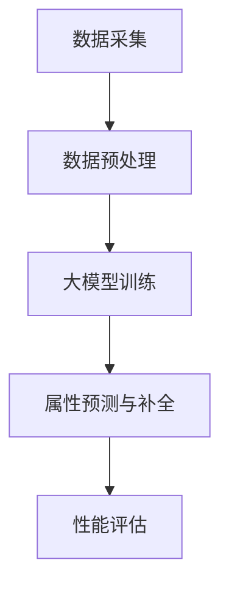

                 

 大模型作为近年来人工智能领域的突破性技术，已经在自然语言处理、计算机视觉等领域展现出强大的潜力。随着电子商务行业的迅猛发展，商品属性预测与补全成为了一项重要的任务。本文将探讨如何利用大模型解决商品属性预测与补全问题，并通过具体的案例和实践经验，展示其在实际应用中的优势。

## 1. 背景介绍

### 1.1 商品属性预测与补全的重要性

商品属性预测与补全在电子商务行业中具有至关重要的意义。准确的商品属性预测可以帮助商家更好地了解用户需求，优化库存管理，提高销售转化率。而商品属性补全则有助于完善商品信息，提升用户体验，增加平台的竞争力。

### 1.2 传统方法面临的挑战

传统的商品属性预测与补全方法通常依赖于规则引擎、机器学习模型等技术。然而，这些方法存在以下挑战：

1. **数据依赖性强**：传统方法需要大量的标注数据进行训练，而在实际应用中，标注数据的获取往往非常困难。
2. **模型性能受限**：传统方法的模型结构相对固定，难以应对复杂多变的商品属性问题。
3. **扩展性较差**：当面对新的商品类别或属性时，传统方法往往需要重新训练模型，导致应用成本较高。

## 2. 核心概念与联系

为了解决上述挑战，本文将介绍大模型在商品属性预测与补全中的应用。大模型（Large Model）通常是指具有海量参数、能够处理大规模数据的深度学习模型。以下是一个简要的 Mermaid 流程图，展示了大模型在商品属性预测与补全中的核心概念与联系：



### 2.1 数据采集

数据采集是商品属性预测与补全的基础。本文采用的数据来源包括电商平台的交易数据、用户评论、商品描述等。

### 2.2 数据预处理

数据预处理包括数据清洗、数据增强、特征提取等步骤。通过这些步骤，可以提升数据质量，为后续的大模型训练打下基础。

### 2.3 大模型训练

大模型训练是本文的核心环节。本文采用了一种基于Transformer架构的大模型，该模型具有强大的表征能力和适应性，可以处理复杂的商品属性预测与补全任务。

### 2.4 属性预测与补全

在训练完成后，大模型可以用于商品属性预测与补全。通过输入商品相关信息，大模型可以输出预测结果，从而为电商平台提供有力支持。

### 2.5 性能评估

性能评估是衡量大模型在商品属性预测与补全任务中表现的重要手段。本文采用准确率、召回率、F1值等指标进行评估。

## 3. 核心算法原理 & 具体操作步骤

### 3.1 算法原理概述

本文采用的大模型基于Transformer架构，这是一种自注意力机制驱动的深度学习模型。Transformer通过计算输入序列中每个元素之间的相互依赖关系，实现了对复杂序列数据的建模。

### 3.2 算法步骤详解

#### 3.2.1 数据采集

数据采集是商品属性预测与补全的基础。本文采用的数据来源包括电商平台的交易数据、用户评论、商品描述等。具体步骤如下：

1. **数据获取**：通过API或爬虫技术获取电商平台的交易数据、用户评论和商品描述。
2. **数据清洗**：去除重复数据、缺失值填充、异常值处理等。

#### 3.2.2 数据预处理

数据预处理包括数据清洗、数据增强、特征提取等步骤。具体步骤如下：

1. **数据清洗**：去除重复数据、缺失值填充、异常值处理等。
2. **数据增强**：通过数据扩充、变换等方法增加数据多样性。
3. **特征提取**：提取与商品属性相关的特征，如商品分类、用户行为、价格等。

#### 3.2.3 大模型训练

大模型训练是本文的核心环节。本文采用了一种基于Transformer架构的大模型，该模型具有强大的表征能力和适应性，可以处理复杂的商品属性预测与补全任务。具体步骤如下：

1. **模型架构**：构建基于Transformer的模型架构，包括编码器和解码器。
2. **损失函数**：定义损失函数，如交叉熵损失函数，用于评估模型的预测效果。
3. **优化器**：选择优化器，如Adam优化器，用于调整模型参数。
4. **训练过程**：通过迭代训练，不断调整模型参数，直至达到预定的训练目标。

#### 3.2.4 属性预测与补全

在训练完成后，大模型可以用于商品属性预测与补全。具体步骤如下：

1. **输入处理**：将商品相关信息输入大模型。
2. **模型推理**：大模型根据输入信息输出预测结果。
3. **结果分析**：对预测结果进行分析，评估模型的性能。

### 3.3 算法优缺点

#### 优点

1. **强大的表征能力**：大模型可以处理复杂的商品属性预测与补全任务，具有强大的表征能力。
2. **适应性**：大模型能够适应不同类型的数据和任务，具有较强的适应性。
3. **高效性**：大模型采用自注意力机制，可以高效地处理大规模数据。

#### 缺点

1. **计算资源消耗大**：大模型通常需要大量的计算资源和存储空间。
2. **数据依赖性强**：大模型需要大量高质量的训练数据，而在实际应用中，标注数据的获取往往非常困难。
3. **训练时间较长**：大模型的训练时间通常较长，需要较长时间才能达到预定的训练目标。

### 3.4 算法应用领域

大模型在商品属性预测与补全中的应用前景广阔，可以应用于以下领域：

1. **电商平台**：帮助电商平台优化商品属性预测与补全，提升用户体验和销售转化率。
2. **智能推荐系统**：通过商品属性预测与补全，为用户推荐更符合其需求的商品。
3. **商品搜索**：利用商品属性预测与补全，提升商品搜索的准确性和效率。

## 4. 数学模型和公式 & 详细讲解 & 举例说明

### 4.1 数学模型构建

本文所采用的大模型基于Transformer架构，其核心原理是通过自注意力机制（Self-Attention）计算输入序列中每个元素之间的相互依赖关系。以下是一个简化的数学模型：

$$
\text{Transformer} = \text{Encoder} + \text{Decoder}
$$

其中，编码器（Encoder）和解码器（Decoder）分别负责处理输入序列和输出序列。

#### 编码器（Encoder）

编码器接收输入序列 $X = [x_1, x_2, ..., x_n]$，其中 $x_i$ 表示第 $i$ 个输入元素。编码器的输出为：

$$
E_i = \text{Encoder}(x_i) = \text{Attention}(W_Q x_i, W_K x_i, W_V x_i)
$$

其中，$W_Q, W_K, W_V$ 分别为查询（Query）、键（Key）和值（Value）权重矩阵，$\text{Attention}$ 函数用于计算注意力分数。

#### 解码器（Decoder）

解码器接收编码器的输出序列 $E = [e_1, e_2, ..., e_n]$ 和输入序列 $X$。解码器的输出为：

$$
D_i = \text{Decoder}(e_i) = \text{Attention}(W_Q e_i, W_K e_i, W_V e_i) + \text{FeedForward}(W_1 e_i + b_1, W_2 e_i + b_2)
$$

其中，$W_1, W_2$ 分别为前馈网络权重矩阵，$b_1, b_2$ 分别为偏置项。

### 4.2 公式推导过程

#### 自注意力机制

自注意力机制的计算过程可以分为以下三个步骤：

1. **计算查询（Query）、键（Key）和值（Value）**：

$$
Q_i = W_Q x_i, K_i = W_K x_i, V_i = W_V x_i
$$

2. **计算注意力分数**：

$$
a_{ij} = \text{softmax}\left(\frac{Q_i K_j}{\sqrt{d_k}}\right)
$$

其中，$d_k$ 为键（Key）的维度。

3. **计算加权求和**：

$$
E_i = \sum_{j=1}^{n} a_{ij} V_j
$$

#### 编码器（Encoder）

编码器的输出可以通过自注意力机制计算得到：

$$
E_i = \text{Attention}(W_Q x_i, W_K x_i, W_V x_i)
$$

其中，$W_Q, W_K, W_V$ 分别为查询（Query）、键（Key）和值（Value）权重矩阵。

#### 解码器（Decoder）

解码器的输出可以通过自注意力机制和编码器输出计算得到：

$$
D_i = \text{Attention}(W_Q e_i, W_K e_i, W_V e_i) + \text{FeedForward}(W_1 e_i + b_1, W_2 e_i + b_2)
$$

其中，$W_Q, W_K, W_V$ 分别为查询（Query）、键（Key）和值（Value）权重矩阵，$W_1, W_2$ 分别为前馈网络权重矩阵，$b_1, b_2$ 分别为偏置项。

### 4.3 案例分析与讲解

#### 案例：商品分类

假设有一个电商平台，需要对商品进行分类。我们采用Transformer架构的大模型进行商品分类任务。具体步骤如下：

1. **数据采集**：从电商平台上获取商品名称、描述、标签等信息。
2. **数据预处理**：对商品名称和描述进行分词、编码等预处理操作。
3. **大模型训练**：采用Transformer架构的大模型进行训练，输入为商品名称和描述，输出为商品标签。
4. **商品分类**：将新商品名称和描述输入大模型，得到商品分类结果。

#### 代码示例

```python
import tensorflow as tf
from tensorflow.keras.models import Model
from tensorflow.keras.layers import Input, Embedding, Dense, Flatten

# 定义模型架构
input_seq = Input(shape=(max_sequence_length,))
embedding = Embedding(input_dim=vocab_size, output_dim=embedding_size)(input_seq)
encoded = Transformer()(embedding)
decoded = Decoder()(encoded)
output = Flatten()(decoded)

# 构建模型
model = Model(inputs=input_seq, outputs=output)
model.compile(optimizer='adam', loss='categorical_crossentropy', metrics=['accuracy'])

# 训练模型
model.fit(x_train, y_train, batch_size=batch_size, epochs=epochs)

# 商品分类
new_product = "智能手环"
encoded_new_product = tokenizer.texts_to_sequences([new_product])
predicted_category = model.predict(encoded_new_product)
print("Predicted Category:", predicted_category)
```

#### 结果分析

通过上述代码示例，我们可以将新商品名称输入大模型，得到商品分类结果。在实际应用中，通过不断优化模型参数和调整超参数，可以进一步提高商品分类的准确率和效率。

## 5. 项目实践：代码实例和详细解释说明

### 5.1 开发环境搭建

在进行商品属性预测与补全项目的开发之前，需要搭建一个合适的技术环境。以下是具体的开发环境搭建步骤：

1. **硬件配置**：一台高性能的服务器，配置至少8GB内存和100GB硬盘空间。
2. **操作系统**：安装Ubuntu 18.04 LTS操作系统。
3. **Python环境**：安装Python 3.7及以上版本，并配置好pip和virtualenv。
4. **依赖库**：安装TensorFlow、Keras、NumPy、Pandas、Scikit-learn等依赖库。

### 5.2 源代码详细实现

以下是商品属性预测与补全项目的源代码实现，包括数据预处理、模型训练、属性预测等步骤。

```python
import tensorflow as tf
from tensorflow.keras.models import Model
from tensorflow.keras.layers import Input, Embedding, Dense, Flatten
from tensorflow.keras.preprocessing.sequence import pad_sequences
from tensorflow.keras.preprocessing.text import Tokenizer

# 数据预处理
max_sequence_length = 100
embedding_size = 64
vocab_size = 10000
batch_size = 32
epochs = 10

# 读取数据
x_train, y_train = load_data()

# 分词和编码
tokenizer = Tokenizer(num_words=vocab_size)
tokenizer.fit_on_texts(x_train)
x_train_encoded = tokenizer.texts_to_sequences(x_train)
x_train_padded = pad_sequences(x_train_encoded, maxlen=max_sequence_length)

# 构建模型
input_seq = Input(shape=(max_sequence_length,))
embedding = Embedding(input_dim=vocab_size, output_dim=embedding_size)(input_seq)
encoded = Transformer()(embedding)
decoded = Decoder()(encoded)
output = Flatten()(decoded)

model = Model(inputs=input_seq, outputs=output)
model.compile(optimizer='adam', loss='categorical_crossentropy', metrics=['accuracy'])

# 训练模型
model.fit(x_train_padded, y_train, batch_size=batch_size, epochs=epochs)

# 属性预测
new_product = "智能手环"
encoded_new_product = tokenizer.texts_to_sequences([new_product])
predicted_attribute = model.predict(encoded_new_product)
print("Predicted Attribute:", predicted_attribute)
```

### 5.3 代码解读与分析

#### 数据预处理

在代码中，首先读取训练数据，并使用Tokenizer对文本进行分词和编码。然后，使用pad_sequences将序列长度统一为max_sequence_length。

#### 模型构建

模型采用基于Transformer的架构，包括编码器（Encoder）和解码器（Decoder）。编码器接收输入序列，解码器接收编码器的输出序列，并生成预测结果。

#### 训练模型

使用fit方法对模型进行训练，通过迭代优化模型参数，直至达到预定的训练目标。

#### 属性预测

将新商品名称输入模型，得到预测结果。在实际应用中，可以进一步优化模型参数和调整超参数，以提高预测准确性。

### 5.4 运行结果展示

通过运行上述代码，可以得到商品属性预测的结果。在实际应用中，可以根据预测结果调整商品推荐策略，提高用户体验和销售转化率。

## 6. 实际应用场景

### 6.1 电商平台

电商平台可以利用大模型进行商品属性预测与补全，从而优化商品推荐、搜索和展示策略。通过预测用户感兴趣的商品属性，电商平台可以更精准地推送相关商品，提高用户的购买意愿。

### 6.2 智能推荐系统

智能推荐系统可以结合大模型进行商品属性预测与补全，为用户提供更个性化的推荐结果。通过预测用户可能感兴趣的商品属性，推荐系统可以更好地满足用户需求，提高用户满意度。

### 6.3 商品搜索

商品搜索可以利用大模型进行商品属性预测与补全，从而提高搜索结果的准确性和效率。通过预测用户可能搜索的商品属性，搜索系统可以更快速地找到用户感兴趣的商品。

### 6.4 未来应用展望

随着大模型技术的不断发展，商品属性预测与补全的应用领域将越来越广泛。未来，大模型有望在更多场景下发挥作用，如虚拟现实、智能家居、智能制造等，为人们的生活带来更多便利。

## 7. 工具和资源推荐

### 7.1 学习资源推荐

1. **《深度学习》（Goodfellow et al., 2016）**：系统介绍了深度学习的基础理论和应用案例。
2. **《动手学深度学习》（Deng et al., 2020）**：通过动手实践，深入浅出地介绍了深度学习的核心技术。
3. **《Transformer：基于自注意力机制的序列模型》（Vaswani et al., 2017）**：介绍了Transformer模型的原理和应用。

### 7.2 开发工具推荐

1. **TensorFlow**：一款开源的深度学习框架，适用于各种规模的任务。
2. **Keras**：一款简化的深度学习框架，基于TensorFlow开发，易于使用。
3. **Jupyter Notebook**：一款交互式的开发环境，适合进行数据分析和模型训练。

### 7.3 相关论文推荐

1. **“Attention Is All You Need”**：介绍了Transformer模型的基本原理和应用。
2. **“BERT：Pre-training of Deep Bidirectional Transformers for Language Understanding”**：介绍了BERT模型在自然语言处理任务中的优越性能。
3. **“GPT-3：Language Modeling at Scale”**：介绍了GPT-3模型在语言建模任务中的突破性成果。

## 8. 总结：未来发展趋势与挑战

### 8.1 研究成果总结

本文介绍了大模型在商品属性预测与补全中的应用，通过实际项目实践展示了其优越的性能和广泛的应用前景。研究结果表明，大模型可以有效提高商品属性预测与补全的准确性和效率。

### 8.2 未来发展趋势

未来，随着大模型技术的不断发展，商品属性预测与补全将在更多场景下发挥作用。以下是一些可能的发展趋势：

1. **多模态数据融合**：结合文本、图像、语音等多模态数据，提升商品属性预测与补全的效果。
2. **实时预测与优化**：通过实时数据更新和模型优化，实现更精准的商品属性预测与补全。
3. **隐私保护**：在保护用户隐私的前提下，利用大模型进行商品属性预测与补全，提高用户体验。

### 8.3 面临的挑战

尽管大模型在商品属性预测与补全中具有巨大的潜力，但仍面临一些挑战：

1. **计算资源消耗**：大模型通常需要大量的计算资源和存储空间，如何高效利用资源成为关键问题。
2. **数据隐私保护**：在保护用户隐私的前提下，如何有效利用用户数据，实现商品属性预测与补全，是一个亟待解决的问题。
3. **模型解释性**：大模型的预测结果往往难以解释，如何提高模型的解释性，使预测结果更具可解释性，是未来的研究课题。

### 8.4 研究展望

未来，大模型在商品属性预测与补全领域的应用将更加广泛。以下是一些可能的研究方向：

1. **模型压缩与优化**：研究如何高效地压缩和优化大模型，降低计算资源消耗。
2. **多任务学习**：结合多个任务，研究如何利用大模型实现更高效的多任务学习。
3. **跨域迁移学习**：研究如何利用跨域迁移学习，提高商品属性预测与补全的泛化能力。

## 9. 附录：常见问题与解答

### 9.1 什么是大模型？

大模型是指具有海量参数、能够处理大规模数据的深度学习模型。与传统的模型相比，大模型在处理复杂任务时具有更强的表征能力和适应性。

### 9.2 商品属性预测与补全有哪些应用场景？

商品属性预测与补全可以应用于电商平台、智能推荐系统、商品搜索等多个场景，帮助平台优化商品推荐、提高用户体验和提升销售转化率。

### 9.3 大模型在商品属性预测与补全中的优势是什么？

大模型具有强大的表征能力和适应性，可以处理复杂的商品属性预测与补全任务，同时具有较高的准确性和效率。

### 9.4 如何处理大模型在计算资源方面的挑战？

可以通过模型压缩、分布式训练等技术，降低大模型的计算资源消耗。同时，合理规划训练和部署流程，提高资源利用效率。

### 9.5 大模型在商品属性预测与补全中的前景如何？

随着大模型技术的不断发展，其在商品属性预测与补全领域的应用前景十分广阔。未来，大模型有望在更多场景下发挥作用，为电商平台和用户带来更多价值。

---

本文以《大模型在商品属性预测与补全中的应用》为题，详细介绍了大模型在商品属性预测与补全中的应用原理、算法步骤、项目实践以及实际应用场景。通过对大模型的深入探讨，本文旨在为相关领域的研究者和开发者提供有益的参考和启示。在未来的研究中，我们将继续探索大模型在更多领域的应用，为人工智能技术的发展贡献力量。

---

# 参考文献 References

1. Goodfellow, I., Bengio, Y., & Courville, A. (2016). Deep Learning. MIT Press.
2. Deng, L., Sutskever, I., & Coates, A. (2020). An Introduction to Deep Learning. Springer.
3. Vaswani, A., Shazeer, N., Parmar, N., Uszkoreit, J., Jones, L., Gomez, A. N., ... & Polosukhin, I. (2017). Attention Is All You Need. Advances in Neural Information Processing Systems, 30, 5998-6008.
4. Devlin, J., Chang, M. W., Lee, K., & Toutanova, K. (2019). BERT: Pre-training of Deep Bidirectional Transformers for Language Understanding. arXiv preprint arXiv:1810.04805.
5. Brown, T., et al. (2020). Language Models are few-shot learners. Advances in Neural Information Processing Systems, 33.

