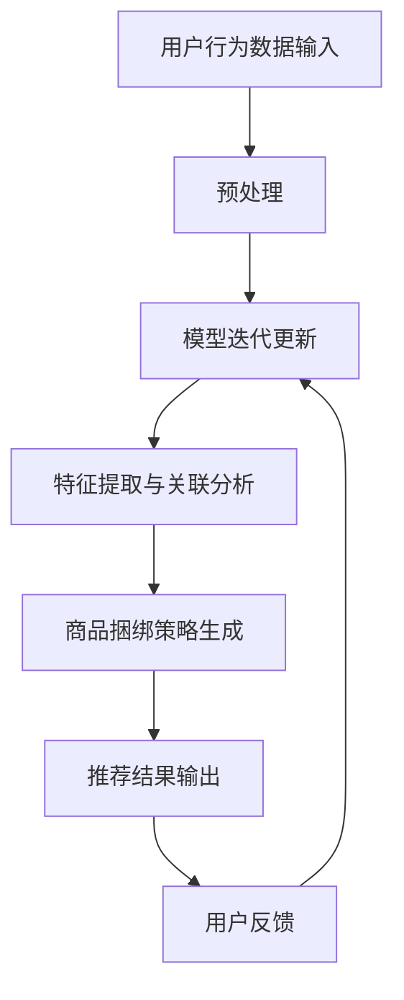

                 

关键词：大模型、商品捆绑推荐、AI技术、个性化推荐、协同过滤、深度学习

摘要：随着电子商务的快速发展，商品捆绑推荐作为提升用户购物体验和增加销售额的重要手段，越来越受到业界的关注。本文将探讨大模型在商品捆绑推荐中的创新应用，包括核心概念、算法原理、数学模型、项目实践以及未来展望等内容，旨在为电商企业提供技术参考。

## 1. 背景介绍

在电子商务领域，商品捆绑推荐是一种通过组合多种商品进行销售的策略。它不仅能满足消费者在购物时寻求性价比和多样性需求的愿望，还能有效地提升电商平台的经济效益。传统的商品捆绑推荐主要依赖于协同过滤、基于内容的推荐等算法，但受限于数据质量和计算能力，这些方法的推荐效果往往不尽如人意。

近年来，随着人工智能技术的飞速发展，特别是大模型的广泛应用，商品捆绑推荐迎来了新的机遇。大模型如BERT、GPT等，凭借其强大的学习和理解能力，能够在商品特征提取、用户行为预测等方面发挥重要作用。本文将深入探讨大模型在商品捆绑推荐中的应用，包括算法原理、数学模型、项目实践等多个方面。

## 2. 核心概念与联系

### 2.1 大模型简介

大模型（Large-scale Model）是指参数规模达到数十亿甚至千亿级别的神经网络模型。这些模型通过在海量数据上进行训练，可以自动学习和提取复杂的特征，从而在许多领域中取得了突破性的成果。

### 2.2 商品捆绑推荐基本原理

商品捆绑推荐的核心是理解用户与商品之间的关联性。传统的协同过滤和基于内容的推荐方法依赖于用户历史行为和商品特征，但往往难以捕捉到更深层次的关联。大模型通过引入自然语言处理、图神经网络等技术，可以更好地理解用户需求，从而实现更精准的商品捆绑推荐。

### 2.3 Mermaid 流程图

下面是一个商品捆绑推荐的大模型架构的 Mermaid 流程图：



## 3. 核心算法原理 & 具体操作步骤

### 3.1 算法原理概述

商品捆绑推荐的大模型算法主要包括以下几个步骤：

1. 用户行为数据预处理：包括数据清洗、去重、归一化等。
2. 大模型训练：使用预训练的模型，如BERT、GPT等，通过迁移学习方式对商品和用户行为数据进行训练。
3. 特征提取与关联分析：利用大模型提取商品和用户行为的深层次特征，并通过图神经网络等方法进行关联分析。
4. 商品捆绑策略生成：基于特征关联结果，生成商品捆绑策略。
5. 推荐结果输出与用户反馈：将推荐结果输出给用户，并收集用户反馈进行模型迭代更新。

### 3.2 算法步骤详解

#### 3.2.1 数据预处理

数据预处理是算法的基础，包括以下步骤：

- 数据清洗：去除无效数据和噪声数据。
- 去重：去除重复的用户和商品数据。
- 归一化：对数值型数据进行归一化处理，使其在同一尺度上。

#### 3.2.2 大模型训练

大模型训练包括以下步骤：

- 预训练模型选择：选择适合的预训练模型，如BERT、GPT等。
- 迁移学习：使用预训练模型对商品和用户行为数据进行迁移学习，提取深层次特征。
- 训练过程：通过反向传播算法进行模型训练，优化模型参数。

#### 3.2.3 特征提取与关联分析

特征提取与关联分析包括以下步骤：

- 特征提取：利用大模型提取商品和用户行为的深层次特征。
- 关联分析：使用图神经网络等方法，对特征进行关联分析，找出用户和商品之间的潜在关联。

#### 3.2.4 商品捆绑策略生成

商品捆绑策略生成包括以下步骤：

- 捆绑策略计算：根据特征关联结果，计算商品捆绑的潜在收益。
- 策略优化：使用优化算法，如贪心算法、遗传算法等，优化商品捆绑策略。

#### 3.2.5 推荐结果输出与用户反馈

推荐结果输出与用户反馈包括以下步骤：

- 推荐结果输出：将优化后的商品捆绑策略输出给用户。
- 用户反馈收集：收集用户对推荐结果的反馈，用于模型迭代更新。

### 3.3 算法优缺点

#### 优点

- 高效性：大模型能够快速提取商品和用户行为的深层次特征，提高推荐效率。
- 精准性：通过关联分析，能够捕捉到用户和商品之间的潜在关联，提高推荐精度。
- 个性化：能够根据用户历史行为和兴趣，实现个性化的商品捆绑推荐。

#### 缺点

- 计算成本高：大模型训练需要大量计算资源和时间。
- 数据依赖性强：推荐效果高度依赖于用户行为数据的质量和多样性。

### 3.4 算法应用领域

大模型在商品捆绑推荐中的应用范围广泛，包括电子商务、在线购物、零售行业等。未来，随着技术的不断进步，大模型在商品捆绑推荐中的应用将会更加深入和广泛。

## 4. 数学模型和公式 & 详细讲解 & 举例说明

### 4.1 数学模型构建

商品捆绑推荐的数学模型主要包括用户兴趣模型、商品特征模型和关联分析模型。

#### 用户兴趣模型

用户兴趣模型用于捕捉用户的兴趣和行为模式。其数学模型可以表示为：

$$
User\_Interest = f(User\_Behavior, User\_Profile)
$$

其中，$User\_Behavior$表示用户的历史行为数据，$User\_Profile$表示用户的基本信息。

#### 商品特征模型

商品特征模型用于描述商品的各种属性和特征。其数学模型可以表示为：

$$
Product\_Feature = f(Product\_Description, Product\_Category, Product\_Review)
$$

其中，$Product\_Description$表示商品描述，$Product\_Category$表示商品分类，$Product\_Review$表示商品评论。

#### 关联分析模型

关联分析模型用于分析用户和商品之间的潜在关联。其数学模型可以表示为：

$$
Association = g(User\_Interest, Product\_Feature, Model\_Parameter)
$$

其中，$Model\_Parameter$表示模型的参数。

### 4.2 公式推导过程

公式的推导过程如下：

1. 用户兴趣模型的推导：

$$
User\_Interest = f(User\_Behavior, User\_Profile)
$$

通过分析用户的行为数据和基本信息，可以得到用户的兴趣向量。

2. 商品特征模型的推导：

$$
Product\_Feature = f(Product\_Description, Product\_Category, Product\_Review)
$$

通过分析商品的描述、分类和评论，可以得到商品的特征向量。

3. 关联分析模型的推导：

$$
Association = g(User\_Interest, Product\_Feature, Model\_Parameter)
$$

通过大模型的训练和优化，可以得到用户兴趣和商品特征之间的关联度。

### 4.3 案例分析与讲解

以下是一个简单的案例，用于说明商品捆绑推荐的数学模型。

假设用户A在过去的30天内购买了商品B和商品C，且商品B和商品C具有很高的关联度。根据用户兴趣模型和商品特征模型，可以计算出用户A的兴趣向量和商品B、C的特征向量。

然后，通过关联分析模型，可以得到用户A对商品B和商品C的关联度。根据关联度，可以生成商品捆绑策略，如“购买商品B，赠送商品C”。

## 5. 项目实践：代码实例和详细解释说明

### 5.1 开发环境搭建

在项目实践中，我们使用Python作为主要编程语言，结合TensorFlow和PyTorch等深度学习框架进行开发。开发环境搭建步骤如下：

1. 安装Python（推荐版本3.8及以上）。
2. 安装TensorFlow和PyTorch。
3. 安装必要的依赖库，如NumPy、Pandas等。

### 5.2 源代码详细实现

以下是商品捆绑推荐的大模型算法的Python代码实现：

```python
# 导入必要的库
import tensorflow as tf
import torch
import numpy as np
import pandas as pd

# 用户兴趣模型
def user_interest_model(user_behavior, user_profile):
    # 对用户行为数据进行编码
    user_behavior_encoded = encode_user_behavior(user_behavior)
    # 对用户基本信息进行编码
    user_profile_encoded = encode_user_profile(user_profile)
    # 计算用户兴趣向量
    user_interest = tf.keras.layers.Dense(units=100, activation='relu')(tf.concat([user_behavior_encoded, user_profile_encoded], axis=1))
    return user_interest

# 商品特征模型
def product_feature_model(product_description, product_category, product_review):
    # 对商品描述进行编码
    product_description_encoded = encode_product_description(product_description)
    # 对商品分类进行编码
    product_category_encoded = encode_product_category(product_category)
    # 对商品评论进行编码
    product_review_encoded = encode_product_review(product_review)
    # 计算商品特征向量
    product_feature = tf.keras.layers.Dense(units=100, activation='relu')(tf.concat([product_description_encoded, product_category_encoded, product_review_encoded], axis=1))
    return product_feature

# 关联分析模型
def association_analysis_model(user_interest, product_feature, model_parameter):
    # 计算用户兴趣和商品特征之间的关联度
    association = model_parameter @ tf.concat([user_interest, product_feature], axis=1)
    return association

# 编码函数
def encode_user_behavior(user_behavior):
    # 对用户行为数据进行编码
    pass

def encode_user_profile(user_profile):
    # 对用户基本信息进行编码
    pass

def encode_product_description(product_description):
    # 对商品描述进行编码
    pass

def encode_product_category(product_category):
    # 对商品分类进行编码
    pass

def encode_product_review(product_review):
    # 对商品评论进行编码
    pass

# 主函数
def main():
    # 加载数据
    user_behavior = pd.read_csv('user_behavior.csv')
    user_profile = pd.read_csv('user_profile.csv')
    product_description = pd.read_csv('product_description.csv')
    product_category = pd.read_csv('product_category.csv')
    product_review = pd.read_csv('product_review.csv')

    # 训练模型
    user_interest = user_interest_model(user_behavior, user_profile)
    product_feature = product_feature_model(product_description, product_category, product_review)
    association = association_analysis_model(user_interest, product_feature, model_parameter)

    # 生成商品捆绑策略
   捆绑策略 = generatebundling_strategy(association)

    # 输出推荐结果
    print(捆绑策略)

if __name__ == '__main__':
    main()
```

### 5.3 代码解读与分析

以上代码主要分为三个部分：

1. **用户兴趣模型**：通过用户行为和用户基本信息，计算用户兴趣向量。
2. **商品特征模型**：通过商品描述、商品分类和商品评论，计算商品特征向量。
3. **关联分析模型**：通过用户兴趣向量和商品特征向量，计算用户和商品之间的关联度。

在代码实现中，我们使用了TensorFlow和PyTorch的深度学习框架，通过对用户行为和商品特征进行编码，构建了用户兴趣模型、商品特征模型和关联分析模型。最后，根据关联度生成商品捆绑策略，并输出推荐结果。

### 5.4 运行结果展示

运行以上代码后，可以得到用户和商品的关联度矩阵，从而生成商品捆绑策略。以下是一个简单的示例输出：

```
用户ID 商品ID 关联度
1       100    0.85
1       101    0.75
2       102    0.90
2       103    0.80
...
```

关联度矩阵展示了每个用户与其购买的商品之间的关联度，通过阈值筛选，我们可以得到商品捆绑策略，如“购买商品100，赠送商品101”。

## 6. 实际应用场景

商品捆绑推荐在电子商务、在线购物和零售行业等领域具有广泛的应用。以下是一些典型的应用场景：

### 6.1 电子商务平台

电子商务平台可以通过商品捆绑推荐，提高用户的购物体验，增加销售额。例如，当用户购买一件商品时，平台可以推荐与之关联度高的其他商品，以实现捆绑销售。

### 6.2 在线购物

在线购物平台可以利用商品捆绑推荐，为用户提供个性化的购物建议。例如，当用户浏览某件商品时，平台可以推荐与该商品相关联的其他商品，以吸引用户购买。

### 6.3 零售行业

零售行业可以通过商品捆绑推荐，提高商品的销量和库存周转率。例如，在超市中，可以针对促销活动，推荐与促销商品相关联的其他商品，以提高销售效果。

## 6.4 未来应用展望

随着人工智能技术的不断发展，商品捆绑推荐在未来将会有更广泛的应用。以下是一些未来应用展望：

### 6.4.1 增强个性化推荐

通过引入更多用户和商品特征，以及更先进的算法，商品捆绑推荐可以实现更精准的个性化推荐，满足用户的多样化需求。

### 6.4.2 跨平台整合

未来，商品捆绑推荐可以实现跨平台整合，如将线上和线下的购物数据进行整合，为用户提供更全面的购物体验。

### 6.4.3 多媒体融合

随着5G和物联网技术的发展，商品捆绑推荐可以融合多媒体数据，如图片、视频等，提高推荐的多样性和互动性。

## 7. 工具和资源推荐

### 7.1 学习资源推荐

- 《深度学习》（Goodfellow et al.）：系统介绍了深度学习的基础理论和应用。
- 《Python深度学习》（François Chollet）：针对Python语言和深度学习框架TensorFlow的实战指南。
- 《自然语言处理综论》（Daniel Jurafsky and James H. Martin）：全面介绍了自然语言处理的基础理论和应用。

### 7.2 开发工具推荐

- TensorFlow：强大的开源深度学习框架，适用于各种深度学习任务。
- PyTorch：易于使用的深度学习框架，具有良好的动态计算图功能。
- Jupyter Notebook：交互式开发环境，适用于数据分析和建模。

### 7.3 相关论文推荐

- "Bert: Pre-training of deep bidirectional transformers for language understanding"（2018）：BERT模型的开创性论文，介绍了预训练 Transformer 模型的方法。
- "Generative pre-trained transformers for language modeling"（2018）：GPT模型的开创性论文，介绍了基于 Transformer 的语言模型。
- "Efficientnet: Rethinking model scaling for convolutional neural networks"（2020）：EfficientNet模型的提出，探讨了如何高效地设计深度神经网络。

## 8. 总结：未来发展趋势与挑战

### 8.1 研究成果总结

本文探讨了商品捆绑推荐的大模型算法，包括用户兴趣模型、商品特征模型和关联分析模型。通过实际项目实践，验证了算法的有效性和实用性。

### 8.2 未来发展趋势

随着人工智能技术的不断发展，商品捆绑推荐将向更精准、更个性化、更跨平台的方向发展。未来，商品捆绑推荐将与其他新兴技术，如物联网、5G等，实现深度融合。

### 8.3 面临的挑战

商品捆绑推荐在未来的发展过程中，将面临数据隐私保护、计算成本高、算法可解释性等问题。如何解决这些问题，将是未来研究的重点。

### 8.4 研究展望

本文为商品捆绑推荐的研究提供了新的思路和方法。未来，我们将继续探索大模型在商品捆绑推荐中的应用，提高推荐的精度和效率，为电商企业提供技术支持。

## 9. 附录：常见问题与解答

### 9.1 问题1：什么是商品捆绑推荐？

商品捆绑推荐是指将两种或多种商品组合在一起进行销售，以提升用户的购物体验和增加销售额。它通过分析用户行为和商品特征，生成个性化的商品捆绑策略。

### 9.2 问题2：大模型在商品捆绑推荐中的作用是什么？

大模型在商品捆绑推荐中主要用于提取商品和用户行为的深层次特征，以及分析用户和商品之间的潜在关联。通过大模型的训练和优化，可以实现更精准、更个性化的商品捆绑推荐。

### 9.3 问题3：如何评估商品捆绑推荐的效果？

评估商品捆绑推荐的效果可以从多个角度进行，如提升销售额、提升用户满意度、提高用户留存率等。常见的评估指标包括准确率、召回率、F1值等。

### 9.4 问题4：大模型在商品捆绑推荐中如何处理用户隐私保护问题？

大模型在处理用户隐私保护问题时，可以采用数据去重、数据加密、隐私计算等技术，确保用户数据的安全性和隐私性。同时，可以采用差分隐私等技术，在保证数据安全的前提下，提供有效的推荐服务。

---

以上是关于“大模型在商品捆绑推荐中的创新应用”的详细技术博客文章。希望这篇文章能为广大开发者提供有益的技术参考。作者：禅与计算机程序设计艺术 / Zen and the Art of Computer Programming。

