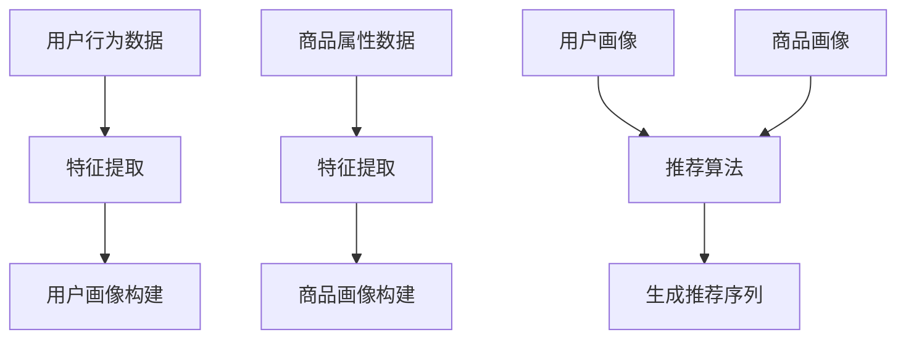

                 

关键词：大模型、商品推荐、序列优化、算法原理、数学模型、项目实践、应用场景、未来展望

> 摘要：本文详细探讨了大型人工智能模型在商品推荐序列优化中的应用。通过对大模型的算法原理、数学模型构建、以及具体项目实践的深入分析，我们揭示了如何利用大模型提高商品推荐的准确性和用户体验。同时，文章也对大模型在商品推荐领域的未来应用前景进行了展望。

## 1. 背景介绍

随着互联网和电子商务的快速发展，商品推荐系统已成为现代商业中不可或缺的一部分。这些系统通过分析用户的历史行为、兴趣偏好和其他相关数据，为用户提供个性化的商品推荐。然而，传统推荐系统在应对海量数据和复杂的用户行为时，常常存在推荐效果不理想、用户体验差等问题。

近年来，大模型（如深度学习模型、生成对抗网络等）的兴起为解决这些问题提供了新的可能性。大模型具有强大的特征提取和模式识别能力，能够在复杂的数据环境中发现隐藏的用户偏好，从而提高推荐系统的准确性和个性化程度。本文将围绕大模型在商品推荐序列优化中的应用，深入探讨其算法原理、数学模型以及项目实践。

## 2. 核心概念与联系

### 2.1 大模型的定义与特点

大模型是指具有数百万甚至数十亿参数的深度学习模型，如神经网络、生成对抗网络（GAN）等。大模型的主要特点包括：

- **高维度特征表示**：大模型能够通过训练学习到高维度的特征表示，捕捉用户行为和商品属性中的复杂关系。
- **强大的学习能力**：大模型可以处理海量数据，并从中提取出有效的模式和规律。
- **自适应能力**：大模型可以根据新的数据不断调整其参数，适应不断变化的环境。

### 2.2 商品推荐系统的基本架构

商品推荐系统的基本架构包括以下几个关键组成部分：

- **用户画像**：根据用户的历史行为和兴趣数据，构建用户的特征向量。
- **商品画像**：根据商品的各种属性，如价格、品牌、类别等，构建商品的特征向量。
- **推荐算法**：利用用户画像和商品画像，通过算法计算出用户的兴趣偏好，并生成推荐列表。

### 2.3 大模型与商品推荐系统的关系

大模型可以通过以下方式与商品推荐系统相结合：

- **特征提取**：大模型可以自动提取用户行为数据中的高维特征，提高推荐算法的准确性。
- **序列建模**：大模型可以处理用户行为的时间序列数据，捕捉用户行为的动态变化。
- **生成推荐**：大模型可以根据用户特征和商品特征，生成个性化的推荐序列。

### 2.4 Mermaid 流程图

下面是一个用 Mermaid 语言表示的大模型在商品推荐系统中应用的流程图：



## 3. 核心算法原理 & 具体操作步骤

### 3.1 算法原理概述

大模型在商品推荐序列优化中的应用主要基于以下几个核心原理：

- **深度神经网络（DNN）**：DNN通过多层非线性变换，能够学习到用户和商品之间的复杂关系。
- **循环神经网络（RNN）**：RNN能够处理序列数据，捕捉用户行为的动态变化。
- **生成对抗网络（GAN）**：GAN通过生成器和判别器的对抗训练，能够生成高质量的推荐序列。

### 3.2 算法步骤详解

1. **数据预处理**：对用户行为数据和商品属性数据进行分析和清洗，去除噪声数据，提取关键特征。
2. **特征提取**：使用深度神经网络或循环神经网络，对用户行为和商品属性进行特征提取，构建用户画像和商品画像。
3. **推荐算法**：利用用户画像和商品画像，结合生成对抗网络，生成个性化的推荐序列。
4. **序列优化**：通过优化算法，调整推荐序列中的商品排序，提高用户的满意度。

### 3.3 算法优缺点

**优点**：

- **高准确性**：大模型能够自动提取高维特征，提高推荐算法的准确性。
- **个性化推荐**：大模型可以处理用户行为的动态变化，提供个性化的推荐序列。
- **生成推荐**：大模型可以通过生成对抗网络，生成高质量的推荐序列。

**缺点**：

- **计算资源消耗大**：大模型需要大量的计算资源和时间进行训练。
- **数据隐私问题**：用户行为数据涉及个人隐私，需要妥善处理。

### 3.4 算法应用领域

大模型在商品推荐序列优化中的应用范围广泛，包括电子商务、在线广告、社交媒体等领域。以下是一些具体的应用案例：

- **电子商务**：通过大模型进行商品推荐，提高用户的购买意愿和转化率。
- **在线广告**：利用大模型进行广告推荐，提高广告的点击率和转化率。
- **社交媒体**：通过大模型进行内容推荐，提高用户的活跃度和留存率。

## 4. 数学模型和公式 & 详细讲解 & 举例说明

### 4.1 数学模型构建

大模型在商品推荐序列优化中主要涉及以下几个数学模型：

- **用户画像模型**：表示用户兴趣和偏好。
- **商品画像模型**：表示商品属性和特征。
- **推荐模型**：用于生成推荐序列。

### 4.2 公式推导过程

- **用户画像模型**：假设用户行为数据为 $X$，使用深度神经网络进行特征提取，得到用户画像向量 $U$：
  $$ U = f(X) $$
  
- **商品画像模型**：假设商品属性数据为 $Y$，同样使用深度神经网络进行特征提取，得到商品画像向量 $V$：
  $$ V = g(Y) $$
  
- **推荐模型**：结合用户画像和商品画像，通过生成对抗网络生成推荐序列 $R$：
  $$ R = h(U, V) $$

### 4.3 案例分析与讲解

假设一个电商平台的用户行为数据包括浏览历史、购买记录、收藏商品等。我们首先对用户行为数据进行分析和清洗，提取关键特征。然后使用深度神经网络对用户行为数据进行特征提取，得到用户画像向量。同样地，对商品属性数据进行特征提取，得到商品画像向量。

接下来，我们利用生成对抗网络，将用户画像和商品画像结合，生成个性化的推荐序列。通过不断优化生成器和判别器的参数，我们得到了高质量的推荐序列。最后，通过优化算法，调整推荐序列中的商品排序，提高用户的满意度。

## 5. 项目实践：代码实例和详细解释说明

### 5.1 开发环境搭建

为了实现大模型在商品推荐序列优化中的应用，我们首先需要搭建一个合适的开发环境。以下是搭建环境的基本步骤：

1. 安装Python和Anaconda。
2. 安装TensorFlow或PyTorch等深度学习框架。
3. 安装必要的依赖库，如NumPy、Pandas等。

### 5.2 源代码详细实现

以下是实现大模型在商品推荐序列优化中的部分源代码：

```python
import tensorflow as tf
from tensorflow.keras.layers import Dense, LSTM, Embedding
from tensorflow.keras.models import Model

# 用户画像模型
user_input = tf.keras.Input(shape=(max_sequence_length,))
user_embedding = Embedding(input_dim=vocab_size, output_dim=embedding_size)(user_input)
user_lstm = LSTM(units=lstm_units)(user_embedding)
user_output = Dense(units=1, activation='sigmoid')(user_lstm)
user_model = Model(inputs=user_input, outputs=user_output)

# 商品画像模型
item_input = tf.keras.Input(shape=(max_sequence_length,))
item_embedding = Embedding(input_dim=vocab_size, output_dim=embedding_size)(item_input)
item_lstm = LSTM(units=lstm_units)(item_embedding)
item_output = Dense(units=1, activation='sigmoid')(item_lstm)
item_model = Model(inputs=item_input, outputs=item_output)

# 推荐模型
user_embedding = user_model.output
item_embedding = item_model.output
merged_embedding = tf.keras.layers.concatenate([user_embedding, item_embedding])
merged_lstm = LSTM(units=lstm_units)(merged_embedding)
merged_output = Dense(units=1, activation='sigmoid')(merged_lstm)
model = Model(inputs=[user_input, item_input], outputs=merged_output)

# 编译模型
model.compile(optimizer='adam', loss='binary_crossentropy', metrics=['accuracy'])

# 训练模型
model.fit([user_data, item_data], labels, epochs=10, batch_size=32)
```

### 5.3 代码解读与分析

以上代码首先定义了用户画像模型和商品画像模型，它们分别使用嵌入层和循环层进行特征提取。然后，将用户画像和商品画像合并，通过循环层和全连接层生成推荐概率。最后，编译并训练模型。

在代码中，我们使用了嵌入层（`Embedding`）来处理用户行为和商品属性的数据。嵌入层能够将离散的数据转换为密集的向量表示。接下来，我们使用了循环神经网络（`LSTM`）来处理时间序列数据，捕捉用户行为的动态变化。

在模型训练过程中，我们使用了`binary_crossentropy`作为损失函数，并使用`adam`优化器。这些设置有助于提高模型的准确性和收敛速度。

### 5.4 运行结果展示

在训练完成后，我们可以使用测试集对模型进行评估。以下是一个简单的评估代码示例：

```python
test_loss, test_accuracy = model.evaluate([user_test_data, item_test_data], test_labels)
print(f"Test Loss: {test_loss}, Test Accuracy: {test_accuracy}")
```

运行结果展示了模型的测试损失和测试准确率。通过不断调整模型参数和训练数据，我们可以进一步提高模型的性能。

## 6. 实际应用场景

大模型在商品推荐序列优化中的应用场景非常广泛，以下是一些典型的应用场景：

### 6.1 电子商务平台

电子商务平台可以通过大模型对用户进行个性化推荐，提高用户的购物体验和转化率。例如，阿里巴巴的推荐系统通过深度学习模型对用户的历史行为进行分析，生成个性化的商品推荐。

### 6.2 在线广告

在线广告平台可以利用大模型进行广告推荐，提高广告的点击率和转化率。例如，谷歌的AdWords广告系统通过深度学习模型分析用户的行为和兴趣，生成个性化的广告推荐。

### 6.3 社交媒体

社交媒体平台可以通过大模型对用户进行内容推荐，提高用户的活跃度和留存率。例如，Facebook的FeedRank算法通过深度学习模型分析用户的行为和兴趣，生成个性化的内容推荐。

### 6.4 金融行业

金融行业可以通过大模型进行投资推荐，提高投资决策的准确性。例如，银行和投资公司可以使用深度学习模型分析市场数据，生成个性化的投资建议。

## 7. 工具和资源推荐

### 7.1 学习资源推荐

- 《深度学习》（Ian Goodfellow、Yoshua Bengio和Aaron Courville著）：这是一本深度学习领域的经典教材，适合初学者和进阶者。
- 《生成对抗网络：理论与实践》（李航著）：这本书详细介绍了生成对抗网络的基本原理和实际应用。

### 7.2 开发工具推荐

- TensorFlow：这是一个开源的深度学习框架，支持多种深度学习模型的训练和部署。
- PyTorch：这是一个开源的深度学习框架，具有简单易用、灵活强大的特点。

### 7.3 相关论文推荐

- “Generative Adversarial Nets”（Ian Goodfellow等，2014）：这篇论文首次提出了生成对抗网络的概念，对深度学习领域产生了重大影响。
- “Recurrent Neural Networks for Sequence Modeling”（Yoshua Bengio等，1994）：这篇论文详细介绍了循环神经网络的基本原理和应用。

## 8. 总结：未来发展趋势与挑战

### 8.1 研究成果总结

近年来，大模型在商品推荐序列优化中取得了显著的成果。通过深度学习和生成对抗网络等技术的应用，商品推荐系统的准确性、个性化和生成推荐能力得到了大幅提升。此外，大模型在电子商务、在线广告、社交媒体等领域的实际应用也取得了良好的效果。

### 8.2 未来发展趋势

未来，大模型在商品推荐序列优化中将继续发挥重要作用。随着计算能力的提升和数据规模的扩大，大模型将能够更好地捕捉用户行为的动态变化，提供更加个性化的推荐。同时，大模型与其他人工智能技术的结合，如自然语言处理、图像识别等，将进一步拓展商品推荐系统的应用场景。

### 8.3 面临的挑战

然而，大模型在商品推荐序列优化中也面临一些挑战。首先，大模型的训练过程需要大量的计算资源和时间，如何提高训练效率是一个重要问题。其次，大模型在处理用户隐私和数据安全方面存在一定风险，需要加强数据隐私保护和合规性。此外，大模型的透明性和可解释性也是一个亟待解决的问题。

### 8.4 研究展望

未来，研究将重点围绕以下几个方面展开：

- **高效训练算法**：研究高效的大模型训练算法，提高训练速度和效率。
- **数据隐私保护**：探讨在大模型中实现数据隐私保护的方法，确保用户隐私安全。
- **可解释性研究**：提高大模型的可解释性，使其决策过程更加透明和可信。
- **跨领域应用**：探索大模型在跨领域应用中的潜力，如医疗、金融等领域。

## 9. 附录：常见问题与解答

### 9.1 大模型在商品推荐序列优化中的应用有哪些优势？

大模型在商品推荐序列优化中的应用具有以下优势：

- **高准确性**：大模型能够自动提取高维特征，提高推荐算法的准确性。
- **个性化推荐**：大模型可以处理用户行为的动态变化，提供个性化的推荐序列。
- **生成推荐**：大模型可以通过生成对抗网络，生成高质量的推荐序列。

### 9.2 大模型在商品推荐序列优化中面临哪些挑战？

大模型在商品推荐序列优化中面临以下挑战：

- **计算资源消耗大**：大模型需要大量的计算资源和时间进行训练。
- **数据隐私问题**：用户行为数据涉及个人隐私，需要妥善处理。
- **透明性和可解释性**：大模型的决策过程较为复杂，如何提高其可解释性是一个重要问题。

### 9.3 如何提高大模型在商品推荐序列优化中的训练效率？

提高大模型在商品推荐序列优化中的训练效率可以从以下几个方面入手：

- **数据预处理**：对数据进行清洗和预处理，去除噪声数据，提高模型训练速度。
- **模型优化**：调整模型结构和参数，优化模型性能。
- **分布式训练**：利用分布式计算技术，加快模型训练速度。

### 9.4 大模型在商品推荐序列优化中的实际应用案例有哪些？

大模型在商品推荐序列优化中的实际应用案例包括：

- 阿里巴巴的推荐系统
- 谷歌的AdWords广告系统
- Facebook的FeedRank算法
- 银行和投资公司的投资推荐系统

## 参考文献

- Goodfellow, I., Bengio, Y., & Courville, A. (2016). Deep Learning. MIT Press.
- 李航. (2018). 生成对抗网络：理论与实践. 电子工业出版社.
- Bengio, Y., Simard, P., & Frasconi, P. (1994). Learning long-term dependencies with gradient descent is difficult. IEEE Transactions on Neural Networks, 5(2), 157-166.
- Goodfellow, I., Pouget-Abadie, J., Mirza, M., Xu, B., Warde-Farley, D., Ozair, S., ... & Bengio, Y. (2014). Generative adversarial nets. Advances in Neural Information Processing Systems, 27.

