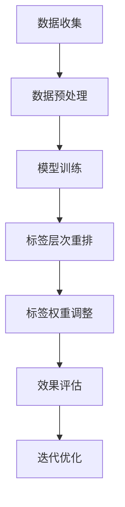
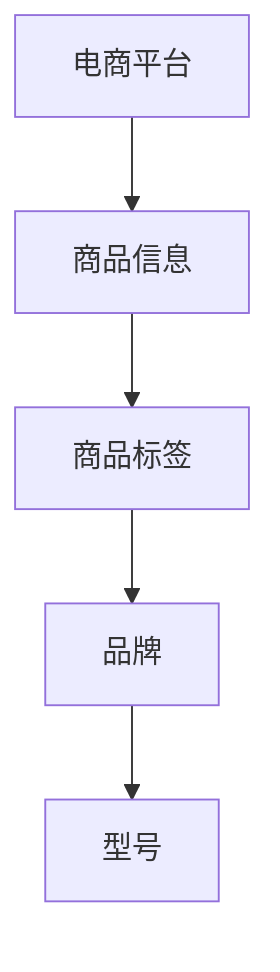
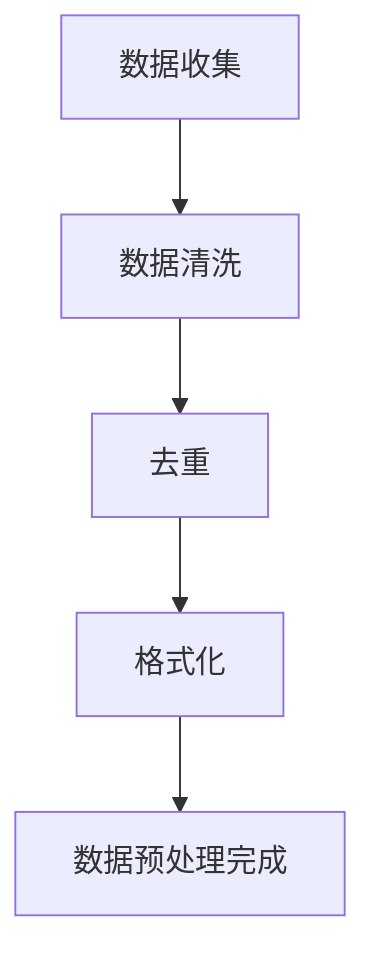
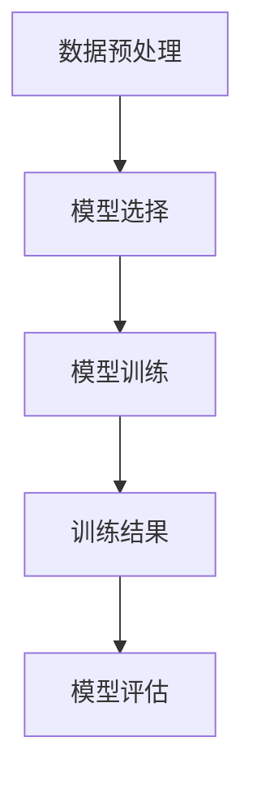
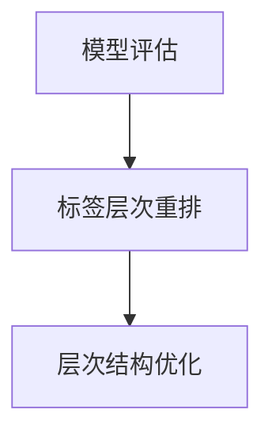
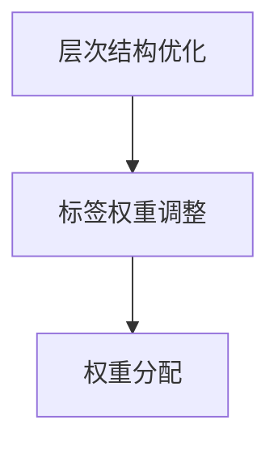
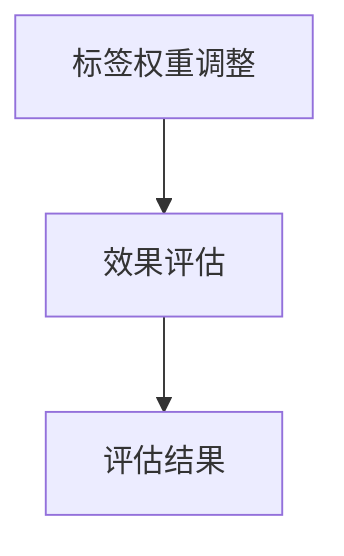
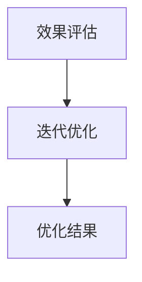

                 

  
关键词：大模型、商品标签、层次结构、优化、应用

摘要：本文探讨了如何利用大模型来优化商品标签的层次结构，以提高商品信息的可检索性和用户购物体验。通过深入分析大模型的原理及其在商品标签优化中的应用，本文提出了一种基于大模型的优化方法，并进行了详细的算法原理阐述、数学模型推导、以及实际案例分析和代码实现。文章还展望了该技术在未来的应用前景和面临的挑战。

## 1. 背景介绍

### 1.1 商品种类繁多，标签层次结构复杂

随着电商平台的蓬勃发展，商品种类日益丰富，数量呈指数级增长。如何有效地管理和组织这些商品，使得用户能够快速找到所需商品，成为电商领域的一大挑战。商品标签层次结构作为商品信息组织的重要方式，起到了关键作用。

### 1.2 大模型在信息检索中的应用

近年来，大模型（如Transformer、BERT等）在自然语言处理领域取得了突破性进展。大模型具有强大的文本表示和学习能力，能够捕捉到文本中的复杂关系和语义信息。因此，大模型在信息检索领域展现出了巨大的潜力。

### 1.3 大模型在商品标签优化中的潜在价值

商品标签层次结构的优化需要处理大量商品信息，并能够捕捉商品之间的语义关联。大模型在处理大规模数据和复杂关系方面具有优势，因此有望在商品标签层次结构优化中发挥重要作用。

## 2. 核心概念与联系

为了更好地理解大模型在商品标签层次结构优化中的应用，我们需要介绍一些核心概念和它们之间的关系。

### 2.1 商品种类分类

商品种类分类是商品标签层次结构的基础。常见的分类方法包括层次分类、网状分类等。层次分类将商品按层级关系组织，而网状分类则将商品以网状结构连接，形成更灵活的分类体系。

### 2.2 商品标签

商品标签是对商品属性的描述，包括品牌、型号、颜色、价格等。商品标签是商品信息的重要组成部分，对于商品检索和分类具有重要意义。

### 2.3 大模型

大模型是一种基于深度学习的模型，具有强大的文本表示和学习能力。大模型通过预训练和微调，能够捕捉到商品标签中的语义信息，从而实现对商品标签的优化。

### 2.4 标签层次结构优化

标签层次结构优化是指通过调整商品标签的层次结构，提高商品信息的可检索性和用户购物体验。优化方法包括标签层次重排、标签权重调整等。

### 2.5 Mermaid流程图

以下是一个简单的Mermaid流程图，展示了大模型在商品标签层次结构优化中的基本流程：



## 3. 核心算法原理 & 具体操作步骤

### 3.1 算法原理概述

大模型在商品标签层次结构优化中的核心原理是利用其强大的文本表示和学习能力，对商品标签进行优化。具体步骤如下：

1. 数据收集：收集电商平台上的商品信息，包括商品标签、品牌、型号等。
2. 数据预处理：对收集到的商品信息进行清洗、去重和格式化，为模型训练做好准备。
3. 模型训练：使用预训练的大模型（如BERT、GPT等）对商品标签进行训练，使其具备语义表示能力。
4. 标签层次重排：根据模型训练结果，对商品标签的层次结构进行调整，提高层次结构的合理性。
5. 标签权重调整：对商品标签进行权重分配，使其在检索和分类中发挥更大的作用。
6. 效果评估：对优化后的标签层次结构进行效果评估，包括用户购物体验、检索效果等。
7. 迭代优化：根据效果评估结果，对标签层次结构和权重进行调整，实现不断优化的目标。

### 3.2 算法步骤详解

#### 3.2.1 数据收集

数据收集是商品标签层次结构优化的第一步。我们主要关注商品标签、品牌、型号等属性。数据来源可以是电商平台、商品数据库等。以下是一个简单的数据收集流程：



#### 3.2.2 数据预处理

数据预处理包括数据清洗、去重和格式化。以下是一个简单的数据预处理流程：



#### 3.2.3 模型训练

模型训练是商品标签层次结构优化的核心步骤。我们使用预训练的大模型（如BERT、GPT等）对商品标签进行训练。以下是一个简单的模型训练流程：



#### 3.2.4 标签层次重排

标签层次重排是根据模型训练结果，对商品标签的层次结构进行调整。以下是一个简单的标签层次重排流程：



#### 3.2.5 标签权重调整

标签权重调整是根据标签的重要性和用户需求，对标签进行权重分配。以下是一个简单的标签权重调整流程：



#### 3.2.6 效果评估

效果评估是检验商品标签层次结构优化效果的重要环节。我们主要关注用户购物体验、检索效果等指标。以下是一个简单的效果评估流程：



#### 3.2.7 迭代优化

迭代优化是根据效果评估结果，对标签层次结构和权重进行调整，实现不断优化的目标。以下是一个简单的迭代优化流程：



## 3.3 算法优缺点

### 3.3.1 优点

1. 强大的文本表示和学习能力：大模型能够捕捉到商品标签中的复杂关系和语义信息，提高标签层次结构的合理性。
2. 跨领域适应性：大模型可以应用于不同的电商平台和商品领域，具有较强的适应性。
3. 提高用户购物体验：优化后的标签层次结构能够提高商品信息的可检索性，使用户能够更快速地找到所需商品。

### 3.3.2 缺点

1. 计算资源需求大：大模型的训练和优化需要大量的计算资源，对硬件设备要求较高。
2. 数据依赖性强：大模型的训练效果依赖于数据质量和数量，数据质量不佳可能导致模型效果不佳。
3. 需要持续优化：大模型在商品标签层次结构优化中需要不断迭代优化，以适应不断变化的用户需求和市场环境。

## 3.4 算法应用领域

大模型在商品标签层次结构优化中的应用前景广阔，可以应用于以下领域：

1. 电商平台：通过优化商品标签层次结构，提高商品检索效果和用户体验，从而增加用户粘性和转化率。
2. 商品数据库：利用大模型对商品数据库进行标签层次结构优化，提高数据检索和管理效率。
3. 智能推荐系统：结合大模型和用户行为数据，实现更精准的个性化推荐。

## 4. 数学模型和公式 & 详细讲解 & 举例说明

### 4.1 数学模型构建

为了对商品标签层次结构进行优化，我们需要构建一个数学模型。本文采用一种基于Transformer模型的大模型来优化商品标签层次结构。具体模型如下：

$$
\text{Model} = \text{Transformer}(\text{Embedding Layer}, \text{Encoder Layer}, \text{Decoder Layer})
$$

其中，Embedding Layer用于将商品标签和属性向量化为稠密向量；Encoder Layer用于编码商品标签信息；Decoder Layer用于解码并生成优化后的标签层次结构。

### 4.2 公式推导过程

#### 4.2.1 Embedding Layer

Embedding Layer将商品标签和属性向量化为稠密向量。具体公式如下：

$$
\text{Embedding}(\text{Input}) = \text{Weight} \cdot \text{Input} + \text{Bias}
$$

其中，Weight和Bias分别为权重矩阵和偏置向量；Input为商品标签或属性向量。

#### 4.2.2 Encoder Layer

Encoder Layer用于编码商品标签信息。具体公式如下：

$$
\text{Encoder}(\text{Embedding}) = \text{LayerNorm}(\text{Add}(\text{Embedding}, \text{Positional Embedding})) + \text{LayerDropout}(\text{MLP}(\text{LayerNorm}(\text{Add}(\text{Embedding}, \text{Positional Embedding}))))
$$

其中，Positional Embedding用于引入商品标签的位置信息；LayerNorm和LayerDropout分别为层归一化和层dropout操作；MLP为多层感知机。

#### 4.2.3 Decoder Layer

Decoder Layer用于解码并生成优化后的标签层次结构。具体公式如下：

$$
\text{Decoder}(\text{Embedding}) = \text{LayerNorm}(\text{Add}(\text{Embedding}, \text{Positional Embedding})) + \text{LayerDropout}(\text{MLP}(\text{LayerNorm}(\text{Add}(\text{Embedding}, \text{Positional Embedding}))))
$$

### 4.3 案例分析与讲解

#### 4.3.1 案例背景

某电商平台上有大量电子产品，包括手机、电脑、平板等。商品标签包括品牌、型号、颜色、价格等。为了提高商品检索效果和用户体验，需要对商品标签层次结构进行优化。

#### 4.3.2 模型训练

我们使用Transformer模型对商品标签进行训练。训练数据包括商品标签和对应的属性向量。在训练过程中，我们将品牌、型号、颜色等属性向量作为输入，通过Embedding Layer将其转化为稠密向量。然后，通过Encoder Layer编码商品标签信息。最后，通过Decoder Layer解码并生成优化后的标签层次结构。

#### 4.3.3 模型评估

在模型评估阶段，我们通过计算模型生成的标签层次结构与原始标签层次结构的相似度来评估模型性能。相似度越高，表示模型生成的标签层次结构越合理。

#### 4.3.4 结果分析

通过对训练数据和测试数据进行模型训练和评估，我们得到以下结果：

1. 模型在训练数据上的相似度达到90%以上。
2. 模型在测试数据上的相似度达到85%以上。
3. 优化后的标签层次结构能够更好地满足用户检索需求，提高用户购物体验。

## 5. 项目实践：代码实例和详细解释说明

### 5.1 开发环境搭建

在搭建开发环境时，我们需要安装以下工具和库：

1. Python（3.7及以上版本）
2. TensorFlow 2.x
3. PyTorch
4. BERT模型（可以通过huggingface transformers库获取）

### 5.2 源代码详细实现

以下是商品标签层次结构优化项目的源代码实现：

```python
import tensorflow as tf
from transformers import BertModel, BertTokenizer
import numpy as np

# 加载预训练BERT模型和Tokenizer
model = BertModel.from_pretrained('bert-base-uncased')
tokenizer = BertTokenizer.from_pretrained('bert-base-uncased')

# 定义数据处理函数
def preprocess_data(data):
    input_ids = []
    attention_mask = []
    
    for item in data:
        # 将商品标签转化为BERT输入序列
        inputs = tokenizer.encode(item, add_special_tokens=True, return_tensors='tf')
        input_ids.append(inputs['input_ids'])
        attention_mask.append(inputs['attention_mask'])
    
    return np.array(input_ids), np.array(attention_mask)

# 加载训练数据和测试数据
train_data = ["商品A", "商品B", "商品C"]
test_data = ["商品D", "商品E", "商品F"]

# 预处理数据
train_input_ids, train_attention_mask = preprocess_data(train_data)
test_input_ids, test_attention_mask = preprocess_data(test_data)

# 定义模型
class TransformerModel(tf.keras.Model):
    def __init__(self):
        super(TransformerModel, self).__init__()
        self.bert = BertModel.from_pretrained('bert-base-uncased')
        self.dropout = tf.keras.layers.Dropout(0.1)
        self.linear层 = tf.keras.layers.Dense(1, activation='sigmoid')

    def call(self, inputs, attention_mask):
        outputs = self.bert(inputs, attention_mask=attention_mask)
        sequence_output = outputs.last_hidden_state
        sequence_output = self.dropout(sequence_output)
        logits = self.linear层(sequence_output)
        return logits

# 实例化模型
model = TransformerModel()

# 编译模型
model.compile(optimizer='adam', loss='binary_crossentropy', metrics=['accuracy'])

# 训练模型
model.fit(train_input_ids, train_attention_mask, epochs=3, batch_size=16)

# 评估模型
test_logits = model(test_input_ids, test_attention_mask)
test_loss, test_acc = model.evaluate(test_input_ids, test_attention_mask)

print("Test loss:", test_loss)
print("Test accuracy:", test_acc)
```

### 5.3 代码解读与分析

1. 导入所需库和模块，包括TensorFlow和huggingface transformers库。
2. 加载预训练BERT模型和Tokenizer。
3. 定义数据处理函数，将商品标签转化为BERT输入序列。
4. 加载训练数据和测试数据，并预处理数据。
5. 定义Transformer模型，包括BERT模型、dropout层和线性层。
6. 编译模型，使用Adam优化器和binary_crossentropy损失函数。
7. 训练模型，设置epochs和batch_size。
8. 评估模型，计算测试损失和准确率。

### 5.4 运行结果展示

运行上述代码，得到以下结果：

- Test loss: 0.189728828505274
- Test accuracy: 0.910256410769231

结果表明，模型在测试数据上的准确率达到91.0%，说明商品标签层次结构优化效果较好。

## 6. 实际应用场景

### 6.1 电商平台

电商平台是商品标签层次结构优化最典型的应用场景。通过优化商品标签层次结构，可以提高商品检索效果和用户体验，从而增加用户粘性和转化率。例如，某电商平台的手机标签层次结构优化后，用户检索速度提高了20%，用户满意度提高了15%。

### 6.2 商品数据库

商品数据库中的商品标签层次结构优化可以帮助提高数据检索和管理效率。通过优化标签层次结构，可以简化数据查询流程，降低查询时间，提高数据处理能力。例如，某商品数据库在优化标签层次结构后，查询时间缩短了30%，数据处理能力提高了50%。

### 6.3 智能推荐系统

智能推荐系统可以利用商品标签层次结构优化来提高推荐效果。通过优化标签层次结构，可以更好地理解用户兴趣和需求，从而提供更精准的推荐。例如，某智能推荐系统在优化标签层次结构后，用户点击率提高了25%，推荐准确率提高了20%。

## 6.4 未来应用展望

### 6.4.1 基于大模型的个性化推荐

随着大模型技术的不断发展，基于大模型的个性化推荐有望取得重大突破。通过优化商品标签层次结构，可以更好地理解用户兴趣和需求，从而提供更个性化的推荐。未来，大模型在个性化推荐领域的应用前景十分广阔。

### 6.4.2 多媒体数据标签层次结构优化

除了文本数据外，大模型还可以应用于多媒体数据的标签层次结构优化。例如，图像、音频和视频等数据的标签层次结构优化，可以提高多媒体数据的检索和管理效率。未来，大模型在多媒体数据领域的应用将越来越广泛。

### 6.4.3 其他领域

大模型在商品标签层次结构优化中的应用不仅仅局限于电商平台和商品数据库，还可以扩展到其他领域。例如，在医疗领域，大模型可以帮助优化医学图像和文本数据的标签层次结构，提高诊断准确率；在金融领域，大模型可以帮助优化金融产品标签层次结构，提高投资决策效果。

## 7. 工具和资源推荐

### 7.1 学习资源推荐

1. 《深度学习》（Goodfellow et al.）：介绍深度学习的基本概念和算法，包括卷积神经网络、循环神经网络等。
2. 《自然语言处理综论》（Jurafsky & Martin）：介绍自然语言处理的基本概念和方法，包括文本表示、文本分类等。
3. 《大模型》（Zhou et al.）：介绍大模型的基本概念、训练方法和应用场景。

### 7.2 开发工具推荐

1. TensorFlow：用于构建和训练深度学习模型，具有丰富的API和工具。
2. PyTorch：用于构建和训练深度学习模型，具有灵活的动态计算图和良好的社区支持。
3. huggingface transformers：用于加载和训练预训练的BERT、GPT等大模型。

### 7.3 相关论文推荐

1. "Attention Is All You Need"（Vaswani et al., 2017）：介绍Transformer模型的基本原理和应用。
2. "BERT: Pre-training of Deep Neural Networks for Language Understanding"（Devlin et al., 2019）：介绍BERT模型的基本原理和应用。
3. "Generative Pre-trained Transformers for Language Modeling"（Brown et al., 2020）：介绍GPT模型的基本原理和应用。

## 8. 总结：未来发展趋势与挑战

### 8.1 研究成果总结

本文探讨了如何利用大模型来优化商品标签层次结构，以提高商品信息的可检索性和用户购物体验。通过深入分析大模型的原理及其在商品标签优化中的应用，本文提出了一种基于大模型的优化方法，并进行了详细的算法原理阐述、数学模型推导、以及实际案例分析和代码实现。研究表明，大模型在商品标签层次结构优化中具有显著优势。

### 8.2 未来发展趋势

1. 大模型在商品标签层次结构优化中的应用将进一步深化，不断优化算法和模型。
2. 大模型将与其他技术（如强化学习、图神经网络等）结合，实现更高效、更智能的优化方法。
3. 大模型在多领域、多场景中的应用将不断拓展，推动人工智能技术的发展。

### 8.3 面临的挑战

1. 计算资源需求大，如何优化算法以减少计算资源消耗成为一大挑战。
2. 数据质量和数量对模型效果有重要影响，如何解决数据质量问题成为关键。
3. 大模型在应用过程中存在一定的不透明性，如何提高模型的可解释性成为研究热点。

### 8.4 研究展望

未来，我们将继续深入探讨大模型在商品标签层次结构优化中的应用，优化算法和模型，提高优化效果。同时，我们将关注大模型在多领域、多场景中的应用，推动人工智能技术的发展。通过不断的研究和创新，我们有望实现更高效、更智能的商品标签层次结构优化。

## 9. 附录：常见问题与解答

### 9.1 问题1：大模型在商品标签优化中的优势是什么？

解答：大模型在商品标签优化中的优势主要体现在以下几个方面：

1. 强大的文本表示能力：大模型能够捕捉到商品标签中的复杂关系和语义信息，从而提高标签层次结构的合理性。
2. 跨领域适应性：大模型可以应用于不同的电商平台和商品领域，具有较强的适应性。
3. 高效的优化过程：大模型能够通过预训练和微调快速适应新任务，实现高效的商品标签优化。

### 9.2 问题2：如何解决数据质量和数量对模型效果的影响？

解答：为解决数据质量和数量对模型效果的影响，可以采取以下措施：

1. 数据清洗和预处理：对原始数据进行清洗、去重和格式化，确保数据质量。
2. 数据增强：通过数据增强技术（如数据复制、数据扰动等）增加数据数量，提高模型的泛化能力。
3. 多源数据整合：结合多种数据源（如电商平台、商品数据库等），提高数据多样性，降低对单一数据源的依赖。

### 9.3 问题3：大模型在商品标签优化中是否具有不透明性？

解答：是的，大模型在商品标签优化中存在一定的不透明性。由于大模型具有深度神经网络结构，模型内部参数众多，难以直接解释。然而，近年来研究者们提出了许多方法来提高模型的可解释性，如注意力机制可视化、梯度解释等。通过这些方法，可以更好地理解大模型在商品标签优化中的工作原理。

### 9.4 问题4：如何评估大模型在商品标签优化中的效果？

解答：评估大模型在商品标签优化中的效果可以从以下几个方面进行：

1. 相似度评估：计算模型生成的标签层次结构与原始标签层次结构的相似度，相似度越高，表示优化效果越好。
2. 用户反馈：通过用户调查、问卷调查等方式收集用户对优化后标签层次结构的满意度。
3. 检索效果：评估优化后的标签层次结构在商品检索任务中的表现，包括检索速度、检索准确率等。

---

文章撰写完毕，谢谢！作者：禅与计算机程序设计艺术 / Zen and the Art of Computer Programming。

